[toc]


# 1、Servlet初识

## 1）什么是Servlet

1. Servlet是JavaEE规范之一。**规范就是接口**。
2. Servlet就 JavaWeb三大组件之一。三大组件分别是:      servlet程序、Flter过滤器、Listener监听器
3. Serviet是运行在服务器上的**一个 java小程序**，它可以接收客户编发送过来的请求，并响应数据给客户端。


## 2）手动实现Servlet

步骤：

1. 编写一个类去实现servlet接口

   ```java
   package com.gu;
   
   import com.sun.deploy.net.HttpRequest;
   
   import javax.servlet.*;
   import javax.servlet.http.HttpServletRequest;
   import java.io.IOException;
   
   public class HelloServlet implements Servlet {
   
       public void init(ServletConfig servletConfig) throws ServletException {
   
       }
   
       public ServletConfig getServletConfig() {
           return null;
       }
   
       public void service(ServletRequest servletRequest, ServletResponse servletResponse) throws ServletException, IOException {
           System.out.println("hello Servlet！");
           System.out.println(String.format("这是一个%s请求",((HttpServletRequest)servletRequest).getMethod()));
       }
   
       public String getServletInfo() {
           return null;
       }
   
       public void destroy() {
   
       }
   }
   ```

2. 实现service方法,处理请求，并响应数据

3. 到web.xml中去配servet程序的访问地址

~~~xml
<!--用servlet标签给Tomcat服务器配置servlet程序-->
<servlet>
    <!--servlet-name表示servlet程序的一个别名，一般是类名-->
    <servlet-name>test1</servlet-name>
    <!--servlet-class表示类名-->
    <servlet-class>test.test1</servlet-class>
</servlet>

<!--servlet-mapping用来给servlet程序配置访问地址-->
<servlet-mapping>
    <!--servlet-name标签的作用是告诉服务器。我当前配置的地址给哪个Servlet程序使用-->
    <servlet-name>test1</servlet-name>
    <!--
  url-pattern标签配置访问地址
  /斜杠在服务器解析的时候，表示地址为：http://ip:port/工程路径
  /heLlo表示地址为:http:l/ip:port/工程路径/hello
  -->
    <url-pattern>/hello</url-pattern>
</servlet-mapping>
~~~


## 3）url地址到 Servlet程序的访问

首先，这个url格式是：协议://ip地址 : 端口 / 父路径 / 子路径.....

通过ip地址与端口定位到服务器主机，

通过端口定位到主机上的tomcat服务器应用，

然后tomcat服务器通过url中的路径定位到具体的Servlet程序，执行对应的功能代码。

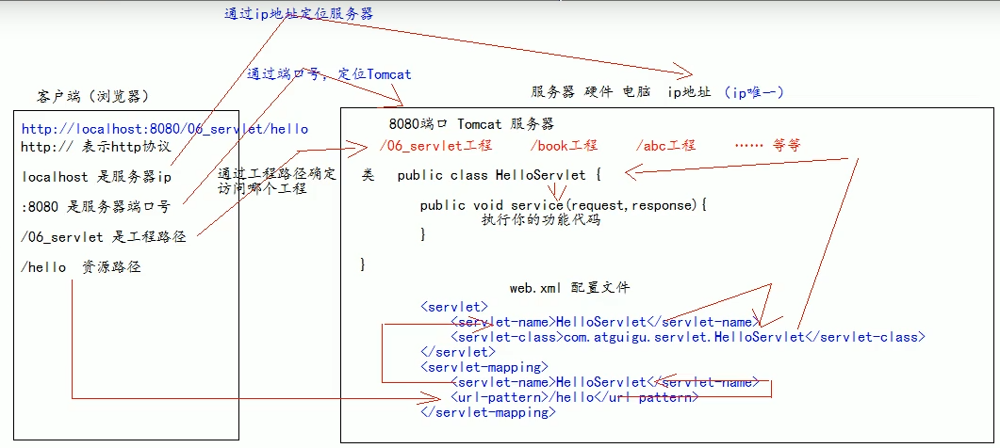


# 2、Servlet的基本使用

## 1）Servlet生命周期

1. 执行Servet构造器方法

2. 执行init初始化方法

   第1,2步，是在第一次访问的时候也就是创建servdet程序时调用。

3. 执行service方法

   第3步每一次访问都会执行。

4. 执行destroy销毁方法

   第4步在停止的时候才会执行。


## 2）get和post请求的分发处理

1. 区别：
   1. get是从服务器上获取数据。
   2. post是向服务器传送数据。 
2. service方法只有一个，但是请求有get与post两种，在service方法中需要对这两者进行区分
3. service方法有一个参数ServletRequest servletRequest，可以从中得到请求方式。
4. ServletRequest无法直接获取，但是使用子类型HttpServletRequest的getMethod方法获取请求类型。

~~~java
public void service(ServletRequest servletRequest, ServletResponse servletResponse) throws ServletException, IOException {
    System.out.println("hello Servlet！");
    // 类型转换（因为它有 getMethod()方法） 
    HttpServletRequest httpServletRequest = (HttpServletRequest) servletRequest;
    // 获取请求的方式 
    String method = httpServletRequest.getMethod();
    if ("GET".equals(method)) {
        doGet();
    } else if ("POST".equals(method)) {
        doPost();
    }
}

private void doPost() {
    System.out.println("get方法被访问！");
}

private void doGet() {
    System.out.println("post方法被访问！");
}
~~~


## 3）通过继承HttpServlet类实现servlet程序

1.  一般在项目中，很少会通过实现servlet接口实现servlet程序，而是通过继承HttpServlet类实现
   编写一个类去排承HttpServlet类
2. 根据业务需要重写doGet或doPost方法
3. 到web.xml中的配Servet程序的访问地址

```java
public class Servlet2 extends HttpServlet {
    protected void doPost(HttpServletRequest request, HttpServletResponse response) throws ServletException, IOException {

    }

    protected void doGet(HttpServletRequest request, HttpServletResponse response) throws ServletException, IOException {

    }
}
```

## 4）使用IDEA创建Servlet程序

1. 选中包，右击---->Create New Servlet


## 5）Servlet继承体系

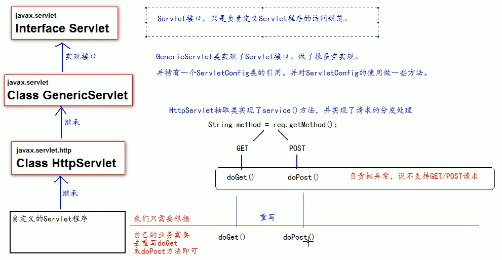


## 6）ServletConfig类

1. 是Servlet 程序的配置信息类。 
2. Servlet 程序和 ServletConfig 对象都是由 Tomcat 负责创建，我们负责使用。 
3. Servlet 程序默认是第一次访问的时候创建，ServletConfig 是每个 Servlet 程序创建时，就创建一个对应的 ServletConfig 对象。
4. 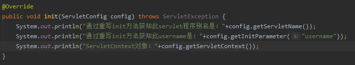

三大作用：

1. 可以获Servet程序的别名servet-name的值

2. 获取初始化参数init-param：在web.xml中配置，使用getInitParameter方法获取

3. 获取ServetContext对象：在init方法中使用config.getServletContext()获取

   ~~~java
   @Override
   public void init(ServletConfig config) throws ServletException {
       // 重写init方法时一定要调用父类的init方法。
       super.init(config);
       System.out.println("Servlet别名：" + config.getServletName());
       System.out.println("配置的初始化参数：" + config.getInitParameter("username"));
       System.out.println(config.getServletContext());
   }
   ~~~

   ~~~xml
   <servlet>
       <servlet-name>Servlet2</servlet-name>
       <servlet-class>com.gu.Servlet2</servlet-class>
       <!--init-param是初始化参数-->
       <init-param>
           <!--参数名-->
           <param-name>username</param-name><!--参数值-->
           <param-value>097</param-value>
       </init-param>
   </servlet>
   ~~~


## 7）ServletContext类：

1. SenvetContext是一个接口，它表示Servlet上下文对象

2. 一个web工程，只有一个ServletContext对象实例。

3. ServletContext是一个域对象

4. 什么是域对象?

   域对象，是可以像Map一样存取数据的对象，叫域对象。这里的域指的是存取数据的操作范围。

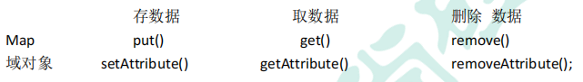


## 8）ServletContext类的四大作用

1. 获职web.xml中配置的上下文参数context-param

   context-param是一个上下文参数，全局都可以调用，属于整个web工程，可以配置多组

   ```xml
   <context-param>
       <param-name>pass</param-name>
       <param-value>123456</param-value>
   </context-param>
   
   <context-param>
       <param-name>user</param-name>
       <param-value>097</param-value>
   </context-param>
   ```

   ~~~java
   ServletContext servletContext = config.getServletContext();
   servletContext.getInitParameter("pass");
   ~~~

2. 获取当前的工程路径,格式:/工程路径

   ~~~ java
   System.out.println("当前路径：" + servletContext.getContextPath());
   ~~~

   获取的路径是相对于服务器的，也就是http://localhost:8080/untitled1的/untitled1

3. 获取工程部署后在服务器硬盘上的绝对路径

   ~~~java
   System.out.println("绝对路径：" + servletContext.getRealPath("/"));
   ~~~

   获取的部署路径默认是页面所在的物理路径

4. 像Map一祥存取数据


# 3、Http协议基本了解

## 1）基本介绍

1. 所谓HTTP协议，就是指，客户端和职务器之间通信时，发送的数据，需要遵守的规则，叫HTTP协议。HTTP协议中的数据又叫报文。
2. 客户端给服务器发送数据叫请求。
3. 服务器给客户端回传数据叫响应。
4. 请求有两种，get请求与post请求


## 2）get请求

1. 请求行：GET /06_servlet/a.html HTTP/1.1

2. 1. 请求的方式：GET
   2. 请求的资源路径：/06_servlet/a.html
   3. 请求的协议和版本号：Http/1.1

3. 请求头

4. 1. 由key:value组成，不同的键值对表示不同的含义。

   2. 1. 例如：Host: loclhost:8080表示请求的服务器ip和端口号

   3. 1. accept：image/jpeg告诉服务器可以接收的数据类型

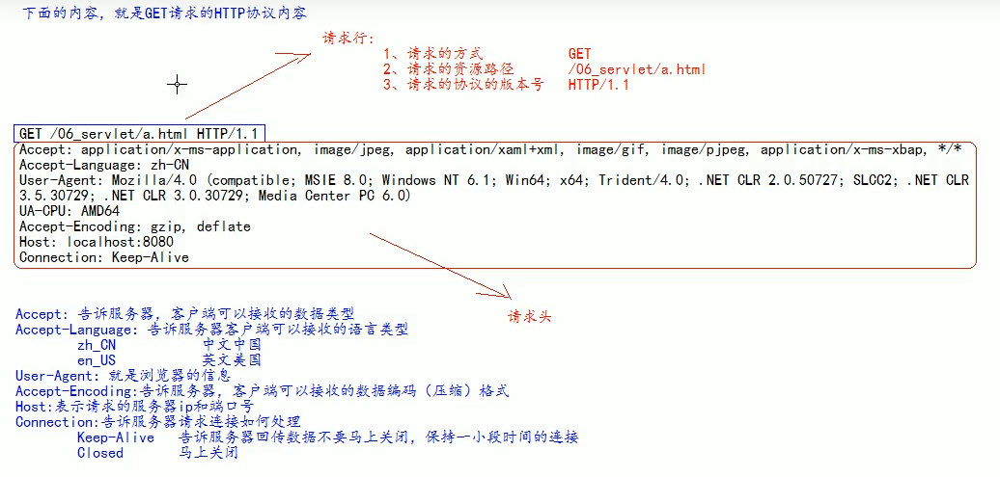


## 3）POST请求

1. 请求行：POST /06_servlet/a.html HTTP/1.1

2. 1. 请求的方式： POST
   2. 请求的资源路径：/06_servlet/a.html
   3. 请求的协议和版本号：Http/1.1

3. 请求头：由key:value组成，不同的键值对表示不同的含义。

4. 空行

5. 请求体：发送给服务器的数据

也就是说，相对GET请求，多了一个空行，与一个请求体

POST请求格式：

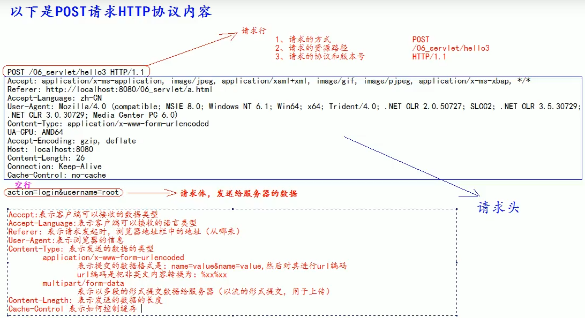


## 4）常用的请求头说明
1. Accept:表示客户溪可以接收的数据类型
2. Accpet-Languege:表示客户端可以挨收的语言类型
3. User-Agent:表示客户溪浏览器的信息
4. Host:表示请求时的服务器p和端口号


## 5）常用的GET请求与POST请求

1. GET请求有哪些？

   1. form标签method=get
   2. a标签
   3. link标签引入css
   4. Script标签引入s文件
   5. img标签引入图片
   6. iframe 引A html页面
   7. 在浏览器地址栏中输入地址后敲回车

2. POST请求有哪些？

   1. form标签method=post

   

## 6）响应的格式

1. 响应行

2. 1. 响应的协议和额本号
   2. 响应状态码
   3. 响应状态描述符

3. 响应头

4. key :     walue----->不同的响应头，有其不同含义

5. 空行

6. 响应体---->就是回传给客户端的数据

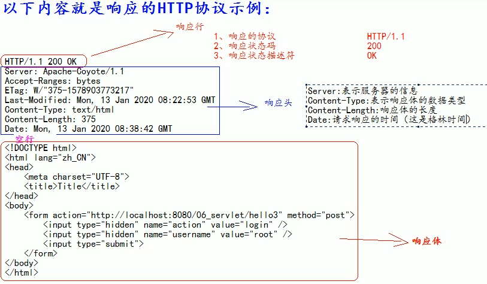


##  7）常用的响应码说明

1. 200：表示请求成功

2. 302：表示请求重定向

3. 404：表示请求服务器已经收到了，但是你要的数据不存在《请求地址错误》

4. 500：表示服务器已经收到请求，但是服务器内部错误（代码错误）


## 8）MIME类型说明

1. 1. MIME是 HTTP协议中数据类型。
   2. MIME的英文全称是"Multipurpose      Internet      MailExtensions”多功能Internet邮件扩充服务。MIME类型的格式是“大类型/小类型”,并与某一种文件的扩展名相对应。


## 9）HttpServletRequest类

1. 作用：

   每次只要有请求进入Tomcat服务器，Tomcat服务器就会把请求过来的ITTP协议信息解析好时装到Request对象中。然后传递到service方法 ∶ doGet和 doPost中给我们使用。我们可以通过HttpserletRequest对象，获取到所有请求的信息。

2. 常用函数

   1. *req*.getRequestURI();获取请求的资源路径
   2. *req*.getRequestURL();获取请求的资源绝对路径
   3. *req*.getRemoteHost(); 获取客户端的ip地址
   4. *req*.getHeader(Strings);获请求头
   5. *req*.getParameter(Strings);获取请求参数
   6. *req*.getParameterMap()，*req*.getParameterValues(String s);获取请求参数（多个值的时候使用）
   7. *req*.getMethod();获取请求的防暑
   8. *req*.getAttribute(Stringkey);获取域数据
   9. *req*.setAttribute(Stringkey,objectvalue);设置域数据
   10. *req*.getRequestDispatcher(Strings);获取请求转发对象

3. 使用*req*.setCharacterEncoding("UTF-8")设置请求体的字符集为UTF-8，从而解决post请求的中文乱码问题，在获取请求参数之前调用才有效


## 10）请求转发

请求转发必须要以斜杠打头，/ 斜杠表示地址为：**http://ip:port/**工程名/ , 映射到IDEA代码的**web目录** 

~~~java
protected void doGet(HttpServletRequest request, HttpServletResponse response) throws ServletException, IOException {
    // 实现跳转
    RequestDispatcher dispatcher = request.getRequestDispatcher("/hello");
    dispatcher.forward(request, response);
}
~~~

请求到Tomcat服务器后，根据web.xml以及请求路径寻找Servlet程序处理，Servlet1程序处理完成后可以将请求转发给下一个Servelt程序，直到最后一个Servlet程序处理完成，发送响应。

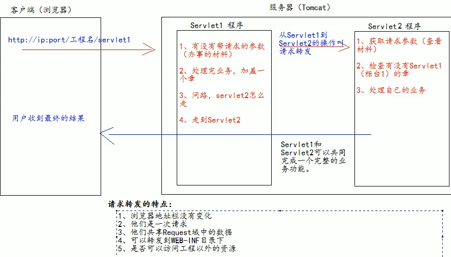


## 11）base标签

1. 作为a标签等的跳转基准。

2. 使用请求转发来实现跳转的时候，浏览器地址栏的地址是指向servlet程序的地址，而使用a标签跳转浏览器的地址指向的是要跳转到的html页面的地址，这是导致没有base标签无法正确跳转的原因。

3. 请求转发：*req*.getRequestDispatcher("./aht/b.html").forward(*req*,*resp*);

4. 在实际开发中，路径都使用绝对路径，而不简单的使用相对路径。 

   1、绝对路径 

   2、base+相对 


# 4、Servlet深入了解

## 1）斜杠的作用

1. 在web页面中是一种绝对路径：http://ip:port/

2. 如果被服务器解析，则是：http://ip:port/工程名/

   ~~~java
   1. <servlet>/test2</servlet>  http://ip:port/工程名/
       
   2. servletContext.getRealPath("/");   http://ip:port/工程名/
   
   3. req.getRequestDispatcher("/");  http://ip:port/工程名/
   
   4. 特殊情况：resp.sendRedirect("/")，请求重定向，斜杠的意思是http://ip:port/
   ~~~

   

## 2）**HttpServletResponse** 类

1. HttpServletResponse类的作用

2. 1. HttpServletResponse类和HttpServletRequest类一样。每次请求进来，Tomcat服务器都会创建一个Response对象传递给servlet程序去用。HttpServletRequest表示请求过来的信息，HttpservletResponse表示所有响应的信息，
   2. 我们如果需要设置返回给客户端的信息，都可以通过HttpServietResponse对象来进行设置。
   3. **传递信息使用字节流与字符流resp.getOutputStream()以及resp.getWriter()，但是这两个流不能同时使用。**
   4. 使用字符流回传数据简单示例：注意中文乱码问题

3. ~~~java
   //设置服务器字符集为utf-8
   resp.setCharacterEncoding("UTF-8");
   //设置浏览器字符集为UTF-8
   resp.setHeader("Content-type","text/html;charset=UTF-8");
   
   //以上两句代码可以使用下列代码替代,可以同时设置服务器与浏览器的字符集
   //此方法必须要在获取流对象之前调用才有效
   resp.setContentType("text/html;charset=UTF-8");
   System.*out*.println(*resp*.getCharacterEncoding());
   
   //获取字符流并传输字符
   PrintWriter writer=resp.getWriter();
   writer.write("helloworld!哈哈哈");
   ~~~


## 3）请求重定向

1. 请求重定向，是指客户端给服务器发请求，然后服务器告诉客户端说。我给你一些地址。你去新地址访问。叫请求重定向（因为之前的地址可能已经被废弃）。

   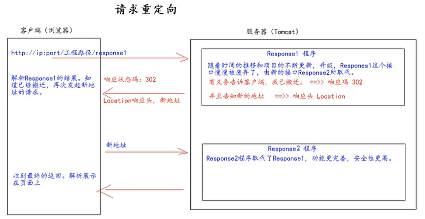

   2. 请求重定向的特点:
      1. 浏览器地址栏会发生变化
      2. 两次请求
      3. 不共享Request域中数据
      4. 不能访问WEB-INF下的资污
      5. 可以访问工程外的资源
   3. 重定向本质相当于服务页面向s1程序发送访问请求，但是s1程序以及重定向，于是给了客户端浏览器一个新的地址，浏览器会再次发出请求访问新的地址


# 5、java ee体系


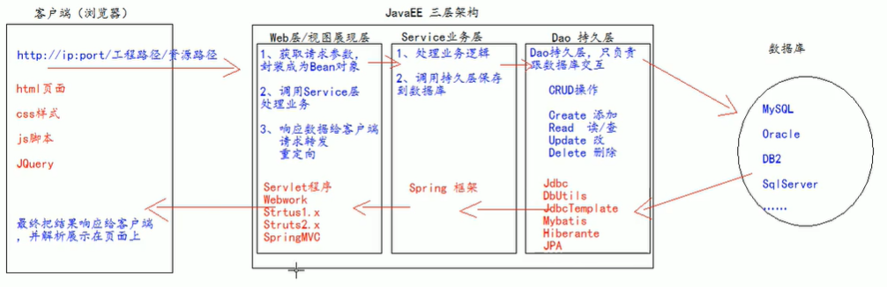


# 6、文件上传

1. 基本步骤：

   1. 要有一个form标签,       method=post请求

   2. form标签的encType属性值必须为multipart/form-data值

   3. 在form标签中使用input       type=file添加上传的文件

   4. 编写服务器代码(Servlet程序)接收，处理上传的数据。

      ~~~jsp
        <form action="/servlet2" method="post" enctype="multipart/form-data">
          用户名：<input type="text" name="username"/></br>
          头像：<input type="file" name="photo"/>
          <input type="submit" value="上传"/>
        </form>
      ~~~

      ```java
      ServletInputStream inputStream = request.getInputStream();
      
      byte[] buffer = new byte[1024];
      int k;
      while ((k = inputStream.read(buffer)) != -1) {
          System.out.println(new String(buffer));
      }
      ```

   

2. 上传文件时的http协议内容：因为要以流的方式发送与接收，所以使用request.getParam()方法无法获取username、photo等信息。所以需要用到解析工具包解析报文。

   使用流接收时收到的是所有请求体：

   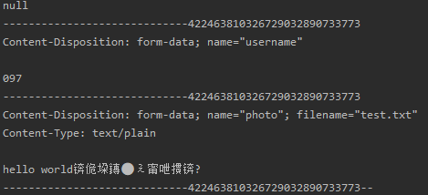

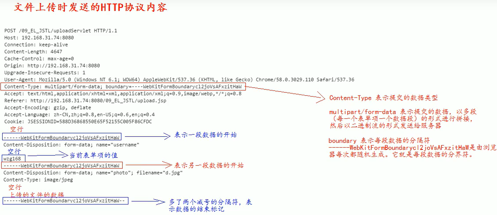


对上传文件时服务器收到的信息进行解析用到的jar包

需要用到的jar包是commons-fileupload-1.4.jar，需要提前导入。

commons-fileupload-1.4.jar依赖于commons-io-2.8.0.jar，也需要提前导入。


commons-fileupload-1.4.jar常用的类与方法：
1. **ServletFileUpload**类：用于解析上传的数据

2. ServletFileUpload.**isMultipartContent**(HttpServletRequest request); 用于判断上传的数据是否是多段的，不是则无法解析。

   ~~~java
   boolean ServletFileUpload.isMultipartContent(HttpServletRequest request); 
   ~~~

3. public List\<Fileltem\> parseRequett(HttpServletRequest request)：解析上传的数据得到多个FIleItem组成的List

4. FIleItem类：表示每一个表单项

5. boolean FileItem. isFormField() ：用于判断当前表单项是否是普通表单项，true为普通表单项，false为上传的文件表单项

6. String FileItem. getFieldName() ：获取表单项的name值

7. String FileItem. getFieldString() ：获取表单项的值

8. String FileItem. getName() ：获取上传的文件名

9. void FileItem.write( file ) ：将上传的文件写到参数file所指向抽硬盘位置。

~~~java
try {
    // 创建FIleItemFactory实现类
    FileItemFactory fileItemFactory = new DiskFileItemFactory();
    // 创界用于解析上传数据的工具类ServletFileUpload
    ServletFileUpload servletFileUpload = new ServletFileUpload(fileItemFactory);
    // 解析上传的数据，获取每一个表项
    List<FileItem> list = servletFileUpload.parseRequest(request);
    // 循环处理每一个表项
    for (FileItem fileItem : list) {
        if (fileItem.isFormField()) {// 普通表单项
            System.out.println("表单项的name属性值：" + fileItem.getFieldName());
            // 参数UTF-8解决乱码问题
            System.out.println("表单项的值：" + fileItem.getString("UTF-8"));
        }else {// 上传的是文件
            System.out.println("表单项的name属性值：" + fileItem.getFieldName());
            System.out.println("上传的文件名：" + fileItem.getName());
            fileItem.write(new File("/"+fileItem.getName()));
        }
    }
} catch (FileUploadException e) {
    e.printStackTrace();
}
~~~


# 7、文件下载

1. 步骤
   1. 获取要下载的文件名
   2. 读取要下载的文件内容
   3. 把下载的文件内容回传给客户端
   4. 在回传前，通过响应头告诉客户端返回的数据类型
   5. 还要告诉客户端收到的数据是用于下载使用(还是使用响应头)

~~~java
//1. 获取要下载的文件名
String downloadFileName = "/file/test.txt";
File file = new File(downloadFileName);
//2. 读取要下载的文件内容
ServletContext servletContext = getServletContext();
//创建输入流
InputStream resourceInputStream = servletContext.getResourceAsStream(file.getPath());
//4. 在回传前，通过响应头告诉客户端返回的数据类型
//获取文件类型
String mimeType = servletContext.getMimeType(file.getPath());
response.setContentType(mimeType);
//5. 还要告诉客户端收到的数据是用于下载使用(还是使用响应头)
//content-Disposition响应头，表示收到的数据怎么处理
//attachment表示附件，下载使用
//filename=文件名
response.setHeader("content-Disposition", "attachment;filename=" + file.getName());

//3. 把下载的文件内容回传给客户端
//获取输出流
OutputStream outputStream = response.getOutputStream();
// 读取输入流中的数据，复制给输出流
IOUtils.copy(resourceInputStream, outputStream);
~~~


url编码：如果下载的文件名需要是中文时，那么正常情况下会出错，因为http协议不支持中文，仅支持ASCII字符，这个时候就需要url编码。

1. 1. **作用与原理：**通过把汉字转化为%xx%xx的形式，解决汉字无法识别的问题。

2. 1. 使用示例：在设置响应头时，将文件名修改为url编码的形式。

   2. 1. URLEncoder.encode(原文件名，“原文件名使用的编码”)；

~~~java
response.setHeader("content-Disposition", "attachment;filename=" + URLEncoder.encode(file.getName(),"UTF-8"));
~~~


Base64编码：如果使用的是**火狐浏览器**，不支持url编码，需要使用Base64编码。

1. 1. 编码操作示例：

      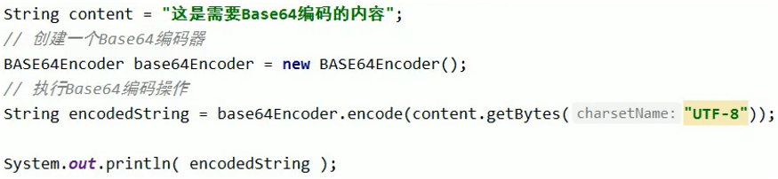

   2. 解码操作示例：

2. 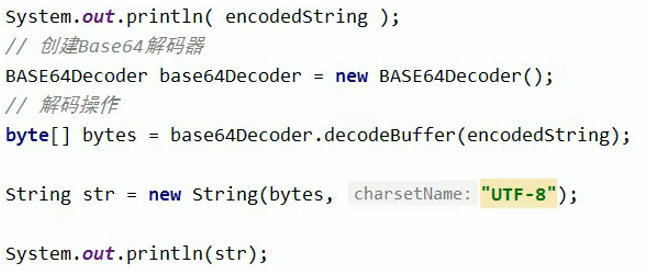


同时火狐浏览器

```java
"filename==?UTF-8?B?" + new Base64Encoder().encode("中国.jpg".getBytes(charsetName: "UTF-8")) + "?=");
```

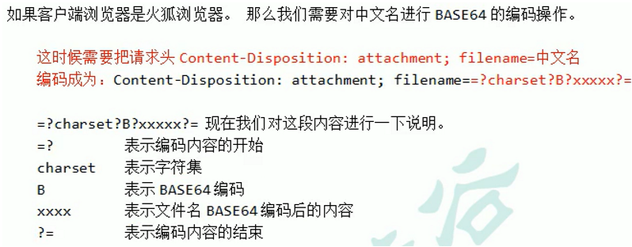

不同浏览器需要的编码不用，这里需要考虑到兼容问题。

1. 通过请求头，判断浏览器类型是不是火狐浏览器。

2. 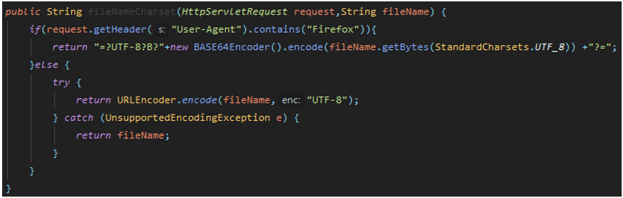


# 8、Cookie

## 1）基本信息：

1. Cookie**是服务器通知客户端保存键值对的一种技术。**
1. 客户端有了cookie后，每次请求都发送给服务器。
1. **每个cookie 的大小不能超过4kb**


## 2）cookie的基本操作：

1. 创建cookie

~~~java
1.//创建cookie
2. Cookie cookie=new Cookie("key1","cookie");
3. //提醒浏览器保存cookie
4. resp.addCookie(cookie);
~~~
2. 获取cookie：

   ~~~java
   req.getCookies()：返回cookie数组
   ~~~

3. 修改cookie：方案一是用新的Cookie覆盖旧的Cookie，方案二是得到旧的Cookie修改之后覆盖旧的Cookie。

```java
//方案一
Cookie cookie = new Cookie("key1", "value1");
response.addCookie(cookie);

//方案二
for (Cookie cookie1 : request.getCookies()) {
    if (cookie1.getName().equals("key1")) {
        cookie1.setValue("value1");
        response.addCookie(cookie1);
        return;
    }
}
```


## 3）cookie生命控制

1. cookie生命控制：使用setMaxAge(int     age)设置，参数age是秒数

2. 1. 正数,表示在指定的秒数后过期
   2. 负数,表示浏览器一关，Cookie就会被删除（默认）
   3. 零，表示马上删除cookie、

## 4）cookie有效路径

Path：Cookie的path属性可以有效的过滤哪些cookie可以发送给服务器。哪些不发path属性是通过请求的地址来进行有效的过滤。

请求地址如果在cookie的path之下，那么，此cookie可以发送给服务器。

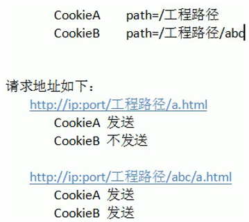

1. 默认path就是当前工程路径
2. 可以通过cookie.setPath()设置，     req.getContextPath()可以获取当前工程路径


## cookie的应用之免用户名登陆

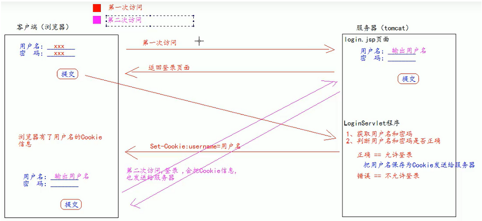

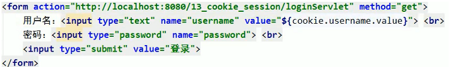

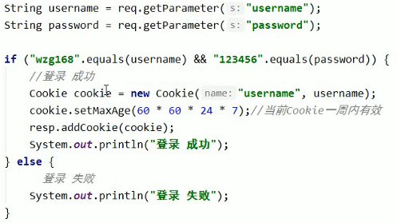


# 9、Session

## 1）基本信息：

1.  Session就一个接口（Httpsession ) 。
2.  Session就是会话。它是用来维护一个客户端和服务器之间关联的一种技术。
3.  每个客户端都有自己的一个session 会话。
4.  Session会话中,我们经常用来保存用户登录之后的信息。
5.  保存于服务器上。
6.  每个会话都有一个身份证号。也就是ID值。而且这个ID是唯一的。getld()得到session的会话id值。


## 2）Session基本操作

1. 如何创建和获取Session：它们的API是一样的。request.getSession()。第一次调用是创建Session会话，之后调用都是获取前面创建好的Session会话对象。可以使用isNew()方法判断到底是不是刚创建出来的。
2. 可以通过方法生成SessionID

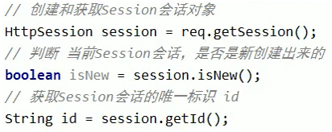

3. 向session域中存取数据：

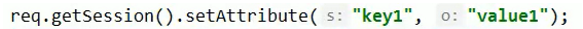

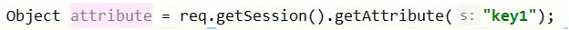


## 3）session生命周期

1. 以秒为单位，与cookie类似
2. **默认时长为1800秒**，即30分钟。因为在Tomcat服务器的配置文件web.xml中默认有以下的配嚣,它就表示配置了当前Tomcat服务器下所有的session超时配置默认时长为:      **30分钟**。

~~~xml
<session-config>
    <session-timeout>30</session-timeout>
</session-config>
~~~

2. 如果说。你希望你的web工程，默认的session的超时时长为其他时长。你可以在你自己的web.xml配置文件中做以上相同的配置。就可以修改你的web工程所有seession 的默认超时时长。

3. 如果你想只修改个别session的超时时长。就可以使用方法**setMaxInactiveInterval(int interval)**来进行单独的设置。

4. session.setMaxInactivelnterval(int interval)单独设置超时时长。

5. 超时：**指客户端两次请求之间的最大时长。**这是与cookie的区别之一。

6. 值为正数的时候,设定session的超时时长。

7. 负数表示永不超时(极少使用)。

8. 1. session.setMaxInactivelnterval(int interval):设置session超时时间
   2. public int  getMaxinactivelnterva()获取session的超时时间
   3. public void invalidate()让当前session会话马上超时无效。

9. 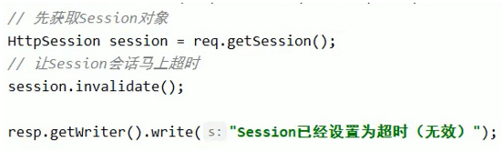

10. 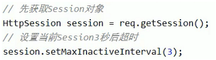


## 4）浏览器与session之间的关联

问题，session在生命周期是可以一直存活在服务器内存里的，为什么客户端的浏览器关闭再开启之后，客户端与服务器之间的session就改变了呢？

答：因为服务器与客户端的session关联是通过cookie的传递达到的。每一次新的连接，客户端发送的请求中的cookie中，都不含session的id信息，服务器都会自己创建一个新的session，并通过保存cookie的方式发送给客户端。之后的连接中，客户端对于浏览器的请求中都会包含有之前已经创建的session的id，服务器都会通过此找到对应的session。

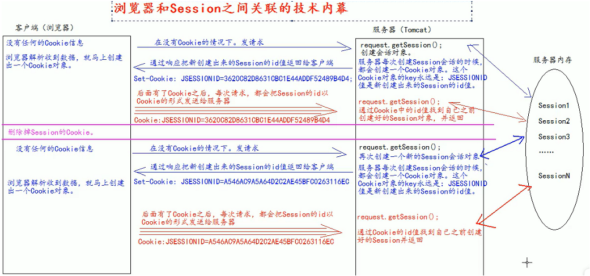


## 总结

1. session技术,底层其实是基于cookie技术来实现的。
2. 应用场景：显示用户的登陆信息，注销登陆等等。其基本作用就是保持服务器与客户端的稳定准确的连接。


# 10、Filter

## 1）基本流程与重要方法

1. 编写一个类去实现 Filter接口
2. 实现过滤方法doFilter()
3. 到 web.xml中去配置Filter的拦截路径
4. doFilter方法：专门用于拦截请求，可以做权限检查。
5. 过滤器做简单的登陆检测，登陆了就保存sessionID，不登录就跳转到login.jsp

```java
public class Servlet2 extends HttpServlet {
    protected void doPost(HttpServletRequest request, HttpServletResponse response) throws ServletException, IOException {
        
    }

    protected void doGet(HttpServletRequest request, HttpServletResponse response) throws ServletException, IOException {
        response.setContentType("text/html;charset=UTF-8");
        HttpSession session = request.getSession();
        // 保存sessionID
        session.setAttribute(session.getId(),"user"+new Date().getTime());
        
        //登陆成功跳转到index页面
        request.getRequestDispatcher("/index.jsp").forward(request, response);
    }

    @Override
    public void init(ServletConfig config) throws ServletException {
        super.init(config);
    }
}
```

```java
public void doFilter(ServletRequest req, ServletResponse resp, FilterChain chain) throws ServletException, IOException {

    HttpServletRequest request = (HttpServletRequest) req;

    HttpSession session = request.getSession();
    Object user = session.getAttribute(session.getId());
    
    //没有登陆就不通过，调到login页面
    if (user == null) {
        request.getRequestDispatcher("/login.jsp").forward(req, resp);
        return;
    }

    chain.doFilter(req, resp);
}
```

6. 在web.xml中配置过滤器：

~~~xml
<!-- filter标签用于配置一个filter过滤器 -->
<filter>
    <!-- 起名 -->
    <filter-name>AdminFilter</filter-name>
    <!-- 配置全类名 -->
    <filter-class>com.gu.MyFilter</filter-class>
</filter>

<!-- 配置拦截路径 -->
<filter-mapping>
    <!-- 指向别名 -->
    <filter-name>AdminFilter</filter-name>
    <!-- 拦截路径 -->
    <url-pattern>/index.jsp</url-pattern>
</filter-mapping>
~~~


## 2）FilterConfig类

FilterConfig类见名知义，它是Filter过滤器的配置文件类。Tomcat每次创建Filter 的时候，也会同时创建一个FilterConfig类，这里包含了Filter配置文件的配置信息。

类似于ServletConfig类。

主要方法有：

1. 获取Filter的名称filter-name的内容：filterConfig.getFilterName();

2. 获取在Filter中配置的init-param初始化参数：filterConfig.getInitParameterNames("username");

   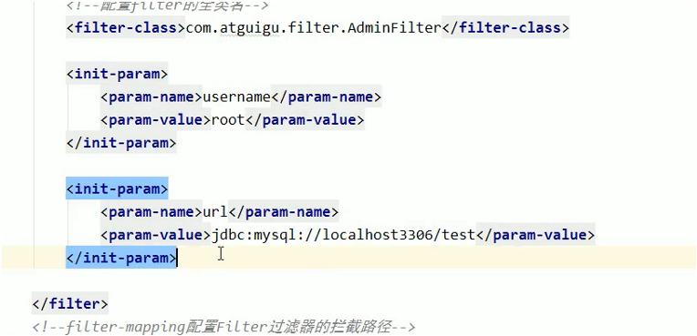

3. 获取ServletContext对象：filterConfig.getServletContext();


## 3）FIlterChain

1. filterChain：过滤器链，多个过滤器如何一起工作。
2. filter1先处理后，通过chain.doFilter()把请求交给下一个过滤器处理，直到最后一个匹配的过滤器。
3. 最后一个匹配的过滤器的chain.doFilter()不是交给下一个过滤器（因为是最后一个），而是把请求交给目标资源。
4. 所以有一个过滤器没有chain.doFilter()代码，请求都无法到达资源。
5. 在多个Filter过滤器执行的时候,它们执行的优先顺序是**由他们在web.xml中从上到下配置的顺序**决定!!!
6. **所有filter和目标资源默认都执行在同一个线程中**
7. **多个Filter共同执行的时候,它们都使用同一个Request对象。**

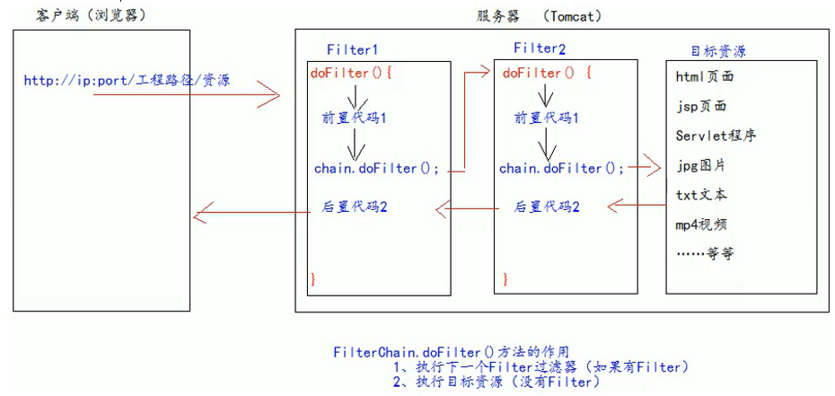


## 4）FIlter的拦截路径

FIlter的拦截路径：

1. 精确匹配：表示拦截某个目录下的某个文件，例如下面代码拦截http://ip:port/工程路径/login.jsp

~~~xml
<url-pattern>/login.jsp</url-pattern>
~~~

2. 目录匹配：表示拦截某个目录下的某个目录，例如下面代码拦截http://ip:port/工程路径/aht/*

```
<url-pattern>/aht/*</url-pattern>
```

3. 后缀名匹配：表示拦截某个目录下的某个类型的文件，例如下面代码拦截http://ip:port/工程路径/所有html文件

```
<url-pattern>*.html</url-pattern>
```

1. 注意：后缀名匹配不能以斜杠/开头
2. **Filter只关心匹配的目录是什么，不关心要过滤的目录、文件等存不存在。**


# 11、Json

## 1）基本介绍

JSON：json是一种轻量级的数据交换格式。由大括号，引号，键值对组成

~~~json
var a=13;
var jsonObj={
    "key1":12,
    
    "key2":"value",
    
    "key3":true;
    
    "key4":[11,"yes",false],

    "key5":a,

    "key6":{
        "key1":12,
        "key2":"value"
	}
}
~~~


## 2）在js中的使用

1. JSON数据取出：点方式访问

2. JSON的遍历：与遍历其它对象类似。

   for(var i=0;i<jsonObj.length;i++){}

3. JSON转字符串：JSON有两种存在格式：字符串与JSON对象。

4. JavaScript中Json对象与json字符串互转：

   1. JSON.stringify()：把json对象转换成为 json字符串

   2. JSON.parse()：把json字符串转换成为json对象

   3. —般我们要操作json.中的数据的时候，需要json对象的格式。

   4. 一般我们要在客户端和服务器之间进行数据交换的时候，使用json字符串。

   5. 使用示例：

      ~~~javascript
      JSON.stringify(jsonObj)
      JSON.parse(JSON.stringfy(jsonObj))
      ~~~


## 3）在java中的使用：

1. 1. 导入jar包：hamcrest-core-1.3.jar与junit-4.12.jar，
   2. 工具包：gson.jar
   3. Json字符串与javabean、List、map等的互转：

2. Gson.toJson(Object object)：将任意对象转换为json字符串

3. gson.fromJson(String s,Object.class):将json字符串转为某个对象

4. javaBean与Json的互转：

   ~~~java
   Person person=new Person("097","GGY");
   Gson gson=new Gson();
   
   //javabean转json字符串
   String jsonPerson=gson.toJson(person);
   System.out.println(jsonPerson);
   
   //json字符串转javabean
   Person person1=gson.fromJson(jsonPerson,Person.class);
   System.out.println(person1.toString());
   ~~~

5. 1. List与json的互转：在json字符串转回List集合时，不能直接使用class或者getClass()，需要新定义一个类x，这个x需要继承TypeToken<>，<>里面是我们需要转成的List集合类，例如 class x extends     TypeToken<ArrayList<person>>,然后利用new x().getType()作为第二个参数。当然，最好的方法是使用匿名内部类：new     TypeToken<List<Person>>(){}.getType()

   ~~~java
   List<Person> list=new ArrayList<Person>();
   list.add(new Person("1","person1"));
   list.add(new Person("2", "person2"));
   list.add(new Person("3", "person3"));
   list.add(new Person("4,", "person4"));
   
   //list转json字符串
   String jsons=new Gson().toJson(list);
   System.out.println(jsons);
   
   //json字符串转list
   List<Person> list1=new Gson().fromJson(jsons,new TypeToken<List<Person>>(){}.getType());

6. json字符串与Map的互相转换：

   ~~~java
   Map<Integer, String> map=new HashMap<>();
   map.put(1, "value1");
   map.put(2, "value2");
   map.put(3, "value3");
   map.put(4, "value4");
   
   //map转json字符串
   String jsonmap=new Gson().toJson(map);
   System.out.println("maoToJason: "+jasonmap);
   
   //json字符串转map
   Map<Integer, String> map1 = new Gson().fromJson(jsonmap, new TypeToken<HashMap<Integer, String>>() {}.getType());
   ~~~


# 12、Ajax

## 1）基本介绍

1. ajax是一种浏览器通过js异步发起请求。局部更新页面的技术。
2. 使用原生的javascript发起AJAX请求：


## 2）基本操作

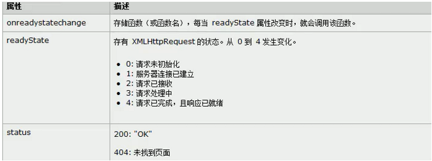

调用open方法设置请求参数:open(method,url,async)

method:请求的类型,GET或POST

url:文件在服务器上的位署

async: true(异步)或false(同步)

3、调用send方法发送请求:send(String):将请求发送到服务器

4、在send方法前绑定onreadystatechange事件，处理请求完成后的操作。

注意：当出现status为0时，注意此时的html页面访问是不是http协议。

~~~javascript
<script type="text/javascript">
    
window.onload=function () {
    document.getElementsByTagName("button")[0].onclick=function () {
    	testAjax();
    };
};

function testAjax() {
    // 1、创建XMLHttpRequest
    let xmlHttpRequest=new XMLHttpRequest();
    // 2、调用open方法设置请求参数
    xmlHttpRequest.open("GET","http://localhost:8080/untitled1/testAjax?action=JavascriptTestIt",true);
    // 4、在send方法前绑定onreadystatechange事件，处理请求完成后的操作。
    xmlHttpRequest.onreadystatechange=function () {
        if (xmlHttpRequest.readyState === 4 && xmlHttpRequest.status === 200) {
            let nn=document.createElement("div");
            let jsonObj=JSON.parse(xmlHttpRequest.responseText);
            nn.innerHTML="id="+jsonObj.id+"<br/>name="+jsonObj.name;
            let but=document.getElementsByTagName("button")[0];
            but.parentNode.insertBefore(nn,but);
        }
    };
    // 3、调用send方法发送请求
    xmlHttpRequest.send();
}

</script>
~~~

~~~java
protected void JavascriptTestIt(HttpServletRequest req, HttpServletResponse resp) throws ServletException, IOException {
    resp.setContentType("text/html; charset=utf-8");
    System.out.println("收到AJAX请求！");
    Person person = new Person("097", "GGY");
    String personJson = new Gson().toJson(person);
    System.out.println(personJson);
    resp.getWriter().print(personJson);
}
~~~


## 3）Ajax的特点

1. 是一种局部更新。ajax是一种浏览器通过js 异步发起请求，局部更新页面的技术。

   局部更新：Ajax 请求的局部更新，浏览器地址栏不会发生变化局部更新不会舍弃原来页面的内容。

2. 异步与同步：

   某个ajax请求事件函数：如下

   ~~~javascript
   Function()｛
       //1、创建XMLHttpRequest
   
       //2、调用open方法设置请求参数:open(method,url,async)
   
       //3、调用send方法发送请求:send(String):将请求发送到服务器
   
       //4、在send方法前绑定onreadystatechange事件，处理请求完成后的操作。
   
       //其它操作代码dq。
   ｝
   ~~~

   **同步意味着，前面四步没有完全执行结束前，dq不能执行，**也就是说，没有收到服务器的返回数据将事件onreadystatechange执行完毕之前，dq处于未执行状态。异步则相反，即使onreadystatechange没有执行完毕，dq仍然可以执行。

   在Ajax请求过程中，推荐使用异步，这样其它功能代码不受数据交互的影响。


## 4）Jquey中的Ajax

### $.ajax

1. url：表示请求的地址

2. type：表示请求的类型GET 或 POST请

3. data：表示发送给服务器的数据

   格式有两种:

   一: name=value&name=value

   二: {key: value}

4. success：请求成功，响应的回调函数
5. dataType：响应传回客户端的的数据类型，三种，text字符串，xml，json

~~~javascript
$(function () {
    $("button#jqueryAjax").click(function () {
        $.ajax({
            url:"http://localhost:8080/untitled1/testAjax",
            data:"action=jqueryAjax",
            type:"GET",
            success:function (data) {
                $("#div1").html("key="+data.id+"  "+"value="+data.name);
            },
            dataType:"json"
        });
    });
});
~~~


### $.get()

 **\$.get(url, [data],     [callback], [type]):默认是get方式，是在$.ajax方法上封装得到的。**

1. url:待载入页面的URL地址
2. data:待发送 Key/value 参数。
3. callback:载入成功时回调函数。
4. type:返回内容格式，xml, html, script, json, text, _default。

使用示例：

~~~javascript
$("#jqueryGetAjax").click(*function* () {

 $.get("http://localhost:8080/untitled1/testAjax",
       "action=jqueryGetAjax",
       fn1,
       "json");
});
~~~


### $.getJSON()

jQuery.getJSON(url,     [data], [callback])：默认是get方式，数据返回类型是json，更进一步的封装

1. url:发送请求地址。
2. data:待发送 Key/value 参数。
3. callback:载入成功时回调函数。


### 其它

类似的还有$.post(),$.load()等等。

serialize()方法：serialize()可以把表单中所有表单项的内容都获取到，并以name=value&name=value     的形式进行拼接。
