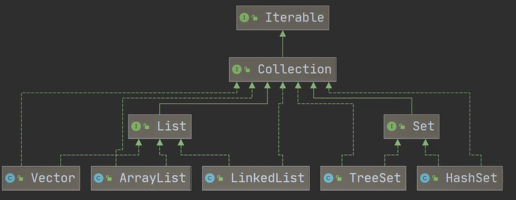
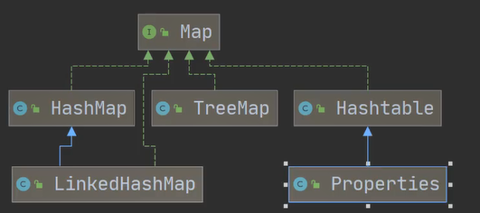
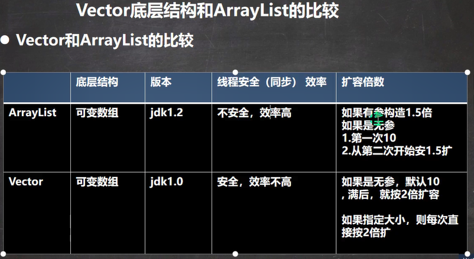
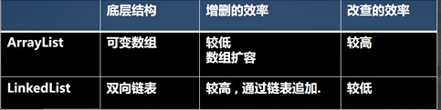
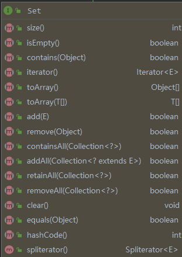
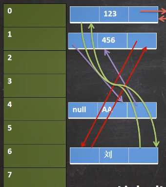
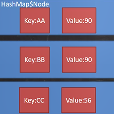
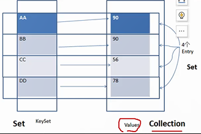
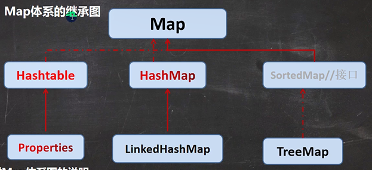
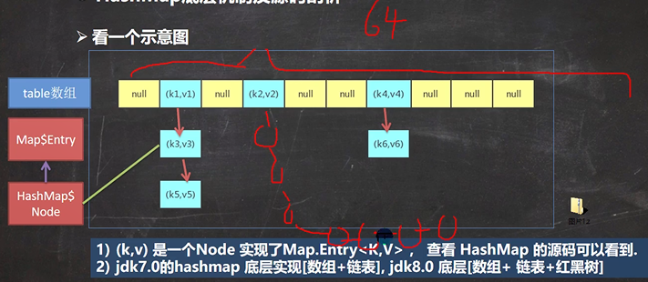

[toc]


# 1、为什么需要集合？

保存数据的需要。

数组有着诸多缺点：

1. 长度必须定义时指定，一旦指定，无法更改
2. 保存的必须是同意类型的元素
3. 使用数组进行增减数据比较麻烦


所以我们使用集合来动态保存任意多个对象，比较方便。


# 2、集合框架体系

1. 集合主要是两组(单列集合，双列集合)
2. Collection接口有两个重要的子接口 List Set，他们的实现子类都是**单列集合**
3. Map接口的实现子类是**双列集合**，存放的K-V

如下两张图：重要！




# 3、Collection接口

1. collection实现子类可以存放多个元素,每个元素可以是Object
2. 有些Collection的实现类,可以存放**重复的元素**,有些不可以
3. 有些Collection的实现类,有些是**有序的**(List),，有些不是有序(Set)
4. **Collection接口没有直接的实现子类,是通过它的子接口Set 和List来实现的**
5. 


## 4、Collection遍历方式

## Iterator

**但凡是实现了Iterable接口的类，都可以通过迭代器Iterator遍历。**

1. lterator对象称为迭代器,主要用于遍历Collection集合中的元素。所有实现了Collection接口的集合类都有iterator()方法,用以返回一个实现了lterator接口的对象,即可以返回一个迭代器。
2. lterator的结构.[看下图]
3. lterator仅用于遍历集合，lterator本身并不存放对象。
4. idea快捷使用Iterator：输入itit即可

常用api：

1. Iterator.hasNext()：返回值为boolean。用于判断当前指向的是不是最后一个元素，也就是是否含有next元素。
2. Iterator.next()：返回值为元素类型。两个作用：指针下移；返回下移后指向的元素。

```java
public static void main(String[] args) {
    Collection<Integer> list = new ArrayList<>();

    list.add(1);
    list.add(2);
    list.add(3);

    Iterator<Integer> iterator = list.iterator();

    while (iterator.hasNext()) {
        System.out.println(iterator.next());
    }
}
```

如果还要再遍历一遍，需要重置迭代器。


## For循环增强

1. 使用增强for，在Collection集合增强for
2. 底层仍然是迭代器
3. 增强for可以理解成就是简化版本的迭代器遍历

```java
public static void main(String[] args) {
    Collection<Integer> list = new ArrayList<>();

    list.add(1);
    list.add(2);
    list.add(3);

    for (Integer i : list) {
        System.out.println(i);
    }
}
```


# 4、List接口

三种实现类：

1. ArrayList：基于数组实现，线程不安全
2. LInkedList：基于链表实现
3. Vector：与ArrayList几乎相同， 但是线程安全效率较低，多线程时建议使用。


**三种遍历方式**

1. 迭代器Iterator
2. 增强for循环
3. 普通for循环


# 5、ArrayList

## 数据存放：

1. 把数据放在一个Object数组里，数组名叫做elementData。非私有，且使用transient关键字。

    ```java
    transient Object[] elementData; // 非私有以简化嵌套类访问
    ```

2. **为什么使用transient修饰elementData？**

    既然要将ArrayList的字段序列化（即将elementData序列化），那为什么又要用transient修饰elementData呢？

    回想ArrayList的自动扩容机制，elementData数组相当于容器，当容器不足时就会再扩充容量，但是容器的容量往往都是大于或者等于ArrayList所存元素的个数。

    比如，现在实际有了8个元素，那么elementData数组的容量可能是8x1.5=12，如果直接序列化elementData数组，那么就会浪费4个元素的空间，特别是当元素个数非常多时，这种浪费是非常不合算的。

    所以ArrayList的设计者将elementData设计为transient，然后**在writeObject方法中手动将其序列化，并且只序列化了实际存储的那些元素，而不是整个数组。**

    

## 构造器：

1. 指定初始容量：ArrayList(int InitialCapacity)，返回一个指定大小的空列表

    ```java
    public ArrayList(int initialCapacity) {
        if (initialCapacity > 0) {
            this.elementData = new Object[initialCapacity];
        } else if (initialCapacity == 0) {
            this.elementData = EMPTY_ELEMENTDATA;
        } else {
            throw new IllegalArgumentException("Illegal Capacity: "+
                                               initialCapacity);
        }
    }
    ```

2. 无参构造器：返回一个默认大小的空列表，默认大小为10。注意，这里给elementData初始化的数组如下，并不是一个大小为10的数组，而是一个空数组，这个数组会在后续第一次添加元素时被扩容为默认大小。

    源码中的注释是这么说的：共享空数组实例用于默认大小的空实例。我们将其与 EMPTY_ELEMENTDATA 区分开来，以了解在添加第一个元素时要膨胀多少。

```java
private static final int DEFAULT_CAPACITY = 10;
private static final Object[] DEFAULTCAPACITY_EMPTY_ELEMENTDATA = {};
public ArrayList() {
    this.elementData = DEFAULTCAPACITY_EMPTY_ELEMENTDATA;
}
```


## 扩容

1. **扩容时机**：当数组满了，又想添加型元素时，会进行扩容

2. **初始化：**当创建ArrayList对象时，如果使用的是无参构造器，则初始elementData容量为0，**第1次添加，则扩容elementData为10**，如需要再次扩容，则扩容elementData为1.5倍。10---->15---->22---->33。

    如果使用的是指定大小的构造器，则初始elementData容量为指定大小,如果需要扩容,则直接扩容elementData为1.5倍。

    ```java
    int oldCapacity = elementData.length;
    int newCapacity = oldCapacity + (oldCapacity >> 1);
    ```

3. **扩容方式**：扩容的时候，会以新的容量建一个原数组的拷贝，修改原数组，指向这个新数组，原数组被抛弃，会被GC回收。

    ```java
    elementData = Arrays.copyOf(elementData, newCapacity);
    ```

    


## 添加元素与扩容

源码：

```java
/*
*添加元素：首先确定数组的大小是否合适，如果不足就扩容，否则，就elementData[size]=e。
*/
public boolean add(E e) {
    //确定数组的大小是否合适，如果不足就扩容
    ensureCapacityInternal(size + 1);  // 增加模组数
    elementData[size++] = e;
    return true;
}
```

```java
//确定数组大小是否合适，不足就扩容，参数是size+1
private void ensureCapacityInternal(int minCapacity) {
    ensureExplicitCapacity(calculateCapacity(elementData, minCapacity));
}
```

```java
//计算扩容后的大小
//如果是无参构造器创造的默认空数组，就返回Max{默认大小10,size+1}
//否则，就返回size10
//通过这种方式，实现了无参构造器第一次添加元素时直接将数组大小扩容为10
/*
	无参构造器，既然可以直接new一个大小为10的数组，为什么还要用这种方法呢？
	答：了解在添加第一个元素时要膨胀多少。
*/
private static int calculateCapacity(Object[] elementData, int minCapacity) {
    if (elementData == DEFAULTCAPACITY_EMPTY_ELEMENTDATA) {
        return Math.max(DEFAULT_CAPACITY, minCapacity);
    }
    return minCapacity;
}
```

```java
//确保显示容量
private void ensureExplicitCapacity(int minCapacity) {
    //记录着集合的修改次数
    modCount++;

    // overflow-conscious code
    if (minCapacity - elementData.length > 0)
        grow(minCapacity);//扩容
}
```

```java

private void grow(int minCapacity) {
    // 防止溢出地计算1.5倍原先容量赋给newCapacity
    int oldCapacity = elementData.length;
    int newCapacity = oldCapacity + (oldCapacity >> 1);
    
    // 1.5倍扩容后还不够，那么就直接使用minCapacity作为newCapacity
    // 这句话一般会在第一次扩容时执行，也就是从0扩容到10，或者指定初始容量为0、1时。
    if (newCapacity - minCapacity < 0)
        newCapacity = minCapacity;
    
    // 新容量过大时，如果minCapacity < 0，抛异常
    // 否则，调整newCapacity为Max(minCapacity , MAX_ARRAY_SIZE)
    if (newCapacity - MAX_ARRAY_SIZE > 0)
        newCapacity = hugeCapacity(minCapacity);
    
    // minCapacity 通常接近 size
    // 扩容时使用的是Arrays.copyOf()
    elementData = Arrays.copyOf(elementData, newCapacity);
}

private static final int MAX_ARRAY_SIZE = Integer.MAX_VALUE - 8;
private static int hugeCapacity(int minCapacity) {
    if (minCapacity < 0) // overflow
        throw new OutOfMemoryError();
    return (minCapacity > MAX_ARRAY_SIZE) ?
        Integer.MAX_VALUE :
    MAX_ARRAY_SIZE;
}
```


# 6、Vector

1. Vector与ArrayList几乎相同，最大区别在于前者是线程安全的，所有的操作方法都带有synchronized关键字。

2. 在多线程开发时，如果同时有多个线程操作列表里面的数据，建议使用Vector，除非只有一个线程操作列表，可以保证列表是单线程的。

3. Vector扩容倍数是2

   capacityIncrement在第一次扩容时使用，第一次扩容时它是10，其它时候是0

   ```java
   int oldCapacity = elementData.length;
   int newCapacity = oldCapacity + ((capacityIncrement > 0) ?
                                    capacityIncrement : oldCapacity);
   ```




# 7、LinkedList

## 基本介绍：

1. LinkedList底层实现了**双向链表**和双端队列特点
2. 可以添加任何元素包括null
3. 线程不安全


## LinkedList的底层操作机制
1. LinkedList底层维护了一个双向链表
2.  LinkedList中维护了两个属性first和last分别指向首节点和尾节点
3. 每个节点(Node对象)，里面又维护了prev、next、item三个属性，其中通过prev指向前一个,通过next指向后一个节点。最终实现双向链表.
4. 所以LinkedList的元素的**插入和删除**，不是通过数组完成的,相对来说效率较高。
5. **没有头结点**，所以添加数据时要判断first是不是null
6. 增删改查的逻辑与学习数据结构时对双向链表的操作几乎一样，这里只以增加节点为例。


## 节点

一个隐藏类。

结构很简单：

1. 数据
2. 前一个节点
3. 后一个节点
4. 全参构造器

```java
private static class Node<E> {
    E item;//数据元素
    Node<E> next;//前一个节点
    Node<E> prev;//后一个节点
    
    //全参构造器
    Node(Node<E> prev, E element, Node<E> next) {
        this.item = element;
        this.next = next;
        this.prev = prev;
    }
}
```


## 构造器

1. 无参构造器

```java
public LinkedList() {
}
```

2. 有参构造器1

   ```java
   public LinkedList(Collection<? extends E> c) {
       this();
       addAll(c);
   }
   ```

3. 有参构造器2
4. 

## 添加节点

逻辑与数据结构中双向链表一样：

```java
public boolean add(E e) {
    linkLast(e);
    return true;
}
```

```java
void linkLast(E e) {
    final Node<E> l = last;
    final Node<E> newNode = new Node<>(l, e, null);
    last = newNode;
    if (l == null)
        first = newNode;
    else
        l.next = newNode;
    size++;
    modCount++;
}
```


# 8、ArrayList VS LinkedList

比较：



如何选择ArrayList和LinkedList:

1. 们改查的操作多，选择ArrayList
2. 如果我们增删的操作多，选择LinkedList
3. 一般来说,在程序中，80%-90%都是查询，因此大部分情况下会选择ArrayList
4. 在一个项目中，根据业务灵活选择，也可能这样，一个模块使用的是ArrayList,另外一个模块是LinkedList
5. 虽然说，LinkedList理论上增删效率高，但是大部分情况下，我们都是在尾部增删新数据，根据实际测试，ArrayList效率反而更高。


# 9、Set接口

## 基本介绍

1. 无序（添加和取出的顺序不一致），没有索引

2. **不允许重复元素**（最多只允许一个null）

3. jdk中set的实现类有：AbstractSet, ConcurrentSkipListSet, CopyOnWriteArraySet,EnumSet, **HashSet**,JobStateReasons,LinkedHashSet,**TreeSet**

4. api：

   

5. 遍历方式：2种，不能使用索引
   1. 迭代器
   2. 增强for循环
6. 与List一样，也是Collection的子接口
7. 虽然取出的顺序号与添加的顺序不是一致的，但是取出的顺序是固定的，不是随机的。


# 10、HashSet

## 基本说明

1. 实现了Set接口

2. 底层实际上是HashMap

   ```java
   public HashSet() {
       map = new HashMap<>();
   }
   ```

3. HashSet**不保证元素是有序的,取决于hash后，再确定索引的结果**.(即,不保证存放元素的顺序和取出顺序一致)

4. 不能有重复元素/对象.在前面Set接口使用已经讲过


## 扩容机制（！！）

**先说重点，HashSet判断元素重复的依据是hashCode方法与equals()方法。**

```java
public boolean add(E e) {
    return map.put(e, PRESENT)==null;
}
```
1. HashSet底层是维护了一个HashMap，key是元素e，value是固定值PRESENT，一个空数组，起占位的作用。

   不重复添加如何实现的呢？答：HashMap添加元素时，如果key相同，就会覆盖value元素，但是key不会更新。底层为HashMap的HashSet添加元素时，总是以数据为Key。

   具体实现如下：

   1. 添加一个元素时,先得到hash值-会转成->索引值
   2. 找到存储数据表table,看这个索引位置是否已经存放的有元素
   3. 如果没有，直接加入
   4. **如果有,调用equals比较,如果相同，就放弃添加,如果不相同，则添加到最后**

2. 在Java8中,如果一条链表的元素个数超过 TREEIFY_THRESHOLD(默认是8)，并且table的大小>=MINTREEIFY_CAPACITY(默认64)，就会进行树化(红黑树)。

   否则，仍然会使用数组扩容机制。

3. 红黑树的元素个数小于6以后，就会转为链表

4. 也就是说：**hash冲突，但是equals为false时，会放在链表或者红黑树中。**

5. **扩容时机：**

   扩容必须满足两个条件：

   **1、 存放新值的时候当前已有元素的个数必须大于阈值**(默认加载因子为0.75，也就是说使用75%的空间)

   **2、 存放新值的时候当前存放数据发生hash碰撞（当前key计算的hash值换算出来的数组下标位置已经存在值）**

6. **扩容倍率：第一次扩容到16，以后每次扩容2倍**

7. **table数组树化：链表元素个数>8 && table数组长度>=64**

   1. 链表长度大于TREEIFY_THRESHOLD（8）

   2. 哈希数组的长度大于MIN_TREEIFY_CAPACITY（64）

8. 扩容以后，每个元素的hash值会被重新计算，元素位置也会发生变化

9. 第一次添加时，table 数组扩容到16，临界值(threshold)是 16加载因子(loadFactor)是0.75 = 12如果table 数组使用到了临界值12,就会扩容到16* 2 =32,新的临界值就是 32*0.75 = 24，依次类推


源码解读：

1. 构造：创建了一个HashMap

   ```java
   public HashSet() {
       map = new HashMap<>();
   }
   ```

2. add元素：在map里放了一个（data , {}）

   1. add

   ```java
   public boolean add(E e) {
       return map.put(e, PRESENT)==null;
   }
   ```

   2. map.put()

      ```java
      public V put(K key, V value) {
          return putVal(hash(key), key, value, false, true);
      }
      ```

      ```java
      /*
      	HashMap计算Hash值的方法：
      		(h = key.hashCode()) ^ (h >>> 16);
      	这样做的好处在于尽量避免了碰撞
      */
      static final int hash(Object key) {
          int h;
          return (key == null) ? 0 : (h = key.hashCode()) ^ (h >>> 16);
      }
      ```

      ```java
      /** 
      * 实现 Map.put 及相关方法。 
      * 
      * @param hash 键值 
      * @param key 键值 
      * @param value 要放置的值 
      * @param onlyIfAbsent 如果为真，不改变现有值 
      * @param evict 如果为假，表处于创建模式。 
      * @return 前一个值，如果没有，则返回 null 
      */
      final V putVal(int hash, K key, V value, boolean onlyIfAbsent,
                     boolean evict) {
          Node<K,V>[] tab; 
          Node<K,V> p; 
          int n, i;
          // table就是HashMap用于存放Node的数组
          // 给table赋予初始化，赋予初始容量，或者扩容
          if ((tab = table) == null || (n = tab.length) == 0)
              n = (tab = resize()).length;
          // (n - 1) & hash是新元素在数组中的位置
          // 如果这个位置没有元素，那么，就直接放入元素
          if ((p = tab[i = (n - 1) & hash]) == null)
              tab[i] = newNode(hash, key, value, null);
          // 否则，根据此处元素个数放到链表末尾或者红黑树中
          else {
              Node<K,V> e; 
              K k;
              if (p.hash == hash &&
                  ((k = p.key) == key || (key != null && key.equals(k))))
                  e = p;
              else if (p instanceof TreeNode)
                  e = ((TreeNode<K,V>)p).putTreeVal(this, tab, hash, key, value);
              else {
                  for (int binCount = 0; ; ++binCount) {
                      if ((e = p.next) == null) {
                          p.next = newNode(hash, key, value, null);
                          if (binCount >= TREEIFY_THRESHOLD - 1) // -1 for 1st
                              treeifyBin(tab, hash);
                          break;
                      }
                      if (e.hash == hash &&
                          ((k = e.key) == key || (key != null && key.equals(k))))
                          break;
                      p = e;
                  }
              }
              if (e != null) { // existing mapping for key
                  V oldValue = e.value;
                  if (!onlyIfAbsent || oldValue == null)
                      e.value = value;
                  afterNodeAccess(e);
                  return oldValue;
              }
          }
          ++modCount;
          // 在这里判断是不是已经使用了75%的容量
          // 如果是，则扩容
          if (++size > threshold)
              resize();
          // 这个方法在HashMap里面是空方法，是HashMap留给其子类去实现的。
          afterNodeInsertion(evict);
          return null;
      }
      ```

      ```java
      /**
       * 计算HashMap数组应该开辟多大的空间，并返回
       * 默认大小为16
       * 初始化或加倍表大小。如果为空，则根据字段阈值中持有的初始容量(16)目标进行分配。 
       * 否则，因为我们使用的是二次幂扩展，每个 bin 中的 
       * 元素必须保持相同的索引，或者在新表中以 2 次幂的偏移量移动。
       * @return the table
       */
      final Node<K,V>[] resize() {
          Node<K,V>[] oldTab = table;
          int oldCap = (oldTab == null) ? 0 : oldTab.length;
          int oldThr = threshold;
          int newCap, newThr = 0;
          if (oldCap > 0) {
              if (oldCap >= MAXIMUM_CAPACITY) {
                  threshold = Integer.MAX_VALUE;
                  return oldTab;
              }
              else if ((newCap = oldCap << 1) < MAXIMUM_CAPACITY &&
                       oldCap >= DEFAULT_INITIAL_CAPACITY)
                  newThr = oldThr << 1; // double threshold
          }
          else if (oldThr > 0) // initial capacity was placed in threshold
              newCap = oldThr;
          else {
              // 初始值16
              newCap = DEFAULT_INITIAL_CAPACITY;// 16
              //0.75*16，加载因子，在容量使用了75%的时候扩容
              newThr = (int)(DEFAULT_LOAD_FACTOR * DEFAULT_INITIAL_CAPACITY);
          }
          if (newThr == 0) {
              float ft = (float)newCap * loadFactor;
              newThr = (newCap < MAXIMUM_CAPACITY && ft < (float)MAXIMUM_CAPACITY ?
                        (int)ft : Integer.MAX_VALUE);
          }
          threshold = newThr;
          @SuppressWarnings({"rawtypes","unchecked"})
          Node<K,V>[] newTab = (Node<K,V>[])new Node[newCap];
          table = newTab;
          if (oldTab != null) {
              for (int j = 0; j < oldCap; ++j) {
                  Node<K,V> e;
                  if ((e = oldTab[j]) != null) {
                      oldTab[j] = null;
                      if (e.next == null)
                          newTab[e.hash & (newCap - 1)] = e;
                      else if (e instanceof TreeNode)
                          ((TreeNode<K,V>)e).split(this, newTab, j, oldCap);
                      else { // preserve order
                          Node<K,V> loHead = null, loTail = null;
                          Node<K,V> hiHead = null, hiTail = null;
                          Node<K,V> next;
                          do {
                              next = e.next;
                              if ((e.hash & oldCap) == 0) {
                                  if (loTail == null)
                                      loHead = e;
                                  else
                                      loTail.next = e;
                                  loTail = e;
                              }
                              else {
                                  if (hiTail == null)
                                      hiHead = e;
                                  else
                                      hiTail.next = e;
                                  hiTail = e;
                              }
                          } while ((e = next) != null);
                          if (loTail != null) {
                              loTail.next = null;
                              newTab[j] = loHead;
                          }
                          if (hiTail != null) {
                              hiTail.next = null;
                              newTab[j + oldCap] = hiHead;
                          }
                      }
                  }
              }
          }
          return newTab;
      }
      ```

      

# 11、LinkedHashSet

## 基本介绍：

1. HashSet的子类，实现类Set接口

   ```java
   public class LinkedHashMap<K,V>
       extends HashMap<K,V>
       implements Map<K,V>
   ```

2. LinkedHashSet底层是一个LinkedHashMap，底层维护了一个**数组+双向链表**

3. LinkedHashSet**根据元素的hashCode值来决定元素的存储位置**，**同时使用链表维护元素的次序**，这使得元素看起来是以插入顺序保存的

   

   也就是说，数组存放数据，但是数据被封装成了Node，Node之间形成了一个链表，顺序与插入顺序相同。

4. LinkedHashSet 不允许添重复元素


源码分析结论：

1. 在LinkedHastSet中维护了一个**hash表和双向链表**(（LinkedHashSet有head和 tail）
2. 每一个节点有before和after属性,这样可以形成双向链表
3. 在添加一个元素时，先求hash值，在求索引.确定该元素在table的位置，然后将添加的元素加入到双向链表（如果已经存在，不添加[原则和hashset一样]）
4. 这样的话，我们遍历LinkedHashSet 也能确保插入顺序和遍历顺序一致


个人理解：

1. 同HashSet类似，LinkedHashSet实际上底层的链表与数组是通过维护一个LinkedHashMap（HashMap的子类）实现的，通过它实现诸多功能。

2. 其实LinkedHashSet与HashSet相比，唯一变化就是增加了一个双向链表使得遍历顺序与插入顺序一致。

3. 这个链表与继承自HashSet的map是相互比较独立的，它们都对数据进行了一个组织存取，添加的数据在链表与map同时都有一个对应的位置。

4. 这些从add方法可以看出，LinkedHashSet甚至都没有重写add方法，而是直接使用继承的add方法。

   ```java
   public boolean add(E e) {
       return map.put(e, PRESENT)==null;
   }
   ```


# 12、Map接口

这里讲的是JDK8的Map接口

1. **Map与Collection并列存在。用于保存具有映射关系的数据:Key-Value**

2. Map中的key 和 value可以是任何引用类型的数据,会封装到HashMap$Node对象中

3. Map中的key 不允许重复，原因和HashSet一样,前面分析过源码。

4. Map 中的value可以重复

5. Map 的key可以为null，value 也可以为null，注意key为null, 只能有一个，value为null ,可以多个。

6. 常用String类作为Map的key。

7. key和 value 之间存在单向一对一关系，即通过指定的key总能找到对应的value。

8. Map存放数据的key-value示意图，一对k-v是放在一个Node中的，有因为Node实现了Entry 接口，有些书上也说一对k-v就是一个Entry。

   一对key-value被封装为Node，然后使用一个table数组存放这些Node。

   ```java
   transient Node<K,V>[] table;
   
   // Node实现了Entry接口，所以可以看作一个Entry
   static class Node<K,V> implements Map.Entry<K,V>{
       ......
   }
   ```

   同时，使用一个Set集合存放（引用）这些Entry（也就是之前的Node），方便遍历。

   ```java
   transient Set<Map.Entry<K,V>> entrySet;
   
   // 如下，EntrySet实现了Set接口，继承Collection抽象类
   // Entry是HashMap的内部类，HashMap有很多内部类
   final class EntrySet extends AbstractSet<Map.Entry<K,V>>{
       ......
   }
   
   // 这个不是HashMap的内部类，放在这用来说明关系
   public abstract class AbstractSet<E> extends AbstractCollection<E> implements Set<E>{
       ......
   }
   ```

   所以说，别看这个entrySet存放的是Entry对象，table数组存放的是Node对象，但**实际上，它们都存放的是Node对象，这是由于java的多态，所以可以写成这样**。同时，它们都是存放的都是引用对象，所以实际上，它们存放的这些对象是同一个，没有另外开辟空间。也就是说，table数组存放一个Node对象叫做a，同时entrySet中也会存放一个对象Entry对象b，但是a==b，这两个对象引用同一个地址。

   如下图：同上，用Set集合keySet存放Key，用一个Collection存放value，也是方便遍历。

   

9. 

10. Map接口常用方法：

    1. put(Object key,Object value)和putAll(Collection c)添加映射
    2. get(Object key)根据键来获取对应的值
    3. containsKey(Object key)和containsValue(Object value)
    4. remove(Object key)
    5. values()
    6. isEmpty()
    7. entrySet()
    8. keySet()

11. **六大遍历方式：**无论哪种遍历方式都要先取出相应的Collection集合

    三种方式取出Collection集合，每种集合都有增强for与迭代器两种遍历方式，所以共六种

    ```java
    HashMap<String, String> map = new HashMap<>();
    map.put("Alice", "Bob");
    map.put("Jhon", "Tony");
    map.put("Hello", "world");
    
    // 取出keySet集合
    Set<String> set = map.keySet();
    // 取出EntrySet集合
    Set<Map.Entry<String, String>> set1 = map.entrySet();
    // 取出values集合
    Collection<String> values = map.values();
    ```

    1. 增强for

       ```java
       // 取出keySet集合
       Set<String> set = map.keySet();
       
       // 1.增强for循环
       for (String s : set) {
           System.out.println(s + "=" + map.get(s));
       }
       
       // 2.迭代器
       Iterator<String> iterator = set.iterator();
       while (iterator.hasNext()){
           String s = iterator.next();
           System.out.println(s + "=" + map.get(s));
       }
       ```

    2. for循环，取出Value

       ```java
       // 取出value集合
       Collection<String> values = map.values();
       
       // 这里可以使用任何Collection集合的遍历方法
       for (String value : values) {
           System.out.println(value);
       }
       
       Iterator<String> iterator1 = values.iterator();
       while (iterator1.hasNext())
           System.out.println(iterator1.next());
       ```

    3. EntrySet

       ```java
       // 取出EntrySet集合
       Set<Map.Entry<String, String>> entrySet = map.entrySet();
       
       // 增强for
       for (Map.Entry<String, String> entry : entrySet) {
           System.out.println(entry.getKey() + "=" + entry.getValue());
       }
       
       // 迭代器
       Iterator<Map.Entry<String, String>> iterator2 = entrySet.iterator();
       while (iterator2.hasNext()) {
           Map.Entry<String, String> entry = iterator2.next();
           System.out.println(entry.getKey() + "=" + entry.getValue());
       }
       ```


# 13、HashMap

## 基本介绍

1. Map接口的常用实现类:HashMap、Hashtable和Properties。
2. HashMap是 Map接口使用频率最高的实现类。
3. HashMap 是以 key-val 对的方式来存储数据(HashMap$Node类型)
4. key不能重复，但是值可以重复,允许使用null键建和null值。
5. 如果添加相同的key，则会覆盖原来的key-val ,等同于修改.(key不会替换，val会替换)与HashSet一样,不保证映射的顺序，因为底层是以hash表的方式来存储的.(jdk8的hashMap底层数组+链表+红黑树)
6. HashMap没有实现同步，因此是线程不安全的,方法没有做同步互斥的操作，没有synchronized


## 底层结构

HashMap底层是：数组+链表+红黑树

数组存储数据，元素的位置取决于hash映射。每个数组的位置被称为桶。

链表与红黑树是在发生hash冲突时发挥作用。发生hash冲突时，如果一个桶的元素个数插入新元素后达到阈值（默认是8）后，就会发生树化，这一个桶内的链表会转为红黑树。


同时，正如上面说说，为了方便遍历，底层还有EntrySet、KeySet引用数据。Node实现了Entry接口。




## 扩容机制

HashMap的扩容需要满足两个条件：

1. 存储的元素个数 > 阈值
2. 存在hash冲突

默认加载因子是0.75.也就是说，阈值是 数组长度\*0.75。

注意，这里所说的元素个数是所有存储的元素个数，一个链表虽然只占用了一个位置，但是不意味着只是算作一个元素。


底层源码解析结果：

1. HashMap底层维护了Node类型的数组table，默认为null
2. 当创建对象时,将加载因子(loadfactor)初始化为0.75.
3. 当添加key-val时，通过key的哈希值得到在table的索引。然后判断该索引处是否有元素,如果没有元素直接添加。如果该索引处有元素,继续判断该元素的key是否和准备加入的key相等，如果相等，则直接替换val;如果不相等需要判断是树结构还是链表结构，做出相应处理。如果添加时发现容量不够，则需要扩容。
4. 第1次添加，则需要扩容table容量为16，临界值(threshold)为12。
5. 以后再扩容，则需要扩容table容量为原来的2倍，临界值为原来的2倍,即24,依次类推.
6. 在Java8中,如果一条链表的元素个数超过TREIFY_THRESHOLD(默认是8)，table的大小 >= MIN_TREEIFY_CAPACITY(默认64),就会进行树化(红黑树)
7. **在Java8中，如果一条链表的元素个数虽然达到了8，但是数组长度没有达到64，不会树化，而是触发扩容。**


```java
final Node<K,V>[] resize() {
    Node<K,V>[] oldTab = table;
    int oldCap = (oldTab == null) ? 0 : oldTab.length;
    int oldThr = threshold;
    int newCap, newThr = 0;
    if (oldCap > 0) {
        if (oldCap >= MAXIMUM_CAPACITY) {
            threshold = Integer.MAX_VALUE;
            return oldTab;
        }
        else if ((newCap = oldCap << 1) < MAXIMUM_CAPACITY &&
                 oldCap >= DEFAULT_INITIAL_CAPACITY)
            newThr = oldThr << 1; // double threshold
    }
    else if (oldThr > 0) // initial capacity was placed in threshold
        newCap = oldThr;
    else {               // zero initial threshold signifies using defaults
        newCap = DEFAULT_INITIAL_CAPACITY;
        newThr = (int)(DEFAULT_LOAD_FACTOR * DEFAULT_INITIAL_CAPACITY);
    }
    if (newThr == 0) {
        float ft = (float)newCap * loadFactor;
        newThr = (newCap < MAXIMUM_CAPACITY && ft < (float)MAXIMUM_CAPACITY ?
                  (int)ft : Integer.MAX_VALUE);
    }
    threshold = newThr;
    @SuppressWarnings({"rawtypes","unchecked"})
    Node<K,V>[] newTab = (Node<K,V>[])new Node[newCap];
    table = newTab;
    if (oldTab != null) {
        for (int j = 0; j < oldCap; ++j) {
            Node<K,V> e;
            if ((e = oldTab[j]) != null) {
                oldTab[j] = null;
                if (e.next == null)
                    newTab[e.hash & (newCap - 1)] = e;
                else if (e instanceof TreeNode)
                    ((TreeNode<K,V>)e).split(this, newTab, j, oldCap);
                else { // preserve order
                    Node<K,V> loHead = null, loTail = null;
                    Node<K,V> hiHead = null, hiTail = null;
                    Node<K,V> next;
                    do {
                        next = e.next;
                        if ((e.hash & oldCap) == 0) {
                            if (loTail == null)
                                loHead = e;
                            else
                                loTail.next = e;
                            loTail = e;
                        }
                        else {
                            if (hiTail == null)
                                hiHead = e;
                            else
                                hiTail.next = e;
                            hiTail = e;
                        }
                    } while ((e = next) != null);
                    if (loTail != null) {
                        loTail.next = null;
                        newTab[j] = loHead;
                    }
                    if (hiTail != null) {
                        hiTail.next = null;
                        newTab[j + oldCap] = hiHead;
                    }
                }
            }
        }
    }
    return newTab;
}
```


## 树化与剪枝

树化：

1. 树化：当一个桶内链表元素过多时，将链表转化为树结构。
2. 树化原因：hash冲突时，查询数据要在一个桶内进行，而在一个链表内查询数据效率不高，使用树的查询效率较高（ O( logn ) ）。
3. 树化的条件：
   1. 加入新元素以后，当前桶内的元素个数 **>** 8
   2. table数组长度 **>=** 64，注意这里是数组长度，不是元素个数
4. 如果链表长度超过了8，但是table长度没有达到64，那么会触发扩容， 而不会树化


剪枝：

1. 剪枝：红黑树元素个数过少，需要重新变回链表
2. 剪枝条件：元素个数小于等于6


```java
final void treeifyBin(Node<K,V>[] tab, int hash) {
    int n, index; Node<K,V> e;
    // 如果tab==null 或者 长度小于64 就扩容
    if (tab == null || (n = tab.length) < MIN_TREEIFY_CAPACITY)
        resize();
    // 否则，树化
    else if ((e = tab[index = (n - 1) & hash]) != null) {
        TreeNode<K,V> hd = null, tl = null;
        do {
            TreeNode<K,V> p = replacementTreeNode(e, null);
            if (tl == null)
                hd = p;
            else {
                p.prev = tl;
                tl.next = p;
            }
            tl = p;
        } while ((e = e.next) != null);
        if ((tab[index] = hd) != null)
            hd.treeify(tab);
    }
}
```


# 14、HashTable

## 基本介绍

1. 存放的元素是键值对:即K-V
2. hashtable的**键和值都不能为null**，否则会抛出NullPointerExceptionhashTable
3. **使用方法基本上和HashMap一样**
4. hashTable是**线程安全**的,hashMap是线程不安全的简单看下底层结构
5. 它与HashMap的关系特别像ArrayList与Vector的关系。
6. 它与HashMap底层机制略有不同。


```java
public synchronized V put(K key, V value) {
    // Make sure the value is not null
    if (value == null) {
        throw new NullPointerException();
    }

    // Makes sure the key is not already in the hashtable.
    Entry<?,?> tab[] = table;
    int hash = key.hashCode();
    int index = (hash & 0x7FFFFFFF) % tab.length;
    @SuppressWarnings("unchecked")
    Entry<K,V> entry = (Entry<K,V>)tab[index];
    for(; entry != null ; entry = entry.next) {
        if ((entry.hash == hash) && entry.key.equals(key)) {
            V old = entry.value;
            entry.value = value;
            return old;
        }
    }

    addEntry(hash, key, value, index);
    return null;
}


private void addEntry(int hash, K key, V value, int index) {
        modCount++;

        Entry<?,?> tab[] = table;
        if (count >= threshold) {
            // Rehash the table if the threshold is exceeded
            rehash();

            tab = table;
            hash = key.hashCode();
            index = (hash & 0x7FFFFFFF) % tab.length;
        }

        // Creates the new entry.
        @SuppressWarnings("unchecked")
        Entry<K,V> e = (Entry<K,V>) tab[index];
        tab[index] = new Entry<>(hash, key, value, e);
        count++;
    }
```


## 扩容机制

1. 底层有数组Hashtable$Node[]  ，初始大小为11
2. 临界值：11\*0.75=8
3. 执行方法addEntry(hash，key,value,index)；添加K-V封装到Entry
4. 当if (count >= threshold)满足时，就进行扩容
5. 按照int **newCapacity = (oldCapacity <<1)+1;** 的大小扩容，也就是2倍再加一。初始大小扩容后为23。


# 15、Properties

## 基本介绍

1. Properties类继承自Hashtable类并且实现了Map接口，也是使用一种键值对的形式来保存数据。

2. 他的使用特点和Hashtable类似

3. Properties还可以用于从xoox.properties文件中，加载数据到Properties类对象,并进行读取和修改。

4. 主要特点在于两个方法：

   setProperty(String key , String value);

   getProperty(String key);

   load(InputStream) ; 从IO流中自动读取properties

   限定只能为String类型。

   举例如下：

   ~~~ java
   public static void main(String[] args) throws IOException {
       //创建Properties对象prop用于保存文件中的数据
       Properties prop = new Properties();
       //创建字符读取流对象并关联硬盘中的文件
       BufferedReader bufr = new BufferedReader(new FileReader("info.txt"));
       String line = null;
       //一次读一行，读完为止
       while ((line = bufr.readLine()) != null) {
           //将读到的那行数据用=切割保存到数组中
           String[] values = line.split("=");
           //将数组中的数据添加到prop集合中
           prop.setProperty(values[0], values[1]);
       }
       //将prop集合中的键全部读取放到keys集合中
       Set<String> keys = prop.stringPropertyNames();
       //遍历keys集合并打印
       for (String key : keys) {
           System.out.println("key:" + key + ".....value:" + prop.getProperty(key));
       }
   }
   ~~~

   可以使用load方法自动读取文件，封装了对IO流的操作，方便。

   ```java
   //创建Properties对象prop用于保存文件中的数据
   Properties prop = new Properties();
   // 创建文件流，使用prop读取
   FileInputStream inputStream = new FileInputStream("info.txt");
   prop.load(inputStream);
   // 展示读取内容
   prop.list(System.out);
   ```

   


# 16、TreeSet与TreeMap

## TreeSet

1. 特点：加入的元素会被自动排序

2. 不允许添加重复元素

3. 排序依据：按照对象的Comparator方法来进行排序，或者自定义的比较器

4. 底层是维护了一个TreeMap，TreeMap有一个很重要的属性Comparator，其根据此判断是否是相同元素以及排序。

5. 添加方法和HashSet与HashMap之间关系一样

   ```java
   public boolean add(E e) {
       return m.put(e, PRESENT)==null;
   }
   ```

6. 

```java
public class TreeSet<E> extends AbstractSet<E>
    implements NavigableSet<E>, Cloneable, java.io.Serializable
{
    // .......
}
```


构造器：

1. 无参：TreeSet将会根据**元素对象的比较器方法**作为排序以及判断重复元素的依据。自然排序。

   **这要求元素对象必须实现Comparable接口**

   ```java
   public TreeSet() {
       this(new TreeMap<E,Object>());
   }
   ```

2. 比较器：TreeSet将会根据**用户提供的自定义比较器方法**作为排序以及判断重复元素的依据。定制排序。

   ```java
   TreeSet<Person> set = new TreeSet<>(new Comparator<Person>() {
       @Override
       public int compare(Person o1, Person o2) {
           return o1.name.compareTo(o2.name);
       }
   });
   ```

   **这个比较器无需元素对象实现比较器方法。即使其实现了比较器方法，也不起作用，以构造器中的比较器方法为主。**

   ```java
   public TreeSet(Comparator<? super E> comparator) {
       this(new TreeMap<>(comparator));
   }
   ```

3. Collection集合：以Collection集合作为参数，TreeSet将会对其自动排序。

   ```java
   ArrayList<Integer> list = new ArrayList<>();
   list.add(2);
   list.add(1);
   list.add(-1);
   
   TreeSet<Integer> set = new TreeSet<>(list);
   ```

   ```java
   public TreeSet(Collection<? extends E> c) {
       this();
       addAll(c);
   }
   ```

4. 排序集合：以排序集合作为参数，TreeSet将会继承它的比较器以及数据。

   ```java
   // SortSet是Set的子接口，而TreeSet实现的接口NavigableSet是SortSet的接口
   public TreeSet(SortedSet<E> s) {
       this(s.comparator());
       addAll(s);
   }
   ```


## TreeMap

1. 根据比较器判断键值重复与排序

2. 底层排序实现是**依靠红黑树**

3. 对key排序

4. 排序依据：

   1. 自然排序：不使用指定比较器的构造器方法，TreeMap就会采用自然排序，要求对象实现比较器接口
   2. 定制排序：构造器传入一个比较器

5. 整个底层就是一个红黑树，与HashMap截然不同，没有Hash映射为数组下标，插入、查找都是在红黑树中进行的。节点类型为Entry。

   如下为根节点。

   ```java
   private transient Entry<K,V> root;
   ```

   


# 17、集合选择总结

如何选择集合？

在开发中，选择什么集合实现类，主要取决于**业务操作特点**，然后根据集合实现类特性进行选择,分析如下:

1. 先判断存储的类型(一组对象[单列]或一组键值对[双列)
2. 一组对象[单列]:Collection接口
   1. 允许重复:List
      1. 增删多: LinkedList[底层维护了一个双向链表]
      2. 改查多: ArrayList [底层维护Object类型的可变数组]
   2. 不允许重复:Set
      1. 无序: HashSet[底层是HashMap，维护了一个哈希表即(数组+链表+红黑树)
      2. 排序:TreeSet
      3. 插入和取出顺序一致:LinkedHashSet，维护数组+双向链表
3. 一组键值对[双列]:Map
   1. 键无序: HashMap [底层是:哈希表 jdk7:数组+链表,jdk8:数组+链表+红黑树]
   2. 键排序:TreeMap
   3. 键插入和取出顺序一致: LinkedHashMap
   4. 读取文件Properties
   
   


# 18、CollectionS工具类

## Collections工具类介绍

1. Collections是一个操作 Set、List 和 Map等集合的工具类
2. Collections中提供了一系列静态的方法对集合元素进行排序、查询和修改等操作


## 操作:(均为static方法)

1. reverse(List):反转 List中元素的顺序

2. shuffle(List):对List集合元素进行随机排序，也就是随机置换，打乱顺序

3. sort(List):根据元素的**自然顺序**对指定List集合元素按升序排序

4. sort(List,Comparator):定制排序，根据指定的Comparator 产生的顺序对List 集合元素进行排序

5. swap(List,int,int):将指定list集合中的i处元素和j处元素进行交换

6. binarySearch(List, key); 按照二叉树方式进行查找指定元素

7. file(list,T); 将list内所有元素替换为T

8. copy(list dest , list src); src复制到dest内

   要求src.size() == dest.size()，依靠构造器设置初始大小是不行的。

   ```java
   List<String> list = new ArrayList<>();
   list.add("2");
   list.add("4");
   list.add("a");
   list.add("-1");
   
   List<String> dest = new ArrayList<>();
   for (int i = 0; i < list.size(); i++) dest.add(")");
   
   Collections.copy(dest, list);
   
   System.out.println(dest);
   ```

9. lastIndexOfSubList(List\<?\> source, List\<?\> target); 求目标元素最后出现的位置

10. frequency(Collection,Object); 对象在Collection中出现的次数

11. min()、max()：四个方法，可以利用自然排序或者定制排序获取集合最大值最小值

12. replaceAll(List src , oldVal, newVal)：替换所有匹配值

1030631052
