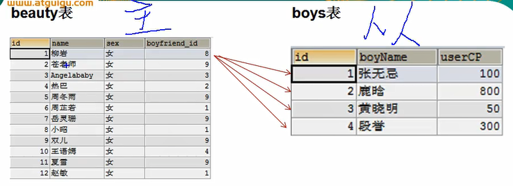
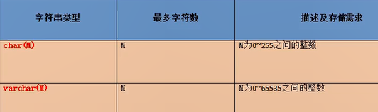

# 杂记

1. sql中索引都是从1开始的，除了limit

2. desc 表名：显示表中的字段属性详情

3. **！！主键与唯一的异同：**

   1. 相同点：
      1. 都可以保证列级上数据的唯一性。
      2. 都可以组合
   2. 区别：
      1. 主键数据不可以为空；唯一数据可以为空。
      2. 主键一个表中最多1个；唯一表中可以有多个。

4. 修改表时，change column与modify column：

   二者都可以修改字段结构。但是change是用新的一列替换旧列，所以可以修改列名，而modify是在原列基础上修改，不可以修改列名。

5. union与union all

   ```
   UNION用的比较多union all是直接连接，取到得是所有值，记录可能有重复   union 是取唯一值，记录没有重复   
   1、UNION 的语法如下：
        [SQL 语句 1]
         UNION
        [SQL 语句 2]
   
   2、UNION ALL 的语法如下：
        [SQL 语句 1]
         UNION ALL
        [SQL 语句 2]
   
   效率：
   UNION和UNION ALL关键字都是将两个结果集合并为一个，但这两者从使用和效率上来说都有所不同。
   
   1、对重复结果的处理：UNION在进行表链接后会筛选掉重复的记录，Union All不会去除重复记录。
   
   2、对排序的处理：Union将会按照字段的顺序进行排序；UNION ALL只是简单的将两个结果合并后就返回。
   
   从效率上说，UNION ALL 要比UNION快很多，所以，如果可以确认合并的两个结果集中不包含重复数据且不需要排序时的话，那么使用union all
   ```


# 1、查询

## 1）去重关键字：Distinct

示例：

~~~sql
select distinct sname from student;
~~~


## 2）起别名两种方式：空格 AS

~~~sql
select sname 姓名 from student;
select sname as 姓名 from student;
~~~


## 3）mysql中的加号

Mysql中的+直接使用只有一个功能：运算符

不可以当作连接字符串使用。

拼接字符串使用concat函数

1. 两方都是数值型，直接相加

   ~~~sql
   select 100+90;
   ~~~

2. 字符串会被尝试转换为数值型，转换失败就将其转换为0

   字符串转数字的过程如下：

   1. 去除前置空格
   2. 从前向后截取，直到字符串末尾或者遇到非数字字符
   3. 将截取到的字符串转化为十进制数字
   4. 总结：也就是说，前置空格不影响，遇到第一个非数字字符结束。

   ~~~sql
   SELECT '100'+20;   // 结果为120
   SELECT ' 100'+'20';  // 结果为120
   SELECT '1 00'+'20';  // 结果为21
   SELECT "   1 2a"+20   // 结果为21
   ~~~

3. 一方为null，结果一定为null

   ~~~ sql
   SELECT null+20;   // 结果为null
   ~~~

   

## 4）不等号：“<>”

mysql中的不等号为：“<>”

但是“!=”也可以使用


## 5）like

通配符：

1. % ：任意长度的字符，长度可以为0
2. _ ：单个任意字符


## 6）between and

简化代码：定义了一个区间

以下代码等价：

~~~ sql
select * from student where age>=0 and age<=20;
select * from student where age between 0 and 20;
~~~


## 7）in

A in {a,b,c,d,e,f,g}：定义字段A的值需要在后面的集合中。

~~~sql
select * from student where age in (18,19）;
~~~


## 8）is null

is null：字段为null，相当于：<=>null

is not null：字段不为空，不能等价于：!=null


## 9）=、<=>、<>、!=

=与<=>:后者叫安全等于

1. 相同点：双方都是表示相等的意思

2. 区别：<=>能处理null的比较，而=一旦有一方是null，则结果都是null

   ~~~ sql
   select 'a'=null;   // 结果为null
   select 'a'<=>null; // 结果为0
   select null<=>null;   //结果为1
   ~~~

   

<>、!=：两者都是不等于的意思，查阅网上资料说是！=是以前sql标准，<>是现在使用的sql标准，推荐使用<>。


## 10）order by

一般总是放在最后，唯一的例外是limit子句。

desc：降序

asc：升序


# 2、单行函数

## 1）一般格式

~~~sql
select 函数名(参数） from [表] where 条件
~~~


## 2）常见函数

1. 单行函数：如concat, length、 ifnull等
   1. 字符函数
   2. 数学函数
   3. 日期函数
   4. 其他函数【补充】
   5. 流程控制函数【补充】
2. 分组函数：做统计使用,又称为统计函数、聚合函数、组函数


## 3）字符函数

1. length(str) : 求str的字节长度，根据字符集不同， 结果也不同。例如utf8中，汉字3个字节，字母1个字节。

2. concat(str1,str2,str3......)：连接字符串

3. upper(str)，lower(str) : 字符串转全大写（小写）

4. substr()：字符串截取。有许多重载函数，参数可以有多种形式。

5. INSTR（str,substr）：从str中搜索substr字符串。返回第一次出现时的下标

6. trim(str) :默认是去除所有前后置的空格

   但是也可以这么写：

   trim( substr from str )：去除str中的前后置substr

7. LPAD(str,len,padstr) 、RPAD(str,len,padstr): 用指定的字符实现左（右）填充指定长度

   参数说明：

   ​    str:要处理的对象

   ​    len:处理完后的str长度为len

   ​    padstr:如果str的长度小于len指定的值，那么长度差由padstr在左（右）边填充；如果str的长度大于len指定的值，则左（右）截取str到len指定的长度。

   返回值说明：

   ​    lpad函数返回的是处理后的str

8. REPLACE(str,from_str,to_str): 替换所有


## 4）数学函数

1. round 四舍五入
   SELECT ROUND(-1.55);
   SELECT ROUND(1.567,2);

2. ceil 向上取整,返回>=该参数的最小整数

   SELECT CEIL(-1.02);

3. floor 向下取整，返回<=该参数的最大整数
   SELECT FLOOR(-9.99);

4. truncate 截断

   SELECT TRUNCATE(1.69999,1);// 保留一位小数

5. mod取余
   /*
   mod(a,b) ：  a-a/b*b

   mod(-10,-3):-10- (-10)/(-3)*（-3）=-1
   */
   SELECT MOD(10,-3);
   SELECT 10%3;


## 5）日期函数

1. now 返回当前系统日期+时间

   ~~~sql
   SELECT NOW();
   ~~~

2. curdate 返回当前系统日期，不包含时间

   ```sql
   SELECT CURDATE();
   ```

3. curtime 返回当前时间，不包含日期

   ```sql
   SELECT CURTIME();
   ```

4. 可以获取指定的部分，年、月、日、小时、分钟、秒

   ~~~sql
   SELECT YEAR(NOW()) 年;
   SELECT YEAR('1998-1-1') 年;
   
   SELECT  YEAR(hiredate) 年 FROM employees;
   
   SELECT MONTH(NOW()) 月;
   SELECT MONTHNAME(NOW()) 月;
   ~~~

5. str_to_date 将字符通过指定的格式转换成日期

```sql
SELECT STR_TO_DATE('1998-3-2','%Y-%c-%d') AS out_put;

#查询入职日期为1992--4-3的员工信息
SELECT * FROM employees WHERE hiredate = '1992-4-3';

SELECT * FROM employees WHERE hiredate = STR_TO_DATE('4-3 1992','%c-%d %Y');


#date_format 将日期转换成字符

SELECT DATE_FORMAT(NOW(),'%y年%m月%d日') AS out_put;

#查询有奖金的员工名和入职日期(xx月/xx日 xx年)
SELECT last_name,DATE_FORMAT(hiredate,'%m月/%d日 %y年') 入职日期
FROM employees
WHERE commission_pct IS NOT NULL;
```

#四、其他函数

~~~sql
SELECT VERSION();
SELECT DATABASE();
SELECT USER();
~~~


## 6）流程控制函数

1. if函数： if else 的效果

   ~~~sql
   SELECT IF(10<5,'大','小');
   
   SELECT last_name,commission_pct,IF(commission_pct IS NULL,'没奖金，呵呵','有奖金，嘻嘻') 备注
   FROM employees;
   ~~~

2. case函数的使用一： switch case 的效果

   ~~~sql
   /*
   java中
   switch(变量或表达式){
   	case 常量1：语句1;break;
   	...
   	default:语句n;break;
   
   
   }
   
   mysql中
   
   case 要判断的字段或表达式
   when 常量1 then 要显示的值1或语句1;
   when 常量2 then 要显示的值2或语句2;
   ...
   else 要显示的值n或语句n;
   end
   */
   
   /*案例：查询员工的工资，要求
   
   部门号=30，显示的工资为1.1倍
   部门号=40，显示的工资为1.2倍
   部门号=50，显示的工资为1.3倍
   其他部门，显示的工资为原工资
   
   */
   
   
   SELECT salary 原始工资,department_id,
   CASE department_id
   WHEN 30 THEN salary*1.1
   WHEN 40 THEN salary*1.2
   WHEN 50 THEN salary*1.3
   ELSE salary
   END AS 新工资
   FROM employees;
   ~~~

3. case 函数的使用二：类似于 多重if

   ~~~sql
   SELECT sname,
   case
   when age>=19 and age<=19 then 'yes'
   when age<19 then 'no'
   else 'ok'
   end as 'age'
   from student
   ~~~

   ~~~sql
   /*
   java中：
   if(条件1){
       语句1；
   }else if(条件2){
       语句2；
   }
   ...
   else{
       语句n;
   }
   
   mysql中：
   
   case 
   when 条件1 then 要显示的值1或语句1
   when 条件2 then 要显示的值2或语句2
   。。。
   else 要显示的值n或语句n
   end
   */
   
   #案例：查询员工的工资的情况
   如果工资>20000,显示A级别
   如果工资>15000,显示B级别
   如果工资>10000，显示C级别
   否则，显示D级别
   
   SELECT salary,
   CASE 
   WHEN salary>20000 THEN 'A'
   WHEN salary>15000 THEN 'B'
   WHEN salary>10000 THEN 'C'
   ELSE 'D'
   END AS 工资级别
   FROM employees;
   ~~~


# 3、分组函数

1. 功能：用作统计使用，又称为聚合函数或统计函数或组函数

2. 分类：
   sum 求和、avg 平均值、max 最大值 、min 最小值 、count 计算个数

3. 特点：
   1、sum、avg一般用于处理数值型
      max、min、count可以处理任何类型
   2、以上分组函数都忽略null值

   3、可以和distinct搭配实现去重的运算

   4、count函数的单独介绍
   一般使用count(*)用作统计行数

   5、和分组函数一同查询的字段要求是group by后的字段


## 1）简单 的使用

SELECT SUM(salary) FROM employees;  求总和
SELECT AVG(salary) FROM employees;	求平均值
SELECT MIN(salary) FROM employees;	求最小值
SELECT MAX(salary) FROM employees;	求最大值
SELECT COUNT(salary) FROM employees;	求出现频次


## 2）是否忽略null

举例：sum() 是否参与运算？

如果参与了，sql中任意数字+null，都等于null，所以不参与。

同样avg（）函数中，求和也不考虑null，但是项数与null无关。


也就是说以上分组函数都忽略null值。


## 3）和distinct搭配

~~~sql
# 如下，salary去重后在求和、求频次
SELECT SUM(DISTINCT salary),SUM(salary) FROM employees;

SELECT COUNT(DISTINCT salary),COUNT(salary) FROM employees;
~~~


## 4）count函数的详细介绍

介绍：统计指定字段不为null的个数。

~~~sql
# salary不为null的个数
SELECT COUNT(salary) FROM employees;
# 行数
SELECT COUNT(*) FROM employees;
# 与行数效果一样，相当于给表多加了一列1
SELECT COUNT(1) FROM employees;
~~~


效率：
MYISAM存储引擎下  ，COUNT(\*)的效率高
INNODB存储引擎下，COUNT(\*)和COUNT(1)的效率差不多，比COUNT(字段)要高一些


## 5）一个注意事项

如下代码：

~~~ sql
SELECT AVG(salary),employee_id  FROM employees;
~~~

AVG(salary)会查出一行，employee_id查出很多行，这样是不推荐的。


# 4、分组查询

## 1）基本格式

select [字段]

from [表名]

where [条件]

group by [分组字段]

having [分组后筛选分组的条件]

举例：

~~~sql
select max(age) maxAge,class,sname from student group by class HAVING count(*)>2;
~~~

1. 分组后，select 后面显示的字段都是每一组的第一行的字段，所以除了分组字段，显示其它字段都是意义不大的。

2. 分组后一般配合分组函数使用，分组函数会在每个分组分别起作用

3. 可以使用having关键字在分组后筛选分组。where是每个分组内部的筛选。

4. 分组字段不止一个时，是将所有分组字段作为一个整体，一致的是一组。

   例如：以下语句查询每个班级老师所教的这个班级的人数。

   ~~~sql
   select count(*) from student where group by class,teatcher;
   ~~~

5. order by与limit语句与group by的位置关系是：

   group by [] having [] order by [] limit [] 


# 5、连接查询

相当于把两张乃至多张表合成为一张表。


## 1）笛卡尔乘积

没有连接条件。

A表每一项都与B表任意项连接。

表1：5条


表2：2条


表1连接表2：10条


## 2）分类

分类：

按年代分类：
1、sql92标准:仅仅支持内连接
	内连接：
		等值连接
		非等值连接
		自连接
2、sql99标准【推荐】：支持内连接+外连接（左外和右外）+交叉连接

按功能分类：
	内连接：
		等值连接
		非等值连接
		自连接
	外连接：
		左外连接
		右外连接
		全外连接
	交叉连接


## 3）等值连接

添加一个连接条件，例如：

~~~ sql
#查询女神名和对应的男神名
SELECT * FROM beauty;

SELECT * FROM boys;

SELECT NAME,boyName FROM boys,beauty
WHERE beauty.boyfriend_id= boys.id;


#可以加筛选
#案例：查询有奖金的员工名、部门名

SELECT last_name,department_name,commission_pct

FROM employees e,departments d
WHERE e.`department_id`=d.`department_id`
AND e.`commission_pct` IS NOT NULL;

#案例2：查询城市名中第二个字符为o的部门名和城市名

SELECT department_name,city
FROM departments d,locations l
WHERE d.`location_id` = l.`location_id`
AND city LIKE '_o%';

#可以加分组
#案例1：查询每个城市的部门个数

SELECT COUNT(*) 个数,city
FROM departments d,locations l
WHERE d.`location_id`=l.`location_id`
GROUP BY city;

#可以实现三表连接？
#案例：查询员工名、部门名和所在的城市
SELECT last_name,department_name,city
FROM employees e,departments d,locations l
WHERE e.`department_id`=d.`department_id`
AND d.`location_id`=l.`location_id`
AND city LIKE 's%'

ORDER BY department_name DESC;
~~~


## 4）非等值连接

连接条件不是等值连接的两个字段值相等，而是其它非等条件。例如大于、小于等等。


## 5）自连接

就是与自身进行连接，所以需要给表起别名。

~~~ sql
#案例：查询 员工名和上级的名称SELECT e.employee_id,e.last_name,m.employee_id,m.last_nameFROM employees e,employees mWHERE e.`manager_id`=m.`employee_id`;
~~~


## 6）内连接：inner

SQL99，使用JOIN关键字代替了之前的逗号，并且将连接条件和筛选条件进行了分离，提高阅读性！！！使用inner join关键字实现，on+[连接条件]添加条件。

基本语法：inner可以省略

~~~ sql
SELECT 查询列表
FROM 表名1 别名
【INNER】 JOIN  表名2 别名
ON 连接条件
WHERE 筛选条件
GROUP BY 分组列表
HAVING 分组后筛选
ORDER BY 排序列表;
~~~


就相当于前面的手动实现的等值连接与非等值连接。


## 7）外连接

说明：**查询结果为主表中所有的记录**，如果从表有匹配项，则显示匹配项；如果从表没有匹配项，则显示null

应用场景：一般用于查询主表中有但从表没有的记录

特点：

1、外连接分主从表，两表的顺序不能任意调换
2、左连接的话，left join左边为主表
   右连接的话，right join右边为主表


语法：

~~~sql
select 查询列表
from 表1 别名
left|right|full 【outer】 join 表2 别名
on 连接条件
where 筛选条件;
~~~


### 1）左连接与右连接

使用left join 使用方法与内连接类似。

以左连接为例，右连接类似。

由左表向右表连接，左表所有字段保留。左表为主，右表为从。



与内连接最大的不同是：左连接以左表为主，如果左表的某个字段值为null，依然也会显示。而内连接则不然，如果某个字段为null且筛选条件没有限定，则不会返回。

举例1：如上图，以id相同为连接条件，左连接时，beauty表id为1,2,3,4，boys表都有与其对应的项，这当然会显示出来，但是beauty表剩下的项id=5,6,7......也会显示出来，不过由表对应的的都是null。

举例2：

~~~sql
select * from student s LEFT OUTER JOIN teatcher t on s.class=t.class;
~~~


体现在以下三点：

​	一、返回不同

​	1、inner join：inner join只返回两个表中联结字段相等的行。

​	2、left join：left join返回包括左表中的所有记录和右表中联结字段相等的记录。

​	二、数量不同

​	1、inner join：inner join的数量小于等于左表和右表中的记录数量。

​	2、left join：left join的数量以左表中的记录数量相同。

​	三、记录属性不同

​	1、inner join：inner join不足的记录属性会被直接舍弃。

​	2、left join：left join不足的记录属性用NULL填充.。


~~~sql
USE girls;#案例1：查询所有女神记录，以及对应的男神名，如果没有对应的男神，则显示为null#左连接SELECT b.*,bo.*FROM beauty bLEFT JOIN boys bo ON b.`boyfriend_id` = bo.`id`;#右连接SELECT b.*,bo.*FROM boys boRIGHT JOIN  beauty b ON b.`boyfriend_id` = bo.`id`;
~~~


### 2）全外连接

关键字full join

类似于左连接与右连接的结合，左边没有的，右边没有的都会显示出来，对应的匹配项都是null。

mysql不支持。


### 3）交叉连接

关键值cross join。使用方法与前类似，不过不需要加连接条件。

就是笛卡尔积。


但是，在Mysql中，cross join与inner join的效果完全相同，cross join也可以使用on加连接条件，与inner join一样。


# 6、子查询

含义：将select 语句的查询结果作为一张表交给其它查询语句使用。也叫做内查询。

嵌套子查询语句的查询语句，叫做外查询或主查询。


## 1）分类

分类:

按子查询出现的位置:

1. select后面：仅仅支持标量子查询

2. from后面：支持表子查询

3. where或having后面：标量子查询、列子查询、行子查询

4. exists后面（相关子查询)

   

按结果集的行列数不同:

1. 标量子查询(结果集只有一行一列)
2. 列子查询(结果集只有一列多行)
3. 行子查询（结果集有一行多列)
4. 表子查询(结果集一般为多行多列)


## 2）标量子查询

结果集只有一行一列

~~~sql
select * from student where class=(select class from teatcher where tid='1');
~~~


## 3）列子查询

结果集只有一列多行

~~~sql
select * from student where class=ANY(select class from teatcher);select * from student where class in(select class from teatcher);select * from student where class not in(select class from teatcher);select * from student where class<>all(select class from teatcher);
~~~


## 4）行子查询

结果集有一行多列

~~~sql
select * from student where (sname,sid)=(select sname,sid from student where sid='1');
~~~


## 5）表子查询

结果集一般为多行多列

~~~sql
select * from student where (sname,sid) in (select sname,sid from student);
~~~


## 6）exist

就是一个布尔类型。

exist(查询语句)：有结果就是1，没有结果也就是null，就是0。

注意，即使结果字段值是null，那也是有结果。


# 7、分页查询

1. 放在语句最后
2. 使用关键字：limit
3. 基本语法：**limit offset,size;** 
4. offset：要显示条目的起始索引(起始索引从0开始)
5. size：要显示的条目个数
6. 省略写法：当offset为0时可以省略，表示查询前size条。

举例：

~~~sql
#查询第3-7条select * from student limit 2,5;
~~~


# 8、联合查询：Union

1. 功能：将多条查询语句的结果合并成一个结果。
2. 基本语法：
3. 查询语句1 union 查询语句2;
4. 要求查询语句1与查询语句2查询出来的列数相同
5. 列名可以不相同，最终的列名以查询语句1为主。


# 9、DML语言：crud

## 1）插入insert

1. 直接插入值：values、value

   这种方法支持子查询：

   ~~~sql
   insert into student(sid,sname) select tid,tname from teatcher
   ~~~

2. 使用set：insert into 表名 set 列名1=值1，列名2=值2......

   ~~~sql
   insert into student set sid='3',sname='Alen';
   ~~~


## 2）删除delete、truncate

1. 方式1基本语法:

   ~~~sql
   delete from 表名 where 筛选条件;
   ~~~

   方式1中使用方法：支持单表删除与多表删除，也就是说，后面的: from 表名 where 筛选条件，可以使用前面多表查询的手段，左连接、内连接什么的。

2. 方式2基本语法：

   ~~~sql
   truncate table 表名
   ~~~

   1. 没有where筛选条件，意味着它的效果相当于：delete from 表名。也就是清空数据。

   2. 它没有返回值。
   3. 它效率比delete高一点点。
   4. 假如要删除的表中有自增长列，
      **如果用delete删除后，再插入数据，自增长列的值从断点开始，而truncate删除后,再插入数据，自增长列的值从1开始。**


# 10、DDL：create、alter、drop

1. 数据定义语言
2. 库的管理
   创建、修改、删除
3. 表的管理
   创建、修改、删除


## 1）数据库的管理

1.创建库

~~~sql
create database 库名;
~~~

示例：

~~~ sql
create database test;
~~~

2. 安全创库：加上if not exists 库名

~~~sql
create databse test if
~~~

2. 修改

   一般来说，不允许修改，因为容易出现数据丢失等问题。

   mysql5.7.1以前曾经有一个命令可以修改，新版本后就不可以了：

   RENAME database 九库名 to 新库名

3. 更改库的字符集：...... character set 字符集名

   例如：

   ~~~sql
   alter database test character set gbk;
   ~~~

4. 库的删除

   ~~~sql
   drop database 库名 选[ if exists 库名 ]
   #例如
   drop database test if exists test;
   ~~~

   

## 2）表的管理

### 创建表

create table 表名( 属性 )表设置;


一些创建表时常用的属性设置

1. not null：设置字段不为空

2. unique：字段值在当前列唯一，不允许重复。

3. primary key：设置字段为主键。主键要求不为空且唯一。

   ~~~sql
   # 方式1
   create table test(
   	id varchar(255) primary key,
       tname varchar(255) not null
   );
   # 方式2
   create table test(
   	id varchar(255),
       tname varchar(255) not null,
       primary key(id)
   );
   ~~~

   方式2的好处在于可以设置多个字段为主键，即设置组合主键。

4. foreign key：设置外键。

   外键用于两张表的连接，要求一张表中的一张表中的FOREIGN KEY指向另一个表中的某个字段，一般指向的是主键。

   这样做目的是为了防止破坏两表之间的连接动作。

   ~~~sql
   #格式
   foreign key(外键) references 关联表(字段名)
   
   #举例
   create table student(
   	id varchar(255) primary key,
       stname vachar(255) not null,
       class int,
       foreign key(class) references teatcher(class)
   );
   ~~~

5. **check（）：参数通常是一个逻辑语句，主要用于限制字段值的范围**

   ~~~sql
   #举例
   create table student(
   	id varchar(255) primary key,
       stname vachar(255) not null,
       age int,
       check(age>=0 and age<=100)
   );
   ~~~

6. default：设置字段默认值

   ~~~sql
   #举例
   create table student(
   	id varchar(255) primary key,
       stname vachar(255) not null,
       age int default 20,
       check(age>=0 and age<=100)
   );
   ~~~

7. 自增字段：auto_increment

   **Myisam类型存储引擎的表将最大的ID值是记录到数据文件中，不管是否重启最大的ID值都不会丢失。**

   **但是InnoDB表的最大的ID值是存在内存中的，若不重启Mysql服务，新加入数据会使用内存中最大的数据+1.但是重启之后，会使用当前表中最大的值再+1**

   例如：下表添加了4行数据，id最大为4，即使删除了id为4的那一行数据，再次添加数据时，也是从id=5开始的。

   ~~~sql
   create table t1(
   	id int auto_increment,
   	tname varchar(2),
   	primary key(id)
   )CHARACTER set=utf8;
   
   INSERT into t1(tname) values
   ('ee'),('dd'),('ff'),('gg')
   
   DELETE from t1 where id=4
   
   INSERT into t1(tname) values('yy')
   ~~~

   

### 修改表

1. 修改列名

   ~~~sql
   alter table 表名 change colunm 旧列名 新列名 类型;
   
   #举例
   alter table student change colunm sid studentid varchar(255);
   ~~~

2. 修改列的类型或约束

   ~~~sql
   alter table 表名 modify column 列名 新类型;
   
   #举例
   alter table student modify column sid int;
   ~~~

3. 添加列

   ~~~sql
   alter table 表名 add column 表名 类型 [设置];
   
   #举例
   alter table student add sex char(2);
   ~~~

4. 删除列

   ~~~sql
   alter table 表名 drop column 列名;
   
   #举例
   alter table student drop sid;
   ~~~

5. 修改表名

   ~~~sql
   alter table 表名 rename to 新表名
   
   #举例
   alter table student rename to stu;
   ~~~

6. 添加约束

   ~~~sql
   alter table 表名 add contraint 约束名 约束具体内容;
   
   #举例：添加外键
   alter table student add constraint stu_teat_for01 foreign key(class) references teatcher(class);
   ~~~

7. 总结：

   语法基本上就是：

   alter table 表名 add l drop l modify l chanae  column 列名【列类型 约束】


### 删除表

~~~sql
drop table [if exsits] 表名

#举例
drop table student;
~~~


### 通常写法

先判断表或库是不是存在，再进行操作；

~~~sql
#创建库
drop database if exists 库名;
create database 库名;

#创建表
drop table if exists 表名;
create table 表名(....);
~~~


### 复制表

本质上就是子查询。

1. 仅仅复制表的结构

   ~~~sql
   CREATE TABLE 新表 SELECT * FROM 旧表 where 1=2;
   
   #举例
   create table t2 select * from t1 where 1=2
   ~~~

2. 复制表的结构与内容

~~~sql
CREATE TABLE 新表 SELECT * FROM 旧表 where 筛选条件;

#举例
create table t2 select * from t1
~~~


# 11、数据类型

## 1）常见的数据类型

1. 数值型:
   	整型小数:
   	定点数浮点数

2. 字符型:

   ​	较短的文本: char- varchar

   ​	较长的文本:text、blob

3. 日期型


## 2）整型


1. 默认都是有符号的，如果需要无符号，则需要关键字unsigned

~~~sql
create table t1(
	id int unsighed
);
~~~

2. 插入值超范围会报out range of value ....异常，但是老版本的mysql也可以插入值，但插入的是临界值，现版本无法插入值。

3. 整数可以设置长度，不设置也有默认长度。但是这个长度与范围无关，表示的是显示的数值的宽度。例如宽度为5，数值为12，则显示为00012。但是这个一般不起作用，需要搭配unsigned zerofill使用才可以起作用。如下：

   ~~~sql
   create table t1(
       id int(7) unsighed zerofill
   );
   ~~~

## 3）小数


小数可以设置参数，参数有两个。

参数M：最大长度。

参数D：小数点保留位数。

例如：

~~~sql
create table t1(
	num float(5,2)
);
~~~

保留2位小数，四舍五入。

意味着小数2位，整数5-2=3位。如果整数位数过大，会报out of range......异常。


M和D都可以省略

如果是decimal,则M状犬认为10，D默认为o

如果是float和double，则会根据插入的数值的精度来决定精度，也就是没有固定的精度。


## 4）字符

1. 短文本：char、varcher
2. 较长的文本：text、blob（较大的二进制）


短文本char与varchar：

1. 

2. varchar可变长度，char定长。也就是说，char不管插入多少值，都是固定长度占用固定空间。varchar根据插入值长度决定占据空间。

3. varchar占空间少，但是效率相对低。

   char空间占用高，效率相对较高

4. 在固定长度时，选择char较好。长度变化大时选择varchar较好。

5. char(M)、varchar(M)：char的M可以省略，默认为1。varchar的M不可省略。


## 5）二进制Binary、varBinary

1. 与char、varchar类似，一个定长，一个不定长。用于保存较短的二进制数据。

2. 保存的是二进制数据。

3. 表格中显示的是二进制按字节转换的asc码，如果是中文就难以正常显示。

4. 插入的数据会被当作字符串，然后将字符串的二进制数据保存起来

5. 按照字符集将字符串转换为二进制数据，所以还可以完美还原。

   例如：UNHEX(HEX(tt1)

~~~sql
INSERT into t1(tt1) value(112)

select tt1,UNHEX(HEX(tt1)) from t1

select HEX('hello')
~~~

6. 优点在于稳定，不受外界字符集影响。


## 6）枚举型Enum

说明:又称为枚举类型哦，要求插入的值必须属于列表中指定的值之一。

**如果列表成员为1~255，则需要1个字节存储**
**如果列表成员为255~65535，则需要2个字节存储最多需要65535个成员!**

~~~sql
create table t1(
	taname enum('Alice','Bob')
);
~~~

大小写不敏感，即使插入的值是ALICE，最终呈现的也是Alice。

插入的值不在枚举范围中，报异常。


## 7）集合Set

说明:和num类型类似，里面可以保存0~64个成员。

和Enum类型最大的区别是:SET类型一次可以选取多个成员,而Enum只能选一个。

根据成员个数不同，存储所占的字节也不同

如下，一个位代表一个成员，所以8位也就是1字节只能存8个成员。


选取多个成员举例：

~~~sql
create table t1(
	tname set('a','b','c')
);

insert into t1 value('a');
insert into t1 value('a,c');
insert into t1 value('a,b,c');
~~~


## 8）日期型

1. 用单引号引起来

2. datetime与timestamp

   1. Timestamp支持的时间范围较小﹐取值范围∶19700101080001——2038年的某个时间
      Datetime的取值范围:1000-1-1——9999—12-31

   2. timestamp和实际时区有关,更能反映实际的日期，如果时区改变，值也会随之适应改变。

      而datetime则只能反映出插入时的当地时区，是静态的。

   3. timestamp的属性受MysqI版本和SQLMode的影响很大


# 12、约束

## 1）常见约束

1. 六大约束

   1. NOT NULL ：非空约束，用于保证该字段的值不能为空

      比如姓名，学号等 	

   2. DEFAULT ：默认约束，用于保证该字段有默认值

      比如性别

   3. PRIMARY KEY ：主键约束，用于保证该字段的值具有唯一性，并且非空 	

      比如学号，员工编号等

   4. UNIQUE : 唯一约束，用于保证该字段的值具有唯一性，可以为空

      比如座位号

   5. CHECK：检查约束【mysql中不支持，sql语法支持，语法不报错，但是没效果】

       比如年龄、性别，可以设置一个范围

   6. FOREIGN	KEY ：外键约束，用于限制两个表的关系，用于保证该字段的值必须来自于主表的关联列的值

      在从表中添加外键约束，用于引用主表中某列的值

      比如学生表的专业编号，员工表的部门编号，员工表的工种编号

2. 列级约束：六大约束都支持，但是外键约束没有效果，应该写在表级约束上。

   ~~~sql
   create table 表名(
       字段名 类型 列级约束
   );
   ~~~

3. 表级约束：除了非空、默认，其他的都支持

   ~~~sql
   create table 表名(
       字段名 类型 列级约束,
       表级约束
   );
   ~~~

   

## 2）主键与唯一的异同：

1. 相同点：

   1. 都可以保证列级上数据的唯一性。
   2. 都可以组合

2. 区别：

   1. 主键数据不可以为空；唯一数据可以为空。

   2. 主键一个表中最多1个；唯一表中可以有多个。

      

## 3）外键

1. 要求在从表设置外键关系
2. 从表的外键列的类型和主表的关联列的类型要求一致或兼容，名称无要求
3. 主表的关联列必须是一个key（一般是主键或唯一)
4. 插入数据时，先插入主表,再插入从表
   删除数据时,先删陈从表,再删除主表


## 4）修改表时设置约束

1. 列级约束：相当于修改列，使用modify。举例如下：

   添加删除非空约束

   ~~~sql
   #添加约束
   ALTER TABLE stuinfo MODIFY COLUMN stuname VARCHAR(20) Not NULL;
   #删除约束
   ALTER TABLE stuinfo MODIFY COLUMN stuname VARCHAR(20);
   ~~~

2. 表级约束：add关键字添加，drop关键字删除。

   1. 添加

      格式如下：

   ~~~sql
   alter table 表名 add [constraint 约束名] 约束;
   ~~~

   ​	举例：

   ~~~sql
   alter table student add primary key(sid);
   
   alter table student add constraint fk001 foreign key(class) references teatcher(class)
   ~~~

   删除：

   ~~~sql
   #格式
   alter table 表名 drop 约束 约束名;
   
   #举例
   alter table student drop primary key;  #因为主键只有一个，所以约束名省略
   
   alter table student drop index sname;  #index是唯一约束
   show index from student;  #通过此查看唯一约束的约束名
   ~~~

   

## 5）标识列（自增长）

自增字段：auto_increment

**Myisam类型存储引擎的表将最大的ID值是记录到数据文件中，不管是否重启最大的ID值都不会丢失。**

**但是InnoDB表的最大的ID值是存在内存中的，若不重启Mysql服务，新加入数据会使用内存中最大的数据+1.但是重启之后，会使用当前表中最大的值再+1**

例如：下表添加了4行数据，id最大为4，即使删除了id为4的那一行数据，再次添加数据时，也是从id=5开始的。

~~~sql
create table t1(
	id int auto_increment,
	tname varchar(2),
	primary key(id)
)CHARACTER set=utf8;

INSERT into t1(tname) values
('ee'),('dd'),('ff'),('gg')

DELETE from t1 where id=4

INSERT into t1(tname) values('yy')
~~~

1. 一个表中的自增长字段最多只能有1个。
2. 要求是一个key，也就是唯一值。
3. 标识列只能是数值型
4. 利用set auto_increment_increment=3设置步长，这是对全局变量的设置，轻易不要用。
5. 起始值可以如4一般通过设置全局变量设置，但是不起作用。可以通过的第一条记录设置。


# 13、事务

## 1）存储引擎基本介绍

1、概念:在mysql中的数据用各种不同的技术存储在文件（或内存）中。

2、通过show engines;来查看mysql支持的存储引擎。

3、在mysql中用的最多的存储引擎有: innodb，myisam , memory等。其中**innodb支持事务**，而myisam、memory等不支持事务。


## 2）事务基本介绍

1. **事务的特性:ACID**
2. 原子性:一个事务不可再分割，要么都执行要么都不执行
3. 一致性:一个事务执行会使数据从一个一致状态切换到另外一个一致状态
4. 隔离性:一个事务的执行不受其他事务的千扰
5. 持久性:一个事务一旦提交，则会永久的改变数据库的数据.


## 3）事务的创建

1. 隐式事务:事务没有明显的开启和结束的标记。比如insert、 update、 delete语句

2. 显式事务：有明显的开启和结束的标记。

   ~~~sql
   # 步骤1：开启事务
   # 前提:必须先设置自动提交功能为禁用
   set autoconmmit=0;
   
   start transaction;  #可选的，写不写都行
   
   # 步骤2：编写sql语句（crud：select delete update insert）
   crud语句......
   
   # 步骤3：关闭事务，提交回滚二选一
   conmmit;  #提交事务
   #rollback;  #出现异常则回滚
   ~~~

   conmmit与rollback都是结束事务。执行到这一步下面的代码无法执行。

   

## 4）事务并发问题

1. 脏读：

    （针对未提交数据）如果一个事务中对数据进行了更新，但**事务还没有提交**，另一个事务可以“看到”该事务没有提交的更新结果，这样造成的问题就是，如果第一个事务回滚，那么，第二个事务在此之前所“看到”的数据就是一笔脏数据。

    例如，对于两个事务T1、T2，T1读取了已经被T2**更新但还没有被提交**的字段。之后，若T2回滚，T1读取的内容就是临时且无效的。

2. 不可重复读：是指在一个事务内，多次读同一数据。在这个事务还没有结束时，另外一个事务也访问该同一数据。那么，在第一个事务中的两次读数据之间，由于第二个事务的修改，那么第一个事务两次读到的的数据可能是不一样的。这样就发生了在一个事务内两次读到的数据是不一样的，因此称为是不可重复读。

   例如：对于两个事务T1、T2，T1读取了一个字段，然后T2**更新**了该字段.之后，T1再次读取同一个字段,值就不同了。

3. 幻读：是指当事务不是独立执行时发生的一种现象，例如第一个事务对一个表中的数据进行了修改，这种修改涉及到表中的全部数据行。同时，第二个事务也修改这个表中的数据，这种修改是向表中插入一行新数据。那么，以后就会发生操作第一个事务的用户发现表中还有没有修改的数据行，就好象发生了幻觉一样。

    例如：对于两个事务T1、T2，T1从一个表中读取了一个字段，然后T2在该表中**插入**了一些新的行。之后，如果T1再次读取同一个表，就会多出几行。

4. 总结：

    1. 脏读是T2更新还没有提交的字段被读取。
    2. 不可重复读，T1两次读取字段之间，字段被T2更新
    3. 幻读：T1两次读取字段之间，字段被T2插入新行
    4. 不可重复读与幻读区别在于，一个时更新字段值，一个是插入新字段。

5. 数据库事务的隔离性：数据库系统必须具有**隔离并发运行各个事务的能力**，使它们不会相互影响，避免各种并发问题。

    

## 5）4种隔离级别：

1. 读未提交数据：没有避免三种问题的出现
2. 读已提交数据：只允许事务读取已经被其它事务提交的变更。避免脏读
3. 可重复读：确保事务执行期间，可以从一个字段中读取相同的值，这个时间段其它事务不可对此字段更新。避免了脏读、不可重复读。
4. 串行化：顾名思义，类似于串行化执行事务。确保事务可以从一个表中读取相同的行。在这个事务持续期间，禁止其他事务对该表执行插入，更新和删除操作。所有并发问题都可以避免，但性能十分低下。


7. Oracle支持的2种事务隔离级别：READ COMMITED，SERIALIZABLE。Oracle默认的事务隔离级别为:READCOMMITED。也就是说默认避免脏读。
8. Mysql支持4种事务隔离级别. Mysql默认的事务隔离级别为: REPEATABLE READ（可重复读）。
9. 


## 6）隔离级别操作

1. 查看隔离级别：

   ~~~sql
   select @@tx_isolation;
   ~~~

1. 设置隔离级别：set session transaction isolation level +隔离级别名

   例如：

   ~~~sql
   # 设置为读未提交
   set session transaction isolation level read uncommitted;
   ~~~


## 7）回滚点savepoint

~~~sql
set autoconmmit=0;
start transaction;
delete from student where sid=23;
savepoint a;   # 设置回滚点
delete from student where sid=1;
rollback to a; #回滚到a
~~~


## 8）delete与truncate在事务中的区别

delete支持回滚，truncate不支持。


# 14、视图

## 1）视图基本介绍

1. 虚拟表，使用与普通表一样。
2. mysql5.1版本出现的新特性,是通过表动态生成的数据
3. 应用场景：多个地方用到同样的查询结果、该查询结果使用的sql语句较复杂


## 2）创建视图

~~~sql
# 格式
create view 视图名 as 查询语句

# 举例
create view stu_t
as select sid,class,tid
from student s,teatcher t
where s.class=t.class
~~~


## 3）视图的好处

1. 重用sql语句
2. 简化复杂的sql操作，不必知道它的查询细节
3. 保护数据，提高安全性


## 4）修改视图

~~~sql
# 方式1：
create or replace view 视图名
as 查询语句;

# 举例
create or replace view stu_t
as select sid,sname,tid,tname,t.class
from student,teatcher where student.sid=teatcher.tid;

# 方式2：
alter view 视图名 as 查询语句;

# 举例
alter view stu_t
as select sid,sname,tid,tname,t.class
from student,teatcher where student.sid=teatcher.tid;
~~~


## 5）删除视图

~~~sql
# 格式
drop view 视图名1,视图名2......;

# 举例
drop view stu_t;
~~~


## 6）查看视图

~~~sql
desc 视图名;

show create view 视图名;
~~~


## 7）更新视图

1. 一般情况下视图是**不推荐更新**的。

2. 在允许更新的视图中：crud可以使用。

   1. insert语句在视图中也可以使用，但不总是可以使用。

      因为insert语句通过视图在原始表中插入数据，会导致不是每一行都能插入数据，万一某一行非空且没有默认值，则会导致插入失败。

   2. update语句也可正常使用

3. 视图的可更新性和视图中查询的定义有关系，以下类型的视图是**不能更新**的。

   1. 包含以下关键字的sql语句:

      ​		分组函数、distinct、group by、 having、union或者union all

   2. 常量视图

   3. Select中包含子查询

   4. join

   5. from一个不能更新的视图

   6. where子句的子查询引用了from子句中的表


## 8）视图与表对比

1. 视图不保存数据，只保存了sql逻辑。可以认为几乎不占用物理空间。表则占用物理空间保存数据。
2. 视图一般不可以增删改。表则支持crud。


# 15、变量

## 1）分类

1. 系统变量:
   1. 全局变量
   2. 会话变量

2. 自定义变量:
   1. 用户变量
   2. 局部变量


## 2）系统变量

1. 变量由系统提供的,不是用户定义，属于服务器层面使用的语法

2. 查看所有的系统变量

   ~~~sql
   # 查看全局或会话系统变量
   show global/session variables;
   ~~~

3. 查看满足条件的部分系统变量

   ~~~sql
   # 查看满足条件的部分系统变量
   show global/session variables like '%char%';
   ~~~

4. 查看指定的某个系统变量的值

   ~~~sql
   # 查看指定的某个系统变量的值
   select @@global(或session).变量名
   ~~~

5. 为某个系统变量赋值
   方式一:

   ~~~sql
   set global(或session) 变量名=值;
   ~~~

   方式二:

   ~~~sql
   set @@global(或session).变量名=值;
   ~~~

6. 如果是全局级别,则需要加global，如果是会话变量，则加session，如果不写，默认是session变量。


## 3）自定义变量

1. 作用域：针对于当前会话(连接)有效，同于会话变量的作用域。也就是说，放在begin end里面外面都行。

2. 使用步骤：
   1. 声明并初始化：= 或 :=

      ~~~sql
      # 三种方式
      SET @用户变量名=值;
      SET @用户变量名:=值:
      SELECT @用户变量名:=值;
      ~~~

   2. 赋值：四种方式，前三种与1相同。

      ~~~sql
      # 前三种方式
      SET @用户变量名=值;
      SET @用户变量名:=值:
      SELECT @用户变量名:=值;
      
      # 方式4
      select 字段 into 变量 from 表 where.....
      ~~~

   3. 使用（查看、比较、运算等）:通过 @变量名 引用

      ~~~sql
      select @变量名;
      ~~~


## 4）局部变量

1. 作用域:仅仅在定义它的begin end中有效

2. 声明：declare

   ~~~sql
   DECLARE 变量名 类型;
   DECLARE 变量名 类型 DEFAULT值;
   ~~~

3. 赋值：set、select、select into

   ~~~sql
   # 方式一:通过sET或SELECT
   SET 局都变量名=值;
   SET 局都变量名:=值;
   SELECT 局部变量名:=值;
   
   方式二:通过SELECT INTO
   SELECT 字段 INTO 局部变量名 FROM 表;
   ~~~


## 5）局部变量 VS 自定义变量

1. 作用域
2. 定义和使用的位置
3. 语法：加不加@


# 16、存储过程

## 1）基本介绍

1. 含义:一组预先编译好的sQL语句的集合，理解成批处理语句
2. 好处：
   1. 提高代码的重用性
   2. 简化操作
   3. 减少了编译次数并且减少了和数据库服务器的连接次数，提高了效率
3. 


## 2）创建存储过程

~~~sql
create procedure 存储过程名(参数列表)
begin
	存储过程体（一组合法的sql语句）
end
~~~

1. 参数列表：

   包含三部分：参数模式、参数名、参数类型

   举例:
   		IN stuname VARCHAR(20)

2. 参数模式：in、out、inout

   1. in：该参数可以作为输入，也就是该参数需要调用方传入值
   2. out：该参数可以作为输出,也就是该参数可以作为返回值
   3. inout：该参数既可以作为输入又可以作为输出，也就是该参数既需要传入值，又可以返回值

3. 如果存储过程体仅仅只有一句话，BEGIN END可以省略

4. 存储过程体中的每条sql语句的结尾要求必须加分号。

5. 存储过程的结尾可以使用DELIM工TER重新设置
   语法:
   delimiter 结束标记

   案例:
   delemiter $

   因为如果不重新设置的话，在命令行中输入程序，默认是" ; "结尾，程序遇到它就自动提交了。

6. 举例：

   ~~~sql
   delimiter '$'
   create PROCEDURE tp()
   begin
   	DECLARE a INT;
   	DECLARE ax INT;
   	set a=2;
   	set ax=1;
   	select a+ax;
   end $
   ~~~

   

## 3）调用存储过程

~~~sql
call 存储过程(实参列表)
~~~


## 4）IN

in：该参数可以作为输入，也就是该参数需要调用方传入值

~~~sql
delimiter '$'
create procedure queryID(in InId varchar(20))
begin
	declare result varchar(20) default 'hello';

	select sname into result from student where sid=InId;

	select result;
end $

call queryID('1')
~~~

1. 参数可以为任意个，逗号分开
2. sql语句中的字段名与参数名重复时，优先指向参数。可以使用 表名.字段 表示字段。


## 5）OUT

1. out 变量名 类型

2. 相当于定义了一个变量，赋值后再使用return返回。

3. 举例：

   ~~~sql
   # 创建存储过程
   delimiter $
   create procedure tp(in sid varchar(20),out outname varchar(20))
   begin
   	select student.sname into outname
   	from student
   	where student.sid=sid;
   end $
   
   # 调用
   # 需要有一个变量接收out的值，不用写set @sname额外定义，当然也可以使用已经定义好的。
   call tp('1',@sname);
   select @sname;
   ~~~

   

## 6）INOUT

1. 与in、out类似，既是输入参数，又是输出参数。
2. 也就是对于参数的操作变化，可以带出函数。

~~~sql
# 创建存储过程
delimiter $
create procedure tp3(inout a int,inout b int)
begin
	declare t int default 1;
	set t=a;
	set a=b;
	set b=t;
end $

# 调用
set @a=5;
set @b=3;
call tp3(@a,@b);
select @a,@b;


# 创建存储过程
delimiter $
create procedure tp2(inout ioname varchar(20))
begin
	select student.sname into ioname
	from student
	where student.sid=ioname;
end $
# 调用
call tp('1',@sname);
select @sname;
~~~


## 7）存储过程的删除

一次只能删除一个存储过程，不允许一次删除多个。

~~~sql
drop procedure 存储过程;

#举例
drop procedure tp1;
~~~


## 8）存储过程的查看

~~~sql
show create procedure 存储过程;

#举例
show create procedure tp;
~~~


## 9）存储过程不允许修改


# 17、函数

## 1）基本介绍

1. 与存储过程几乎相同

   1. 含义:一组预先编译好的sQL语句的集合，理解成批处理语句
   2. 提高代码的重用性
   3. 简化操作
   4. 减少了编译次数并且减少了和数据库服务器的连接次数，提高了效率

2. 区别：

   ​	存储过程：可以有0个返回，也可以有多个返回，适合做批量插入与更新

   ​	函数：有且仅有1个返回。适合处理数据后返回一个结果。


## 2）创建与调用

1. 参数列表包含两部分:参数名 参数类型
2. 函数体:肯定会有return语句,如果没有会报错
3. 如果return语句没有放在函数体的最后也不报错，但不建议
4. 函数体中仅有一句话,则可以省略begin end，使用delimiter语句设置结束标记

~~~sql
# 格式
create function 函数名（参数列表） returns 返回类型
begin
	函数体
end

# 调用
select 函数名(参数)

# 举例
create function mul(a int,b int) returns int
begin
	declare c int;
	set c=a*b;
	return c;
end;
select mul(34,2);
~~~


## 3）查看与删除

~~~sql
# 查看
show create function 函数名;
# 删除
drop function 函数名;

# 举例
show create function mul;

drop function mul;
~~~


# 18、流程控制

## 1）分支结构

1. if函数

   功能：实现简单的双分支语法:

   格式：if（表法式1,表达式2,表达式3）

   执行顺序:如果表达式1成立，则IF函数返回表达式2的值，否则返回表达式3的值

2. case结构

   1. 情况1：类似于java中的switch语句，一般用于实现等值判断语法。

   ~~~sql
   # 格式
   case 变量/表达式/字段
       when 要判断的值 then 返回的值1或语句1;
       when 要判断的值 then 返回的值2或语句2;
       when 要判断的值 then 返回的值3或语句3;
       when 要判断的值 then 返回的值4或语句4;
       ......
       else 返回的值n或语句n;
   end case;
   ~~~

   2. 情况2:类似于java中的多重IF语句，一般用于实现区间判断

   ~~~sql
   # 格式
   case 变量/表达式/字段
       when 要判断的条件1 then 返回的值1或语句1;
       when 要判断的条件2 then 返回的值2或语句2;
       when 要判断的条件3 then 返回的值3或语句3;
       when 要判断的条件4 then 返回的值4或语句4;
       ......
       else 返回的值n或语句n;
   end case;
   ~~~

   特点:

   如果作为表达式，嵌套在其他语句中使用，可以放在任何地方，BEGIN END中或BEGIN END 的外面

   如果作为独立的语句去使用，只能放在BEGIN END中

3. if结构（非if函数）

   ~~~sql
   # 格式
   if 条件1 then 语句1;
   elseif 条件2 then 语句2;
   elseif 条件3 then 语句3;
   .......
   [else 语句n]
   end if
   ~~~


## 2）循环结构

1. 分类：while、loop、repeat

2. 循环控制:
   iterate类似于continue，继续，结束本次循环,继续下一次

   leave类似于break，跳出,结束当前所在的循环

3. while

   ~~~sql
   # 格式：没有循环控制，可以省略给循环取名
   while 循环条件 do
   	循环体
   end while;
   
   # 格式：有循环控制，要给循环取名
   名字:while 循环条件 do
   	循环体
   end while 名字;
   ~~~

4. loop：没有循环条件，死循环。

   ~~~sql
   # 格式：同样可以选择取名字或者不取
   名字:loop
   	循环体
   end loop 名字;
   ~~~

5. repeat：相当于java中的do  while

   ~~~sql
   # 格式：同样可以选择取名字或者不取
   名字:repeat
   	循环体
   	until  
   end repeat 名字;
   ~~~


# 19、触发器

## 1）含义

含义：触发器是与表有关的数据库对象，在满足定义条件时触发，并执行触发器中定义的语句集合。


## 2）触发器的特性：

　　1、有begin end体，begin end;之间的语句可以写的简单或者复杂

　　2、什么条件会触发：I、D、U

　　3、什么时候触发：在增删改前或者后

　　4、触发频率：针对每一行执行

　　5、触发器定义在表上，附着在表上。

​		6、对视图或者临时表不能使用触发器

**也就是由事件来触发某个操作，事件包括INSERT语句，UPDATE语句和DELETE语句；可以协助应用在数据库端确保数据的完整性。**

 

**！！尽量少使用触发器，不建议使用。**

　　假设触发器触发每次执行1s，insert table 500条数据，那么就需要触发500次触发器，光是触发器执行的时间就花费了500s，而insert 500条数据一共是1s，那么这个insert的效率就非常低了。因此我们特别需要注意的一点是触发器的begin end;之间的语句的执行效率一定要高，资源消耗要小。

　　触发器尽量少的使用，因为不管如何，它还是很消耗资源，如果使用的话要谨慎的使用，确定它是非常高效的：触发器是针对每一行的；对增删改非常频繁的表上切记不要使用触发器，因为它会非常消耗资源。 

 

一、创建触发器

```sql
create
    [define = { user | CURRENT_USER }]
trigger 触发器名称
触发时间 触发事件
on 关联的表名 for each row
　　[trigger_order]
trigger_body

触发时间: { BEFORE | AFTER }

触发事件: { INSERT | UPDATE | DELETE }

trigger_order: { FOLLOWS | PRECEDES } other_trigger_name

# 举例：
create trigger stut
after insert
on student
for each row
begin
	insert into teatcher(tid,tname,class) value(new.sid,new.class);
end;
```

\> BEFORE和AFTER参数指定了触发执行的时间，在事件之前或是之后。

\> FOR EACH ROW表示任何一条记录上的操作满足触发事件都会触发该触发器，也就是说触发器的触发频率是针对每一行数据触发一次。

\> tigger_event详解：

　　**①INSERT型触发器：插入某一行时激活触发器，可能通过INSERT、LOAD DATA、REPLACE 语句触发(LOAD DAT语句用于将一个文件装入到一个数据表中，相当与一系列的INSERT操作)；**

　　**②UPDATE型触发器：更改某一行时激活触发器，可能通过UPDATE语句触发；**

　　**③DELETE型触发器：删除某一行时激活触发器，可能通过DELETE、REPLACE语句触发。**

\> trigger_order是MySQL5.7之后的一个功能，用于定义多个触发器，使用follows(尾随)或precedes(在…之先)来选择触发器执行的先后顺序。 

 

1、创建只有一个执行语句的触发器

> CREATE TRIGGER 触发器名 BEFORE|AFTER 触发事件 ON 表名 FOR EACH ROW 执行语句;

例1：创建了一个名为trig1的触发器，一旦在work表中有插入动作，就会自动往time表里插入当前时间

```sql
CREATE TRIGGER trig1 AFTER INSERT
ON work FOR EACH ROW
INSERT INTO time VALUES(NOW());
```

 

2、创建有多个执行语句的触发器

> CREATE TRIGGER 触发器名 BEFORE|AFTER 触发事件
>
> ON 表名 FOR EACH ROW
>
> BEGIN
>
> ​    执行语句列表
>
> END;

例2：定义一个触发器，一旦有满足条件的删除操作，就会执行BEGIN和END中的语句

```
mysql> DELIMITER ||
mysql> CREATE TRIGGER trig2 BEFORE DELETE
    -> ON work FOR EACH ROW
    -> BEGIN
    -> 　　INSERT INTO time VALUES(NOW());
    -> 　　INSERT INTO time VALUES(NOW());
    -> END||
mysql> DELIMITER ;
```

 

3、NEW与OLD详解

MySQL 中定义了 NEW 和 OLD，用来表示触发器的所在表中，触发了触发器的那一行数据，来引用触发器中发生变化的记录内容，具体地：

　　①在INSERT型触发器中，NEW用来表示将要（BEFORE）或已经（AFTER）插入的新数据；

　　②在UPDATE型触发器中，OLD用来表示将要或已经被修改的原数据，NEW用来表示将要或已经修改为的新数据；

　　③在DELETE型触发器中，OLD用来表示将要或已经被删除的原数据；

使用方法：

　　NEW.columnName （columnName为相应数据表某一列名）

另外，OLD是只读的，而NEW则可以在触发器中使用 SET 赋值，这样不会再次触发触发器，造成循环调用（如每插入一个学生前，都在其学号前加“2013”）。

例3：

```
mysql> CREATE TABLE account (acct_num INT, amount DECIMAL(10,2));
mysql> INSERT INTO account VALUES(137,14.98),(141,1937.50),(97,-100.00);

mysql> delimiter $$
mysql> CREATE TRIGGER upd_check BEFORE UPDATE ON account
    -> FOR EACH ROW
    -> BEGIN
    -> 　　IF NEW.amount < 0 THEN
    -> 　　　　SET NEW.amount = 0;
    -> 　　ELSEIF NEW.amount > 100 THEN
    -> 　　　　SET NEW.amount = 100;
    -> 　　END IF;
    -> END$$
mysql> delimiter ;

mysql> update account set amount=-10 where acct_num=137;
mysql> select * from account;
+----------+---------+
| acct_num | amount  |
+----------+---------+
|      137 |    0.00 |
|      141 | 1937.50 |
|       97 | -100.00 |
+----------+---------+

mysql> update account set amount=200 where acct_num=137;

mysql> select * from account;
+----------+---------+
| acct_num | amount  |
+----------+---------+
|      137 |  100.00 |
|      141 | 1937.50 |
|       97 | -100.00 |
+----------+---------+
```

 

 

二、查看触发器

1、SHOW TRIGGERS语句查看触发器信息

mysql> SHOW TRIGGERS\G;

……

结果，显示所有触发器的基本信息；无法查询指定的触发器。

 

2、在information_schema.triggers表中查看触发器信息

mysql> SELECT * FROM information_schema.triggers\G

……

结果，显示所有触发器的详细信息；同时，该方法可以查询制定触发器的详细信息。

```
mysql> select * from information_schema.triggers 
    -> where trigger_name='upd_check'\G;
```

Tips：

　　所有触发器信息都存储在information_schema数据库下的triggers表中，可以使用SELECT语句查询，如果触发器信息过多，最好通过TRIGGER_NAME字段指定查询。

 

 

三、删除触发器

> DROP TRIGGER [IF EXISTS] [schema_name.]trigger_name

删除触发器之后最好使用上面的方法查看一遍；同时，也可以使用database.trig来指定某个数据库中的触发器。

Tips：

　　如果不需要某个触发器时一定要将这个触发器删除，以免造成意外操作，这很关键。


# 20、Mysql逻辑架构


​		和其它数据库相比，MySQL 有点与众不同，它的架构可以在多种不同场景中应用并发挥良好作用。主要体现在存储引擎的架构上，插件式的存储引擎架构将查询处理和其它的系统任务以及数据的存储提取相分离。这种架构可 以根据业务的需求和实际需要选择合适的存储引擎。


## 1）连接层

最上层是一些客户端和连接服务，包含本地 sock 通信和大多数基于客户端/服务端工具实现的**类似于 tcp/ip 的 通信**。主要完成一些类似于连接处理、授权认证、及相关的安全方案。在该层上引入了线程池的概念，为通过认证 安全接入的客户端提供线程。同样在该层上可以实现基于 SSL 的安全链接。服务器也会为安全接入的每个客户端验 证它所具有的操作权限。


## 2）服务层

1. SQL Interface: SQL 接口。接受用户的 SQL 命令，并且返回用户需要查询的结果。比如 select from 就是调用 SQL Interface。
2. Parser：解析器。 SQL 命令传递到解析器的时候会被解析器验证和解析。
3. Optimizer：查询优化器。 SQL 语句在查询之前会使用查询优化器对查询进行优化，比如有 where 条件时，优化器来决定先投影还是先过滤。
4. Cache 和 Buffer：查询缓存。如果查询缓存有命中的查询结果，查询语句就可以直接去查询缓存中取 数据。这个缓存机制是由一系列小缓存组成的。比如表缓存，记录缓存，key 缓存， 权限缓存等


## 3）引擎层

存储引擎层，存储引擎真正的负责了 MySQL 中数据的存储和提取，服务器通过 API 与存储引擎进行通信。不同 的存储引擎具有的功能不同，这样我们可以根据自己的实际需要进行选取。


## 4）存储层

数据存储层，主要是将数据存储在运行于裸设备的文件系统之上，并完成与存储引擎的交互。


## 5）大致执行流程

mysql 的查询流程大致是： mysql 客户端通过协议与 mysql 服务器建连接，发送查询语句，先检查查询缓存，如果命中，直接返回结果， 否则进行语句解析,也就是说，在解析查询之前，服务器会先访问查询缓存(query cache)——它存储 SELECT 语句以及 相应的查询结果集。如果某个查询结果已经位于缓存中，服务器就不会再对查询进行解析、优化、以及执行。它仅 仅将缓存中的结果返回给用户即可，这将大大提高系统的性能。 语法解析器和预处理：首先 mysql 通过关键字将 SQL 语句进行解析，并生成一颗对应的“解析树”。mysql 解析 器将使用 mysql 语法规则验证和解析查询；预处理器则根据一些 mysql 规则进一步检查解析数是否合法。 查询优化器当解析树被认为是合法的了，并且由优化器将其转化成执行计划。一条查询可以有很多种执行方式， 最后都返回相同的结果。优化器的作用就是找到这其中最好的执行计划。。 然后，mysql 默认使用的 BTREE 索引，并且一个大致方向是:无论怎么折腾 sql，至少在目前来说，mysql 最多只 用到表中的一个索引。


# 21、Mysql存储引擎

主要用到的有两种：**MyISAM 和 InnoDB**


两种引擎各自优缺点与区别：


总结一下就是MyISAM低并发的效率高，省内存。InnoDB支持高并发、事务，缓存索引与真实数据所以内存消耗高。


# 22、索引

## 1）sql性能下降的原因

1. 查询语句写的烂

2. 索引失效

3. 关联查询太多join（设计缺陷或不得已的需求)

4. 服务器调优及各个参数设置（缓冲、线程数等)

   

## 2）sql执行顺序


## 3）7种Join


1. 左连接：

   ~~~sql
   select * from A left join B on A.key=B.key
   ~~~

   

2. 右连接

   ~~~sql
   select * from A right join B on A.key=B.key;
   ~~~

   

3. 内连接

   ~~~sql
   select * from A inner join B on A.key=B.key;
   ~~~

   

4. 左连接去除共有部分

   ~~~sql
   select * from A left join B on A.key=B.key where B.key=null;
   ~~~

   

5. 右连接去除共有部分

   ~~~sql
   select * from A right join B on A.key=B.key where B.key=null;
   ~~~

   

6. 全连接：mysql不支持full join，所以需要通过union实现.

   就是一个左连接加上一个去除公共部分的右连接。或者相反。

   ~~~sql
   select * from A left join B on A.key=B.key 
   union all
   select * from A right join B on A.key=B.key where A.key is null;
   ~~~

   

7. 全连接去除共有部分：类似全连接。

   ~~~sql
   select * from A left join B on A.key=B.key where B.key is null
   union all
   select * from A right join B on A.key=B.key where A.key is null;
   ~~~

   


## 4）索引基本介绍

MySQL索引的建立对于MySQL的高效运行是很重要的，索引可以大大提高MySQL的检索速度。

打个比方，如果合理的设计且使用索引的MySQL是一辆兰博基尼的话，那么没有设计和使用索引的MySQL就是一个人力三轮车。

拿汉语字典的目录页（索引）打比方，我们可以按拼音、笔画、偏旁部首等排序的目录（索引）快速查找到需要的字。

索引分单列索引和组合索引。单列索引，即一个索引只包含单个列，一个表可以有多个单列索引，但这不是组合索引。组合索引，即一个索引包含多个列。

创建索引时，你需要确保该索引是应用在 SQL 查询语句的条件(一般作为 WHERE 子句的条件)。

实际上，索引也是一张表，该表保存了主键与索引字段，并指向实体表的记录。

上面都在说使用索引的好处，但过多的使用索引将会造成滥用。因此索引也会有它的缺点：虽然索引大大提高了查询速度，同时却会降低更新表的速度，如对表进行INSERT、UPDATE和DELETE。因为更新表时，MySQL不仅要保存数据，还要保存一下索引文件。

建立索引会占用磁盘空间的索引文件。


1. 排好序的快速查找数据结构
2. 两种功能：排好序、查找快
3. 以索引文件的形式存在磁盘上
4. 更新表时也要更新索引
5. 一般建在sql查询条件的字段或order by后的字段
6. 在数据之外，数据库系统还维护**着满足特定查找算法的数据结构**，这些数据结构**以某种方式引用(指向）数据**，这样就可以在这些数据结构上实现高级查找算法。这种数据结构，就是索引。
7. 我们平常所说的索引，如果没有特别指明，都是指B树(多路搜索树，并不一定是二叉的)结构组织的索引。其中聚集索引，次要索引复合索引，前缀索引，唯一索引默认都是使用B+树索引，统称索引。当然，除了+树这种类型的索引之外，还有哈稀索引(hashindex)等。


## 5）索引的优势与劣势

优势：

1. 类似大学图书馆建书目索引，提高数据检索的效率，降低数据库的IO成本
2. 通过索引列对数据进行排序，降低数据排序的成本，降低了CPU的消耗

劣势：

1. 实际上索引也是一张表，该表保存了主键与索引字段，并指向实体表的记录，所以索引列也是要占用空间的
2. 虽然索引大大提高了查询速度，同时却会降低更新表的速度，如对表进行INSERT、UPDATE和DELETE。因为更新表时，MySQL不仅要保存数据，还要保存一下索引文件每次更新添加了索引列的字段，都会调整因为更新所带来的键值变化后的索引信息。


## 6）索引的分类与基本语法

1. 单值索引：即一个索引只包含单个列，一个表可以有多个单列索引

2. 唯一索引：索引列的值必须唯一，但允许有空值

3. 复合索引：即一个索引包含多个列

4. 基本语法

   ~~~sql
   # 方式1
   CREATE [UNIQUE] INDEX indexName ON myTable(columnName(length)) ;
   
   # 方式2
   ALTER table mytable ADD UNIQUE [indexName] (username(length))
   
   ALTER table tableName ADD INDEX indexName(columnName)
   
   # 创建表时直接指定
   CREATE TABLE mytable(  
       ID INT NOT NULL,   
       username VARCHAR(16) NOT NULL,  
       UNIQUE [indexName] (username(length))  
   );  
   CREATE TABLE mytable(  
       ID INT NOT NULL,   
       username VARCHAR(16) NOT NULL,  
       INDEX [indexName] (username(length))  
   );  
   ~~~


## 7）建立索引的时机

适合建立索引的字段：

1. **主键自动建立唯一索引**

2. **频繁作为查询条件的字段应该创建索引**

3. **查询中与其它表关联的字段,外键关系建立索引**

4. 频繁更新的字段**不适合**创建索引 

   因为每次更新不单单是更新了记录还会更新索引.

5.  Where条件里用不到的字段不创建索引

6. 单键/组合索引的选择问题，who?(在**高并发下倾向创建组合索引**)

7. 查询中**排序的字段**，排序字段若通过索引去访问将大大提高排序速度


不适合建立索引的字段：

1. 表记录太少

2. 经常增删改的表：因为索引虽然可以提高查询速度，但是由于更新表的同时还需要更新索引，所以也会降低增删改的速度。

3. 数据重复且分布平均的表字段。例如性别，只有两种数据，没有建立索引的必要。

   如果某个数据列包含许多重复的内容，为它建立索引就没有太大的实际效果。


索引的选择性计算公式：

不同的数据条数 / 总数据条数

越接近1建立索引效率越高。


# 22、Explain

使用EXPLAIN关键字可以模拟优化器执行sQL查询语句，从而知道MySQL是如何处理你的SQL语句的。分析你的查询语句或是表结构的性能瓶颈。

~~~sql
EXPLAIN SELECT
	*
FROM
	student
WHERE
	sid = 1;
~~~


## 1）字段

使用explain对查询命令修饰后得到的结果的字段有：

1. id
2. select_type
3. table
4. partions
5. type
6. possible_keys
7. key
8. key_len
9. ref
10. rows
11. filtered
12. extra


## 2）id

1. 含义：select查询的序列号,包含一组数字，表示查询中执行select子句或操作表的顺序

2. id相同，执行顺序由上至下

   id不同，如果是子查询，id的序号会递增，id值越大优先级越高，越先被执行Rid相同不同，同时存在R

