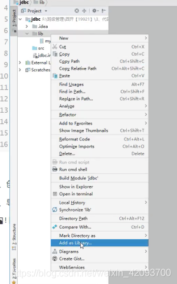
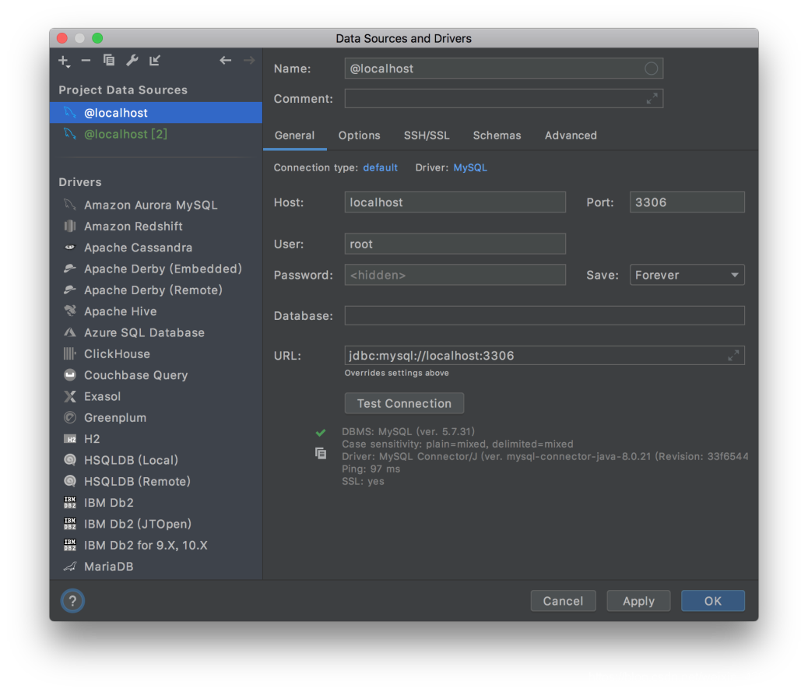
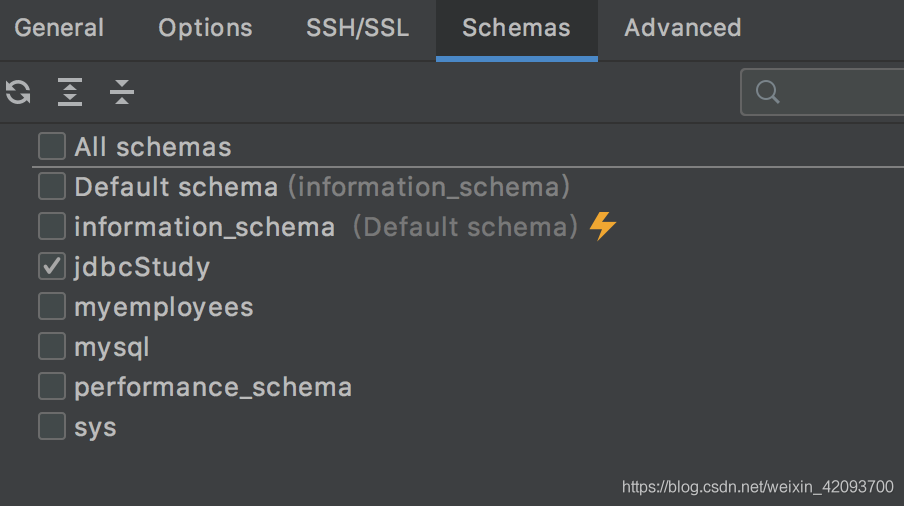
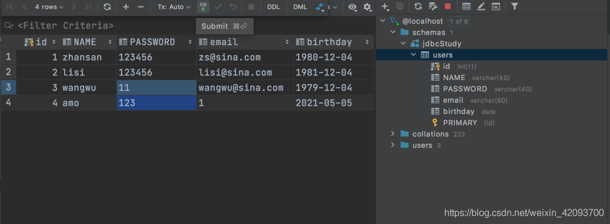

# 1、准备和资源

- 看的狂神说https://www.bilibili.com/video/BV1NJ411J79W?p=38
- 笔记参考https://blog.csdn.net/qq_33956536/article/details/107195051
- mysql-connector-java文件下载http://mvnrepository.com/artifact/mysql/mysql-connector-java
- commons-dbcp-1.4和commons-pool-1.6文件下载https://mvnrepository.com/artifact/commons-pool/commons-pool/1.6

# 2、第一个JDBC程序

1. 建立数据库

```sql
CREATE DATABASE jdbcStudy CHARACTER SET utf8 COLLATE utf8_general_ci;

USE jdbcStudy;

CREATE TABLE `users`(
id INT PRIMARY KEY,
NAME VARCHAR(40),
PASSWORD VARCHAR(40),
email VARCHAR(60),
birthday DATE
);

INSERT INTO `users`(id,NAME,PASSWORD,email,birthday)
VALUES(1,'zhansan','123456','zs@sina.com','1980-12-04'),
(2,'lisi','123456','lisi@sina.com','1981-12-04'),
(3,'wangwu','123456','wangwu@sina.com','1979-12-04')
12345678910111213141516
```

1. 创建项目
2. 导入驱动



1. 测试代码

```sql
package le1;

import java.sql.*;

public class JdbcDemo01 {
    public static void main(String[] args) throws ClassNotFoundException, SQLException {
        //1.加载驱动
        Class.forName("com.mysql.jdbc.Driver"); //固定写法

        //2.用户信息和url
        String url="jdbc:mysql://localhost:3306/jdbcstudy?useUnicode=true&characterEncoding=utf8&&useSSL=false";
        String name="root";
        String password="123";

        //3.连接成功，返回数据库对象，connection代表数据库
        Connection connection = DriverManager.getConnection(url, name, password);

        //4.执行SQL的对象statement
        Statement statement = connection.createStatement();

        //5.执行SQL的对象，去执行SQL 可能存在结果，查看返回结果
        String sql="SELECT * FROM users";
        ResultSet resultSet = statement.executeQuery(sql);
        while(resultSet.next()){
            System.out.println("name="+resultSet.getObject("NAME"));
        }

        //6.释放连接
        resultSet.close();
        statement.close();
        connection.close();
    }
}
123456789101112131415161718192021222324252627282930313233
```

步骤总结：
加载驱动——连接数据库（DriverManager）——获取执行SQL的对象（Statement）——获得返回结果集——释放连接

# 3、Statement对象详解

- 创建db.properties存储配置信息

```sql
driver=com.mysql.jdbc.Driver
url="jdbc:mysql://localhost:3306/jdbcstudy?useUnicode=true&characterEncoding=utf8&&useSSL=false"
username=root
password=123456
1234
```

- 写工具类读取信息

```sql
package le2.utils;

import java.io.IOException;
import java.io.InputStream;
import java.sql.*;
import java.util.Properties;

public class JdbcUtils {
    private static String driver=null;
    private static String url=null;
    private static String username=null;
    private static String password=null;

    static{
        try {
            InputStream in = JdbcUtils.class.getClassLoader().getResourceAsStream("db.properties");
            Properties properties = new Properties();
            properties.load(in);
            driver=properties.getProperty("driver");
            url=properties.getProperty("url");
            username=properties.getProperty("username");
            password=properties.getProperty("password");
            System.out.println(driver);
            //驱动只需要加载一次
            //Class.forName(driver);
            Class.forName("com.mysql.jdbc.Driver");
        } catch (IOException | ClassNotFoundException e) {
            e.printStackTrace();
        }
    }
    //获取连接
    public static Connection getConnection() throws SQLException {
        return DriverManager.getConnection(url, username, password);
    }
    //释放连接资源
    public static void release(Connection conn, Statement st,ResultSet rs){
        if(rs!=null){
            try {
                rs.close();
            } catch (SQLException throwables) {
                throwables.printStackTrace();
            }
        }
        if(st!=null){
            try {
                st.close();
            } catch (SQLException throwables) {
                throwables.printStackTrace();
            }
        }
        if(conn!=null){
            try {
                conn.close();
            } catch (SQLException throwables) {
                throwables.printStackTrace();
            }
        }
    }
}
1234567891011121314151617181920212223242526272829303132333435363738394041424344454647484950515253545556575859
```

- 插入与删除

```sql
package le2.utils;

import java.sql.Connection;
import java.sql.SQLException;
import java.sql.Statement;

public class TestDelete {
    public static void main(String[] args) {
        Statement statement=null;
        Connection connection=null;
        try {
            connection = JdbcUtils.getConnection();
            statement = connection.createStatement();
            String sql="DELETE FROM users where id=100";

            int i=statement.executeUpdate(sql);
            if(i>0)
                System.out.println("delete success");
        } catch (SQLException throwables) {
            throwables.printStackTrace();
        }finally {
            JdbcUtils.release(connection,statement,null);
        }
    }
}


package le2.utils;

import java.sql.Connection;
import java.sql.ResultSet;
import java.sql.SQLException;
import java.sql.Statement;

public class TestInsert {
    public static void main(String[] args) throws Exception{
        Connection connection = null;
        Statement statement =null;
        ResultSet rs=null;
        try {
            connection = JdbcUtils.getConnection();
            statement = connection.createStatement();
            String sql="insert into users(id,name,password,email,birthday)"+
                    "value(100,'txt','12','12','1998-08-08')";
            int i=statement.executeUpdate(sql);
            if(i>0)
                System.out.println("insert success");
        } catch (Exception e) {
            e.printStackTrace();
        }finally {
            JdbcUtils.release(connection,statement,rs);
        }
    }
}
123456789101112131415161718192021222324252627282930313233343536373839404142434445464748495051525354
```

- 查询

使用excuteQuery返回结果集，使用rs.next查看

```sql
package le2.utils;

import java.sql.Connection;
import java.sql.ResultSet;
import java.sql.SQLException;
import java.sql.Statement;

public class TestSelect {
    public static void main(String[] args) {
        Connection connection=null;
        Statement statement=null;
        ResultSet rs=null;
        try {
            connection= JdbcUtils.getConnection();
            statement = connection.createStatement();
            String sql="SELECT * FROM users";
            //返回结果集
            rs=statement.executeQuery(sql);
            while(rs.next()){
                System.out.println(rs.getString("NAME"));
            }
        } catch (SQLException throwables) {
            throwables.printStackTrace();
        }finally {
            JdbcUtils.release(connection,statement,rs);
        }

    }
}
1234567891011121314151617181920212223242526272829
```

# 4、SQL注入

> SQL注入即是指web应用程序对用户输入的数据的合法性没有判断或过滤不严，攻击者可以在web应用程序中事先定义好的查询语句的结尾填上额外的SQL语句，来实现欺骗数据库服务器执行非授权的任意查询。

```sql
package le2.utils;

import java.sql.Connection;
import java.sql.ResultSet;
import java.sql.SQLException;
import java.sql.Statement;

public class TestSelect {
    public static void main(String[] args) {
        Connection connection = null;
        Statement statement = null;
        ResultSet rs = null;
        String username="lisi";
        String sqlInjection="lisi' or '1=1";
        try {
            connection = JdbcUtils.getConnection();
            statement = connection.createStatement();
//            String sql="SELECT * FROM users";
            //SELECT * FROM users WHERE NAME="lisi";
            //SELECT * FROM users WHERE NAME="lisi" OR 1=1; //这样会泄露信息
//            String sql = "SELECT * FROM users WHERE NAME='"+username+"'";
            String sql = "SELECT * FROM users WHERE NAME='"+sqlInjection+"'";


            //返回结果集
            rs = statement.executeQuery(sql);
            while (rs.next()) {
                System.out.print(rs.getString("NAME"));
                System.out.println(rs.getString("PASSWORD"));
            }
        } catch (SQLException throwables) {
            throwables.printStackTrace();
        } finally {
            JdbcUtils.release(connection, statement, rs);
        }

    }
}
1234567891011121314151617181920212223242526272829303132333435363738
```

# 5、PreparedStatement对象

先写sql语句并且使用“？”占位符替代参数完成预编译，然后手动给参数赋值。

- 插入

```sql
package le3;

import le2.utils.JdbcUtils;

import java.sql.Connection;
import java.sql.PreparedStatement;
import java.sql.SQLException;
import java.util.Date;

public class TestInsert {
    public static void main(String[] args) {
        Connection conn=null;
        PreparedStatement st=null;
        try {
            conn = JdbcUtils.getConnection();
            //区别：使用？占位符代替参数
            String sql="insert into users values(?,?,?,?,?)";
            //预编译SQL，先写SQL然后不执行
            st=conn.prepareStatement(sql);
            //手动给参数赋值
            st.setInt(1,4);
            st.setString(2,"amo");
            st.setString(3,"123");
            st.setString(4,"1");
            st.setDate(5,new java.sql.Date(new Date().getTime()));

            //执行
            int i = st.executeUpdate();
            if(i>0)
                System.out.println("insert success");

        } catch (SQLException throwables) {
            throwables.printStackTrace();
        }finally {
            JdbcUtils.release(conn,st,null);
        }
    }
}
1234567891011121314151617181920212223242526272829303132333435363738
```

- 查询

```sql
package le3;

import le2.utils.JdbcUtils;

import java.sql.*;

public class TestSelect {
    public static void main(String[] args) {
        Connection conn=null;
        PreparedStatement st=null;
        ResultSet rs=null;
        try {
            conn = JdbcUtils.getConnection();
            String sql="SELECT * FROM users WHERE id=?";
            st=conn.prepareStatement(sql);
            st.setInt(1,1);
            rs=st.executeQuery();
            while(rs.next()){
                System.out.println(rs.getString("NAME"));
            }
        } catch (SQLException throwables) {
            throwables.printStackTrace();
        }finally {
            JdbcUtils.release(conn,st,rs);
        }
    }
}
123456789101112131415161718192021222324252627
```

- SQL注入

PreparedStatement 防止SQL注入的本质是把传递进来的参数当做字符。假设其中存在转义字符，如’ 会被直接转义。

```sql
package le3;

import le2.utils.JdbcUtils;

import java.sql.Connection;
import java.sql.PreparedStatement;
import java.sql.ResultSet;
import java.sql.SQLException;

public class TestSqlInjection {
    public static void main(String[] args) {
        Connection conn=null;
        PreparedStatement st=null;
        ResultSet rs=null;
        try {
            conn = JdbcUtils.getConnection();
            //SELECT * FROM users WHERE NAME='amo' or '1=1';
            String sql="SELECT * FROM users WHERE NAME=?";
            st=conn.prepareStatement(sql);

            //SqlInjection
            //st.setString(1,"amo");
            st.setString(1,"amo or 1=1");   //返回的是空值

            rs=st.executeQuery();
            while(rs.next()){
                System.out.print(rs.getString("NAME"));
                System.out.println(rs.getString("PASSWORD"));
            }
        } catch (SQLException throwables) {
            throwables.printStackTrace();
        }finally {
            JdbcUtils.release(conn,st,rs);
        }
    }
}
```

# 6、IDEA连接数据库

- 填写user和password即可连接到数据库。
    
- Schemas可以选择显示的数据库
    
- 双击数据表即可显示数据表内容
- 双击某个数据并修改，再点击DB提交修改，即可修改数据库内容。
    

# 7、JDBC事务

```sql
package le4;

import le2.utils.JdbcUtils;

import java.sql.Connection;
import java.sql.PreparedStatement;
import java.sql.ResultSet;
import java.sql.SQLException;

public class TestTransaction {
    public static void main(String[] args) {
        Connection conn = null;
        PreparedStatement st = null;
        ResultSet rs = null;
        try {
            conn = JdbcUtils.getConnection();
            //关闭自动提交功能，开始事务
            conn.setAutoCommit(false);
            String sql1 = "UPDATE account set money=money-100 WHERE name='A'";
            st = conn.prepareStatement(sql1);
            st.executeUpdate();

            //会导致操作失败，事务回滚。
            int x=1/0;

            String sql2 = "UPDATE account set money=money+100 WHERE name='B'";
            st = conn.prepareStatement(sql2);
            st.executeUpdate();

            //业务完毕提交事务
            conn.commit();
            System.out.println("Success");

        } catch (SQLException throwables) {
            //如果失败则回滚
            try {
                conn.rollback();
            } catch (SQLException e) {
                e.printStackTrace();
            }
            throwables.printStackTrace();
        } finally {
            JdbcUtils.release(conn,st,rs);
        }
    }
}

```

# 8、数据库连接池

数据库连接——执行完毕——释放十分消耗资源
池化技术：准备一些预先的资源，过来就连接，使用预先准备好的服务。

- 常用连接数10个
    - 最小连接数10个
    - 最大连接数15个（超过15个请求需要排队）
    - 等待超时：等待时间超过一定值直接失败

编写连接池：实现DataSource接口，开源数据源实现：DBCP、C3P0、Druid。使用连接池，省去直接使用getconnection()即可（不用手动编写）。

- 配置文件

报错试设置useSSL=false;

```sql
#连接设置
driverClassName=com.mysql.jdbc.Driver
url=jdbc:mysql://localhost:3306/jdbcstudy?useUnicode=true&characterEncoding=utf8&useSSL=false
username=root
password=123

#!-- 初始化连接 --
initialSize=10

#最大连接数量
maxActive=50

#!-- 最大空闲连接 --
maxIdle=20

#!-- 最小空闲连接 --
minIdle=5

#!-- 超时等待时间以毫秒为单位 6000毫秒/1000等于60秒 --
maxWait=60000
#JDBC驱动建立连接时附带的连接属性属性的格式必须为这样：【属性名=property;】
#注意：user 与 password 两个属性会被明确地传递，因此这里不需要包含他们。
connectionProperties=useUnicode=true;characterEncoding=UTF8

#指定由连接池所创建的连接的自动提交（auto-commit）状态。
defaultAutoCommit=true

#driver default 指定由连接池所创建的连接的只读（read-only）状态。
#如果没有设置该值，则“setReadOnly”方法将不被调用。（某些驱动并不支持只读模式，如：Informix）
defaultReadOnly=

#driver default 指定由连接池所创建的连接的事务级别（TransactionIsolation）。
#可用值为下列之一：（详情可见javadoc。）NONE,READ_UNCOMMITTED, READ_COMMITTED, REPEATABLE_READ, SERIALIZABLE
defaultTransactionIsolation=READ_UNCOMMITTED
12345678910111213141516171819202122232425262728293031323334
```

- 工具类

```sql
package le5.utils;

import org.apache.commons.dbcp.BasicDataSource;
import org.apache.commons.dbcp.BasicDataSourceFactory;

import javax.sql.DataSource;
import java.io.InputStream;
import java.sql.Connection;
import java.sql.ResultSet;
import java.sql.SQLException;
import java.sql.Statement;
import java.util.Properties;

public class JdbcUtils_DBCP {
    private static DataSource dataSource=null;
    static {
        try {
            InputStream in = JdbcUtils_DBCP.class.getClassLoader().getResourceAsStream("dbcpconfig.properties");
            Properties properties=new Properties();
            properties.load(in);
            //创建数据源 工厂模式->创建
            dataSource= BasicDataSourceFactory.createDataSource(properties);
        } catch (Exception e) {
            e.printStackTrace();
        }
    }

    //获取连接
    public static Connection getConnection() throws SQLException{
        return dataSource.getConnection();//从数据源获取连接
    }

    //释放连接资源
    public static void release(Connection conn, Statement st, ResultSet rs){
        if(rs!=null){
            try {
                rs.close();
            } catch (SQLException throwables) {
                throwables.printStackTrace();
            }
        }
        if(st!=null){
            try {
                st.close();
            } catch (SQLException throwables) {
                throwables.printStackTrace();
            }
        }
        if(conn!=null){
            try {
                conn.close();
            } catch (SQLException throwables) {
                throwables.printStackTrace();
            }
        }
    }
}
```

- 测试类

查询

```sql
package le5.utils;

import java.sql.Connection;
import java.sql.ResultSet;
import java.sql.SQLException;
import java.sql.Statement;

public class TestDBCP {
    public static void main(String[] args) {
        Connection connection = null;
        Statement statement = null;
        ResultSet rs = null;
        String username="lisi";
        try {
            connection = JdbcUtils_DBCP.getConnection();
            statement = connection.createStatement();
            String sql = "SELECT * FROM users";

            //返回结果集
            rs = statement.executeQuery(sql);
            while (rs.next()) {
                System.out.print(rs.getString("NAME"));
                System.out.println(rs.getString("PASSWORD"));
            }
        } catch (SQLException throwables) {
            throwables.printStackTrace();
        } finally {
            JdbcUtils_DBCP.release(connection, statement, rs);
        }

    }
}
1234567891011121314151617181920212223242526272829303132
```

插入

```sql
package le5.utils;

import le2.utils.JdbcUtils;

import java.sql.Connection;
import java.sql.ResultSet;
import java.sql.Statement;

public class TestDBCPInsert {
    public static void main(String[] args) throws Exception{
        Connection connection = null;
        Statement statement =null;
        ResultSet rs=null;
        try {
            connection = JdbcUtils_DBCP.getConnection();
            statement = connection.createStatement();
            String sql="insert into users(id,name,password,email,birthday)"+
                    "value(100,'txt','12','12','1998-08-08')";
            int i=statement.executeUpdate(sql);
            if(i>0)
                System.out.println("insert success");
        } catch (Exception e) {
            e.printStackTrace();
        }finally {
            JdbcUtils_DBCP.release(connection,statement,rs);
        }
    }
}
```

