[toc]

# 杂记

1.idea连接mysql时设置时区：

~~~ sql
serverTimezone=UTC ，表示全球标准时间，北京时间比它早了8个小时。
//北京时间东八区
serverTimezone=GMT%2B8 
//或者使用上海时间
serverTimezone=Asia/Shanghai
~~~

2. url:

    ```http
    jdbc:mysql://localhost:3306/mybatisstudy?useSSL=true&useUnicode=true&characterEncoding=utf-8&serverTimezone=UTC
    ```

3. lompk导入：

    ~~~ xml
    <dependency>
        <groupId>org.projectlombok</groupId>
        <artifactId>lombok</artifactId>
        <version>1.16.10</version>
        <scope>provided</scope>
    </dependency>
    ~~~

4. 工厂设计模式：以前也用过，就是使用静态方法创建对象：**类名.方法名(参数)的方式;**

5. maven的资源过滤问题：maven由于他的约定大于配置，我们之后可以能遇到我们写的配置文件，无法被导出或者生效的问题，解决方案:

    ~~~ xml
    <build>
       <resources>
           <resource>
               <directory>src/main/java</directory>
               <includes>
                   <include>**/*.properties</include>
                   <include>**/*.xml</include>
               </includes>
               <filtering>false</filtering>
           </resource>
           <resource>
               <directory>src/main/resources</directory>
               <includes>
                   <include>**/*.properties</include>
                   <include>**/*.xml</include>
               </includes>
               <filtering>false</filtering>
           </resource>
       </resources>
    </build>
    ~~~

6. 事务：增删改查需要提交事务，这样才可以执行与**回滚**

# 前言

## 环境

- JDK1.8
- Mysql5.7
- maven 3.6.3
- IDEA

## 回顾

- JDBC
- Mysql
- Java基础
- Maven
- Junit

## SSM框架：配置文件的最好的方式：看官网文档


# 1、Mybatis简介（2020-10-21）

## 1.1 什么是Mybatis


- MyBatis 是一款优秀的持久层框架，它支持自定义 SQL、存储过程以及高级映射。
- MyBatis 免除了几乎所有的 JDBC 代码以及设置参数和获取结果集的工作。
- MyBatis 可以通过简单的 XML 或注解来配置和映射原始类型、接口和 Java POJO（Plain Old Java Objects，普通老式 Java 对象）为数据库中的记录。
- MyBatis 本是apache的一个[开源项目](https://baike.baidu.com/item/开源项目/3406069)iBatis, 2010年这个[项目](https://baike.baidu.com/item/项目/477803)由apache software foundation 迁移到了[google code](https://baike.baidu.com/item/google code/2346604)，并且改名为MyBatis 。
- 2013年11月迁移到[Github](https://baike.baidu.com/item/Github/10145341)。


如何获得Mybatis

- maven仓库：

    ~~~xml
    <!-- https://mvnrepository.com/artifact/org.mybatis/mybatis -->
    <dependency>
        <groupId>org.mybatis</groupId>
        <artifactId>mybatis</artifactId>
        <version>3.5.6</version>
    </dependency>
    ~~~

- 中文文档：https://mybatis.org/mybatis-3/zh/index.html

- Github:https://github.com/mybatis/mybatis-3


## 1.2 持久化

数据持久化

- 持久化就是将程序的数据在持久状态和瞬时状态转化的过程
- 内存：**断电即失**
- 数据库（Jdbc），io文件持久化
- 生活方面例子：冷藏，罐头。

**为什么需要持久化？**

- 不想丢掉一些对象
- 内存太贵

## 1.3 持久层

Dao层，Service层，Controller层…

- 完成持久化工作的代码块
- 层界限十分明显

## 1.4 为什么需要Mybatis？

- 简单易学

- 灵活

- sql和代码的分离，提高了可维护性。

- 提供映射标签，支持对象与数据库的orm字段关系映射

- 提供对象关系映射标签，支持对象关系组建维护

- 提供xml标签，支持编写动态sql。 

    

# 2、第一个Mybatis程序

思路：搭建环境–>导入Mybatis–>编写代码–>测试

## 2.1 搭建环境

搭建数据库
新建项目

- 新建一个数据库表

    ~~~ sql
    use mybatisstudy;
    
    create table user(
    	id int(29) not null primary key,
    	name varchar(30) default null,
    	pwd varchar(30) default null
    )ENGINE=INNODB default charset=utf8;
    
    INSERT into user(id,name,pwd) values
    	(1,'alice','123'),
    	(2,'jonh','123'),
    	(3,'yaml','123')
    ~~~

- 新建一个普通maven项目
- 删除src目录
- 导入maven依赖

~~~ xml
<?xml version="1.0" encoding="UTF-8" ?>
<!DOCTYPE configuration
        PUBLIC "-//mybatis.org//DTD Config 3.0//EN"
        "http://mybatis.org/dtd/mybatis-3-config.dtd">
<!--configuration core file-->
<configuration>
    <!--  环境配置，可以配置多个环境,default属性值表示默认环境  -->
    <environments default="development">
        <!-- 一个环境 -->
        <environment id="development">
            <!-- 事务管理 -->
            <transactionManager type="JDBC"/>
            <!-- 连接池 -->
            <dataSource type="POOLED">
                <property name="driver" value="com.mysql.jdbc.Driver"/>
                <property name="url" value="jdbc:mysql://localhost:3306/mybatisstudy?useSSL=true&useUnicode=true&characterEncoding=utf-8&serverTimezone=UTC"/>
                <property name="username" value="097"/>
                <property name="password" value="123456"/>
            </dataSource>
        </environment>
    </environments>
</configuration>
~~~

自己在此用了mybatis3.5.2版本在之后导包会失败，所以换成3.5.6版本。


## 2.2 创建一个模块

- 编写mybatis的核心配置文件

    ~~~xml
    <?xml version="1.0" encoding="UTF-8" ?>
    <!DOCTYPE configuration
            PUBLIC "-//mybatis.org//DTD Config 3.0//EN"
            "http://mybatis.org/dtd/mybatis-3-config.dtd">
    <!--configuration core file-->
    <configuration>
    
        <environments default="development">
            <environment id="development">
                <transactionManager type="JDBC"/>
                <dataSource type="POOLED">
                    <property name="driver" value="com.mysql.jdbc.Driver"/>
                    <property name="url" value="jdbc:mysql://localhost:3306/mybatis?useSSL=false&amp;useUnicode=true&amp;characterEncoding=UTF-8"/>
                    <property name="username" value="root"/>
                    <property name="password" value="123456"/>
                </dataSource>
            </environment>
        </environments>
    
        <!--a Mapper.xml need regist in Mybatis core configuration file-->
        <mappers>
            <mapper resource="com/gu/dao/UserMapper.xml"/>
        </mappers>
    </configuration>
    ~~~

    **此处设useSSL=false。**

    

    - 编写mybatis工具类：工厂模式，同SqlSessionFactory创造引用配置文件里面的配置，然后用工厂Build一个SqlSession出来。**SqlSession包含了面向数据库执行时所需的所有方法。**

~~~ java
//构建sqlSessionFactory,用它产生sqlSession
public class MybatisUtil {
    private static SqlSessionFactory sqlSessionFactory;
    static {
        try {
            //使用Mybatis第一步：获取sqlSessionFactory对象
            String resource = "mybatis-config.xml";
            InputStream inputStream = Resources.getResourceAsStream(resource);
            sqlSessionFactory = new SqlSessionFactoryBuilder().build(inputStream);
        } catch (IOException e) {
            e.printStackTrace();
        }
    }

    //既然有了 sqlSessionFactory，顾名思义，我们就可以从中获得 SqlSession 的实例了。
    //SqLSession完全包含了面数据库执行soL命令所需的所有方法。
    public static SqlSession getSqlSession(){
        return sqlSessionFactory.openSession();
    }
}

~~~

​        

## 2.3 编写代码

- 实体类

~~~ java
@Data
@ToString
@AllArgsConstructor
@NoArgsConstructor
public class User {
    int id;
    String name;
    String pwd;
}
~~~


- Dao接口

```java
public interface UserMapper {
    List<User> getUserList();

    User getUserById(int id);
}
```


- 正常情况下，UserDao需要用一个UserDaoImpl来实现各种增删改查，现在只需要一个Mapper配置文件即可。

~~~ xml
<?xml version="1.0" encoding="UTF-8" ?>
<!DOCTYPE mapper
        PUBLIC "-//mybatis.org//DTD Mapper 3.0//EN"
        "http://mybatis.org/dtd/mybatis-3-mapper.dtd">
<mapper namespace="com.gu.dao.UserMapper">
    <select id="getUserList" resultType="com.gu.pojo.User">
        select * from user
    </select>
</mapper>
~~~


## 2.4 测试
注意点：

- org.apache.ibatis.binding.BindingException: Type interface com.kuang.dao.UserDao is not known to the MapperRegistry.

MapperRegistry是什么？

​	核心配置文件中注册mappers


- junit测试

```java
    @Test
    public void test(){
        //第一步：获得SqlSession对象
        SqlSession sqlSession = MybatisUtil.getSqlSession();

        //方式一：getMapper
        UserMapper userMapper = sqlSession.getMapper(UserMapper.class);
        List<User> userList = userMapper.getUserList();

        //方式二：selectList
        //List<User> userList = sqlSession.selectList("com.gu.dao.UserMapper.getUserList");

        for (User user : userList) {
            System.out.println(user);
        }

        //关闭SqlSession
        sqlSession.close();
    }
```

可能遇到的问题：

1. 配置文件没有注册；
2. 绑定接口错误；
3. 方法名不对；
4. 返回类型不对；
5. Maven导出资源问题。

## 2.5、总结

创建一个Mybatis程序完全使用xml文件的步骤：

1. 创建maven项目，导入依赖

2. 编写Mybatis配置文件
3. 创建Util类，从工厂中生成SqlSession以供使用
4. 编写pojo类：User
5. 编写Dao接口：UserDao
6. 编写UserMapper并将UserMapper在Mybatis文件中注册
7. 测试


# 3、CRUD

## 3.1 namespace

namespace中的包名要和Dao/Mapper接口的包名一致！

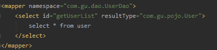

## 3.2 select

选择，查询语句；

- id:就是对应的namespace中的方法名；
- resultType:Sql语句执行的返回值！
- parameterType:参数类型！

1.编写接口

```java
//根据id查询用户
    User getUserById(int id);
```

2.编写对应的mapper中的sql语句

```xml
<select id="getUserById" resultType="com.gu.pojo.User" parameterType="int">
    select * from user where id=#{id};
</select>
```
3.测试

```java
@Test
public void SelectTest() {
    SqlSession sqlSession = MybatisUtil.getSqlSession();
    UserMapper userMapper = sqlSession.getMapper(UserMapper.class);
    User user = userMapper.getUserById(2);
    System.out.println(user.toString());
    sqlSession.close();
}
```
## 3.3 Insert

```xml
<insert id="addUser" parameterType="com.gu.pojo.User">
    insert into user(id,name,pwd) value(#{id},#{name},#{pwd});
</insert>
```

```java
@Test
public void AddUserTest() {
    SqlSession sqlSession = MybatisUtil.getSqlSession();
    UserMapper userMapper = sqlSession.getMapper(UserMapper.class);
    int x = userMapper.addUser(new User(5, "李四", "789"));
    if (x > 0) {
        System.out.println("插入数据成功");
    }
    //提交事务
    sqlSession.commit();

    sqlSession.close();
}
```

## 3.4 Update

```xml
<update id="updateUser" parameterType="com.gu.pojo.User">
    update mybatisstudy.user set name=#{name} , pwd=#{pwd} where id=#{id};
</update>
```

## 3.5 Delete

```xml
<delete id="deleteUser" parameterType="int">
    delete from user where id=#{id};
</delete>
```

**注意点：**

- **增删改需要提交事务！**

## 3.6 分析错误

1. xml文件中注释不能出现中文报错，查看自己的是UTF-8还是GBK编码，改成为相应的就行。

```xml
<?xml version="1.0" encoding="UTF-8" ?>

<?xml version="1.0" encoding="GBK" ?>
```

即可成功测试。

1. 标签不要匹配错！
2. resource绑定mapper，需要使用路径！
3. 程序配置文件必须符合规范！
4. NullPointerException，没有注册到资源！
5. maven资源没有导出问题！


## 3.7 万能Map

假如，我们的实体类或者数据库中的表，有非常多的字段（列），一个一个写上去太麻烦，这个时候可以考虑使用Map：

~~~JAVA
//万能Map
int addUserByMap(Map<String, Object> map);
~~~

```xml
<insert id="addUserByMap" parameterType="map">
    insert into user(id,name,pwd) values(#{key1},#{key2},#{key3})
</insert>
```

~~~ java
@Test
public void addUserByMap() {
    SqlSession sqlSession = MybatisUtil.getSqlSession();
    UserMapper userMapper = sqlSession.getMapper(UserMapper.class);
    HashMap<String, Object> hashMap = new HashMap<String, Object>();

    hashMap.put("key1", 5);
    hashMap.put("key2", "map");
    hashMap.put("key3", "111");

    userMapper.addUserByMap(hashMap);

    sqlSession.commit();
    sqlSession.close();
}
~~~

Map传递参数，直接在sql中取出key即可！【parameterType=“map”】

对象传递参数，直接在sql中取对象的属性即可！【parameterType=“Object”】

**只有一个基本类型参数的情况下，可以直接在sql中取到！**

**多个参数用Map，或者注解！**


## 3.8 思考题
模糊查询怎么写？两种方法：

1. java代码执行的时候，传递通配符% %（推荐，不会产生sql注入问题）

~~~ java
List<User> userList = mapper.getUserLike("%李%");
~~~

2. 在sql拼接中使用通配符！

```sql
select * from mybatis.user where name like "%"#{value}"%"
```


# 4、配置解析（2020-10-23）

## 4.1 核心配置文件

- mybatis-config.xml

- MyBatis的配置文件包含了会深深影响MyBatis行为的设置和属性信息。

    MyBatis 的配置文件包含了会深深影响 MyBatis 行为的设置和属性信息。 配置文档的顶层结构如下：
    
    - configuration（配置）
        - properties（属性）
        - settings（设置）
        - typeAliases（类型别名）
        - typeHandlers（类型处理器）
        - objectFactory（对象工厂）
        - plugins（插件）
        - environments（环境配置）
            - environment（环境变量）
                - transactionManager（事务管理器）
                - dataSource（数据源）
        - databaseIdProvider（数据库厂商标识）
        - mappers（映射器）


## 4.2 环境配置（environments）
Mybatis可以配置成适应多种环境

不过要记住：尽管可以配置多个环境，但**每个SqlSessionFactory实例只能选择一种环境**。

学会使用配置多套运行环境！

Mybatis自带两种事务管理器：JDBC与MANAGED，

如果当前使用Spring+Mybatis，就不用管事务管理器的事。

**Mybatis默认的事务管理器就是JDBC,默认的连接池：POOLED**


## 4.3 属性（properties）

我们可以通过properties属性来实现引用配置文件

这些属性都是可外部配置且可动态替换的，既可以在典型的Java属性文件中配置，亦可通过properties元素的子元素来传递。【db.properties】

编写一个配置文件
db.properties

```properties
driver=com.mysql.jdbc.Driver
url=jdbc:mysql://localhost:3306/mybatisstudy?useSSL=true&amp;useUnicode=true&amp;characterEncoding=utf-8&amp;serverTimezone=UTC
username=097
password=123456
```

在核心配置文件中映入

~~~ xml
<properties resource="db.properties" >
    <property name="url" value="jdbc:mysql://localhost:3306/mybatisstudy?useSSL=true&amp;useUnicode=true&amp;characterEncoding=utf-8&amp;serverTimezone=UTC"/>
    <property name="driver" value="com.mysql.jdbc.Driver"/>
</properties>
~~~

- (properties?,settings?,typeAliases?,typeHandlers?,objectFactory?,objectWrapperFactory?,reflectorFactory?,plugins?,environments?,databaseIdProvider?,mappers?)".必须按照以上顺序来写核心配置文件，**properties在最前面。**
- 可以直接引入外部文件
- 可以在其中增加一些属性配置
- 如果两个文件有同一个字段，**优先使用外部配置文件的！**


## 4.4 类型别名（typeAliases）

- 类型别名是为Java类型设置一个短的名字。
- 存在的意义仅在于用来减少类完全限定名的冗余。

```xml
	<!--可以给实体类起别名-->
    <typeAliases>
        <typeAlias type="com.kuang.pojo.User" alias="User"/>
    </typeAliases>
```

也可以指定一个包名，MyBatis会在包名下面搜索需要的JavaBean，比如：
扫描实体类的包，它的**默认别名就为这个类的类名，首字母小写！**

~~~xml
	<!--可以给实体类起别名-->
    <typeAliases>
        <package name="com.kuang.pojo"/>
    </typeAliases>
~~~


- 实体类比较少的时候使用第一种，实体类比较多的时候使用第二种
- 第一种可以直接DIY别名，但是第二种不可以，但是可以配合注解@Alias("别名")达到DIY别名的效果。

```java
@Alias("hellouser")
public class User {
    int id;
    String name;
    String pwd;
}
```

## 4.5 设置

这是MyBatis中极为重要的调整设置，它们会改变MyBatis的运行时行为。

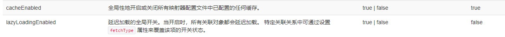

mapUnderscoreToCamelCase：自动开启驼峰命名。例如实体类里面变量名是lastName，数据库中一般是last_name，这个设置开启后会自动完成此项操作。

## 4.6 其他配置

- typeHandlers（类型处理器）
- objectFactory（对象工厂）
- plugins（插件）
    - mybatis-generator-core
    - mybatis-plus
    - 通用mapper

这是 MyBatis 中极为重要的调整设置，它们会改变 MyBatis 的运行时行为。 下表描述了设置中各项设置的含义、默认值等。

|              设置名              | 描述                                                         | 有效值                                                       | 默认值                                                |
| :------------------------------: | :----------------------------------------------------------- | :----------------------------------------------------------- | :---------------------------------------------------- |
|           cacheEnabled           | 全局性地开启或关闭所有映射器配置文件中已配置的任何缓存。     | true \| false                                                | true                                                  |
|        lazyLoadingEnabled        | 延迟加载的全局开关。当开启时，所有关联对象都会延迟加载。 特定关联关系中可通过设置 `fetchType` 属性来覆盖该项的开关状态。 | true \| false                                                | false                                                 |
|      aggressiveLazyLoading       | 开启时，任一方法的调用都会加载该对象的所有延迟加载属性。 否则，每个延迟加载属性会按需加载（参考 `lazyLoadTriggerMethods`)。 | true \| false                                                | false （在 3.4.1 及之前的版本中默认为 true）          |
|    multipleResultSetsEnabled     | 是否允许单个语句返回多结果集（需要数据库驱动支持）。         | true \| false                                                | true                                                  |
|          useColumnLabel          | 使用列标签代替列名。实际表现依赖于数据库驱动，具体可参考数据库驱动的相关文档，或通过对比测试来观察。 | true \| false                                                | true                                                  |
|         useGeneratedKeys         | 允许 JDBC 支持自动生成主键，需要数据库驱动支持。如果设置为 true，将强制使用自动生成主键。尽管一些数据库驱动不支持此特性，但仍可正常工作（如 Derby）。 | true \| false                                                | False                                                 |
|       autoMappingBehavior        | 指定 MyBatis 应如何自动映射列到字段或属性。 NONE 表示关闭自动映射；PARTIAL 只会自动映射没有定义嵌套结果映射的字段。 FULL 会自动映射任何复杂的结果集（无论是否嵌套）。 | NONE, PARTIAL, FULL                                          | PARTIAL                                               |
| autoMappingUnknownColumnBehavior | 指定发现自动映射目标未知列（或未知属性类型）的行为。`NONE`: 不做任何反应`WARNING`: 输出警告日志（`'org.apache.ibatis.session.AutoMappingUnknownColumnBehavior'` 的日志等级必须设置为 `WARN`）`FAILING`: 映射失败 (抛出 `SqlSessionException`) | NONE, WARNING, FAILING                                       | NONE                                                  |
|       defaultExecutorType        | 配置默认的执行器。SIMPLE 就是普通的执行器；REUSE 执行器会重用预处理语句（PreparedStatement）； BATCH 执行器不仅重用语句还会执行批量更新。 | SIMPLE REUSE BATCH                                           | SIMPLE                                                |
|     defaultStatementTimeout      | 设置超时时间，它决定数据库驱动等待数据库响应的秒数。         | 任意正整数                                                   | 未设置 (null)                                         |
|         defaultFetchSize         | 为驱动的结果集获取数量（fetchSize）设置一个建议值。此参数只可以在查询设置中被覆盖。 | 任意正整数                                                   | 未设置 (null)                                         |
|       defaultResultSetType       | 指定语句默认的滚动策略。（新增于 3.5.2）                     | FORWARD_ONLY \| SCROLL_SENSITIVE \| SCROLL_INSENSITIVE \| DEFAULT（等同于未设置） | 未设置 (null)                                         |
|       safeRowBoundsEnabled       | 是否允许在嵌套语句中使用分页（RowBounds）。如果允许使用则设置为 false。 | true \| false                                                | False                                                 |
|     safeResultHandlerEnabled     | 是否允许在嵌套语句中使用结果处理器（ResultHandler）。如果允许使用则设置为 false。 | true \| false                                                | True                                                  |
|     mapUnderscoreToCamelCase     | 是否开启驼峰命名自动映射，即从经典数据库列名 A_COLUMN 映射到经典 Java 属性名 aColumn。 | true \| false                                                | False                                                 |
|         localCacheScope          | MyBatis 利用本地缓存机制（Local Cache）防止循环引用和加速重复的嵌套查询。 默认值为 SESSION，会缓存一个会话中执行的所有查询。 若设置值为 STATEMENT，本地缓存将仅用于执行语句，对相同 SqlSession 的不同查询将不会进行缓存。 | SESSION \| STATEMENT                                         | SESSION                                               |
|         jdbcTypeForNull          | 当没有为参数指定特定的 JDBC 类型时，空值的默认 JDBC 类型。 某些数据库驱动需要指定列的 JDBC 类型，多数情况直接用一般类型即可，比如 NULL、VARCHAR 或 OTHER。 | JdbcType 常量，常用值：NULL、VARCHAR 或 OTHER。              | OTHER                                                 |
|      lazyLoadTriggerMethods      | 指定对象的哪些方法触发一次延迟加载。                         | 用逗号分隔的方法列表。                                       | equals,clone,hashCode,toString                        |
|     defaultScriptingLanguage     | 指定动态 SQL 生成使用的默认脚本语言。                        | 一个类型别名或全限定类名。                                   | org.apache.ibatis.scripting.xmltags.XMLLanguageDriver |
|      defaultEnumTypeHandler      | 指定 Enum 使用的默认 `TypeHandler` 。（新增于 3.4.5）        | 一个类型别名或全限定类名。                                   | org.apache.ibatis.type.EnumTypeHandler                |
|        callSettersOnNulls        | 指定当结果集中值为 null 的时候是否调用映射对象的 setter（map 对象时为 put）方法，这在依赖于 Map.keySet() 或 null 值进行初始化时比较有用。注意基本类型（int、boolean 等）是不能设置成 null 的。 | true \| false                                                | false                                                 |
|    returnInstanceForEmptyRow     | 当返回行的所有列都是空时，MyBatis默认返回 `null`。 当开启这个设置时，MyBatis会返回一个空实例。 请注意，它也适用于嵌套的结果集（如集合或关联）。（新增于 3.4.2） | true \| false                                                | false                                                 |
|            logPrefix             | 指定 MyBatis 增加到日志名称的前缀。                          | 任何字符串                                                   | 未设置                                                |
|             logImpl              | 指定 MyBatis 所用日志的具体实现，未指定时将自动查找。        | SLF4J \| LOG4J \| LOG4J2 \| JDK_LOGGING \| COMMONS_LOGGING \| STDOUT_LOGGING \| NO_LOGGING | 未设置                                                |
|           proxyFactory           | 指定 Mybatis 创建可延迟加载对象所用到的代理工具。            | CGLIB \| JAVASSIST                                           | JAVASSIST （MyBatis 3.3 以上）                        |
|             vfsImpl              | 指定 VFS 的实现                                              | 自定义 VFS 的实现的类全限定名，以逗号分隔。                  | 未设置                                                |
|        useActualParamName        | 允许使用方法签名中的名称作为语句参数名称。 为了使用该特性，你的项目必须采用 Java 8 编译，并且加上 `-parameters` 选项。（新增于 3.4.1） | true \| false                                                | true                                                  |
|       configurationFactory       | 指定一个提供 `Configuration` 实例的类。 这个被返回的 Configuration 实例用来加载被反序列化对象的延迟加载属性值。 这个类必须包含一个签名为`static Configuration getConfiguration()` 的方法。（新增于 3.2.3） | 一个类型别名或完全限定类名。                                 | 未设置                                                |
|      shrinkWhitespacesInSql      | 从SQL中删除多余的空格字符。请注意，这也会影响SQL中的文字字符串。 (新增于 3.5.5) | true \| false                                                | false                                                 |
|      defaultSqlProviderType      | Specifies an sql provider class that holds provider method (Since 3.5.6). This class apply to the `type`(or `value`) attribute on sql provider annotation(e.g. `@SelectProvider`), when these attribute was omitted. | A type alias or fully qualified class name                   | Not set                                               |

## 4.7 映射器（mappers）
MapperRegistry：注册绑定我们的Mapper文件；

方式一：【推荐使用】

~~~ xml
    <!--每一个Mapper.xml都需要在Mybatis核心配置文件中注册！-->
    <mappers>
        <mapper resource="com/kuang/dao/UserMapper.xml"/>
    </mappers>
~~~

方式二：使用class文件绑定注册

~~~ xml
    <!--每一个Mapper.xml都需要在Mybatis核心配置文件中注册！-->
    <mappers>
        <mapper class="com.kuang.dao.UserMapper"/>
    </mappers>
~~~

注意点：

- 接口和它的Mapper配置文件必须同名！
- 接口和它的Mapper配置文件必须在同一个包下!

方式三：使用扫描包进行注入绑定

~~~ xml
    <!--每一个Mapper.xml都需要在Mybatis核心配置文件中注册！-->
    <mappers>
        <package name="com.kuang.dao"/>
    </mappers>
~~~

注意点：

- 接口和它的Mapper配置文件必须同名！
- 接口和它的Mapper配置文件必须在同一个包下!

练习：

- 将数据库配置文件外部引入
- 实体类别名
- 保证UserMapper接口和UserMapper.xml改为一致！并且放在同一个包下！


## 4.8 生命周期和作用域

生命周期和作用域是至关重要的，因为错误的使用会导致非常严重的**并发问题**。

**SqlSessionFactoryBuilder：**

- 一旦创建了 SqlSessionFactory，就不再需要它了。
- 局部变量

**SqlSessionFactory：**

- 说白就是可以想象为：数据库连接池。
- SqlSessionFactory 一旦被创建就应该在应用的运行期间一直存在，**没有任何理由丢弃它或重新创建另一个实例**。
- SqlSessionFactory 的最佳作用域是应用作用域。
- 最简单的就是使用**单例模式**（例如在IOC容器中创建一个单例对象）或者**静态单例模式**（正在使用的）。

**SqlSession：**

- 连接到连接池的一个请求！
- SqlSession 的实例不是线程安全的，因此是不能被共享的，所以它的最佳的作用域是请求或方法作用域。
- 用完后需要赶紧关闭，否则资源被占用！

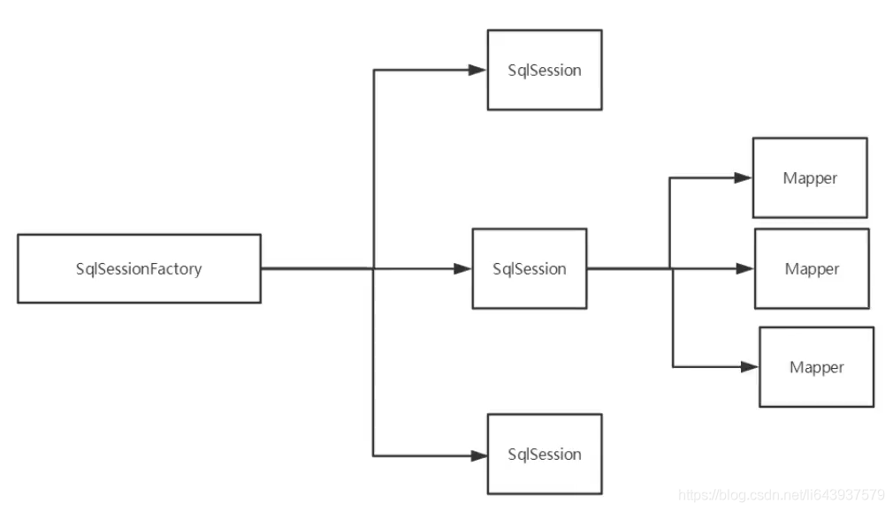

# 5、解决属性名和字段名不一致的问题

## 5.1 问题

数据库中的字段

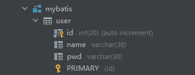

新建一个项目，拷贝之前的，测试实体类字段不一致的情况

```java
public class User {
    private int id;
    private String name;
    private String password;
}
```

测试出现问题

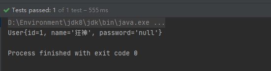

```java
//    select * from mybatis.user where id = #{id}
// 类型处理器
//    select id,name,pwd from mybatis.user where id = #{id}
```

解决方法：

- 起别名

    ```xml
      <select id="getUserById" parameterType="int" resultType="user">
          select id,name,pwd as password from mybatis.user where id = #{id}
      </select>
    ```
    
- resultMap解决

## 5.2 resultMap

结果集映射

```java
id name pwd
id name password
12
    <!--  结果集映射  -->
    <resultMap id="UserMap" type="User">
        <!--column数据库中的字段，property实体类中的属性-->
        <result column="id" property="id" />
        <result column="name" property="name" />
        <result column="pwd" property="password" />
    </resultMap>

    <select id="getUserById" parameterType="int" resultMap="UserMap">
        select * from mybatis.user where id = #{id}
    </select>
```

- resultMap 元素是 MyBatis 中最重要最强大的元素。
- ResultMap 的设计思想是，对简单的语句做到零配置，对于复杂一点的语句，只需要描述语句之间的关系就行了。
- ResultMap 的优秀之处——你完全可以不用显式地配置它们。
- 如果这个世界总是这么简单就好了。


# 6、日志（2020-10-24）

## 6.1 日志工厂

如果一个数据库操作出现了异常，我们需要排错。日志就是最好的助手！
曾经：sout、debug
现在：日志工厂！


- SLF4J
- LOG4J 【掌握】
- LOG4J2
- JDK_LOGGING
- COMMONS_LOGGING
- STDOUT_LOGGING【掌握】
- NO_LOGGING

在Mybatis中具体使用哪一个日志实现，在设置中设定！

**STDOUT_LOGGING**标准日志输出
在mybatis-config.xml核心配置文件中，配置我们的日志！

```xml
    <settings>
        <setting name="logImpl" value="STDOUT_LOGGING"/>
    </settings>
```

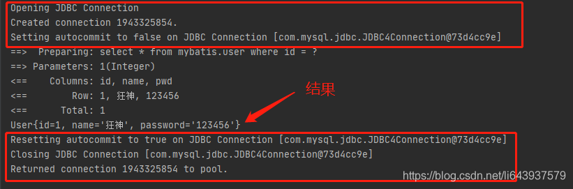

## 6.2 Log4j

什么是Log4j？

- Log4j是Apache的一个开源项目，通过使用Log4j，我们可以控制日志信息输送的目的地是控制台、文件、GUI组件
- 我们也可以控制每一条日志的输出格式；
- 通过定义每一条日志信息的级别，我们能够更加细致地控制日志的生成过程。
- 可以通过一个配置文件来灵活地进行配置，而不需要修改应用的代码。

1.先在pom.xml文件中导入log4j的依赖包

```xml
<dependencies>
    <!-- https://mvnrepository.com/artifact/log4j/log4j -->
    <dependency>
        <groupId>log4j</groupId>
        <artifactId>log4j</artifactId>
        <version>1.2.17</version>
    </dependency>
</dependencies>
```

2.在resources文件夹下建立log4j.properties文件进行配置

```properties
#将等级为DEBUG的日志信息输出到console和file这两个目的地，console和file的定义在下面的代码
log4j.rootLogger = DEBUG,console ,file

#控制台输出的相关设置
log4j.appender.console = org.apache.log4j.ConsoleAppender
log4j.appender.console.Target = System.out
log4j.appender.console.Threshold = DEBUG
log4j.appender.console.layout = org.apache.log4j.PatternLayout
log4j.appender.console.layout.ConversionPattern =  [%c]-%m%n

#文件输出的相关设置
log4j.appender.file = org.apache.log4j.RollingFileAppender
log4j.appender.file.File = ./log/kuang.log
log4j.appender.file.MaxFileSize = 10mb
log4j.appender.file.Threshold = DEBUG
log4j.appender.file.layout = org.apache.log4j.PatternLayout
log4j.appender.file.layout.ConversionPattern = [%p][%d{yy-MM-dd}][%c]%m%n

#日志输出级别
log4j.logger.org.mybatis=DEBUG
log4j.logger.java.sql=DEBUG
log4j.logger.java.sql.Statement=DEBUG
log4j.logger.java.sql.ResultSet=DEBUG
log4j.logger.java.sql.PreparedStatement=DEBUG
```

3.在mybatis-config.xml核心配置文件中，配置log4j为日志的实现！

```xml
    <settings>
        <setting name="logImpl" value="LOG4J"/>
    </settings>
```

4.Log4j的使用，直接测试运行
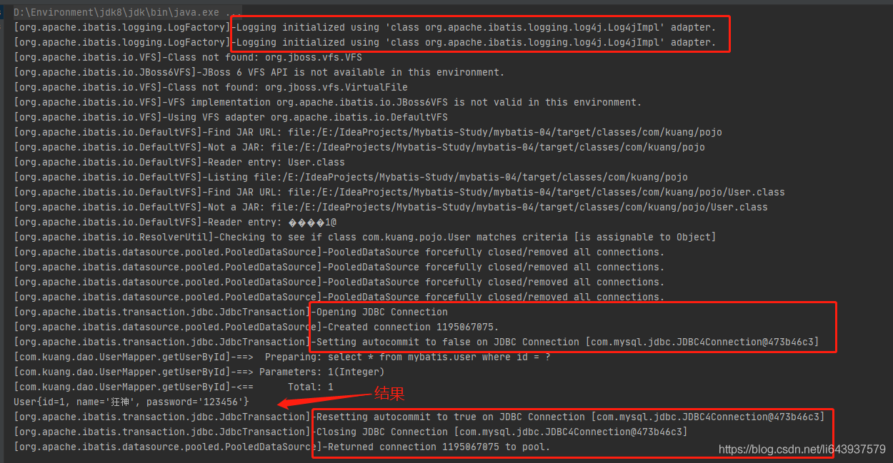
**简单使用**

1. 在要使用Log4j的测试类中，导入包import org.apache.log4j.Logger;
2. 日志对象，参数为当前类的class

```java
static Logger logger = Logger.getLogger(UserDaoTest.class);
```

1. 日志级别

```java
        logger.info("info:进入了testLog4j");
        logger.debug("DEBUG:进入了testLog4j");
        logger.error("erro:进入了testLog4j");
```

1. 之后可在log文件夹中查看日志文件信息

------


# 7、分页

**思考：为什么要分页！**

- 减少数据的处理量

## 7.1 使用Limit分页

```sql
语法：SELECT * from user limit startIndex,pageSize
SELECT  * from user limit 3 #[0,n]
```

**使用Mybatis实现分页，核心SQL**

1. 接口

```java
    //分页
    List<User> getUserByLimit(Map<String,Integer> map);
```

1. Mapper.xml

```xml
<!--    分页-->
<select id="getUserByLimit" parameterType="map" resultMap="UserMap">
    select * from mybatis.user limit #{startIndex},#{pageSize}
</select>
```

1. 测试

```java
@Test
public void getUserByLimit(){
    SqlSession sqlSession = MybatisUtils.getSqlSession();
    UserMapper mapper = sqlSession.getMapper(UserMapper.class);

    HashMap<String, Integer> map = new HashMap<String, Integer>();
    map.put("startIndex",0);
    map.put("pageSize",2);

    List<User> userList = mapper.getUserByLimit(map);
    for (User user : userList) {
        System.out.println(user);
    }

    sqlSession.close();
}
```

## 7.2 RowBounds分页

不再使用SQL实现分页

1. 接口

```java
//分页2
List<User> getUserByRowBounds();
```

1. Mapper.xml

```xml
<!--    分页2-->
<select id="getUserByRowBounds" resultMap="UserMap">
    select * from mybatis.user
</select>
```

1. 测试

```java
@Test
public void getUserByRowBounds(){
    SqlSession sqlSession = MybatisUtils.getSqlSession();

    //RowBounds实现
    RowBounds rowBounds = new RowBounds(0, 2);

    //通过java代码层面实现分页
    List<User> userList = sqlSession.selectList("com.kuang.dao.UserMapper.getUserByRowBounds",null,rowBounds);

    for (User user : userList) {
        System.out.println(user);
    }

    sqlSession.close();
}
```

## 7.3 分页插件

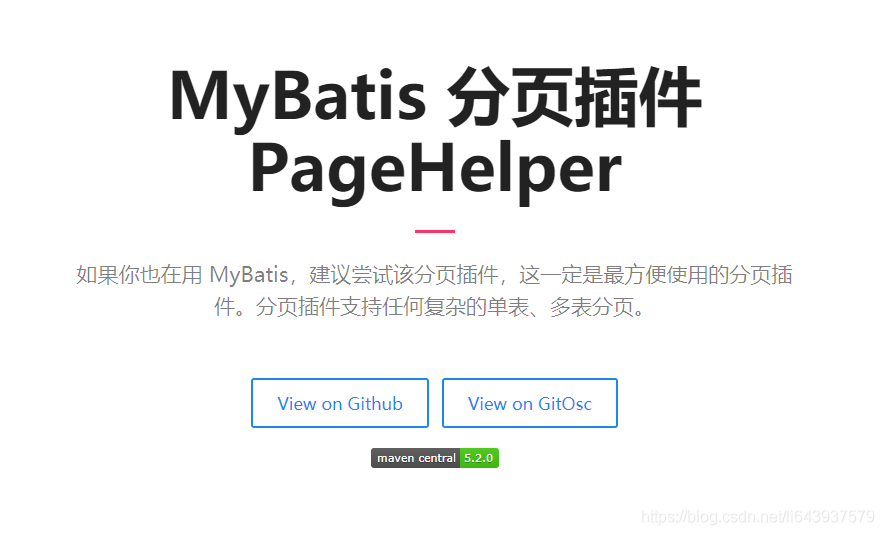
了解即可，使用时，需要知道是什么东西！

------


# 8、使用注解开发（2020-10-25）

## 8.1 面向接口编程

- 之前学过面向对象编程，也学习过接口，但在真正的开发中，很多时候会选择面向接口编程。
- **根本原因：解耦，可拓展，提高复用，分层开发中，上层不用管具体的实现，大家都遵守共同的标准，使得开发变得容易，规范性更好**
- 在一个面向对象的系统中，系统的各种功能是由许许多多的不同对象协作完成的。在这种情况下，各个对象内部是如何实现自己的，对系统设计人员来讲就不那么重要了；
- 而各个对象之间的协作关系则成为系统设计的关键。小到不同类之间的通信，大到各模块之间的交互，在系统设计之初都是要着重考虑的，这也是系统设计的主要工作内容。面向接口编程就是指按照这种思想来编程。

## 8.2 使用注解开发

1. 注解在UserMapper接口上实现，并删除UserMapper.xml文件

```java
    @Select("select * from user")
    List<User> getUsers();
```

1. 需要在mybatis-config.xml核心配置文件中绑定接口

```xml
    <!--绑定接口！-->
    <mappers>
        <mapper class="com.kuang.dao.UserMapper" />
    </mappers>
```

1. 测试

```java
    @Test
    public void getUsers(){
        SqlSession sqlSession = MybatisUtils.getSqlSession();
        UserMapper mapper = sqlSession.getMapper(UserMapper.class);
        List<User> users = mapper.getUsers();

        for (User user : users) {
            System.out.println(user);
        }

        sqlSession.close();
    }
```

本质：反射机制实现
底层：动态代理！

**Mybatis详细的执行流程！（之后应用的多了详细再走一遍）**

## 8.3 CRUD

1. 在MybatisUtils工具类创建的时候实现自动提交事务！

```java
public static SqlSession getSqlSession(){
    return sqlSessionFactory.openSession(true);
}
```

1. 编写接口，增加注解

```java
public interface UserMapper {

    @Select("select * from user")
    List<User> getUsers();

    //方法存在多个参数，所有参数前面必须加上@Param("id")注解
    @Select("select * from user where id=#{id}")
    User getUserById(@Param("id") int id);

    @Insert("insert into user (id,name,pwd) values(#{id},#{name},#{password})")
    int addUser(User user);

    @Update("update user set name=#{name},pwd=#{password} where id=#{id}")
    int updateUser(User user);

    @Delete("delete from user where id = #{uid}")
    int deleteUser(@Param("uid") int id);
    
}
```

1. 测试类

【注意：我们必须要将接口注册绑定到我们的核心配置文件中！】

**关于@Param()注解**

- 基本类型的参数或者String类型，需要加上

- 引用类型不需要加

- 如果只有**一个****基本**类型的话，可以忽略，但是建议都加上！

- **我们在SQL中引用的就是我们这里的@Param("")中设定的属性名！**

    

    ## 8.4 #{}和${}区别

    1. #{} 解析为一个 JDBC 预编译语句（prepared statement）的参数标记符，一个 #{ } 被解析为一个参数占位符；而${}仅仅为一个纯碎的 string 替换，在动态 SQL 解析阶段将会进行变量替换。

    2. **#{} 解析之后会将String类型的数据自动加上引号，其他数据类型不会**；而${} 解析之后是什么就是什么，他不会当做字符串处理。

    3. **#{} 很大程度上可以防止SQL注入**（SQL注入是发生在编译的过程中，因为恶意注入了某些特殊字符，最后被编译成了恶意的执行操作）；而${} 主要用于SQL拼接的时候，有很大的SQL注入隐患。

    4. 在某些特殊场合下只能用`${}，不能用#{}。例如：在使用排序时ORDER BY ${id}`，如果使用#{id}，则会被解析成ORDER BY “id”,这显然是一种错误的写法。


# 9、Lombok（偷懒的话可以使用）

**当你自己写的方法与Lombok自动插入的方法相同时，优先使用自定义的。**

使用步骤：

1. 在IDEA中安装Lombok插件！
2. 在项目pom.xml文件中导入Lombok的jar包

```xml
        <!-- https://mvnrepository.com/artifact/org.projectlombok/lombok -->
        <dependency>
            <groupId>org.projectlombok</groupId>
            <artifactId>lombok</artifactId>
            <version>1.18.10</version>
        </dependency>
```

1. 在实体类上加注解即可！

```java
@Data
@AllArgsConstructor
@NoArgsConstructor
@Getter and @Setter
@FieldNameConstants
@ToString
@EqualsAndHashCode
@AllArgsConstructor, @RequiredArgsConstructor and @NoArgsConstructor
@Log, @Log4j, @Log4j2, @Slf4j, @XSlf4j, @CommonsLog, @JBossLog, @Flogger, @CustomLog
@Data
@Builder
@SuperBuilder
@Singular
@Delegate
@Value
@Accessors
@Wither
@With
@SneakyThrows
```

说明：

```java
@Data:无参构造、get、set、toString、hashCode、equals
@AllArgsConstructor
@NoArgsConstructor
@EqualsAndHashCode
@ToString
@Getter and @Setter
```

------


# 10、多对一处理

多对一：

- 多个学生，对应一个老师
- 对于学生而言，**关联**–多个学生，关联一个老师【多对一】
- 对于老师而言，**集合**–一个老师，有很多个学生【一对多】

SQL语句：

```sql
CREATE TABLE `teacher` (
	`id` INT(10) NOT NULL,
	`name` VARCHAR(30) DEFAULT NULL,
	PRIMARY KEY (`id`)
)ENGINE = INNODB DEFAULT CHARSET=utf8

INSERT INTO teacher(`id`,`name`) VALUES (1,'秦老师');

CREATE TABLE `student` (
	`id` INT(10) NOT NULL,
	`name` VARCHAR(30) DEFAULT NULL,
	`tid` INT(10) DEFAULT NULL,
	PRIMARY KEY (`id`),
	KEY `fktid`(`tid`),
	CONSTRAINT `fktid` FOREIGN KEY (`tid`) REFERENCES `teacher` (`id`)
)ENGINE = INNODB DEFAULT CHARSET=utf8

INSERT INTO `student`(`id`,`name`,`tid`) VALUES ('1','小明','1');
INSERT INTO `student`(`id`,`name`,`tid`) VALUES ('2','小红','1');
INSERT INTO `student`(`id`,`name`,`tid`) VALUES ('3','小张','1');
INSERT INTO `student`(`id`,`name`,`tid`) VALUES ('4','小李','1');
INSERT INTO `student`(`id`,`name`,`tid`) VALUES ('5','小王','1');
```

## 测试环境搭建

1. 导入Lombok
2. 新建实体类Teacher，Student
3. 建立Mapper接口
4. 建立Mapper.XML文件
5. 在核心配置文件中绑定注册我们的Mapper接口或者文件！【方式很多,随心选】
6. 测试查询是否能够成功！

## 按照结果嵌套处理

```xml
    <select id="getStudents" resultMap="getStudentMap">
        select s.name sname,s.id sid,t.name tname,t.id tid 
        from student s,teatcher t 
        where t.id=s.tid;
    </select>

    <resultMap id="getStudentMap" type="student">
        <result property="name" column="sname"/>
        <result property="id" column="sid"/>
        <association property="teatcher" javaType="teatcher">
            <result property="id" column="tid"/>
            <result property="name" column="tname"/>
        </association>
    </resultMap>
```

## 按照查询嵌套处理

```xml
<!--
      思路：
          1.查询所有的学生信息
          2.根据查询出来的学生的tid，寻找对应的老师！ 子查询-->
<select id="getStudent" resultMap="StudentTeacher">
    select * from mybatis.student
</select>

<resultMap id="StudentTeacher" type="Student">
    <result property="id" column="id"/>
    <result property="name" column="name"/>
    <!--  复杂的属性，我们需要单独处理 对象：association 集合：collection      -->
    <association property="teacher" column="tid" javaType="Teacher" select="getTeacher"/>
</resultMap>

<select id="getTeacher" resultType="Teacher">
    select * from mybatis.teacher where id = #{tid}
</select>
```

回顾Mysql多对一查询方式：

- 子查询
- 联表查询

------


# 11 、一对多处理（2020-10-26）

比如：一个老师拥有多个学生！
对于老师而言，就是一对多的关系！

## 环境搭建

1. 环境搭建，和刚才一样
    **实体类：**

```java
@Data
public class Student {
    private int id;
    private String name;
    private int tid;

}

@Data
public class Teacher {
    private int id;
    private String name;

    //一个老师拥有多个学生
    private List<Student> students;
}
```

## 按照结果嵌套处理

```xml
    <!--    按结果嵌套查询-->
    <select id="getTeacher" resultMap="TeacherStudent">
            SELECT  s.id sid,s.name sname,t.name tname,t.id,tid
            from student s,teacher t
            where s.tid = t.id and t.id = #{tid}
    </select>

    <resultMap id="TeacherStudent" type="Teacher">
        <result property="id" column="tid"/>
        <result property="name" column="tname"/>
        <!--  复杂的属性，我们需要单独处理 对象：association 集合：collection
             javaType="" 指定属性的类型！
             集合中的泛型信息，我们使用ofType获取
             -->
        <collection property="students" ofType="Student">
            <result property="id" column="sid"/>
            <result property="name" column="sname"/>
            <result property="tid" column="tid"/>
        </collection>
    </resultMap>
```

## 按照查询嵌套处理

```xml
    <select id="getTeacher2" resultMap="TeacherStudent2">
        select * from mybatis.teacher where id = #{tid}
    </select>

    <resultMap id="TeacherStudent2" type="Teacher">
        <collection property="students" javaType="ArrayList" ofType="Student" select="getStudentByTeacherId" column="id"/>
    </resultMap>

    <select id="getStudentByTeacherId" resultType="Student">
        select * from  mybatis.student where tid = #{tid}
    </select>
```

## 小结

1. 关联-association【多对一】
2. 集合-collection【一对多】
3. javaType & ofType
    1. javaType 用来指定实体类中属性的类型
    2. ofType 用来指定映射到List或者集合中的pojo类型，泛型中的约束类型！

注意点：

- 保证SQL的可读性，尽量保证通俗易懂
- 注意一对多和多对一中，属性名和字段的问题！
- 如果问题不好排查错误，可以使用日志，建议使用Log4j

**面试高频**

- **Mysql引擎**
- **InnoDB底层原理**
- **索引**
- **索引优化**


# 12、动态SQL（2020-10-27）

**什么是动态SQL：动态SQL就是 指根据不同的条件生成不同的SQL语句**

利用动态SQL这一特性可以彻底摆脱这种痛苦。

```xml
在 MyBatis 之前的版本中，需要花时间了解大量的元素。借助功能强大的基于 OGNL 的表达式，MyBatis 3 替换了之前的大部分元素，大大精简了元素种类，现在要学习的元素种类比原来的一半还要少。

if
choose (when, otherwise)
trim (where, set)
foreach
```

## 搭建环境

```sql
CREATE TABLE `blog`(
	`id` VARCHAR(50) NOT NULL COMMENT '博客id',
	`title` VARCHAR(100) NOT NULL COMMENT '博客标题',
	`author` VARCHAR(30) NOT NULL COMMENT '博客作者',
	`create_time` DATETIME NOT NULL COMMENT '创建时间',
	`views` INT(30) NOT NULL COMMENT '浏览量'
)ENGINE=INNODB DEFAULT CHARSET=utf8
```

创建一个基础工程

1. 导包
2. 编写配置文件
3. 编写实体类

```java
@Data
public class Blog {
    private String id;
    private String title;
    private String author;
    private Date createTime; //属性名和字段名不一致
    private int views;
}
```

工具类：随机生成ID

~~~ java
@SuppressWarnings("all")//抑制警告
public class IdUtils {
    public static String getId(){
        return UUID.randomUUID().toString().replaceAll("-", ".");
    }
}
~~~

1. 编写实体类对应Mapper接口和Mapper.XML文件

## IF

```xml
<select id="getBlogIf" resultType="blog" parameterType="map">
    select * from blog where 1=1
    <if test="title!=null">
        title=#{title}
    </if>
    <if test="title!=null&amp;&amp;author!=null">
        and
    </if>
    <if test="author!=null">
        author=#{author}
    </if>
    and 0=0
</select>
```

## choose (when, otherwise)

选一个！！且选的是第一个成立的

```xml
    <select id="queryBlogChoose" parameterType="map" resultType="Blog">
        select * from mybatis.blog
        <where>
            <choose>
                <when test="title != null">
                    title = #{title}
                </when>
                <when test="author != null">
                    and author = #{author}
                </when>
                <otherwise>
                    and views = #{views}
                </otherwise>
            </choose>
        </where>
    </select>
```

## trim (where, set)

where标签：帮助去除第一个条件的and或者or，用where替代，让每一个条件语句以and开头没问题，如果没有条件成立，那么也不会有where。

set标签：用于update table set c1=value1 and c2=value2， 效果与where标签类似，去掉的是前缀的逗号与后缀的逗号，所以把逗号当作前缀或者后缀都可以：“,”

```xml
    <select id="queryBlogIF" parameterType="map" resultType="Blog">
        select * from mybatis.blog
        <where>
            <if test="title != null">
                and title = #{title}
            </if>
            <if test="author != null">
                and author = #{author}
            </if>
        </where>
    </select>
    <update id="updateBlog" parameterType="map">
        update mybatis.blog
        <set>
            <if test="title != null">
                title = #{title},
            </if>
            <if test="author != null">
                author = #{author}
            </if>
        </set>
        where id = #{id}
    </update>
```

**所谓的动态SQL，本质还是SQL语句，只是我们可以在SQL层面，去执行一个逻辑代码**

关于trim标签：where、set的母亲版

示例：

~~~ xml
<trim prefix="" prefixOverrides="" suffix="" suffixOverrides="">
  ...
</trim>
~~~

prefix：前缀标签 prefixOverrides：前缀过滤的字符串

suffix：后缀 suffixOverrides：后缀过滤的字符串

where标签等效于

~~~ xml
<trim prefix="WHERE" prefixOverrides="AND |OR ">
  ...
</trim>
~~~

set标签等效于

```xml
<trim prefix="SET" suffixOverrides="," prefixOverrides=",">
  ...
</trim>
```


## Foreach

- 动态 SQL 的另一个常见使用场景是**对集合进行遍历（尤其是在构建 IN 条件语句的时候）**。
- foreach 元素的功能非常强大，它允许你指定一个集合，声明可以在元素体内使用的集合项（item）和索引（index）变量。它也允许你指定开头与结尾的字符串以及集合项迭代之间的分隔符。这个元素也不会错误地添加多余的分隔符，看它多智能！
- 提示你可以将任何可迭代对象（如 List、Set 等）、Map 对象或者数组对象作为集合参数传递给 foreach。当使用可迭代对象或者数组时，index 是当前迭代的序号，item 的值是本次迭代获取到的元素。当使用 Map 对象（或者 Map.Entry 对象的集合）时，index 是键，item 是值。
- 就是集合中每一个元素值都被取出来使用一次。

```xml
<!--select * from blog where 1=1 and (id=1 or id=2 or id=3)
        我们现在传递一个万能的map，这map中可以存在一个集合！
        -->
<select id="queryBlogForeach" parameterType="map" resultType="Blog">
    select * from mybatis.blog
    <where>
        <foreach collection="ids" item="id" open="and (" close=")" separator="or">
            id = #{id}
        </foreach>
    </where>
</select>
```

动态SQL就是在拼接SQL语句，我们只要保证SQL的正确性，按照SQL的格式，去排列组合就可以了。
建议：

- 先在Mysql中写出完整的SQL，再对应的去修改成我们的动态SQL实现通用即可！

## SQL片段

- 有的时候，我们可以能会将一些功能的部分抽取出来，方便复用！

- 比如我们写一个包括很多字段的if，可以给多种情况下引用

- 不建议在sql片段里面写过于复杂的语句，会降低其复用性

- 及其不建议在sql片段里面使用where标签，会极大降低复用性

1. 使用SQL标签抽取公共的部分

```xml
    <sql id="if-title-author">
        <if test="title != null">
            title = #{title}
        </if>
        <if test="author != null">
            and author = #{author}
        </if>
    </sql>
```

1. 在需要使用的地方使用Include标签引用即可

```xml
    <select id="queryBlogIF" parameterType="map" resultType="Blog">
        select * from mybatis.blog
        <where>
            <include refid="if-title-author"></include>
        </where>
    </select>
```

注意事项：

- 最好基于单表来定义SQL片段！
- 不要存在where标签

------


# 13、缓存（了解即可）（2020-10-30）

## 13.1 简介

### 1. 什么是缓存[Cache]？

- 存在内存中的临时数据。
- 将用户经常查询的数据放在缓存（内存）中，用户去查询数据就不用从磁盘上（关系型数据库查询文件）查询，从缓存中查询，从而提高查询效率，解决了高并发系统的性能问题。

### 2. 为什么使用缓存？

- **减少和数据库的交互次数，减少系统开销，提高系统效率。**

### 3. 什么样的数据能使用缓存？

- 经常查询并且不经常改变的数据。【可以使用缓存】

## 13.2 Mybatis缓存

- Mybatis包含一个非常强大的查询缓存特性，它可以非常方便地定制和配置缓存。缓存可以极大的提升查询效率。

- Mybatis系统中默认定义了两级缓存：

    一级缓存

    和

    二级缓存

    - 默认情况下，只有一级缓存开启。（SqlSession级别的缓存，也称为本地缓存）
    - 二级缓存需要手动开启和配置，它是基于namespace级别的缓存。
    - 为了提高扩展性，Mybatis定义了缓存接口Cache，我们可以通过实现Cache接口来自定义二级缓存。

## 13.3 一级缓存

- 一级缓存也叫本地缓存：
    - 与数据库同一次会话期间查询到的数据会放在本地缓存中。
    - 以后如果需要获取相同的数据，直接从缓存中拿，没必要再去查询数据库

测试步骤：

1. 开启日志！
2. 测试在一个Session中查询两次相同记录
3. 查看日志输出
    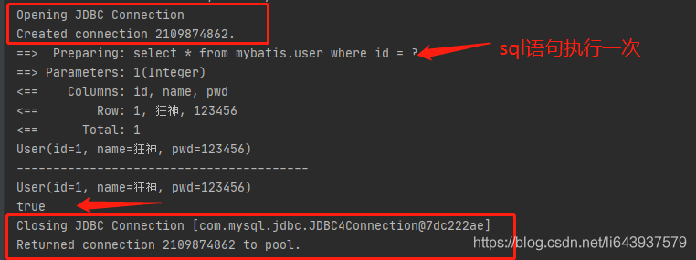

缓存失效的情况：

1. 查询不同的东西；
2. 增删改操作，可能会改变原来的数据，所以必定会刷新缓存！
    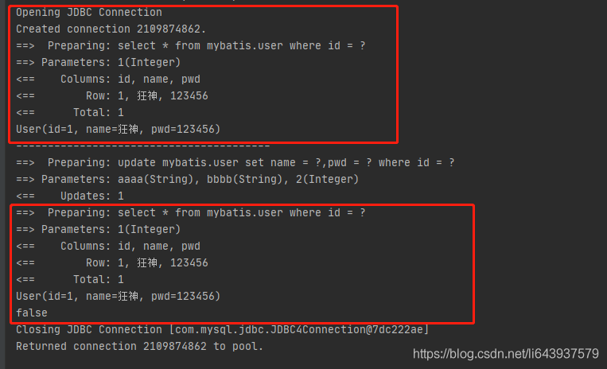
3. 查询不同的Mapper.xml
4. 手动清理缓存！
    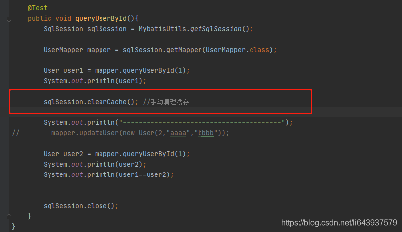

小结：一级缓存默认是开启的，只在一次SqlSession中有效，也就是拿到连接到关闭连接这个区间段！
一级缓存相当于一个Map。

## 13.4 二级缓存

- 二级缓存也叫全局缓存，一级缓存作用域太低了，所以诞生了二级缓存；
- 基于namespace级别的缓存，一个名称空间，对应一个二级缓存；
- 工作机制
    - 一个会话查询一条数据，这个数据就会被放在当前会话的一级缓存中；
    - 如果当前会话关闭了，这个会话对应的一级缓存就没了；但是我们想要的是，会话关闭了，一级缓存中的数据被保存到二级缓存中；
    - 新的会话查询信息，就可以从二级缓存中获取内容；
    - 不同的mapper查出的数据就会放在自己对应的缓存（map）中；

步骤：

1. 在mybatis-config.xml开启全局缓存

```xml
        <!--显示的开启全局缓存-->
        <setting name="cacheEnabled" value="true"/>
```

1. 在要使用二级缓存的Mapper中开启

```xml
    <!--在当前Mapper.xml中使用二级缓存-->
    <cache/>
```

也可以自定义参数

这个更高级的配置创建了一个 FIFO 缓存，每隔 60 秒刷新，最多可以存储结果对象或列表的 512 个引用，而且返回的对象被认为是只读的，因此对它们进行修改可能会在不同线程中的调用者产生冲突。

```xml
    <!--在当前Mapper.xml中使用二级缓存-->
    <cache
            eviction="FIFO"
            flushInterval="60000"
            size="512"
            readOnly="true"/>
```

可用的清除策略有：

- `LRU` – 最近最少使用：移除最长时间不被使用的对象。
- `FIFO` – 先进先出：按对象进入缓存的顺序来移除它们。
- `SOFT` – 软引用：基于垃圾回收器状态和软引用规则移除对象。
- `WEAK` – 弱引用：更积极地基于垃圾收集器状态和弱引用规则移除对象。

flushInterval（刷新间隔）属性可以被设置为任意的正整数，设置的值应该是一个以毫秒为单位的合理时间量。 默认情况是不设置，也就是没有刷新间隔，缓存仅仅会在调用语句时刷新。

size（引用数目）属性可以被设置为任意正整数，要注意欲缓存对象的大小和运行环境中可用的内存资源。默认值是 1024。

readOnly（只读）属性可以被设置为 true 或 false。只读的缓存会给所有调用者返回缓存对象的相同实例。 因此这些对象不能被修改。这就提供了可观的性能提升。而可读写的缓存会（通过序列化）返回缓存对象的拷贝。 速度上会慢一些，但是更安全，因此默认值是 false。

**提示** 二级缓存是事务性的。这意味着，当 SqlSession 完成并提交时，或是完成并回滚，但没有执行 flushCache=true 的 insert/delete/update 语句时，缓存会获得更新。


1. 测试

    1. 问题：如果没有自定义参数，则会报错，我们需要将实体类序列化！即继承Serializable接口

    ```xml
    Cause: java.io.NotSerializableException: com.kuang.pojo.User
    ```

小结：

- 只要开启了二级缓存，在同一个Mapper下就有效；
- 所有的数据都会先放在一级缓存中；
- 只有当会话提交或者关闭的时候，才会提交到二级缓存中！


## 13.5 缓存原理

先二级缓存

再一级缓存

再数据库

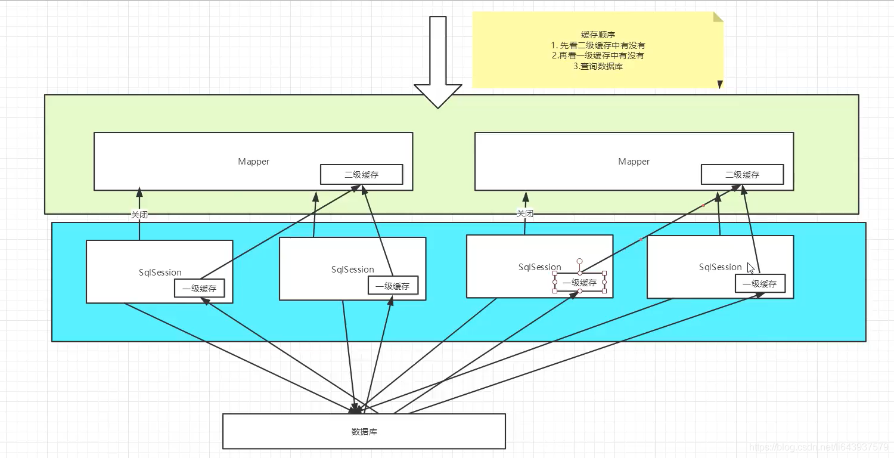

## 13.6 自定义缓存-ehcache（可以了解）

Ehcache是一种广泛使用的开源Java分布式缓存，主要面向通用缓存。

要在程序中使用ehcache，先要导包！

在mapper中指定使用我们的ehcache缓存实现！

#### 使用自定义缓存

除了上述自定义缓存的方式，你也可以通过实现你自己的缓存，或为其他第三方缓存方案创建适配器，来完全覆盖缓存行为。

```xml
<cache type="com.domain.something.MyCustomCache"/>
```

这个示例展示了如何使用一个自定义的缓存实现。type 属性指定的类必须实现 org.apache.ibatis.cache.Cache 接口，且提供一个接受 String 参数作为 id 的构造器。 这个接口是 MyBatis 框架中许多复杂的接口之一，但是行为却非常简单。

```java
public interface Cache {
  String getId();
  int getSize();
  void putObject(Object key, Object value);
  Object getObject(Object key);
  boolean hasKey(Object key);
  Object removeObject(Object key);
  void clear();
}
```

为了对你的缓存进行配置，只需要简单地在你的缓存实现中添加公有的 JavaBean 属性，然后通过 cache 元素传递属性值，例如，下面的例子将在你的缓存实现上调用一个名为 `setCacheFile(String file)` 的方法：

```xml
<cache type="com.domain.something.MyCustomCache">
  <property name="cacheFile" value="/tmp/my-custom-cache.tmp"/>
</cache>
```

你可以使用所有简单类型作为 JavaBean 属性的类型，MyBatis 会进行转换。 你也可以使用占位符（如 `${cache.file}`），以便替换成在[配置文件属性](https://mybatis.org/mybatis-3/zh/configuration.html#properties)中定义的值。

从版本 3.4.2 开始，MyBatis 已经支持在所有属性设置完毕之后，调用一个初始化方法。 如果想要使用这个特性，请在你的自定义缓存类里实现 `org.apache.ibatis.builder.InitializingObject` 接口。

```xml
public interface InitializingObject {
  void initialize() throws Exception;
}
```

**提示** 上一节中对缓存的配置（如清除策略、可读或可读写等），不能应用于自定义缓存。

请注意，缓存的配置和缓存实例会被绑定到 SQL 映射文件的命名空间中。 因此，同一命名空间中的所有语句和缓存将通过命名空间绑定在一起。 每条语句可以自定义与缓存交互的方式，或将它们完全排除于缓存之外，这可以通过在每条语句上使用两个简单属性来达成。 默认情况下，语句会这样来配置：

```xml
<select ... flushCache="false" useCache="true"/>
<insert ... flushCache="true"/>
<update ... flushCache="true"/>
<delete ... flushCache="true"/>
```

鉴于这是默认行为，显然你永远不应该以这样的方式显式配置一条语句。但如果你想改变默认的行为，只需要设置 flushCache 和 useCache 属性。比如，某些情况下你可能希望特定 select 语句的结果排除于缓存之外，或希望一条 select 语句清空缓存。类似地，你可能希望某些 update 语句执行时不要刷新缓存。

#### cache-ref

回想一下上一节的内容，对某一命名空间的语句，只会使用该命名空间的缓存进行缓存或刷新。 但你可能会想要在多个命名空间中共享相同的缓存配置和实例。要实现这种需求，你可以使用 cache-ref 元素来引用另一个缓存。

```xml
<cache-ref namespace="com.someone.application.data.SomeMapper"/>
```

**目前：Redis数据库来做缓存！K-V**


# 14、补充

## 1.parameterType，多个参数

### 方法一：不需要写parameterType参数

```dart
public List<XXXBean> getXXXBeanList(String xxId, String xxCode);  
```

```xml
<select id="getXXXBeanList" resultType="XXBean">
　　select t.* from tableName where id = #{0} and name = #{1}  
</select>  
```

由于是多参数那么就不能使用parameterType， 改用#｛index｝是第几个就用第几个的索引，索引从0开始


### 方法二：基于注解(最简单)

```dart
public List<XXXBean> getXXXBeanList(@Param("id")String id, @Param("code")String code);  
```

```xml
<select id="getXXXBeanList" resultType="XXBean">
　　select t.* from tableName where id = #{id} and name = #{code}  
</select>  
```

由于是多参数那么就不能使用parameterType， 这里用@Param来指定哪一个


### 方法三：Map封装

```cpp
public List<XXXBean> getXXXBeanList(HashMap map);  
```

```xml
<select id="getXXXBeanList" parameterType="hashmap" resultType="XXBean">

　　select 字段... from XXX where id=#{xxId} code = #{xxCode}  

</select>  
```

其中hashmap是mybatis自己配置好的直接使用就行。map中key的名字是那个就在#{}使用那个，map如何封装就不用了我说了吧。


### 方法四：List封装

```php
public List<XXXBean> getXXXBeanList(List<String> list);  
```

```xml
<select id="getXXXBeanList" resultType="XXBean">
　　select 字段... from XXX where id in
　　<foreach item="item" index="index" collection="list" open="(" separator="," close=")">  
　　　　#{item}  
　　</foreach>  
</select> 
```

### 总结

传递list和map在资源消耗上肯定远大于方法一和方法二，但是有一些特殊的情形需要传递list，比如你需要传递一个id集合并批量对id进行sql操作然后再返回等等。所以都需要了解。


## 2.Mybatis流程解析

1. 首先，使用流读入配置文件resource
2. 通过读入的配置文件与映射文件构造出会话工厂SqlSessionFactory对象，构造过程需要用到SqlSessionFactoryBuilder，并对配置文件进行解析，获取所有配置信息以及映射信息
3. 当有查询需求时，SqlSessionFactory创造出一个执行器executor，通过它创建一个SqlSession对象，创建时执行config方法，传给他有所有配置，在这之前，会先创建一个事务管理器对所有的执行事务进行管理
4. SqlSession利用执行器Executor开始实现CRUD，实现完毕后提交给事务管理器，由事务管理器实现事务的处理。


## 3.@MapperScan和@Mapper（SpringBoot）

@Mapper注解的的作用

1:为了把mapper这个DAO交給Spring管理 http://412887952-qq-com.iteye.com/blog/2392672

2:为了不再写mapper映射文件 https://blog.csdn.net/weixin_39666581/article/details/103899495

3:为了给mapper接口 自动根据一个添加@Mapper注解的接口生成一个实现类 http://www.tianshouzhi.com/api/tutorials/mapstruct/292

使用@Mapper注解

​    为了让DemoMapper能够让别的类进行引用，我们可以在DemMapper类上添加@Mapper注解：

```java
@Mapper 
public interface DemoMapper { 
    @Insert("insert into Demo(name) values(#{name})") 
    @Options(keyProperty="id",keyColumn="id",useGeneratedKeys=true) 
    public void save(Demo demo); 
} 
```

 

直接在Mapper类上面添加注解@Mapper，这种方式要求每一个mapper类都需要添加此注解，麻烦。

 

**（2）方式二：使用@MapperScan注解**

​    通过使用@MapperScan可以指定要扫描的Mapper类的包的路径，比如：

```java
@SpringBootApplication 
@MapperScan("com.kfit.*.mapper") 
public class App { 
    public static void main(String[] args) { 
     	SpringApplication.run(App.class, args);
     } 
} 
```

或者：

```java
@SpringBootApplication 
@MapperScan("com.kfit.mapper") 
public class App { 
    public static void main(String[] args) { 
    	SpringApplication.run(App.class, args); 
    } 
} 
```

 

 可以根据包的结构指定不同的表达式。

**使用@MapperScan注解多个包**

可以使用如下的方式指定多个包：

```java
@SpringBootApplication 
@MapperScan({"com.kfit.demo","com.kfit.user"}) 
public **class** App { 
    public **static** **void** main(String[] args) { 
    	SpringApplication.run(App.**class**, args); 
    } 
} 
```

 

​    如果mapper类没有在Spring Boot主程序可以扫描的包或者子包下面，可以使用如下方式进行配置：

1. ```java
    @SpringBootApplication 
    @MapperScan({"com.kfit.*.mapper","org.kfit.*.mapper"}) 
    public class App { 
      public static void main(String[] args) { 
        SpringApplication.run(App.class, args); 
      } 
    } 
    ```

@Mapper注解的componentModel属性

`componentModel`属性用于指定自动生成的接口实现类的组件类型。这个属性支持四个值：

default: 这是默认的情况，mapstruct不使用任何组件类型, 可以通过Mappers.getMapper(Class)方式获取自动生成的实例对象。

cdi: the generated mapper is an application-scoped CDI bean and can be retrieved via @Inject

spring: 生成的实现类上面会自动添加一个@Component注解，可以通过Spring的 @Autowired方式进行注入

jsr330: 生成的实现类上会添加@javax.inject.Named 和@Singleton注解，可以通过 @Inject注解获取。


我们以spring组件方式进行验证，将上一节的CarMapper接口上@Mapper注解添加componentModel属性，如下:

```java
//设置组件模型为Spring@Mapper(componentModel = "spring")public interface CarMapper {     CarMapper INSTANCE = Mappers.getMapper( CarMapper.class );     @Mapping(source = "numberOfSeats", target = "seatCount")    CarDto carToCarDto(Car car);}
```

需要注意的是，当指定组件模型为Spring的时候，我们在classpath下一定要引入spring的jar包，否则MapStruct在编译的时候会报错。

现在再次执行"mvn compile"，通过IDE反编译功能查看自动生成的Mapper实现类源码。


可以看到自动生成的实现类中，自动帮我们添加了@Component注解。因此我们在其他地方可以通过@AutoWired的方式自动注入。

# 15、Sql语句构建器（了解）

## SQL 语句构建器

### 问题

Java 程序员面对的最痛苦的事情之一就是在 Java 代码中嵌入 SQL 语句。这通常是因为需要动态生成 SQL 语句，不然我们可以将它们放到外部文件或者存储过程中。如你所见，MyBatis 在 XML 映射中具备强大的 SQL 动态生成能力。但有时，我们还是需要在 Java 代码里构建 SQL 语句。此时，MyBatis 有另外一个特性可以帮到你，让你从处理典型问题中解放出来，比如加号、引号、换行、格式化问题、嵌入条件的逗号管理及 AND 连接。确实，在 Java 代码中动态生成 SQL 代码真的就是一场噩梦。例如：

```
String sql = "SELECT P.ID, P.USERNAME, P.PASSWORD, P.FULL_NAME, "
"P.LAST_NAME,P.CREATED_ON, P.UPDATED_ON " +
"FROM PERSON P, ACCOUNT A " +
"INNER JOIN DEPARTMENT D on D.ID = P.DEPARTMENT_ID " +
"INNER JOIN COMPANY C on D.COMPANY_ID = C.ID " +
"WHERE (P.ID = A.ID AND P.FIRST_NAME like ?) " +
"OR (P.LAST_NAME like ?) " +
"GROUP BY P.ID " +
"HAVING (P.LAST_NAME like ?) " +
"OR (P.FIRST_NAME like ?) " +
"ORDER BY P.ID, P.FULL_NAME";
```

### 解决方案

MyBatis 3 提供了方便的工具类来帮助解决此问题。借助 SQL 类，我们只需要简单地创建一个实例，并调用它的方法即可生成 SQL 语句。让我们来用 SQL 类重写上面的例子：

```
private String selectPersonSql() {
  return new SQL() {{
    SELECT("P.ID, P.USERNAME, P.PASSWORD, P.FULL_NAME");
    SELECT("P.LAST_NAME, P.CREATED_ON, P.UPDATED_ON");
    FROM("PERSON P");
    FROM("ACCOUNT A");
    INNER_JOIN("DEPARTMENT D on D.ID = P.DEPARTMENT_ID");
    INNER_JOIN("COMPANY C on D.COMPANY_ID = C.ID");
    WHERE("P.ID = A.ID");
    WHERE("P.FIRST_NAME like ?");
    OR();
    WHERE("P.LAST_NAME like ?");
    GROUP_BY("P.ID");
    HAVING("P.LAST_NAME like ?");
    OR();
    HAVING("P.FIRST_NAME like ?");
    ORDER_BY("P.ID");
    ORDER_BY("P.FULL_NAME");
  }}.toString();
}
```

这个例子有什么特别之处吗？仔细看一下你会发现，你不用担心可能会重复出现的 "AND" 关键字，或者要做出用 "WHERE" 拼接还是 "AND" 拼接还是不用拼接的选择。SQL 类已经为你处理了哪里应该插入 "WHERE"、哪里应该使用 "AND" 的问题，并帮你完成所有的字符串拼接工作。

### SQL 类

这里有一些示例：

```java
// 匿名内部类风格
public String deletePersonSql() {
  return new SQL() {{
    DELETE_FROM("PERSON");
    WHERE("ID = #{id}");
  }}.toString();
}

// Builder / Fluent 风格
public String insertPersonSql() {
  String sql = new SQL()
    .INSERT_INTO("PERSON")
    .VALUES("ID, FIRST_NAME", "#{id}, #{firstName}")
    .VALUES("LAST_NAME", "#{lastName}")
    .toString();
  return sql;
}

// 动态条件（注意参数需要使用 final 修饰，以便匿名内部类对它们进行访问）
public String selectPersonLike(final String id, final String firstName, final String lastName) {
  return new SQL() {{
    SELECT("P.ID, P.USERNAME, P.PASSWORD, P.FIRST_NAME, P.LAST_NAME");
    FROM("PERSON P");
    if (id != null) {
      WHERE("P.ID like #{id}");
    }
    if (firstName != null) {
      WHERE("P.FIRST_NAME like #{firstName}");
    }
    if (lastName != null) {
      WHERE("P.LAST_NAME like #{lastName}");
    }
    ORDER_BY("P.LAST_NAME");
  }}.toString();
}

public String deletePersonSql() {
  return new SQL() {{
    DELETE_FROM("PERSON");
    WHERE("ID = #{id}");
  }}.toString();
}

public String insertPersonSql() {
  return new SQL() {{
    INSERT_INTO("PERSON");
    VALUES("ID, FIRST_NAME", "#{id}, #{firstName}");
    VALUES("LAST_NAME", "#{lastName}");
  }}.toString();
}

public String updatePersonSql() {
  return new SQL() {{
    UPDATE("PERSON");
    SET("FIRST_NAME = #{firstName}");
    WHERE("ID = #{id}");
  }}.toString();
}
```

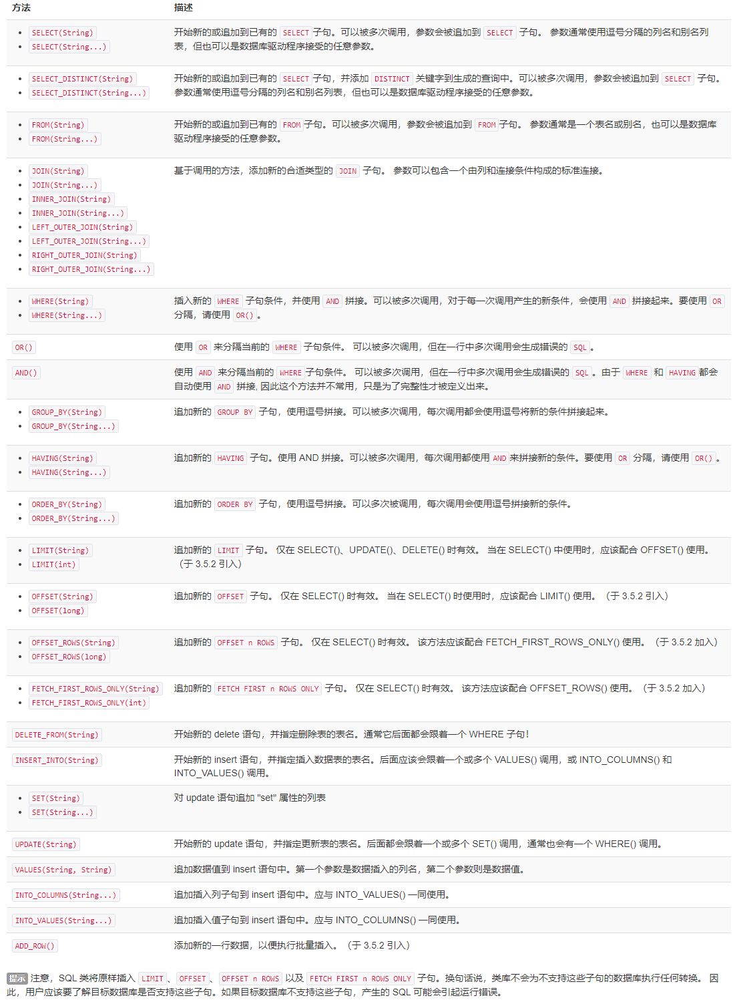

**提示** 注意，SQL 类将原样插入 `LIMIT`、`OFFSET`、`OFFSET n ROWS` 以及 `FETCH FIRST n ROWS ONLY` 子句。换句话说，类库不会为不支持这些子句的数据库执行任何转换。 因此，用户应该要了解目标数据库是否支持这些子句。如果目标数据库不支持这些子句，产生的 SQL 可能会引起运行错误。

从版本 3.4.2 开始，你可以像下面这样使用可变长度参数：

```java
public String selectPersonSql() {
  return new SQL()
    .SELECT("P.ID", "A.USERNAME", "A.PASSWORD", "P.FULL_NAME", "D.DEPARTMENT_NAME", "C.COMPANY_NAME")
    .FROM("PERSON P", "ACCOUNT A")
    .INNER_JOIN("DEPARTMENT D on D.ID = P.DEPARTMENT_ID", "COMPANY C on D.COMPANY_ID = C.ID")
    .WHERE("P.ID = A.ID", "P.FULL_NAME like #{name}")
    .ORDER_BY("P.ID", "P.FULL_NAME")
    .toString();
}

public String insertPersonSql() {
  return new SQL()
    .INSERT_INTO("PERSON")
    .INTO_COLUMNS("ID", "FULL_NAME")
    .INTO_VALUES("#{id}", "#{fullName}")
    .toString();
}

public String updatePersonSql() {
  return new SQL()
    .UPDATE("PERSON")
    .SET("FULL_NAME = #{fullName}", "DATE_OF_BIRTH = #{dateOfBirth}")
    .WHERE("ID = #{id}")
    .toString();
}
```

从版本 3.5.2 开始，你可以像下面这样构建批量插入语句：

```java
public String insertPersonsSql() {
  // INSERT INTO PERSON (ID, FULL_NAME)
  //     VALUES (#{mainPerson.id}, #{mainPerson.fullName}) , (#{subPerson.id}, #{subPerson.fullName})
  return new SQL()
    .INSERT_INTO("PERSON")
    .INTO_COLUMNS("ID", "FULL_NAME")
    .INTO_VALUES("#{mainPerson.id}", "#{mainPerson.fullName}")
    .ADD_ROW()
    .INTO_VALUES("#{subPerson.id}", "#{subPerson.fullName}")
    .toString();
}
```

从版本 3.5.2 开始，你可以像下面这样构建限制返回结果数的 SELECT 语句,：

```java
public String selectPersonsWithOffsetLimitSql() {
  // SELECT id, name FROM PERSON
  //     LIMIT #{limit} OFFSET #{offset}
  return new SQL()
    .SELECT("id", "name")
    .FROM("PERSON")
    .LIMIT("#{limit}")
    .OFFSET("#{offset}")
    .toString();
}

public String selectPersonsWithFetchFirstSql() {
  // SELECT id, name FROM PERSON
  //     OFFSET #{offset} ROWS FETCH FIRST #{limit} ROWS ONLY
  return new SQL()
    .SELECT("id", "name")
    .FROM("PERSON")
    .OFFSET_ROWS("#{offset}")
    .FETCH_FIRST_ROWS_ONLY("#{limit}")
    .toString();
}
```


# 16、java API

## Java API

既然你已经知道如何配置 MyBatis 以及如何创建映射，是时候来尝点甜头了。MyBatis 的 Java API 就是这个甜头。稍后你将看到，和 JDBC 相比，MyBatis 大幅简化你的代码并力图保持其简洁、容易理解和维护。为了使得 SQL 映射更加优秀，MyBatis 3 引入了许多重要的改进。


### 目录结构

在我们深入 Java API 之前，理解关于目录结构的最佳实践是很重要的。MyBatis 非常灵活，你可以随意安排你的文件。但和其它框架一样，目录结构有一种最佳实践。

让我们看一下典型的应用目录结构：

```
/my_application
  /bin
  /devlib
  /lib                <-- MyBatis *.jar 文件在这里。
  /src
    /org/myapp/
      /action
      /data           <-- MyBatis 配置文件在这里，包括映射器类、XML 配置、XML 映射文件。
        /mybatis-config.xml
        /BlogMapper.java
        /BlogMapper.xml
      /model
      /service
      /view
    /properties       <-- 在 XML 配置中出现的属性值在这里。
  /test
    /org/myapp/
      /action
      /data
      /model
      /service
      /view
    /properties
  /web
    /WEB-INF
      /web.xml
```

当然，这是推荐的目录结构，并非强制要求，但使用一个通用的目录结构将更有利于大家沟通。

本章接下来的示例将假定你遵循这种目录结构。


### SqlSession

使用 MyBatis 的主要 Java 接口就是 SqlSession。你可以通过这个接口来执行命令，获取映射器实例和管理事务。在介绍 SqlSession 接口之前，我们先来了解如何获取一个 SqlSession 实例。SqlSessions 是由 SqlSessionFactory 实例创建的。SqlSessionFactory 对象包含创建 SqlSession 实例的各种方法。而 SqlSessionFactory 本身是由 SqlSessionFactoryBuilder 创建的，它可以从 XML、注解或 Java 配置代码来创建 SqlSessionFactory。

**提示** 当 Mybatis 与一些依赖注入框架（如 Spring 或者 Guice）搭配使用时，SqlSession 将被依赖注入框架创建并注入，所以你不需要使用 SqlSessionFactoryBuilder 或者 SqlSessionFactory，可以直接阅读 SqlSession 这一节。请参考 Mybatis-Spring 或者 Mybatis-Guice 手册以了解更多信息。

#### SqlSessionFactoryBuilder

SqlSessionFactoryBuilder 有五个 build() 方法，每一种都允许你从不同的资源中创建一个 SqlSessionFactory 实例。

```
SqlSessionFactory build(InputStream inputStream)
SqlSessionFactory build(InputStream inputStream, String environment)
SqlSessionFactory build(InputStream inputStream, Properties properties)
SqlSessionFactory build(InputStream inputStream, String env, Properties props)
SqlSessionFactory build(Configuration config)
```

第一种方法是最常用的，它接受一个指向 XML 文件（也就是之前讨论的 mybatis-config.xml 文件）的 InputStream 实例。可选的参数是 environment 和 properties。environment 决定加载哪种环境，包括数据源和事务管理器。比如：

```
<environments default="development">
  <environment id="development">
    <transactionManager type="JDBC">
        ...
    <dataSource type="POOLED">
        ...
  </environment>
  <environment id="production">
    <transactionManager type="MANAGED">
        ...
    <dataSource type="JNDI">
        ...
  </environment>
</environments>
```

如果你调用了带 environment 参数的 build 方法，那么 MyBatis 将使用该环境对应的配置。当然，如果你指定了一个无效的环境，会收到错误。如果你调用了不带 environment 参数的 build 方法，那么就会使用默认的环境配置（在上面的示例中，通过 default="development" 指定了默认环境）。

如果你调用了接受 properties 实例的方法，那么 MyBatis 就会加载这些属性，并在配置中提供使用。绝大多数场合下，可以用 ${propName} 形式引用这些配置值。

回想一下，在 mybatis-config.xml 中，可以引用属性值，也可以直接指定属性值。因此，理解属性的优先级是很重要的。在之前的文档中，我们已经介绍过了相关内容，但为了方便查阅，这里再重新介绍一下：

------

如果一个属性存在于下面的多个位置，那么 MyBatis 将按照以下顺序来加载它们：

- 首先，读取在 properties 元素体中指定的属性；
- 其次，读取在 properties 元素的类路径 resource 或 url 指定的属性，且会覆盖已经指定了的重复属性；
- 最后，读取作为方法参数传递的属性，且会覆盖已经从 properties 元素体和 resource 或 url 属性中加载了的重复属性。

因此，通过方法参数传递的属性的优先级最高，resource 或 url 指定的属性优先级中等，在 properties 元素体中指定的属性优先级最低。

------

总结一下，前四个方法很大程度上是相同的，但提供了不同的覆盖选项，允许你可选地指定 environment 和/或 properties。以下给出一个从 mybatis-config.xml 文件创建 SqlSessionFactory 的示例：

```
String resource = "org/mybatis/builder/mybatis-config.xml";
InputStream inputStream = Resources.getResourceAsStream(resource);
SqlSessionFactoryBuilder builder = new SqlSessionFactoryBuilder();
SqlSessionFactory factory = builder.build(inputStream);
```

注意，这里我们使用了 Resources 工具类，这个类在 org.apache.ibatis.io 包中。Resources 类正如其名，会帮助你从类路径下、文件系统或一个 web URL 中加载资源文件。在略读该类的源代码或用 IDE 查看该类信息后，你会发现一整套相当实用的方法。这里给出一个简表：

```
URL getResourceURL(String resource)
URL getResourceURL(ClassLoader loader, String resource)
InputStream getResourceAsStream(String resource)
InputStream getResourceAsStream(ClassLoader loader, String resource)
Properties getResourceAsProperties(String resource)
Properties getResourceAsProperties(ClassLoader loader, String resource)
Reader getResourceAsReader(String resource)
Reader getResourceAsReader(ClassLoader loader, String resource)
File getResourceAsFile(String resource)
File getResourceAsFile(ClassLoader loader, String resource)
InputStream getUrlAsStream(String urlString)
Reader getUrlAsReader(String urlString)
Properties getUrlAsProperties(String urlString)
Class classForName(String className)
```

最后一个 build 方法接受一个 Configuration 实例。Configuration 类包含了对一个 SqlSessionFactory 实例你可能关心的所有内容。在检查配置时，Configuration 类很有用，它允许你查找和操纵 SQL 映射（但当应用开始接收请求时不推荐使用）。你之前学习过的所有配置开关都存在于 Configuration 类，只不过它们是以 Java API 形式暴露的。以下是一个简单的示例，演示如何手动配置 Configuration 实例，然后将它传递给 build() 方法来创建 SqlSessionFactory。

```
DataSource dataSource = BaseDataTest.createBlogDataSource();
TransactionFactory transactionFactory = new JdbcTransactionFactory();

Environment environment = new Environment("development", transactionFactory, dataSource);

Configuration configuration = new Configuration(environment);
configuration.setLazyLoadingEnabled(true);
configuration.setEnhancementEnabled(true);
configuration.getTypeAliasRegistry().registerAlias(Blog.class);
configuration.getTypeAliasRegistry().registerAlias(Post.class);
configuration.getTypeAliasRegistry().registerAlias(Author.class);
configuration.addMapper(BoundBlogMapper.class);
configuration.addMapper(BoundAuthorMapper.class);

SqlSessionFactoryBuilder builder = new SqlSessionFactoryBuilder();
SqlSessionFactory factory = builder.build(configuration);
```

现在你就获得一个可以用来创建 SqlSession 实例的 SqlSessionFactory 了。

#### SqlSessionFactory

SqlSessionFactory 有六个方法创建 SqlSession 实例。通常来说，当你选择其中一个方法时，你需要考虑以下几点：

- **事务处理**：你希望在 session 作用域中使用事务作用域，还是使用自动提交（auto-commit）？（对很多数据库和/或 JDBC 驱动来说，等同于关闭事务支持）
- **数据库连接**：你希望 MyBatis 帮你从已配置的数据源获取连接，还是使用自己提供的连接？
- **语句执行**：你希望 MyBatis 复用 PreparedStatement 和/或批量更新语句（包括插入语句和删除语句）吗？

基于以上需求，有下列已重载的多个 openSession() 方法供使用。

```
SqlSession openSession()
SqlSession openSession(boolean autoCommit)
SqlSession openSession(Connection connection)
SqlSession openSession(TransactionIsolationLevel level)
SqlSession openSession(ExecutorType execType, TransactionIsolationLevel level)
SqlSession openSession(ExecutorType execType)
SqlSession openSession(ExecutorType execType, boolean autoCommit)
SqlSession openSession(ExecutorType execType, Connection connection)
Configuration getConfiguration();
```

默认的 openSession() 方法没有参数，它会创建具备如下特性的 SqlSession：

- 事务作用域将会开启（也就是不自动提交）。
- 将由当前环境配置的 DataSource 实例中获取 Connection 对象。
- 事务隔离级别将会使用驱动或数据源的默认设置。
- 预处理语句不会被复用，也不会批量处理更新。

相信你已经能从方法签名中知道这些方法的区别。向 `autoCommit` 可选参数传递 `true` 值即可开启自动提交功能。若要使用自己的 `Connection` 实例，传递一个 `Connection` 实例给 `connection` 参数即可。注意，我们没有提供同时设置 `Connection` 和 `autoCommit` 的方法，这是因为 MyBatis 会依据传入的 Connection 来决定是否启用 autoCommit。对于事务隔离级别，MyBatis 使用了一个 Java 枚举包装器来表示，称为 `TransactionIsolationLevel`，事务隔离级别支持 JDBC 的五个隔离级别（`NONE`、`READ_UNCOMMITTED`、`READ_COMMITTED`、`REPEATABLE_READ` 和 `SERIALIZABLE`），并且与预期的行为一致。

你可能对 `ExecutorType` 参数感到陌生。这个枚举类型定义了三个值:

- `ExecutorType.SIMPLE`：该类型的执行器没有特别的行为。它为每个语句的执行创建一个新的预处理语句。
- `ExecutorType.REUSE`：该类型的执行器会复用预处理语句。
- `ExecutorType.BATCH`：该类型的执行器会批量执行所有更新语句，如果 SELECT 在多个更新中间执行，将在必要时将多条更新语句分隔开来，以方便理解。

**提示** 在 SqlSessionFactory 中还有一个方法我们没有提及，就是 getConfiguration()。这个方法会返回一个 Configuration 实例，你可以在运行时使用它来检查 MyBatis 的配置。

**提示** 如果你使用过 MyBatis 的旧版本，可能还记得 session、事务和批量操作是相互独立的。在新版本中则不是这样。上述三者都包含在 session 作用域内。你不必分别处理事务或批量操作就能得到想要的全部效果。

#### SqlSession

正如之前所提到的，SqlSession 在 MyBatis 中是非常强大的一个类。它包含了所有执行语句、提交或回滚事务以及获取映射器实例的方法。

SqlSession 类的方法超过了 20 个，为了方便理解，我们将它们分成几种组别。

##### 语句执行方法

这些方法被用来执行定义在 SQL 映射 XML 文件中的 SELECT、INSERT、UPDATE 和 DELETE 语句。你可以通过名字快速了解它们的作用，每一方法都接受语句的 ID 以及参数对象，参数可以是原始类型（支持自动装箱或包装类）、JavaBean、POJO 或 Map。

```
<T> T selectOne(String statement, Object parameter)
<E> List<E> selectList(String statement, Object parameter)
<T> Cursor<T> selectCursor(String statement, Object parameter)
<K,V> Map<K,V> selectMap(String statement, Object parameter, String mapKey)
int insert(String statement, Object parameter)
int update(String statement, Object parameter)
int delete(String statement, Object parameter)
```

selectOne 和 selectList 的不同仅仅是 selectOne 必须返回一个对象或 null 值。如果返回值多于一个，就会抛出异常。如果你不知道返回对象会有多少，请使用 selectList。如果需要查看某个对象是否存在，最好的办法是查询一个 count 值（0 或 1）。selectMap 稍微特殊一点，它会将返回对象的其中一个属性作为 key 值，将对象作为 value 值，从而将多个结果集转为 Map 类型值。由于并不是所有语句都需要参数，所以这些方法都具有一个不需要参数的重载形式。

游标（Cursor）与列表（List）返回的结果相同，不同的是，游标借助迭代器实现了数据的惰性加载。

```java
try (Cursor<MyEntity> entities = session.selectCursor(statement, param)) {
   for (MyEntity entity:entities) {
      // 处理单个实体
   }
}
```

insert、update 以及 delete 方法返回的值表示受该语句影响的行数。

```java
<T> T selectOne(String statement)
<E> List<E> selectList(String statement)
<T> Cursor<T> selectCursor(String statement)
<K,V> Map<K,V> selectMap(String statement, String mapKey)
int insert(String statement)
int update(String statement)
int delete(String statement)
```

最后，还有 select 方法的三个高级版本，它们允许你限制返回行数的范围，或是提供自定义结果处理逻辑，通常在数据集非常庞大的情形下使用。

```
<E> List<E> selectList (String statement, Object parameter, RowBounds rowBounds)
<T> Cursor<T> selectCursor(String statement, Object parameter, RowBounds rowBounds)
<K,V> Map<K,V> selectMap(String statement, Object parameter, String mapKey, RowBounds rowbounds)
void select (String statement, Object parameter, ResultHandler<T> handler)
void select (String statement, Object parameter, RowBounds rowBounds, ResultHandler<T> handler)
```

RowBounds 参数会告诉 MyBatis 略过指定数量的记录，并限制返回结果的数量。RowBounds 类的 offset 和 limit 值只有在构造函数时才能传入，其它时候是不能修改的。

```java
int offset = 100;
int limit = 25;
RowBounds rowBounds = new RowBounds(offset, limit);
```

数据库驱动决定了略过记录时的查询效率。为了获得最佳的性能，建议将 ResultSet 类型设置为 SCROLL_SENSITIVE 或 SCROLL_INSENSITIVE（换句话说：不要使用 FORWARD_ONLY）。

ResultHandler 参数允许自定义每行结果的处理过程。你可以将它添加到 List 中、创建 Map 和 Set，甚至丢弃每个返回值，只保留计算后的统计结果。你可以使用 ResultHandler 做很多事，这其实就是 MyBatis 构建 结果列表的内部实现办法。

从版本 3.4.6 开始，`ResultHandler` 会在存储过程的 REFCURSOR 输出参数中传递使用的 `CALLABLE` 语句。

它的接口很简单：

```
package org.apache.ibatis.session;
public interface ResultHandler<T> {
  void handleResult(ResultContext<? extends T> context);
}
```

ResultContext 参数允许你访问结果对象和当前已被创建的对象数目，另外还提供了一个返回值为 Boolean 的 stop 方法，你可以使用此 stop 方法来停止 MyBatis 加载更多的结果。

使用 ResultHandler 的时候需要注意以下两个限制：

- 使用带 ResultHandler 参数的方法时，收到的数据不会被缓存。
- 当使用高级的结果映射集（resultMap）时，MyBatis 很可能需要数行结果来构造一个对象。如果你使用了 ResultHandler，你可能会接收到关联（association）或者集合（collection）中尚未被完整填充的对象。

##### 立即批量更新方法

当你将 `ExecutorType` 设置为 `ExecutorType.BATCH` 时，可以使用这个方法清除（执行）缓存在 JDBC 驱动类中的批量更新语句。

```
List<BatchResult> flushStatements()
```

##### 事务控制方法

有四个方法用来控制事务作用域。当然，如果你已经设置了自动提交或你使用了外部事务管理器，这些方法就没什么作用了。然而，如果你正在使用由 Connection 实例控制的 JDBC 事务管理器，那么这四个方法就会派上用场：

```
void commit()
void commit(boolean force)
void rollback()
void rollback(boolean force)
```

默认情况下 MyBatis 不会自动提交事务，除非它侦测到调用了插入、更新或删除方法改变了数据库。如果你没有使用这些方法提交修改，那么你可以在 commit 和 rollback 方法参数中传入 true 值，来保证事务被正常提交（注意，在自动提交模式或者使用了外部事务管理器的情况下，设置 force 值对 session 无效）。大部分情况下你无需调用 rollback()，因为 MyBatis 会在你没有调用 commit 时替你完成回滚操作。不过，当你要在一个可能多次提交或回滚的 session 中详细控制事务，回滚操作就派上用场了。

**提示** MyBatis-Spring 和 MyBatis-Guice 提供了声明式事务处理，所以如果你在使用 Mybatis 的同时使用了 Spring 或者 Guice，请参考它们的手册以获取更多的内容。

##### 本地缓存

Mybatis 使用到了两种缓存：本地缓存（local cache）和二级缓存（second level cache）。

每当一个新 session 被创建，MyBatis 就会创建一个与之相关联的本地缓存。任何在 session 执行过的查询结果都会被保存在本地缓存中，所以，当再次执行参数相同的相同查询时，就不需要实际查询数据库了。本地缓存将会在做出修改、事务提交或回滚，以及关闭 session 时清空。

默认情况下，本地缓存数据的生命周期等同于整个 session 的周期。由于缓存会被用来解决循环引用问题和加快重复嵌套查询的速度，所以无法将其完全禁用。但是你可以通过设置 localCacheScope=STATEMENT 来只在语句执行时使用缓存。

注意，如果 localCacheScope 被设置为 SESSION，对于某个对象，MyBatis 将返回在本地缓存中唯一对象的引用。对返回的对象（例如 list）做出的任何修改将会影响本地缓存的内容，进而将会影响到在本次 session 中从缓存返回的值。因此，不要对 MyBatis 所返回的对象作出更改，以防后患。

你可以随时调用以下方法来清空本地缓存：

```
void clearCache()
```

##### 确保 SqlSession 被关闭

```
void close()
```

对于你打开的任何 session，你都要保证它们被妥善关闭，这很重要。保证妥善关闭的最佳代码模式是这样的：

```
SqlSession session = sqlSessionFactory.openSession();
try (SqlSession session = sqlSessionFactory.openSession()) {
    // 假设下面三行代码是你的业务逻辑
    session.insert(...);
    session.update(...);
    session.delete(...);
    session.commit();
}
```

**提示** 和 SqlSessionFactory 一样，你可以调用当前使用的 SqlSession 的 getConfiguration 方法来获得 Configuration 实例。

```
Configuration getConfiguration()
```

##### 使用映射器

```
<T> T getMapper(Class<T> type)
```

上述的各个 insert、update、delete 和 select 方法都很强大，但也有些繁琐，它们并不符合类型安全，对你的 IDE 和单元测试也不是那么友好。因此，使用映射器类来执行映射语句是更常见的做法。

我们已经在之前的入门章节中见到过一个使用映射器的示例。一个映射器类就是一个仅需声明与 SqlSession 方法相匹配方法的接口。下面的示例展示了一些方法签名以及它们是如何映射到 SqlSession 上的。

```
public interface AuthorMapper {
  // (Author) selectOne("selectAuthor",5);
  Author selectAuthor(int id);
  // (List<Author>) selectList(“selectAuthors”)
  List<Author> selectAuthors();
  // (Map<Integer,Author>) selectMap("selectAuthors", "id")
  @MapKey("id")
  Map<Integer, Author> selectAuthors();
  // insert("insertAuthor", author)
  int insertAuthor(Author author);
  // updateAuthor("updateAuthor", author)
  int updateAuthor(Author author);
  // delete("deleteAuthor",5)
  int deleteAuthor(int id);
}
```

总之，每个映射器方法签名应该匹配相关联的 SqlSession 方法，字符串参数 ID 无需匹配。而是由方法名匹配映射语句的 ID。

此外，返回类型必须匹配期望的结果类型，返回单个值时，返回类型应该是返回值的类，返回多个值时，则为数组或集合类，另外也可以是游标（Cursor）。所有常用的类型都是支持的，包括：原始类型、Map、POJO 和 JavaBean。

**提示** 映射器接口不需要去实现任何接口或继承自任何类。只要方法签名可以被用来唯一识别对应的映射语句就可以了。

**提示** 映射器接口可以继承自其他接口。在使用 XML 来绑定映射器接口时，保证语句处于合适的命名空间中即可。唯一的限制是，不能在两个具有继承关系的接口中拥有相同的方法签名（这是潜在的危险做法，不可取）。

你可以传递多个参数给一个映射器方法。在多个参数的情况下，默认它们将会以 param 加上它们在参数列表中的位置来命名，比如：#{param1}、#{param2}等。如果你想（在有多个参数时）自定义参数的名称，那么你可以在参数上使用 @Param("paramName") 注解。

你也可以给方法传递一个 RowBounds 实例来限制查询结果。

##### 映射器注解

设计初期的 MyBatis 是一个 XML 驱动的框架。配置信息是基于 XML 的，映射语句也是定义在 XML 中的。而在 MyBatis 3 中，我们提供了其它的配置方式。MyBatis 3 构建在全面且强大的基于 Java 语言的配置 API 之上。它是 XML 和注解配置的基础。注解提供了一种简单且低成本的方式来实现简单的映射语句。

**提示** 不幸的是，Java 注解的表达能力和灵活性十分有限。尽管我们花了很多时间在调查、设计和试验上，但最强大的 MyBatis 映射并不能用注解来构建——我们真没开玩笑。而 C# 属性就没有这些限制，因此 MyBatis.NET 的配置会比 XML 有更大的选择余地。虽说如此，基于 Java 注解的配置还是有它的好处的。

**注解如下表所示：**

| 注解                                                         | 使用对象 | XML 等价形式                             | 描述                                                         |
| :----------------------------------------------------------- | :------- | :--------------------------------------- | :----------------------------------------------------------- |
| `@CacheNamespace`                                            | `类`     | `<cache>`                                | 为给定的命名空间（比如类）配置缓存。属性：`implemetation`、`eviction`、`flushInterval`、`size`、`readWrite`、`blocking`、`properties`。 |
| `@Property`                                                  | N/A      | `<property>`                             | 指定参数值或占位符（placeholder）（该占位符能被 `mybatis-config.xml` 内的配置属性替换）。属性：`name`、`value`。（仅在 MyBatis 3.4.2 以上可用） |
| `@CacheNamespaceRef`                                         | `类`     | `<cacheRef>`                             | 引用另外一个命名空间的缓存以供使用。注意，即使共享相同的全限定类名，在 XML 映射文件中声明的缓存仍被识别为一个独立的命名空间。属性：`value`、`name`。如果你使用了这个注解，你应设置 `value` 或者 `name` 属性的其中一个。`value` 属性用于指定能够表示该命名空间的 Java 类型（命名空间名就是该 Java 类型的全限定类名），`name` 属性（这个属性仅在 MyBatis 3.4.2 以上可用）则直接指定了命名空间的名字。 |
| `@ConstructorArgs`                                           | `方法`   | `<constructor>`                          | 收集一组结果以传递给一个结果对象的构造方法。属性：`value`，它是一个 `Arg` 数组。 |
| `@Arg`                                                       | N/A      | `<arg>``<idArg>`                         | ConstructorArgs 集合的一部分，代表一个构造方法参数。属性：`id`、`column`、`javaType`、`jdbcType`、`typeHandler`、`select`、`resultMap`。id 属性和 XML 元素 `<idArg>` 相似，它是一个布尔值，表示该属性是否用于唯一标识和比较对象。从版本 3.5.4 开始，该注解变为可重复注解。 |
| `@TypeDiscriminator`                                         | `方法`   | `<discriminator>`                        | 决定使用何种结果映射的一组取值（case）。属性：`column`、`javaType`、`jdbcType`、`typeHandler`、`cases`。cases 属性是一个 `Case` 的数组。 |
| `@Case`                                                      | N/A      | `<case>`                                 | 表示某个值的一个取值以及该取值对应的映射。属性：`value`、`type`、`results`。results 属性是一个 `Results` 的数组，因此这个注解实际上和 `ResultMap` 很相似，由下面的 `Results` 注解指定。 |
| `@Results`                                                   | `方法`   | `<resultMap>`                            | 一组结果映射，指定了对某个特定结果列，映射到某个属性或字段的方式。属性：`value`、`id`。value 属性是一个 `Result` 注解的数组。而 id 属性则是结果映射的名称。从版本 3.5.4 开始，该注解变为可重复注解。 |
| `@Result`                                                    | N/A      | `<result>``<id>`                         | 在列和属性或字段之间的单个结果映射。属性：`id`、`column`、`javaType`、`jdbcType`、`typeHandler`、`one`、`many`。id 属性和 XML 元素 `<id>` 相似，它是一个布尔值，表示该属性是否用于唯一标识和比较对象。one 属性是一个关联，和 `<association>` 类似，而 many 属性则是集合关联，和 `<collection>` 类似。这样命名是为了避免产生名称冲突。 |
| `@One`                                                       | N/A      | `<association>`                          | 复杂类型的单个属性映射。属性： `select`，指定可加载合适类型实例的映射语句（也就是映射器方法）全限定名； `fetchType`，指定在该映射中覆盖全局配置参数 `lazyLoadingEnabled`； `resultMap`(available since 3.5.5), which is the fully qualified name of a result map that map to a single container object from select result； `columnPrefix`(available since 3.5.5), which is column prefix for grouping select columns at nested result map. **提示** 注解 API 不支持联合映射。这是由于 Java 注解不允许产生循环引用。 |
| `@Many`                                                      | N/A      | `<collection>`                           | 复杂类型的集合属性映射。属性： `select`，指定可加载合适类型实例集合的映射语句（也就是映射器方法）全限定名； `fetchType`，指定在该映射中覆盖全局配置参数 `lazyLoadingEnabled` `resultMap`(available since 3.5.5), which is the fully qualified name of a result map that map to collection object from select result； `columnPrefix`(available since 3.5.5), which is column prefix for grouping select columns at nested result map. **提示** 注解 API 不支持联合映射。这是由于 Java 注解不允许产生循环引用。 |
| `@MapKey`                                                    | `方法`   |                                          | 供返回值为 Map 的方法使用的注解。它使用对象的某个属性作为 key，将对象 List 转化为 Map。属性：`value`，指定作为 Map 的 key 值的对象属性名。 |
| `@Options`                                                   | `方法`   | 映射语句的属性                           | 该注解允许你指定大部分开关和配置选项，它们通常在映射语句上作为属性出现。与在注解上提供大量的属性相比，`Options` 注解提供了一致、清晰的方式来指定选项。属性：`useCache=true`、`flushCache=FlushCachePolicy.DEFAULT`、`resultSetType=DEFAULT`、`statementType=PREPARED`、`fetchSize=-1`、`timeout=-1`、`useGeneratedKeys=false`、`keyProperty=""`、`keyColumn=""`、`resultSets=""`, `databaseId=""`。注意，Java 注解无法指定 `null` 值。因此，一旦你使用了 `Options` 注解，你的语句就会被上述属性的默认值所影响。要注意避免默认值带来的非预期行为。 The `databaseId`(Available since 3.5.5), in case there is a configured `DatabaseIdProvider`, the MyBatis use the `Options` with no `databaseId` attribute or with a `databaseId` that matches the current one. If found with and without the `databaseId` the latter will be discarded.      注意：`keyColumn` 属性只在某些数据库中有效（如 Oracle、PostgreSQL 等）。要了解更多关于 `keyColumn` 和 `keyProperty` 可选值信息，请查看“insert, update 和 delete”一节。 |
| `@Insert``@Update``@Delete``@Select`                         | `方法`   | `<insert>``<update>``<delete>``<select>` | 每个注解分别代表将会被执行的 SQL 语句。它们用字符串数组（或单个字符串）作为参数。如果传递的是字符串数组，字符串数组会被连接成单个完整的字符串，每个字符串之间加入一个空格。这有效地避免了用 Java 代码构建 SQL 语句时产生的“丢失空格”问题。当然，你也可以提前手动连接好字符串。属性：`value`，指定用来组成单个 SQL 语句的字符串数组。 The `databaseId`(Available since 3.5.5), in case there is a configured `DatabaseIdProvider`, the MyBatis use a statement with no `databaseId` attribute or with a `databaseId` that matches the current one. If found with and without the `databaseId` the latter will be discarded. |
| `@InsertProvider<``<br>@UpdateProvider``@DeleteProvider``@SelectProvider` | `方法`   | `<insert>``<update>``<delete>``<select>` | 允许构建动态 SQL。这些备选的 SQL 注解允许你指定返回 SQL 语句的类和方法，以供运行时执行。（从 MyBatis 3.4.6 开始，可以使用 `CharSequence` 代替 `String` 来作为返回类型）。当执行映射语句时，MyBatis 会实例化注解指定的类，并调用注解指定的方法。你可以通过 `ProviderContext` 传递映射方法接收到的参数、"Mapper interface type" 和 "Mapper method"（仅在 MyBatis 3.4.5 以上支持）作为参数。（MyBatis 3.4 以上支持传入多个参数） 属性：`value`、`type`、`method`、`databaseId`。 `value` and `type` 属性用于指定类名 (The `type` attribute is alias for `value`, you must be specify either one. But both attributes can be omit when specify the `defaultSqlProviderType` as global configuration)。 `method` 用于指定该类的方法名（从版本 3.5.1 开始，可以省略 `method` 属性，MyBatis 将会使用 `ProviderMethodResolver` 接口解析方法的具体实现。如果解析失败，MyBatis 将会使用名为 `provideSql` 的降级实现）。**提示** 接下来的“SQL 语句构建器”一章将会讨论该话题，以帮助你以更清晰、更便于阅读的方式构建动态 SQL。 The `databaseId`(Available since 3.5.5), in case there is a configured `DatabaseIdProvider`, the MyBatis will use a provider method with no `databaseId` attribute or with a `databaseId` that matches the current one. If found with and without the `databaseId` the latter will be discarded. |
| `@Param`                                                     | `参数`   | N/A                                      | 如果你的映射方法接受多个参数，就可以使用这个注解自定义每个参数的名字。否则在默认情况下，除 `RowBounds` 以外的参数会以 "param" 加参数位置被命名。例如 `#{param1}`, `#{param2}`。如果使用了 `@Param("person")`，参数就会被命名为 `#{person}`。 |
| `@SelectKey`                                                 | `方法`   | `<selectKey>`                            | 这个注解的功能与 `<selectKey>` 标签完全一致。该注解只能在 `@Insert` 或 `@InsertProvider` 或 `@Update` 或 `@UpdateProvider` 标注的方法上使用，否则将会被忽略。如果标注了 `@SelectKey` 注解，MyBatis 将会忽略掉由 `@Options` 注解所设置的生成主键或设置（configuration）属性。属性：`statement` 以字符串数组形式指定将会被执行的 SQL 语句，`keyProperty` 指定作为参数传入的对象对应属性的名称，该属性将会更新成新的值，`before` 可以指定为 `true` 或 `false` 以指明 SQL 语句应被在插入语句的之前还是之后执行。`resultType` 则指定 `keyProperty` 的 Java 类型。`statementType` 则用于选择语句类型，可以选择 `STATEMENT`、`PREPARED` 或 `CALLABLE` 之一，它们分别对应于 `Statement`、`PreparedStatement` 和 `CallableStatement`。默认值是 `PREPARED`。 The `databaseId`(Available since 3.5.5), in case there is a configured `DatabaseIdProvider`, the MyBatis will use a statement with no `databaseId` attribute or with a `databaseId` that matches the current one. If found with and without the `databaseId` the latter will be discarded. |
| `@ResultMap`                                                 | `方法`   | N/A                                      | 这个注解为 `@Select` 或者 `@SelectProvider` 注解指定 XML 映射中 `<resultMap>` 元素的 id。这使得注解的 select 可以复用已在 XML 中定义的 ResultMap。如果标注的 select 注解中存在 `@Results` 或者 `@ConstructorArgs` 注解，这两个注解将被此注解覆盖。 |
| `@ResultType`                                                | `方法`   | N/A                                      | 在使用了结果处理器的情况下，需要使用此注解。由于此时的返回类型为 void，所以 Mybatis 需要有一种方法来判断每一行返回的对象类型。如果在 XML 有对应的结果映射，请使用 `@ResultMap` 注解。如果结果类型在 XML 的 `<select>` 元素中指定了，就不需要使用其它注解了。否则就需要使用此注解。比如，如果一个标注了 @Select 的方法想要使用结果处理器，那么它的返回类型必须是 void，并且必须使用这个注解（或者 @ResultMap）。这个注解仅在方法返回类型是 void 的情况下生效。 |
| `@Flush`                                                     | `方法`   | N/A                                      | 如果使用了这个注解，定义在 Mapper 接口中的方法就能够调用 `SqlSession#flushStatements()` 方法。（Mybatis 3.3 以上可用） |

##### 映射注解示例

这个例子展示了如何使用 @SelectKey 注解来在插入前读取数据库序列的值：

```
@Insert("insert into table3 (id, name) values(#{nameId}, #{name})")
@SelectKey(statement="call next value for TestSequence", keyProperty="nameId", before=true, resultType=int.class)
int insertTable3(Name name);
```

这个例子展示了如何使用 @SelectKey 注解来在插入后读取数据库自增列的值：

```
@Insert("insert into table2 (name) values(#{name})")
@SelectKey(statement="call identity()", keyProperty="nameId", before=false, resultType=int.class)
int insertTable2(Name name);
```

这个例子展示了如何使用 `@Flush` 注解来调用 `SqlSession#flushStatements()`：

```
@Flush
List<BatchResult> flush();
```

这些例子展示了如何通过指定 @Result 的 id 属性来命名结果集：

```
@Results(id = "userResult", value = {
  @Result(property = "id", column = "uid", id = true),
  @Result(property = "firstName", column = "first_name"),
  @Result(property = "lastName", column = "last_name")
})
@Select("select * from users where id = #{id}")
User getUserById(Integer id);

@Results(id = "companyResults")
@ConstructorArgs({
  @Arg(column = "cid", javaType = Integer.class, id = true),
  @Arg(column = "name", javaType = String.class)
})
@Select("select * from company where id = #{id}")
Company getCompanyById(Integer id);
```

这个例子展示了如何使用单个参数的 @SqlProvider 注解：

```
@SelectProvider(type = UserSqlBuilder.class, method = "buildGetUsersByName")
List<User> getUsersByName(String name);

class UserSqlBuilder {
  public static String buildGetUsersByName(final String name) {
    return new SQL(){{
      SELECT("*");
      FROM("users");
      if (name != null) {
        WHERE("name like #{value} || '%'");
      }
      ORDER_BY("id");
    }}.toString();
  }
}
```

这个例子展示了如何使用多个参数的 @SqlProvider 注解：

```
@SelectProvider(type = UserSqlBuilder.class, method = "buildGetUsersByName")
List<User> getUsersByName(
    @Param("name") String name, @Param("orderByColumn") String orderByColumn);

class UserSqlBuilder {

  // 如果不使用 @Param，就应该定义与 mapper 方法相同的参数
  public static String buildGetUsersByName(
      final String name, final String orderByColumn) {
    return new SQL(){{
      SELECT("*");
      FROM("users");
      WHERE("name like #{name} || '%'");
      ORDER_BY(orderByColumn);
    }}.toString();
  }

  // 如果使用 @Param，就可以只定义需要使用的参数
  public static String buildGetUsersByName(@Param("orderByColumn") final String orderByColumn) {
    return new SQL(){{
      SELECT("*");
      FROM("users");
      WHERE("name like #{name} || '%'");
      ORDER_BY(orderByColumn);
    }}.toString();
  }
}
```

This example shows usage that share an sql provider class to all mapper methods using global configuration(Available since 3.5.6):

```
Configuration configuration = new Configuration();
configuration.setDefaultSqlProviderType(TemplateFilePathProvider.class); // Specify an sql provider class for sharing on all mapper methods
// ...
// Can omit the type/value attribute on sql provider annotation
// If omit it, the MyBatis apply the class that specified on defaultSqlProviderType.
public interface UserMapper {

  @SelectProvider // Same with @SelectProvider(TemplateFilePathProvider.class)
  User findUser(int id);

  @InsertProvider // Same with @InsertProvider(TemplateFilePathProvider.class)
  void createUser(User user);

  @UpdateProvider // Same with @UpdateProvider(TemplateFilePathProvider.class)
  void updateUser(User user);

  @DeleteProvider // Same with @DeleteProvider(TemplateFilePathProvider.class)
  void deleteUser(int id);
}
```

以下例子展示了 `ProviderMethodResolver`（3.5.1 后可用）的默认实现使用方法：

```
@SelectProvider(UserSqlProvider.class)
List<User> getUsersByName(String name);

// 在你的 provider 类中实现 ProviderMethodResolver 接口
class UserSqlProvider implements ProviderMethodResolver {
  // 默认实现中，会将映射器方法的调用解析到实现的同名方法上
  public static String getUsersByName(final String name) {
    return new SQL(){{
      SELECT("*");
      FROM("users");
      if (name != null) {
        WHERE("name like #{value} || '%'");
      }
      ORDER_BY("id");
    }}.toString();
  }
}
```

This example shows usage the `databaseId` attribute on the statement annotation(Available since 3.5.5):

```
@Select(value = "SELECT SYS_GUID() FROM dual", databaseId = "oracle") // Use this statement if DatabaseIdProvider provide "oracle"
@Select(value = "SELECT uuid_generate_v4()", databaseId = "postgres") // Use this statement if DatabaseIdProvider provide "postgres"
@Select("SELECT RANDOM_UUID()") // Use this statement if the DatabaseIdProvider not configured or not matches databaseId
String generateId();
```

