# 狂神说的MyBatisPlus笔记

学习MyBatis-Plus之前要先学MyBatis–>Spring—>SpringMVC

为什么要学它?MyBatisPlus可以节省我们大量的时间,所有CRUD代码都可以自动完成

JPA, tk-mapper ,MyBatisPlus

偷懒用的!

> ## 1.简介

是什么?

官网:https://baomidou.com/


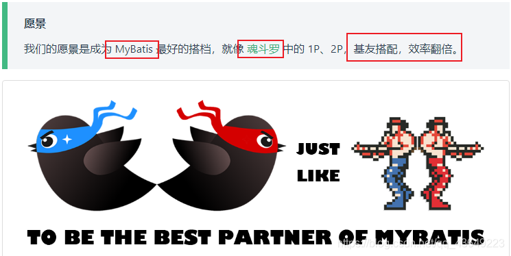

> ## 2.特性

- **无侵入**：只做增强不做改变，引入它不会对现有工程产生影响，如丝般顺滑
- **损耗小**：启动即会自动注入基本 CURD，性能基本无损耗，直接面向对象操作
- **强大的 CRUD 操作**：内置通用 Mapper、通用 Service，仅仅通过少量配置即可实现单表大部分 CRUD 操作，更有强大的条件构造器，满足各类使用需求
- **支持 Lambda 形式调用**：通过 Lambda 表达式，方便的编写各类查询条件，无需再担心字段写错
- **支持主键自动生成**：支持多达 4 种主键策略（内含分布式唯一 ID 生成器 - Sequence），可自由配置，完美解决主键问题
- **支持 ActiveRecord 模式**：支持 ActiveRecord 形式调用，实体类只需继承 Model 类即可进行强大的 CRUD 操作
- **支持自定义全局通用操作**：支持全局通用方法注入（ Write once, use anywhere ）
- **内置代码生成器**：采用代码或者 Maven 插件可快速生成 Mapper 、 Model 、 Service 、 Controller 层代码，支持模板引擎，更有超多自定义配置等您来使用
- **内置分页插件**：基于 MyBatis 物理分页，开发者无需关心具体操作，配置好插件之后，写分页等同于普通 List 查询
- **分页插件支持多种数据库**：支持 MySQL、MariaDB、Oracle、DB2、H2、HSQL、SQLite、Postgre、SQLServer 等多种数据库
- **内置性能分析插件**：可输出 Sql 语句以及其执行时间，建议开发测试时启用该功能，能快速揪出慢查询
- **内置全局拦截插件**：提供全表 delete 、 update 操作智能分析阻断，也可自定义拦截规则，预防误操作

## 1.快速入门

地址:[https://baomidou.com/guide/quick-start.html#%E5%88%9D%E5%A7%8B%E5%8C%96%E5%B7%A5%E7%A8%8B](https://baomidou.com/guide/quick-start.html#初始化工程)

使用第三方插件:

1. 导入对应的依赖
2. 研究依赖如何配置
3. 代码如何编写
4. 提高扩展技术能力

> 步骤

1.创建数据库 `mybatis_plus`

2.创建数据库

创建表

```
DROP TABLE IF EXISTS user;

CREATE TABLE user
(
    id BIGINT(20) NOT NULL COMMENT '主键ID',
    name VARCHAR(30) NULL DEFAULT NULL COMMENT '姓名',
    age INT(11) NULL DEFAULT NULL COMMENT '年龄',
    email VARCHAR(50) NULL DEFAULT NULL COMMENT '邮箱',
    PRIMARY KEY (id)
);
--真实开发环境中,version(乐观锁),deleted(逻辑删除),gmt_create,gmt_modified
1234567891011
```

插入数据

```sql
DELETE FROM user;

INSERT INTO user (id, name, age, email) VALUES
(1, 'Jone', 18, 'test1@baomidou.com'),
(2, 'Jack', 20, 'test2@baomidou.com'),
(3, 'Tom', 28, 'test3@baomidou.com'),
(4, 'Sandy', 21, 'test4@baomidou.com'),
(5, 'Billie', 24, 'test5@baomidou.com');
```


3.编写项目,初始化项目! 使用SpringBoot初始化!

4.导入依赖

```xml
<!--mysql-->
<dependency>
    <groupId>mysql</groupId>
    <artifactId>mysql-connector-java</artifactId>
</dependency>
<!--lombok-->
<dependency>
    <groupId>org.projectlombok</groupId>
    <artifactId>lombok</artifactId>
</dependency>
<!--mybatis-plus-->
<dependency>
    <groupId>com.baomidou</groupId>
    <artifactId>mybatis-plus-boot-starter</artifactId>
    <version>3.0.5</version>
</dependency>
```

说明:我们使用mybatis-plus 可以节省我们大量的代码,尽量不要同时导入mybatis和mybatis-plus因为版本有差异!

5.连接数据库!这一步和mybatis相同!

```properties
# mysql 5 驱动不同  com.mysql.jdbc.Driver

# mysql 8 驱动不同 com.mysql.cj.jdbc.Driver . 需要增加时区的配置 serverTimezone=GMT%2B8
spring.datasource.username=codeyuaiiao
spring.datasource.password=3615yuhaijiao
spring.datasource.url=jdbc:mysql://localhost:3306/mybatis_plus?useSSL=false&useUnicode=true&characterEncoding=utf-8
spring.datasource.driver-class-name=com.mysql.cj.jdbc.Driver
```

6.传统的方式pojo-dao(连接mybatis,配置mapper.xml文件)-service-controller

6.使用了mybatis-plus之后

- pojo

    ```java
    @Data
    @AllArgsConstructor
    @NoArgsConstructor
    public class User {
        private Long id;
        private String name;
        private Integer age;
        private String email;
    ```

- mapper接口

    ```java
    import com.baomidou.mybatisplus.core.mapper.BaseMapper;
    import com.codeyuaiiao.pojo.User;
    import org.springframework.stereotype.Repository;
    
    //在对应的mapper上面继承基本的类 BaseMapper
    @Repository//代表持久层
    public interface UserMapper extends BaseMapper<User> {
        //所有CRUD操作都已经编写完成了
        //你不需要向以前一样配置一大堆文件了!
    }
    ```

    注意点:需要在主启动类`MybatisPlusApplication`上扫描我们Mapper包下的所有接口

    `@MapperScan("com.codeyuaiiao.mapper")`

- 测试类中测试

    ```java
    @SpringBootTest
    class MybatisPlusApplicationTests {
    
        //继承了BaseMapper, 所有的方法都来自己父类
        //我们也可以编写自己的扩展方法
        @Autowired
        private UserMapper userMapper;
    
        @Test
        void contextLoads() {
            //参数是一个Wrapper , 条件构造器,这里我们先不用 --null
            //查询全部用户
            List<User> users = userMapper.selectList(null);
            users.forEach(System.out::println);
        }
    }
    ```

- 查询结果:

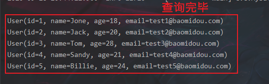

> 思考问题
>
> 1. sql谁帮我们写的?—mybatis-plus
> 2. 方法谁帮我们写的?—mybatis-pluss

## 2.配置日志

我们所有的sql是不可见的,我们希望知道他是怎么执行的,所以我们必须看日志!

```java
# 配置日志  (默认控制台输出)
mybatis-plus.configuration.log-impl=org.apache.ibatis.logging.stdout.StdOutImpl
```

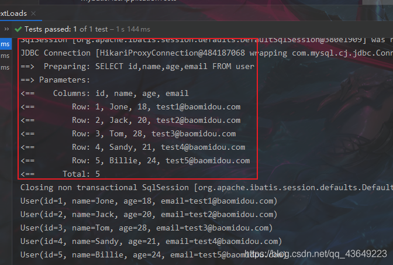

配置完日志之后你会喜欢上mybatis-plus!

## 3.CRUD扩展

### 1.插入数据

```java
@Test
public void testInsert(){
    User user = new User();
    user.setName("codeyuaiiao");
    user.setAge(3);
    user.setEmail("747557612@qq.com");
    int result = userMapper.insert(user);
    System.out.println(result);
    System.out.println(user);

}
```

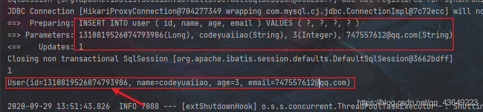

> 注意点:数据库插入的id默认值为:全局的唯一id

### 2.主键生成策略

> 默认 ID_WORKER 全局唯一id
>
> 对应数据库中的主键(uuid.自增id.雪花算法.redis.zookeeper)

分布式系统唯一id生成:https://www.cnblogs.com/haoxinyue/p/5208136.html

**雪花算法**😦**Twitter的snowflake算法**)

snowflake是Twitter开源的分布式ID生成算法，结果是一个long型的ID。其核心思想是：使用41bit作为毫秒数，10bit作为机器的ID（5个bit是数据中心，5个bit的机器ID），12bit作为毫秒内的流水号（意味着每个节点在每毫秒可以产生 4096 个 ID），最后还有一个符号位，永远是0.可以保证几乎全球唯一

> 主键自增

我们需要配置主键自增:

1. 实体类字段上`@TableId(type = IdType.AUTO)`

2. 数据库字段一定要是**自增**!

    

    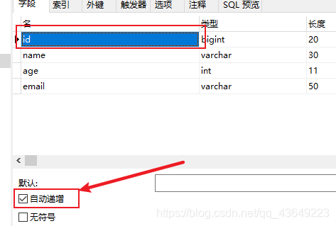

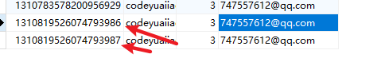

> 其余源码解释

```java
public enum IdType {
     
    AUTO(0),//数据库ID自增  
    NONE(1),//该类型为未设置主键类型      
    INPUT(2),//用户输入ID
      		 //该类型可以通过自己注册自动填充插件进行填充  
    
//以下3种类型、只有当插入对象ID 为空，才自动填充。     
    ID_WORKER(3),//全局唯一ID (idWorker)      
    UUID(4),//全局唯一ID (UUID)          
    ID_WORKER_STR(5);//字符串全局唯一ID (idWorker 的字符串表示)    
```

### 3.更新数据

> 动态sql

注意:updateById()参数是 一个对象!

```java
//测试更新
@Test
public void testUpdate(){
    User user = new User();
    user.setId(2L);
    user.setName("阿峧不是山交");
    //        注意:updateById()参数是 一个对象!
    int i = userMapper.updateById(user);
    System.out.println(i);

}
```

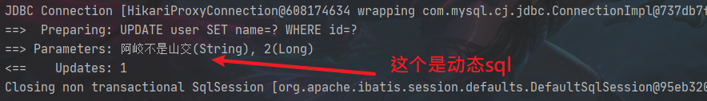

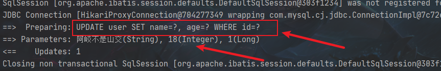

所有的sql都是动态帮你配置的

### 4.自动填充

创建时间 . 修改时间! 这些个操作都是自动化完成的,我们不希望手动更新!

阿里巴巴开发手册:所有的数据库表:gmt_create .gmt_modified几乎所有的表都要配置上!而且需要自动化!

> 方式一:数据库级别

1.在表中新增字段 create_time , update_time

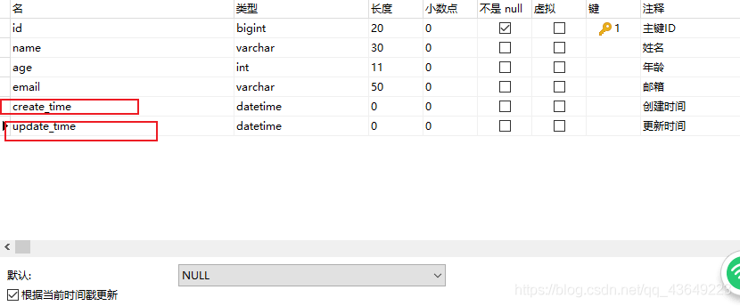

2.再次测试插入方法,我们需要先把实体类同步

```
private Data creatTime;
private Data updateTime;
12
```

再次更新查看结果即可

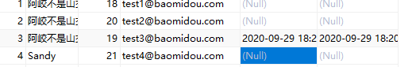

> 方式二:代码级别

1.删除数据库默认值

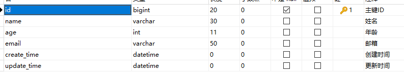

2.实体类字段属性上添加注解

```
//记住用util包下的Date!!
//字段添加填充内容
@TableField(fill = FieldFill.INSERT)
private Data creatTime;

@TableField(fill = FieldFill.INSERT_UPDATE)
private Data updateTime;
```

3.编写处理器来处理这个注解

```java
package com.codeyuaiiao.handler;

import com.baomidou.mybatisplus.core.handlers.MetaObjectHandler;
import lombok.extern.slf4j.Slf4j;
import org.apache.ibatis.reflection.MetaObject;
import org.springframework.stereotype.Component;

import java.util.Date;

@Slf4j
@Component //把处理器加到IOC容器中
public class MyMetaObjectHandler implements MetaObjectHandler {

    //插入时的填充策略
    @Override
    public void insertFill(MetaObject metaObject) {
        log.info("Start insert fill.... ");
        this.setFieldValByName("createTime",new Date(),metaObject);
        this.setFieldValByName("updateTime",new Date(),metaObject);
    }

    //更新时的填充策略
    @Override
    public void updateFill(MetaObject metaObject) {
        log.info("Start update fill.... ");
        this.setFieldValByName("updateTime",new Date(),metaObject);
    }
}
```

3.编写处理器来处理这个注解即可!

```java
package com.codeyuaiiao.handler;

import com.baomidou.mybatisplus.core.handlers.MetaObjectHandler;
import lombok.extern.slf4j.Slf4j;
import org.apache.ibatis.reflection.MetaObject;
import org.springframework.stereotype.Component;

import java.util.Date;

@Slf4j
@Component //把处理器加到IOC容器中
public class MyMetaObjectHandler implements MetaObjectHandler {

    //插入时的填充策略
    @Override
    public void insertFill(MetaObject metaObject) {
        log.info("Start insert fill.... ");
        this.setFieldValByName("createTime",new Date(),metaObject);
        this.setFieldValByName("updateTime",new Date(),metaObject);
    }

    //更新时的填充策略
    @Override
    public void updateFill(MetaObject metaObject) {
        log.info("Start update fill.... ");
        this.setFieldValByName("updateTime",new Date(),metaObject);
    }
}
```

4.测试插入

5测试更新,观察时间即可!

### 5.乐观锁&悲观锁

> 乐观锁: 顾名思义十分乐观,他总是认为不会出现问题,无论干什么都不去上锁!如果出现了问题,再次更新值测试
>
> 悲观锁;顾名思义十分悲观,他总是认为出现问题,无论干什么都会上锁!再去操作!

我们这里主要讲解 乐观锁机制!

乐观锁实现方式:

- 取出记录时,获取当前version
- 更新时,带上这个version
- 执行更新时,set version = newVersion where version = oldVersion
- 如果version不对,就更新失败

### 6.查询操作

```java
//测试查询
@Test
public void testSelectById(){
    User user = userMapper.selectById(1L);
    System.out.println(user);
}

//测试批量查询
public void testSelectBatchId(){
    List<User> users = userMapper.selectBatchIds(Arrays.asList(1, 2, 3));
    users.forEach(System.out::println);
}

//按条件查询之--使用Map操作
@Test
public void testSelectBatchIds(){
    HashMap<String, Object> map = new HashMap<>();
    map.put("name","阿峧说java");
    map.put("age","18");

    List<User> users = userMapper.selectByMap(map);
    users.forEach(System.out::println);
}
```

我们在工作中会遇见逻辑删除

### 7.逻辑删除

> 物理删除:从数据库中直接移除
>
> 逻辑删除: 在数据库中没有被移除,而是通过一个变量来让他失效! deleted=0=>deleted=1

管理员可以查看被删除的记录!防止数据的丢失,类似于回收站!

测试:

1.在数据表中增加一个deleted字段

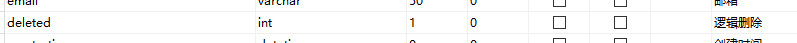

2.实体类中增加属性

```
//逻辑删除
@TableLogic
private Integer deleted;
123
```

3.配置

```java
//注册逻辑删除
@Bean
public ISqlInjector sqlInjector(){
    return new LogicSqlInjector();
}
```

配置

```java
# 配置逻辑删除
mybatis-plus.global-config.db-config.logic-delete-value=1
mybatis-plus.global-config.db-config.logic-not-delete-value=0
```

> 走的是更新操作,不是删除操作
>
> 

> 查询的时候会自动过滤删除的数据
>
> 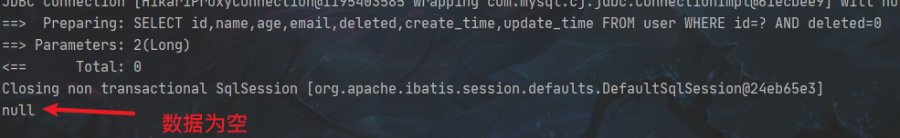

以上的所有CRUD操作及其扩展,我们都必须精通掌握!会大大提好你的工作和写项目的效率

## 4.性能分析插件

我们在平时的开发中,会遇到一些慢sql.

MP也提供了性能分析插件,如果超过这个时间就停止运行!

1.导入插件

```java
@Bean
    @Profile({"dev","test"}) //设置dev 和 test环境开启
    public PerformanceInterceptor performanceInterceptor(){
        PerformanceInterceptor performanceInterceptor = new PerformanceInterceptor();
        performanceInterceptor.setMaxTime(1);
        performanceInterceptor.setFormat(true);
        return performanceInterceptor;
    }
```

[外链图片转存失败,源站可能有防盗链机制,建议将图片保存下来直接上传(img-7kbdevy0-1601449207282)(MyBatisPlusB站狂神说.assets/image-20200930133715010.png)]

记住在SpringBoot中配置环境为 dev或者test环境

application.properties中添加设置开发环境

```properties
#设置开发环境
spring.profiles.active=dev
```

2.测试查询

```java
@Test
    public void testSelectBatchId(){
        List<User> users = userMapper.selectBatchIds(Arrays.asList(1, 2, 3));
        users.forEach(System.out::println);
    }
```

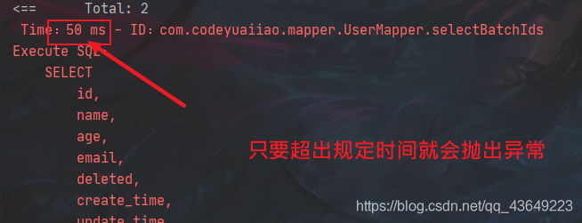

## 5.条件构造器

```java
package com.kuang;

import com.baomidou.mybatisplus.core.conditions.query.QueryWrapper;
import com.kuang.mapper.UserMapper;
import com.kuang.pojo.User;
import org.junit.jupiter.api.Test;
import org.springframework.beans.factory.annotation.Autowired;
import org.springframework.boot.test.context.SpringBootTest;

import java.util.List;
import java.util.Map;

@SpringBootTest
public class WrapperTest {

    @Autowired
    private UserMapper userMapper;

    @Test
    void contextLoads() {
        // 查询name不为空的用户，并且邮箱不为空的用户，年龄大于等于12
        QueryWrapper<User> wrapper = new QueryWrapper<>();
        wrapper
                .isNotNull("name")
                .isNotNull("email")
                .ge("age",12);
        userMapper.selectList(wrapper).forEach(System.out::println); // 和我们刚才学习的map对比一下
    }

    @Test
    void test2(){
        // 查询名字狂神说
        QueryWrapper<User> wrapper = new QueryWrapper<>();
        wrapper.eq("name","狂神说");
        User user = userMapper.selectOne(wrapper); // 查询一个数据，出现多个结果使用List 或者 Map
        System.out.println(user);
    }

    @Test
    void test3(){
        // 查询年龄在 20 ~ 30 岁之间的用户
        QueryWrapper<User> wrapper = new QueryWrapper<>();
        wrapper.between("age",20,30); // 区间
        Integer count = userMapper.selectCount(wrapper);// 查询结果数
        System.out.println(count);
    }

    // 模糊查询
    @Test
    void test4(){
        // 查询年龄在 20 ~ 30 岁之间的用户
        QueryWrapper<User> wrapper = new QueryWrapper<>();
        // 左和右  t%
        wrapper
                .notLike("name","e")
                .likeRight("email","t");

        List<Map<String, Object>> maps = userMapper.selectMaps(wrapper);
        maps.forEach(System.out::println);
    }

    // 模糊查询
    @Test
    void test5(){

        QueryWrapper<User> wrapper = new QueryWrapper<>();
        // id 在子查询中查出来
        wrapper.inSql("id","select id from user where id<3");

        List<Object> objects = userMapper.selectObjs(wrapper);
        objects.forEach(System.out::println);
    }

    //测试六
    @Test
    void test6(){
        QueryWrapper<User> wrapper = new QueryWrapper<>();
        // 通过id进行排序
        wrapper.orderByAsc("id");

        List<User> users = userMapper.selectList(wrapper);
        users.forEach(System.out::println);
    }

}

```

## 6.代码自动生成 非常NB

dao、pojo、service、controller都给我自己去编写完成！

AutoGenerator 是 MyBatis-Plus 的代码生成器，通过 AutoGenerator 可以快速生成 Entity、

Mapper、Mapper XML、Service、Controller 等各个模块的代码，极大的提升了开发效率。

只需要改实体类名字 和包名 还有 数据库配置即可

测试:

```java
import com.baomidou.mybatisplus.annotation.DbType; import com.baomidou.mybatisplus.annotation.FieldFill; import com.baomidou.mybatisplus.annotation.IdType; import com.baomidou.mybatisplus.annotation.TableField; import com.baomidou.mybatisplus.generator.AutoGenerator; import com.baomidou.mybatisplus.generator.config.DataSourceConfig; import com.baomidou.mybatisplus.generator.config.GlobalConfig; import com.baomidou.mybatisplus.generator.config.PackageConfig; import com.baomidou.mybatisplus.generator.config.StrategyConfig; import com.baomidou.mybatisplus.generator.config.po.TableFill; import com.baomidou.mybatisplus.generator.config.rules.DateType; import com.baomidou.mybatisplus.generator.config.rules.NamingStrategy; import java.util.ArrayList; 

// 代码自动生成器 
public class KuangCode {
public static void main(String[] args) {
    // 需要构建一个 代码自动生成器 对象 
    AutoGenerator mpg = new AutoGenerator(); 
    
    // 配置策略 
    // 1、全局配置 
    GlobalConfig gc = new GlobalConfig();
    String projectPath = System.getProperty("user.dir"); 
    gc.setOutputDir(projectPath+"/src/main/java");
    gc.setAuthor("狂神说"); gc.setOpen(false);
    gc.setFileOverride(false);
    
    // 是否覆盖
    gc.setServiceName("%sService");
    
    // 去Service的I前缀
    gc.setIdType(IdType.ID_WORKER);
    gc.setDateType(DateType.ONLY_DATE);
    gc.setSwagger2(true);
    mpg.setGlobalConfig(gc);
    
    //2、设置数据源
    DataSourceConfig dsc = new DataSourceConfig();
    dsc.setUrl("jdbc:mysql://localhost:3306/kuang_community? useSSL=false&useUnicode=true&characterEncoding=utf-8&serverTimezone=GMT%2B8");
    dsc.setDriverName("com.mysql.cj.jdbc.Driver");
    dsc.setUsername("root");
    dsc.setPassword("123456");
    dsc.setDbType(DbType.MYSQL); mpg.setDataSource(dsc);
    
    //3、包的配置
    PackageConfig pc = new PackageConfig();
    //只需要改实体类名字 和包名 还有 数据库配置即可
    pc.setModuleName("blog"); pc.setParent("com.kuang");
    pc.setEntity("entity"); pc.setMapper("mapper");
    pc.setService("service"); pc.setController("controller");
    mpg.setPackageInfo(pc);
    
    //4、策略配置
    StrategyConfig strategy = new StrategyConfig();
  strategy.setInclude("blog_tags","course","links","sys_settings","user_record"," user_say");
    
    // 设置要映射的表名
    strategy.setNaming(NamingStrategy.underline_to_camel);
    strategy.setColumnNaming(NamingStrategy.underline_to_camel);
    strategy.setEntityLombokModel(true);
    
    // 自动lombok；
    strategy.setLogicDeleteFieldName("deleted"); 
    
    // 自动填充配置
    TableFill gmtCreate = new TableFill("gmt_create", FieldFill.INSERT);
    TableFill gmtModified = new TableFill("gmt_modified", FieldFill.INSERT_UPDATE);
    ArrayList<TableFill> tableFills = new ArrayList<>();
    tableFills.add(gmtCreate); tableFills.add(gmtModified);
    strategy.setTableFillList(tableFills);
    
    // 乐观锁
    strategy.setVersionFieldName("version");
    strategy.setRestControllerStyle(true);
    strategy.setControllerMappingHyphenStyle(true);
    
    // localhost:8080/hello_id_2 
    mpg.setStrategy(strategy);
    mpg.execute(); //执行 
    }
}
```