## JVM探究

面试常见：

1. 请你谈谈你对JVM的理解?
2. java8虚拟机和之前的变化更新?
3. 什么是OOM，什么是栈溢出StackOverFlowError? 怎么分析?
4. JVM的常用调优参数有哪些?
5. 内存快照如何抓取，怎么分析Dump文件？
6. 谈谈JVM中，类加载器你的认识

## 1.JVM的位置

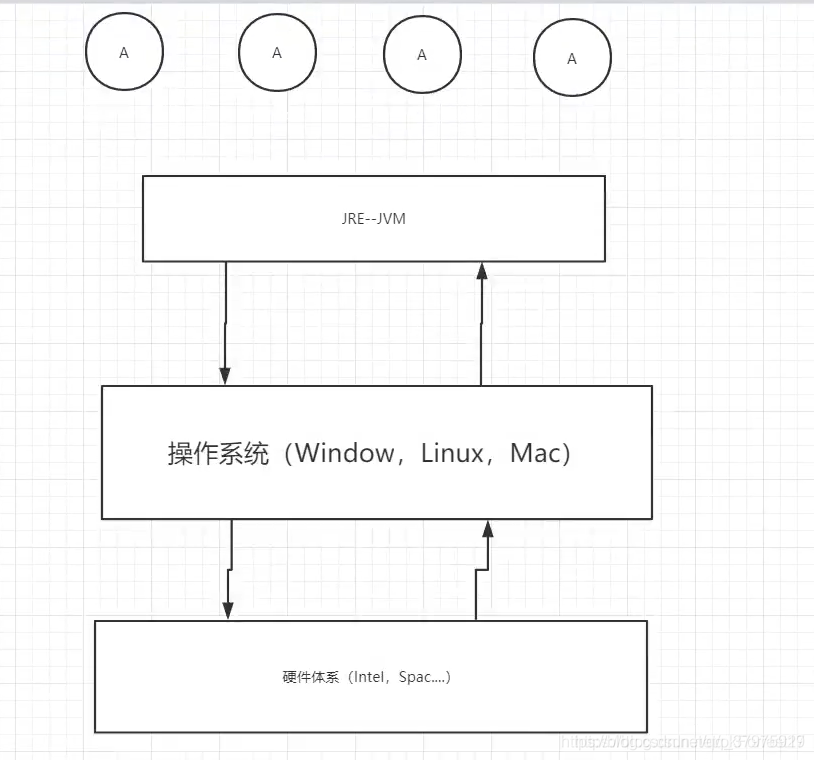
JRE：java开发环境，包含了JVM

## 2.JVM的体系结构

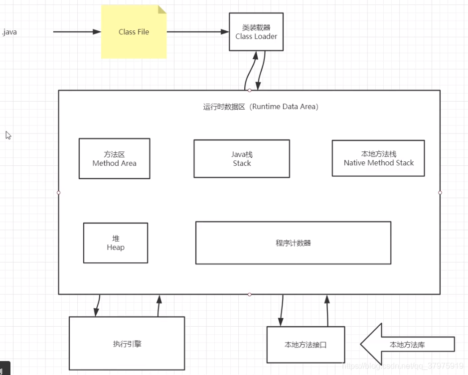
Java栈、本地方法栈、程序计数器不会有垃圾回收，否则程序会死掉
百分之99的JVM调优都是在方法区和堆（99%是堆）中调优，Java栈、本地方法栈、程序计数器是不会有垃圾存在的。

## 3. 类加载器

类是模板，是抽象的，类实例化得到的对象是具体的。所有的对象反射回去得到的是同一个类模板。
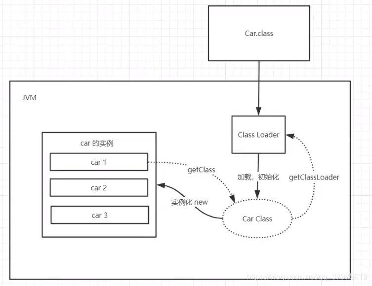

1. 虚拟机自带的加载器
2. 启动类(根)加载器 BootstrapClassLoader
3. 扩展类加载器  ExtClassLoader
4. 应用程序加载器  AppClassLoader
5. 百度：双亲委派机制

## 4.双亲委派机制

双亲委派机制：安全  
APP–>EXC—B0OT(最终执行)  
// B0OT  
// EXC  
// APP

1. 类加载器收到类加载的请求 Application
2. 将这个请求向上委托给父类加载器去完成，一 直向上委托，直到启动类加载器  Boot
3. 启动加载器检查是否能够加载当前这个类，能加载就结束， 使用当前的加载器，否则， 抛出异常，通知子加载器进行加载
4. 重复步骤3
5. Class Not Found异常就是这么来的
6. Null：Java调用不到。Java早期的名字：C+± -  Java = C++:去掉繁琐的东西，指针，内存管理~

Java语言保留了C的接口，这些方法就是用native（本地）修饰的，java通过native方法调用操作系统的方法

## 5.沙箱安全机制

Java安全模型的核心就是Java沙箱(sanddiox)，什么是沙箱？沙箱是一个限制程序运行的环境。沙箱机制就是将Java代码限定在虚拟机 (JVM) 特定的运行范围中，并且严格限制代码对本地系统资源访问，通过这样的措施来保证对代码的有效隔离，防止对本地系统造成破坏。沙箱主要限制系统资源访问，那系统资源包括什么? CPU、内存、文件系统、网络。不同级别的沙箱对这些资源访问的限制也可以不一样。

所有的Java程序运行都可以指定沙箱，可以定制安全策略。

在Java中将执行程序分成本地代码和远程代码两种，本地代码默认视为可信任的，而远程代码则被看作是不受信的。对于授信的本地代码，可以访问一切本地资源。而对于非授信的远程代码在早期的Java实现中，安全依赖于沙箱(Sandbox)机制。如下图所示JDK1.0安全模型


但如此严格的安全机制也给程序的功能扩展带来障碍，比如当用户希望远程代码访问本地系统的文件时候，就无法实现。因此在后续的Java1.1版本中，针对安全机制做了改进，增加了安全策略，允许用户指定代码对本地资源的访问权限。如下图所示JDK1.1安全模型


在Java1.2版本中，再次改进了安全机制，增加了代码签名。不论本地代码或是远程代码，都会按照用户的安全策略设定，由类加载器加载到虚拟机中权限不同的运行空间，来实现差异化的代码执行权限控制。如下图所示
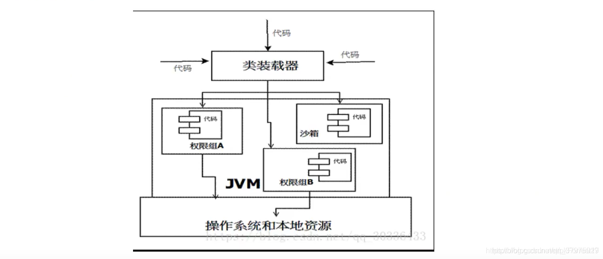
当前最新的安全机制实现，则引入了域(Domain)的概念。虚拟机会把所有代码加载到不同的系统域和应用域,系统域部分专门负责与关键资源进行交互，而各个应用域部分则通过系统域的部分代理来对各种需要的资源进行访问。虚拟机中不同的受保护域(Protected Domain),对应不一样的权限(Permission)。存在于不同域中的类文件就具有了当前域的全部权限，如下图所示最新的安全模型(jdk 1.6)

组成沙箱的基本组件

- 字节码校验器(bytecode verifier)：确保Java类文件遵循Java语言规范。这样可以帮助Java程序实现内存保护。但并不是所有的类文件都会经过字节码校验，比如核心类。
- 类裝载器(class loader) ：其中类装载器在3个方面对Java沙箱起作用
-  它防止恶意代码去干涉善意的代码;
-  它守护了被信任的类库边界;
-  它将代码归入保护域,确定了代码可以进行哪些操作。

虚拟机为不同的类加载器载入的类提供不同的命名空间，命名空间由一系列唯一的名称组成， 每一个被装载的类将有一个名字，这个命名空间是由Java虚拟机为每一个类装载器维护的，它们互相之间甚至不可见。  
类装载器采用的机制是双亲委派模式。

- 从最内层JVM自带类加载器开始加载,外层恶意同名类得不到加载从而无法使用;
- 由于严格通过包来区分了访问域,外层恶意的类通过内置代码也无法获得权限访问到内层类，破坏代码就自然无法生效。
    ●存取控制器(access controller) :存取控制器可以控制核心API对操作系统的存取权限，而这个控制的策略设定,可以由用户指定。
    ●安全管理器(security manager) : 是核心API和操作系统之间的主要接口。实现权限控制，比存取控制器优先级高。
    ●安全软件包(security package) : java.security下的类和扩展包下的类，允许用户为自己的应用增加新的安全特性，包括:
-  安全提供者
-  消息摘要
-  数字签名
-  加密
-  鉴别

## 6.native

native：

- 凡是带了native关键字的，说明**java的作用范围达不到了**，会去调用底层c语言的库
- 会进入本地方法栈
- 调用本地方法本地接口 JNI (Java Native Interface)
- JNI作用：开拓Java的使用，融合不同的编程语言为Java所用，最初: C、C++
- Java诞生的时候C、C++横行，想要立足，必须要有调用C、C++的程序
- 它在内存区域中专门开辟了一块标记区域: Native Method Stack，登记native方法
- 在最终执行的时候，加载本地方法库中的方法通过JNI
- 例如：Java程序驱动打印机，管理系统，掌握即可，在企业级应用比较少
    private native void start0();
    调用其他接口：Socket… WebService … http~

目前该方法使用的越来越少了，除非是与硬件有关的应用，比如通过Java程序驱动打印机或者Java系统管理设备，在企业级应用中已经比较少见。因为现在的异构领域间通信很发达，比如可以使用Socket通信，也可以使用Web Service等等，不多做介绍！
**Native Method Stack**
它的具体做法是Native Method Stack 中登记native方法，在 ( Execution Engine ) 执行引擎执行的时候加载Native Libraies。【本地库】

## 7.PC寄存器

**程序计数器**: Program Counter Register  
 每个线程都有一个程序计数器，是线程私有的，就是一个指针, 指向方法区中的方法字节码(用来存储指向像一条指令的地址， 也即将要执行的指令代码)，在执行引擎读取下一条指令, 是一个非常小的内存空间，几乎可以忽略不计。

## 8.方法区 Method Area

方法区是被所有线程共享，所有字段和方法字节码，以及一些特殊方法，如构造函数，接口代码也在此定义,简单说，所有定义的方法的信息都保存在该区域，此区域属于共享区间;  
 ***静态变量、常量、类信息(构造方法、接口定义)、运行时的常量池存在方法区中，但是实例变量存在堆内存中，和方法区无关***
static、final、Class、常量池

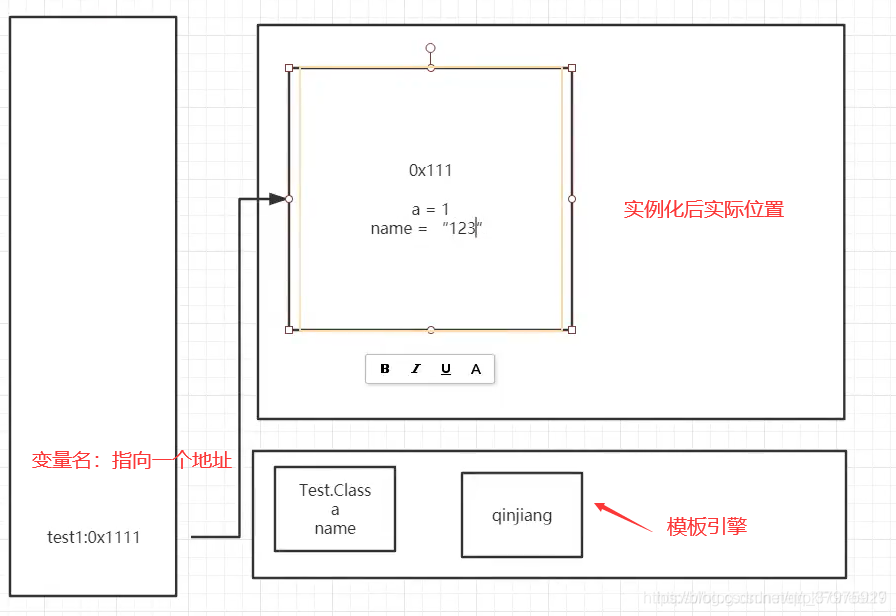

## 9.栈

### 栈:数据结构

程序 = 数据结构＋算法︰持续学习~
程序 = 框架＋业务逻辑︰吃饭~
栈：先进后出、后进先出，桶
队列：先进先出( FIFO : First Input First Output )

为什么main()先执行，最后结束~

### 栈：栈内存

主管程序的运行，生命周期和线程同步；线程结束，栈内存也就释放，对于栈来说，不存在垃圾回收的问题。
一旦线程结束，栈就Over

栈：8大基本类型＋对象引用＋实例的方法
栈运行原理：栈帧

栈帧：局部变量表+操作数栈
每执行一个方法，就会产生一个栈帧。程序正在运行的方法永远都会在栈的顶部
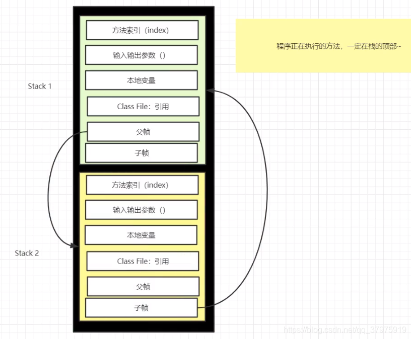
栈满了: StackOverflowError
栈＋堆＋方法区：交互关系
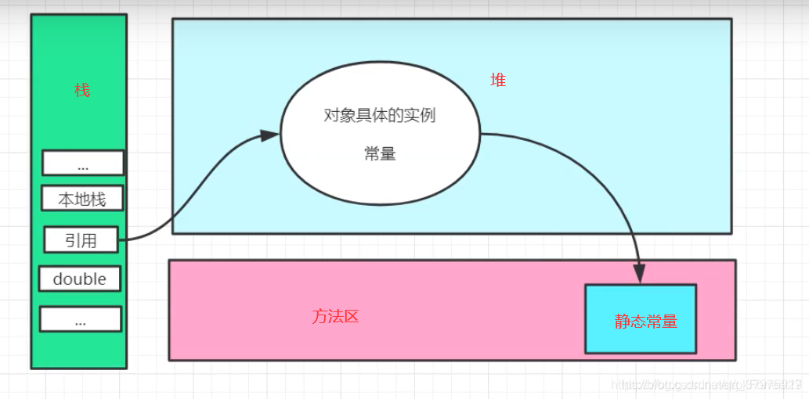

## 10.三种JVM

- Sun公司HotSpot java Hotspot™64-Bit server vw (build 25.181-b13，mixed mode)
- BEA JRockit
- IBM 39 VM
    我们学习都是：Hotspot

## 11.堆

Heap，一个JVM只有一个堆内存，堆内存的大小是可以调节的。
类加载器读取了类文件后，一般会把什么东西放到堆中？类，方法，常量，变量~，保存我们所有引用类型的真实对象；
堆内存中还要细分为三个区域：

- 新生区（伊甸园区) Young/New
- 养老区 old
- 永久区 Perm
    GC：Garbage recycling
    轻GC：轻量级垃圾回收，主要是在新生区
    重GC（Full GC）：重量级垃圾回收，主要是养老区，重GC就说明内存都要爆了
    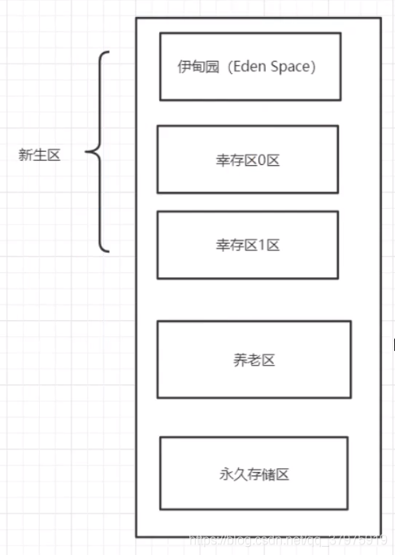
    GC垃圾回收，主要是在伊甸园区和养老区~
    假设内存满了，OOM（Out Of memory），堆内存不够！java.lang.OutOfMemoryError: Java heap space
    在JDK8以后，永久存储区改了个名字(元空间)；

真理：经过研究，99%的对象都是临时对象!

## 永久区

这个区域常驻内存的。用来存放JDK自身携带的Class对象。Interface元数据，存储的是Java运行时的一些环境或类信息~
这个区域不存在垃圾回收！关闭VM虚拟就会释放这个区域的内存~
一个启动类，加载了大量的第三方jar包。Tomcat部署了太多的应用，大量动态生成的反射类。不断的被加载。直到内存满，就会出现OOM;

- jdk1.6之前︰永久代，常量池是在方法区;
- jdk1.7：永久代，但是慢慢的退化了，去永久代，常量池在堆中
- jdk1.8之后∶无永久代，常量池在元空间

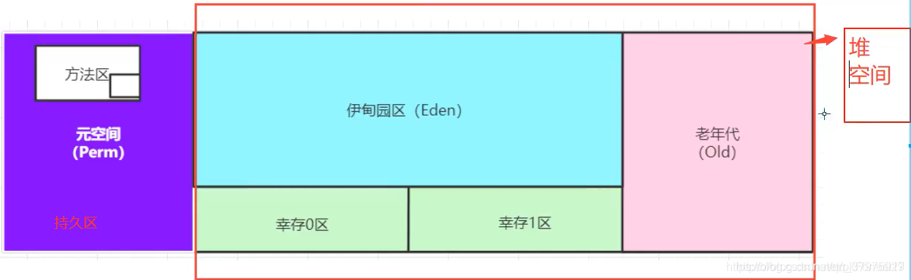
方法区中那个小框是：常量池
元空间又被称为非堆，但它也是堆，也有人认为右侧区域是堆空间，只是个人理解不同。
元空间：逻辑上存在，物理上不存在 (因为存储在本地磁盘内) 而并不算在JVM虚拟机内存中，也就是并没有占堆内存。

## 12.堆内存调优

```java
//-Xms8m -Xmx8m -XX:+PrintGCDetails
public class Hello{
	public static void main( String[ ] args) i
	string str = "kuangshensayjava";
	while (true){
	str += str + new Random( ) .nextInt( bound: 888888888)+new Random( ) .nextInt( bound: 99999999);
	}
}
```

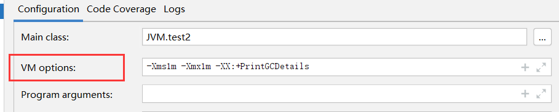
可以通过调整这个参数（Edit Configuration—>VM options）控制Java虚拟机初始内存和分配的总内存的大小。
默认情况下：

> 分配的总内存是电脑内存的 1/4，而初始化的内存: 1/64

OOM:

> 1、尝试扩大堆内存看结果
> 2、分析内存，看一下哪个地方出现了问题（专业工具)
> //-Xms1024m -Xmx1024m -XX :+PrintGCDetails

当新生代、老年代、元空间内存都满了之后才会报OOM

在一个项目中，突然出现了OOM故障，那么该如何排除，研究为什么出错

- 能够看到代码第几行出错：内存快照分析工具，MAT，Jprofiler
- Dubug，一行行分析代码!

MAT，Jprofiler作用

- 分析Dump内存文件，快速定位内存泄露;
- 获得堆中的数据
- 获得大的对象
- ……
    MAT最早集成于Eclipse中，IDEA中可以使用Jprofiles插件，在Settings—>Plugins中搜索Jprofiles，安装改插件即可使用

## Jprofile使用

1. 在idea中下载 jprofile 插件
2. 百度搜索官网下载 jprofile 客户端 ，安装路径要求：没有中文没有空格
3. 安装破解完之后，在IDEA的Settings—>Tools下找到 jprofiles，然后绑定安装目录bin下的.exe文件
4. 在idea中VM参数中写参数 -Xms1m -Xmx8m -XX:+HeapDumpOnOutOfMemoryError （假如堆内存heap出现了OOM则dump出这个异常）
5. 运行程序后在jprofile客户端中打开（dump出的文件应该在src目录下）找到错误 告诉哪个位置报错

命令参数详解

- -Xms设置初始化内存分配大小，默认1/64
- -Xmx设置最大分配内存，默以1/4
- -XX: +PrintGCDetails // 打印GC垃圾回收信息
- -XX: +HeapDumpOnOutOfMemoryError //OOM DUMP
    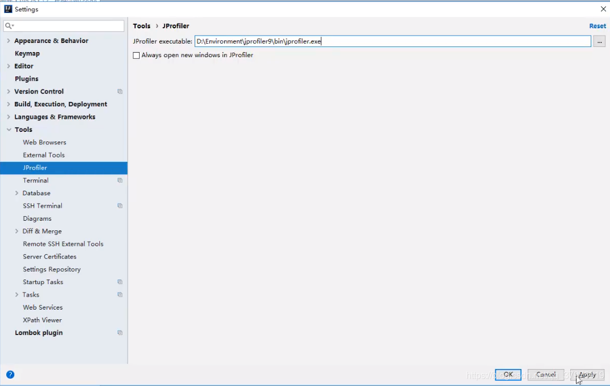

## 13.GC

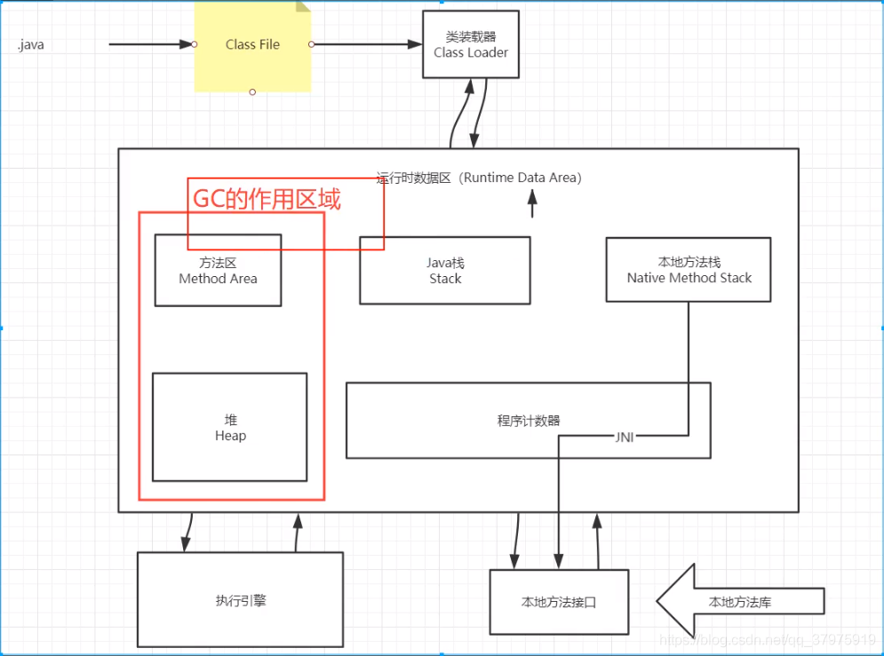
JVM在进行GC时，并不是对这三个区域统一回收。大部分时候，回收都是新生代~

- 新生代
- 幸存区(form , to)
- 老年区

GC两种类：轻GC(普通的GC)，重GC(全局GC)
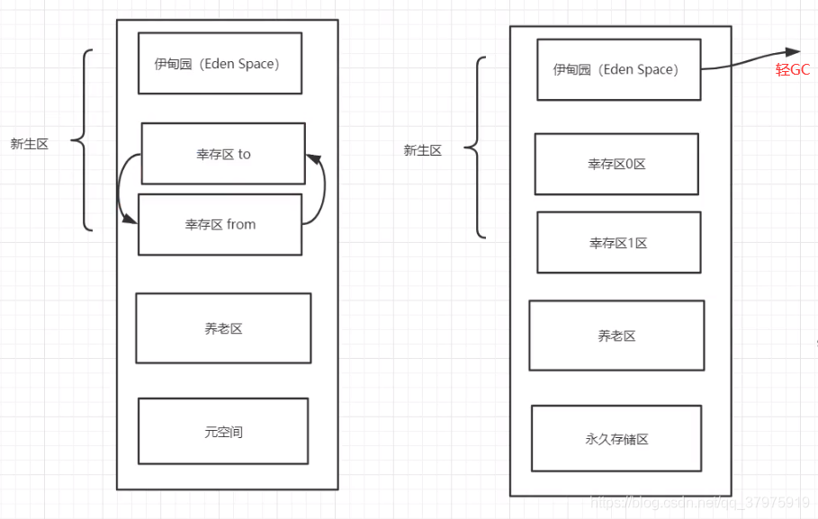
幸存0区和幸存1区两者是会交替的，from和to的关系会交替变化。

## 14.GC常用算法

GC题目：
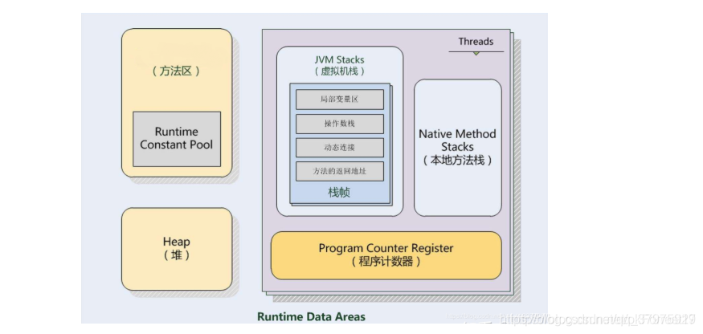

- JVM的内存模型和分区，详细到每个区放什么?
- 堆里面的分区有哪些? Eden，from，to，老年区，说说他们的特点!
- GC的算法有哪些? 标记清除法，标记压缩，复制算法，引用计数器，怎么用的?
- 轻GC和重GC分别在什么时候发生?

## 引用计数法：

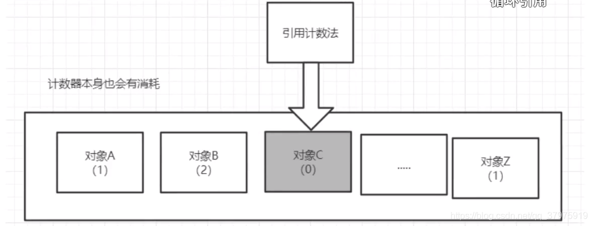

## 复制算法：

to永远是干净的，空的。
新生区主要是用复制算法
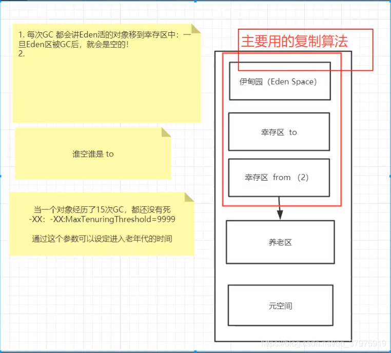
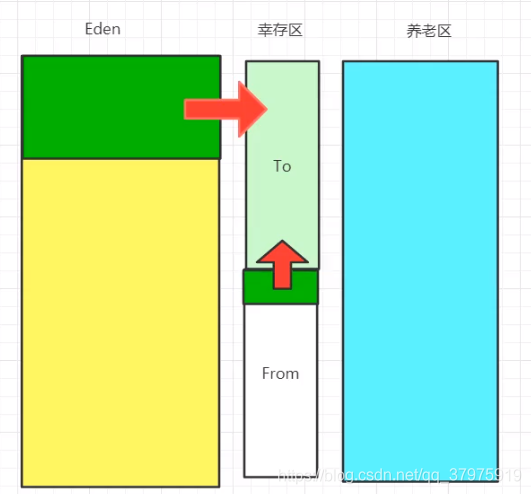
第一次GC后：
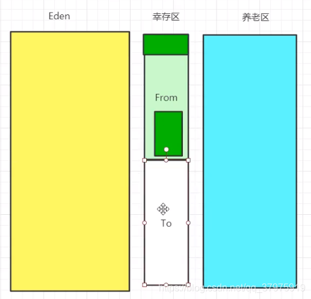
第一次GC后，Eden区和to区空了，经过15次垃圾回收后依然存活下来的对象就会去养老区

- 好处：没有内存的碎片
- 坏处：浪费了内存空间（一个幸存区的空间永远是空：to）。假设对象100%存活（极端情况)

复制算法最佳使用场景：对象存活度较低的时候；新生区~

## 标记清除算法：

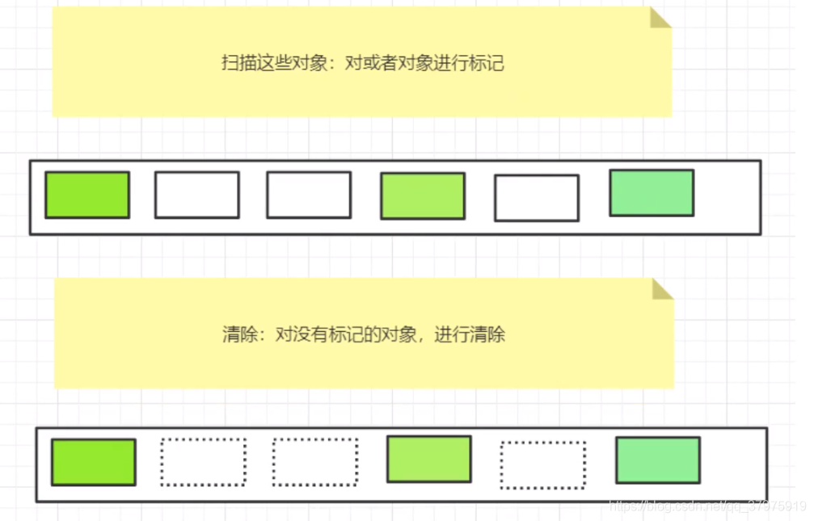

- 优点：不需要额外的空间！
- 缺点：两次扫描，严重浪费时间，会产生内存碎片。

改良：标记清除再压缩
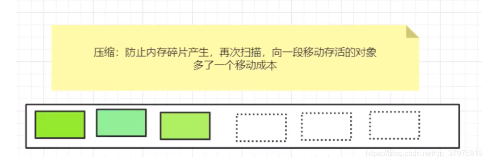
再改进：先标记清除几次之后，再压缩1次。

## 15.GC算法总结

- 内存效率：复制算法>标记清除算法>标记压缩算法(时间复杂度)
- 内存整齐度:复制算法=标记压缩算法>标记清除算法
- 内存利用率:标记压缩算法=标记清除算法>复制算法

思考一个问题：难道没有最优算法吗?
答案：没有，没有最好的算法，只有最合适的算法 —> GC：分代收集算法

**年轻代：**

- 存活率低
- 复制算法!

**老年代:**

- 区域大：存活率
- 标记清除 (内存碎片不是太多) + 标记压缩混合实现

一天时间学JVM，不现实，要深究，必须要下去花时间，和多看面试题，以及《深入理解JVM》
但是，我们可以掌握一个学习JVM的方法~

## 16.JMM

- 什么是JMM?
    JMM：(Java Memory Model的缩写)
- 它干嘛的? 官方，其他人的博客，对应的视频!
    作用：缓存一致性协议，用于定义数据读写的规则 (遵守，找到这个规则)。
    JMM定义了线程和主内存之间的抽象关系:线程之间的共享变量存储在主内存(Main Memory)中，每个线程都有一个私有的本地内存(Local Memory)
    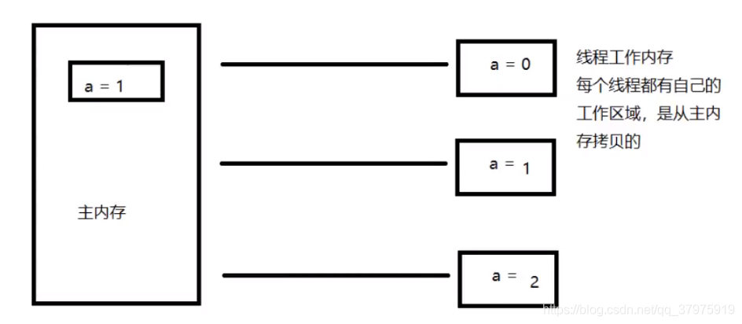
    解决共享对象可见性这个问题: volilate
    一旦刷新了就会很快的同步到主内存中。
- 它该如何学习?
    JMM：抽象的概念，理论
    JMM对这八种指令的使用，制定了如下规则:
- 不允许read和load、store和write操作之一单独出现。即使用了read必须load，使用了store必须
    write
- 不允许线程丢弃他最近的assign操作，即工作变量的数据改变了之后，必须告知主存
- 不允许一个线程将没有assign的数据从工作内存同步回主内存
- 一个新的变量必须在主内存中诞生，不允许工作内存直接使用一个未被初始化的变量。就是对变量实施use、store操作之前，必须经过assign和load操作
- 一个变量同一时间只有一个线程能对其进行lock。多次lock后，必须执行相同次数的unlock才能解锁
- 如果对一个变量进行lock操作，会清空所有工作内存中此变量的值，在执行引擎使用这个变量前，必须重新load或assign操作初始化变量的值
- 如果一个变量没有被lock，就不能对其进行unlock操作。也不能unlock一个被其他线程锁住的变量对
- 一个变量进行unlock操作之前，必须把此变量同步回主内存

JMM对这八种操作规则和对volatile的一些特殊规则就能确定哪里操作是线程安全，哪些操作是线程不安全的了。但是这些规则实在复杂，很难在实践中直接分析。所以一般我们也不会通过上述规则进行分析。更多的时候，使用java的happen-before规则来进行分析。