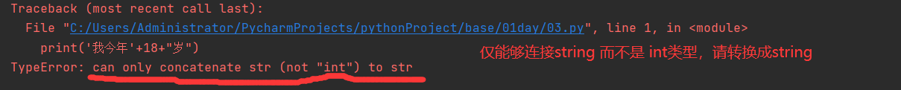
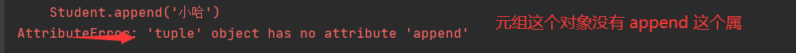

[toc]

# 从HelloWorld开始学习吧

Python 是一种**解释型语言**： 这意味着开发过程中没有了编译这个环节。类似于PHP和Perl语言。

Python 是**交互式语言**： 这意味着，您可以在一个 Python 提示符 >>> 后直接执行代码。

Python 是**面向对象语言**: 这意味着Python支持面向对象的风格或代码封装在对象的编程技术。

python文件的后缀名以.py结尾

## HelloWorld.py

```python
#在这会发现print后面没有分号这和java c有点不同，python的写法比较灵活
print("Hello, World!")
```

## Python中的注释

Python中的注释可没有 // 、/**/这个注释

```python
# 这是一个单行注释
'''
这是一个多行注释
'''
123
"""
这是一个多行注释
"""
```

## Python中变量名起名规范


## Python中的输出以及格式化

Python中的输出使用 **print()函数**
只是一个最基本的输出 打印一句话 我叫Xxx

```python
print("我叫Xxx")
```

接下来试试另一个输出方式，打印一句话 我今年18岁

```python
print('我今年'+18+"岁")
```


在这里请使用**str()函数**,他会将不同类型转换成string类型

```python
print('我今年'+str(18)+"岁")
```

**格式化输出**

现在使用占位符打印一句话 我叫Xxx
字符串的格式化输出

```python
print(print('我叫 %s'%('Xxx')))
```

现在使用占位符打印一句话 我今年18岁
整形的格式化输出

```python
print('我今年%d岁' %(18))
```

现在使用占位符打印一句话 我考了99.99分
浮点数的格式化输出

```python
print('我考了%f分' %(99.99))
#它的打印结果是我考了99.990000分 ，后面保留了6位小数 怎么就让他输出99.99？

#在%f 前面指定取几位小数就可以了
print('我考了%0.2f分' %(99.99))
```

# Python中的数据类型

Number（数字）、String（字符串）、List（列表）、Tuple（元组）、Set（集合）、Dictionary（字典）共6种

不可变数据（3 个）：Number（数字）、String（字符串）、Tuple（元组）；
可变数据（3 个）：List（列表）、Dictionary（字典）、Set（集合）。

## Number（数字）

Number数据类型支持**int**、**floa**t、**boo**l、**complex（复数**）。
python3中的int就代表长整型

```python
'''
python中的数据类型
number（数字int、float、bool、complex（复数））
'''
num1 = 10
num2 = 10.521
num3 = True
num4 = 4+5j

print(num1)
print(num2)
print(num3)
print(num4)
```

## String（字符串）

Python中的字符串用单引号 ’ 或双引号 " 括起来，同时使用反斜杠 \ 转义特殊字符。
注：转义字符表

字符串的截取的语法格式如下：变量[头下标:尾下标]


```python
str = 'Runoob'
print(str)          # Runoob
print(str[:])       # Runoob
print(str[0:-1])    # Runoo
print(str[0])       # R
print(str[2:5])     # noo
print(str[2:])      # noob
print(str[:2])      #Ru
```

总结：上面这种用冒号来截取字符串元素的操作叫作切片，顾名思义，就是将字符串的某个片段拿出来处理。这种切片的方式可以让我们从字符串中取出多个元素。**截取规律：左右空，取全部，左要取，右不取**

## List（列表）

List列表和java中的数组类似。但是python中列表的声明比java中干练的多。

```python
#声明一个python的列表
Student=['小王','小牛','小张','小礼']
```

接下来看一个案例，看看Python中的列表有什么特点

```python
Student = ['小王', '小牛', '小张', '小礼', 0, 10.521, True]
print(Student)          #['小王', '小牛', '小张', '小礼', 0, 10.521, True]
print(Student[:])       #['小王', '小牛', '小张', '小礼', 0, 10.521, True]
print(Student[2:])      #['小张', '小礼', 0, 10.521, True]
print(Student[:2])      #['小王', '小牛']
print(Student[2:4])     #['小张', '小礼']
123456
```

python中的列表中的元素可以是任意的数据类型，包容性比较强，元素的索引是从0开始的而且同样适用切片原理：**截取规律：左右空，取全部，左要取，右不取**

接下来看看对列表的相关操作

**对列表的添加操作**
我现在想添加’小路’到Student列表中，现在请使用append()函数

```python
#append()函数，向列表中添加元素，添加到末尾，并且一次只能添加一个元素
Student = ['小王', '小牛', '小张', '小礼', 0, 10.521, True]
Student.append('小路')
print(Student)

#append()函数是支持列表嵌套的 所以一下的代码也是可以通过滴
Student = ['小王', '小牛', '小张', '小礼', 0, 10.521, True]
Student.append(['小路','小猪'])
print(Student)
```

**对列表的删除操作**
现在我想将Student中的 ‘小牛’ 从列表中移除掉使用 **del语句** 他是一个语句，不是函数哦

```python
Student = ['小王', '小牛', '小张', '小礼', 0, 10.521, True]
del Student[1]
print(Student)
```

现在我想批量的删除，比如删除 '小牛’后面的所有元素 (原理和切片类似，左取右不取)

```python
Student = ['小王', '小牛', '小张', '小礼', 0, 10.521, True]
del Student[1:]
print(Student)
```

对列表的修改操作
例如我想将小张 修改成 老牛

```python
Student = ['小王', '小牛', '小张', '小礼', 0, 10.521, True]
Student[2] = '老牛'
print(Student)
```

## Dictionary（字典）

字典类型，和json字符串有点类似，是以key-value的方式存储数据。
接下来看一下字典类型张什么样子

```python
#其中 冒号前面的叫做key 冒号后面的叫做value
scores = {'小明':95,'小红':90,'小刚':90}
```

**取字典里面的值**

```python
scores = {'小明': 95, '小红': 90, '小刚': 90}
#[字典的键]
print(scores['小明'])
print(scores['小红'])
```

**修改字典里面的值**

```python
scores = {'小明': 95, '小红': 90, '小刚': 90}
scores['小明'] = 100;
print(scores['小明'])
```

**给字典增加元素**

```python
scores = {'小明': 95, '小红': 90, '小刚': 90}
scores['小路'] = 99
print(scores)
```

**删除字典里面的一个元素**

```python
scores = {'小明': 95, '小红': 90, '小刚': 90}
del scores['小明']
print(scores)
```

既然学完了列表和字典，接下来就看看他们之间的的异同点
相同点：他们都可以 包含任意的数据类型
不同点：
1、一个很重要的不同点是列表中的元素是有自己明确的“位置”的，所以即使看似相同的元素，只要在列表所处的位置不同，它们就是两个不同的列表。而字典就显得比较随和，调动顺序也不影响
2、列表是使用索引用来指定元素的位置，而字典是使用k-v的方式用来存储，字典的 k 必须是唯一的

加强练习：
1、从列表中取出小兰，并打印出来吧。

```python
students = [['小明','小红','小刚','小美'],['小强','小兰','小伟','小芳']]
print(students[1][1])
```

2、列表嵌套列表也是类似的，需要一层一层取出来，比如说要取出小芳的成绩

```python
scores = {
    '第一组':{'小明':95,'小红':90,'小刚':100,'小美':85},
    '第二组':{'小强':99,'小兰':89,'小伟':93,'小芳':88}
    }
print(scores['第二组']['小芳'])
```

3、1.打印出字典students里的小刚 2.打印出列表scores里小刚的分数100。

```python
students = {
    '第一组':['小明','小红','小刚','小美'],
    '第二组':['小强','小兰','小伟','小芳']
    }
scores = [
    {'小明':95,'小红':90,'小刚':100,'小美':85},
    {'小强':99,'小兰':89,'小伟':93,'小芳':88}
    ]   
print(students['第一组'][2])
print(scores[0]['小刚'])
```

## Tuple（元组）

接下来看一下元组长什么样子

```python
#这是一个元组
Student = ('小王', '小牛', '小张', '小礼')
```

接来了解一下元组的特点
例如：我想吧 ‘小牛’ 这个元素取出来

```python
Student = ('小王', '小牛', '小张', '小礼')
print(Student[1])
#打印结果：小牛
```

例如：现在我想向元组里面添加一个 ‘小哈’

```python
Student = ('小王', '小牛', '小张', '小礼')
Student.append('小哈')
```


例如：现在我想从元组里面删除‘小牛’这个元素

```python
Student = ('小王', '小牛', '小张', '小礼')
del Student['小牛']
```


例如：现在我想从元组里面修改 ‘小牛’ 为 ‘小莫言’

```python
Student = ('小王', '小牛', '小张', '小礼')
print(Student)
```


元组的使用总结：
元组和列表有点相似，列表后面使用的是 [ ] 而元组后面使用的是()，元组可以像列表那样取出里面的元素，但是元组不支持对他进行增删改操作，也就是说元组是固定的元素，不能对其进行修改

------

## Set（集合）

# Python中的流程结构

## if-else 分支结构

来看一下java中的分支和Python中的分支有什么区别

这是JAVA中的分支

```java
if(表达式){
	//代码
}else{
	//代码
}
```

这是Python中的分支

```python
if 判断条件:
    #代码
else:
    #代码
1234
if 判断条件:
    #代码
elif 判断条件:
    #代码
else:
	#代码
```

java中的执行代码是放在 大括号 {}里面的，而python中的执行代码使用的是缩进，默认是缩进4个空格。

然后直接来两道简单的题目做做吧

```
题目1：从键盘输入两个整数，判断大小 在这里要使用 input()函数
1
number1 = input("输入一个数")
number2 = input("输入另个数")
if number1 > number2:
    print(number1)
elif number2 > number1:
    print(number2)
else:
    print("相等")
12345678
```

**input()函数的使用**
对于input()函数来说，不管我们输入的回答是什么，永远会被强制性地转换为字符串类型。（Python3固定规则）

我们可以使用函数将输入的字符串转换成 相应的类型例如 **int()**,**float()**

```
题目3：
小精灵：您好，欢迎古灵阁，请问您需要帮助吗？需要or不需要？
你：需要
小精灵：请问您需要什么帮助呢？1 存取款；2 货币兑换；3 咨询
你：2
小精灵：金加隆和人民币的兑换率为1:51.3，即一金加隆=51.3人民币
小精灵：请问您需要兑换多少金加隆呢？
（你说了一个数字N）
小精灵：好的，我知道了，您需要兑换（你说的数字N）金加隆。
小精灵：那么，您需要付给我（你说的数字N*51.3）人民币。
注1：如果选择不需要帮助，小精灵会礼貌地说'好的，再见。'
注2: 如果选择帮助【1 存取款】，小精灵会推荐你去存取款窗口；如果选择帮助【3 咨询】，小精灵会推荐你去咨询窗口。
123456789101112
helps = input("您好，欢迎古灵阁，请问您需要帮助吗 yes需要 no不需要？")
if helps == "yes":
    number = int(input("请问您需要什么帮助呢?1 存取款；2 货币兑换；3 咨询\n"))
    if number==1:
        print("存取款")
    elif number==2:
        print("货币兑换")
        print("金加隆和人民币的兑换率为1:51.3，即一金加隆=51.3人民币")
        gold = float(input("请问您需要兑换多少金加隆呢?"))
        money = gold*51.3
        print("好的，我知道了，您需要兑换"+str(gold)+"金加隆")
        print("那么，您需要付给我"+str(float(money))+"人民币")       
    elif number==3:
        print("咨询")
elif helps == "no":
    print("好的，再见")
12345678910111213141516
```

## for while 循环结构

看一下while 和 for的使用格式

```python
while 判断条件:
	#循环体
```

python for循环类似增强for循环 forEach

```python
for 随便起一个名字 in 循环内容:
	#循环体
```

今天见了还有一种用法for…else

```python
for 随便起一个名字 in 循环内容:
	#循环体
else
```

# Python中的函数

## 函数的定义

函数的定义的格式

```python


```

## 函数的调用

直接看一个案例

```python
#这是一个带参数的函数
def speaker(name):
    print('我的名字是'+name)
speaker('nyc')
```

函数主要的参数类型有：位置参数、默认参数、不定长参数。

**位置参数**

```python
def person(name,age):
    print("我的名字"+name)
    print("我的年龄 %d" %(age))
person('面具',20)
```

这里的面具和 20 分别对应这 name和age 这就是叫做 位置参数
**默认参数**
假如一个人已经成年了，身高固定了以后不会在长了，这个值就固定了
看代码：

```python
def person(name,age,bodyHeigt=1.78):
    print("我的名字"+name)
    print("我的年龄 %d" %(age))
    print('我的身高 %0.2f' %(bodyHeigt))
person('面具',20)
'''
输出结果
我的名字面具
我的年龄 20
我的身高 1.78
'''
```

bodyHeigt的值被指定，以后就省去传参数，其中bodyHeigt的值其实也是可以改变的

```python
def person(name,age,bodyHeigt=1.78):
    print("我的名字"+name)
    print("我的年龄 %d" %(age))
    print('我的身高 %0.2f' %(bodyHeigt))
person('面具',20,1.80)
'''
输出结果
我的名字面具
我的年龄 20
我的身高 1.80
'''
```

**不定长参数**
不定长参数的格式比较特殊 需要加上一个 * 号，仔细一点哦这个 * 不能丢掉
看代码案例

```python
def menu(*barbeque):
    print(barbeque)
menu('烤鸡翅','烤茄子','烤玉米')
#这几个值都会传递给参数barbeque
#打印结果 ('烤鸡翅', '烤茄子', '烤玉米') 打出来的结果是一个元组tuple

order=('烤鸡翅','烤茄子','烤玉米')
#元组的长度没有限制
def menu(*barbeque):
    print(barbeque)
menu(*order)
```

## 函数中的return

return 可以返回值 比如**len()函数**，如果没有return 则返回None 比如我们的 **print()函数**

看案例：

```python
def face(name):
    return name + '的脸蛋'
#该函数返回字符串'XXX的脸蛋'
def body(name):
    return name + '的身材'
#该函数返回字符串'XXX的身材'
#其实这里已经有返回的那个值了
face('lyq') 
body('lyq')
#分别调用face()和body()函数
print('我的梦中情人：'+face('lyq') +' + ' + body('lyq'))
#将返回值拼接并打印出来
#print函数里面有face 函数和body函数，所以函数是支持嵌套调用的
```

平时见到的return都是返回一个值，python是可以返回多个值的
看案例：

```python
#请直接运行代码
def lover(name1,name2):
    face = name1 + '的脸蛋'
    body = name2 + '的身材'
    return face,body

a=lover('lyc1','lyc2')
print(a)
#返回的结果 ('lyc1的脸蛋', 'lyc2的身材') 是一个元组
123456789
```

那如果我只想使用返回的某一个值该怎么办？
因为返回的是元组，之前元组是怎么取值的现在就怎么写

```python
def lover(name1,name2):
    face = name1 + '的脸蛋'
    body = name2 + '的身材'
    return face,body
a=lover('lyc1','lyc2')
print('我的梦中情人：'+a[0]+' + '+a[1])
#执行结果：我的梦中情人：lyc1的脸蛋 + lyc2的身材
1234567
```

## 变量的作用域

变量的作用域，就是指变量的有效范围，看一下代码就理解了

在函数内创建的变量如果与外部变量同名，那么优先内部的变量，否则也可以使用外部变量。

```python
x=99   #全局变量x  
def num():
    x=88 #局部变量x 
    print(x)
    
num() 
#打印局部变量x
print(x) 
#打印全局变量x

#打印结果 
#88
#89
#第一个x在最外层，所以是全局作用域，第二个x在num函数里叫做局部作用域（只是在局部有效），出来这个范围就会失效
```

# 类和对象

## 类的创建和使用

类创建的格式

```
class 类名：
		#类里面的内容
```

创建类的例子

```python
class Computer:
	bread =	'雷神911s'
	color = 'red'
	def start(self):
		print('正在运行中')
```

**类的调用**
看例子：

```python
class Computer:
	bread =	'雷神911s'
	color = 'red'
	def start(self):
		print('正在运行中')
computer01 = Computer()
computer01.start()

创建类的实例：
		变量名 = 类名():
对类里面属性的调用
		变量名.属性
对类里面方法的调用		
		变量名.方法()
```

注意：在类中定义的变量叫做属性，定义的函数叫做方法

**在类中方法中调用类的属性**
案例

```python
#类的创建
class Computer:
	bread =	'雷神911s'
	color = 'red'
	def start(self):
		#self.属性
		#这里的 self.bread 就相当于 computer01.bread,不要问为什么记住怎么用就行了
		print(self.bread+'正在运行中')
#类的调用
computer01 = Computer()
computer01.start()
```

**类中特殊的方法，构造函数**

一个类中不能有两个构造函数.

构造函数必须命名为__init__.并且,与Java不同,Python不允许通过其参数类型重载函数或方法.所以,如果你有两个构造函数,它们都是相同的函数.

构造函数的定义格式

```python
#函数名的左右两边是两个下划线，构造函数会在类的实例创建完成之后就会调用
def __函数名__(self):
	#函数体

#构造函数
class Person:
    name = '小丑'
    age = 18

    def __init__(self):
        print('我叫'+self.name+',今年%d' %(self.age))
person = Person()
#打印结果：我叫小丑,今年18
```

## 类的继承和定制

**类的继承**
继承的语法格式

```python
class 子类(父类):
	#类的内部结构
```

要知道被继承的类叫做父类或者超类，继承父类的类叫做子类，子类里面可以使用父类里面的东西，也可以有自己的东西，还可以对父类里面的属性或者方法进行重写

看一个例子，我继承上面的person类

```python
#类的继承
class Student(Person):
    #这里对父类中的name属性进行了修改
    name = '牛小'
    schoolName = '清华大学'
    def schName(self):
        print('您所读的大学是：'+self.schoolName)
        #self.age使用父类里面的age
        print('我叫'+self.name+',今年%d' %(self.age))
        
student = Student()
student.schName()
```

而且python中的类可以多层继承，也可以继承多个类
看一下例子就一目了然了

可以把它看成一个纵向继承

```python
class Earthman:
    eye_number = 2

# 中国人继承了地球人
class Chinese(Earthman):
    eye_color = 'black'

# 广东人继承了中国人，同时也继承了地球人。
class Cantonese(Chinese):
    pass
yewen = Cantonese()
print(yewen.eye_number)
print(yewen.eye_color)
```

一个类继承多个类，可以看成横向继承

```
语法格式：class A(B,C,D):
```

上例子

```python
class Su:
    born_city = 'Jiangsu'
    wearing = 'thick'
    def diet(self):
        print('我们爱吃甜。')
class Yue:
    settle_city = 'Guangdong'
    wearing = 'thin'
    def diet(self):
        print('我们吃得清淡。')
class Yuesu(Yue,Su):  
    pass
xiaoming = Yuesu()
# 先在 Yue类找，找到了，打印出来。
print(xiaoming.wearing)
# Yue类没有born_city，才去Su类找。
print(xiaoming.born_city)
# 方法调用，和属性调用一样，也符合就近原则。
xiaoming.diet()
#执行结果
#thin
#Jiangsu
#我们吃得清淡。
```

执行规律：它会先从靠近左边的类里面去找，意味着越靠左边，越优先考虑，就近原则

**类的定制**
类的定制无非就是定制自己所需要的，对父类中的属性，方法进行重写，或者改造。

# 模块

模块是高级别的程序组织单元，意思是，模块什么都能封装，向变量、类、函数都可以进行封装。
一个.py文件就可以作为一个模块


## 模块的使用

在一个主程序的.py文件中调用另外一个.py文件，使用**import**
看例子
我在要main.py文件中调用test.py


**模块相关的常用语句有3个**
**import 语句**
如果觉得模块名太长，还可以为他取一个别名格式如下

```
import 模块名 as 别名
```

还是以上面的例子为例，我想将 import test起一个别名叫做 T

```python
import test as T
```

**from … import …语句**
from … import …语句可以让你从模块中导入一个指定的部分到当前模块。格式如下：

```python
格式：
from  模块名 import(模块中的变量名/函数名/类名)

效果：
导入模块中的指定部分
导入后的指定部分可以直接使用，就不用在 模块.变量名/方法名/类名
```

看一个案例：


**如果想导入多个模块请使用逗号分割开来**
注意点：对于from … import …语句要注意的是，没有被写在import后面的内容，将不会被导入。
**if__name__ == '\**main\**’**

## 如何引用其他人的模块

```python
import time
import random  
a = random.randint(0,100)  # 随机从0-100之间抽取一个数字
print(a)
print('第一句话，过两秒出现第二句。')
time.sleep(2)
print('第二句话。')
```

在这里time 和 random模块是系统内置模块，也就是说python安装好了以后这些模块就可以被你调用使用

如果是第三方的模块，就需要从python的资源管理库里面安装相应的模块

```
Windows用户输入pip install + 模块名；苹果电脑输入：pip3 install + 模块名
```

# 对文件的操作

## 读文件

读文件的步骤就分成三步，跟着这三个步骤走：打开文件------》读取文件-------》关闭文件


案例：

```python
file1 = open('/Users/Ted/Desktop/test/abc.txt','r',encoding='utf-8') 
filecontent = file1.read()   
file1.close()
print(filecontent)

总结：
step1：使用open函数
变量名 = open('文件的路径','要做的操作',设置以那种编码的方式读)
step2：使用read函数
返回的内容=变量名.read()
step3：使用close()方法，关闭资源
变量名.close()
```

## 写文件

写文件的步骤也分成三步，跟着这三个步骤走：打开文件------》写文件-------》关闭文件


案例：

```python
file1 = open('/Users/Ted/Desktop/test/abc.txt','a',encoding='utf-8') 
file1.write('张无忌\n')       
file1.close()   

总结：
step1：使用open函数
变量名 = open('文件的路径','要做的操作',设置以那种编码的方式读)
step2：使用write函数
返回的内容=变量名.write()
step3：使用close()方法，关闭资源
变量名.close()
```

附上一张图，open()函数的操作


