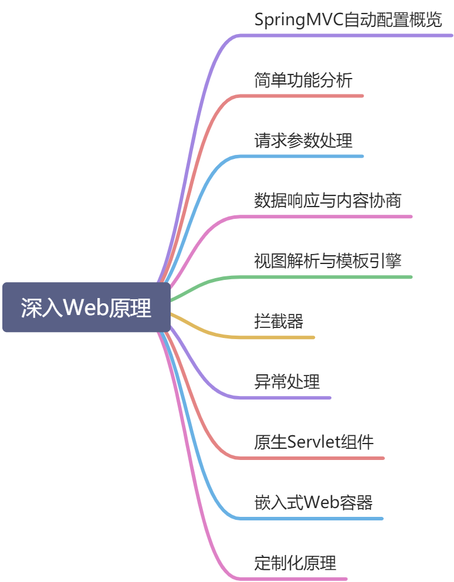
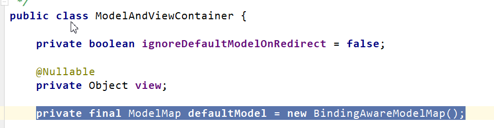
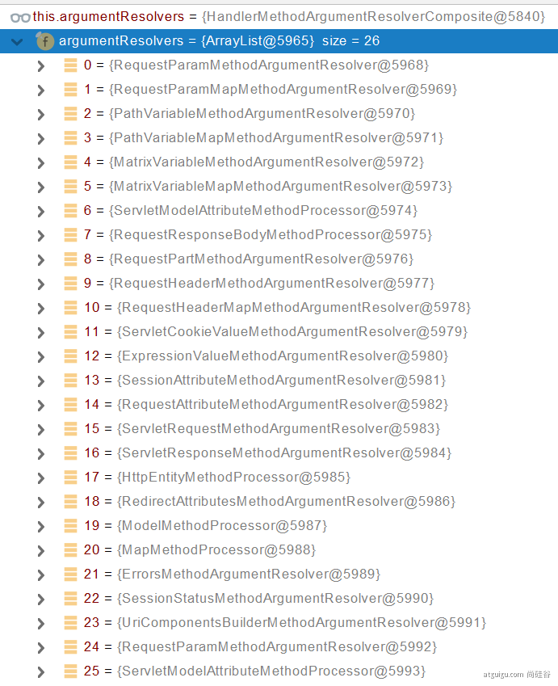
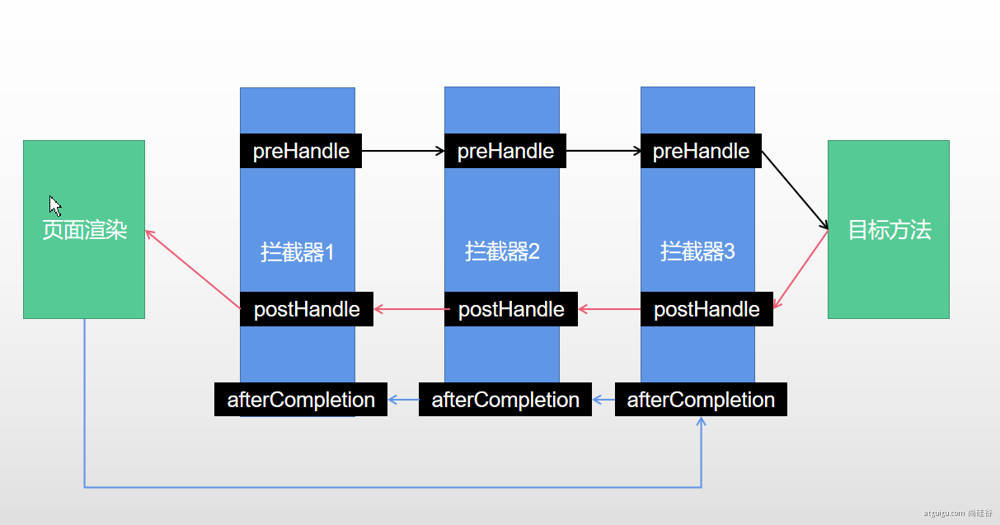
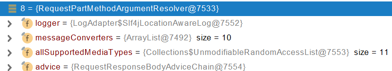
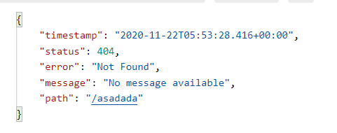
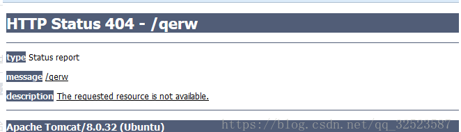
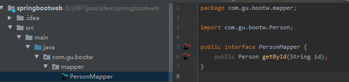
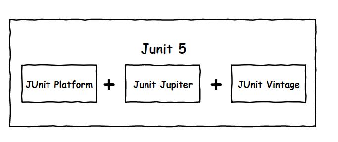

[TOC]

# 01、Spring与SpringBoot

## 1、Spring能做什么

### 1.1、Spring的能力


### 1.2、Spring的生态

https://spring.io/projects/spring-boot


覆盖了：

web开发

数据访问

安全控制

分布式

消息服务

移动开发

批处理

......

### 1.3、Spring5重大升级

#### 1.3.1、响应式编程


#### 1.3.2、内部源码设计

基于Java8的一些新特性，如：接口默认实现。重新设计源码架构。


## 2、为什么用SpringBoot


> Spring Boot makes it easy to create stand-alone, production-grade Spring based Applications that you can "just run".
>
> 
>
> 能快速创建出生产级别的Spring应用


### 2.1、SpringBoot优点

- Create stand-alone Spring applications

- - 创建独立Spring应用

- Embed Tomcat, Jetty or Undertow directly (no need to deploy WAR files)

- - 内嵌web服务器

- Provide opinionated 'starter' dependencies to simplify your build configuration

- - 自动starter依赖，简化构建配置

- Automatically configure Spring and 3rd party libraries whenever possible

- - 自动配置Spring以及第三方功能

- Provide production-ready features such as metrics, health checks, and externalized configuration

- - 提供生产级别的监控、健康检查及外部化配置

- Absolutely no code generation and no requirement for XML configuration

- - 无代码生成、无需编写XML


> SpringBoot是整合Spring技术栈的一站式框架
>
> SpringBoot是简化Spring技术栈的快速开发脚手架


### 2.2、SpringBoot缺点

- 人称版本帝，迭代快，需要时刻关注变化
- 封装太深，内部原理复杂，不容易精通

## 3、时代背景

### 3.1、微服务

[James Lewis and Martin Fowler (2014)](https://martinfowler.com/articles/microservices.html)  提出微服务完整概念。https://martinfowler.com/microservices/

> In short, the **microservice architectural style** is an approach to developing a single application as a **suite of small services**, each **running in its own process** and communicating with **lightweight** mechanisms, often an **HTTP** resource API. These services are **built around business capabilities** and **independently deployable** by fully **automated deployment** machinery. There is a **bare minimum of centralized management** of these services, which may be **written in different programming languages** and use different data storage technologies.-- [James Lewis and Martin Fowler (2014)](https://martinfowler.com/articles/microservices.html)

- 微服务是一种架构风格
- 一个应用拆分为一组小型服务
- 每个服务运行在自己的进程内，也就是可独立部署和升级
- 服务之间使用轻量级HTTP交互
- 服务围绕业务功能拆分
- 可以由全自动部署机制独立部署
- 去中心化，服务自治。服务可以使用不同的语言、不同的存储技术


## 3.2、分布式

### 分布式的困难

- 远程调用
- 服务发现
- 负载均衡
- 服务容错
- 配置管理
- 服务监控
- 链路追踪
- 日志管理
- 任务调度
- ......


### 分布式的解决

- SpringBoot + SpringCloud

- 

    

## 3.3、云原生

  原生应用如何上云。 Cloud Native

  ### 上云的困难

  - 服务自愈
  - 弹性伸缩
  - 服务隔离
  - 自动化部署
  - 灰度发布
  - 流量治理
  - ......

  ### 上云的解决


## 4、如何学习SpringBoot

### 4.1、官网文档架构


查看版本新特性；

https://github.com/spring-projects/spring-boot/wiki#release-notes


------


# 02、SpringBoot2入门

## 1、系统要求

- [Java 8](https://www.java.com/) & 兼容java14 .
- Maven 3.3+
- idea 2019.1.2


### 1.1、maven设置

```
<mirrors>
      <mirror>
        <id>nexus-aliyun</id>
        <mirrorOf>central</mirrorOf>
        <name>Nexus aliyun</name>
        <url>http://maven.aliyun.com/nexus/content/groups/public</url>
      </mirror>
  </mirrors>
 
  <profiles>
         <profile>
              <id>jdk-1.8</id>
              <activation>
                <activeByDefault>true</activeByDefault>
                <jdk>1.8</jdk>
              </activation>
              <properties>
                <maven.compiler.source>1.8</maven.compiler.source>
                <maven.compiler.target>1.8</maven.compiler.target>
                <maven.compiler.compilerVersion>1.8</maven.compiler.compilerVersion>
              </properties>
         </profile>
  </profiles>
```

## 2、HelloWorld

需求：浏览发送/hello请求，响应 Hello，Spring Boot 2 

### 2.1、创建maven工程

1. 第一步，创建一个Maven项目：创建成功后一定要点击右下角的Enable Auto Import

### 2.2、引入依赖

```xml
<parent>
    <groupId>org.springframework.boot</groupId>
    <artifactId>spring-boot-starter-parent</artifactId>
    <version>2.3.4.RELEASE</version>
</parent>

<dependencies>
    <dependency>
        <groupId>org.springframework.boot</groupId>
        <artifactId>spring-boot-starter-web</artifactId>
    </dependency>
</dependencies>
```

### 2.3、创建主程序

```java
/**
 * 主程序类
 * @SpringBootApplication：这是一个SpringBoot应用
 */
@SpringBootApplication
public class MainApplication {
    public static void main(String[] args) {
        SpringApplication.run(MainApplication.class,args);
    }
}
```

### 2.4、编写业务

```java
@RestController
public class HelloController {
    @RequestMapping("/hello")
    public String handle01(){
        return "Hello, Spring Boot 2!";
    }
}
```

### 2.5、测试

直接运行main方法


### 2.6、简化配置

application.properties

配置端口号

可以在此文件更改各种框架与组件的配置，包括tomcat，MVC等等

```
server.port=8888
```

配置：可以在application.properties文件中加入多种属性，种类如下：

[属性列表]: https://docs.spring.io/spring-boot/docs/current/reference/html/appendix-application-properties.html#common-application-properties-core


### 2.7、简化部署

部署：springboot可以通过配置添加插件，用于打包项目成所需要的格式。

在pom.xml中添加如下语句即可添加插件。

**右侧点击Maven，选择Lifecycle目录下的clean与package，然后点击运行。**

打包好的文件在Targer目录下，在资源管理器打开此目录，在路径栏里输入cmd，使用java -jar命令即可快捷运行此打包好的jar文件。

```xml
<build>
    <plugins>
        <plugin>
            <groupId>org.springframework.boot</groupId>
            <artifactId>spring-boot-maven-plugin</artifactId>
        </plugin>
    </plugins>
</build>
```


注意点：

- 取消掉cmd的快速编辑模式


------


# **03、了解自动配置原理**

##  1、SpringBoot特点


### 1.1、依赖管理

- 父项目做依赖管理：

    父项目做依赖管理：可以**声明常用的依赖以及版本号**。创建一个springboot项目时，一般都会在pom文件中写入一个parent标签从而引入一个父项目，从而也就声明了它的所有依赖，如下图。而父项目也有父项目，所以这么层层依赖之下，仅仅**依靠一个标签就可以声明几乎所有的常用依赖及其版本号**。同时，在parent标签中也定义了版本号，**spring的自动版本仲裁机制使得所有的依赖会自动选择合适的版本**。

    父项目依赖管理使得接下来引入jar包时都不需要注明版本号。

```xml
依赖管理    
<parent>
        <groupId>org.springframework.boot</groupId>
        <artifactId>spring-boot-starter-parent</artifactId>
        <version>2.3.4.RELEASE</version>
</parent>

他的父项目
 <parent>
    <groupId>org.springframework.boot</groupId>
    <artifactId>spring-boot-dependencies</artifactId>
    <version>2.3.4.RELEASE</version>
  </parent>

几乎声明了所有开发中常用的依赖的版本号,自动版本仲裁机制
```

- 开发导入starter场景启动器

    **starter场景启动器是一组依赖的集合描述，一旦引入一个启动器，相关依赖就会被引入。**

    **starter有很多，例如web、jabc、aop等等，可以在官方文档中查看。**

    https://docs.spring.io/spring-boot/docs/current/reference/html/using-spring-boot.html#using-boot-starter

```xml
1、见到很多 spring-boot-starter-* ： *就某种场景
2、只要引入starter，这个场景的所有常规需要的依赖我们都自动引入
3、SpringBoot所有支持的场景
https://docs.spring.io/spring-boot/docs/current/reference/html/using-spring-boot.html#using-boot-starter
4、见到的  *-spring-boot-starter： 第三方为我们提供的简化开发的场景启动器。
5、所有场景启动器最底层的依赖
<dependency>
  <groupId>org.springframework.boot</groupId>
  <artifactId>spring-boot-starter</artifactId>
  <version>2.3.4.RELEASE</version>
  <scope>compile</scope>
</dependency>
```

- 无需关注版本号，自动版本仲裁

```xml
1、引入依赖默认都可以不写版本
2、引入非版本仲裁的jar，要写版本号。
```

- 可以修改默认版本号

```xml
1、查看spring-boot-dependencies里面规定当前依赖的版本 用的 key。
2、在当前项目里面重写配置
    <properties>
        <mysql.version>5.1.43</mysql.version>
    </properties>
```

### 1.2、自动配置

- **自动配好Tomcat**

- - 引入Tomcat依赖。
    - 配置Tomcat

```xml
<dependency>
      <groupId>org.springframework.boot</groupId>
      <artifactId>spring-boot-starter-tomcat</artifactId>
      <version>2.3.4.RELEASE</version>
      <scope>compile</scope>
 </dependency>
```

- 自动配好SpringMVC

- - 引入SpringMVC全套组件
    - 自动配好SpringMVC常用组件（功能）

- 自动配好Web常见功能，如：字符编码问题

- - SpringBoot帮我们配置好了所有web开发的常见场景

- 默认的包结构

- - 主程序所在包及其下面的所有子包里面的组件都会被默认扫描进来
    - 无需以前的包扫描配置
    - 想要改变扫描路径，@SpringBootApplication(scanBasePackages=**"com.atguigu"**)

- - - 或者@ComponentScan 指定扫描路径

```java
@SpringBootApplication
等同于
@SpringBootConfiguration
@EnableAutoConfiguration
@ComponentScan("com.atguigu.boot")
```


- 各种配置拥有默认值

- - 默认配置最终都是映射到某个类上，如：MultipartProperties
    - 配置文件的值最终会绑定每个类上，这个类会在容器中创建对象

- 按需加载所有自动配置项

- - 非常多的starter

    - 引入了哪些场景这个场景的自动配置才会开启

    - SpringBoot所有的自动配置功能都在 spring-boot-autoconfigure 包里面

        

- ......


## 2、容器功能

### 2.1、组件添加：

​	这是容器功能，类似于spring里面的bean.xml

#### 1、@Configuration

1. 不写spring容器配置文件，使用配置类
2. 使用注解**@configuration**标明配置类
3. 注:既然是使用注解,那么自然是**配置类要在主程序所在包及其所有子包内**.
4. 注入的对象组件的id默认是方法名,可以更改，与经典Spring更改方法一样。
5. 默认是单实例。
6. 使用主程序查看容器中的对象：
7. Lite模式与Full模式：默认是Full模式，会保持组件单实例。Lite模式则类似于多实例，但是会更加快捷。

- 配置类组件之间无依赖关系就用Lite模式，加速容器启动过程，减少判断

- 配置类组件之间有依赖关系，方法会被调用得到之前单实例组件，用Full模式

- 使用Configuration注解的proxyBeanMethods属性配置两种模式，,默认是true，即Lite模式

    

Configuration使用示例：两个类,一个是配置类Myconfig,一个是测试类MainApplication

- - 

```java
/**
 * 1、配置类里面使用@Bean标注在方法上给容器注册组件，默认也是单实例的
 * 2、配置类本身也是组件
 * 3、proxyBeanMethods：代理bean的方法
 *      Full(proxyBeanMethods = true)、【保证每个@Bean方法被调用多少次返回的组件都是单实例的】
 *      Lite(proxyBeanMethods = false)【每个@Bean方法被调用多少次返回的组件都是新创建的】
 *      组件依赖必须使用Full模式默认。其他默认是否Lite模式
 */
@Configuration(proxyBeanMethods = false) //告诉SpringBoot这是一个配置类 == 配置文件
public class MyConfig {

    /**
     * Full:外部无论对配置类中的这个组件注册方法调用多少次获取的都是之前注册容器中的单实例对象
     * @return
     */
    @Bean //给容器中添加组件。以方法名作为组件的id。返回类型就是组件类型。返回的值，就是组件在容器中的实例
    public User user01(){
        User zhangsan = new User("zhangsan", 18);
        //user组件依赖了Pet组件
        zhangsan.setPet(tomcatPet());
        return zhangsan;
    }

    @Bean("tom")
    public Pet tomcatPet(){
        return new Pet("tomcat");
    }
}


################################@Configuration测试代码如下########################################
@SpringBootConfiguration
@EnableAutoConfiguration
@ComponentScan("com.atguigu.boot")
public class MainApplication {

    public static void main(String[] args) {
        //1、返回我们IOC容器
        ConfigurableApplicationContext run = SpringApplication.run(MainApplication.class, args);

        //2、查看容器里面的组件
        String[] names = run.getBeanDefinitionNames();
        for (String name : names) {
            System.out.println(name);
        }

        //3、从容器中获取组件

        Pet tom01 = run.getBean("tom", Pet.class);

        Pet tom02 = run.getBean("tom", Pet.class);

        System.out.println("组件："+(tom01 == tom02));


        //4、com.atguigu.boot.config.MyConfig$$EnhancerBySpringCGLIB$$51f1e1ca@1654a892
        MyConfig bean = run.getBean(MyConfig.class);
        System.out.println(bean);

        //如果@Configuration(proxyBeanMethods = true)代理对象调用方法。SpringBoot总会检查这个组件是否在容器中有。
        //保持组件单实例
        User user = bean.user01();
        User user1 = bean.user01();
        System.out.println(user == user1);


        User user01 = run.getBean("user01", User.class);
        Pet tom = run.getBean("tom", Pet.class);

        System.out.println("用户的宠物："+(user01.getPet() == tom));


    }
}
```


#### 2、经典注解们

@Bean、@Component、@Controller、@Service、@Repository等Spring中的经典注解也可以照常使用


#### 3、@import

@Import：导入某个类使得成为组件，也有许多强大功能，具体见网址

高级用法：https://www.bilibili.com/video/BV1gW411W7wy?p=8

- 作用：导入其它组件，效果相当于自己在配置类中加入一个新组件。
- 使用方法：写于@Configuration注解上方。
- 可以导入本项目以及依赖jar包内的任何类作为组件。
- 默认组件的名字就是全类名
- 参数是class数组
- API积累：run.getBeanNamesForType(User.c1ass)     ;依靠Bean的名字获取组件，返回值是数组。

```JAVA
 * 4、@Import({User.class, DBHelper.class})
 *      给容器中自动创建出这两个类型的组件、默认组件的名字就是全类名
 */

@Import({User.class, DBHelper.class})
@Configuration(proxyBeanMethods = false) //告诉SpringBoot这是一个配置类 == 配置文件
public class MyConfig {
}
```

#### 4、@Conditional

@Conditional注解：条件装配

1. - 作用：导入装配满足条件的组件
    - 此注解是一个体系，类似的有相当多，例如：@ConditionalOnBean表示在容器中有某个满足条件组件，@ConditionalOnMissingBean容器中没有某个满足条件组件，@ConditionalOnClass当容器中有某一个类时，等等等所有注解如下：


- 放在配置类上时表示满足条件，则此配置类生效，否则不生效，组件也不会被添加
- 放在组件上时表示满足条件才会注册添加组件否则不会
- 示例：

```java
=====================测试条件装配==========================
@Configuration(proxyBeanMethods = false) //告诉SpringBoot这是一个配置类 == 配置文件
//@ConditionalOnBean(name = "tom")
@ConditionalOnMissingBean(name = "tom")
public class MyConfig {
    /**
     * Full:外部无论对配置类中的这个组件注册方法调用多少次获取的都是之前注册容器中的单实例对象
     * @return
     */
    @Bean //给容器中添加组件。以方法名作为组件的id。返回类型就是组件类型。返回的值，就是组件在容器中的实例
    public User user01(){
        User zhangsan = new User("zhangsan", 18);
        //user组件依赖了Pet组件
        zhangsan.setPet(tomcatPet());
        return zhangsan;
    }
    @Bean("tom22")
    public Pet tomcatPet(){
        return new Pet("tomcat");
    }
}

public static void main(String[] args) {
        //1、返回我们IOC容器
        ConfigurableApplicationContext run = SpringApplication.run(MainApplication.class, args);

        //2、查看容器里面的组件
        String[] names = run.getBeanDefinitionNames();
        for (String name : names) {
            System.out.println(name);
        }

        boolean tom = run.containsBean("tom");
        System.out.println("容器中Tom组件："+tom);

        boolean user01 = run.containsBean("user01");
        System.out.println("容器中user01组件："+user01);

        boolean tom22 = run.containsBean("tom22");
        System.out.println("容器中tom22组件："+tom22);
    }
```


### 2.2、原生配置文件引入

**@ImportResource**：导入原生资源，也就是自定义的xml容器。
作用与应用场景：使用Springboot的你接手了一个使用Spring的人的项目，里面有许多Bean.xml配置文件用于导入组件，想要把xml配置文件转化为使用注解的配置类即可使用到此注解。

默认是把Bean.xml配置文件放入Resource文件夹中的

```java
======================beans.xml=========================
<?xml version="1.0" encoding="UTF-8"?>
<beans xmlns="http://www.springframework.org/schema/beans"
       xmlns:xsi="http://www.w3.org/2001/XMLSchema-instance"
       xmlns:context="http://www.springframework.org/schema/context"
       xsi:schemaLocation="http://www.springframework.org/schema/beans http://www.springframework.org/schema/beans/spring-beans.xsd http://www.springframework.org/schema/context https://www.springframework.org/schema/context/spring-context.xsd">

    <bean id="haha" class="com.atguigu.boot.bean.User">
        <property name="name" value="zhangsan"></property>
        <property name="age" value="18"></property>
    </bean>

    <bean id="hehe" class="com.atguigu.boot.bean.Pet">
        <property name="name" value="tomcat"></property>
    </bean>
</beans>
@ImportResource("classpath:beans.xml")
public class MyConfig {}

======================测试=================
        boolean haha = run.containsBean("haha");
        boolean hehe = run.containsBean("hehe");
        System.out.println("haha："+haha);//true
        System.out.println("hehe："+hehe);//true
```


### 2.3、配置绑定

**应用场景**：properties配置中有许多数据，例如数据库的url、usename，某个数据表的数据等，我们想要调用并

加载到JavaBean中去，使用传统java方法比较繁琐，可以使用SpingBoot配置绑定功能办到。


传统使用java读取properties文件中配置并应用到JavaBean中：

```java
public class getProperties {
     public static void main(String[] args) throws FileNotFoundException, IOException {
         Properties pps = new Properties();
         pps.load(new FileInputStream("a.properties"));
         Enumeration enum1 = pps.propertyNames();//得到配置文件的名字
         while(enum1.hasMoreElements()) {
             String strKey = (String) enum1.nextElement();
             String strValue = pps.getProperty(strKey);
             System.out.println(strKey + "=" + strValue);
             //封装到JavaBean。
         }
     }
 }
```


#### 1、@ConfigurationProperties

自动从配置文件中读取数据并封装如类中，使用方法如下：

1. 将**引用此信息的类加入到容器**中（使用@Component@Service@Controller@Repository），然后使用@ConfigurationProperties注解**表明使用application文件中的哪些数据**，**参数是数据的前缀**

2. 只有在容器中的组件才能使用springboot提供的功能

3. 举例：创建一个类car，用来加载文件中mycar的信息，并加入相应的注解，采用的自动注入功能，所以需要使得变量名与文件中的变量名相同：

    1. 在application配置文件中写入了mycar为前缀的数据以记录汽车相关信息。

        

    2. 创建一个类，加入容器中，注明使用配置文件中的数据前缀，加入get、set、toString方法

        ~~~ java
        /**
         * 只有在容器中的组件，才会拥有SpringBoot提供的强大功能，所以要使用注解加到容器内
         */
        @Component
        @ConfigurationProperties(prefix = "mycar")
        @Data
        @ToString
        public class Car {
            private String brand;
            private Integer price;
        }
        ~~~

    3. 测试：在Controller中加入属性car，并自动注入，然后输出


#### 2、配置生效

两个方法：

1. @EnableConfigurationProperties：使使用了 @ConfigurationProperties 注解的类生效。

使用场景：如果上述实验中Car类只是使用了 @ConfigurationProperties ，而没有被加入IOC容器中，那么在IOC容器中是无法获取到正确的绑定了配置文件数据的Car类的。这个时候就需要使用该注解**使得@ConfigurationProperties生效并自动将Car类加入到容器中去。**

应用场景：如上，如果我们使用第三方包需要配置属性，那么我们不可在第三方包上加上@Component，所以使用@EnableConfigurationProperties加在某个自定义的配置类上，即可不需要在组件上加@Component，从而开启配置属性功能，参数是类class。这时候就可以**使得第三方包里面的类使用到配置文件中的数据并且加入到容器中去。**


2. 当然，最经典的方法，使用在自定义的类上的方法就是@Component + @ConfigurationProperties。

    

## 3、自动配置原理入门

### 3.1、引导加载自动配置类

```java
@SpringBootConfiguration
@EnableAutoConfiguration
@ComponentScan(excludeFilters = { @Filter(type = FilterType.CUSTOM, classes = TypeExcludeFilter.class),
        @Filter(type = FilterType.CUSTOM, classes = AutoConfigurationExcludeFilter.class) })
public @interface SpringBootApplication{}
```

#### 1、@SpringApplication

引导加载自动配置类。一般加到MainApplication程序上，用于表明这是一个spingboot程序的主程序。它是一个复合注解，等效于@SpringBootConfiguration、@ComponentScan、@EnableAutoConfiguration三个注解的总和。

#### 2、@SpringBootConfiguration

相当于Spring里的@Configuration，表明当前类是一个配置类。

#### 3、@ComponentScan

@ComponentScan：这是一个Spring注解，指定扫描哪些包。

#### 4、@EnableAutoConfiguration

@EnableAutoConfiguration：也是一个复合注解。

```java
@AutoConfigurationPackage
@Import(AutoConfigurationImportSelector.class)
public @interface EnableAutoConfiguration {}
```

1. @AutoConfigurationPackage

自动配置包，导入一些列组件，将MainApplication 所在包下的组件类导入进来

```java
@Import(AutoConfigurationPackages.Registrar.class)  //给容器中导入一个组件
public @interface AutoConfigurationPackage {}

//利用Registrar给容器中导入一系列组件
//将指定的一个包下的所有组件导入进来？MainApplication 所在包下。
```

2. @Import(AutoConfigurationImportSelector.class)

    1、利用getAutoConfigurationEntry(annotationMetadata);给容器中**批量导入一些组件**
    2、调用List<String> configurations = getCandidateConfigurations(annotationMetadata, attributes)**获取到所有需要导入到容器中的配置类**
    3、利用工厂加载 Map<String, List<String>> loadSpringFactories(@Nullable ClassLoader classLoader)；得到所有的组件
    4、**从META-INF/spring.factories位置来加载一个文件。**
        **默认**扫描我们当前系统里面所有META-INF/spring.factories位置的文件**
        spring-boot-autoconfigure-2.3.4.RELEASE.jar包里面也有META-INF/spring.factories**

 **文件里面写死了spring-boot一启动就要给容器中加载的所有配置类**

**一共有127个组件被加载导入，但不是每一个都会生效，按需配置** 


## 3.2、按需开启自动配置项

虽然我们127个场景的所有自动配置启动的时候默认全部加载。xxxxAutoConfiguration
按照条件装配规则（@Conditional），最终会按需配置。


## 3.3、修改默认配置

修改默认配置：可以在配置类中直接配置想要自己配置的默认组件，自己配置的会使得系统默认配置时忽略此种组件，依靠的是@ConditionalMissingBean注解。

例如：如果自己配置了一个原生的数据源，容器中就会有一个DataSource类，那么springboot就不会再自动配置DataSource类。下例中，自定义配置类一个文件上传解析器，那么自动配置时就不会再次加入文件上传解析类。

```java
        @Bean
        @ConditionalOnBean(MultipartResolver.class)  //容器中有这个类型组件
        @ConditionalOnMissingBean(name = DispatcherServlet.MULTIPART_RESOLVER_BEAN_NAME) //容器中没有这个名字 multipartResolver 的组件
        public MultipartResolver multipartResolver(MultipartResolver resolver) {
            //给@Bean标注的方法传入了对象参数，这个参数的值就会从容器中找。
            //SpringMVC multipartResolver。防止有些用户配置的文件上传解析器不符合规范
            // Detect if the user has created a MultipartResolver but named it incorrectly
            return resolver;
        }
给容器中加入了文件上传解析器；
```

**SpringBoot默认会在底层配好所有的组件。但是如果用户自己配置了以用户的优先**

```java
@Bean
    @ConditionalOnMissingBean
    public CharacterEncodingFilter characterEncodingFilter() {
    }
```


## 自动配置原理入门总结

- SpringBoot先加载所有的自动配置类  xxxxxAutoConfiguration
- 每个自动配置类按照条件进行生效，默认都会绑定配置文件指定的值。xxxxProperties里面拿。xxxProperties和配置文件进行了绑定
- 生效的配置类就会给容器中装配很多组件
- 只要容器中有这些组件，相当于这些功能就有了
- 定制化配置

- - 用户直接自己@Bean替换底层的组件
    - 用户去看这个组件是获取的配置文件什么值就去修改。

<font color="red">**xxxxxAutoConfiguration ---> 组件  ---> xxxxProperties里面拿值  ----> application.properties**</font>


## 3.4、最佳实践

- 引入场景依赖

- - https://docs.spring.io/spring-boot/docs/current/reference/html/using-spring-boot.html#using-boot-starter

- 查看自动配置了哪些（选做）

- - 自己分析，引入场景对应的自动配置一般都生效了
    - 配置文件中debug=true开启自动配置报告。Negative（不生效）\Positive（生效）

- 是否需要修改

- - 参照文档修改配置项

- - - https://docs.spring.io/spring-boot/docs/current/reference/html/appendix-application-properties.html#common-application-properties
        - 自己分析。xxxxProperties绑定了配置文件的哪些。

- - 自定义加入或者替换组件

- - - @Bean、@Component。。。

- - 自定义器  **XXXXXCustomizer**；
    - ......


## 4、开发小技巧

### 4.1、Lombok

Lombok插件：安装了此插件以后，在类上加上相应注解则会在编译时生成相应的方法，不会在源代码生成，使得代码简洁好看。

```xml
<dependency>
    <groupId>org.projectlombok</groupId>
    <artifactId>lombok</artifactId>
</dependency>
```

1. ```java
    ================================简化日志开发===================================
    @Slf4j
    @RestController
    public class HelloController {
        @RequestMapping("/hello")
        public String handle01(@RequestParam("name") String name){
            
            log.info("请求进来了....");
            
            return "Hello, Spring Boot 2!"+"你好："+name;
        }
    }
    ```

2. 1. @Data：编译时生成Getter、Setter以及无参构造方法
    2. @Getter：生成get方法
    3. @Setter生成set方法
    4. @NoArgsConstructor注解：在JavaBean或类JavaBean中使用，使用此注解会生成对应的无参构造方法；
    5. @AllArgsConstructor注解：在JavaBean或类JavaBean中使用，使用此注解会生成对应的有参构造方法；
    6. @ToString注解：在JavaBean或类JavaBean中使用，使用此注解会自动重写对应的toStirng方法；
    7. @EqualsAndHashCode注解：在JavaBean或类JavaBean中使用，使用此注解会自动重写对应的equals方法和hashCode方法；
    8. @Slf4j：在需要打印日志的类中使用，当项目中使用了slf4j打印日志框架时使用该注解，会简化日志的打印流程，只需调用info方法即可；
    9. **@Log4j：在需要打印日志的类中使用，当项目中使用了log4j打印日志框架时使用该注解，会简化日志的打印流程，只需调用info方法即可；**


### 4.2、dev-tools:热部署

```java
        <dependency>
            <groupId>org.springframework.boot</groupId>
            <artifactId>spring-boot-devtools</artifactId>
            <optional>true</optional>
        </dependency>
```


项目或者页面修改以后：Ctrl+F9；


### 4.3、Spring Initailizr（项目初始化向导）

1. 新建项目---->Spring Initializr--->下一步--->Group一栏填写组织名称，Artifact填写模块名，packege填写基准包，java版本推荐选择8--->选择场景以及版本：各种启动器如spring web、mysql等--->下一步，完成（finish）--->创建成功

2. 所做的事：**创建了项目，引入了依赖，建成了项目结构，创建了配置文件，自动编写配置好主配置类**

    


------

# 04、配置文件

## 1、文件类型

### 1.1、properties

同以前的properties用法

### 1.2、yaml

#### 1.2.1、简介

YAML 是 "YAML Ain't Markup Language"（YAML 不是一种标记语言）的递归缩写。在开发的这种语言时，YAML 的意思其实是："Yet Another Markup Language"（仍是一种标记语言）。 


非常适合用来做以数据为中心的配置文件


#### 1.2.2、基本语法

- key: value；kv之间有空格
- 大小写敏感
- 使用缩进表示层级关系
- 缩进不允许使用tab，只允许空格
- 缩进的空格数不重要，只要相同层级的元素左对齐即可
- '#'表示注释
- 字符串无需加引号，如果要加，''与""表示字符串内容 会被 转义/不转义


#### 1.2.3、数据类型

- 字面量：单个的、不可再分的值。date、boolean、string、number、null

```yaml
k: v
```

- 对象：键值对的集合。map、hash、set、object 

```yaml
行内写法：  k: {k1:v1,k2:v2,k3:v3}
#或
k: 
  k1: v1
  k2: v2
  k3: v3
```

- 数组：一组按次序排列的值。array、list、queue

```yaml
行内写法：  k: [v1,v2,v3]
#或者
k:
 - v1
 - v2
 - v3
```

#### 1.2.4、示例

```java
@Data
public class Person {
    private String userName;
    private Boolean boss;
    private Date birth;
    private Integer age;
    private Pet pet;
    private String[] interests;
    private List<String> animal;
    private Map<String, Object> score;
    private Set<Double> salarys;
    private Map<String, List<Pet>> allPets;
}

@Data
public class Pet {
    private String name;
    private Double weight;
}
```


```yaml
#yaml表示以上对象
person:
  userName: zhangsan
  boss: false
  birth: 2019/12/12 20:12:33
  age: 18
  pet: 
    name: tomcat
    weight: 23.4
  interests: [篮球,游泳]
  animal: 
    - jerry
    - mario
  score:
    english: 
      first: 30
      second: 40
      third: 50
    math: [131,140,148]
    chinese: {first: 128,second: 136}
  salarys: [3999,4999.98,5999.99]
  allPets:
    sick:
      - {name: tom}
      - {name: jerry,weight: 47}
    health: [{name: mario,weight: 47}]
```


## 2、配置提示

自定义的类和配置文件绑定一般没有提示。

```xml
<dependency>
    <groupId>org.springframework.boot</groupId>
    <artifactId>spring-boot-configuration-processor</artifactId>
    <optional>true</optional>
</dependency>


<build>
    <plugins>
        <plugin>
            <groupId>org.springframework.boot</groupId>
            <artifactId>spring-boot-maven-plugin</artifactId>
            <configuration>
                <excludes>
                    <exclude>
                        <groupId>org.springframework.boot</groupId>
                        <artifactId>spring-boot-configuration-processor</artifactId>
                    </exclude>
                </excludes>
            </configuration>
        </plugin>
    </plugins>
</build>
```

------


# **05、Web开发**





## 1、SpringMVC自动配置概览

Spring Boot provides auto-configuration for Spring MVC that **works well with most applications.(大多场景我们都无需自定义配置)**

The auto-configuration adds the following features on top of Spring’s defaults:

- Inclusion of `ContentNegotiatingViewResolver` and `BeanNameViewResolver` beans.

- - 内容协商视图解析器和BeanName视图解析器

- Support for serving static resources, including support for WebJars (covered [later in this document](https://docs.spring.io/spring-boot/docs/current/reference/html/spring-boot-features.html#boot-features-spring-mvc-static-content))).

- - 静态资源（包括webjars）

- Automatic registration of `Converter`, `GenericConverter`, and `Formatter` beans.

- - 自动注册 `Converter，GenericConverter，Formatter `

- Support for `HttpMessageConverters` (covered [later in this document](https://docs.spring.io/spring-boot/docs/current/reference/html/spring-boot-features.html#boot-features-spring-mvc-message-converters)).

- - 支持 `HttpMessageConverters` （后来我们配合内容协商理解原理）

- Automatic registration of `MessageCodesResolver` (covered [later in this document](https://docs.spring.io/spring-boot/docs/current/reference/html/spring-boot-features.html#boot-features-spring-message-codes)).

- - 自动注册 `MessageCodesResolver` （国际化用）

- Static `index.html` support.

- - 静态index.html 页支持

- Custom `Favicon` support (covered [later in this document](https://docs.spring.io/spring-boot/docs/current/reference/html/spring-boot-features.html#boot-features-spring-mvc-favicon)).

- - 自定义 `Favicon`  

- Automatic use of a `ConfigurableWebBindingInitializer` bean (covered [later in this document](https://docs.spring.io/spring-boot/docs/current/reference/html/spring-boot-features.html#boot-features-spring-mvc-web-binding-initializer)).

- - 自动使用 `ConfigurableWebBindingInitializer` ，（DataBinder负责将请求数据绑定到JavaBean上）

> If you want to keep those Spring Boot MVC customizations and make more [MVC customizations](https://docs.spring.io/spring/docs/5.2.9.RELEASE/spring-framework-reference/web.html#mvc) (interceptors, formatters, view controllers, and other features), you can add your own `@Configuration` class of type `WebMvcConfigurer` but **without** `@EnableWebMvc`.
>
> **不用@EnableWebMvc注解。使用** **`@Configuration`** **+** **`WebMvcConfigurer`** **自定义规则**


> If you want to provide custom instances of `RequestMappingHandlerMapping`, `RequestMappingHandlerAdapter`, or `ExceptionHandlerExceptionResolver`, and still keep the Spring Boot MVC customizations, you can declare a bean of type `WebMvcRegistrations` and use it to provide custom instances of those components.
>
> **声明** **`WebMvcRegistrations`** **改变默认底层组件**


> If you want to take complete control of Spring MVC, you can add your own `@Configuration` annotated with `@EnableWebMvc`, or alternatively add your own `@Configuration`-annotated `DelegatingWebMvcConfiguration` as described in the Javadoc of `@EnableWebMvc`.
>
> **使用** **`@EnableWebMvc+@Configuration+DelegatingWebMvcConfiguration 全面接管SpringMVC`**


## 2、简单功能分析

### 2.1、静态资源访问

#### 1、静态资源目录

只要静态资源放在类路径下： called `/static` (or `/public` or `/resources` or `/META-INF/resources`

访问 ： 当前项目根路径/ + 静态资源名 


原理： 静态映射/**。

请求进来，先去找Controller看能不能处理。不能处理的所有请求又都交给静态资源处理器。静态资源也找不到则响应404页面

改变默认的静态资源路径

```yaml
spring:
	resources:
		static-locations: [classpath:/haha/]
```


#### 2、静态资源访问前缀

默认无前缀

```yaml
spring:
  mvc:
    static-path-pattern: /res/**
```

当前项目 + static-path-pattern + 静态资源名 = 静态资源文件夹下找


#### 3、webjar(jquery等)

web开发需要的一些静态js资源如jquery被打包成了jar包可以在maven中引入，也可以被访问。

- 自动映射 /webjars/**
- 各种webjar：https://www.webjars.org/
- maven引入Jquery：

```xml
<dependency>
    <groupId>org.webjars</groupId>
    <artifactId>jquery</artifactId>
    <version>3.5.1</version>
</dependency>
```

访问地址：[http://localhost:8080/webjars/**jquery/3.5.1/jquery.js**](http://localhost:8080/webjars/jquery/3.5.1/jquery.js)  后面地址要按照依赖里面的包路径

也就是说，写js代码时，需要写/webjars/**jquery/3.5.1/jquery.js**来引用Jquery包。


#### 4、欢迎页支持

- 静态资源路径下  index.html

- - 可以配置静态资源路径
    - 但是不可以配置静态资源的访问前缀。否则导致 index.html不能被默认访问

```yaml
spring:
#mvc:
#static-path-pattern: /res/**   这个会导致welcome page功能失效

  resources:
    static-locations: [classpath:/haha/]
```

- **controller能处理/index**


#### 5、自定义 `Favicon`

favicon.ico 放在静态资源目录下即可。

```yaml
spring:
#mvc:
#static-path-pattern: /res/**   这个会导致 Favicon 功能失效
```


#### 6、静态资源配置原理

- SpringBoot启动默认加载  xxxAutoConfiguration 类（自动配置类）
- SpringMVC功能的自动配置类为 WebMvcAutoConfiguration，生效

```java
@Configuration(proxyBeanMethods = false)
@ConditionalOnWebApplication(type = Type.SERVLET)
@ConditionalOnClass({ Servlet.class, DispatcherServlet.class, WebMvcConfigurer.class })
@ConditionalOnMissingBean(WebMvcConfigurationSupport.class)
@AutoConfigureOrder(Ordered.HIGHEST_PRECEDENCE + 10)
@AutoConfigureAfter({ DispatcherServletAutoConfiguration.class, TaskExecutionAutoConfiguration.class,
        ValidationAutoConfiguration.class })
public class WebMvcAutoConfiguration {}
```

- 给容器中配了什么。

```java
    @Configuration(proxyBeanMethods = false)
    @Import(EnableWebMvcConfiguration.class)
    @EnableConfigurationProperties({ WebMvcProperties.class, ResourceProperties.class })
    @Order(0)
    public static class WebMvcAutoConfigurationAdapter implements WebMvcConfigurer {}
```

- 配置文件的相关属性和xxx进行了绑定。WebMvcProperties==**spring.mvc**、ResourceProperties==**spring.resources**


##### 1、配置类只有一个有参构造器

```
    //有参构造器所有参数的值都会从容器中确定
//ResourceProperties resourceProperties；获取和spring.resources绑定的所有的值的对象
//WebMvcProperties mvcProperties 获取和spring.mvc绑定的所有的值的对象
//ListableBeanFactory beanFactory Spring的beanFactory
//HttpMessageConverters 找到所有的HttpMessageConverters
//ResourceHandlerRegistrationCustomizer 找到 资源处理器的自定义器。=========
//DispatcherServletPath  
//ServletRegistrationBean   给应用注册Servlet、Filter....
    public WebMvcAutoConfigurationAdapter(ResourceProperties resourceProperties, WebMvcProperties mvcProperties,
                ListableBeanFactory beanFactory, ObjectProvider<HttpMessageConverters> messageConvertersProvider,
                ObjectProvider<ResourceHandlerRegistrationCustomizer> resourceHandlerRegistrationCustomizerProvider,
                ObjectProvider<DispatcherServletPath> dispatcherServletPath,
                ObjectProvider<ServletRegistrationBean<?>> servletRegistrations) {
            this.resourceProperties = resourceProperties;
            this.mvcProperties = mvcProperties;
            this.beanFactory = beanFactory;
            this.messageConvertersProvider = messageConvertersProvider;
            this.resourceHandlerRegistrationCustomizer = resourceHandlerRegistrationCustomizerProvider.getIfAvailable();
            this.dispatcherServletPath = dispatcherServletPath;
            this.servletRegistrations = servletRegistrations;
        }
```


##### 2、资源处理的默认规则

```java
@Override
        public void addResourceHandlers(ResourceHandlerRegistry registry) {
            if (!this.resourceProperties.isAddMappings()) {
                logger.debug("Default resource handling disabled");
                return;
            }
            Duration cachePeriod = this.resourceProperties.getCache().getPeriod();
            CacheControl cacheControl = this.resourceProperties.getCache().getCachecontrol().toHttpCacheControl();
            //webjars的规则
            if (!registry.hasMappingForPattern("/webjars/**")) {
                customizeResourceHandlerRegistration(registry.addResourceHandler("/webjars/**")
                        .addResourceLocations("classpath:/META-INF/resources/webjars/")
                        .setCachePeriod(getSeconds(cachePeriod)).setCacheControl(cacheControl));
            }
            
            //
            String staticPathPattern = this.mvcProperties.getStaticPathPattern();
            if (!registry.hasMappingForPattern(staticPathPattern)) {
                customizeResourceHandlerRegistration(registry.addResourceHandler(staticPathPattern)
                        .addResourceLocations(getResourceLocations(this.resourceProperties.getStaticLocations()))
                        .setCachePeriod(getSeconds(cachePeriod)).setCacheControl(cacheControl));
            }
        }
spring:
#mvc:
#static-path-pattern: /res/**

  resources:
    add-mappings: false   禁用所有静态资源规则
@ConfigurationProperties(prefix = "spring.resources", ignoreUnknownFields = false)
public class ResourceProperties {

    private static final String[] CLASSPATH_RESOURCE_LOCATIONS = { "classpath:/META-INF/resources/",
            "classpath:/resources/", "classpath:/static/", "classpath:/public/" };

    /**
     * Locations of static resources. Defaults to classpath:[/META-INF/resources/,
     * /resources/, /static/, /public/].
     */
    private String[] staticLocations = CLASSPATH_RESOURCE_LOCATIONS;
```


##### 3、欢迎页的处理规则

```
    HandlerMapping：处理器映射。保存了每一个Handler能处理哪些请求。  

    @Bean
        public WelcomePageHandlerMapping welcomePageHandlerMapping(ApplicationContext applicationContext,
                FormattingConversionService mvcConversionService, ResourceUrlProvider mvcResourceUrlProvider) {
            WelcomePageHandlerMapping welcomePageHandlerMapping = new WelcomePageHandlerMapping(
                    new TemplateAvailabilityProviders(applicationContext), applicationContext, getWelcomePage(),
                    this.mvcProperties.getStaticPathPattern());
            welcomePageHandlerMapping.setInterceptors(getInterceptors(mvcConversionService, mvcResourceUrlProvider));
            welcomePageHandlerMapping.setCorsConfigurations(getCorsConfigurations());
            return welcomePageHandlerMapping;
        }

    WelcomePageHandlerMapping(TemplateAvailabilityProviders templateAvailabilityProviders,
            ApplicationContext applicationContext, Optional<Resource> welcomePage, String staticPathPattern) {
        if (welcomePage.isPresent() && "/**".equals(staticPathPattern)) {
            //要用欢迎页功能，必须是/**
            logger.info("Adding welcome page: " + welcomePage.get());
            setRootViewName("forward:index.html");
        }
        else if (welcomeTemplateExists(templateAvailabilityProviders, applicationContext)) {
            // 调用Controller  /index
            logger.info("Adding welcome page template: index");
            setRootViewName("index");
        }
    }
```


## 3、请求参数处理

### 1、rest使用与原理

- @xxxMapping；
- Rest风格支持（*使用**HTTP**请求方式动词来表示对资源的操作*）

- - *以前：**/getUser*  *获取用户*   */deleteUser* *删除用户*   */editUser*  *修改用户*    */saveUser* *保存用户*
    - *现在： /user*   *GET-**获取用户*   *DELETE-**删除用户*   *PUT-**修改用户*    *POST-**保存用户*
    - 核心Filter；HiddenHttpMethodFilter

- - - 用法： 表单method=post，隐藏域 _method=put
        - SpringBoot中手动开启

- - 扩展：如何把_method 这个名字换成我们自己喜欢的。

```java
    @RequestMapping(value = "/user",method = RequestMethod.GET)
    public String getUser(){
        return "GET-张三";
    }

    @RequestMapping(value = "/user",method = RequestMethod.POST)
    public String saveUser(){
        return "POST-张三";
    }


    @RequestMapping(value = "/user",method = RequestMethod.PUT)
    public String putUser(){
        return "PUT-张三";
    }

    @RequestMapping(value = "/user",method = RequestMethod.DELETE)
    public String deleteUser(){
        return "DELETE-张三";
    }


    @Bean
    @ConditionalOnMissingBean(HiddenHttpMethodFilter.class)
    @ConditionalOnProperty(prefix = "spring.mvc.hiddenmethod.filter", name = "enabled", matchIfMissing = false)
    public OrderedHiddenHttpMethodFilter hiddenHttpMethodFilter() {
        return new OrderedHiddenHttpMethodFilter();
    }


//自定义filter
    @Bean
    public HiddenHttpMethodFilter hiddenHttpMethodFilter(){
        HiddenHttpMethodFilter methodFilter = new HiddenHttpMethodFilter();
        methodFilter.setMethodParam("_m");
        return methodFilter;
    }
```

Rest原理（表单提交要使用REST的时候）

- 表单提交会带上**_method=PUT**
- **请求过来被**HiddenHttpMethodFilter拦截

- - 请求是否正常，并且是POST

- - - 获取到**_method**的值。
        - 兼容以下请求；**PUT**.**DELETE**.**PATCH**
        - **原生request（post），包装模式requesWrapper重写了getMethod方法，返回的是传入的值。**
        - **过滤器链放行的时候用wrapper。以后的方法调用getMethod是调用****requesWrapper的。**

**
**

**Rest使用客户端工具，**

- 如PostMan直接发送Put、delete等方式请求，无需Filter。


```
spring:
  mvc:
    hiddenmethod:
      filter:
        enabled: true   #开启页面表单的Rest功能
```

### 2、请求映射原理


SpringMVC功能分析都从 org.springframework.web.servlet.DispatcherServlet-》doDispatch（）


```
protected void doDispatch(HttpServletRequest request, HttpServletResponse response) throws Exception {
        HttpServletRequest processedRequest = request;
        HandlerExecutionChain mappedHandler = null;
        boolean multipartRequestParsed = false;

        WebAsyncManager asyncManager = WebAsyncUtils.getAsyncManager(request);

        try {
            ModelAndView mv = null;
            Exception dispatchException = null;

            try {
                processedRequest = checkMultipart(request);
                multipartRequestParsed = (processedRequest != request);

                // 找到当前请求使用哪个Handler（Controller的方法）处理
                mappedHandler = getHandler(processedRequest);
                
                //HandlerMapping：处理器映射。/xxx->>xxxx
```


**RequestMappingHandlerMapping**：保存了所有@RequestMapping 和handler的映射规则。


所有的请求映射都在HandlerMapping中。


- SpringBoot自动配置欢迎页的 WelcomePageHandlerMapping 。访问 /能访问到index.html；
- SpringBoot自动配置了默认 的 RequestMappingHandlerMapping
- 请求进来，挨个尝试所有的HandlerMapping看是否有请求信息。

- - 如果有就找到这个请求对应的handler
    - 如果没有就是下一个 HandlerMapping

- 我们需要一些自定义的映射处理，我们也可以自己给容器中放**HandlerMapping**。自定义 **HandlerMapping**

```
    protected HandlerExecutionChain getHandler(HttpServletRequest request) throws Exception {
        if (this.handlerMappings != null) {
            for (HandlerMapping mapping : this.handlerMappings) {
                HandlerExecutionChain handler = mapping.getHandler(request);
                if (handler != null) {
                    return handler;
                }
            }
        }
        return null;
    }
```


### 3、普通参数与基本注解

#### 3.1、常用注解

1. @Pathvariable（路径变量）：**无参且对应变量为Map类型时，意思是把所有的参数放入遍历map中**，其他注解类似。

    

1. @RequestHeader（获取请求头)：带参数为获取某一个参数，不带表示获取所有参数


3. @RequestParam（获取请求参数)：对应变量可以是List即获取同名的参数自动组成一个集合


4. @cookievalue（获取cookie值）：类似

5. @RequestAttribute（获取request域中的数据）：不可以向上述一样，通过无参时变量为map将所有数据封装到一个map类型变量中。
    	1. 先在域中放入了数据：
     	2. 通过注解与原生Sevlat都可以取出域中的数据


6. @RequestBody（获取请求体）：Post请求才有请求体，多用于类似于账号密码这样的表单提交
    


7. @MatrixVariable（矩阵变量）：url通过/path;k1=v1;k2=v2;k3=v31,v32,v33这样的形式传递矩阵变量参数

需要打开矩阵变量功能才可以正常使用


 

 

8. 转发：


#### 3.2、Servlet API：

1. WebRequest、ServletRequest、MultipartRequest、HttpSession、javax.servlet.http.PushBuilder、Principal、InputStream、Reader、HttpMethod、Locale、TimeZone、ZoneId

 

2. Map、Model（map、model里面的数据会被放在request的请求域 request.setAttribute）、Errors/BindingResult、RedirectAttributes（ 重定向携带数据）、ServletResponse（response）、SessionStatus、UriComponentsBuilder、ServletUriComponentsBuilder


**ServletRequestMethodArgumentResolver  以上的部分参数**

```java
@Override
    public boolean supportsParameter(MethodParameter parameter) {
        Class<?> paramType = parameter.getParameterType();
        return (WebRequest.class.isAssignableFrom(paramType) ||
                ServletRequest.class.isAssignableFrom(paramType) ||
                MultipartRequest.class.isAssignableFrom(paramType) ||
                HttpSession.class.isAssignableFrom(paramType) ||
                (pushBuilder != null && pushBuilder.isAssignableFrom(paramType)) ||
                Principal.class.isAssignableFrom(paramType) ||
                InputStream.class.isAssignableFrom(paramType) ||
                Reader.class.isAssignableFrom(paramType) ||
                HttpMethod.class == paramType ||
                Locale.class == paramType ||
                TimeZone.class == paramType ||
                ZoneId.class == paramType);
    }
```


#### 3.3、复杂参数

**Map**、**Model（map、model里面的数据会被放在request的请求域  request.setAttribute）、**Errors/BindingResult、**RedirectAttributes（ 重定向携带数据）**、**ServletResponse（response）**、SessionStatus、UriComponentsBuilder、ServletUriComponentsBuilder

```java
Map<String,Object> map,  Model model, HttpServletRequest request 都是可以给request域中放数据，
request.getAttribute();
```

**Map、Model类型的参数**，会返回 mavContainer.getModel（）；---> BindingAwareModelMap 是Model 也是Map

**mavContainer**.getModel(); 获取到值的



 


#### 3.4、自定义对象参数：

可以自动类型转换与格式化，可以级联封装。

```java
/**
 *     姓名： <input name="userName"/> <br/>
 *     年龄： <input name="age"/> <br/>
 *     生日： <input name="birth"/> <br/>
 *     宠物姓名：<input name="pet.name"/><br/>
 *     宠物年龄：<input name="pet.age"/>
 */
@Data
public class Person {
    
    private String userName;
    private Integer age;
    private Date birth;
    private Pet pet;
    
}

@Data
public class Pet {

    private String name;
    private String age;

}

result
```


#### 3.5、POJO封装过程

- **ServletModelAttributeMethodProcessor**


#### 3.6、参数处理原理

- HandlerMapping中找到能处理请求的Handler（Controller.method()）
- 为当前Handler 找一个适配器 HandlerAdapter； **RequestMappingHandlerAdapter**
- 适配器执行目标方法并确定方法参数的每一个值

1. HandlerAdapter


0 - 支持方法上标注@RequestMapping 

1 - 支持函数式编程的

xxxxxx

2. 执行目标方法

```java
// Actually invoke the handler.
//DispatcherServlet -- doDispatch
mv = ha.handle(processedRequest, response, mappedHandler.getHandler());
mav = invokeHandlerMethod(request, response, handlerMethod); //执行目标方法


//ServletInvocableHandlerMethod
Object returnValue = invokeForRequest(webRequest, mavContainer, providedArgs);
//获取方法的参数值
Object[] args = getMethodArgumentValues(request, mavContainer, providedArgs);
```

3. 参数解析器-HandlerMethodArgumentResolver

确定将要执行的目标方法的每一个参数的值是什么;

SpringMVC目标方法能写多少种参数类型。取决于参数解析器。




- 当前解析器是否支持解析这种参数
- 支持就调用 resolveArgument


4. 返回值处理器


5. 如何确定目标方法每一个参数的值

```
============InvocableHandlerMethod==========================
protected Object[] getMethodArgumentValues(NativeWebRequest request, @Nullable ModelAndViewContainer mavContainer,
            Object... providedArgs) throws Exception {

        MethodParameter[] parameters = getMethodParameters();
        if (ObjectUtils.isEmpty(parameters)) {
            return EMPTY_ARGS;
        }

        Object[] args = new Object[parameters.length];
        for (int i = 0; i < parameters.length; i++) {
            MethodParameter parameter = parameters[i];
            parameter.initParameterNameDiscovery(this.parameterNameDiscoverer);
            args[i] = findProvidedArgument(parameter, providedArgs);
            if (args[i] != null) {
                continue;
            }
            if (!this.resolvers.supportsParameter(parameter)) {
                throw new IllegalStateException(formatArgumentError(parameter, "No suitable resolver"));
            }
            try {
                args[i] = this.resolvers.resolveArgument(parameter, mavContainer, request, this.dataBinderFactory);
            }
            catch (Exception ex) {
                // Leave stack trace for later, exception may actually be resolved and handled...
                if (logger.isDebugEnabled()) {
                    String exMsg = ex.getMessage();
                    if (exMsg != null && !exMsg.contains(parameter.getExecutable().toGenericString())) {
                        logger.debug(formatArgumentError(parameter, exMsg));
                    }
                }
                throw ex;
            }
        }
        return args;
    }
```

6. 挨个判断所有参数解析器那个支持解析这个参数

```
    @Nullable
    private HandlerMethodArgumentResolver getArgumentResolver(MethodParameter parameter) {
        HandlerMethodArgumentResolver result = this.argumentResolverCache.get(parameter);
        if (result == null) {
            for (HandlerMethodArgumentResolver resolver : this.argumentResolvers) {
                if (resolver.supportsParameter(parameter)) {
                    result = resolver;
                    this.argumentResolverCache.put(parameter, result);
                    break;
                }
            }
        }
        return result;
    }
```

7. 解析这个参数的值

```java
调用各自 HandlerMethodArgumentResolver 的 resolveArgument 方法即可
```

8. 自定义类型参数 封装POJO

**ServletModelAttributeMethodProcessor  这个参数处理器支持**

 **是否为简单类型。**

```java
public static boolean isSimpleValueType(Class<?> type) {
        return (Void.class != type && void.class != type &&
                (ClassUtils.isPrimitiveOrWrapper(type) ||
                Enum.class.isAssignableFrom(type) ||
                CharSequence.class.isAssignableFrom(type) ||
                Number.class.isAssignableFrom(type) ||
                Date.class.isAssignableFrom(type) ||
                Temporal.class.isAssignableFrom(type) ||
                URI.class == type ||
                URL.class == type ||
                Locale.class == type ||
                Class.class == type));
    }
@Override
    @Nullable
    public final Object resolveArgument(MethodParameter parameter, @Nullable ModelAndViewContainer mavContainer,
            NativeWebRequest webRequest, @Nullable WebDataBinderFactory binderFactory) throws Exception {

        Assert.state(mavContainer != null, "ModelAttributeMethodProcessor requires ModelAndViewContainer");
        Assert.state(binderFactory != null, "ModelAttributeMethodProcessor requires WebDataBinderFactory");

        String name = ModelFactory.getNameForParameter(parameter);
        ModelAttribute ann = parameter.getParameterAnnotation(ModelAttribute.class);
        if (ann != null) {
            mavContainer.setBinding(name, ann.binding());
        }

        Object attribute = null;
        BindingResult bindingResult = null;

        if (mavContainer.containsAttribute(name)) {
            attribute = mavContainer.getModel().get(name);
        }
        else {
            // Create attribute instance
            try {
                attribute = createAttribute(name, parameter, binderFactory, webRequest);
            }
            catch (BindException ex) {
                if (isBindExceptionRequired(parameter)) {
                    // No BindingResult parameter -> fail with BindException
                    throw ex;
                }
                // Otherwise, expose null/empty value and associated BindingResult
                if (parameter.getParameterType() == Optional.class) {
                    attribute = Optional.empty();
                }
                bindingResult = ex.getBindingResult();
            }
        }

        if (bindingResult == null) {
            // Bean property binding and validation;
            // skipped in case of binding failure on construction.
            WebDataBinder binder = binderFactory.createBinder(webRequest, attribute, name);
            if (binder.getTarget() != null) {
                if (!mavContainer.isBindingDisabled(name)) {
                    bindRequestParameters(binder, webRequest);
                }
                validateIfApplicable(binder, parameter);
                if (binder.getBindingResult().hasErrors() && isBindExceptionRequired(binder, parameter)) {
                    throw new BindException(binder.getBindingResult());
                }
            }
            // Value type adaptation, also covering java.util.Optional
            if (!parameter.getParameterType().isInstance(attribute)) {
                attribute = binder.convertIfNecessary(binder.getTarget(), parameter.getParameterType(), parameter);
            }
            bindingResult = binder.getBindingResult();
        }

        // Add resolved attribute and BindingResult at the end of the model
        Map<String, Object> bindingResultModel = bindingResult.getModel();
        mavContainer.removeAttributes(bindingResultModel);
        mavContainer.addAllAttributes(bindingResultModel);

        return attribute;
    }
```


**WebDataBinder binder = binderFactory.createBinder(webRequest, attribute, name);**

**WebDataBinder :web数据绑定器，将请求参数的值绑定到指定的JavaBean里面**

**WebDataBinder 利用它里面的 Converters 将请求数据转成指定的数据类型。再次封装到JavaBean中**

**
**

**GenericConversionService：在设置每一个值的时候，找它里面的所有converter那个可以将这个数据类型（request带来参数的字符串）转换到指定的类型（JavaBean -- Integer）**

**byte -- > file**

**
**

@FunctionalInterface**public interface** Converter<S, T>

 


未来我们可以给WebDataBinder里面放自己的Converter；

**private static final class** StringToNumber<T **extends** Number> **implements** Converter<String, T>


自定义 Converter

```java
    //1、WebMvcConfigurer定制化SpringMVC的功能
    @Bean
    public WebMvcConfigurer webMvcConfigurer(){
        return new WebMvcConfigurer() {
            @Override
            public void configurePathMatch(PathMatchConfigurer configurer) {
                UrlPathHelper urlPathHelper = new UrlPathHelper();
                // 不移除；后面的内容。矩阵变量功能就可以生效
                urlPathHelper.setRemoveSemicolonContent(false);
                configurer.setUrlPathHelper(urlPathHelper);
            }

            @Override
            public void addFormatters(FormatterRegistry registry) {
                registry.addConverter(new Converter<String, Pet>() {

                    @Override
                    public Pet convert(String source) {
                        // 啊猫,3
                        if(!StringUtils.isEmpty(source)){
                            Pet pet = new Pet();
                            String[] split = source.split(",");
                            pet.setName(split[0]);
                            pet.setAge(Integer.parseInt(split[1]));
                            return pet;
                        }
                        return null;
                    }
                });
            }
        };
    }
```


### 4、源码小总结

通过看源码自定义组件内容与规则个人理解：

首先找到这个规则所在的组件，以及它的位置与名称，然后通过在自己的配置类里面添加上一个新的相同组件，并在这个组件内重写要自定义的规则即可。

此处拿Web开发时的组件Web组件举例：webMvcConfigurer是预加载的组件，我们重写或者说覆盖它，在自己的配置类中加入此自定义的组件即可。

------


## 4、数据响应与内容协商


### 1、响应JSON

#### 1.1、jackson.jar+@ResponseBody

默认使用jackson对进行json解析。

对于jackson.jar，web场景自动引入了其jar包，不需要额外引入。

配合@ResponseBody可以使得返回对象、数组等数据时自动转换为Json字符串。

```xml
        <dependency>
            <groupId>org.springframework.boot</groupId>
            <artifactId>spring-boot-starter-web</artifactId>
        </dependency>
web场景自动引入了json场景
    <dependency>
      <groupId>org.springframework.boot</groupId>
      <artifactId>spring-boot-starter-json</artifactId>
      <version>2.3.4.RELEASE</version>
      <scope>compile</scope>
    </dependency>
```


**1、返回值解析器**


```java
try {
            this.returnValueHandlers.handleReturnValue(
                    returnValue, getReturnValueType(returnValue), mavContainer, webRequest);
        }
    @Override
    public void handleReturnValue(@Nullable Object returnValue, MethodParameter returnType,
            ModelAndViewContainer mavContainer, NativeWebRequest webRequest) throws Exception {

        HandlerMethodReturnValueHandler handler = selectHandler(returnValue, returnType);
        if (handler == null) {
            throw new IllegalArgumentException("Unknown return value type: " + returnType.getParameterType().getName());
        }
        handler.handleReturnValue(returnValue, returnType, mavContainer, webRequest);
    }
RequestResponseBodyMethodProcessor      
@Override
    public void handleReturnValue(@Nullable Object returnValue, MethodParameter returnType,
            ModelAndViewContainer mavContainer, NativeWebRequest webRequest)
            throws IOException, HttpMediaTypeNotAcceptableException, HttpMessageNotWritableException {

        mavContainer.setRequestHandled(true);
        ServletServerHttpRequest inputMessage = createInputMessage(webRequest);
        ServletServerHttpResponse outputMessage = createOutputMessage(webRequest);

        // Try even with null return value. ResponseBodyAdvice could get involved.
        // 使用消息转换器进行写出操作
        writeWithMessageConverters(returnValue, returnType, inputMessage, outputMessage);
    }
```


**2、返回值解析器原理**


1. 返回值处理器判断是否支持这种类型返回值 supportsReturnType

2. 返回值处理器调用 handleReturnValue 进行处理

3. RequestResponseBodyMethodProcessor 可以处理**返回值标了@ResponseBody 注解的。**

4. 利用 MessageConverters 进行处理 将数据写为json

5. 内容协商（浏览器默认会以请求头的方式告诉服务器他能接受什么样的内容类型）
    1. 服务器最终根据自己自身的能力，决定服务器能生产出什么样内容类型的数据，
    2. SpringMVC会挨个遍历所有容器底层的 HttpMessageConverter ，看谁能处理？
    3. 得到MappingJackson2HttpMessageConverter可以将对象写为json
    4. 利用MappingJackson2HttpMessageConverter将对象转为json再写出去。


#### 1.2、SpringMVC到底支持哪些返回值

```html
ModelAndView
Model
View
ResponseEntity 
ResponseBodyEmitter
StreamingResponseBody
HttpEntity
HttpHeaders
Callable
DeferredResult
ListenableFuture
CompletionStage
WebAsyncTask
有 @ModelAttribute 且为对象类型的
@ResponseBody 注解 ---> RequestResponseBodyMethodProcessor；
```

#### 1.3、HTTPMessageConverter原理

 1、MessageConverter规范


HttpMessageConverter: 看是否支持将 此 Class类型的对象，转为MediaType类型的数据。

例子：Person对象转为JSON。或者 JSON转为Person


2、默认的MessageConverter


0 - 只支持Byte类型的

1 - String

2 - String

3 - Resource

4 - ResourceRegion

5 - DOMSource.**class \** SAXSource.**class**) \ StAXSource.**class \**StreamSource.**class \**Source.**class**

**6 -** MultiValueMap

7 - **true** 

**8 - true**

**9 - 支持注解方式xml处理的。**


最终 MappingJackson2HttpMessageConverter  把对象转为JSON（利用底层的jackson的objectMapper转换的）


### 2、内容协商

根据客户端接收能力不同，返回不同媒体类型的数据。

#### 2.1、引入xml依赖

```
 <dependency>
            <groupId>com.fasterxml.jackson.dataformat</groupId>
            <artifactId>jackson-dataformat-xml</artifactId>
</dependency>
```

#### 2.2、postman分别测试返回json和xml

只需要改变请求头中Accept字段。Http协议中规定的，告诉服务器本客户端可以接收的数据类型。


#### 2.3、开启浏览器参数方式内容协商功能

为了方便内容协商，开启基于请求参数的内容协商功能。

```yaml
spring:
    contentnegotiation:
      favor-parameter: true  #开启请求参数内容协商模式
```

发请求： http://localhost:8080/test/person?format=json

[http://localhost:8080/test/person?format=](http://localhost:8080/test/person?format=json)xml


确定客户端接收什么样的内容类型；

1、Parameter策略优先确定是要返回json数据（获取请求头中的format的值）


2、最终进行内容协商返回给客户端json即可。

#### 2.4、内容协商原理

- 1、判断当前响应头中是否已经有确定的媒体类型。MediaType
- **2、获取客户端（PostMan、浏览器）支持接收的内容类型。（获取客户端Accept请求头字段）【application/xml】**

- - **contentNegotiationManager 内容协商管理器 默认使用基于请求头的策略**
    - ****
    - **HeaderContentNegotiationStrategy  确定客户端可以接收的内容类型** 
    - ****

- 3、遍历循环所有当前系统的 **MessageConverter**，看谁支持操作这个对象（Person）
- 4、找到支持操作Person的converter，把converter支持的媒体类型统计出来。
- 5、客户端需要【application/xml】。服务端能力【10种、json、xml】
-    
- 6、进行内容协商的最佳匹配媒体类型
- 7、用 支持 将对象转为 最佳匹配媒体类型 的converter。调用它进行转化 。


导入了jackson处理xml的包，xml的converter就会自动进来

```java
WebMvcConfigurationSupport
jackson2XmlPresent = ClassUtils.isPresent("com.fasterxml.jackson.dataformat.xml.XmlMapper", classLoader);

if (jackson2XmlPresent) {
            Jackson2ObjectMapperBuilder builder = Jackson2ObjectMapperBuilder.xml();
            if (this.applicationContext != null) {
                builder.applicationContext(this.applicationContext);
            }
            messageConverters.add(new MappingJackson2XmlHttpMessageConverter(builder.build()));
        }
```


#### 2.5、自定义 MessageConverter

**实现多协议数据兼容。json、xml、x-guigu**

**0、**@ResponseBody 响应数据出去 调用 **RequestResponseBodyMethodProcessor** 处理

1、Processor 处理方法返回值。通过 **MessageConverter** 处理

2、所有 **MessageConverter** 合起来可以支持各种媒体类型数据的操作（读、写）

3、内容协商找到最终的 **messageConverter**；


SpringMVC的什么功能。一个入口给容器中添加一个  WebMvcConfigurer

```
 @Bean
    public WebMvcConfigurer webMvcConfigurer(){
        return new WebMvcConfigurer() {

            @Override
            public void extendMessageConverters(List<HttpMessageConverter<?>> converters) {

            }
        }
    }
```


**有可能我们添加的自定义的功能会覆盖默认很多功能，导致一些默认的功能失效。**

**大家考虑，上述功能除了我们完全自定义外？SpringBoot有没有为我们提供基于配置文件的快速修改媒体类型功能？怎么配置呢？【提示：参照SpringBoot官方文档web开发内容协商章节】**


## 5、视图解析与模板引擎

视图解析：**SpringBoot默认不支持 JSP，需要引入第三方模板引擎技术实现页面渲染。**

### 1、视图解析


#### 1、视图解析原理流程

1、目标方法处理的过程中，所有数据都会被放在 **ModelAndViewContainer 里面。包括数据和视图地址**

**2、方法的参数是一个自定义类型对象（从请求参数中确定的），把他重新放在** **ModelAndViewContainer** 

**3、任何目标方法执行完成以后都会返回 ModelAndView（****数据和视图地址****）。**

**4、****processDispatchResult  处理派发结果（页面改如何响应）**

- 1、**render**(**mv**, request, response); 进行页面渲染逻辑

- - 1、根据方法的String返回值得到 **View** 对象【定义了页面的渲染逻辑】

- - - 1、所有的视图解析器尝试是否能根据当前返回值得到**View**对象
        - 2、得到了  **redirect:/main.html** --> Thymeleaf new **RedirectView**()
        - 3、ContentNegotiationViewResolver 里面包含了下面所有的视图解析器，内部还是利用下面所有视图解析器得到视图对象。
        - 4、view.render(mv.getModelInternal(), request, response);  视图对象调用自定义的render进行页面渲染工作

- - - - **RedirectView 如何渲染【重定向到一个页面】**
            - **1、获取目标url地址**
                - **2、****response.sendRedirect(encodedURL);**


**视图解析：**

- - **返回值以 forward: 开始： new InternalResourceView(forwardUrl); -->  转发****request.getRequestDispatcher(path).forward(request, response);** 
    - **返回值以** **redirect: 开始：** **new RedirectView() --》 render就是重定向** 
    - **返回值是普通字符串： new ThymeleafView（）--->** 


自定义视图解析器+自定义视图； **大厂学院。**


### 2、模板引擎-Thymeleaf

#### 1、thymeleaf简介

Thymeleaf is a modern server-side Java template engine for both web and standalone environments, capable of processing HTML, XML, JavaScript, CSS and even plain text.

**现代化、服务端Java模板引擎**


#### 2、基本语法

**1、表达式**

| 表达式名字 | 语法   | 用途                               |
| ---------- | ------ | ---------------------------------- |
| 变量取值   | ${...} | 获取请求域、session域、对象等值    |
| 选择变量   | *{...} | 获取上下文对象值                   |
| 消息       | #{...} | 获取国际化等值                     |
| 链接       | @{...} | 生成链接                           |
| 片段表达式 | ~{...} | jsp:include 作用，引入公共页面片段 |

**2、字面量**

文本值: **'one text'** **,** **'Another one!'** **,…**数字: **0** **,** **34** **,** **3.0** **,** **12.3** **,…**布尔值: **true** **,** **false**

空值: **null**

变量： one，two，.... 变量不能有空格

**3、文本操作**

字符串拼接: **+**

变量替换: **|The name is ${name}|** 

 **4、数学运算**

运算符: + , - , * , / , %

**5、布尔运算**

运算符:  **and** **,** **or**

一元运算: **!** **,** **not** 

**
**

**6、比较运算**

比较: **>** **,** **<** **,** **>=** **,** **<=** **(** **gt** **,** **lt** **,** **ge** **,** **le** **)**等式: **==** **,** **!=** **(** **eq** **,** **ne** **)** 

**7、条件运算**

If-then: **(if) ? (then)**

If-then-else: **(if) ? (then) : (else)**

Default: (value) **?: (defaultvalue)** 

**8、特殊操作**

无操作： _


#### 3、设置属性值-th:attr

设置单个值

```html
<form action="subscribe.html" th:attr="action=@{/subscribe}">
  <fieldset>
    <input type="text" name="email" />
    <input type="submit" value="Subscribe!" th:attr="value=#{subscribe.submit}"/>
  </fieldset>
</form>
```

设置多个值

```html

```


以上两个的代替写法 th:xxxx

```html
<input type="submit" value="Subscribe!" th:value="#{subscribe.submit}"/>
<form action="subscribe.html" th:action="@{/subscribe}">
```


所有h5兼容的标签写法

https://www.thymeleaf.org/doc/tutorials/3.0/usingthymeleaf.html#setting-value-to-specific-attributes


#### 4、迭代

```html
<tr th:each="prod : ${prods}">
        <td th:text="${prod.name}">Onions</td>
        <td th:text="${prod.price}">2.41</td>
        <td th:text="${prod.inStock}? #{true} : #{false}">yes</td>
</tr>
```


```html
<tr th:each="prod,iterStat : ${prods}" th:class="${iterStat.odd}? 'odd'">
  <td th:text="${prod.name}">Onions</td>
  <td th:text="${prod.price}">2.41</td>
  <td th:text="${prod.inStock}? #{true} : #{false}">yes</td>
</tr>
```


#### 5、条件运算

```html
<a href="comments.html"
th:href="@{/product/comments(prodId=${prod.id})}"
th:if="${not #lists.isEmpty(prod.comments)}">view</a>
```


```html
<div th:switch="${user.role}">
  <p th:case="'admin'">User is an administrator</p>
  <p th:case="#{roles.manager}">User is a manager</p>
  <p th:case="*">User is some other thing</p>
</div>
```


#### 6、属性优先级


#### 7、使用Thymeleaf抽取公共页面：

1. 1. 例如，把所有可以抽取的页面元素a,b,c,d等放在同一个html文件内命名为footer.html，被称为模版，并不要求abcd会被同时放到同一个实际页面，可以被分开使用。

    2. 使用th:fragment来对公共元素进行标记

    3. 使用th:insert=~{templatename::selector}来使用公共元素。templatename是存放公共元素的html文件名，selector是元素的标记名。insert可以替换成replace、include。

    4. 片段表达式有三种写法：

    5. 1. 第一种：~{templatename::selector}  ：使用模版中的某个元素，最普通与常用的写法。
        2. 第二种：~{templatename}  使用完整的模版。
        3. 第三种：~{::selector}"或"~{this::selector}"  从同一模板插入一个片段，与匹配selector。如果在出现表达式的模板上未找到，则将模板调用（插入）的堆栈遍历到原始处理的模板（root），直到selector在某个级别上匹配为止。即自动匹配，优先同一模版。

    6. foot.html包含以下语句：

![html>  <html xmlns : th="http://www _ thymeleaf_org">  <body>  <dtv th: fragment:"  &copy; 2911 The Good Thymes Virtual Grocery ](data:image/png;base64,iVBORw0KGgoAAAANSUhEUgAAAZ8AAAEFCAIAAACzfX3mAAAAAXNSR0IArs4c6QAAAARnQU1BAACxjwv8YQUAAAAJcEhZcwAADsMAAA7DAcdvqGQAACJwSURBVHhe7d0NbFNXoifw0207Ty3xTN1miDZLXGGahRFDYOpAEYxAfgQQaildqkD6Fk0VymcbpWhHSxdUj6LxCDRII9GIDuUr0VTRjCFb1NBBFSGtBXogCkkfhGEbXsApThQpTIo766R96kxXe76ufW3fa187tmOf/H+y4N7j6+vr+/H3+XDsh1wuFwEAUM5/kv8DAKgF6QYAakK6AYCakG4AoCakGwCoCWOmpp5bat/69H8c++O3n8mCzDz85r88Nc/GJ4e+3nL2Oz4FADmXtXRLyALdVU3IN3/5qvHS93JGLPzTR/nk32+eDr3zVz7JbXh++qoZYlLc9YNfbX/CIQoiwuFj//bI1mWP6B/L1/mPziPhe9GVM8GL93/9BZ/68WPN622P80khepeRLKWbxF4XQboB5E9uW6Y01LYcub/lyFd3n37q+PM/kKU/sfEYouX3j/2FzFtv2yDvoIHII4DfteXiP2b914cJ+e7XcvZbQr4Vj9pCE+eLb26GH523SFsneXjx049+85dvTok5Gn9iydPh0mXTf/UTUUrRxOTl/JYk2lKgQbnd/uaP5RwAFKCM040lUfNSmj5WfP/OH78OzniCp8zDb/7ssUgMfXbp/94MP/Zzvp7nlv5wnu3bzkjt5ouwvrqX4Pt3/u1bMuOfZDL+5HH62H9NXP6v390Nk9InLW5nXtHanOUdCABpyyDdWK4d3/7UvL99rU+fzx78Q04Z+65vSKTMwz+y/f3uv0ce+P2Ve39//AlWHlP5soJV30QyxiRmNtlsW7fTF0tv0ZoaTaXjrIX76Lz14i5RN6QtaDmr3VJU7k6d5VVaumSkVgsA2ZNWuokLmOUaa9ml34XEUuzHD5fKOZ0fPfwc/3/0QZLKWiJWfXv8p49vMKu4UewufZhGI+n4vzwmnjQZrYWrb0GfOssavN/oGrmRFm7wYrQF3TmkbzgbolVa+vCvbv7oCWQcQNZZTzdaZXvCMZRhruUKr76tWpZQcYvUuZY9FryoH7XQ9bulM1zw2b//xzfkkf9spaNt9B9iyXtf/z2S2knpMg4BB5A91tNN9p1NpJbxzdffk79+PyrndP72vQia9DvIeO8bSai4RUYVJjJ0kCdaS5+Ej2FEFSB70mqZiuFLk5YUrbNoIWXkB3NmiIbn938LP8oHQwXe3UZTT3TAPf0DC5WdwvbXbxuPxHzGxVy0BzPduiQApJTBqEK0JRUz5EevatOqh2zV8mqU1lnG7xDjpKLm9dml8SBtUUZC88eP/apghxRZDVSf0aklNlQ3PP/UrHv8EzOosgHkQAbpJrCM042ZimqI/pNlzOM/5WOC2/llHLmGvwgf+8sjq3i/2Nafkpunw1qXGa0bahVDeltvI+kNMlihG1Wgt8z7ub779UWa0eLVWfpgh8xu3fKnzup3IABkGf4SCwDUlHHdDQCgoCHdAEBNSDcAUBPSDQDUhHQDADUh3QBATUg3AFAT0g0A1IR0AwA1Id0AQE1INwBQE9INANSEdAMANSHdAEBNSDcAUBPSDQDUhHQDADUh3QBATUg3AFAT0g0A1IR0AwA1Id0AQE1INwBQE9INANSEdAMANSHdAEBNSDcAUBPSDQDUlIV0szf665oP2+Vcxja5mrvrWvitySPLsmlT06nuD87y25FcrN/Ui/v9H5w6/KKcs8Td4N3XsJyQ5TsOeHe4ZWHpG2Tb70ipnJsktWTbETJHzuiYledRrvfP0t+x18hub8uSCXpBrI3f8rPrDM8rhRVO3a2tp7Hat7n6alDOZ1tb04bql5+v/mRIzheDwVBYThWIObPpRpE+ORdlVq6SS78kR7eTi4NydoJoVpYPshWKW353XcGdVzmS43Rbcnhti9+1RM6p76XD75/1N70k5zIWHB0Lj4rLaCxkJY4Xk1eOkKWL5VyUWXmmnqkg4ZCc1jMrz5Vsv678s5eQ4dtyOm/SPq+KXMbp5tzo8e6pc8o5yKq7IyIqAvfzGRkpLSY2eoX0yLkos3Iww/dYKEvVQOsMzyvaXFX1Qn7I5XLJSatortXPZ6dz195DF+i8vdG/egGdF8L9x909l9mUs6l7kYOXaUY6q/0+j7tlXZksEKIPodijSIevySvnTW1qOrVrHrn2hw07z9A5WmnaupD0HvzFnpnvnF03QywihW8eczd9KGdeP9K9gnS8vD26/hf3+1+tim5//MKRdY1rz2UiZmFu6Hz1mweTrT8tpW+Q9VVymrrVSi5dYRNz3ibLKniRZriL/LndtNxsPSmxBzrJ6V+SUVkgxZTXkm015KKuqSXvvULWp1We8CwR6b4u2gacGyJHf8NL+awjQP70Luv2KpdlUuQh+lWJlUewZyfRtQlmy7OnLpHTkfLE7U95CPTr1y+sXz9luP1UqvXHX9HKSKvuxjoj9x2onx/q2rvbE7Mjxq6d21zt21x97jqp3NIu3ggCTdW+49fGWXixu+jN7+N38JjzdQ4QMnCVdbTZKldl0M3f1rTh4E2y8FU2ROB5R0Zbm7iPxsrL59n6P2EdbbZ5a1KtnybX86xX7g+9ZN7W9td5GU2lFTPYGmg5u8VEmxyjeH//JllAyO+3V798jL3em8fkQ2i0SQbrFzsz9sZ6fJMaI6d5N83pXjK3XnZF9/2GHG0lYX4Si04ccRWZlTPaeo52sfXom3j0gtl2hLzyhpzVm+0k4YBB6MSUD7JnfEq3wlI7raUQ2h5Kr1zOGbDyuvT753aAkIpotz1tEobvy2maOHQPUDReLw6SuTVsWkQDLRH7p7wmRRM4yfKiq05sDy03O15Woi2yfv3xYs1b+hLEXdp6YpbnT5RK4KTXs3d36w17jaWTsHhYTzca8DUOmu5xuRYr1N03Ts9PKx1twVGxZOhBmDxZntGQa1vTH6+Nz1j3Aa2sDXVEok36kq1/+ktkiK7fXm5xyPLMZ2z76aPY9Ai9xGbO3sXviCfHKOKfNBXd+i+8R/dk3M3yO+doT3woZKg9elUL4oKkVZt4i4mjxLhZGlN+JXo5zall/z5l511y6ZZPjH7/iOln+Mpp1ZLW1+5E0pDS4nWUPqmdDbkuriLhXq0u2U5ujRFH0uaNleUncrzo+mmERdYfd7wSxSyfBl3GqRJw1tONvviuoKPA0v3Dnf+7l5424Zsfp2zJpu9gLa2L2VeKz5HICt2UVeoitjFyO6GWkVgeGiP2ClaDWKbVVkRdKd3yrLlCgmOkfDabLJ1uaWzXVhX9rIa+6WfGbHlREWa3etbRVthYTzprmZHeE6q0T9NqmYrqRpZqsJd3frQ52t2WoV3tr1aRm+f7nFpzMurDnb94PsMerii2EtGiLF2RjcFQnYxappPHUrOU+ypEbNNZDeJWL/nZ26xmJ7rP0y3PItZk441TurXxI5VXyJ8S2ob65p5xTTaW4fJz3iZzidYDYKmFOFm0XBM9Tt72u7K86GUwZhqtwaYeark8PEZs5dXRzqmU0miovnT4/ZUzh867mw7SGlzpCmufmLXeUH1xv/8drVnKW5QWfDhML1Xnc1Ze74RapvF4+86gAWVWHlHLerhv8b6nZCw2SznaxKN1GVsvufQuCdpZneUrnh3plieT8nXFaSfDREZnTLPUyBVdH1miSAM2ItnySTsQLYpZv4XjdWcw2fYncjfUO/tbJ3T6FaoM0k1gGbffF5Bzprz+zoFpC3aJP0JY25j6sg81fzpSsnB16uXZSMK0oQ7Rc39mzwlthCGFM3s+HZq28FX+Rwv6MYFEZ0ZGZ8hmafcHbNTihK4maDCqwHnfPD8wrWqXeFTy9WfXn7ui7SP9mIBxeQlZL1pMNazeoa+5GI4qWG+WUqO0XTlGzvP6C1uz1hJMt1wwG+Uwe71maEbYKojNQrN09F3Web9M7B9+0ycFvXdY23viec2W7/sNuWXXCi23TBNfL13/6V5t/TUpB0DZ814c1Ja38Lz+Q1Yu5KKUwSdCoLixMbWkH7lIRC85/YcqIszKC9MLRwiJ/XiH+haTV+pJMFUgqirjuhtMIWYfrJ+UD9xnZs7b7C+fpla00VddY1zpniKQbpBK4qcoBLPyAiP+WH2ZnZwukjrmBNEcZ21S8aoryMV0KumKQcsUANSEuhsAqAnpBgBqQroBgJqQbgCgJqQbAKgJ6QYAakK6AYCakG4AoCakGwCoCekGAGpCugGAmpBuAKAmpBsAqAnpBgBqQroBgJqQbgCgJqQbAKgJ6QYAakK6AYCakG4AoCakGwCoCekGAGpCugGAmpBuAKAmpBsAqGkS0s3e6K9rPmyXc2lacnhti9+1RM4BAJhB3Q0A1IR0AwA15S3dnBs93j11TjmXS+6GPD0RABSyh1wul5zMFZpr9fNthAS79h66QOftjf7VC+i8NNJZ7ffJad1d4f7j7p7LfJKuoql7kUNOa3dtcjXvqnzQ4Wvy8kI2W37n4EfNbYnPCABTUE7rbst3HPDuO1A/P9S1d7cnJmjGrp3bXO2jt86BslVylIBH2+hVWT5auSVavsgxIMuPXxtnZVRb4E6YOKq0StrMH5aQsfs02qjASa9n7+7WG/aafXQDGpbzQgCYWnKXbrQCVeOgtae4XIvjq70atFWu8hDiWbDANtJZG0herhPq7hsnM5+u4zN1VWVk4J5WB+R0GYeAA5h6cpduNFy6go5c1p4uXxoeI2VzaAIS+/RSEuyNTUDW08dqjqT3BNqnAFNPTlumF96jFbccthDbei4P8MbpJucztpE+0QFHabkmWsTe9ruyHACmkDyMmUZbiAZDmXXtixzh/k4aTN7r18Nlq9rlEmblcXy9I2Tm3KZ15SXRZqm7od7Z35qiRQwAqsvDmGm82DHTmLFRszHT1A8JRgZPAQCYSUi3bPO4W9YR3cdKAACoPLRMc8vZtK4s2IFoA4A4xVt3Y1W2Mvr/2LVzjTtDogwAQKNAyxQAwEDRt0wBAAwh3QBATUg3AFAT0g0A1IR0AwA1Id0AQE1INwBQE9INANSEdAMANSHdAEBNSDcAUBPSDQDUhHQDADUh3QBATUg3AFAT0g0A1IR0AwA1Id0AQE1INwBQE9INANSEdAMANSHdAEBNSDcAUBPSDQDUhHQDADUVW7otOby2xe9aIudy6sX9/g9OHX5Rzlnneeds9wfy1v66LCxu7gbvvoblhCzfccC7wy0L82CynhfUgLpbdm1qOrVuxlDHy89X81vt72W5GgZDYTmVX5P1vFDcijzd6trrWrrrmjxyNmMvHX7/rL/pJTk3ATPt08jQF145V7DSfL3B0bHw6CCfHAsN8f/zYrKeF9RQsOnm3Ojx7qlzyjkzvlrf5mpfU8GkyUvldhIOfSnnlHF3JMT/D9wX/+eL4fPS5mrqEwOAkIdcLpecLBQ01+rn2+gbd9feQxdkUVP3IoeYpML9x909lze5mndVlvCCYIcu4DzulnUl1w9+1Nwm5tljiX6BeK8f6V4xQ04LQ+er3zzI+t1eraLbIYRvHnM3fShnDCWsJ/IQ2lzdNW+aKKSMy8WTCkZP7Xnn7LrYzYxukn75yHrMtt/s9WZiMXmlnkSeY7iL/LmdTZS+QdZX8SJCbrWSS1fYhL6QipQv/R2ZGyJHf8NL+awjQP70rpw1YnCGACQqqHRbvuNADQux2LPW3uhfvWD06ubaAJ1ZcnjtljnDLN3EnQbhxUqevHaucSd/v2dhRzqr/T5+nxnaUts6J6Bd/wJLh1l9f9iw84xMitFPov1oMpjGew/+Yo+MUcZoPXycYR1JmiD69cc8V3SF2kpI+wcrCb2X0JAiHS9v98Ysv4veWyqCLNn2G2yntvP1ksdHLdlWE020CJFiF7eTPjrDlxFBxsqd5PQvyWhieWR5Ql44QkjCOo0g4yCFwmmZ0pO1xkHP1N2e2JPVs2CBbaSTR5s1gb4BUjLHKcZV66rKyMC95NFmwZnP+sZJ6fRoR1Vb0wY2bhATbROgW79nRZVt6HwkRhN8OSqWHHoQJvbyF/ny470dcvmDHTfHbc7nNom5iITtT3ThPbrn425JU2PObEIGDWJocRWLPBFVpJ1cHCRza8SMjq58tIeECXmmlpfXknJC7qSONipw0ks3svWGvYaPqwLEK5x0oydrV9BRs++A+BDABPg6+sds5dX0Ct/kWjJz/HqH9WTML1oB1D47snVhtOWavmlVu7TPoOibwLn1FOtilNMTcoUEx0g5zUpa75vOElMmYwqsZ3bfgfr5pPcE6m5gpKBGFUT1gb8bTyjj2gJ3wtOeWWpfsrS8JDzcnZ3qVda9fmTXPHLtD+KzI8eujcviVD7c+Yvn41q+rONM+wxKxjVK9pkyttv1t6SH4KsQsdnl9ASxDrgKMoeQ2U4yfFsWmtNyLcRr+t72u7IcIEYBjplGWxx8aMx7/Xq4bFW72SBZiDbQniyPu8pCzZ+OlCxcvWXhtOCnkR66ZD4cppdqYoMu50LDZ+RUhPf2EJmx0vrHgL2f9IbTWZ4zeL1pt0z7aAxVkBdEi1LnSi8pr2FRxdSSZRXkVpeY0YkrbyfDhPzsbeIoSd0sdTfUO/tbU24eQMF+IoRl3H4fa1OGmt3nrpcuaulmH22jgSXu18gg4/eubYxcriwTCQn3d1r8sIj3zfMDkfbd+/tTxpxsVFpY0tTvtx+8aV8nW5S6lunvt1d/MjRzRUK5mTN73C+fJ3J5drOSdOm+XiPt5GgrsdWQbUfk7ZU3WPHou+R0L1kmCrWhA6mErNfKh7t05TwTbRXEZqFZ6j8kTwyA5ArwEyGgYzwIW5RixkyNWB4tBbCkYOtuwLy+ZuG08b7Piz/aUprzNik3GoEFyBjqbgUn9tO2A9EPqRU5s7obrbKV0//GklXrADKAdAMANaFlCgBqQroBgJqQbgCgJqQbAKgJ6QYAanq4vJwNx8PUMavurf/538q/vPh/8vtNlNZU1u75X2v/y5eXbj2QBdYV9OuafM6Nnv/x31/45xUr/3nF7P/3ydV7slhpxf2JEHeDdyX/TrLw560F/Nc52jeRMYPndx/1i0nKvW3fmgo+FVvOsC9csxu8LrPyOEbf1xbuPeFtJ3VvvVYZoBPZ+ONz/UsbC37c/p5/YkeBpttWZ+DYb0/2y4IE+XldE8aOLNEfU3auksn/Kro0NyPbxze/irll6t620kFDwbP340HbszUF+5NJs+pq5V997/acD1as9NTOEnfQK3mN/cYxVn7ic3u0nKLXRuI1TJmVG9D+Kv7jQR6dfDrLVz4/9cUXdbAnonWmPJz6eXhd2TAUCpOK2dGT0jndTrTfiBDHMZ1vwaGnyoG3NlbKuXyZlOObTUWcbrPK2BeMBekUO5Ps0/N97K266/ttpJ7lvzVIbHYRT+7VVbbgFVFJueu7ErRVrRQXA3vbp6nXeiPuh6DMyicJTe35tsHzkVqA/+h7sZXPKa2/J0BPyrLIV9tU2G1jgR4tHfxHWV4U9necKHB8H5H/FyH2kyLP8qRwOW3hQLe+LcMaONHfFAh+7BEHZhZtvDwrfoth7IbW/NEVUpFy7Y1LHl02S6tgE2z/8kQOsEQWb+b92ps5/1E7J7sYAuzUZ1vr3CjuiTArz4Ct6rUD4jcOovuB0u+KyE4z4ayuLAl/3m64iOF+pszKIz0M3Jj8PwMGr8vsOFYktHCjm2S2H2K2kzeHzeuM7Jdu5le6ZpEAW8Y920FCtyPbI07N+O9M193FyO2JPOn8rd75/A6xSWwjIy3xmBZ9zHpSHUczSY6v8XZSZsfXwvWo307D9fPCNK/HIk434u+68fP6lQe8vIWiO89YHaeC7qz9sUeG78rQ+d2/ZcV0ma1vkcgBiJyp0XIal2Pzn6Vtiwt8NfS9l4RGIrtSHoD0+vsqazc8WxL8OLqpdIV8qwg9fvRiyN8PPWmvlz371m33efdQ/P5Z89bGId0JakS3Q6LM9nOSct7DwLuo+FXK1pIZg9dldhxZdye7oojsICM0RFYvP9l/wWw/xGynBbSevnINe/dl20Pf1YJX+APZV3udpCtm/V9x2LYlhpH/kMcfE14pyaeg2GtZs83tt7rNcQyPr9l2xu+3yPXF9qGF6zF6vhmuP/n1aKyY+90qaZ2N/R/+vMvPv1pW/Fy5e24FfVeM2/WELF/JkkU7zP6j54Ml81cndHzoyu+ytoXWdcLeewdvR9cpvmIznS8aE29fBhs2mfhrFI16tn/4nuToO0e4xOlKI2jo5co7ksz2s7XyLNG9ruTHMdqtERwdo//PMt8P/OcH9V1pqfhvB+XyrB4UvKWvpuWJfj9MkHZ8zZgd32TXY1rnW4rjaKR40825sa6KfN6691gvebZ+T8Nsu3y1sd23E8G7Thxz2RHi770pd6Y5LdriulrsZc67vt/u3U3fsthmTzrbs/Xa147rmwamdP1KBSz942i8H/xH6clmXyPKt1lIuQs03vjz0opG6ksxe2jDQmykd5+uPZiBbBzfZNdjeudb+sexaNONVdx4N21/+34acI4Km3y1rL/DVio+ZjFBgZP/Okgc9N1igu+9LIgToi1uOy3VtHONNgfkABm/Ja2ZspaCjfUrFb6kx5GeP+zdRc4JpvuBLcxK2Bi3hUFMVh+kz0srGmL4Ky/cDfyXdMTGH+vNdAgqW8c32fWYzvlGpX09Fm269dOdFluVZS+bYeOSjhrRStW5cP7zMcca7S2XfZpk7Ma5hB0UV84bF4sbapwTee9118SMPWn853rDjsXiCplVt9gR7j2fv7f3RLH7xwIxzvtafGvFbD9bK8+RNI6j6fbMqnsrclLxVlJqojG1+Of2cH9PpLNV0BrC1iSe7XTltKVso9e5nI0Ruh/3dBHWn9fk+JoxO77WrkeL0rwei/nTvLqBGPomcHuu7mOKuruoSN8/78iMH9PRFTJx3ZnyXpPhLSujCnHrp6KP4h2uvEzfXR3/gVVtk8zKk2JPEfOxUrY9xmNt+u2hrPSgy/0gaXvJcD9TFsqp2OE2M2m9rshTRI8j25lEtwNjHm64H2IKLR16bf8YvqLo0dRWFb9JMXTPbnQ+U5FniT0o8fsz8XmTMDy+ptup257YJzW5Hk3Ot2T7IeE4JoNvr4w9rQ2Y7Gt+wIilUxwKQdLsgKKRxnEs5jHTvHA3sF/Ij9uVNBD3ba0KfYwfZyoahscRik5axxF1N7O6G3uLYBX4FB/ahAKH46iGTI4j0g0A1ISWKQCoCekGAGpCugGAmpBuAKAmpBsAqKnY0s29zfgPmJccXtvidy2RcwAARZZu/NtUMv+LTwCYOoor3ZbPdlj7dqO69rqW7romj5wFgKmnYNPNudHj3VMX+/VSldPtRPfl9En4an2bq31NXjmblLsh4YkAoPgV4N8qaF9LkPA1AIl/MuVs6l4kvu6ACfcfd/dc3uRq3lUpvqcg2KELOI+7ZV3J9YMfNbeJefZYIhYwfUYAKF4FVXdbvkN8S6f4kbH4oGFfWaf/nix7o3+RY+AqraPR2/Fr47K4raeRlVyN/7ZA770gmfbMUu0bcD1PO8hIn8g+8TXirTfsNexrQq3/DhsAFLDCSTdagWJ//W+Ua1zky3glz4IFtpHOWuvf0RHoGyAlc5xiXLWuqowM3PPxaUmXcQg4gOJXOOlGw6Ur6DCtPc1K/Fm/dPk6+sds5dWbCNnkWjJz/HpHbDKynj5WcyS9J9A+BSh+BdUyFT8zbthCjG+WZqQtcCfMGqdLlpaXhIe7ZQdcNNdEixjfkwOghAIcM422EKNDmfHNUsp7/Xq4bFW72WBn6EGYPFke9ztToeZPR0oWrt6ycFrw057LstDdwH721bRFDADFqTi+383sy8Htjf7VC6Jf187HTOWMGCQt41PjuqFS/hASuyQAKKgo0o1/YiP6I/sAAKkVYMs0Ef/l/cn4KW8AKF7FkG7WflUfAEAPv6sAAGoqipYpAEDakG4AoCakGwCoCekGAGpCugGAmpBuAKAmpBsAqAnpBgBqQroBgJqQbgCgJqQbAKgJ6QYAakK6AYCakG4AoCakGwCoCekGAGpCugGAmpBuAKAmpBsAqAnpBgBqQroBgJqQbgCgJqQbAKgJ6QYAakK6AYCaJjvd3Nv2Hdjm5pP2Rn9d82E7n07bksNrW/yuJXIOAGCS0809t4IEb/vlHABA1kxuui2f7SDh0UE5BwCQPXlLN+dGj3dPnVPOCZXT7WQs0BOQsznmbkjYAABQ10Mul0tO5grNtfr5NkKCXXsPXZBl3Ky6t16rDJzwtt/ls/ZG/+oFdDlppLPa75PTurvC/cfdPZf5JF11U/cih5zW7trkat5V+aDD1+TlhWy2/M7Bj5rbkmwJAKgnp3W35TsOePcdqJ8f6tq725MQKM7qypJwf4+INmns2rnN1T566xwoWyVHCXi0jV6V5aOVW6LlixwDsvz4tXFWRrUF7oSJo0qrpM38YQkZu0+jjQqc9Hr27m69Ya/ZRzesYTkvBAA15S7daEWpxkFrSQa5xlW6nDbzZqmv9mrQVrnKQ4hnwQLbSGetXM6sXCfU3TdOZj5dx2fqqsrIwD2tDsjpMg4BB6Cu3KUbDZGuoMO0ljSLhls40N0vZ7Pp8qXhMVI2hyYgsU8vJcHe2ARkPYCsRkl6T6B9CqCunLZML7xHK27GLUGjZmnWtPVcHuCN003OZ2wjfaIDjtJyTbSUtf4+AFBSHsZMoy3B6JBl8mYpVde+yBHu76TB5L1+PVy2ql0+0qw8jq93hMyc27SuvCTaLHU31Dv7W01bygCgljyMmRqIGy0VYsdMY8ZGzcZMUz8kGBk8BYCpZVLSjX8ygzYPc1uH8rhb1hHdx0oAYErJQ8s0UYWdVqpu5bZ56GxaVxbsQLQBTFmTkW7u2Q4ymLM/LqVVtu66lu5FT147hzYpwBQ2Of1uAAC5NiktUwCAnEO6AYCakG4AoCakGwCoCekGAGpCugGAmpBuAKAmpBsAqAnpBgBqQroBgJqQbgCgJqQbAKgJ6QYAakK6AYCakG4AoCakGwCoCekGAGpCugGAmpBuAKAmpBsAqAnpBgBqQroBgJqQbgCgJqQbAKgJ6QYAasp2urm37Tuwzc0n7Y3+uubDdj49AZtczd11LfzW5JFlAACpZDnd3HMrSPC2X85lRVtPY7Vvc/XVoJwHALAiu+m2fLaDhEcH5VwSSw6vbfG7lsg5AICsyzjdnBs93j11TjknVE63k7FAT0DO5pi7IWEDAAA0D7lcLjlpFc21+vk2QoJdew9dkGXcrLq3XqsMnPC23+Wz9kb/6gV0OSHcf9zdc5lNOZu6Fzl4mWaks9rv87hb1pXJAiH6EIo9inT4mrxynjHdEgCAtOpuy3cc8O47UD8/1LV3tychUJzVlSXh/h4RbdLYtXObWa/Zueukcku7qGgFmqp9x6+Ns/Bid9Gb38fv4DHn6xwgZOAq62izVa5KPowQOOn17N3desNes49uWMNyWQwAkE660YpSjYPWkgxyjat0OW2mzdJQd984KbVb6WgLjoolQw/C5MlyC0OuuoxDwAGAxnq60RDpCjpMa0mzaLiFA939cjaPWA8gq1GS3hNonwKAJq2W6YX3aMXNuCVo1CzNzOWdH22OdrclpeWaaClr/X0AAFQGY6bRlmB0yDJps9TA5eExYiuv3iRnLUhsqLob6p39raYtZQCY2jJIN4Fl3H6fjLP0m6Vef+fAtAW7xB8hrG1MHXOh5k9HShau1i3vPxTdAACAOBl8IiQR/2QGbR6iDgUABSPjuptehd1GgrcQbQBQQLKRbu7ZDjKY3T8uBQCYoKy0TAEACgwh/x/Z0rki/HVAoAAAAABJRU5ErkJggg==)

1. 上述代码定义了一个公共片段copy，我们可以使用th:insert或th:replace属性之一轻松地将其包含在主页中（以及th:include，尽管从Thymeleaf 3.0开始不再建议使用该片段）。
2. insert、replace、include的差别：例如向id为d1的div里插入公共元素a。insert会直接将a插入d1中，作为d1的子元素，而replace会直接替代d1的位置，d1会因此不存在。include则是将a的元素内容包括子元素都查到d1中，作为d1的内容。如下图所示：


以上语句渲染之后的结果是：


### 3、thymeleaf使用

#### 1、引入Starter

```xml
        <dependency>
            <groupId>org.springframework.boot</groupId>
            <artifactId>spring-boot-starter-thymeleaf</artifactId>
        </dependency>
```

#### 2、自动配置好了thymeleaf

```java
@Configuration(proxyBeanMethods = false)
@EnableConfigurationProperties(ThymeleafProperties.class)
@ConditionalOnClass({ TemplateMode.class, SpringTemplateEngine.class })
@AutoConfigureAfter({ WebMvcAutoConfiguration.class, WebFluxAutoConfiguration.class })
public class ThymeleafAutoConfiguration { }
```


自动配好的策略

- 1、所有thymeleaf的配置值都在 ThymeleafProperties
- 2、配置好了 **SpringTemplateEngine** 
- **3、配好了** **ThymeleafViewResolver** 
- 4、我们只需要直接开发页面

```
    public static final String DEFAULT_PREFIX = "classpath:/templates/";

    public static final String DEFAULT_SUFFIX = ".html";  //xxx.html
```

#### 3、页面开发

```
<!DOCTYPE html>
<html lang="en" xmlns:th="http://www.thymeleaf.org">
<head>
    <meta charset="UTF-8">
    <title>Title</title>
</head>
<body>
<h1 th:text="${msg}">哈哈</h1>
<h2>
    <a href="www.atguigu.com" th:href="${link}">去百度</a>  <br/>
    <a href="www.atguigu.com" th:href="@{link}">去百度2</a>
</h2>
</body>
</html>
```

### 4、构建后台管理系统

#### 1、项目创建

thymeleaf、web-starter、devtools、lombok


#### 2、静态资源处理

自动配置好，我们只需要把所有静态资源放到 static 文件夹下

#### 3、路径构建

th:action="@{/login}"


#### 4、模板抽取

th:insert/replace/include


#### 5、页面跳转

```
    @PostMapping("/login")
    public String main(User user, HttpSession session, Model model){

        if(StringUtils.hasLength(user.getUserName()) && "123456".equals(user.getPassword())){
            //把登陆成功的用户保存起来
            session.setAttribute("loginUser",user);
            //登录成功重定向到main.html;  重定向防止表单重复提交
            return "redirect:/main.html";
        }else {
            model.addAttribute("msg","账号密码错误");
            //回到登录页面
            return "login";
        }

    }
```


#### 6、数据渲染

```
    @GetMapping("/dynamic_table")
    public String dynamic_table(Model model){
        //表格内容的遍历
        List<User> users = Arrays.asList(new User("zhangsan", "123456"),
                new User("lisi", "123444"),
                new User("haha", "aaaaa"),
                new User("hehe ", "aaddd"));
        model.addAttribute("users",users);

        return "table/dynamic_table";
    }
        <table class="display table table-bordered" id="hidden-table-info">
        <thead>
        <tr>
            <th>#</th>
            <th>用户名</th>
            <th>密码</th>
        </tr>
        </thead>
        <tbody>
        <tr class="gradeX" th:each="user,stats:${users}">
            <td th:text="${stats.count}">Trident</td>
            <td th:text="${user.userName}">Internet</td>
            <td >[[${user.password}]]</td>
        </tr>
        </tbody>
        </table>
```


## 6、拦截器

### 1、HandlerInterceptor 接口

```
/**
 * 登录检查
 * 1、配置好拦截器要拦截哪些请求
 * 2、把这些配置放在容器中
 */
@Slf4j
public class LoginInterceptor implements HandlerInterceptor {

    /**
     * 目标方法执行之前
     * @param request
     * @param response
     * @param handler
     * @return
     * @throws Exception
     */
    @Override
    public boolean preHandle(HttpServletRequest request, HttpServletResponse response, Object handler) throws Exception {

        String requestURI = request.getRequestURI();
        log.info("preHandle拦截的请求路径是{}",requestURI);

        //登录检查逻辑
        HttpSession session = request.getSession();

        Object loginUser = session.getAttribute("loginUser");

        if(loginUser != null){
            //放行
            return true;
        }

        //拦截住。未登录。跳转到登录页
        request.setAttribute("msg","请先登录");
//        re.sendRedirect("/");
        request.getRequestDispatcher("/").forward(request,response);
        return false;
    }

    /**
     * 目标方法执行完成以后
     * @param request
     * @param response
     * @param handler
     * @param modelAndView
     * @throws Exception
     */
    @Override
    public void postHandle(HttpServletRequest request, HttpServletResponse response, Object handler, ModelAndView modelAndView) throws Exception {
        log.info("postHandle执行{}",modelAndView);
    }

    /**
     * 页面渲染以后
     * @param request
     * @param response
     * @param handler
     * @param ex
     * @throws Exception
     */
    @Override
    public void afterCompletion(HttpServletRequest request, HttpServletResponse response, Object handler, Exception ex) throws Exception {
        log.info("afterCompletion执行异常{}",ex);
    }
}
```


### 2、配置拦截器

```java
/**
 * 1、编写一个拦截器实现HandlerInterceptor接口
 * 2、拦截器注册到容器中（实现WebMvcConfigurer的addInterceptors）
 * 3、指定拦截规则【如果是拦截所有，静态资源也会被拦截】
 */
@Configuration
public class AdminWebConfig implements WebMvcConfigurer {

    @Override
    public void addInterceptors(InterceptorRegistry registry) {
        registry.addInterceptor(new LoginInterceptor())
                .addPathPatterns("/**")  //所有请求都被拦截包括静态资源
                .excludePathPatterns("/","/login","/css/**","/fonts/**","/images/**","/js/**"); //放行的请求
    }
}
```


### 3、拦截器原理

1、根据当前请求，找到**HandlerExecutionChain【**可以处理请求的handler以及handler的所有 拦截器】

2、先来**顺序执行** 所有拦截器的 preHandle方法

- 1、如果当前拦截器prehandler返回为true。则执行下一个拦截器的preHandle
- 2、如果当前拦截器返回为false。直接   倒序执行所有已经执行了的拦截器的  afterCompletion；

**3、如果任何一个拦截器返回false。直接跳出不执行目标方法**

**4、所有拦截器都返回True。执行目标方法**

**5、倒序执行所有拦截器的postHandle方法。**

**6、前面的步骤有任何异常都会直接倒序触发** afterCompletion

7、页面成功渲染完成以后，也会倒序触发 afterCompletion





## 7、文件上传

### 1、页面表单

```html
<form method="post" action="/upload" enctype="multipart/form-data">
    <input type="file" name="file"><br>
    <input type="submit" value="提交">
</form>
```


### 2、文件上传代码

```java
    /**
     * MultipartFile 自动封装上传过来的文件
     * @param email
     * @param username
     * @param headerImg
     * @param photos
     * @return
     */
    @PostMapping("/upload")
    public String upload(@RequestParam("email") String email,
                         @RequestParam("username") String username,
                         @RequestPart("headerImg") MultipartFile headerImg,
                         @RequestPart("photos") MultipartFile[] photos) throws IOException {

        log.info("上传的信息：email={}，username={}，headerImg={}，photos={}",
                email,username,headerImg.getSize(),photos.length);
//单个文件
        if(!headerImg.isEmpty()){
            //保存到文件服务器，OSS服务器
            String originalFilename = headerImg.getOriginalFilename();
            headerImg.transferTo(new File("H:\\cache\\"+originalFilename));
        }
//多个文件
        if(photos.length > 0){
            for (MultipartFile photo : photos) {
                if(!photo.isEmpty()){
                    String originalFilename = photo.getOriginalFilename();
                    photo.transferTo(new File("H:\\cache\\"+originalFilename));
                }
            }
        }

        return "main";
    }
```

1. 关于页面表单：使用input type=“file”上传文件，当想要上传多个文件时，可以在input标签里加上multiple属性。另外，lable标签的for属性可以在上图中看到。

2. 关于java代码：文件作为参数时，要使用 @RequestPart("headerImg") MultipartFile     multipartFile作为自动封装，当有多个文件时，参数改为数组类型即可。

3. 一些API：

4. 1. multipartFile.transferTo(File file);将接收到的文件自动封装保存到磁盘上

        ​	示例：

        ```java
        tring originalFilename = headerImg.getOriginalFilename();
        headerImg.transferTo(new File("H:\\cache\\"+originalFilename));
                if(photos.length > 0){
                    for (MultipartFile photo : photos) {
                        if(!photo.isEmpty()){
                            String originalFilename = photo.getOriginalFilename();
                            photo.transferTo(new File("H:\\cache\\"+originalFilename));
                        }
                    }
                }
        ```

    2. MultipartFile.getOriginalFilename();获取文件名

    3. MultipartFile.getSize()获取文件大小


- 默认单个文件最大大小为1Mb，单次请求总上传的文件最大为10Mb.

1. - 可以通过配置文件更改：

        


### 3、自动配置原理

**文件上传自动配置类-MultipartAutoConfiguration-****MultipartProperties**

- 自动配置好了 **StandardServletMultipartResolver  【文件上传解析器】**
- **原理步骤**

- - **1、请求进来使用文件上传解析器判断（**isMultipart**）并封装（**resolveMultipart，**返回**MultipartHttpServletRequest**）文件上传请求**

  - **2、参数解析器来解析请求中的文件内容封装成MultipartFile**
  - **3、将request中文件信息封装为一个Map；**MultiValueMap<String, MultipartFile>

**FileCopyUtils**。实现文件流的拷贝

```
    @PostMapping("/upload")
    public String upload(@RequestParam("email") String email,
                         @RequestParam("username") String username,
                         @RequestPart("headerImg") MultipartFile headerImg,
                         @RequestPart("photos") MultipartFile[] photos)
```



## 8、异常处理

### 1、默认规则

- 默认情况下，Spring Boot提供`/error`处理所有错误的映射
- 对于机器客户端，它将生成JSON响应，其中包含错误，HTTP状态和异常消息的详细信息。对于浏览器客户端，响应一个“ whitelabel”错误视图，以HTML格式呈现相同的数据
- 
- **要对其进行自定义，添加****`View`****解析为`error```**
- 要**完全替换**默认行为，可以实现 `ErrorController `并注册该类型的Bean定义，或添加`ErrorAttributes类型的组件`以使用现有机制但替换其内容。
- 一般情况下，只需要将错误页面放在error/下即可，error/下的4xx，5xx页面会被自动解析；

- 

### 2、定制错误处理逻辑

- 自定义错误页

- - error/404.html  error/5xx.html；有精确的错误状态码页面就匹配精确，没有就找 4xx.html；如果都没有就触发白页

- @ControllerAdvice+@ExceptionHandler处理全局异常；底层是 **ExceptionHandlerExceptionResolver 支持的**
- @ResponseStatus+自定义异常 ；底层是 **ResponseStatusExceptionResolver ，把responsestatus注解的信息底层调用** **response.sendError(statusCode, resolvedReason)；tomcat发送的/error**
- Spring底层的异常，如 参数类型转换异常；**DefaultHandlerExceptionResolver 处理框架底层的异常。**

- - response.sendError(HttpServletResponse.**SC_BAD_REQUEST**, ex.getMessage()); 
    - 

- 自定义实现 HandlerExceptionResolver 处理异常；可以作为默认的全局异常处理规则

- - 

- **ErrorViewResolver**  实现自定义处理异常；

- - response.sendError 。error请求就会转给controller
    - 你的异常没有任何人能处理。tomcat底层 response.sendError。error请求就会转给controller
    - **basicErrorController 要去的页面地址是** **ErrorViewResolver**  ；


### 3、异常处理自动配置原理

- **ErrorMvcAutoConfiguration  自动配置异常处理规则**

- - **容器中的组件：类型：DefaultErrorAttributes ->** **id：errorAttributes**

- - - **public class** **DefaultErrorAttributes** **implements** **ErrorAttributes**, **HandlerExceptionResolver**
        - **DefaultErrorAttributes**：定义错误页面中可以包含哪些数据。
        - 
        - 

- - **容器中的组件：类型：****BasicErrorController --> id：basicErrorController（json+白页 适配响应）**

- - - **处理默认** **/error 路径的请求；页面响应** **new** ModelAndView(**"error"**, model)；
        - **容器中有组件 View**->**id是error**；（响应默认错误页）
        - 容器中放组件 **BeanNameViewResolver（视图解析器）；按照返回的视图名作为组件的id去容器中找View对象。**

- - **容器中的组件：**类型：**DefaultErrorViewResolver -> id：**conventionErrorViewResolver

- - - 如果发生错误，会以HTTP的状态码 作为视图页地址（viewName），找到真正的页面
        - error/404、5xx.html


如果想要返回页面；就会找error视图【**StaticView**】。(默认是一个白页)


写出去json

 错误页


### 4、异常处理步骤流程

1、执行目标方法，目标方法运行期间有任何异常都会被catch、而且标志当前请求结束；并且用 **dispatchException** 

2、进入视图解析流程（页面渲染？） 

processDispatchResult(processedRequest, response, mappedHandler, **mv**, **dispatchException**);

3、**mv** = **processHandlerException**；处理handler发生的异常，处理完成返回ModelAndView；

- 1、遍历所有的 **handlerExceptionResolvers，看谁能处理当前异常【****HandlerExceptionResolver处理器异常解析器****】**
- ****
- **2、系统默认的  异常解析器；**
- ****

- - **1、DefaultErrorAttributes先来处理异常。把异常信息保存到rrequest域，并且返回null；**
    - **2、默认没有任何人能处理异常，所以异常会被抛出**

- - - **1、如果没有任何人能处理最终底层就会发送 /error 请求。会被底层的BasicErrorController处理**
        - **2、解析错误视图；遍历所有的**  **ErrorViewResolver  看谁能解析。**
        - ****
        - **3、默认的** **DefaultErrorViewResolver ,作用是把响应状态码作为错误页的地址，error/500.html** 
        - **4、模板引擎最终响应这个页面** **error/500.html** 


## 9、Web原生组件注入（Servlet、Filter、Listener）

### 1、使用Servlet API

@ServletComponentScan(basePackages = **"com.atguigu.admin"**) :指定原生Servlet组件都放在那里


@WebServlet(urlPatterns = **"/my"**)：声明Servlet程序，效果：直接响应，**不经过Spring的拦截器。**


@WebFilter(urlPatterns={**"/css/\*"**,**"/images/\*"**})：声明过滤器


@WebListener：声明监听器


### 2、使用RegistrationBean

推荐可以这种方式注册原生组件，但是原生组件的建立还是自定义类，这种方式只是注册组件。

通过配置类完成原生注入。下列代码中的MyServlet等对象都是在上文中自定义的Servlet原生组件。

ServletRegistrationBean, FilterRegistrationBean, and ServletListenerRegistrationBean

~~~java
@Configuration(proxyBeanMethods=true)
public class MyRegistConfig {
 //注册Servlet程序
    @Bean
    public ServletRegistrationBean myServlet(){
        MyServlet myServlet = new MyServlet();
 
        return new ServletRegistrationBean(myServlet,"/my","/my02");
    }
 
  //注册过滤器（非拦截器）
    @Bean
    public FilterRegistrationBean myFilter(){
 
        MyFilter myFilter = new MyFilter();
//        return new FilterRegistrationBean(myFilter,myServlet());
        FilterRegistrationBean filterRegistrationBean = new FilterRegistrationBean(myFilter);
        filterRegistrationBean.setUrlPatterns(Arrays.asList("/my","/css/*"));
        return filterRegistrationBean;
    }
 //注册监听器组件
    @Bean
    public ServletListenerRegistrationBean myListener(){
        MySwervletContextListener mySwervletContextListener = new MySwervletContextListener();
        return new ServletListenerRegistrationBean(mySwervletContextListener);
    }
}
~~~

注意，要在@Configuration上添加单实例属性


### 3、DispatchServlet 如何注册进来

**为什么使用Servlet原生注入的servlet程序不会被springboot的拦截器拦截？**

先了解DispatchServlet是如何被注册进来的：

- **容器中自动配置了  DispatcherServlet  属性绑定到 WebMvcProperties；对应的配置文件配置项是 spring.mvc。**
- 
- **通过** **ServletRegistrationBean**\<DispatcherServlet\> 把 DispatcherServlet  配置进来。
- **默认映射的是 / 路径。**


也就是说，我们之前注册原生Servlet时是注册了一个与DispatchServlet同级别的Servlet程序，这时候Web.xml里面就有多个Servlet程序了，这在学习javaweb的Servlet时很常见，在学习SpringMVC时基本上web.xml里面就保留一个DispatchServlet了。

因此，Tomcat在选择Servlet处理程序时，根据精确优先原则选择最优的Servlet程序，如果选择的是我们自定义的Servlet，那么SpringBoot自动配置的那个DispatchServlet就不会被使用，对应的拦截器也不会被触发。


Tomcat-Servlet；

多个Servlet都能处理到同一层路径，精确优选原则

A： /my/

B： /my/1


## 10、嵌入式Servlet容器(服务器)

### 1、切换嵌入式Servlet容器

- 默认支持的webServer

- - `Tomcat`, `Jetty`, or `Undertow`
    - `ServletWebServerApplicationContext 容器启动寻找ServletWebServerFactory 并引导创建服务器`

- 切换服务器：web场景默认是Tomcat服务器，自动导入Tomcat包，如果需要导入其它服务器，则需要导入其它服务器的包，同时在Web场景引入时不引入Tomcat包。如下：


```xml
<dependency>
    <groupId>org.springframework.boot</groupId>
    <artifactId>spring-boot-starter-web</artifactId>
    <exclusions>
        <exclusion>
            <groupId>org.springframework.boot</groupId>
            <artifactId>spring-boot-starter-tomcat</artifactId>
        </exclusion>
    </exclusions>
</dependency>
```


- 原理

- 个人理解：springboot-web工程会自动导入的配置类中，有Tomcat、Jetty等服务器的创建类，如上图。利用@Conditinal()注解，可以**使得这些类动态地生效**。例如，当导入tomcat的核心依赖包时，就满足了Tomcat创建类的生效条件，使得自动创建了一个Tomcat服务器。所以，想要切换服务器，只需要更改pom.xml中对于服务器的核心依赖包的引入即可。

- - SpringBoot应用启动发现当前是Web应用。web场景包-导入tomcat
    - web应用会创建一个web版的ioc容器 `ServletWebServerApplicationContext` 
    - `ServletWebServerApplicationContext`  启动的时候寻找 **`ServletWebServerFactory`**`（Servlet 的web服务器工厂---> Servlet 的web服务器）`  
    - SpringBoot底层默认有很多的WebServer工厂；`TomcatServletWebServerFactory`, `JettyServletWebServerFactory`, or `UndertowServletWebServerFactory`
    - `底层直接会有一个自动配置类。ServletWebServerFactoryAutoConfiguration`
    - `ServletWebServerFactoryAutoConfiguration导入了ServletWebServerFactoryConfiguration（配置类）`
    - `ServletWebServerFactoryConfiguration 配置类 根据动态判断系统中到底导入了那个Web服务器的包。（默认是web-starter导入tomcat包），容器中就有 TomcatServletWebServerFactory`
    - `TomcatServletWebServerFactory 创建出Tomcat服务器并启动；TomcatWebServer 的构造器拥有初始化方法initialize---this.tomcat.start();`
    - `内嵌服务器，就是手动把启动服务器的代码调用（tomcat核心jar包存在）`

  

### 2、定制Servlet容器

- 实现  WebServerFactoryCustomizer\<ConfigurableServletWebServerFactory\> 接口

- - 这个操作会把配置文件的值和**`ServletWebServerFactory 进行绑定`**

- 想要配置则可：

    - 修改配置文件（推荐）：server.xxx

        ~~~properties
        - 修改undertow服务器的日志存放目录：
            server.undertow.accesslog.dir=/tmp
        - 修改session超时时间：
            server.servlet.session.timeout=60m
        ~~~

    - 直接自定义 **ConfigurableServletWebServerFactory** 

        

xxxxxCustomizer：定制化器，可以改变xxxx的默认规则

```
import org.springframework.boot.web.server.WebServerFactoryCustomizer;
import org.springframework.boot.web.servlet.server.ConfigurableServletWebServerFactory;
import org.springframework.stereotype.Component;

@Component
public class CustomizationBean implements WebServerFactoryCustomizer<ConfigurableServletWebServerFactory> {

    @Override
    public void customize(ConfigurableServletWebServerFactory server) {
        server.setPort(9000);
    }

}
```

## 11、定制化原理

### 1、定制化的常见方式

- 修改配置文件: 初学，建议仅使用此项，但是只能进行一些基础的配置。在深入定制化的时候使用其它项。<font color="blue">最基础的定制.</font>
- xxxxxCustomizer：<font color="blue">一种定制化器，略微高级一点。</font>
- **编写自定义的配置类  xxxConfiguration；+** **@Bean替换、增加容器中默认组件；视图解析器** 
- **Web应用 编写一个配置类实现 WebMvcConfigurer 即可定制化web功能；+ @Bean给容器中再扩展一些组件**。<font color="blue">以后建议想要配置web特定功能例如拦截器，静态资源控制等时，使用此方法即可。（这是一般高级的深入化定制，平时使用到这就行了）</font>

```java
@Configuration
public class AdminWebConfig implements WebMvcConfigurer
```

- @EnableWebMvc + WebMvcConfigurer —— @Bean  可以全面接管SpringMVC，所有规则全部自己重新配置； 实现定制和扩展功能。<font color="blue">这是更高级的深入化定制。</font>

- - 原理
    - 1、WebMvcAutoConfiguration  默认的SpringMVC的自动配置功能类。自动配置静态资源、欢迎页.....等，一旦失效需要自己去配置这些。
    
    - 2、一旦使用 @EnableWebMvc 、。会 @Import(DelegatingWebMvcConfiguration.class)。**触发WebMvcAutoConfiguration（默认的Web自动配置类）的条件注解语句使器失效。意味着哪些自动配置的视图解析器、静态资源、欢迎页等全部自动失效，需要自己配置。**
    
        例如配置静态资源控制：以前的规则是访问/xxx.html就自动去static目录下找，以下规则是访问/aa/xxx.html才去static目录下找。
    
        
    
    - 3、**DelegatingWebMvcConfiguration** 的 作用，只保证SpringMVC最基本的使用
    
        把所有系统中的 WebMvcConfigurer 拿过来。所有功能的定制都是这些 WebMvcConfigurer  合起来一起生效
    
        自动配置了一些非常底层的组件。**RequestMappingHandlerMapping**、这些组件依赖的组件都是从容器中获取
    
        **public class** DelegatingWebMvcConfiguration **extends** **WebMvcConfigurationSupport**

- - 4、**WebMvcAutoConfiguration** 里面的配置要能生效 必须  @ConditionalOnMissingBean(**WebMvcConfigurationSupport**.**class**)
    - 5、@EnableWebMvc  导致了 **WebMvcAutoConfiguration  没有生效。**

- ... ...


### 2、原理分析套路

技能型套路，记住并多实践

**场景starter** **- xxxxAutoConfiguration - 导入xxx组件 - 绑定xxxProperties --** **绑定配置文件项**


# 06、数据访问

## 1、SQL

### 1、数据源的自动配置-**HikariDataSource**

#### 1、导入JDBC场景

```xml
<dependency>
    <groupId>org.springframework.boot</groupId>
    <artifactId>spring-boot-starter-data-jdbc</artifactId>
</dependency>
```

 


数据库驱动？

为什么导入JDBC场景，官方不导入驱动？官方不知道我们接下要操作什么数据库。

数据库版本和驱动版本对应

```xml
xml默认版本：<mysql.version>8.0.22</mysql.version>

        <dependency>
            <groupId>mysql</groupId>
            <artifactId>mysql-connector-java</artifactId>
<!--            <version>5.1.49</version>-->
        </dependency>
想要修改版本
1、直接依赖引入具体版本（maven的就近依赖原则）
2、重新声明版本（maven的属性的就近优先原则）
    <properties>
        <java.version>1.8</java.version>
        <mysql.version>5.1.49</mysql.version>
    </properties>
```


#### 2、分析自动配置

**自动配置的类**

- DataSourceAutoConfiguration ： 数据源的自动配置

- - 修改数据源相关的配置：**spring.datasource**
    - **数据库连接池的配置，是自己容器中没有DataSource才自动配置的**
    - 底层配置好的连接池是：**HikariDataSource**

```java
    @Configuration(proxyBeanMethods = false)
    @Conditional(PooledDataSourceCondition.class)
    @ConditionalOnMissingBean({ DataSource.class, XADataSource.class })
    @Import({ DataSourceConfiguration.Hikari.class, DataSourceConfiguration.Tomcat.class,
            DataSourceConfiguration.Dbcp2.class, DataSourceConfiguration.OracleUcp.class,
            DataSourceConfiguration.Generic.class, DataSourceJmxConfiguration.class })
    protected static class PooledDataSourceConfiguration

```

- DataSourceTransactionManagerAutoConfiguration： 事务管理器的自动配置
- JdbcTemplateAutoConfiguration： **JdbcTemplate的自动配置，可以来对数据库进行crud**

- - 可以修改这个配置项@ConfigurationProperties(prefix = **"spring.jdbc"**) 来修改JdbcTemplate
    - @Bean@Primary   JdbcTemplate；容器中有这个组件

- JndiDataSourceAutoConfiguration： jndi的自动配置
- XADataSourceAutoConfiguration： 分布式事务相关的


#### 3、修改配置项

通过修改配置yaml文件的spring.datasource....

```yaml
spring:
  datasource:
    url: jdbc:mysql://localhost:3306/db_account
    username: root
    password: 123456
    driver-class-name: com.mysql.jdbc.Driver
```


#### 4、测试

```java
@Slf4j
@SpringBootTest
class Boot05WebAdminApplicationTests {

    @Autowired
    JdbcTemplate jdbcTemplate;


    @Test
    void contextLoads() {

//        jdbcTemplate.queryForObject("select * from account_tbl")
//        jdbcTemplate.queryForList("select * from account_tbl",)
        Long aLong = jdbcTemplate.queryForObject("select count(*) from account_tbl", Long.class);
        log.info("记录总数：{}",aLong);
    }

}
```


### 2、使用Druid数据源

Druid数据源：SpringBoot默认的数据源为Hikari数据源，是市面上性能最优秀的数据源。但是实际使用中，Druid数据源同样常用，因为拥有监控页、仿注入等优秀的功能。

#### 1、druid官方github地址

https://github.com/alibaba/druid

整合第三方技术的两种方式

- 自定义
- 找starter

#### 2、自定义方式

##### 1、创建数据源

maven依赖导入与druid常用配置项

```xml
        <dependency>
            <groupId>com.alibaba</groupId>
            <artifactId>druid</artifactId>
            <version>1.1.17</version>
        </dependency>

<bean id="dataSource" class="com.alibaba.druid.pool.DruidDataSource"
    destroy-method="close">
    <property name="url" value="${jdbc.url}" />
    <property name="username" value="${jdbc.username}" />
    <property name="password" value="${jdbc.password}" />
    <property name="maxActive" value="20" />
    <property name="initialSize" value="1" />
    <property name="maxWait" value="60000" />
    <property name="minIdle" value="1" />
    <property name="timeBetweenEvictionRunsMillis" value="60000" />
    <property name="minEvictableIdleTimeMillis" value="300000" />
    <property name="testWhileIdle" value="true" />
    <property name="testOnBorrow" value="false" />
    <property name="testOnReturn" value="false" />
    <property name="poolPreparedStatements" value="true" />
    <property name="maxOpenPreparedStatements" value="20" />
```


##### 2、StatViewServlet

监控页，是一个http网页

> StatViewServlet的用途包括：
>
> - 提供监控信息展示的html页面
> - 提供监控信息的JSON API

在Servlet中的配置：

```xml
 <servlet>
    <servlet-name>DruidStatView</servlet-name>
    <servlet-class>com.alibaba.druid.support.http.StatViewServlet</servlet-class>
  </servlet>
  <servlet-mapping>
    <servlet-name>DruidStatView</servlet-name>
    <url-pattern>/druid/*</url-pattern>
  </servlet-mapping>
```


##### 3、StatFilter

过滤器，用于监控

> 用于统计监控信息；如SQL监控、URI监控

```xml
需要给数据源中配置如下属性；可以允许多个filter，多个用，分割；如：

<property name="filters" value="stat,slf4j" />
```

系统中所有filter：

| 别名          | Filter类名                                              |
| ------------- | ------------------------------------------------------- |
| default       | com.alibaba.druid.filter.stat.StatFilter                |
| stat          | com.alibaba.druid.filter.stat.StatFilter                |
| mergeStat     | com.alibaba.druid.filter.stat.MergeStatFilter           |
| encoding      | com.alibaba.druid.filter.encoding.EncodingConvertFilter |
| log4j         | com.alibaba.druid.filter.logging.Log4jFilter            |
| log4j2        | com.alibaba.druid.filter.logging.Log4j2Filter           |
| slf4j         | com.alibaba.druid.filter.logging.Slf4jLogFilter         |
| commonlogging | com.alibaba.druid.filter.logging.CommonsLogFilter       |

**慢SQL记录配置**

```xml
<bean id="stat-filter" class="com.alibaba.druid.filter.stat.StatFilter">
    <property name="slowSqlMillis" value="10000" />
    <property name="logSlowSql" value="true" />
</bean>

使用 slowSqlMillis 定义慢SQL的时长
```


#### 3、使用官方starter方式

##### 1、引入druid-starter

```xml
<dependency>
    <groupId>com.alibaba</groupId>
    <artifactId>druid-spring-boot-starter</artifactId>
    <version>1.1.17</version>
</dependency>
```


##### 2、分析自动配置

- 扩展配置项 **spring.datasource.druid**（在yaml配置文件中配置时的前缀）
- DruidSpringAopConfiguration.**class**,  监控SpringBean的；配置项：**spring.datasource.druid.aop-patterns**
- DruidStatViewServletConfiguration.**class**, 监控页的配置：**spring.datasource.druid.stat-view-servlet；默认开启**
-  DruidWebStatFilterConfiguration.**class**, web监控配置；**spring.datasource.druid.web-stat-filter；默认开启**
- DruidFilterConfiguration.**class**}) 所有Druid自己filter的配置

```java
    private static final String FILTER_STAT_PREFIX = "spring.datasource.druid.filter.stat";
    private static final String FILTER_CONFIG_PREFIX = "spring.datasource.druid.filter.config";
    private static final String FILTER_ENCODING_PREFIX = "spring.datasource.druid.filter.encoding";
    private static final String FILTER_SLF4J_PREFIX = "spring.datasource.druid.filter.slf4j";
    private static final String FILTER_LOG4J_PREFIX = "spring.datasource.druid.filter.log4j";
    private static final String FILTER_LOG4J2_PREFIX = "spring.datasource.druid.filter.log4j2";
    private static final String FILTER_COMMONS_LOG_PREFIX = "spring.datasource.druid.filter.commons-log";
    private static final String FILTER_WALL_PREFIX = "spring.datasource.druid.filter.wall";
```


##### 3、配置示例

```yaml
spring:
  datasource:
    url: jdbc:mysql://localhost:3306/db_account
    username: root
    password: 123456
    driver-class-name: com.mysql.jdbc.Driver

    druid:
      aop-patterns: com.atguigu.admin.*  #监控SpringBean
      filters: stat,wall     # 底层开启功能，stat（sql监控），wall（防火墙）

      stat-view-servlet:   # 配置监控页功能
        enabled: true
        login-username: admin
        login-password: admin
        resetEnable: false

      web-stat-filter:  # 监控web
        enabled: true
        urlPattern: /*
        exclusions: '*.js,*.gif,*.jpg,*.png,*.css,*.ico,/druid/*'


      filter:
        stat:    # 对上面filters里面的stat的详细配置
          slow-sql-millis: 1000
          logSlowSql: true
          enabled: true
        wall:
          enabled: true
          config:
            drop-table-allow: false
```

SpringBoot配置示例

https://github.com/alibaba/druid/tree/master/druid-spring-boot-starter


配置项列表[https://github.com/alibaba/druid/wiki/DruidDataSource%E9%85%8D%E7%BD%AE%E5%B1%9E%E6%80%A7%E5%88%97%E8%A1%A8](https://github.com/alibaba/druid/wiki/DruidDataSource配置属性列表)


##### 4、个人理解与组件方式配置

除了在配置文件中配置，还可以通过自己在容器中创建一个配置好的数据源达到配置的目的。

配置的参数与配置文件方式都是一样的。

1. 创建配置类用于在容器中放入数据源DataSource（当我们自定义了一个数据源之后，Hikari数据源则不会生效）

    如下时我们自己通过组件方式配置druid数据源，可以通过api设置各种配置

    

2. 打开Druid监控页功能：在配置类容器中加入相应的类

    

3. 打开监控页统计功能：对数据源使用setFilters函数，参数为“stat”

    

4. 监控页说明：执行时间分布

    

    

5. Web应用监控功能打开：在配置类中放入组件FilterRegistrationBean


6. 开启防火墙：同打开监控页功能，在dataSource.setFilter里面加上防火墙的关键字wall

    可以在防火墙内加上白名单与黑名单

    

7. spring关联监控

    配置监控页的账号密码：在添加监控页组件时配置，本质上相当于在web.xml中添加初始化参数


### 3、整合MyBatis操作

github官方：

https://github.com/mybatis

快速开始：

https://github.com/mybatis/spring-boot-starter/wiki/Quick-Start

***Starter***

SpringBoot官方的Starter：spring-boot-starter-*

第三方的starter的artifactId是 *-spring-boot-starter

```
<dependency>
    <groupId>org.mybatis.spring.boot</groupId>
    <artifactId>mybatis-spring-boot-starter</artifactId>
    <version>2.1.4</version>
</dependency>
```


#### 1、配置模式

- 全局配置文件
- SqlSessionFactory: 自动配置好了
- SqlSession：自动配置了 **SqlSessionTemplate 组合了SqlSession**
- @Import(**AutoConfiguredMapperScannerRegistrar**.**class**）；
- Mapper： 只要我们写的操作MyBatis的接口标准了 **@Mapper 就会被自动扫描进来**

```java
@EnableConfigurationProperties(MybatisProperties.class) ： MyBatis配置项绑定类。
@AutoConfigureAfter({ DataSourceAutoConfiguration.class, MybatisLanguageDriverAutoConfiguration.class })
public class MybatisAutoConfiguration{}

@ConfigurationProperties(prefix = "mybatis")
public class MybatisProperties
```

可以修改配置文件中 mybatis 开始的所有；

```xml
# 配置mybatis规则
mybatis:
  config-location: classpath:mybatis/mybatis-config.xml  #全局配置文件位置
  mapper-locations: classpath:mybatis/mapper/*.xml  #sql映射文件位置
  
Mapper接口--->绑定Xml
<?xml version="1.0" encoding="UTF-8" ?>
<!DOCTYPE mapper
        PUBLIC "-//mybatis.org//DTD Mapper 3.0//EN"
        "http://mybatis.org/dtd/mybatis-3-mapper.dtd">
<mapper namespace="com.atguigu.admin.mapper.AccountMapper">
<!--    public Account getAcct(Long id); -->
    <select id="getAcct" resultType="com.atguigu.admin.bean.Account">
        select * from  account_tbl where  id=#{id}
    </select>
</mapper>
```


配置 **private** Configuration **configuration**; mybatis.**configuration下面的所有，就是相当于改mybatis全局配置文件中的值**

```yaml
# 配置mybatis规则
mybatis:
#  config-location: classpath:mybatis/mybatis-config.xml
  mapper-locations: classpath:mybatis/mapper/*.xml
  configuration:
    map-underscore-to-camel-case: true
    
 可以不写全局配置文件，所有全局配置文件的配置都放在configuration配置项中即可
```


- 可以不写全局配置文件，所有全局配置文件的配置都放在configuration配置项中即可

- 导入mybatis官方starter
- 编写mapper接口。标准@Mapper注解
- 编写sql映射文件并绑定mapper接口
- 在application.yaml中指定Mapper配置文件的位置，以及指定全局配置文件的信息 （建议；**配置在mybatis.configuration**）


#### 2、注解模式

```java
@Mapper
public interface CityMapper {

    @Select("select * from city where id=#{id}")
    public City getById(Long id);

    public void insert(City city);

}
```


#### 3、混合模式

```
@Mapper
public interface CityMapper {

    @Select("select * from city where id=#{id}")
    public City getById(Long id);

    public void insert(City city);

}
```


#### 4、最佳实战

1. 为测试表Person创建mapper配置文件以及接口：

1. 1. 创建接口：
    2. 创2. 创建mapper配置文件：name

 

2. 在yaml文件中配置xml配置文件以及mapper文件路径：


开始测试：

1. 1. 为测试表写一个Service类（为了标准化而做的，可以不这么做）

1. 在Controller中调用Service类

注意，使用配置方法时，可能会出现mapper接口的实现类没有被注入的错误，解决方法是在主程序类上加上@MapperScan的注解。

注解模式：

1. 1. idea快速创建整合mybatis的springboot项目：新建项目时选择组件时加上mybatis选项

主程序开启Mapper注解扫描


1. Mapper接口处加上Mapper注解，如果开启注解扫描了可以不用加Mapper注解


1. Mapper接口内的方法加上@select等注解


1. #{参数}:参数不一定要直接在方法参数中，可能只需要在参数属性中即可，例如：

 

 

以上这样insert会使得不需要有返回值即可向City对象里面注入数据。

insert时的技巧：

1. 自动组装：多个参数传入时可以      名称自动封装为一个特定的Bean

 

1. 插入时有的列内的数据是通过自增得到的，如何快捷拿到这些数据封装到Bean里面？

方法如下：


**最佳实战：**

- 引入mybatis-starter
- **配置application.yaml中，指定mapper-location位置即可**
- 编写Mapper接口并标注@Mapper注解
- 简单方法直接注解方式
- 复杂方法编写mapper.xml进行绑定映射
- *@MapperScan("com.atguigu.admin.mapper") 简化，其他的接口就可以不用标注@Mapper注解*


### 4、整合 MyBatis-Plus 完成CRUD

#### 1、什么是MyBatis-Plus

[MyBatis-Plus](https://github.com/baomidou/mybatis-plus)（简称 MP）是一个 [MyBatis](http://www.mybatis.org/mybatis-3/) 的增强工具，在 MyBatis 的基础上只做增强不做改变，为简化开发、提高效率而生。

[mybatis plus 官网](https://baomidou.com/)

建议安装 **MybatisX** 插件 


#### 2、整合MyBatis-Plus

```xml
<dependency>
    <groupId>com.baomidou</groupId>
    <artifactId>mybatis-plus-boot-starter</artifactId>
    <version>3.4.1</version>
</dependency>
```

自动配置

- MybatisPlusAutoConfiguration 配置类，MybatisPlusProperties 配置项绑定。**mybatis-plus：xxx 就是对****mybatis-plus的定制**
- **SqlSessionFactory 自动配置好。底层是容器中默认的数据源**
- **mapperLocations 自动配置好的。有默认值。****classpath\*:/mapper/\**/\*.xml；任意包的类路径下的所有mapper文件夹下任意路径下的所有xml都是sql映射文件。  建议以后sql映射文件，放在 mapper下**
- **容器中也自动配置好了** **SqlSessionTemplate**
- **@Mapper 标注的接口也会被自动扫描；建议直接** @MapperScan(**"com.atguigu.admin.mapper"**) 批量扫描就行


**优点：**

-  只需要我们的Mapper继承 **BaseMapper** 就可以拥有crud能力


#### 3、CRUD功能

```java
    @GetMapping("/user/delete/{id}")
    public String deleteUser(@PathVariable("id") Long id,
                             @RequestParam(value = "pn",defaultValue = "1")Integer pn,
                             RedirectAttributes ra){

        userService.removeById(id);

        ra.addAttribute("pn",pn);
        return "redirect:/dynamic_table";
    }


    @GetMapping("/dynamic_table")
    public String dynamic_table(@RequestParam(value="pn",defaultValue = "1") Integer pn,Model model){
        //表格内容的遍历
//        response.sendError
//     List<User> users = Arrays.asList(new User("zhangsan", "123456"),
//                new User("lisi", "123444"),
//                new User("haha", "aaaaa"),
//                new User("hehe ", "aaddd"));
//        model.addAttribute("users",users);
//
//        if(users.size()>3){
//            throw new UserTooManyException();
//        }
        //从数据库中查出user表中的用户进行展示

        //构造分页参数
        Page<User> page = new Page<>(pn, 2);
        //调用page进行分页
        Page<User> userPage = userService.page(page, null);


//        userPage.getRecords()
//        userPage.getCurrent()
//        userPage.getPages()


        model.addAttribute("users",userPage);

        return "table/dynamic_table";
    }
```


```
@Service
public class UserServiceImpl extends ServiceImpl<UserMapper,User> implements UserService {


}

public interface UserService extends IService<User> {

}
```


#### 4、mybatis-plus注解：

1. - @TableName("person")      //设置表名，不设置的话默认是类名

2. - @TableField(exist=false)//在javabean中标明此项属性在数据库表中没有


#### 5、Mybatis-plus在服务层面的优化

（使得增删改查即为容易，成为代码搬运工的第N步）

1. 1. 正常情况下增删改查业务实现逻辑：（以对User的实现为例）

    2. 1. 在service包里面创建UserService接口
        2. 在service.impl包里面创建实现类UserServiceImpl。其中，实现类需要有元素组件的注解@Service
        3. 在Mapper包里面创建对应的增删改查Mapper类，即UserMapper，加上@Mapper注解，按需加上对BaseMap<>的继承
        4. 在Controller类里面使用此service时，只需要自动注入UserService，然后调用方法即可实现增删改查，方法定义在接口中，实现在实现类中

2. 2. Mybaitis-plus对服务层的优化：

3. 1. 1. 上述的正常逻辑下的流程，主要涉及到了三种类才可以在Controller里面直接调用，在实现类里面如果想要实现那些增删改查的方法，需要自动注入UserMapper类，然后在UserMapper里面还要实现许多对应的增删改查方法，非常麻烦。
        2. 而Mybatis-plus的优化在于，让UserService继承IService的接口（IService是所有含有Service注解的类的父类），然后UserServiceImpl实现类继承ServiceImpl<UserMapper,Person>类，这样，UserServiceImpl即使一个方法都不写，都可以实现诸多方法，非常全面，基本上不用写其它增删改查方法。
        3. 最终实现效果如下：

    2. 接口：

    3. 

    4. 实现类：

    5. 

    6. Mapper：

    7. 

    8. 自动实现的方法：

    9. 

    10. Controller中对应的方法：只需要自动注入一个UserService即可

    11. 

    12. person网页：


测试效果：


#### 6、分页查询

page类的参数有很多，例如是否存在上一页，当前页是多少，总记录数，总页码数，可以通过它向页面传递许多信息，最基本的是请求的页码数与每页的容量

~~~java
    //查出分页数据
    @GetMapping("/page{pageNumber}")
    public String PersonPages(Model model, @PathVariable int pageNumber)
    {
        //两个参数：第一个是页码，第二个是每页的容量
        Page<Person> userPage = new Page<>(pageNumber, 2);
        Page<Person> page = userService.page(userPage);

        log.info("当前第{}页", page.getCurrent());
        log.info("总计{}页", page.getPages());
        log.info("总计{}条记录",page.getTotal());

        model.addAttribute("page", page);
        return "person";
    }
~~~

注意，mybati-plus提供的分页查询方法，如果Mybaitis-plus版本在3.4及以上，可能会出现总是查询到所有数据，且总页数等均是0的情况，这种情况下需要设置分页拦截器。有两种分页拦截器，旧版与新版，建议新版。

~~~ java
//新版
    //分页拦截器新版
    @Bean
    public MybatisPlusInterceptor mybatisPlusInterceptor() {
        MybatisPlusInterceptor interceptor = new MybatisPlusInterceptor();
        interceptor.addInnerInterceptor(new PaginationInnerInterceptor(DbType.MYSQL));
        return interceptor;
    }
~~~

~~~ java
    //分页拦截器
    @Bean
    public PaginationInterceptor paginationInterceptor() {
        PaginationInterceptor paginationInterceptor = new PaginationInterceptor();
        // 设置请求的页面大于最大页后操作， true调回到首页，false 继续请求  默认false
        // paginationInterceptor.setOverflow(false);
        // 设置最大单页限制数量，默认 500 条，-1 不受限制
        // paginationInterceptor.setLimit(500);
        // 开启 count 的 join 优化,只针对部分 left join
        paginationInterceptor.setCountSqlParser(new JsqlParserCountOptimize(true));
        return paginationInterceptor;
    }
~~~


## 2、NoSQL

Redis 是一个开源（BSD许可）的，内存中的数据结构存储系统，它可以用作数据库、**缓存**和消息中间件。 它支持多种类型的数据结构，如 [字符串（strings）](http://www.redis.cn/topics/data-types-intro.html#strings)， [散列（hashes）](http://www.redis.cn/topics/data-types-intro.html#hashes)， [列表（lists）](http://www.redis.cn/topics/data-types-intro.html#lists)， [集合（sets）](http://www.redis.cn/topics/data-types-intro.html#sets)， [有序集合（sorted sets）](http://www.redis.cn/topics/data-types-intro.html#sorted-sets) 与范围查询， [bitmaps](http://www.redis.cn/topics/data-types-intro.html#bitmaps)， [hyperloglogs](http://www.redis.cn/topics/data-types-intro.html#hyperloglogs) 和 [地理空间（geospatial）](http://www.redis.cn/commands/geoadd.html) 索引半径查询。 Redis 内置了 [复制（replication）](http://www.redis.cn/topics/replication.html)，[LUA脚本（Lua scripting）](http://www.redis.cn/commands/eval.html)， [LRU驱动事件（LRU eviction）](http://www.redis.cn/topics/lru-cache.html)，[事务（transactions）](http://www.redis.cn/topics/transactions.html) 和不同级别的 [磁盘持久化（persistence）](http://www.redis.cn/topics/persistence.html)， 并通过 [Redis哨兵（Sentinel）](http://www.redis.cn/topics/sentinel.html)和自动 [分区（Cluster）](http://www.redis.cn/topics/cluster-tutorial.html)提供高可用性（high availability）。

### 1、Redis自动配置

```xml
        <dependency>
            <groupId>org.springframework.boot</groupId>
            <artifactId>spring-boot-starter-data-redis</artifactId>
        </dependency>
```


自动配置：

- RedisAutoConfiguration 自动配置类。RedisProperties 属性类 --> **spring.redis.xxx是对redis的配置**
- 连接工厂是准备好的。**Lettuce**ConnectionConfiguration、**Jedis**ConnectionConfiguration
- **自动注入了RedisTemplate**<**Object**, **Object**> ： xxxTemplate；
- **自动注入了StringRedisTemplate；k：v都是String**
- **key：value**
- **底层只要我们使用** **StringRedisTemplate、****RedisTemplate就可以操作redis**

**
**

**
**

**redis环境搭建**

**1、阿里云按量付费redis。经典网络**

**2、申请redis的公网连接地址**

**3、修改白名单  允许0.0.0.0/0 访问**

**
**

**
**


### 2、RedisTemplate与Lettuce

**
**

```
    @Test
    void testRedis(){
        ValueOperations<String, String> operations = redisTemplate.opsForValue();

        operations.set("hello","world");

        String hello = operations.get("hello");
        System.out.println(hello);
    }
```


### 3、切换至jedis

```
        <dependency>
            <groupId>org.springframework.boot</groupId>
            <artifactId>spring-boot-starter-data-redis</artifactId>
        </dependency>

<!--        导入jedis-->
        <dependency>
            <groupId>redis.clients</groupId>
            <artifactId>jedis</artifactId>
        </dependency>
spring:
  redis:
      host: r-bp1nc7reqesxisgxpipd.redis.rds.aliyuncs.com
      port: 6379
      password: lfy:Lfy123456
      client-type: jedis
      jedis:
        pool:
          max-active: 10
```


# 07、单元测试

## 1、JUnit5 的变化

**Spring Boot 2.2.0 版本开始引入 JUnit 5 作为单元测试默认库**

作为最新版本的JUnit框架，JUnit5与之前版本的Junit框架有很大的不同。由三个不同子项目的几个不同模块组成。

> **JUnit 5 = JUnit Platform + JUnit Jupiter + JUnit Vintage**

**JUnit Platform**: Junit Platform是在JVM上启动测试框架的基础，不仅支持Junit自制的测试引擎，其他测试引擎也都可以接入。

**JUnit Jupiter**: JUnit Jupiter提供了JUnit5的新的编程模型，是JUnit5新特性的核心。内部 包含了一个**测试引擎**，用于在Junit Platform上运行。

**JUnit Vintage**: 由于JUint已经发展多年，为了照顾老的项目，JUnit Vintage提供了兼容JUnit4.x,Junit3.x的测试引擎。



注意：

**SpringBoot 2.4 以上版本移除了默认对 Vintage 的依赖。如果需要兼容junit4需要自行引入（不能使用junit4的功能 @Test）**

**JUnit 5’s Vintage Engine Removed from** **`spring-boot-starter-test,如果需要继续兼容junit4需要自行引入vintage`**

```
<dependency>
    <groupId>org.junit.vintage</groupId>
    <artifactId>junit-vintage-engine</artifactId>
    <scope>test</scope>
    <exclusions>
        <exclusion>
            <groupId>org.hamcrest</groupId>
            <artifactId>hamcrest-core</artifactId>
        </exclusion>
    </exclusions>
</dependency>
```

**
**


```
<dependency>
  <groupId>org.springframework.boot</groupId>
  <artifactId>spring-boot-starter-test</artifactId>
  <scope>test</scope>
</dependency>
```

现在版本：

```
@SpringBootTest
class Boot05WebAdminApplicationTests {


    @Test
    void contextLoads() {

    }
}
```


以前：

@SpringBootTest + @RunWith(SpringTest.class)


SpringBoot整合Junit以后。

- 编写测试方法：@Test标注（注意需要使用junit5版本的注解）
- Junit类具有Spring的功能，@Autowired、比如 @Transactional 标注测试方法，测试完成后自动回滚


## 2、JUnit5常用注解

JUnit5的注解与JUnit4的注解有所变化

https://junit.org/junit5/docs/current/user-guide/##writing-tests-annotations

- **@Test :**表示方法是测试方法。但是与JUnit4的@Test不同，他的职责非常单一不能声明任何属性，拓展的测试将会由Jupiter提供额外测试
- **@ParameterizedTest :**表示方法是参数化测试，下方会有详细介绍
- **@RepeatedTest :**表示方法可重复执行，下方会有详细介绍
- **@DisplayName :**为测试类或者测试方法设置展示名称
- **@BeforeEach :**表示在每个单元测试之前执行
- **@AfterEach :**表示在每个单元测试之后执行
- **@BeforeAll :**表示在所有单元测试之前执行
- **@AfterAll :**表示在所有单元测试之后执行
- **@Tag :**表示单元测试类别，类似于JUnit4中的@Categories
- **@Disabled :**表示测试类或测试方法不执行，类似于JUnit4中的@Ignore
- **@Timeout :**表示测试方法运行如果超过了指定时间将会返回错误
- **@ExtendWith :**为测试类或测试方法提供扩展类引用

```
import org.junit.jupiter.api.Test; //注意这里使用的是jupiter的Test注解！！


public class TestDemo {

  @Test
  @DisplayName("第一次测试")
  public void firstTest() {
      System.out.println("hello world");
  }
```

需要有自动注入功能时，必须要在类上有SpringbootTest注解，它是一个复合注解


## 3、断言（assertions）

断言（assertions）是测试方法中的核心部分，用来对测试需要满足的条件进行验证。**这些断言方法都是 org.junit.jupiter.api.Assertions 的静态方法**。JUnit 5 内置的断言可以分成如下几个类别：

**检查业务逻辑返回的数据是否合理。**

**所有的测试运行结束以后，会有一个详细的测试报告；**

- 这样，以后测试时就不用写syso了

- 一个方法里面有两个乃至多个断言，假如有一个失败了， 那么后面的断言都不会出现

- 断言前面的参数都是期望的值或者集合或者对象，后面的都是实际中的。

### 1、简单断言

用来对单个值进行简单的验证。如：

| 方法            | 说明                                 |
| --------------- | ------------------------------------ |
| assertEquals    | 判断两个对象或两个原始类型是否相等   |
| assertNotEquals | 判断两个对象或两个原始类型是否不相等 |
| assertSame      | 判断两个对象引用是否指向同一个对象   |
| assertNotSame   | 判断两个对象引用是否指向不同的对象   |
| assertTrue      | 判断给定的布尔值是否为 true          |
| assertFalse     | 判断给定的布尔值是否为 false         |
| assertNull      | 判断给定的对象引用是否为 null        |
| assertNotNull   | 判断给定的对象引用是否不为 null      |

```java
@Test
@DisplayName("simple assertion")
public void simple() {
     assertEquals(3, 1 + 2, "simple math");
     assertNotEquals(3, 1 + 1);

     assertNotSame(new Object(), new Object());
     Object obj = new Object();
     assertSame(obj, obj);

     assertFalse(1 > 2);
     assertTrue(1 < 2);

     assertNull(null);
     assertNotNull(new Object());
}
```


### 2、数组断言

通过 assertArrayEquals 方法来判断两个对象或原始类型的数组是否相等

```java
@Test
@DisplayName("array assertion")
public void array() {
 assertArrayEquals(new int[]{1, 2}, new int[] {1, 2});
}
```


### 3、组合断言

assertAll 方法接受多个 org.junit.jupiter.api.Executable 函数式接口的实例作为要验证的断言，可以通过 lambda 表达式很容易的提供这些断言


```java
@Test
@DisplayName("assert all")
public void all() {
 assertAll("Math",
    () -> assertEquals(2, 1 + 1),
    () -> assertTrue(1 > 0)
 );
}
```


### 4、异常断言

在JUnit4时期，想要测试方法的异常情况时，需要用**@Rule**注解的ExpectedException变量还是比较麻烦的。而JUnit5提供了一种新的断言方式**Assertions.assertThrows()** ,配合函数式编程就可以进行使用。

```java
@Test
@DisplayName("异常测试")
public void exceptionTest() {
    ArithmeticException exception = Assertions.assertThrows(
           //扔出断言异常
            ArithmeticException.class, () -> System.out.println(1 % 0));

}
```


### 5、超时断言

Junit5还提供了**Assertions.assertTimeout()** 为测试方法设置了超时时间

```
@Test
@DisplayName("超时测试")
public void timeoutTest() {
    //如果测试方法时间超过1s将会异常
    Assertions.assertTimeout(Duration.ofMillis(1000), () -> Thread.sleep(500));
}
```


### 6、快速失败

通过 fail 方法直接使得测试失败

```java
@Test
@DisplayName("fail")
public void shouldFail() {
 fail("This should fail");
}
```


### 7、断言报告

我们测试完毕之后，使用clean+test就可以生成一份完整的测试报告


### 8、断言测试

~~~ java
package com.gu.boot;

import com.gu.boot.pojo.Blog;
import org.junit.jupiter.api.*;

import java.util.concurrent.TimeUnit;

import static org.junit.jupiter.api.Assertions.*;

@DisplayName("JUnit5测试类")
public class JUnit5Test {
    @DisplayName("JUtint5测试方法1")
    @Test
    void test01(){
        System.out.println("测试1");
    }

    @DisplayName("JUtint5测试方法2")
    @Test
    void test02(){
        System.out.println("测试2");
    }

    @Disabled
    @DisplayName("JUtint5测试方法3")
    @Test
    void test03(){
        System.out.println("测试2");
    }

    @Timeout(value = 3,unit = TimeUnit.SECONDS)
    @DisplayName("JUtint5测试方法4")
    @Test
    void test04() throws InterruptedException {
        Thread.sleep(5000);
        System.out.println("测试2");
    }

    static int i=0;
    @RepeatedTest(4)
    @DisplayName("JUtint5测试方法5")
    @Test
    void test05() throws InterruptedException {
        System.out.println(i++);
    }

    @DisplayName("JUtint5测试断言1")
    @Test
    void test06() {
        int n = 0;
        for (int j = 0; j < 5; j++) n++;
//        Assertions.assertEquals(8, n);
        assertEquals(8, n,"n的值有误！");
    }

    @DisplayName("JUtint5测试断言2")
    @Test
    void test07() {
        Blog blog1 = new Blog();
        blog1.setAuthor("123");
        Blog blog2 = new Blog();
        blog2.setAuthor("234");
        assertSame(blog1, blog2,"这是两个不同的blog");
    }

    @DisplayName("JUtint5测试断言3数组断言")
    @Test
    void test08() {
        int[] a = new int[]{1, 2, 3};
        int[] b = new int[]{1, 2, 3};
        assertArrayEquals(a,b,"数组内容不完全相等");
    }


    //要求组合中所有的断言都成功
    //参数是一个个的断言
    @DisplayName("JUtint5测试断言3组合断言")
    @Test
    void test09() {
        assertAll("test",()->assertTrue(true),
                ()->assertEquals(5,6));
    }


    //要求一定要抛出指定异常,没有抛出异常就会断言失败
    @DisplayName("JUtint5测试断言4异常断言")
    @Test
    void test10() {
        assertThrows(ArithmeticException.class, () -> {
            int a = 1 - 1;
            int b = 1 / 1;
        }, "业务逻辑居然正常运行，神奇！");
    }

    //要求一定要抛出指定异常,没有抛出异常就会断言失败
    @DisplayName("JUtint5测试断言5快速失败")
    @Test
    void test11() {
        if(2==2){
            fail("老子不想测了！");
        }

    }
    
    //每一个测试方法执行前都要执行的
    @BeforeEach
    void beforeEach(){
        System.out.println("前置方法");
    }

    //每一个测试方法执行后都要执行的
    @AfterEach
    void afterEach() {
        System.out.println("后置方法");
    }

    //表示在所有单元测试之前执行
    @BeforeAll
    static
    void beforeAll(){
        System.out.println("所有测试方法就要执行了....");
    }

    //表示在所有单元测试之后执行
    @AfterAll
    static void afterAll() {
        System.out.println("所有测试方法执行结束了....");
    }
}
~~~


## 4、前置条件（assumptions）

JUnit 5 中的前置条件（**assumptions【假设】**）类似于断言，不同之处在于**不满足的断言会使得测试方法失败**，而不满足的**前置条件只会使得测试方法的执行终止**。前置条件可以看成是测试方法执行的前提，当该前提不满足时，就没有继续执行的必要。

用法与断言几乎相同。

简而言之，就是假设失败就停止执行，接下来的方法会被认为跳过，相当于@Disabled注解，不会像断言一样抛出异常后把错误显示到错误报告里。

如下图，在报告里面，假设失败的测试被放入了Skipped里面。


```
@DisplayName("前置条件")
public class AssumptionsTest {
 private final String environment = "DEV";
 
 @Test
 @DisplayName("simple")
 public void simpleAssume() {
    assumeTrue(Objects.equals(this.environment, "DEV"));
    assumeFalse(() -> Objects.equals(this.environment, "PROD"));
 }
 
 @Test
 @DisplayName("assume then do")
 public void assumeThenDo() {
    assumingThat(
       Objects.equals(this.environment, "DEV"),
       () -> System.out.println("In DEV")
    );
 }
}
```

assumeTrue 和 assumFalse 确保给定的条件为 true 或 false，不满足条件会使得测试执行终止。assumingThat 的参数是表示条件的布尔值和对应的 Executable 接口的实现对象。只有条件满足时，Executable 对象才会被执行；当条件不满足时，测试执行并不会终止。


## 5、嵌套测试

JUnit 5 可以通过 Java 中的内部类和@Nested 注解实现嵌套测试，从而可以更好的把相关的测试方法组织在一起。在内部类中可以使用@BeforeEach 和@AfterEach 注解，而且嵌套的层次没有限制。


```
@DisplayName("A stack")
class TestingAStackDemo {

    Stack<Object> stack;

    @Test
    @DisplayName("is instantiated with new Stack()")
    void isInstantiatedWithNew() {
        new Stack<>();
    }

    @Nested
    @DisplayName("when new")
    class WhenNew {

        @BeforeEach
        void createNewStack() {
            stack = new Stack<>();
        }

        @Test
        @DisplayName("is empty")
        void isEmpty() {
            assertTrue(stack.isEmpty());
        }

        @Test
        @DisplayName("throws EmptyStackException when popped")
        void throwsExceptionWhenPopped() {
            assertThrows(EmptyStackException.class, stack::pop);
        }

        @Test
        @DisplayName("throws EmptyStackException when peeked")
        void throwsExceptionWhenPeeked() {
            assertThrows(EmptyStackException.class, stack::peek);
        }

        @Nested
        @DisplayName("after pushing an element")
        class AfterPushing {

            String anElement = "an element";

            @BeforeEach
            void pushAnElement() {
                stack.push(anElement);
            }

            @Test
            @DisplayName("it is no longer empty")
            void isNotEmpty() {
                assertFalse(stack.isEmpty());
            }

            @Test
            @DisplayName("returns the element when popped and is empty")
            void returnElementWhenPopped() {
                assertEquals(anElement, stack.pop());
                assertTrue(stack.isEmpty());
            }

            @Test
            @DisplayName("returns the element when peeked but remains not empty")
            void returnElementWhenPeeked() {
                assertEquals(anElement, stack.peek());
                assertFalse(stack.isEmpty());
            }
        }
    }
}
```


- 内层的测试方法运行可以驱动外层的beforeEach等方法，但是外层不可以驱动内层。


## 6、参数化测试

参数化测试是JUnit5很重要的一个新特性，它使得用不同的参数多次运行测试成为了可能，也为我们的单元测试带来许多便利。


利用**@ValueSource**等注解，指定入参，我们将可以使用不同的参数进行多次单元测试，而不需要每新增一个参数就新增一个单元测试，省去了很多冗余代码。


**@ValueSource**: 为参数化测试指定入参来源，支持八大基础类以及String类型,Class类型

**@NullSource**: 表示为参数化测试提供一个null的入参

**@EnumSource**: 表示为参数化测试提供一个枚举入参

**@CsvFileSource**：表示读取指定CSV文件内容作为参数化测试入参

**@MethodSource**：表示读取指定方法的返回值作为参数化测试入参(注意方法返回需要是一个流)


> 当然如果参数化测试仅仅只能做到指定普通的入参还达不到让我觉得惊艳的地步。让我真正感到他的强大之处的地方在于他可以支持外部的各类入参。如:CSV,YML,JSON 文件甚至方法的返回值也可以作为入参。只需要去实现**ArgumentsProvider**接口，任何外部文件都可以作为它的入参。

```java
@ParameterizedTest
@ValueSource(strings = {"one", "two", "three"})
@DisplayName("参数化测试1")
public void parameterizedTest1(String string) {
    System.out.println(string);
    Assertions.assertTrue(StringUtils.isNotBlank(string));
}


@ParameterizedTest
@MethodSource("method")    //指定方法名
@DisplayName("方法来源参数")
public void testWithExplicitLocalMethodSource(String name) {
    System.out.println(name);
    Assertions.assertNotNull(name);
}

static Stream<String> method() {
    return Stream.of("apple", "banana");
}
```


## 7、迁移指南

在进行迁移的时候需要注意如下的变化：

- 注解在 org.junit.jupiter.api 包中，断言在 org.junit.jupiter.api.Assertions 类中，前置条件在 org.junit.jupiter.api.Assumptions 类中。
- 把@Before 和@After 替换成@BeforeEach 和@AfterEach。
- 把@BeforeClass 和@AfterClass 替换成@BeforeAll 和@AfterAll。
- 把@Ignore 替换成@Disabled。
- 把@Category 替换成@Tag。
- 把@RunWith、@Rule 和@ClassRule 替换成@ExtendWith。


# 08、指标监控

## 1、SpringBoot Actuator

### 1、简介

未来每一个微服务在云上部署以后，我们都需要对其进行监控、追踪、审计、控制等。SpringBoot就抽取了Actuator场景，使得我们每个微服务快速引用即可获得生产级别的应用监控、审计等功能。

```xml
        <dependency>
            <groupId>org.springframework.boot</groupId>
            <artifactId>spring-boot-starter-actuator</artifactId>
        </dependency>
```


### 2、1.x与2.x的不同


### 3、如何使用

- 引入场景
- 访问 http://localhost:8080/actuator/**
- 暴露所有监控信息为HTTP

```yaml
management:
  endpoints:
    enabled-by-default: true #暴露所有端点信息
    web:
      exposure:
        include: '*'  #以web方式暴露
```

- 测试

http://localhost:8080/actuator/beans

http://localhost:8080/actuator/configprops

http://localhost:8080/actuator/metrics

http://localhost:8080/actuator/metrics/jvm.gc.pause

[http://localhost:8080/actuator/](http://localhost:8080/actuator/metrics)endpointName/detailPath
。。。。。。


### 4、可视化

https://github.com/codecentric/spring-boot-admin


## 2、Actuator Endpoint

### 1、最常使用的端点


| ID                 | 描述                                                         |
| ------------------ | ------------------------------------------------------------ |
| `auditevents`      | 暴露当前应用程序的审核事件信息。需要一个`AuditEventRepository组件`。 |
| `beans`            | 显示应用程序中所有Spring Bean的完整列表。                    |
| `caches`           | 暴露可用的缓存。                                             |
| `conditions`       | 显示自动配置的所有条件信息，包括匹配或不匹配的原因。         |
| `configprops`      | 显示所有`@ConfigurationProperties`。                         |
| `env`              | 暴露Spring的属性`ConfigurableEnvironment`                    |
| `flyway`           | 显示已应用的所有Flyway数据库迁移。 需要一个或多个`Flyway`组件。 |
| `health`           | 显示应用程序运行状况信息。                                   |
| `httptrace`        | 显示HTTP跟踪信息（默认情况下，最近100个HTTP请求-响应）。需要一个`HttpTraceRepository`组件。 |
| `info`             | 显示应用程序信息。                                           |
| `integrationgraph` | 显示Spring `integrationgraph` 。需要依赖`spring-integration-core`。 |
| `loggers`          | 显示和修改应用程序中日志的配置。                             |
| `liquibase`        | 显示已应用的所有Liquibase数据库迁移。需要一个或多个`Liquibase`组件。 |
| `metrics`          | 显示当前应用程序的“指标”信息。                               |
| `mappings`         | 显示所有`@RequestMapping`路径列表。                          |
| `scheduledtasks`   | 显示应用程序中的计划任务。                                   |
| `sessions`         | 允许从Spring Session支持的会话存储中检索和删除用户会话。需要使用Spring Session的基于Servlet的Web应用程序。 |
| `shutdown`         | 使应用程序正常关闭。默认禁用。                               |
| `startup`          | 显示由`ApplicationStartup`收集的启动步骤数据。需要使用`SpringApplication`进行配置`BufferingApplicationStartup`。 |
| `threaddump`       | 执行线程转储。                                               |


如果您的应用程序是Web应用程序（Spring MVC，Spring WebFlux或Jersey），则可以使用以下附加端点：

| ID           | 描述                                                         |
| ------------ | ------------------------------------------------------------ |
| `heapdump`   | 返回`hprof`堆转储文件。                                      |
| `jolokia`    | 通过HTTP暴露JMX bean（需要引入Jolokia，不适用于WebFlux）。需要引入依赖`jolokia-core`。 |
| `logfile`    | 返回日志文件的内容（如果已设置`logging.file.name`或`logging.file.path`属性）。支持使用HTTP`Range`标头来检索部分日志文件的内容。 |
| `prometheus` | 以Prometheus服务器可以抓取的格式公开指标。需要依赖`micrometer-registry-prometheus`。 |


最常用的Endpoint

- **Health：监控状况**
- **Metrics：运行时指标**
- **Loggers：日志记录**


### 2、Health Endpoint

健康检查端点，我们一般用于在云平台，平台会定时的检查应用的健康状况，我们就需要Health Endpoint可以为平台返回当前应用的一系列组件健康状况的集合。

重要的几点：

- health endpoint返回的结果，应该是一系列健康检查后的一个汇总报告
- 很多的健康检查默认已经自动配置好了，比如：数据库、redis等
- 可以很容易的添加自定义的健康检查机制


### 3、Metrics Endpoint

提供详细的、层级的、空间指标信息，这些信息可以被pull（主动推送）或者push（被动获取）方式得到；

- 通过Metrics对接多种监控系统
- 简化核心Metrics开发
- 添加自定义Metrics或者扩展已有Metrics


### 4、管理Endpoints

#### 1、开启与禁用Endpoints

- 默认所有的Endpoint除过shutdown都是开启的。
- 需要开启或者禁用某个Endpoint。配置模式为  **management.endpoint.****<endpointName>****.enabled = true**

```
management:
  endpoint:
    beans:
      enabled: true
```

- 或者禁用所有的Endpoint然后手动开启指定的Endpoint

```
management:
  endpoints:
    enabled-by-default: false
  endpoint:
    beans:
      enabled: true
    health:
      enabled: true
```


#### 2、暴露Endpoints

支持的暴露方式

- HTTP：默认只暴露**health**和**info** Endpoint
- **JMX**：默认暴露所有Endpoint
- 除过health和info，剩下的Endpoint都应该进行保护访问。如果引入SpringSecurity，则会默认配置安全访问规则

| ID                 | JMX  | Web  |
| ------------------ | ---- | ---- |
| `auditevents`      | Yes  | No   |
| `beans`            | Yes  | No   |
| `caches`           | Yes  | No   |
| `conditions`       | Yes  | No   |
| `configprops`      | Yes  | No   |
| `env`              | Yes  | No   |
| `flyway`           | Yes  | No   |
| `health`           | Yes  | Yes  |
| `heapdump`         | N/A  | No   |
| `httptrace`        | Yes  | No   |
| `info`             | Yes  | Yes  |
| `integrationgraph` | Yes  | No   |
| `jolokia`          | N/A  | No   |
| `logfile`          | N/A  | No   |
| `loggers`          | Yes  | No   |
| `liquibase`        | Yes  | No   |
| `metrics`          | Yes  | No   |
| `mappings`         | Yes  | No   |
| `prometheus`       | N/A  | No   |
| `scheduledtasks`   | Yes  | No   |
| `sessions`         | Yes  | No   |
| `shutdown`         | Yes  | No   |
| `startup`          | Yes  | No   |
| `threaddump`       | Yes  | No   |


## 3、定制 Endpoint

### 1、定制 Health 信息

```
import org.springframework.boot.actuate.health.Health;
import org.springframework.boot.actuate.health.HealthIndicator;
import org.springframework.stereotype.Component;

@Component
public class MyHealthIndicator implements HealthIndicator {

    @Override
    public Health health() {
        int errorCode = check(); // perform some specific health check
        if (errorCode != 0) {
            return Health.down().withDetail("Error Code", errorCode).build();
        }
        return Health.up().build();
    }

}

构建Health
Health build = Health.down()
                .withDetail("msg", "error service")
                .withDetail("code", "500")
                .withException(new RuntimeException())
                .build();
management:
    health:
      enabled: true
      show-details: always 22222总是显示详细信息。可显示每个模块的状态信息
```


```
@Component
public class MyComHealthIndicator extends AbstractHealthIndicator {

    /**
     * 真实的检查方法
     * @param builder
     * @throws Exception
     */
    @Override
    protected void doHealthCheck(Health.Builder builder) throws Exception {
        //mongodb。  获取连接进行测试
        Map<String,Object> map = new HashMap<>();
        // 检查完成
        if(1 == 2){
//            builder.up(); //健康
            builder.status(Status.UP);
            map.put("count",1);
            map.put("ms",100);
        }else {
//            builder.down();
            builder.status(Status.OUT_OF_SERVICE);
            map.put("err","连接超时");
            map.put("ms",3000);
        }


        builder.withDetail("code",100)
                .withDetails(map);

    }
}
```


### 2、定制info信息

常用两种方式

#### 1、编写配置文件

```
info:
  appName: boot-admin
  version: 2.0.1
  mavenProjectName: @project.artifactId@  22222使用@@可以获取maven的pom文件值
  mavenProjectVersion: @project.version@
```

#### 2、编写InfoContributor

```
import java.util.Collections;

import org.springframework.boot.actuate.info.Info;
import org.springframework.boot.actuate.info.InfoContributor;
import org.springframework.stereotype.Component;

@Component
public class ExampleInfoContributor implements InfoContributor {

    @Override
    public void contribute(Info.Builder builder) {
        builder.withDetail("example",
                Collections.singletonMap("key", "value"));
    }

}
```


http://localhost:8080/actuator/info 会输出以上方式返回的所有info信息

### 3、定制Metrics信息

#### 1、SpringBoot支持自动适配的Metrics

- JVM metrics, report utilization of:

- - Various memory and buffer pools
        - Statistics related to garbage collection
        - Threads utilization
        - Number of classes loaded/unloaded

- CPU metrics
- File descriptor metrics
- Kafka consumer and producer metrics
- Log4j2 metrics: record the number of events logged to Log4j2 at each level
- Logback metrics: record the number of events logged to Logback at each level
- Uptime metrics: report a gauge for uptime and a fixed gauge representing the application’s absolute start time
- Tomcat metrics (`server.tomcat.mbeanregistry.enabled` must be set to `true` for all Tomcat metrics to be registered)
- [Spring Integration](https://docs.spring.io/spring-integration/docs/5.4.1/reference/html/system-management.html##micrometer-integration) metrics


###### 2、增加定制Metrics

```
class MyService{    Counter counter;    public MyService(MeterRegistry meterRegistry){         counter = meterRegistry.counter("myservice.method.running.counter");    }    public void hello() {        counter.increment();    }}//也可以使用下面的方式@BeanMeterBinder queueSize(Queue queue) {    return (registry) -> Gauge.builder("queueSize", queue::size).register(registry);}
```


### 4、定制Endpoint

```
@Component
@Endpoint(id = "container")
public class DockerEndpoint {


    @ReadOperation
    public Map getDockerInfo(){
        return Collections.singletonMap("info","docker started...");
    }

    @WriteOperation
    private void restartDocker(){
        System.out.println("docker restarted....");
    }

}
```

场景：开发**ReadinessEndpoint**来管理程序是否就绪，或者**Liveness****Endpoint**来管理程序是否存活；

当然，这个也可以直接使用 https://docs.spring.io/spring-boot/docs/current/reference/html/production-ready-features.html##production-ready-kubernetes-probes
