[toc]


# 1、Spring5框架介绍

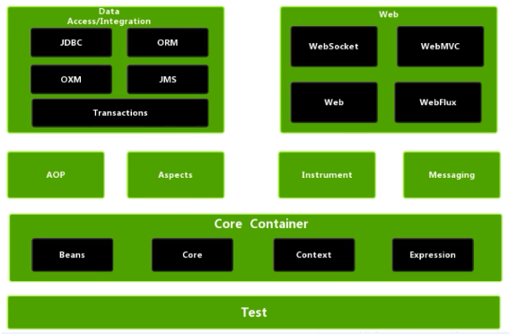

1. Spring是轻量级的开源的JavaE,框架

2. Spring可以解决企业应用开发的复杂性,

3. Spring有两个核心部分:IOC和 Aop.

4. IOC:控制反转，把创建对象过程交给Spring进行管理

5. Aop:面向切面，不修改源代码进行功能增强

   

**Spring特点**

1. 方便解耦，简化开发。
2. Aop,编程支持
3. 方便程序测试
4. 方便和其他框架进行整合
5. 方便进行事务操作;
6. 降低API开发难度

最常用的几个包：

commons-logging-1.2.jar

spring-beans-5.3.4.jar

spring-context-5.3.4.jar

spring-core-5.3.4.jar

spring-expression-5.3.4.jar


## hello world

~~~java
@ToString
@AllArgsConstructor
@NoArgsConstructor
@Getter
@Setter
public class User {
    String name;
    int id=0;
    String sex;
    int age;
    String address;

    public void add() {
        System.out.println(id++);
    }
}
~~~

~~~java
public class MainClass {
    public static void main(String[] args) throws IOException {
        //1、加载Spring配置文件
        ApplicationContext context=new ClassPathXmlApplicationContext("bean1.xml");
        //2、获取配置创建的对象
        User user = context.getBean("user", User.class);
        user.add();
    }
}
~~~

~~~xml
<?xml version="1.0" encoding="UTF-8"?>
<beans xmlns="http://www.springframework.org/schema/beans"
       xmlns:xsi="http://www.w3.org/2001/XMLSchema-instance"
       xsi:schemaLocation="http://www.springframework.org/schema/beans http://www.springframework.org/schema/beans/spring-beans.xsd">

    <bean id="user" class="com.gu.User"/>

</beans>
~~~

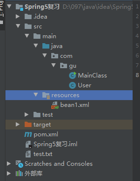


# 2、IOC原理

## 1）基本介绍

1. IOC思想基于IOC容器完成，IOC容器底层就是对象工厂

2. Spring提供IOC容器实现两种方式:(两个接口)
   1.  BeanFactory:IOC容器基本实现，是Spring内部的使用接口，不提供开发人员进行使用。加载配置文件时候不会创建对象，在获取对象（使用）才去创建对象
   2. ApplicationContext: BeanFactory,接口的子接口，提供更多更强大的功能，一般由开发人员进行使用。加载配置文件时候就会把在配置文件对象进行创建。
3. 定位xml文件有两种，一种是文件解析，一一种是类解析，对应着磁盘路径与类路径。

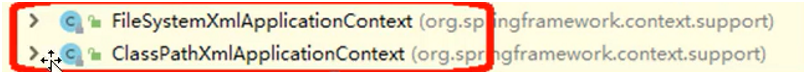


## 2）IOC（基于XML方式）

### 创建对象

1. 基于xml方式创建对象

   在配置类对象时创建：`<bean id="" class="" />`

2. 在spring配置文件中，使用bean标签，标签里面添加对应属性，就可以实现对象创建

3. bean标签的常用属性说明：

   1. `id`：唯一标识
   2. `class`：类全路径（包类路径）
   3. `name`：与id类似，可以实现id的功能，但是与id不同的是，**name允许包含特殊符号。**

4. 在创建对象时，**默认是无参数创建对象**，所以如果类中没有无参构造方法，会报错。


### 注入属性

~~~xml
<!--set方法注入-->
<bean id="user" class="com.gu.User">
    <property name="id" value="12"/>
</bean>
<bean id="user" class="com.gu.User">
    <property>
        <name>id</name>
        <value>12</value>
    </property>
</bean>

<!--简化版set注入-->
<bean id="user" class="com.gu.User1" p:age="22" p:name="147"/>

<!--构造方法注入-->
<bean id="user" class="com.gu.User">
    <constructor-arg name="age" value="18"/>
</bean>

<!--外部bean-->
<bean id="user" class="com.gu.User" p:age="18"/>
<bean id="service" class="com.gu.Service">
    <property name="user" ref="user"/>
</bean>

<!--内部bean-->
<bean id="service" class="com.gu.Service">
    <property name="user">
        <bean class="com.gu.User">
            <property name="id" value="12"/>
        </bean>
    </property>
</bean>
~~~


1. DI：依赖注入，就是注入属性。

2. **注入方法1**：**set方法注入**。要求对应的类中含有set方法。在bean标签内加上数个**子标签property**，属性name为属性名称，value为属性值。

3. **注入方法2**：**有参构造方法注入**。要求对应的类中含有有参构造方法。在bean标签内加上数个子标签constructor-arg，属性name为属性名称，value为属性值。

4. 简化版set注入：
    1. 将beans加上一个新的命名空间：`xmlns:p="http://www.springframework.org/schema/p"`
    2. 通过在bean标签中加入:  p:属性名="属性值" ,注入相应的属性。
    `<bean id="user" class="com.gu.User1" p:age="22" p:name="147"/>`
    3. 向属性中注入空值null：在property标签中加入子标签<null />，并没有value属性。
    
5. 属性值中包含**特殊符号**：`< >`，空格等都是特殊符号，解决方法有

      1. 转义：&lt,&gt等
      2. 在property标签内加上value子标签表示值，子标签用`<![CDATA[属性值]]>`来插入有特殊符号的值。

      ~~~xml
      <bean id="user" class="com.gu.User">
          <property name='id'>
              <value><![CDATA[12]]></value>
          </property>
      </bean>
      ~~~

6. null值

   ~~~xml
   <property name="user">
   	<null />
   </property>
   ~~~

   

7. 属性是外部bean：也就是同样在容器中的javabean，使用ref属性值

   1. 创建两个类service类和dao类
   2. 在service 调用dao里面的方法
   3. 在spring配置文件中进行配置

   ~~~xml
   <bean id="user" class="com.gu.User" p:age="18"/>
   <bean id="service" class="com.gu.Service">
       <property name="user" ref="user"/>
   </bean>
   ~~~

8. 属性是内部bean：自定义的，没有加入容器的javabean。在内部使用bean标签

   ~~~xml
   <bean id="service" class="com.gu.Service">
       <property name="user">
           <bean class="com.gu.User">
               <property name="id" value="12"/>
           </bean>
       </property>
   </bean>
   ~~~

9. 级联赋值：

   ~~~xml
   <bean id="service" class="com.gu.Service">
       <property name="dept" ref="dept"></property>
   </bean>
   <bean id="dept" class="com.gu.User">
       <property name="id" value="12"></property>
   </bean>
   ~~~

   ~~~xml
   <!--需要get方法-->
   <bean id="service" class="com.gu.Service">
       <property name="dept.id" value="18"></property>
   </bean>
   <bean id="dept" class="com.gu.User">
       <property name="id" value="12"></property>
   </bean>
   ~~~

10. 集合注入

   ~~~xml
   <!--数组-->
   <bean id="service" class="com.gu.Service">
       <!--数组-->
       <property name="list">
           <array>
               <value>12</value>
               <value>16</value>
           </array>
       </property>
       
       <!--链表-->
       <property name="list">
           <list>
               <value>12</value>
               <value>16</value>
           </list>
       </property>
       
       <!--map-->
       <property name="list">
           <map>
               <entry key="1" value="a"></entry>
               <entry key="2" value="b"></entry>
               <entry key="4" value="d"></entry>
               <entry key="3" value="c"></entry>
           </map>
       </property>
       
       <!--set-->
       <property name="list">
           <set>
               <value>12</value>
               <value>13</value>
           </set>
       </property>
       
       <!--值是对象-->
       <property name="list">
           <list>
               <ref bean="user1"></ref>
               <ref bean="user2"></ref>
           </set>
       </property>
       
       <!--将集合注入部分提出来-->
       <util:list id="ulist">
       	<value>12</value>
           <value>13</value>
       </util:list>
       <bean id="user" class="com.gu.User">
       	<property name="list" ref="ulist"></property>
       </bean>
   </bean>
   ~~~

   

### 工厂类

  1. Spring有两种类型bean，一种普通bean，另外一种工厂bean(FactoryBean)
  2. 普通bean:在配置文件中定义bean类型就是返回类型
  3. 即在以下代码中getBean获得的是在xml中定义的类型

   ~~~java
   //1、加载Spring配置文件
   ApplicationContext context=new ClassPathXmlApplicationContext("bean1.xml");
   //2、获取配置创建的对象
   User user = context.getBean("user", User.class);
   ~~~

1. 工厂bean：在**配置文件定义bean类型可以和返回类型不一样**

   1. 第一步，创建类，让这个类作为工厂bean，实现接口FactoryBean。

      如上述代码的ApplicationContext就是实现类接口FactoryBean。

   2. 第二步，实现接口里面的方法，在实现的方法中定义返回的 bean类型。


### bean的作用域（单实例或多实例）

1. 在spring里面，**创建的类默认是单实例对象**

   如下代码，看似是通过spring的配置文件创建了两个User类，但实际上，这两个类引用同一个地址，实际上是同一个类。

~~~java
public static void main(String[] args) throws IOException {
    //1、加载Spring配置文件
    ApplicationContext context=new ClassPathXmlApplicationContext("bean1.xml");
    //2、获取配置创建的对象
    User user1 = context.getBean("user", User.class);
    User user2 = context.getBean("user", User.class);
    user1.setAge(1000);
    System.out.println("user1.toString() = " + user1.toString());
    System.out.println("user2.toString() = " + user2.toString());
}
~~~

2. 如何设置单实例或者多实例：bean标签内添加scope属性。

   属性值为singleton是单实例，属性值是prototype为多实例

~~~xml
<bean id="user" class="com.gu.User" scope="prototype"/>
~~~

3. 创建对象的时机：
   1. 对于单实例，也就是值是singleton时，在加载spring配置文件时，配置文件包含的所有类都会被实例化。即在下列语句完成之后就会创建对象：

    ~~~java
    //1、加载Spring配置文件
    ApplicationContext context=new ClassPathXmlApplicationContext("bean1.xml");
    ~~~

   2. 对于多实例，在获取对象时，即使用getBean方法时，才会创建多实例对象。

4. scope还有两个值：request与session，类似于web中的域对象，当是这两个值时，**创建的对象会被放进域对象中。**


### bean生命周期

1. 通过构造器创建bean实例（无参数构造) ---（`创建bean实例`）
2. 为bean的属性设置值和对其他bean引用（调用set方法)-（`参数注入`）
3. 把bean实例传递bean后置处理器的方法----（`后置处理1`）
4. 调用bean的初始化的方法（需要进行配置初始化的方法)-（`初始化`）
   1. 使用initMethod属性，属性值是初始化方法的名称
5. 把bean实例传递bean后置处理器的方法（`后置处理2`）
6. bean可以使用了(对象获取到了)-----（`正常使用`）
7. 当容器关闭时候，调用bean的销毁的方法（需要进行配置销毁的方法）。使用destroy:Method属性进行销毁，属性值是方法名称，方法会在对象被销毁后自动调用。使用((ClassPathXmlApplicationContext)context).close();方法可以使对象销毁。------（`销毁bean`）

8. 后置处理器的创建与使用：
   1. 创建一个后置处理器类PostProcessorTest，继承BeanPostProcessor接口，实现postProcessAfterInitialization与postProcessBeforeInitialization方法。
   2. 在xml文件中配置后置处理器：

```java
public class User {
    int id=0;
    int age;

    public User() {
        System.out.println("实例化");
    }

    public void setAge(int age) {
        System.out.println("set方法");
    }
    
    public void init(){
        System.out.println("初始化方法");
    }

    public void destroy() {
        System.out.println("销毁");
    }
}
```

~~~xml
<!--bean配置-->
<bean id="user" class="com.gu.User" 
      p:age="18" 
      destroy-method="destroy" 
      init-method="init"
      />

<!--后置处理器配置-->
<bean id="postProcess" class="com.gu.PostProcess"/>
~~~

~~~java
//自定义后置处理器
public class PostProcess implements BeanPostProcessor {
    // 在初始化bean之前调用
    public Object postProcessBeforeInitialization(Object bean, String beanName) throws BeansException {
        System.out.print(beanName);
        System.out.println("后置处理器方法before");
        return null;
    }

    //在初始化bean之后调用
    public Object postProcessAfterInitialization(Object bean, String beanName) throws BeansException {
        System.out.print(beanName);
        System.out.println("后置处理器方法after");
        return null;
    }
}

~~~

运行结果：

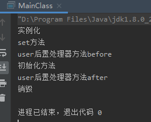


### 自动装配

什么是自动装配：根据指定装配规则（属性名称或者属性类型)，Spring自动将匹配的属性值进行注入。也就是省下了写下列语句引用外部bean的功夫

实现方法：bean标签autowire属性，属性值有两个，byName与byType

1. byName：根据属性的名称自动注入，注入值bean 的id 值和类属性名称一样

   比如，类A要注入一个类为B的变量叫做bx，需要使得B的id值也叫做bx。

2. byType：根据属性的类型自动注入。这使得在配置文件中，相同类的配置bean标签不能有一个以上。

   注入B时调用的构造方法也是根据B的配置文件而来。

举例：

~~~xml
<!--外部bean-->
<bean id="user" class="com.gu.User" p:age="18"/>
<bean id="service" class="com.gu.Service">
    <property name="user" ref="user"/>
</bean>
~~~

总结：操作方法前面已经说过，这里是基本原理，了解即可。


### 引入外部属性文件配置属性

以配置德鲁伊连接池为例。

1. 引入德鲁伊连接池依赖

2. 配置德鲁伊连接池类

   不使用外部属性文件配置：

   ~~~xml
   <bean id="dataBaseLink" class="com.alibaba.druid.pool.DruidDataSource">
       <property name="driverClassName" value="com.mysql.jdbc.Driver"/>
       <property name="url" value="jdbc:mysql://localhost:3306/test?useSSL=false&amp;useUnicode=true&amp;characterEncoding=utf-8&amp;serverTimezone=UTC"/>
       <property name="username" value="097"/>
       <property name="password" value="123456"/>
   </bean>
   ~~~
   
   使用外部属性文件配置：
   
   ~~~xml
   <!--引入外部属性文件-->
   <context:property-placeholder location="classpath:jdbctest.properties" />
   <bean id="dataBaseLink" class="com.alibaba.druid.pool.DruidDataSource">
       <property name="driverClassName" value="${jdbc.driverClassName}"/>
       <property name="url" value="${jdbc.url}"/>
       <property name="username" value="${jdbc.username}"/>
       <property name="password" value="${jdbc.password}"/>
   </bean>
   ~~~

3. 外部配置文件：

   ```properties
   jdbc.driverClassName=com.mysql.jdbc.Driver
   jdbc.url=jdbc:mysql://localhost:3306/test?useSSL=false&useUnicode=true&characterEncoding=utf-8&serverTimezone=UTC
   jdbc.username=097
   jdbc.password=123456
   ```

4. 配置JdbcTemplate

   ~~~xml
   <bean id="jdbcTemplate" class="org.springframework.jdbc.core.JdbcTemplate">
       <property name="dataSource" ref="dataBaseLink"/>
   </bean>
   ~~~

5. 测试：

   ~~~java
   @Test
   public void testDruid(){
       ApplicationContext context = new ClassPathXmlApplicationContext("bean1.xml");
       JdbcTemplate template = context.getBean("jdbcTemplate", JdbcTemplate.class);
   
       String sql = "select * from student where sid=? and sname=?";
   
       Map<String, Object> res = template.queryForMap(sql,new Object[]{1,"Flank"});
   
       Set<Map.Entry<String, Object>> set = res.entrySet();
       for (Map.Entry<String, Object> entry : set) {
           System.out.println(entry.getKey() + "：" + entry.getValue());
       }
   }
   ~~~

   


## 3）IOC（基于注解方式）

### 创建对象

Spring针对Bean管理中创建对象提供的注解

(1)@Component

(2)@Service

(3)@Controller

(4)@Repository

*上面四个注解功能是一样的，都可以用来创建bean实例

1. 基于注解方式创建实例对象

1. 引入jar包：spring-aop-5.3.4.jar

   2. 开启组件扫描：

   3. 引入名称空间context，在xsi:schemaLocation命名空间中添加两项

1. context:component-scan标签开启组件扫描
2. base-package属性值表示扫描的包，不止一个包可以使用逗号分开，或者直接写它们的上层目录（包）
3. 创建类，在类上面添加创建对象注解，相当于在xml文件中配置此类

~~~xml
<!--开启注解扫描，注明扫描的包-->
<context:component-scan base-package="com.gu"/>
~~~

```java
// 注解创建对象,如果不写value参数，默认的参数是类名首字母小写后的名字
@Component(value="user")
public class User {
}
```


### 组件扫描配置

context:component-scan标签的一些属性：

如下，use-dafault-filters属性默认为true，表示开启默认扫描，如果关闭，则意味着需要额外配置扫描过滤准则。使用context:include-filter 标签配置过滤准则，代表要扫描哪些类，如下意思是扫描带Controller注解的类；使用context:exclude-filter标签是不扫描哪些类。

先后顺序有讲究，先写include，再写exclude。

```xml
<context:component-scan base-package="com.gu" use-default-filters="false">
    
    <context:include-filter type="annotation" expression="org.springframework.stereotype.Controller"/>
    
    <context:exclude-filter type="annotation" expression="org.springframework.stereotype.Service"/>
    
</context:component-scan>
```


### 注入属性

@Autowired：根据属性类型自动注入

~~~java
public class A{
    @Autowired
    DataSource data;
}
~~~


@Qualifier：根据属性名称自动注入，需要和@Autowired一起使用

例如，在A类中用ai接口定义了一个变量名叫ax，那么实际使用中，ax是要用ai接口的实现类注入的。如果，ai只有一个实现类B，那么使用属性类型注入即可，spring可以找到唯一的一个实现类，但是如果有多个实现类，那么就要配合属性名称注入。A定义ax并使用注解使它自动注入需要这么写：

~~~java
public class A{
    @Autowired
    	@Qualfier(value="b")
    ai ax;
}
~~~


@Resource：可以根据属性名称，可以根据属性类型。这个的依赖包是来自javax的不是spring。

~~~java
@Resource(name="userx")
User user;
~~~


@Value常见类型（数值、字符、字符串等）注入

~~~java
@Value(value="abc")
String name;
~~~


### 完全注解开发

使用配置类替代xml配置文件开启组件扫描：@Configuration

~~~java
@Configuration
@ComponentScan(basePackages = "com.gu.dao")
public class MyConfig {
    
}

@Component
public class User {
    
}

@Test
public void test01(){
    ApplicationContext context = new AnnotationConfigApplicationContext(MyConfig.class);

    User user = context.getBean("user", User.class);
}
~~~


# 3、AOP

## 1）基本概念

1. 面向切面编程，或者面向方面编程

2. 利用AOP可以对业务逻辑的各个部分进行隔离，从而使得业务逻辑各部分之间的耦合度降低，提高程序的可重用性，同时提高了开发的效率。

3. 通俗描述:**不通过修改源代码方式，在主干功能里面添加新功能**

4. 使用登录例子说明AOP

   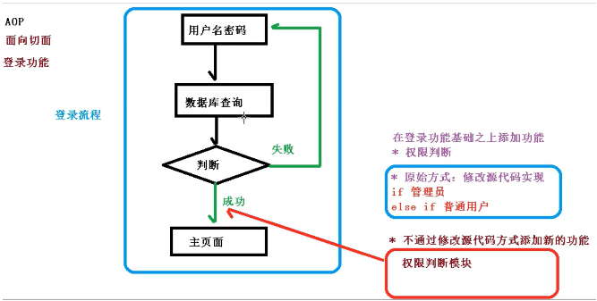


## 2）AOP底层原理

AOP底层使用动态代理：有两种情况动态代理。

第一种有接口情况，使用JDK动态代理，**依赖接口实现类**

第二种没有接口情况，使用CGLIB动态，**依赖子类继承父类**

~~~ java
//第一种
public interface UserDao{}

public class UserDaoImpl implements UserDao{}

//第二种
public class UserF{}

public class UserS extends UserF{}
~~~


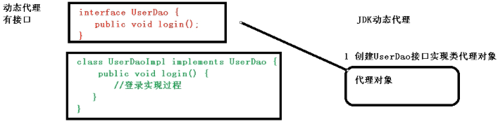

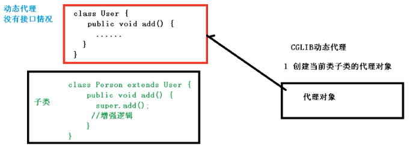


## 3）AOP操作之JDK动态代理

1. 使用Proxy对象创建代理对象

2. newProcxyInstance方法：

   ~~~java
   public static Object newProxyInstance(ClassLoader loader,
                                             Class<?>[] interfaces,
                                             InvocationHandler h)
   ~~~

   三个参数：

   1. loader：**类加载器**
   2. interface：增强方法所在的类，这个类实现的**接口**，支持多个接口
   3. h：实现这个接口InvocationHandler，创建代理对象，写**增强的方法**

3. 如下，有一个接口UserDao，实现类为UserDaoImpl

   ~~~java
   public interface UserDao {
       void out();
   }
   
   @Service(value="userDao")
   public class UserDaoImpl implements UserDao {
       public void out(){
           System.out.println("out功能方法执行");
       }
   }
   ~~~

   增强UserDaoImpl的功能方法out：在out方法执行前做一些事情，在out方法执行后，做一些事情。

   ~~~java
   @Test
   public void test01(){
       ApplicationContext context = new AnnotationConfigApplicationContext(MyConfig.class);
       UserDao userDao = context.getBean("userDao", UserDaoImpl.class);
   
       //创建接口实现类代理对象,
       // 第三个参数可以使用匿名内部类的方法，实现接口，这里的演示使用建立一个新类更加清晰
       Class[] interfaces = {UserDao.class};
       UserDao userDaoProxy =(UserDao) Proxy.newProxyInstance(UserDaoProxy.class.getClassLoader(), interfaces, new UserDaoProxy(userDao));
       userDaoProxy.out(1,2);
   }
   
   
   public class UserDaoProxy implements InvocationHandler {
        //创建的是谁的代理对象，就要把谁传递过来
   
       //传递方法1，有参构造传入
       //这里使用Object是希望增强兼容性，事实上使用UserDao也行
       Object obj;
       public UserDaoProxy(Object object) {
           this.obj = object;
       }
   
       public Object invoke(Object proxy, Method method, Object[] args) throws Throwable {
           //方法之前
           System.out.println("方法之前执行："+method.getName());
           System.out.println("传递的参数："+ Arrays.toString(args));
   
   
           //被增强的方法执行
           Object res=method.invoke(obj,args);
   
           //方法之后
           System.out.println("方法之后执行："+obj);
           
           //实际返回的参数，是可以拿到并改变的
           return res;
       }
   }
   
   ~~~

   

   

## 3）术语

1. 连接点：类里面哪些方法可以被增强,这些方法称为连接点 

2. 切入点：实际被真正增强的方法,称为切入点

3. 通知（增强)：实际增强的逻辑部分称为通知（增强)

   通知有多种类型：（假设被增强的方法为add）

   前置通知：在add执行之前的通知

   后置通知：在add执行之后的通知

   环绕通知：在add执行之前与之后的通知

   异常通知：add执行出现异常后的通知

   最终通知：无论add发不发生异常都会执行的通知（相当于finally语句）

4. 切面：一种动作，把通知应用到切入点的过程。


## 4）Aspectj

AspectJ不是Spring组成部分，独立AOP框架，一般把 AspectJ.和Spimg.框架一起使用，进行AOP操作

1. 切入点表达式

   1. 切入点表达式作用：标明要增强的类与方法

   2. 语法结构：`execution([权限修饰符][返回类型][类全路径][方法名称]([参数列表]))`

      ~~~
      举例1:对com.atguigu.dao.BookDao类里面的add进行增强
      execution(*com.atguigu.dao.BookDao.add(..))
      
      举例2:对com.atguigu.dao.BookDao类里面的所有方法进行增强
      execution(*com.atguigu.dao.BookDao.*(..))
      
      举例3:对com.atguigu.dao的所有类的所有方法进行增强
      execution(*com.atguigu.dao.*.*(..))
      ~~~


## 5）AOP操作之AspectJ注解

   

   1. 要被增强的类User
   
      ~~~java
      @Component
      public class User {
          int id=0;
      
          public int out(int id) {
              System.out.println(this.id++);
              return id;
          }
      }
      ~~~

   2. 对User增强的类UserProxy
   
      ~~~java
      package com.gu;
      
      import org.aspectj.lang.annotation.Aspect;
      import org.aspectj.lang.annotation.Before;
      import org.springframework.stereotype.Component;
      
      @Component
      @Aspect
      public class UserProxy {
          //前置通知
          @Before(value = "execution(* com.gu.User.out(..))")
          public void before() {
              System.out.println("out方法之前执行");
          }
      }
      ~~~
   
   3. 开启aop生成代理对象
   
      ~~~xml
      <?xml version="1.0" encoding="UTF-8"?>
      <beans xmlns="http://www.springframework.org/schema/beans"
             xmlns:xsi="http://www.w3.org/2001/XMLSchema-instance"
             xmlns:context="http://www.springframework.org/schema/context"
             xmlns:tx="http://www.springframework.org/schema/tx"
             xmlns:aop="http://www.springframework.org/schema/aop"
             xsi:schemaLocation="http://www.springframework.org/schema/beans
             http://www.springframework.org/schema/beans/spring-beans.xsd
             http://www.springframework.org/schema/context
             https://www.springframework.org/schema/context/spring-context.xsd
             http://www.springframework.org/schema/aop
             https://www.springframework.org/schema/aop/spring-aop.xsd
             http://www.springframework.org/schema/tx
             https://www.springframework.org/schema/tx/spring-tx.xsd">
      
          <!--开启注解扫描-->
          <context:component-scan base-package="com.gu" />
      
          <!--开启生成代理对象-->
          <aop:aspectj-autoproxy />
      
      </beans>
      ~~~
   
   4. 测试
   
      ~~~java
      @Test
      public void test01(){
          ApplicationContext context = new ClassPathXmlApplicationContext("bean1.xml");
          User user = context.getBean("user", User.class);
          user.out(1);
      }
      ~~~
   
   5. 总结：由此可以看出，AOP操作的意义在于**不改变原先代码的前提下增加了新的功能**。例如，本例中，User类本来是被测试类调用，输出result，但是如果我需要给User类配置一个新方法，只需要新建一个UserProxy类用来生成User类的代理对象，这样在**test方法使用getBean方法获取User类时，实际上获取的是已经被增强的类，不是原先的User类。本来test方法只能输出一个id值，但是新建一个增强类之后，test方法不用改变，却能额外输出一个“out方法之前执行”。**


附加知识：

1. 其它几种通知类型注解

   1. @AfterReturning：后置通知
   2. @After：最终通知
   3. @AfterThrowing：异常通知
   4. @Around：环绕通知

2. 公共切入点抽取：使用Pointcut标签

   ```java
   @Component
   @Aspect
   public class UserProxy {
       @Pointcut(value = "execution(* com.gu.User.out(..))")
       public void pointCutDemo(){}
       
       //前置通知
       @Before(value = "pointCutDemo()")
       public void before() {
           System.out.println("out方法之前执行");
       }
   
       //后置通知
       @After(value="pointCutDemo()")
       public int after(){
           System.out.println("out方法之后执行");
           return 2;
       }
   }
   ```

3. 有多个增强类多同一个方法进行增强，设置增强类优先级：在增强类上面添加注解@Order(数字类型值)，数字类型值越小优先级越高。

   ```java
   @Component
   @Aspect
   @Order(value = 1)
   public class UserProxy {
       
   }
   ```


## 6）Aspect之xml配置文件方式

```xml
<aop:config>
    <!--切入点-->
    <aop:pointcut id="proxy" expression="execution(* com.gu.User.out(..))"/>
    <!--切面,ref指向增强类-->
    <aop:aspect ref="userProxy">
        <!--增强作用在具体的方法上-->
        <aop:before method="before" pointcut-ref="proxy"/>
    </aop:aspect>
</aop:config>
```


## 7）Aspect之完全注解

注解开启Aspect：`@EnableAspectJAutoProxy(proxyTargetClass = true)`

```java
@Configuration
@ComponentScan(value = "com.gu")
@EnableAspectJAutoProxy(proxyTargetClass = true)
public class MyConfig {

}

@Test
public void test01(){
    ApplicationContext context = new AnnotationConfigApplicationContext(MyConfig.class);
    User user = context.getBean("user", User.class);
    System.out.println("hello"+user.out(1));
}
```


# 4、事务操作

## 1）事务概念

事务是数据库操作最基本单元，逻辑上一组操作，要么都成功，如果有一个失败所有操作都失败。

事务四个特性(ACID) ：

(1)原子性

(2)一致性

(3)隔离性

(4）持久性

注意：事务一般用于数据库操作。当然其它操作也不是不可以使用。


## 2）Spring事务管理介绍：

1. 事务添加到JavaEE三层结构里面**Service**层(业务逻辑层)
2. 有两种方式:编程式事务管理和声明式事务管理(（常用)。
3. 可基于注解，可基于xml配置
4. 在Spring进行声明式事务管理，**底层使用AOP原理**
5. 提供一个接口，代表事务管理器，这个接口针对不同的框架提供不同的实现类


## 3）注解式管理事务

1. 创建事物管理器

   ```xml
   <!--创建事务管理器-->
   <bean id="transactionManager" class="org.springframework.jdbc.datasource.DataSourceTransactionManager">
       <!--注入数据源-->
       <property name="dataSource" ref="dataSource"/>
   </bean>
   
   <!--引入外部属性文件-->
   <context:property-placeholder location="classpath:jdbctest.properties" />
   <bean id="dataSource" class="com.alibaba.druid.pool.DruidDataSource">
       <property name="driverClassName" value="${jdbc.driverClassName}"/>
       <property name="url" value="${jdbc.url}"/>
       <property name="username" value="${jdbc.username}"/>
       <property name="password" value="${jdbc.password}"/>
   </bean>
   ```

2. 引入命名空间：tx

3. 开启事务注解

   ```xml
   <!--开启事务注解-->
   <tx:annotation-driven transaction-manager="transactionManager"/>
   ```

4. 在类上添加事务注解

   1. @Transactional，这个注解添加到类上面，也可以添加方法上面

   2. 如果把这个注解添加类上面，这个类里面所有的方法都添加事务

   3. 如果把这个注解添加方法上面，为这个方法添加事务

      ```java
      @Transactional
      public void test01(){
          this.userDao.addMoney();
          int i = 1 / 0;
          this.userDao.reduceMoney();
      }
      ```

5. 当1/0发生异常后，addMoney所做的操作会被回滚。

6. 注意：如使用mysql且引擎是MyISAM，则事务会不起作用，原因是MyISAM不支持事务，可以改成InnoDB引擎。

7. @Transactional常用的参数：

   1. propagation:事务传播行为

      解释：例如有两个方法分别是add与update，add添加了事务，但是update没有（或者是update有事务，但是add没有），在add方法执行中调用了update方法，应采取什么样的操作，这就是事务传播。

   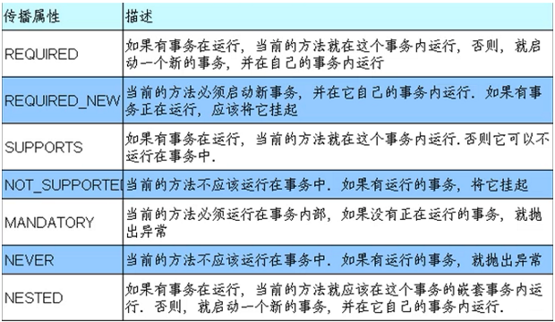

   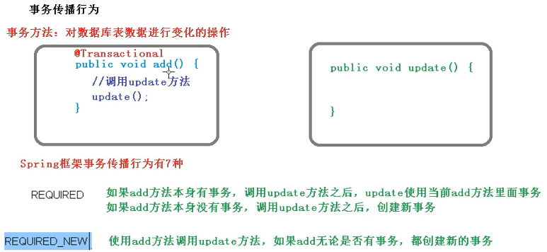

   ​		默认值是REQUIRED：

   ~~~java
   @Test
   @Transactional(propagation = Propagation.REQUIRED)
   public void test01(){
   
   }
   ~~~

   

2. ioslation:事务隔离级别

   1. 事务有特性成为隔离性，多事务操作之间不会产生影响。不考虑隔离
   2. 产生很多问题有三个读问题:脏读、不可重复读、虚（幻)读
   3. 脏读:一个未提交事务读取到另一个未提交事务的数据
   4. 不可重复读:一个未提交事务读取到另一提交事务修改数据
   5. 虚读:一个未提交事务读取到另一提交事务添加数据
   6. 通过设置事务隔离性，解决读问题，串行化级别最高。
   7. 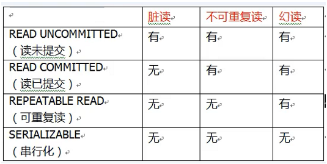
   8. 默认是REPEATABLE_READ

3. timeout:超时时间。

   1. 事务需要在一定时间内进行提交，如果不按时提交进行回滚
   2. 默认值是-1（永不超时），设置时间以秒单位进行计算

4. readOnly:是否只读

   1. 读：查询操作，写:添加修改删除操作,
   2. readOnly_默认值      false，表示可以查询，可以添加修改删除操作
   3. 设置readOnly值是true，设置成true之后，只能查询。

5. rollbackFor:回滚

   ​	设置出现哪些异常进行事务回滚,

6. noRollbackFor:不回滚

   ​	设置出现哪些异常不进行事务回滚,

7. 

## 3）配置文件式

1. 创建事务管理器

   ~~~xml
   <!--创建事务管理器-->
   <bean id="transactionManager" class="org.springframework.jdbc.datasource.DataSourceTransactionManager">
       <!--注入数据源-->
       <property name="dataSource" ref="dataSource"/>
   </bean>
   ~~~

2. 配置通知（即给事务添加相应的参数，确定事务规则）

   ```xml
   <!--2 配置通知 -->
   <tx:advice id="txadvice">
       <!--配置事务参数-->
       <tx:attributes>
           <!--指定哪种规则的方法上面添加事务-->
           <tx:method name="accountMoney" propagation="REQUIRED"/>
       </tx:attributes>
   </tx:advice>
   ```

3. 配置切入点（对哪个方法使用事务）和切面（将事务通知设置到切入点上），即**定位以上定义的事物管理器与通知应用与哪一个类或者哪一个方法上。**

   ```xml
   <!--3 配置切入点和切面-->
   <aop:config>
       <!--配置切入点-->
       <aop:pointcut id="pt" expression="execution(* com.gu.User.addMoney(..))"/>
       <!--配置切面：表名通知与切入点-->
       <aop:advisor advice-ref="txadvice" pointcut="pt" />
   </aop:config>
   ```


## 4）完全注解开发

```java
package com.gu;

import com.alibaba.druid.pool.DruidDataSource;
import org.springframework.beans.factory.annotation.Qualifier;
import org.springframework.beans.factory.annotation.Value;
import org.springframework.context.annotation.*;
import org.springframework.jdbc.core.JdbcTemplate;
import org.springframework.jdbc.datasource.DataSourceTransactionManager;
import org.springframework.stereotype.Component;
import org.springframework.transaction.annotation.EnableTransactionManagement;

import javax.sql.DataSource;


//1. 标志为配置类
@Configuration
//2. 开启组件扫描
@ComponentScan(value = "com.gu")
//3. 开启事务
@EnableTransactionManagement
@PropertySource({"classpath:jdbctest.properties"})
public class MyConfig {
    @Value(value = "${jdbc.driverClassName}")
    private String driverName;
    @Value(value = "${jdbc.url}")
    private String url;
    @Value(value = "${jdbc.username}")
    private String username;
    @Value(value = "${jdbc.password}")
    private String password;

//    4. 配置数据库连接池（DataSource对象）
    @Bean("dataSource")
    public DruidDataSource getDruidDataSource() {
        DruidDataSource dataSource = new DruidDataSource();
        dataSource.setDriverClassName(this.driverName);
        dataSource.setUrl(this.url);
        dataSource.setUsername(this.username);
        dataSource.setPassword(this.password);
        System.out.println("yes");
        return dataSource;
    }
//  4.配置JdbcTemplate
    @Bean("jdbcTemplate")
//    public JdbcTemplate getJdbcTemplate(@Qualifier(value = "dataSource")DruidDataSource dataSource)
    //参数dataSource默认根据类型自动注入，也可以如上根据名称自动注入
    public JdbcTemplate getJdbcTemplate(DataSource dataSource) {
        return new JdbcTemplate(dataSource);
    }

//  开启事务管理器
    public DataSourceTransactionManager getDataSourceTransactionManager(DataSource dataSource) {
        DataSourceTransactionManager transactionManager = new DataSourceTransactionManager();
        transactionManager.setDataSource(dataSource);
        return transactionManager;
    }
}
```


# 5、Spring5框架新功能基本：

1. 基于java8，jdk版本最低为8，兼容jdk9，以及java      EE8API

2. Spring 5.0框架自带了通用的日志封装

   1. Spring5已经移除Log4jConfigListener，官方建议使用Log4j2
   2. Spring5框架整合Log4j2

3. Spring5框架核心容器支持@Nullable注解

   1. 可以用于方法上面，表示方法返回值可以为空
   2. 可以用于方法参数上面，表示参数可以为空，有时调用此方法可以没有此参数。
   3. 可以用于属性上面，表示属性值可以为空。

4. Spring5核心容器支持函数式风格GenericApplicationContext，通过函数注入bean

   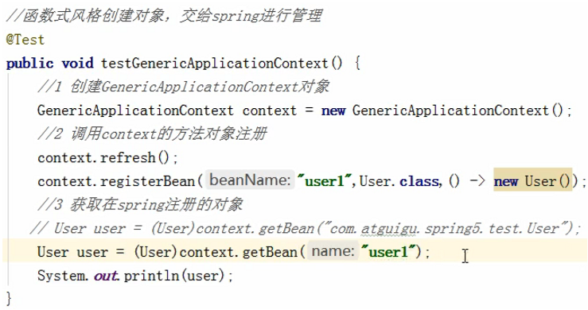

5. 整合JUnit5单元测试框架

6. WebFlux
