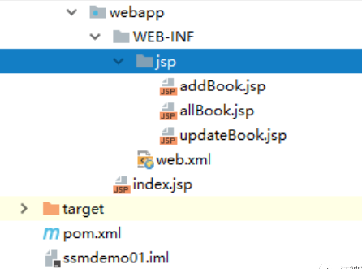

# 常用Maven依赖

## 1、Spring5

```xml
<!--spring mvc-->
<dependency>
    <groupId>org.springframework</groupId>
    <artifactId>spring-webmvc</artifactId>
    <version>5.1.9.RELEASE</version>
</dependency>

<!--spring context-->
<dependency>
    <groupId>org.springframework</groupId>
    <artifactId>spring-context</artifactId>
    <version>5.0.6.RELEASE</version>
</dependency>

<!--spring jdbc-->
<dependency>
    <groupId>org.springframework</groupId>
    <artifactId>spring-jdbc</artifactId>
    <version>5.1.2.RELEASE</version>
</dependency>

<dependency>
    <groupId>org.springframework</groupId>
    <artifactId>spring-core</artifactId>
    <version>${spring.version}</version>
</dependency>
<dependency>
    <groupId>org.springframework</groupId>
    <artifactId>spring-context</artifactId>
    <version>${spring.version}</version>
</dependency>
<dependency>
    <groupId>org.springframework</groupId>
    <artifactId>spring-aop</artifactId>
    <version>${spring.version}</version>
</dependency>
<dependency>
    <groupId>org.aspectj</groupId>
    <artifactId>aspectjrt</artifactId>
    <version>1.6.12</version>
</dependency>
<dependency>
    <groupId>org.aspectj</groupId>
    <artifactId>aspectjweaver</artifactId>
    <version>1.6.12</version>
</dependency>
<dependency>
    <groupId>cglib</groupId>
    <artifactId>cglib</artifactId>
    <version>2.2</version>
</dependency>

<!--日志-->
<dependency>
    <groupId>commons-logging</groupId>
    <artifactId>commons-logging</artifactId>
    <version>1.2</version>
</dependency>

<!--单元测试的依赖-->
<dependency>
    <groupId>junit</groupId>
    <artifactId>junit</artifactId>
    <version>4.12</version>
</dependency>
```

## 2、JavaWeb

```xml
<!--   servlet的依赖     -->
<dependency>
    <groupId>javax.servlet</groupId>
    <artifactId>servlet-api</artifactId>
    <version>2.5</version>
</dependency>

<!--文件上传-->
<dependency>
   <groupId>commons-fileupload</groupId>
   <artifactId>commons-fileupload</artifactId>
   <version>1.3.3</version>
</dependency>

<!--servlet-api导入高版本的-->
<dependency>
   <groupId>javax.servlet</groupId>
   <artifactId>javax.servlet-api</artifactId>
   <version>4.0.1</version>
</dependency>

<!--jstl的依赖-->
<dependency>
    <groupId>javax.servlet</groupId>
    <artifactId>jstl</artifactId>
    <version>1.2</version>
</dependency>

<!--    jsp的依赖    -->
<dependency>
    <groupId>javax.servlet.jsp</groupId>
    <artifactId>jsp-api</artifactId>
    <version>2.2</version>
</dependency>
```

## 3、Mybatis

```xml
<dependency>
    <groupId>org.mybatis</groupId>
    <artifactId>mybatis</artifactId>
    <version>3.5.6</version>
</dependency>

<dependency>
    <groupId>com.baomidou</groupId>
    <artifactId>mybatis-plus-boot-starter</artifactId>
    <version>3.4.1</version>
</dependency>
```

## 4、SpringMVC

```xml
    <dependencies>
<!--   servlet的依赖     -->
        <dependency>
            <groupId>javax.servlet</groupId>
            <artifactId>servlet-api</artifactId>
            <version>2.5</version>
        </dependency>
<!--    jsp的依赖    -->
        <dependency>
            <groupId>javax.servlet.jsp</groupId>
            <artifactId>jsp-api</artifactId>
            <version>2.2</version>
        </dependency>

<!--单元测试的依赖-->
        <dependency>
            <groupId>junit</groupId>
            <artifactId>junit</artifactId>
            <version>4.12</version>
        </dependency>
<!--spring5的基本依赖-->
        <dependency>
            <groupId>org.springframework</groupId>
            <artifactId>spring-webmvc</artifactId>
            <version>5.1.9.RELEASE</version>
        </dependency>
<!--jstl的依赖-->
        <dependency>
            <groupId>javax.servlet</groupId>
            <artifactId>jstl</artifactId>
            <version>1.2</version>
        </dependency>
    </dependencies>
```

## 5、SpringBoot2

```xml
<parent>
    <groupId>org.springframework.boot</groupId>
    <artifactId>spring-boot-starter-parent</artifactId>
    <version>2.4.3</version>
</parent>

<!--springboot jdbc,相当于导入了jdbc、HikaryCP数据源、spring事务-->
<dependency>
    <groupId>org.springframework.boot</groupId>
    <artifactId>spring-boot-starter-data-jdbc</artifactId>
</dependency>
<dependency>
    <groupId>org.springframework.boot</groupId>
    <artifactId>spring-boot-starter-web</artifactId>
</dependency>
<dependency>
    <groupId>org.mybatis</groupId>
    <artifactId>mybatis</artifactId>
    <version>3.5.6</version>
</dependency>
<dependency>
    <groupId>junit</groupId>
    <artifactId>junit</artifactId>
    <scope>test</scope>
</dependency>
```

## 6、插件

```xml
<dependency>
    <groupId>org.projectlombok</groupId>
    <artifactId>lombok</artifactId>
</dependency>
```

## 7、数据库

```xml
<!--德鲁伊连接池->
<dependency>
    <groupId>com.alibaba</groupId>
    <artifactId>druid</artifactId>
    <version>1.1.17</version>
</dependency>

<!--mysql驱动-->
<dependency>
    <groupId>mysql</groupId>
    <artifactId>mysql-connector-java</artifactId>
    <version>5.1.49</version>
</dependency>

<!--jdbcTemplate-->
<dependency>
    <groupId>org.springframework</groupId>
    <artifactId>spring-jdbc</artifactId>
    <version>5.1.2.RELEASE</version>
</dependency>

<!--springboot jdbc,相当于导入了jdbc、HikaryCP数据源、spring事务-->
<dependency>
    <groupId>org.springframework.boot</groupId>
    <artifactId>spring-boot-starter-data-jdbc</artifactId>
</dependency>
```

```xml
<bean id="dataBaseLink" class="com.alibaba.druid.pool.DruidDataSource">
    <property name="driverClassName" value="com.mysql.jdbc.Driver"/>
    <property name="url" value="jdbc:mysql://localhost:3306/test?useSSL=false&useUnicode=true&characterEncoding=utf-8&serverTimezone=UTC"/>
    <property name="username" value="097"/>
    <property name="password" value="123456"/>
</bean>
```

## 8、Json工具

```xml
<!-- https://mvnrepository.com/artifact/com.fasterxml.jackson.core/jackson-core -->
<!--jackson-->
<dependency>
   <groupId>com.fasterxml.jackson.core</groupId>
   <artifactId>jackson-databind</artifactId>
   <version>2.9.8</version>
</dependency>
<!--fastjson-->
<dependency>
   <groupId>com.alibaba</groupId>
   <artifactId>fastjson</artifactId>
   <version>1.2.60</version>
</dependency>
```

## 8、Mybatis

## 9、资源过滤问题

```xml
<build>
   <resources>
       <resource>
           <directory>src/main/java</directory>
           <includes>
               <include>**/*.properties</include>
               <include>**/*.xml</include>
           </includes>
           <filtering>false</filtering>
       </resource>
       <resource>
           <directory>src/main/resources</directory>
           <includes>
               <include>**/*.properties</include>
               <include>**/*.xml</include>
           </includes>
           <filtering>false</filtering>
       </resource>
   </resources>
</build>
```

## 10、Log4j

```xml
<!-- https://mvnrepository.com/artifact/log4j/log4j -->
<dependency>
    <groupId>log4j</groupId>
    <artifactId>log4j</artifactId>
    <version>1.2.17</version>
</dependency>
```

# 一些案例

## 1、基于反射的BaseServlet

```java
@WebServlet(name = "BaseServlet")
public abstract class BaseServlet extends HttpServlet {
    @Override
    protected void doGet(HttpServletRequest req, HttpServletResponse resp) throws ServletException, IOException {
        this.baseMapping(req,resp);
    }

    @Override
    protected void doPost(HttpServletRequest req, HttpServletResponse resp) throws ServletException, IOException {
        this.baseMapping(req,resp);
    }

    public void baseMapping(HttpServletRequest req, HttpServletResponse resp){
        String action=req.getParameter("action");
        try {
            //获取action.业务鉴别字符串，获取相应的业务方法反射对象
            Method method=this.getClass().getDeclaredMethod(action,HttpServletRequest.class,HttpServletResponse.class);
            //调用目标业务方法
            method.invoke(this,req,resp);
        } catch (NoSuchMethodException | IllegalAccessException | InvocationTargetException e) {
            e.printStackTrace();
        }
    }
}
```

## 2、Spring MVC HelloWorld

```xml
<?xml version="1.0" encoding="UTF-8"?>
<beans xmlns="http://www.springframework.org/schema/beans"
       xmlns:xsi="http://www.w3.org/2001/XMLSchema-instance"
       xmlns:context="http://www.springframework.org/schema/context"
       xmlns:p="http://www.springframework.org/schema/p"
       xmlns:c="http://www.springframework.org/schema/c"
       xmlns:aop="http://www.springframework.org/schema/aop"
       xsi:schemaLocation="http://www.springframework.org/schema/beans
        https://www.springframework.org/schema/beans/spring-beans.xsd
        http://www.springframework.org/schema/context
        https://www.springframework.org/schema/context/spring-context.xsd
        http://www.springframework.org/schema/aop
        https://www.springframework.org/schema/aop/spring-aop.xsd">

    <!--    <!–开启注解扫描–>-->
    <!--    <context:component-scan base-package="com.gu,com.gu.dao"/>-->

    <!--    <!–开启生成代理对象–>-->
    <!--    <aop:aspectj-autoproxy />-->

    <!--    <!–引入外部属性文件–>-->
    <!--    <context:property-placeholder location="classpath:jdbctest.properties" />-->
    <!--    <bean id="dataSource" class="com.alibaba.druid.pool.DruidDataSource">-->
    <!--        <property name="driverClassName" value="${jdbc.driverClassName}"/>-->
    <!--        <property name="url" value="${jdbc.url}"/>-->
    <!--        <property name="username" value="${jdbc.username}"/>-->
    <!--        <property name="password" value="${jdbc.password}"/>-->
    <!--    </bean>-->

    <bean class="org.springframework.web.servlet.handler.BeanNameUrlHandlerMapping"/>

    <bean class="org.springframework.web.servlet.mvc.SimpleControllerHandlerAdapter"/>

    <!--视图解析器:DispatcherServlet给他的ModelAndView-->
    <bean class="org.springframework.web.servlet.view.InternalResourceViewResolver" id="InternalResourceViewResolver">
        <!--前缀-->
        <property name="prefix" value="/WEB-INF/jsp/"/>
        <!--后缀-->
        <property name="suffix" value=".jsp"/>
    </bean>

    <bean class="com.gu.controller.HelloController" id="/hello"/>

</beans>
```

## 3、SpringMVC注解方式配置

注解方式：

springmvc-servlet.xml：

```xml
<?xml version="1.0" encoding="UTF-8"?>
<beans xmlns="http://www.springframework.org/schema/beans"
       xmlns:xsi="http://www.w3.org/2001/XMLSchema-instance"
       xmlns:context="http://www.springframework.org/schema/context"
       xmlns:mvc="http://www.springframework.org/schema/mvc"
       xsi:schemaLocation="http://www.springframework.org/schema/beans
       http://www.springframework.org/schema/beans/spring-beans.xsd
       http://www.springframework.org/schema/context
       https://www.springframework.org/schema/context/spring-context.xsd
       http://www.springframework.org/schema/mvc
       https://www.springframework.org/schema/mvc/spring-mvc.xsd">

    <!-- 自动扫描包，让指定包下的注解生效,由IOC容器统一管理 -->
    <context:component-scan base-package="com.gu.controller"/>
    <!-- 让Spring MVC不处理静态资源 -->
    <mvc:default-servlet-handler />
    <!--
    支持mvc注解驱动
        在spring中一般采用@RequestMapping注解来完成映射关系
        要想使@RequestMapping注解生效
        必须向上下文中注册DefaultAnnotationHandlerMapping
        和一个AnnotationMethodHandlerAdapter实例
        这两个实例分别在类级别和方法级别处理。
        而annotation-driven配置帮助我们自动完成上述两个实例的注入。
     -->
    <mvc:annotation-driven />

    <!-- 视图解析器 -->
    <bean class="org.springframework.web.servlet.view.InternalResourceViewResolver"
          id="internalResourceViewResolver">
        <!-- 前缀 -->
        <property name="prefix" value="/WEB-INF/jsp/" />
        <!-- 后缀 -->
        <property name="suffix" value=".jsp" />
    </bean>

</beans>
```

web.xml：

```xml
<?xml version="1.0" encoding="UTF-8"?>
<web-app xmlns="http://xmlns.jcp.org/xml/ns/javaee"
        xmlns:xsi="http://www.w3.org/2001/XMLSchema-instance"
        xsi:schemaLocation="http://xmlns.jcp.org/xml/ns/javaee http://xmlns.jcp.org/xml/ns/javaee/web-app_4_0.xsd"
        version="4.0">

   <!--1.注册servlet-->
   <servlet>
       <servlet-name>SpringMVC</servlet-name>
       <servlet-class>org.springframework.web.servlet.DispatcherServlet</servlet-class>
       <!--通过初始化参数指定SpringMVC配置文件的位置，进行关联-->
       <init-param>
           <param-name>contextConfigLocation</param-name>
           <param-value>classpath:springmvc-servlet.xml</param-value>
       </init-param>
       <!-- 启动顺序，数字越小，启动越早 -->
       <load-on-startup>1</load-on-startup>
   </servlet>

   <!--所有请求都会被springmvc拦截 -->
   <servlet-mapping>
       <servlet-name>SpringMVC</servlet-name>
       <url-pattern>/</url-pattern>
   </servlet-mapping>

</web-app>
```

## 4、Java Json工具类基于JackSon

```java
package com.gu.myutils;

import com.fasterxml.jackson.core.JsonParseException;
import com.fasterxml.jackson.core.JsonProcessingException;
import com.fasterxml.jackson.databind.*;
import com.gu.bean.User;

import java.io.IOException;
import java.text.SimpleDateFormat;

public class JsonUtils {

    public static String ObjectToJson(Object jsonObj){
        ObjectMapper objectMapper = new ObjectMapper();
        try {
            return objectMapper.writeValueAsString(jsonObj);
        } catch (JsonProcessingException e) {
            e.printStackTrace();
        }
        return null;
    }

    public static String ObjectToJson(Byte[] jsonBytes){
        ObjectMapper objectMapper = new ObjectMapper();
        try {
            return objectMapper.writeValueAsString(jsonBytes);
        } catch (JsonProcessingException e) {
            e.printStackTrace();
        }
        return null;
    }

    public static <T> T jsonToObject(String jsonStr, Class<T> valueType){
        try {
            return new ObjectMapper().readValue(jsonStr, valueType);
        } catch (IOException e) {
            e.printStackTrace();
        }
        return null;
    }

    public static String getDateJson(Object object) {
        return getDateJson(object,"yyyy-MM-dd HH:mm:ss");
    }

    public static String getDateJson(Object object,String dateFormat) {
        ObjectMapper mapper = new ObjectMapper();
        //不使用时间差的方式
        mapper.configure(SerializationFeature.WRITE_DATES_AS_TIMESTAMPS, false);
        //自定义日期格式对象
        SimpleDateFormat sdf = new SimpleDateFormat(dateFormat);
        //指定日期格式
        mapper.setDateFormat(sdf);
        try {
            return mapper.writeValueAsString(object);
        } catch (JsonProcessingException e) {
            e.printStackTrace();
        }
        return null;
    }
}
```

## 5、Json工具基于FastJson

```java
package com.kuang.controller;

import com.alibaba.fastjson.JSON;
import com.alibaba.fastjson.JSONObject;
import com.kuang.pojo.User;

import java.util.ArrayList;
import java.util.List;

public class FastJsonDemo {
   public static void main(String[] args) {
       //创建一个对象
       User user1 = new User("秦疆1号", 3, "男");
       User user2 = new User("秦疆2号", 3, "男");
       User user3 = new User("秦疆3号", 3, "男");
       User user4 = new User("秦疆4号", 3, "男");
       List<User> list = new ArrayList<User>();
       list.add(user1);
       list.add(user2);
       list.add(user3);
       list.add(user4);

       System.out.println("*******Java对象 转 JSON字符串*******");
       String str1 = JSON.toJSONString(list);
       System.out.println("JSON.toJSONString(list)==>"+str1);
       String str2 = JSON.toJSONString(user1);
       System.out.println("JSON.toJSONString(user1)==>"+str2);

       System.out.println("\n****** JSON字符串 转 Java对象*******");
       User jp_user1=JSON.parseObject(str2,User.class);
       System.out.println("JSON.parseObject(str2,User.class)==>"+jp_user1);

       System.out.println("\n****** Java对象 转 JSON对象 ******");
       JSONObject jsonObject1 = (JSONObject) JSON.toJSON(user2);
       System.out.println("(JSONObject) JSON.toJSON(user2)==>"+jsonObject1.getString("name"));

       System.out.println("\n****** JSON对象 转 Java对象 ******");
       User to_java_user = JSON.toJavaObject(jsonObject1, User.class);
       System.out.println("JSON.toJavaObject(jsonObject1, User.class)==>"+to_java_user);
  }
}
```

## 6、SpringMvc文件上传

1、导入文件上传的jar包，commons-fileupload ， Maven会自动帮我们导入他的依赖包 commons-io包；

```xml
<!--文件上传-->
<dependency>
   <groupId>commons-fileupload</groupId>
   <artifactId>commons-fileupload</artifactId>
   <version>1.3.3</version>
</dependency>
<!--servlet-api导入高版本的-->
<dependency>
   <groupId>javax.servlet</groupId>
   <artifactId>javax.servlet-api</artifactId>
   <version>4.0.1</version>
</dependency>
```

2、配置bean：multipartResolver

【**注意！！！这个bena的id必须为：multipartResolver ， 否则上传文件会报400的错误！在这里栽过坑,教训！**】

```java
<!--文件上传配置-->
<bean id="multipartResolver"  class="org.springframework.web.multipart.commons.CommonsMultipartResolver">
   <!-- 请求的编码格式，必须和jSP的pageEncoding属性一致，以便正确读取表单的内容，默认为ISO-8859-1 -->
   <property name="defaultEncoding" value="utf-8"/>
   <!-- 上传文件大小上限，单位为字节（10485760=10M） -->
   <property name="maxUploadSize" value="10485760"/>
   <property name="maxInMemorySize" value="40960"/>
</bean>
```

CommonsMultipartFile 的 常用方法：

- **String getOriginalFilename()：获取上传文件的原名**

- **InputStream getInputStream()：获取文件流**

- **void transferTo(File dest)：将上传文件保存到一个目录文件中**
  
  我们去实际测试一下

3、编写前端页面

```java
<form action="/upload" enctype="multipart/form-data" method="post">
 <input type="file" name="file"/>
 <input type="submit" value="upload">
</form>
```

4、**Controller**

```java
package com.kuang.controller;

import org.springframework.stereotype.Controller;
import org.springframework.web.bind.annotation.RequestMapping;
import org.springframework.web.bind.annotation.RequestParam;
import org.springframework.web.multipart.commons.CommonsMultipartFile;

import javax.servlet.http.HttpServletRequest;
import java.io.*;

@Controller
public class FileController {
   //@RequestParam("file") 将name=file控件得到的文件封装成CommonsMultipartFile 对象
   //批量上传CommonsMultipartFile则为数组即可
   @RequestMapping("/upload")
   public String fileUpload(@RequestParam("file") CommonsMultipartFile file , HttpServletRequest request) throws IOException {

       //获取文件名 : file.getOriginalFilename();
       String uploadFileName = file.getOriginalFilename();

       //如果文件名为空，直接回到首页！
       if ("".equals(uploadFileName)){
           return "redirect:/index.jsp";
      }
       System.out.println("上传文件名 : "+uploadFileName);

       //上传路径保存设置
       String path = request.getServletContext().getRealPath("/upload");
       //如果路径不存在，创建一个
       File realPath = new File(path);
       if (!realPath.exists()){
           realPath.mkdir();
      }
       System.out.println("上传文件保存地址："+realPath);

       InputStream is = file.getInputStream(); //文件输入流
       OutputStream os = new FileOutputStream(new File(realPath,uploadFileName)); //文件输出流

       //读取写出
       int len=0;
       byte[] buffer = new byte[1024];
       while ((len=is.read(buffer))!=-1){
           os.write(buffer,0,len);
           os.flush();
      }
       os.close();
       is.close();
       return "redirect:/index.jsp";
  }
}
```

5、测试上传文件，OK！

**采用file.Transto 来保存上传的文件**

1、编写Controller

```java
/*
* 采用file.Transto 来保存上传的文件
*/
@RequestMapping("/upload2")
public String  fileUpload2(@RequestParam("file") CommonsMultipartFile file, HttpServletRequest request) throws IOException {

   //上传路径保存设置
   String path = request.getServletContext().getRealPath("/upload");
   File realPath = new File(path);
   if (!realPath.exists()){
       realPath.mkdir();
  }
   //上传文件地址
   System.out.println("上传文件保存地址："+realPath);

   //通过CommonsMultipartFile的方法直接写文件（注意这个时候）
   file.transferTo(new File(realPath +"/"+ file.getOriginalFilename()));

   return "redirect:/index.jsp";
}
```

2、前端表单提交地址修改

3、访问提交测试，OK！

## 6、SpringMvc文件下载

**文件下载步骤：**

1、设置 response 响应头

2、读取文件 -- InputStream

3、写出文件 -- OutputStream

4、执行操作

5、关闭流 （先开后关）

**代码实现：**

```java
@RequestMapping(value="/download")
public String downloads(HttpServletResponse response ,HttpServletRequest request) throws Exception{
   //要下载的图片地址
   String  path = request.getServletContext().getRealPath("/upload");
   String  fileName = "基础语法.jpg";

   //1、设置response 响应头
   response.reset(); //设置页面不缓存,清空buffer
   response.setCharacterEncoding("UTF-8"); //字符编码
   response.setContentType("multipart/form-data"); //二进制传输数据
   //设置响应头
   response.setHeader("Content-Disposition",
           "attachment;fileName="+URLEncoder.encode(fileName, "UTF-8"));

   File file = new File(path,fileName);
   //2、 读取文件--输入流
   InputStream input=new FileInputStream(file);
   //3、 写出文件--输出流
   OutputStream out = response.getOutputStream();

   byte[] buff =new byte[1024];
   int index=0;
   //4、执行 写出操作
   while((index= input.read(buff))!= -1){
       out.write(buff, 0, index);
       out.flush();
  }
   out.close();
   input.close();
   return null;
}
```

前端

```xml
<a href="/download">点击下载</a>
```

测试，文件下载OK，大家可以和我们之前学习的JavaWeb原生的方式对比一下，就可以知道这个便捷多了!

## 7、SSM整合

> 环境要求

环境：

- IDEA

- MySQL 5.7.19

- Tomcat 9

- Maven 3.6
  
  要求：

- 需要熟练掌握MySQL数据库，Spring，JavaWeb及MyBatis知识，简单的前端知识；

> 数据库环境

创建一个存放书籍数据的数据库表

```
CREATE DATABASE `ssmbuild`;

USE `ssmbuild`;

DROP TABLE IF EXISTS `books`;

CREATE TABLE `books` (
`bookID` INT(10) NOT NULL AUTO_INCREMENT COMMENT '书id',
`bookName` VARCHAR(100) NOT NULL COMMENT '书名',
`bookCounts` INT(11) NOT NULL COMMENT '数量',
`detail` VARCHAR(200) NOT NULL COMMENT '描述',
KEY `bookID` (`bookID`)
) ENGINE=INNODB DEFAULT CHARSET=utf8

INSERT  INTO `books`(`bookID`,`bookName`,`bookCounts`,`detail`)VALUES
(1,'Java',1,'从入门到放弃'),
(2,'MySQL',10,'从删库到跑路'),
(3,'Linux',5,'从进门到进牢');
```

> 基本环境搭建

1、新建一Maven项目！ssmbuild ， 添加web的支持

2、导入相关的pom依赖！

```
<dependencies>
   <!--Junit-->
   <dependency>
       <groupId>junit</groupId>
       <artifactId>junit</artifactId>
       <version>4.12</version>
   </dependency>
   <!--数据库驱动-->
   <dependency>
       <groupId>mysql</groupId>
       <artifactId>mysql-connector-java</artifactId>
       <version>5.1.47</version>
   </dependency>
   <!-- 数据库连接池 -->
   <dependency>
       <groupId>com.mchange</groupId>
       <artifactId>c3p0</artifactId>
       <version>0.9.5.2</version>
   </dependency>

   <!--Servlet - JSP -->
   <dependency>
       <groupId>javax.servlet</groupId>
       <artifactId>servlet-api</artifactId>
       <version>2.5</version>
   </dependency>
   <dependency>
       <groupId>javax.servlet.jsp</groupId>
       <artifactId>jsp-api</artifactId>
       <version>2.2</version>
   </dependency>
   <dependency>
       <groupId>javax.servlet</groupId>
       <artifactId>jstl</artifactId>
       <version>1.2</version>
   </dependency>

   <!--Mybatis-->
   <dependency>
       <groupId>org.mybatis</groupId>
       <artifactId>mybatis</artifactId>
       <version>3.5.2</version>
   </dependency>
   <dependency>
       <groupId>org.mybatis</groupId>
       <artifactId>mybatis-spring</artifactId>
       <version>2.0.2</version>
   </dependency>

   <!--Spring-->
   <dependency>
       <groupId>org.springframework</groupId>
       <artifactId>spring-webmvc</artifactId>
       <version>5.1.9.RELEASE</version>
   </dependency>
   <dependency>
       <groupId>org.springframework</groupId>
       <artifactId>spring-jdbc</artifactId>
       <version>5.1.9.RELEASE</version>
   </dependency>
</dependencies>
```

3、Maven资源过滤设置

```
<build>
   <resources>
       <resource>
           <directory>src/main/java</directory>
           <includes>
               <include>**/*.properties</include>
               <include>**/*.xml</include>
           </includes>
           <filtering>false</filtering>
       </resource>
       <resource>
           <directory>src/main/resources</directory>
           <includes>
               <include>**/*.properties</include>
               <include>**/*.xml</include>
           </includes>
           <filtering>false</filtering>
       </resource>
   </resources>
</build>
```

4、建立基本结构和配置框架！

- com.kuang.pojo

- com.kuang.dao

- com.kuang.service

- com.kuang.controller

- mybatis-config.xml
  
  ```xml
  <?xml version="1.0" encoding="UTF-8" ?>
  <!DOCTYPE configuration
         PUBLIC "-//mybatis.org//DTD Config 3.0//EN"
         "http://mybatis.org/dtd/mybatis-3-config.dtd">
  <configuration>
  
  </configuration>
  ```

- applicationContext.xml
  
  ```xml
  <?xml version="1.0" encoding="UTF-8"?>
  <beans xmlns="http://www.springframework.org/schema/beans"
        xmlns:xsi="http://www.w3.org/2001/XMLSchema-instance"
        xsi:schemaLocation="http://www.springframework.org/schema/beans
         http://www.springframework.org/schema/beans/spring-beans.xsd">
  
  </beans>
  ```

> Mybatis层编写

1、数据库配置文件 **database.properties**

```properties
jdbc.driver=com.mysql.jdbc.Driver
jdbc.url=jdbc:mysql://localhost:3306/ssmbuild?useSSL=true&useUnicode=true&characterEncoding=utf8
jdbc.username=root
jdbc.password=123456
```

2、IDEA关联数据库

3、编写MyBatis的核心配置文件

```
<?xml version="1.0" encoding="UTF-8" ?>
<!DOCTYPE configuration
       PUBLIC "-//mybatis.org//DTD Config 3.0//EN"
       "http://mybatis.org/dtd/mybatis-3-config.dtd">
<configuration>

   <typeAliases>
       <package name="com.kuang.pojo"/>
   </typeAliases>
   <mappers>
       <mapper resource="com/kuang/dao/BookMapper.xml"/>
   </mappers>

</configuration>
```

4、编写数据库对应的实体类 com.kuang.pojo.Books

使用lombok插件！

```
package com.kuang.pojo;

import lombok.AllArgsConstructor;
import lombok.Data;
import lombok.NoArgsConstructor;

@Data
@AllArgsConstructor
@NoArgsConstructor
public class Books {

   private int bookID;
   private String bookName;
   private int bookCounts;
   private String detail;

}
```

5、编写Dao层的 Mapper接口！

```java
package com.kuang.dao;

import com.kuang.pojo.Books;
import java.util.List;

public interface BookMapper {

   //增加一个Book
   int addBook(Books book);

   //根据id删除一个Book
   int deleteBookById(int id);

   //更新Book
   int updateBook(Books books);

   //根据id查询,返回一个Book
   Books queryBookById(int id);

   //查询全部Book,返回list集合
   List<Books> queryAllBook();

}
```

6、编写接口对应的 Mapper.xml 文件。需要导入MyBatis的包；

```xml
<?xml version="1.0" encoding="UTF-8" ?>
<!DOCTYPE mapper
       PUBLIC "-//mybatis.org//DTD Mapper 3.0//EN"
       "http://mybatis.org/dtd/mybatis-3-mapper.dtd">

<mapper namespace="com.kuang.dao.BookMapper">

   <!--增加一个Book-->
   <insert id="addBook" parameterType="Books">
      insert into ssmbuild.books(bookName,bookCounts,detail)
      values (#{bookName}, #{bookCounts}, #{detail})
   </insert>

   <!--根据id删除一个Book-->
   <delete id="deleteBookById" parameterType="int">
      delete from ssmbuild.books where bookID=#{bookID}
   </delete>

   <!--更新Book-->
   <update id="updateBook" parameterType="Books">
      update ssmbuild.books
      set bookName = #{bookName},bookCounts = #{bookCounts},detail = #{detail}
      where bookID = #{bookID}
   </update>

   <!--根据id查询,返回一个Book-->
   <select id="queryBookById" resultType="Books">
      select * from ssmbuild.books
      where bookID = #{bookID}
   </select>

   <!--查询全部Book-->
   <select id="queryAllBook" resultType="Books">
      SELECT * from ssmbuild.books
   </select>

</mapper>
```

7、编写Service层的接口和实现类

接口：

```java
package com.kuang.service;

import com.kuang.pojo.Books;

import java.util.List;

//BookService:底下需要去实现,调用dao层
public interface BookService {
   //增加一个Book
   int addBook(Books book);
   //根据id删除一个Book
   int deleteBookById(int id);
   //更新Book
   int updateBook(Books books);
   //根据id查询,返回一个Book
   Books queryBookById(int id);
   //查询全部Book,返回list集合
   List<Books> queryAllBook();
}
```

实现类：

```java
package com.kuang.service;

import com.kuang.dao.BookMapper;
import com.kuang.pojo.Books;
import java.util.List;

public class BookServiceImpl implements BookService {

   //调用dao层的操作，设置一个set接口，方便Spring管理
   private BookMapper bookMapper;

   public void setBookMapper(BookMapper bookMapper) {
       this.bookMapper = bookMapper;
  }

   public int addBook(Books book) {
       return bookMapper.addBook(book);
  }

   public int deleteBookById(int id) {
       return bookMapper.deleteBookById(id);
  }

   public int updateBook(Books books) {
       return bookMapper.updateBook(books);
  }

   public Books queryBookById(int id) {
       return bookMapper.queryBookById(id);
  }

   public List<Books> queryAllBook() {
       return bookMapper.queryAllBook();
  }
}
```

**OK，到此，底层需求操作编写完毕！**

> Spring层

1、配置**Spring整合MyBatis**，我们这里数据源使用c3p0连接池；

2、我们去编写Spring整合Mybatis的相关的配置文件；spring-dao.xml

```xml
<?xml version="1.0" encoding="UTF-8"?>
<beans xmlns="http://www.springframework.org/schema/beans"
      xmlns:xsi="http://www.w3.org/2001/XMLSchema-instance"
      xmlns:context="http://www.springframework.org/schema/context"
      xsi:schemaLocation="http://www.springframework.org/schema/beans
       http://www.springframework.org/schema/beans/spring-beans.xsd
       http://www.springframework.org/schema/context
       https://www.springframework.org/schema/context/spring-context.xsd">

   <!-- 配置整合mybatis -->
   <!-- 1.关联数据库文件 -->
   <context:property-placeholder location="classpath:database.properties"/>

   <!-- 2.数据库连接池 -->
   <!--数据库连接池
       dbcp 半自动化操作 不能自动连接
       c3p0 自动化操作（自动的加载配置文件 并且设置到对象里面）
   -->
   <bean id="dataSource" class="com.mchange.v2.c3p0.ComboPooledDataSource">
       <!-- 配置连接池属性 -->
       <property name="driverClass" value="${jdbc.driver}"/>
       <property name="jdbcUrl" value="${jdbc.url}"/>
       <property name="user" value="${jdbc.username}"/>
       <property name="password" value="${jdbc.password}"/>

       <!-- c3p0连接池的私有属性 -->
       <property name="maxPoolSize" value="30"/>
       <property name="minPoolSize" value="10"/>
       <!-- 关闭连接后不自动commit -->
       <property name="autoCommitOnClose" value="false"/>
       <!-- 获取连接超时时间 -->
       <property name="checkoutTimeout" value="10000"/>
       <!-- 当获取连接失败重试次数 -->
       <property name="acquireRetryAttempts" value="2"/>
   </bean>

   <!-- 3.配置SqlSessionFactory对象 -->
   <bean id="sqlSessionFactory" class="org.mybatis.spring.SqlSessionFactoryBean">
       <!-- 注入数据库连接池 -->
       <property name="dataSource" ref="dataSource"/>
       <!-- 配置MyBaties全局配置文件:mybatis-config.xml -->
       <property name="configLocation" value="classpath:mybatis-config.xml"/>
   </bean>

   <!-- 4.配置扫描Dao接口包，动态实现Dao接口注入到spring容器中 -->
   <!--解释 ：https://www.cnblogs.com/jpfss/p/7799806.html-->
   <bean class="org.mybatis.spring.mapper.MapperScannerConfigurer">
       <!-- 注入sqlSessionFactory -->
       <property name="sqlSessionFactoryBeanName" value="sqlSessionFactory"/>
       <!-- 给出需要扫描Dao接口包 -->
       <property name="basePackage" value="com.kuang.dao"/>
   </bean>

</beans>
```

3、**Spring整合service层**

```xml
<?xml version="1.0" encoding="UTF-8"?>
<beans xmlns="http://www.springframework.org/schema/beans"
      xmlns:xsi="http://www.w3.org/2001/XMLSchema-instance"
      xmlns:context="http://www.springframework.org/schema/context"
      xsi:schemaLocation="http://www.springframework.org/schema/beans
   http://www.springframework.org/schema/beans/spring-beans.xsd
   http://www.springframework.org/schema/context
   http://www.springframework.org/schema/context/spring-context.xsd">

   <!-- 扫描service相关的bean -->
   <context:component-scan base-package="com.kuang.service" />

   <!--BookServiceImpl注入到IOC容器中-->
   <bean id="BookServiceImpl" class="com.kuang.service.BookServiceImpl">
       <property name="bookMapper" ref="bookMapper"/>
   </bean>

   <!-- 配置事务管理器 -->
   <bean id="transactionManager" class="org.springframework.jdbc.datasource.DataSourceTransactionManager">
       <!-- 注入数据库连接池 -->
       <property name="dataSource" ref="dataSource" />
   </bean>

</beans>
```

Spring层搞定！再次理解一下，Spring就是一个大杂烩，一个容器！对吧！

> SpringMVC层

1、**web.xml**

```xml
<?xml version="1.0" encoding="UTF-8"?>
<web-app xmlns="http://xmlns.jcp.org/xml/ns/javaee"
        xmlns:xsi="http://www.w3.org/2001/XMLSchema-instance"
        xsi:schemaLocation="http://xmlns.jcp.org/xml/ns/javaee http://xmlns.jcp.org/xml/ns/javaee/web-app_4_0.xsd"
        version="4.0">

   <!--DispatcherServlet-->
   <servlet>
       <servlet-name>DispatcherServlet</servlet-name>
       <servlet-class>org.springframework.web.servlet.DispatcherServlet</servlet-class>
       <init-param>
           <param-name>contextConfigLocation</param-name>
           <!--一定要注意:我们这里加载的是总的配置文件，之前被这里坑了！-->  
           <param-value>classpath:applicationContext.xml</param-value>
       </init-param>
       <load-on-startup>1</load-on-startup>
   </servlet>
   <servlet-mapping>
       <servlet-name>DispatcherServlet</servlet-name>
       <url-pattern>/</url-pattern>
   </servlet-mapping>

   <!--encodingFilter-->
   <filter>
       <filter-name>encodingFilter</filter-name>
       <filter-class>
          org.springframework.web.filter.CharacterEncodingFilter
       </filter-class>
       <init-param>
           <param-name>encoding</param-name>
           <param-value>utf-8</param-value>
       </init-param>
   </filter>
   <filter-mapping>
       <filter-name>encodingFilter</filter-name>
       <url-pattern>/*</url-pattern>
   </filter-mapping>

   <!--Session过期时间-->
   <session-config>
       <session-timeout>15</session-timeout>
   </session-config>

</web-app>
```

2、**spring-mvc.xml**

```xml
<?xml version="1.0" encoding="UTF-8"?>
<beans xmlns="http://www.springframework.org/schema/beans"
      xmlns:xsi="http://www.w3.org/2001/XMLSchema-instance"
      xmlns:context="http://www.springframework.org/schema/context"
      xmlns:mvc="http://www.springframework.org/schema/mvc"
      xsi:schemaLocation="http://www.springframework.org/schema/beans
   http://www.springframework.org/schema/beans/spring-beans.xsd
   http://www.springframework.org/schema/context
   http://www.springframework.org/schema/context/spring-context.xsd
   http://www.springframework.org/schema/mvc
   https://www.springframework.org/schema/mvc/spring-mvc.xsd">

   <!-- 配置SpringMVC -->
   <!-- 1.开启SpringMVC注解驱动 -->
   <mvc:annotation-driven />
   <!-- 2.静态资源默认servlet配置-->
   <mvc:default-servlet-handler/>

   <!-- 3.配置jsp 显示ViewResolver视图解析器 -->
   <bean class="org.springframework.web.servlet.view.InternalResourceViewResolver">
       <property name="viewClass" value="org.springframework.web.servlet.view.JstlView" />
       <property name="prefix" value="/WEB-INF/jsp/" />
       <property name="suffix" value=".jsp" />
   </bean>

   <!-- 4.扫描web相关的bean -->
   <context:component-scan base-package="com.kuang.controller" />

</beans>
```

3、**Spring配置整合文件，applicationContext.xml**

```xml
<?xml version="1.0" encoding="UTF-8"?>
<beans xmlns="http://www.springframework.org/schema/beans"
      xmlns:xsi="http://www.w3.org/2001/XMLSchema-instance"
      xsi:schemaLocation="http://www.springframework.org/schema/beans
       http://www.springframework.org/schema/beans/spring-beans.xsd">

   <import resource="spring-dao.xml"/>
   <import resource="spring-service.xml"/>
   <import resource="spring-mvc.xml"/>

</beans>
```

**配置文件，暂时结束！Controller 和 视图层编写**

1、BookController 类编写 ， 方法一：查询全部书籍

```java
@Controller
@RequestMapping("/book")
public class BookController {

   @Autowired
   @Qualifier("BookServiceImpl")
   private BookService bookService;

   @RequestMapping("/allBook")
   public String list(Model model) {
       List<Books> list = bookService.queryAllBook();
       model.addAttribute("list", list);
       return "allBook";
  }
}
```

2、编写首页 **index.jsp**

```
<%@ page language="java" contentType="text/html; charset=UTF-8" pageEncoding="UTF-8" %>
<!DOCTYPE HTML>
<html>
<head>
   <title>首页</title>
   <style type="text/css">
       a {
           text-decoration: none;
           color: black;
           font-size: 18px;
      }
       h3 {
           width: 180px;
           height: 38px;
           margin: 100px auto;
           text-align: center;
           line-height: 38px;
           background: deepskyblue;
           border-radius: 4px;
      }
   </style>
</head>
<body>

<h3>
   <a href="${pageContext.request.contextPath}/book/allBook">点击进入列表页</a>
</h3>
</body>
</html>
```

3、书籍列表页面 **allbook.jsp**

```
<%@ taglib prefix="c" uri="http://java.sun.com/jsp/jstl/core" %>
<%@ page contentType="text/html;charset=UTF-8" language="java" %>
<html>
<head>
   <title>书籍列表</title>
   <meta name="viewport" content="width=device-width, initial-scale=1.0">
   <!-- 引入 Bootstrap -->
   <link href="https://cdn.bootcss.com/bootstrap/3.3.7/css/bootstrap.min.css" rel="stylesheet">
</head>
<body>

<div class="container">

   <div class="row clearfix">
       <div class="col-md-12 column">
           <div class="page-header">
               <h1>
                   <small>书籍列表 —— 显示所有书籍</small>
               </h1>
           </div>
       </div>
   </div>

   <div class="row">
       <div class="col-md-4 column">
           <a class="btn btn-primary" href="${pageContext.request.contextPath}/book/toAddBook">新增</a>
       </div>
   </div>

   <div class="row clearfix">
       <div class="col-md-12 column">
           <table class="table table-hover table-striped">
               <thead>
               <tr>
                   <th>书籍编号</th>
                   <th>书籍名字</th>
                   <th>书籍数量</th>
                   <th>书籍详情</th>
                   <th>操作</th>
               </tr>
               </thead>

               <tbody>
               <c:forEach var="book" items="${requestScope.get('list')}">
                   <tr>
                       <td>${book.getBookID()}</td>
                       <td>${book.getBookName()}</td>
                       <td>${book.getBookCounts()}</td>
                       <td>${book.getDetail()}</td>
                       <td>
                           <a href="${pageContext.request.contextPath}/book/toUpdateBook?id=${book.getBookID()}">更改</a> |
                           <a href="${pageContext.request.contextPath}/book/del/${book.getBookID()}">删除</a>
                       </td>
                   </tr>
               </c:forEach>
               </tbody>
           </table>
       </div>
   </div>
</div>
```

4、BookController 类编写 ， 方法二：添加书籍

```
@RequestMapping("/toAddBook")
public String toAddPaper() {
   return "addBook";
}

@RequestMapping("/addBook")
public String addPaper(Books books) {
   System.out.println(books);
   bookService.addBook(books);
   return "redirect:/book/allBook";
}
```

5、添加书籍页面：**addBook.jsp**

```
<%@ taglib prefix="c" uri="http://java.sun.com/jsp/jstl/core" %>
<%@ page contentType="text/html;charset=UTF-8" language="java" %>

<html>
<head>
   <title>新增书籍</title>
   <meta name="viewport" content="width=device-width, initial-scale=1.0">
   <!-- 引入 Bootstrap -->
   <link href="https://cdn.bootcss.com/bootstrap/3.3.7/css/bootstrap.min.css" rel="stylesheet">
</head>
<body>
<div class="container">

   <div class="row clearfix">
       <div class="col-md-12 column">
           <div class="page-header">
               <h1>
                   <small>新增书籍</small>
               </h1>
           </div>
       </div>
   </div>
   <form action="${pageContext.request.contextPath}/book/addBook" method="post">
      书籍名称：<input type="text" name="bookName"><br><br><br>
      书籍数量：<input type="text" name="bookCounts"><br><br><br>
      书籍详情：<input type="text" name="detail"><br><br><br>
       <input type="submit" value="添加">
   </form>

</div>
```

6、BookController 类编写 ， 方法三：修改书籍

```
@RequestMapping("/toUpdateBook")
public String toUpdateBook(Model model, int id) {
   Books books = bookService.queryBookById(id);
   System.out.println(books);
   model.addAttribute("book",books );
   return "updateBook";
}

@RequestMapping("/updateBook")
public String updateBook(Model model, Books book) {
   System.out.println(book);
   bookService.updateBook(book);
   Books books = bookService.queryBookById(book.getBookID());
   model.addAttribute("books", books);
   return "redirect:/book/allBook";
}
```

7、修改书籍页面  **updateBook.jsp**

```
<%@ taglib prefix="c" uri="http://java.sun.com/jsp/jstl/core" %>
<%@ page contentType="text/html;charset=UTF-8" language="java" %>
<html>
<head>
   <title>修改信息</title>
   <meta name="viewport" content="width=device-width, initial-scale=1.0">
   <!-- 引入 Bootstrap -->
   <link href="https://cdn.bootcss.com/bootstrap/3.3.7/css/bootstrap.min.css" rel="stylesheet">
</head>
<body>
<div class="container">

   <div class="row clearfix">
       <div class="col-md-12 column">
           <div class="page-header">
               <h1>
                   <small>修改信息</small>
               </h1>
           </div>
       </div>
   </div>

   <form action="${pageContext.request.contextPath}/book/updateBook" method="post">
       <input type="hidden" name="bookID" value="${book.getBookID()}"/>
      书籍名称：<input type="text" name="bookName" value="${book.getBookName()}"/>
      书籍数量：<input type="text" name="bookCounts" value="${book.getBookCounts()}"/>
      书籍详情：<input type="text" name="detail" value="${book.getDetail() }"/>
       <input type="submit" value="提交"/>
   </form>

</div>
```

8、BookController 类编写 ， 方法四：删除书籍

```
@RequestMapping("/del/{bookId}")
public String deleteBook(@PathVariable("bookId") int id) {
   bookService.deleteBookById(id);
   return "redirect:/book/allBook";
}
```

**配置Tomcat，进行运行！**

到目前为止，这个SSM项目整合已经完全的OK了，可以直接运行进行测试！这个练习十分的重要，大家需要保证，不看任何东西，自己也可以完整的实现出来！

**项目结构图** 




## 8、springBoot Mybatis模版

配置文件

mapper文件

```xml
<?xml version="1.0" encoding="UTF-8" ?>
<!DOCTYPE mapper
        PUBLIC "-//mybatis.org//DTD Mapper 3.0//EN"
        "http://mybatis.org/dtd/mybatis-3-mapper.dtd">
<mapper namespace="com.gu.dao.UserMapper">
    <select id="getUserList" resultType="com.gu.pojo.User">
        select * from user
    </select>
</mapper>
```

MybatisUtil

log4j

测试
