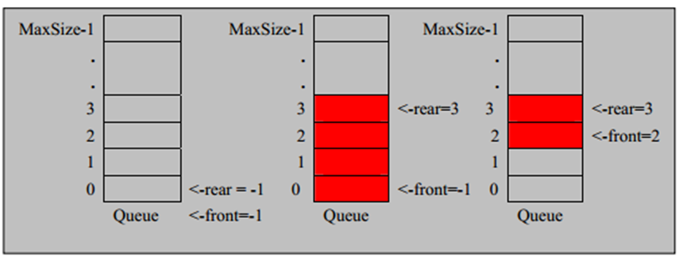
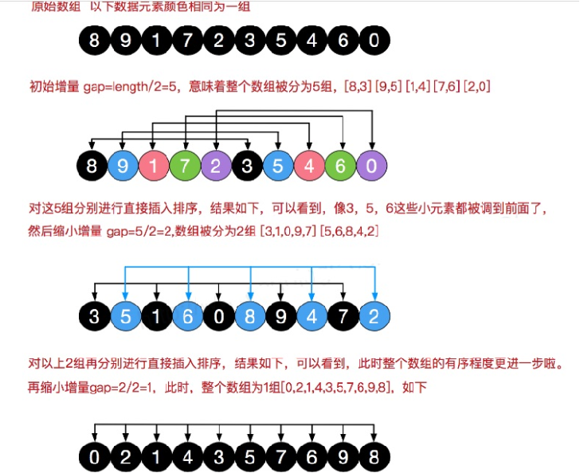
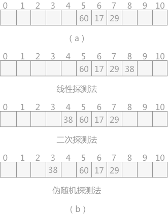
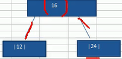
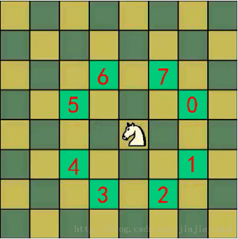

[toc]

# 1、数据结构与算法概述

数据结构：**数据与数据之间的结构关系（数组、队列、树、图等结构）**

算法：**解决问题的步骤**

总结：

1、程序 = 数据结构 + 算法 。数据是程序的中心。数据结构和算法两个概念间的逻辑关系贯穿了整个程序世界，首先二者表现为不可分割的关系。没有数据间的有机关系，程序根本无法设计。

2、数据结构与算法关系：数据结构是底层，算法高层。数据结构为算法提供服务。算法围绕数据结构操作。

3、解决问题（算法）需要选择正确的数据结构。例如：算法中经常需要对数据进行增加和删除用链表数据结构效率高，数组数据结构因为增加和删除需要移动数字每个元素所有效率低。


# 2、线性结构与非线性结构

## 1、线性结构

1) 线性结构作为最常用的数据结构，其特点是**数据元素之间存在一对一**的线性关系 

2) 线性结构有两种不同的存储结构，即**顺序存储结构(数组)和链式存储结构(链表**)，顺序存储的线性表称为顺序 表，顺序表中的**存储元素是连续**的 

3) 链式存储的线性表称为链表，链表中的**存储元素不一定是连续的**，**元素节点中存放数据元素以及相邻元素的地 址信息 。**

4) 线性结构常见的有：**数组、队列、链表和栈**，后面我们会详细讲解。

## 2、非线性结构

非线性结构包括：二维数组，多维数组，广义表，**树结构，图结构**


# 3、稀疏数组和队列

## 1、稀疏 sparsearray 数组

### 先看一个实际的需求：

​	编写的五子棋程序中，有存盘退出和续上盘的功能。


分析问题: 

​	因为该二维数组的很多值是默认值 0, 因此记录了**很多没有意义的数据**->**稀疏数组**。


### **基本介绍**

​	当一个数组中大部分元素为０，或者为同一个值的数组时，可以使用稀疏数组来保存该数组。

​	稀疏数组的处理方法是:

​		1)记录数组一共有几行几列，有多少个不同的值

​		2)把具有不同值的元素的行列及值记录在一个小规模的数组中，从而缩小程序的规模


### 代码实现

~~~java
/*
* 二维稀疏数组实现
* 初始化参数为一个正常的二维数组
* 可以通过toArray()方法转变成原数组
* */
public class SparseArray {
    private int column, row, num;//记录数组行数、列数、有几个非零值
    private int[][] data;

    public int getNum() {
        return num;
    }

    public int[][] getData() {
        return data;
    }

    public SparseArray(int[][] array) {
        this.row = array.length;
        this.column = array[0].length;
        this.num = 0;
        for (int i = 0; i < array.length; i++) {
            for (int j = 0; j < array[i].length; j++) {
                this.num += array[i][j] == 0 ? 0 : 1;
            }
        }
        int k = 0;
        this.data = new int[this.num][3];
        for (int i = 0; i < array.length; i++) {
            for (int j = 0; j < array[i].length; j++) {
                if (array[i][j] != 0) {
                    this.data[k][0] = i;
                    this.data[k][1] = j;
                    this.data[k++][2] = array[i][j];
                }
            }
        }
    }
    public int[][] toArray() {
        int[][] a = new int[this.row][this.column];
        for (int i = 0; i < this.num; i++)
            a[this.data[i][0]][this.data[i][1]] = this.data[i][2];
        return a;
    }

    //测试
    public static void main(String[] args) {
        int[][] a=new int[][]{
                {0,0,0,0,1},
                {0,0,0,1,0},
                {1,2,0,0,0}
        };
        SparseArray sparseArray = new SparseArray(a);
        for (int i = 0; i < a.length; i++) {
            System.out.println(Arrays.toString(a[i]));
        }
        for (int[] datum : sparseArray.getData()) {
            System.out.println(Arrays.toString(datum));
        }
        int[][] b = sparseArray.toArray();
        for (int[] ints : b) {
            System.out.println(Arrays.toString(ints));
        }
    }
}
~~~


## 2、队列

### 数组模拟队列思路 



队列本身是有序列表，若使用数组的结构来存储队列的数据，则队列数组的声明如下图, 其中 **maxSize 是该队** 

**列的最大容量。** 

因为队列的输出、输入是分别从前后端来处理，因此需要**两个变量 front 及 rear 分别记录队列前后端的下标**，**front 会随着数据输出而改变，而 rear 则是随着数据输入而改变**，如图所示。

当我们将数据存入队列时称为”addQueue”，addQueue 的处理需要有两个步骤：思路分析 

1) 将尾指针往后移：rear+1 , **当 front == rear 【空】** 

2) 若尾指针 rear 小于队列的最大下标 maxSize-1，则将数据存入 rear 所指的数组元素中，否则无法存入数据。 

**rear == maxSize - 1[队列满]**


问题分析并优化 

1) 目前数组使用一次就不能用， 没有达到复用的效果 

2) 将这个数组使用算法，改进成一个**环形的队列** 取模：%


### 环形队列

对前面的数组模拟队列的优化，充分利用数组. 因此将数组看做是一个环形的。(通过**取模的方式来实现**即可) 

分析说明： 

1) 尾索引的下一个为头索引时表示队列满，即将队列容量空出一个作为约定,这个在做判断队列满的时候需要注意 (rear + 1) % maxSize == front 满]，也可以用一个int类型变量来记录已经存入的值的个数。

2) rear == front [空] 


### 环形队列java代码

~~~ java
/*
* 实现队列
* 默认大小为128
* 可以设置最大值，但是只允许在初始化的时候设置
* front指向要出队列的元素
* rear指向要入队列的元素的后面，也就是其下标加1
* */
public class MyQueue {
    private int rear=0, front = 0;//rear永远指向最后加入队列的元素的下标+1，也就是下一个将要加入队列的元素的下标，front指向当前第一个元素的下标
    private int count = 0;
    private int maxSize = 128;
    private int[] data;
    private Object Exception;

    public int length() {
        return this.count;
    }

    public MyQueue() {
        this.data = new int[this.maxSize];
    }

    public MyQueue(int maxSize) {
        this.maxSize = maxSize;
        this.data = new int[maxSize];
    }

    public boolean isEmpty() {
        return this.count <= 0;
    }

    public boolean isFull() {
        return this.count >= this.maxSize;
    }

    public boolean push(int n) {
        if(this.isFull()){
            System.out.println(String.format("队列已满(%d)，不可插入新元素！", this.count));
            return false;
        }
        this.data[rear] = n;
        rear = (rear + 1) % this.maxSize;
        this.count++;
        return true;
    }

    public int index(int index) {
        try {
            if(index>this.maxSize) throw (Throwable) Exception;
            else if(this.front+this.count>=this.maxSize&&index<this.front&&index>this.rear) throw (Throwable) Exception;
            else if(index<this.front&&index>this.rear) throw (Throwable) Exception;
            return this.data[this.front + index];
        } catch (Throwable throwable) {
            System.err.println("下标不在合法范围内！");
            return 0;
        }
    }

    //仅获取头元素，不删除元素
    public int getHeadData() {
        try {
            if(this.isEmpty()) throw (Throwable) Exception;
            return this.data[this.front];
        } catch (Throwable throwable) {
            System.err.println("队列为空，返回默认值0");
            return 0;
        }
    }

    public int pop() {
        try {
            if(this.isEmpty()) throw (Throwable) Exception;
        } catch (Throwable throwable) {
            System.out.println("队列已空！返回默认值0");
            return 0;
        }

        int t = this.data[front];
        front = (this.front + 1) % this.maxSize;
        this.count--;
        return t;
    }

    public String toStirng() {
        if(this.isEmpty()) return "[]";
        StringBuilder s= new StringBuilder("[");
        for (int i = front; i < this.count + front; i++) {
            s.append(this.data[i % this.maxSize]).append(i == this.count + front - 1 ? "]" : ",");
        }
        return s.toString();
    }


    public static void main(String[] args) {
        MyQueue myQueue = new MyQueue(3);
        myQueue.push(1);
        myQueue.push(2);
        myQueue.push(3);
        System.out.println(myQueue.toStirng());
        System.out.println(myQueue.isFull());
        System.out.println(myQueue.isEmpty());
        myQueue.push(2);
        System.out.println(myQueue.pop());
        myQueue.push(99);
        System.out.println(myQueue.toStirng());
        System.out.println(Arrays.toString(myQueue.data));
    }
}
~~~


# 4、链表（Link List）


## 1、单链表

链表是有序的列表，但是它在内存中是存储如下


小结:

- ​	链表是以节点的方式来存储,是链式存储

- ​	每个节点包含 data 域， next 域：指向下一个节点.

- ​	如图：**发现链表的各个节点不一定是连续存储.**

- ​	链表分带头节点的链表和没有头节点的链表，根据实际的需求来确定

    

单链表(带头结点) 逻辑结构示意图如下


头结点的作用：在数据的开始处插入新节点时，如果不使用头结点，就要改变头指针，并且，更重要的是，当链表为空时，还要对头指针做判空操作，否则可能报异常，有了头结点，则头指针总是非空。


java代码实现（包括链表反转、链表从尾到头遍历）

~~~ java
package 数据结构;

import com.sun.org.apache.bcel.internal.generic.LNEG;

import java.util.Comparator;
import java.util.LinkedList;
import java.util.Stack;

public class MyLinkList<T> {

    private LinkNode head = new LinkNode(null);

    class LinkNode {
        T data;
        LinkNode next;

        public LinkNode(T data) {
            this.data = data;
        }
    }

    //在链表末尾添加元素
    public void add(T t) {
        LinkNode temp = this.head;
        while (temp.next != null) temp = temp.next;
        temp.next = new LinkNode(t);
    }

    //在链表头部添加元素
    public void addHead(T t1) {
        LinkNode newData = new LinkNode(t1);
        LinkNode t = this.head.next;
        this.head.next = newData;
        newData.next = t;
    }

    //在指定元素前插入元素,in是指定元素,data是要插入的元素
    public boolean addBefore(T in, T data) {
        LinkNode temp = this.head;

        //遍历链表，找到后代元素是指定元素的节点
        while (temp.next != null && temp.next.data.equals(in)) temp = temp.next;

        if (temp.next == null) return false;//指定的元素不在链表内

        LinkNode t2 = temp.next;

        LinkNode t3 = new LinkNode(data);

        temp.next = t3;

        t3.next = t2;

        return true;
    }

    //在指定位置插入元素
    public boolean addByIndex(int index, T data) {
        LinkNode temp = this.head;

        //找到第index-1个元素
        while (temp.next != null && index > 0) {
            temp = temp.next;
            index--;
        }

        //第index个节点刚好是末尾节点的next，就等于在末尾添加一个元素
        if (temp.next == null && index == 0) {
            temp.next = new LinkNode(data);
            return true;
        }

        //还没到第index个元素，链表就已经到头了，说明index超出范围
        if (temp.next == null) return false;

        //index为一般节点，在第index-1后面插入新节点
        LinkNode t1 = temp.next;
        LinkNode t2 = new LinkNode(data);
        temp.next = t2;
        t2.next = t1;
        return true;
    }

    //获取链表长度
    public int length() {
        LinkNode temp = this.head;
        int count = 0;
        while (temp.next != null) {
            count++;
            temp = temp.next;
        }
        return count;
    }

    //获取指定元素下标
    public int getIndex(T data) {
        LinkNode temp = this.head;
        int c = 0;
        while (temp.next != null) {
            if (temp.data.equals(data)) return c;
            c++;
            temp = temp.next;
        }
        return -1;
    }

    //获取第Index个元素数据
    public T get(int index) {
        if (index > this.length()) return null;
        LinkNode temp = this.head;
        while (temp.next != null && index >= 0) {
            temp = temp.next;
            index--;
        }
        return temp.data;
    }

    //根据下标获取节点，是节点而非数据
    private LinkNode getNode(int index) {
        LinkNode linkNode = getFatherNode(index);
        return linkNode == null ? null : linkNode.next;
    }

    //根据下标获取其父节点，是节点而非数据
    private LinkNode getFatherNode(int index) {
        if (index > this.length()) return null;
        LinkNode temp = this.head;
        while (temp.next != null && index > 0) {
            temp = temp.next;
            index--;
        }
        return temp;
    }

    //根据元素获取节点
    private LinkNode getNode(T data) {
        LinkNode t = getFatherNode(data);
        if (t == null) return null;
        return t.next;
    }

    //根据元素获取父节点
    public LinkNode getFatherNode(T data) {
        LinkNode temp = this.head;
        while (temp.next != null) {
            if (temp.next.data.equals(data)) {
                return temp;
            }
            temp = temp.next;
        }
        return null;
    }

    //移除第index个元素
    public boolean remove(int index) {
        LinkNode father = getFatherNode(index);
        if (father == null || father.next == null) {
            return false;
        }
        father.next = father.next.next;
        return true;
    }

    //移除第一个data为的元素
    public boolean remove(T data) {
        LinkNode father = getFatherNode(data);
        if (father == null) return false;
        father.next = father.next.next;
        return true;
    }

    //修改第index个元素
    public boolean update(int index, T newData) {
        LinkNode in = getNode(index);
        if (in == null) return false;
        in.data = newData;
        return true;
    }

    //修改值为data的元素
    public boolean update(T data, T newData) {
        LinkNode in = getNode(data);
        if (in == null) return false;
        in.data = newData;
        return true;
    }

    public String toString() {
        StringBuilder s = new StringBuilder("[");
        LinkNode temp = this.head;
        if (temp.next == null) {
            s.append("]");
            return s.toString();
        } else {
            temp = temp.next;
            s.append(temp.data.toString());
        }
        while (temp.next != null) {
            temp = temp.next;
            s.append(",").append(temp.data.toString());
        }
        s.append("]");
        return s.toString();
    }

    //交换两个节点的位置
    public boolean exchange(int index1, int index2) {
        //index1==index2直接返回
        if (index1 == index2) return true;

        LinkNode n1 = this.getFatherNode(index1);
        LinkNode n2 = this.getFatherNode(index2);
        if (n1.next == null || n2.next == null) return false;//index的值超出范围

        LinkNode i1 = n1.next;
        LinkNode i2 = n2.next;
        LinkNode son1 = n1.next.next;
        LinkNode son2 = n2.next.next;

        //要求交换的节点是相邻节点
        if (index1 - index2 == 1 || index1 - index2 == -1) {
            n1.next = i2;
            i2.next = i1;
            i1.next = son2;
            return true;
        }

        //不是相邻节点
        n1.next = i2;
        i2.next = son1;
        n2.next = i1;
        i1.next = son2;

        return true;
    }

    //有参排序
    public void sort(Comparator<T> comparator) {
        LinkNode temp = this.head;
        LinkNode t2 = this.head;
        LinkNode t = null;

        while (temp.next != null) {
            LinkNode tempFather=temp;//记录temp节点的父节点,方便后面的位置交换
            LinkNode old = temp;//记录临时节点的父节点
            LinkNode maxFather = temp;//记录最大值节点的父节点
            temp = temp.next;

            LinkNode maxNode = temp;//当前的最大值节点
            t2 = temp;//循环的临时节点

            while (t2 != null) {
                if (comparator.compare(t2.data,maxNode.data)<0) {
                    //记录下更大值
                    maxNode = t2;
                    maxFather = old;
                }
                old=t2;
                t2 = t2.next;
            }

            //将最大值节点与当前第一个节点为止交换
            if(maxNode==temp) continue;
            if(temp.next==maxNode){//相邻节点交换
                LinkNode son = maxNode.next;
                tempFather.next = maxNode;
                maxNode.next = temp;
                temp.next = son;
                //对temp作出调整
                temp = maxNode;
                continue;
            }

            LinkNode maxSon = maxNode.next;
            LinkNode tempSon = temp.next;
            tempFather.next = maxNode;
            maxNode.next = tempSon;
            maxFather.next=temp;
            temp.next = maxSon;
            //对temp作出调整
            temp = maxNode;
        }
    }

    //无参排序
    public void sort() {
        this.sort(new Comparator<T>() {
            @Override
            public int compare(T o1, T o2) {
                if (o1 instanceof Integer) {
                    return (int) ((Integer) o1 - (Integer) o2);
                } else if (o1 instanceof String) {
                    return ((String) o1).compareTo((String) o2);
                } else return o1.toString().compareTo(o2.toString());
            }
        });
    }

    //查找单链表中的倒数第k个结点【新浪面试题】思路
    //1.编写一个方法,接收head节点,同时接收一个index
    //2. index表示是倒数第index个节点
    //3.先把链表从头到尾遍历,得到链表的总的长度getLength
    //4.得到size 后，我们从链表的第一个开始遍历(size-index)个，就可以得到
    //5。如果找到了,则返回该节点,否则返回null1
    public T getLast(int index) {
        //检查index的合法性，必须在(0,length]内
        if(this.head.next==null||index<=0) return null;
        int length = this.length();
        if(index>length) return null;

        LinkNode temp = head;
        int n = length - index;
        while (n>=0) {
            temp = temp.next;
            n--;
        }
        return temp.data;
    }

	//单链表反转(重要！！)
    public void reverse() {
        //如果链表为空或者只有一个节点，无需反转
        if (this.head.next == null || this.head.next.next == null){ return;}


        LinkNode temp = this.head.next;

        //新建一个节点
        LinkNode re = new LinkNode(null);

        while (temp!= null) {
            //下一次向下移动的位置
            LinkNode temp2 = temp.next;

            //把当前遍历到的节点放在re的后面
            LinkNode t = re.next;
            re.next = temp;
            temp.next = t;

            //指针后移
            temp = temp2;
        }

        //新的头节点
        this.head = re;
    }

    //使用stack使得从尾到头打印
    public String toStringTailToHead() {
        if(this.head.next==null) return "[]";
        int l = this.length();
        StringBuilder s = new StringBuilder();
        LinkNode temp = this.head.next;
        Stack<T> stack = new Stack<>();

        while (temp != null) {
            stack.push(temp.data);
            temp = temp.next;
        }

        s.append("["+stack.pop().toString());

        while (!stack.empty()) {
            s.append(","+stack.pop().toString());
        }

        s.append("]");

        return s.toString();
    }

    public static void main(String[] args) {
        MyLinkList<Integer> linkList = new MyLinkList();

        for (int i = 0; i < 10; i++) {
            linkList.add(i);
        }

        System.out.println(linkList.toStringTailToHead());
    }
}
~~~

链表反转：

- 定义一个新节点
- 从头到尾遍历链表，把每次遍历到的节点加入到新节点的后面。


## 2、双向链表

### **双向链表的操作分析和思路**

管理单向链表的缺点分析:

1)  单向链表，查找的方向只能是一个方向，而双向链表可以向前或者向后查找。

2)  单向链表不能自我删除，需要靠辅助节点 ，而双向链表，则可以自我删除，所以前面我们单链表删除时节点，总是找到 temp,temp 是待删除节点的前一个节点(认真体会).

3)  分析了双向链表如何完成遍历，添加，修改和删除的思路

  

**对上图的说明**: 

分析 双向链表的遍历，添加，修改，删除的操作思路===》代码实现 

1) **遍历** 方和 单链表一样，只是可以向前，也可以向后查找 

2) **添加** (默认添加到双向链表的最后) 

​		(1) 先找到双向链表的最后这个节点 

​		(2) temp.next = newHeroNode 

​		(3) newHeroNode.pre = temp; 

3) **修改** 思路和 原来的单向链表一样. 

4) **删除**

​		(1) 因为是双向链表，因此，我们可以实现自我删除某个节点 

​		(2) 直接找到要删除的这个节点，比如 temp 

​				(3) temp.pre.next = temp.next 

​				(4) temp.next.pre = temp.pre; 


## 2、java代码实现

~~~java
package 数据结构;

import java.util.Comparator;

/*
 * 双向链表的实现
 * */
public class MyDoublyLinkedList<T> {
    LNode head = new LNode(null);

    private class LNode {
        T data;
        LNode next, pre;

        public LNode(T data) {
            this.data = data;
        }
    }

    /*
     * 在链表末尾增加节点
     * */
    public void add(T newData) {
        //先找到最后一个节点
        LNode temp = this.head;
        while (temp.next != null) temp = temp.next;

        //新建一个节点存放数据，数据last指向temp,temp的next指向新节点
        LNode newNode = new LNode(newData);
        newNode.pre = temp;
        temp.next = newNode;
    }

    /*
     * 按照下标删除某个节点
     * */
    public boolean deleteIndexOf(int index) {
        LNode temp = getIndex(index);
        if(temp==null) return false;

        //删除节点
        temp.pre.next = temp.next;

        //如果不是最后一个节点的话，就要把index的下一个的节点的pre指向index的上一个节点
        if (temp.next != null) {
            temp.next.pre = temp.pre;
        }

        return true;
    }

    /*
     * 根据下标修改节点数据
     * */
    public boolean updateIndexOf(int index, T newData) {
        LNode temp = this.getIndex(index);
        if(temp==null) return false;

        temp.data = newData;
        return true;
    }

    /*
    * 遍历链表
    * */
    public String toString() {
        if (this.head.next == null) {
            return "[]";
        }

        LNode temp = this.head.next;

        String s = "[" + temp.data.toString();

        temp = temp.next;
        while (temp != null) {
            s += "," + temp.data.toString();
            temp = temp.next;
        }
        return s + "]";
    }

    //根据下标获取节点
    private LNode getIndex(int index) {
        LNode temp = this.head;
        while (index >= 0 && temp.next != null) {
            temp = temp.next;
            index--;
        }
        if(temp.next==null&&index>0) return null;//下标超出限制
        return temp;
    }

    /*
     * 如果T是Integer或者String的话可以按照大小添加
     * 利用构造比较器实现
     * */
    public boolean addByOrder(T nd) {
        final boolean[] b = {true};
        //构造一个比较器
        Comparator<T> comparator = new Comparator<T>() {
            @Override
            public int compare(T o1, T o2) {
                if (o1 instanceof Integer)
                    return (Integer) o1 - (Integer) o2;
                else if (o1 instanceof Long)
                    return (Long) o1 > (Long) o2 ? 1 : -1;
                else if(o1 instanceof Character)
                    return ((Character) o1).compareTo((Character) o2);
                else if(o1 instanceof String)
                    return ((String) o1).compareTo((String) o2);
                else {
                    b[0] =false;
                    return 1;
                }
            }
        };

        if(!b[0]) return false;

        LNode temp = this.head.next;
        LNode newNode = new LNode(nd);
        //找到第一个比nd大的元素
        while (temp.next != null) {
            if(comparator.compare(nd,temp.data)<0)break;//nd<temp.data
            temp = temp.next;
        }
        //没有比nd大的元素
        if (temp.next == null) {
            temp.next = newNode;
            newNode.pre = temp;
            return true;
        }

        //把比nd大的节点放在nd的后面
        newNode.next = temp;
        newNode.pre = temp.pre;
        temp.pre = newNode;
        newNode.pre.next = newNode;
        return true;
    }

    public static void main(String[] args) {
        MyDoublyLinkedList<Integer> linkedList = new MyDoublyLinkedList<>();

        for (int i = 0; i < 10; i++) {
            linkedList.add(i);
        }

        linkedList.addByOrder(new Integer(3));

        System.out.println(linkedList.toString());
    }
}
~~~


## 3、单向环形链表应用之环形链表

Josephu(约瑟夫、约瑟夫环) 问题

Josephu 问题为：设编号为 1，2，… n 的 n 个人围坐一圈，约定编号为 k（1<=k<=n）的人从 1 开始报数，数到 m 的那个人出列，它的下一位又从 1 开始报数，数到 m 的那个人又出列，依次类推，直到所有人出列为止，由此产生一个出队编号的序列。 

解决方法：循环链表

提示：用一个**不带头结点的循环链表**来处理 Josephu 问题：先构成一个有 n 个结点的单循环链表，然后由 k 结点起从 1 开始计数，计到 m 时，对应结点从链表中删除，然后再从被删除结点的下一个结点又从 1 开始计数，直到最后一个结点从链表中删除算法结束。


举例：

Josephu 问题为：设编号为1，2，… n的n个人围坐一圈，约定编号为k（1<=k<=n）的人从1开始报数，数到m 的那个人出列，它的下一位又从1开始报数，数到m的那个人又出列，依次类推，直到所有人出列为止，由此产生一个出队编号的序列。

n = 5 , 即有5个人 

k = 1, 从第一个人开始报数

m = 2, 数2下


思路：


**构建**一个单向的环形链表思路

1. 先创建第一个节点, 让 first 指向该节点，并形成环形

2. 后面当我们每创建一个新的节点，就把该节点，加入到已有的环形链表中即可.

    ```java
    public void add(int nums) {
        if(nums<=0){
            System.out.println("n的数字太小！");
            return;
        }
    
        //第一个小孩单独添加，因为没有头结点
        this.first = new Node(1);
        this.first.next = this.first;
        Node curBoy = this.first;
    
        //每一次都新建一个节点nd，然后让curboy.next指向nd,然后nd.next指向first,然后curboy后移：=nd
        for (int i = 2; i <= nums; i++) {
            Node nd = new Node(i);
            curBoy.next=nd;
            nd.next = this.first;
            curBoy = nd;
        }
    }
    ```

**遍历**环形链表

1. 先让一个辅助指针(变量) curBoy，指向first节点

2. 然后通过一个while循环遍历 该环形链表即可 curBoy.next == first 结束

    ```java
    //遍历链表，并返回字符串
    public String toString() {
        if(first==null) return "[]";
    
        Node temp = this.first;
        Node curBoy = this.first;
        StringBuilder s = new StringBuilder();
    
        //为了好看，第一个节点单独输出，可以把它放入循环中
        s.append("[").append(temp.data);
        temp = temp.next;
    
        while (temp!=curBoy) {//每一次输出temp，当temp==curboy时，说明已经遍历到了first节点
            s.append(",").append(temp.data);
            temp = temp.next;
        }
    ```


根据用户的输入，生成一个小孩出圈的顺序

n = 5 , 即有5个人；k = 1, 从第一个人开始报数；m = 2, 数2下

1. 需求创建一个辅助指针(变量) helper , 事先应该指向环形链表的最后这个节点.

补充： 小孩报数前，先让 first 和 helper 移动 k - 1次

2. 当小孩报数时，让first 和 helper 指针同时 的移动 m - 1 次

3. 这时就可以将first 指向的小孩节点 出圈

    first = first .next 

    helper.next = first 

原来first 指向的节点就没有任何引用，就会被回收

出圈的顺序：2->4->1->5->3

约瑟夫问题代码实现：

~~~java
package 数据结构;
/*
* 环形链表之约瑟夫问题
* */
public class LinkListLoop {
    /*
    * 用户输入：
    *   n：人数
    *   k：从第k个人开始报数
    *   m：数m下
    * */

    Node first;


    static private class Node{
        int data;
        Node next;

        public Node(int data) {
            this.data = data;
        }
    }

    public LinkListLoop() {}

    public void add(int nums) {
        if(nums<=0){
            System.out.println("n的数字太小！");
            return;
        }

        //第一个小孩单独添加，因为没有头结点
        this.first = new Node(1);
        this.first.next = this.first;
        Node curBoy = this.first;

        //每一次都新建一个节点nd，然后让curboy.next指向nd,然后nd.next指向first,然后curboy后移：=nd
        for (int i = 2; i <= nums; i++) {
            Node nd = new Node(i);
            curBoy.next=nd;
            nd.next = this.first;
            curBoy = nd;
        }
    }

    //遍历链表，并返回字符串
    public String toString() {
        if(first==null) return "[]";

        Node temp = this.first;
        Node curBoy = this.first;
        StringBuilder s = new StringBuilder();

        //为了好看，第一个节点单独输出，可以把它放入循环中
        s.append("[").append(temp.data);
        temp = temp.next;

        while (temp!=curBoy) {//每一次输出temp，当temp==curboy时，说明已经遍历到了first节点
            s.append(",").append(temp.data);
            temp = temp.next;
        }

        return s + "]";
    }

    //根据下标获取节点
    private Node IndexOf(int index) {
        Node temp = this.first;
        while (index>0) {
            index--;
            temp = temp.next;
        }
        return temp;
    }

    //获取长度
    public int length() {
        if (this.first == null) {
            return 0;
        }
        Node temp = this.first;
        int n=1;
        while (temp.next != this.first) {
            temp = temp.next;
            n++;
        }
        return n;
    }
	//运行约瑟夫问题，参数时k（第几个开始）,m（数到几结束）
    public void Joseph(int k, int m) {
        if(this.first==null) return;
        k--;
        int n = m;
        Node temp = this.IndexOf(k);
        while (temp.next != temp) {
            Node t = temp;
            temp = temp.next;
            n--;
            if (n <= 1) {
                System.out.println(temp.data);
                n = m + 1;
                t.next = temp.next;
            }
        }
        System.out.println(temp.data);
    }

    public static void main(String[] args) {
        LinkListLoop linkListLoop = new LinkListLoop();
        linkListLoop.add(5);
        System.out.println(linkListLoop.toString());
        linkListLoop.Joseph(1,2);
    }
}
~~~


# 5、栈（Stack）

## 栈的介绍

- 栈是一个**先入后出(FILO-First In Last Out)**的有序列表。 
- 栈(stack)是限制线性表中元素的插入和删除**只能在线性表的同一端进行**的一种特殊线性表。允许插入和删除的 一端，为变化的一端，称为**栈顶**(Top)，另一端为固定的一端，称为栈底(Bottom)。 
- 根据栈的定义可知，最先放入栈中元素在栈底，最后放入的元素在栈顶，而删除元素刚好相反，最后放入的元 素最先删除，最先放入的元素最后删除 5) 图解方式说明出栈(pop)和入栈(push)的概念


## 基本实现的代码

~~~java
public class Stack<T> {
    private int top = -1;
    private int maxSize = 128;
    private Object[] data;

    //判空与判满
    public boolean isEmpty() {
        return top == -1;
    }
    public boolean idFull() {
        return top == maxSize - 1;
    }

    /*
    * 构造器，可以设置大小，也可以不设置，默认128
    * */
    public Stack() {
        this.data = new Object[maxSize];
    }
    public Stack(int maxSize) {
        this.maxSize = maxSize;
    }

    //入栈
    public boolean push(T newData) {
        if(this.idFull()) return false;
        this.data[++top] = newData;
        return true;
    }

    //出栈
    public T pop() {
        if(this.isEmpty()) return null;
        return (T)this.data[top--];
    }

    //窥视栈
    public T Peek(){
        if(this.isEmpty()) return null;
        return (T)this.data[top];
    }
}
~~~


## 栈的应用场景

1) 子程序的调用：在跳往子程序前，会先将下个指令的地址存到堆栈中，直到子程序执行完后再将地址取出，以 回到原来的程序中。 

2) 处理递归调用：和子程序的调用类似，只是除了储存下一个指令的地址外，也将参数、区域变量等数据存入堆 栈中。 

3) 表达式的转换[中缀表达式转后缀表达式]与求值(实际解决)。 

4) 二叉树的遍历。 

5) 图形的深度优先(depth 一 first)搜索法。


## 中序表达式

**使用栈完成表达式的计算 思路**

1. 通过一个 index 值（索引），来遍历我们的表达式

2. 如果我们**发现是一个数字****,** 就直接入数栈

3. 如果发现**扫描到是一个符号**,  就分如下情况

    3.1 如果发现当前的符号栈为 空，就直接入栈

    3.2 如果符号栈有操作符，就进行比较,如**果当前的操作符的优先级小于或者等于栈中的操作符**， 就需要从数栈中pop出两个数,在从符号栈中pop出一个符号，进行运算，将得到结果，入数栈，然后将当前的操作符入符号栈， 如**果当前的操作符的优先级大于栈中的操作符， 就直接入符号栈**

**4.** **当表达式扫描完毕，就顺序的从 数栈和符号栈中 pop出相应的数和符号，并运行**

**5.** **最后在数栈只有一个数字，就是表达式的结果**

中序表达式在处理有括号的公式时很不方便，一般转成其它表达式计算，大多是后缀表达式。

没有括号的中序表达式计算实现：

```java
class Middle{
    public static float calculater(String mgs) {
        char temp;
        Stack<Float> num = new Stack<>();
        Stack<Character> cs = new Stack<>();
        char[] gs = mgs.toCharArray();
        int i=0;
        while (i<gs.length){
            temp = gs[i++];
            int x = what(temp);
            if(x==0)break;

            if(x==1){
                float t = temp - '0';
                while (i<gs.length&&what(gs[i])==1){
                    t = t * 10 + (gs[i] - '0');
                    i++;
                }
                num.push(t);
            }
            else {
                if(cs.isEmpty()) cs.push(temp);
                else if(Compare(temp,cs.Peek())<=0){
                    float a = num.pop();
                    float b = num.pop();
                    //b是后出栈的，所以如果计算减法除法的话，被减数或者被除数都是b
                    num.push(CalculatorIt(b, a, cs.pop()));
                    cs.push(temp);
                }else {
                    cs.push(temp);
                }
            }
        }

        while (!cs.isEmpty()&&!num.isEmpty()){
            float a = num.pop();
            float b = num.pop();
            //b是后出栈的，所以如果计算减法除法的话，被减数或者被除数都是b
            num.push(CalculatorIt(b, a, cs.pop()));
        }

        return num.Peek();

    }

    //    根据符号与两个数，返回运算结果
    public static float CalculatorIt(float a, float b, char op) {
        switch (op){
            case '+':return a+b;
            case '-':return a-b;
            case '*':return a*b;
            case '/':return a/b;
            default:return 0;
        }
    }

    //比较两个符号优先级大小
    public static int Compare(char temp,char top) {
        return getGrade(temp) - getGrade(top);
    }

    //判别符号优先级，0为最小
    public static int getGrade(char temp) {
        if(temp=='+'||temp=='-')return 0;
        else if(temp=='*'||temp=='/')return 1;
        else return -1;
    }

    //    分辨输入的符号是数字还是运算符，是数字返回1，运算符返回-1，什么都不是返回0
    public static int what(char c) {
        if(c>='0'&&c<='9')return 1;
        if(c == '+' || c == '*' || c == '-' || c == '/')return -1;
        return 0;
    }
}
```


## 前缀表达式

前缀表达式的计算机求值

从右至左扫描表达式，遇到数字时，将数字压入堆栈，遇到运算符时，弹出栈顶的两个数，用运算符对它们做相应的计算（栈顶元素 和 次顶元素），并将结果入栈；重复上述过程直到表达式最左端，最后运算得出的值即为表达式的结果

例如: (3+4)×5-6 对应的前缀表达式就是 - × + 3 4 5 6 , 针对前缀表达式求值步骤如下:

1. 从右至左扫描，将6、5、4、3压入堆栈
2. 遇到+运算符，因此弹出3和4（3为栈顶元素，4为次顶元素），计算出3+4的值，得7，再将7入栈
3. 接下来是×运算符，因此弹出7和5，计算出7×5=35，将35入栈
4. 最后是-运算符，计算出35-6的值，即29，由此得出最终结果


## 逆波兰表达式（后缀）

后缀表达式的计算机求值

从左至右扫描表达式，遇到数字时，将数字压入堆栈，遇到运算符时，弹出栈顶的两个数，用运算符对它们做相应的计算（次顶元素 和 栈顶元素），并将结果入栈；重复上述过程直到表达式最右端，最后运算得出的值即为表达式的结果

例如: (3+4)×5-6 对应的后缀表达式就是 3 4 + 5 × 6 - , 针对后缀表达式求值步骤如下:

1. 从左至右扫描，将3和4压入堆栈；
2. 遇到+运算符，因此弹出4和3（4为栈顶元素，3为次顶元素），计算出3+4的值，得7，再将7入栈；将5入栈；
3. 接下来是×运算符，因此弹出5和7，计算出7×5=35，将35入栈；将6入栈；
4. 最后是-运算符，计算出35-6的值，即29，由此得出最终结果


为了说明方便，逆波兰表达式的每个数字或者符号之间需要使用空格隔开。

```java
/*
* 逆波兰计算器，借助后缀表达式计算
* 支持小数计算，计算负数会出问题
* */
class ReversePoland{
    public static void main(String[] args) {
        ReversePoland reversePoland = new ReversePoland();
        System.out.println(reversePoland.calculator("3 4　+ 5 * 6 -"));
    }
//    计算
    public float calculator(String s){
        Stack<Float> stack = new Stack<>();

        char[] gs = s.toCharArray();
        int i = 0;

        while (i<gs.length){
            char temp = s.charAt(i++);
            //空格
            if (temp==' ') continue;
            //运算符
            if(isOp(temp)){
                float a = stack.pop();
                float b = stack.pop();
                stack.push(CalculatorIt(b, a, temp));
            }

            //处理数字
            if(temp<='9'&&temp>='0'){
                //多位数
                int t=i-1;
                for(;i<gs.length&&((gs[i]<='9'&&gs[i]>='0')||gs[i]=='.');i++);
                stack.push(Float.parseFloat(s.substring(t, i)));
            }
        }

        return stack.pop();
    }

    //判断是不是运算符
    private boolean isOp(char t) {
        return t == '+' || t == '-' || t == '*' || t == '/';
    }

    //    根据符号与两个数，返回运算结果
    public static float CalculatorIt(float a, float b, char op) {
        switch (op){
            case '+':return a+b;
            case '-':return a-b;
            case '*':return a*b;
            case '/':return a/b;
            default:return 0;
        }
    }
}
```


做了一些改良，计算负数也没问题，

```java
/*
* 逆波兰计算器，借助后缀表达式计算
* 支持小数计算
* 可以通过由空格分离的后缀表达式字符串计算
* 也可以通过分离后的字符串数组计算
* */
class ReversePoland{
    //计算
    public float calculatorByString(String s) {
        return this.calculator(s.split(" "));
    }

    public float calculator(String[] st){
        Stack<Float> stack = new Stack<>();

        int i = 0;

        while (i<st.length){
            String si = st[i++];
            if((si.length()==2&&isOp(si.charAt(1)))||(si.length()==1&&isOp(si.charAt(0)))){
                float a = stack.pop();
                float b = stack.pop();
                stack.push(CalculatorIt(b, a, si.charAt(si.length()==1?0:1)));
            }else {
                try {
                    stack.push(Float.parseFloat(si));
                } catch (NumberFormatException e) {
                    System.out.println("公式出错！");
                    e.printStackTrace();
                }
            }
        }

        return stack.pop();
    }

    //判断是不是运算符
    private boolean isOp(char t) {
        return t == '+' || t == '-' || t == '*' || t == '/';
    }

    //    根据符号与两个数，返回运算结果
    public static float CalculatorIt(float a, float b, char op) {
        switch (op){
            case '+':return a+b;
            case '-':return a-b;
            case '*':return a*b;
            case '/':return a/b;
            default:return 0;
        }
    }
}
```


## 中缀转后缀

具体步骤如下:

1. 初始化两个栈：运算符栈s1和储存中间结果的栈s2；

2. 从左至右扫描中缀表达式；

3. 遇到操作数时，将其压s2；

4. 遇到运算符时，比较其与s1栈顶运算符的优先级：

    1. 如果s1为空，或栈顶运算符为左括号“(”，则直接将此运算符入栈；
    2. 否则，若优先级比栈顶运算符的高，也将运算符压入s1；
    3. 否则，将s1栈顶的运算符弹出并压入到s2中，再次转到(4-1)与s1中新的栈顶运算符相比较；

5. 遇到括号时：

    (1) 如果是左括号“(”，则直接压入s1

    (2) 如果是右括号“)”，则依次弹出s1栈顶的运算符，并压入s2，直到遇到左括号为止，此时将这一对括号丢弃

6. 重复步骤2至5，直到表达式的最右边

7. 将s1中剩余的运算符依次弹出并压入s2

8. 依次弹出s2中的元素并输出，结果的逆序即为中缀表达式对应的后缀表达式

    

    ```java
        public static void main(String[] args) {
            MidToAfter midToAfter = new MidToAfter();
            String after = midToAfter.Conversion("2.1+3*(4-5)");
            float result = new ReversePoland().calculatorByString(after);
            System.out.println(String.format("%.3f",result));
        }
    
    /*
    * 中缀转后缀
    * 输入是一个中序表达式例如：2+3*(4-5)
    * 输出是一个用空格分割的后续表达式字符串
    * */
    class MidToAfter{
        public String Conversion(String mid) {
            List<String> list = this.segmentation(mid);
    
            Stack<String> s2 = new Stack<>();
            Stack<Character> s1 = new Stack<>();
    
            for (int i = 0; i < list.size(); i++) {
                String ts = list.get(i);
                //运算符或者括号
                if(ts.length()==1&&!isNum(ts.charAt(0))){
                    if(ts.equals("(")){
                        s1.push(ts.charAt(0));
                    }else if(ts.equals(")")){
                        while (!s1.isEmpty()&&s1.Peek()!='('){
                            s2.push(s1.pop()+"");
                        }
                        if(!s1.isEmpty()) s1.pop();
                    }else {
                        while ( !( (s1.isEmpty()||s1.Peek()=='(') ||  getOpPriority(ts.charAt(0))>getOpPriority(s1.Peek()) ) ){
                            s2.push(s1.pop()+"");
                        }
                        s1.push(ts.charAt(0));
                    }
                }else {//操作数，直接入栈
                    s2.push(ts);
                }
            }
    
            while (!s1.isEmpty()){
                s2.push(s1.pop() + "");
            }
    
            //逆序
            Stack<String> s3 = new Stack();
            while (!s2.isEmpty()) s3.push(s2.pop());
    
            StringBuilder rs = new StringBuilder();
            rs.append(s3.pop());
            while (!s3.isEmpty())
                rs.append(" "+s3.pop());
    
            return rs.toString();
        }
    
        //获取操作符的优先级
        private int getOpPriority(char c){
            switch (c){
                case '+':
                case '-':
                    return 1;
                case '*':
                case '/':
                    return 2;
                case '^':
                    return 3;
                default:
                    return 0;
            }
        }
    
        public List<String> segmentation(String mid){
            //将表达式中的每一个元素分离出来按顺序单独存放，例如（ + 2.3都单独存放
            ArrayList<String> list = new ArrayList<>();
            for (int i = 0; i < mid.length(); i++) {
                char t = mid.charAt(i);
    
                String num = "";
    
                //负数,先判定是不是负数：负号后面是数字，前面不是数字
                //如果是负数，就在num字符串上先添加一个"-"，i加一，t也随之向后挪动
                if(t=='-' &&(i+1<mid.length()&&isNum(mid.charAt(i+1)))&&(i>0&&!isNum(mid.charAt(i-1)))){
                    num += '-';
                    t = mid.charAt(++i);
                }
                //数字
                if (isNum(t)) {
                    int j = i;
                    while (isNum(mid.charAt(i))||mid.charAt(i)=='.') i++;
                    num += mid.substring(j, i);
                    list.add(num + "");
                    i--;
                }else {//符号，例如加减乘除括号等
                    list.add(t + "");
                }
            }
            return list;
        }
    
    
        public boolean isNum(char t) {
            return t >= '0' && t <= '9';
        }
    }
    ```


# 6、递归

递归，简单来说就是自己调用自己

简单举例：输出1-n的数

```java
public static void test(int n) {
    if(n>=2) test(n - 1);
    System.out.println("n = " + n);
}

public static void main(String[] args) {
    test(10);
}
```

递归调用规则：
1. 当程序执行到一个方法时，就会开辟一个独立的空间(栈)

2. 每个空间的数据(局部变量)，是独立的.


递归用于解决什么样的问题

1. 各种数学问题如: 8皇后问题 , 汉诺塔, 阶乘问题, 迷宫问题, 球和篮子的问题(google编程大赛)
2. 各种算法中也会使用到递归，比如快排，归并排序，二分查找，分治算法等.
3. 将用栈解决的问题-->第归代码比较简洁

递归需要遵守的重要规则

1. 执行一个方法时，就创建一个新的受保护的独立空间(栈空间)
2. 方法的局部变量是独立的，不会相互影响, 比如n变量
3. 如果方法中使用的是引用类型变量(比如数组)，就会共享该引用类型的数据.
4. 递归必须向退出递归的条件逼近，否则就是无限递归,出现StackOverflowError，死龟了:)
5. 当一个方法执行完毕，或者遇到return，就会返回，遵守谁调用，就将结果返回给谁，同时当方法执行完毕或者返回时，该方法也就执行完毕。


## 迷宫问题


说明: 

1. 小球得到的路径，和程序员设置的找路策略有关即：找路的上下左右的顺序相关
2. 再得到小球路径时，可以先使用(下右上左)，再改成(上右下左)，看看路径是不是有变化
3. 测试回溯现象
4. 思考: 如何求出最短路径? 

```java
/**
 * 迷宫问题
 */
class Maze {
    public static void main(String[] args) {
        Maze maze = new Maze();
    }

    public Maze() {
        // 先创建一个二维数组，模拟迷宫
        // 地图
        int[][] map = new int[8][7];
        // 使用 1 表示墙
        // 上下全部置为 1
        for (int i = 0; i < 7; i++) {
            map[0][i] = 1;
            map[7][i] = 1;
        }

        // 左右全部置为 1
        for (int i = 0; i < 8; i++) {
            map[i][0] = 1;
            map[i][6] = 1;
        }

        //设置挡板, 1 表示
        map[3][1] = 1;
        map[3][2] = 1;

        // 输出地图 System.out.println("地图的情况");
        for (int i = 0; i < 8; i++) {
            for (int j = 0; j < 7; j++) {
                System.out.print(map[i][j] + " ");
            }
            System.out.println();
        }

        //使用递归回溯给小球找路
        // setWay(map, 1, 1);
        setWay2(map, 1, 1);
        //输出新的地图, 小球走过，并标识过的递归
        System.out.println("小球走过，并标识过的 地图的情况");
        for (int i = 0; i < 8; i++) {
            for (int j = 0; j < 7; j++) {
                System.out.print(map[i][j] + " ");
            }
            System.out.println();
        }
    }

    //使用递归回溯来给小球找路 //说明
    // 1. map 表示地图
    // 2. i,j 表示从地图的哪个位置开始出发 (1,1)
    // 3. 如果小球能到 map[6][5] 位置，则说明通路找到.
    // 4. 约定： 当 map[i][j] 为 0 表示该点没有走过
    // 当为 1 表示墙 ；
    // 2 表示通路可以走 ；
    // 3 表示该点已经 走过，但是走不通
    // 5. 在走迷宫时，需要确定一个策略(方法) 下->右->上->左 , 如果该点走不通，再回溯

    /**
     * @param map 表示地图
     * @param i   表示从哪里开始找
     * @param j
     * @return 找到通路，返回true，否则返回false
     */
    public static boolean setWay(int[][] map, int i, int j) {
        if (map[6][5] == 2) { // 表示路已经找到了
            return true;
        } else {
            if (map[i][j] == 0) { // 0: 可以走还没有走
                // 这里开始递归回溯
                map[i][j] = 2; // 认为该点是可以走通,但是不一定
                if (setWay(map, i + 1, j)) { // 下找
                    return true;
                } else if (setWay(map, i, j + 1)) { // 右
                    return true;
                } else if (setWay(map, i - 1, j)) { // 上
                    return true;
                } else if (setWay(map, i, j - 1)) { // 左
                    return true;
                } else {// 走不通
                    map[i][j] = 3;
                    return false;
                }
            } else {
                //如果map(i)(j)!=0
                //则值 1,2,3
                return false;
            }
        }
    }


    //修改找路的策略，改成 上->右->下->左
    public static boolean setWay2(int[][] map, int i, int j) {
        if (map[6][5] == 2) {
            // 通路已经找到 ok
            return true;
        } else {
            if (map[i][j] == 0) {//如果当前这个点还没有走过
                // 按照策略 上->右->下->左
                map[i][j] = 2;
                // 假定该点是可以走通.
                if (setWay2(map, i - 1, j)) {
                    //向上走
                    return true;
                } else if (setWay2(map, i, j + 1)) { //向右走
                    return true;
                } else if (setWay2(map, i + 1, j)) { //向下
                    return true;
                } else if (setWay2(map, i, j - 1)) { // 向左走
                    return true;
                } else { //说明该点是走不通，是死路
                    map[i][j] = 3;
                    return false;
                }
            } else { // 如果 map[i][j] != 0 , 可能是 1， 2， 3
                return false;
            }
        }
    }
}
```

对迷宫问题的讨论 

1) 小球得到的路径，和程序员设置的**找路策略**有关即：找路的上下左右的顺序相关 

2) 再得到小球路径时，可以先使用(下右上左)，再改成(**上右下左**)，看看路径是不是有变化 

3) 测试回溯现象 

4) **思考**: 如何求出最短路径? 思路-》代码实现.


## 八皇后问题

八皇后问题介绍 
八皇后问题，是一个古老而著名的问题，是回溯算法的典型案例。该问题是国际西洋棋棋手马克斯·贝瑟尔于1848年提出：在8×8格的国际象棋上摆放八个皇后，使其不能互相攻击，即：任意两个皇后都不能处于同一行、同一列或同一斜线上，问有多少种摆法。


八皇后问题算法思路分析：

1. 第一个皇后先放第一行第一列
2. 第二个皇后放在第二行第一列、然后判断是否OK， 如果不OK，继续放在第二列、第三列、依次把所有列都放完，找到一个合适
3. 继续第三个皇后，还是第一列、第二列……直到第8个皇后也能放在一个不冲突的位置，算是找到了一个正确解
4. 当得到一个正确解时，在栈回退到上一个栈时，就会开始回溯，即将第一个皇后，放到第一列的所有正确解，全部得到.
5. 然后回头继续第一个皇后放第二列，后面继续循环执行 1,2,3,4的步骤 【示意图】
6. 说明：理论上应该创建一个二维数组来表示棋盘，但是实际上可以通过算法，用一个一维数组即可解决问题. arr[8] = {0 , 4, 7, 5, 2, 6, 1, 3} //对应arr 下标 表示第几行，即第几个皇后，arr[i] = val , val 表示第i+1个皇后，放在第i+1行的第val+1列

```java
/**
 * n后问题
 * n表示有几个皇后
 */
class Queue8 {

    //定义一个 max 表示共有多少个皇后
    int max = 8;
    //定义数组 array, 保存皇后放置位置的结果,比如 arr = {0 , 4, 7, 5, 2, 6, 1, 3}
    int[] array = new int[max];
    static int count = 0;
    static int judgeCount = 0;


    public static void main(String[] args) {
        //测试一把 ， 8 皇后是否正确
        Queue8 queue8 = new Queue8();
        queue8.check(0);
        System.out.printf("一共有%d 解法", count);
        System.out.printf("一共判断冲突的次数%d 次", judgeCount); // 1.5w
    }

    //编写一个方法，放置第 n 个皇后
    //特别注意： check 是 每一次递归时，进入到 check 中都有 for(int i = 0; i < max; i++)，因此会有回溯
    private void check(int n) {
        if (n == max) {    //n = 8 , 其实 8 个皇后就既然放好
            print();
            return;
        }
        //依次放入皇后，并判断是否冲突
        for (int i = 0; i < max; i++) {
        //先把当前这个皇后 n , 放到该行的第 i 列
            array[n] = i;
            //判断当放置第 n 个皇后到 i 列时，是否冲突
            if (judge(n)) { // 不冲突
                //接着放 n+1 个皇后,即开始递归
                check(n + 1); //
            }
            //如果冲突，就继续执行 array[n] = i; 即将第 n 个皇后，放置在本行得 后移的一个位置
        }
    }

    //查看当我们放置第 n 个皇后, 就去检测该皇后是否和前面已经摆放的皇后冲突
    /**
     * @param n 表示第 n 个皇后
     * @return
     */
    private boolean judge(int n) {
        judgeCount++;
        for (int i = 0; i < n; i++) {
        // 说明
        //1. array[i] == array[n] 表示判断 第 n 个皇后是否和前面的 n-1 个皇后在同一列
        //2. Math.abs(n-i) == Math.abs(array[n] - array[i]) 表示判断第 n 个皇后是否和第 i 皇后是否在同一斜线
        // n = 1 放置第 2 列 1 n = 1 array[1] = 1
        // Math.abs(1-0) == 1  Math.abs(array[n] - array[i]) = Math.abs(1-0) = 1
        //3. 判断是否在同一行, 没有必要，n 每次都在递增
            if (array[i] == array[n] || Math.abs(n - i) == Math.abs(array[n] - array[i])) {
                return false;
            }
        } return true;
    }

    //写一个方法，可以将皇后摆放的位置输出
    private void print() {
        count++;
        for (int i = 0; i < array.length; i++) {
            System.out.print(array[i] + " ");
        }
        System.out.println();
    }
}
```


# 7、排序算法

## 排序算法的介绍 

排序也称排序算法(Sort Algorithm)，排序是将**一组数据**，依**指定的顺序**进行**排列的过程**。 

## 排序的分类

​	1) 内部排序: 指将需要处理的所有数据都加载到**内部存储器****(****内存****)**中进行排序。 

​	2) 外部排序法： **数据量过大**，无法全部加载到内存中，需要借助**外部存储****(****文件等****)**进行排序。 

​	3) 常见的排序算法分类(见下图): 


## 算法的时间复杂度：

度量一个程序(算法)执行时间的两种方法

事后统计的方法：

​		这种方法可行, 但是有两个问题：一是要想对设计的算法的运行性能进行评测，需要实际运行该程序；二是所得时间的统计量依赖于计算机的硬件、软件等环境因素, 这种方式，要在同一台计算机的相同状态下运行，才能比较那个算法速度更快。

事前估算的方法：

通过分析某个算法的时间复杂度来判断哪个算法更优.


## 复杂度

1) 一般情况下，**算法中的基本操作语句的重复执行次数是问题规模** **n** **的某个函数**，用 T(n)表示，即**时间频度**若有某个辅 助函数 f(n)，使得当 n 趋近于无穷大时，T(n) / f(n) 的极限值为不等于零的常数，则称 f(n)是 T(n)的同数量级函数。 

记作 **T(n)=Ｏ( f(n) )**，称Ｏ( f(n) ) 为算法的渐进时间复杂度，简称时间复杂度。

T(n) 不同，但时间复杂度可能相同。 如：T(n)=n²+7n+6 与 T(n)=3n²+2n+2 

它们的 T(n) 不同，但时间复杂 度相同，都为 **O(n²)**。

**常见的时间复杂度** 

1) 常数阶 O(1) 


2) 对数阶 O(log2n) 


3) 线性阶 O(n) 


4) 线性对数阶 O(nlog2n)


5) 平方阶 O(n^2) 


6) 立方阶 O(n^3) 

7) k 次方阶 O(n^k) 

8) 指数阶 O(2^n)


**平均时间复杂度和最坏时间复杂度**
平均时间复杂度是指所有可能的输入实例均以等概率出现的情况下，该算法的运行时间。

最坏情况下的时间复杂度称最坏时间复杂度。一般讨论的时间复杂度均是最坏情况下的时间复杂度。 这样做的原因是：最坏情况下的时间复杂度是算法在任何输入实例上运行时间的界限，这就保证了算法的运行时间不会比最坏情况更长。

平均时间复杂度和最坏时间复杂度是否一致，和算法有关(如图:)。


## （1）冒泡排序

内部排序法

每一次都把最大值依次挪动到最后

```java
/**
 * 冒泡排序
 */
public static void bubble(int[] a) {
    for (int i = 0; i < a.length; i++) {
        int f=0;
        for (int j = 0; j < a.length-1-i; j++) {
            if(a[j]>a[j+1]){
                f = 1;
                a[j + 1] = a[j] ^ a[j + 1];
                a[j] = a[j] ^ a[j + 1];
                a[j+1] = a[j] ^ a[j + 1];
            }
        }
        if(f==0) break;
    }
}
```

## （2）选择排序

内部排序法

选出最大值，放到最后

```java
/*
 * 选择排序
 * */
public static void choose(int[] a) {
    for (int i = 0; i < a.length; i++) {
        int min = a[i];
        int t = i;
        int f=0;
        for (int j = i+1; j < a.length; j++) {
            if (a[j] < min) {
                min = a[j];
                t = j;
            }
        }
        if (t != i) {
            a[t] = a[t] ^ a[i];
            a[i] = a[t] ^ a[i];
            a[t] = a[t] ^ a[i];
        }
    }
}
```


## （3）插入排序

内部排序法

对于欲排序的元素以插入的方式找寻该元素的适当位置，以达到排序的目的。

插入排序法思想:

插入排序（Insertion Sorting）的基本思想是：把n个待排序的元素看成为一个有序表和一个无序表，开始时有序表中只包含一个元素，无序表中包含有n-1个元素，排序过程中每次从无序表中取出第一个元素，把它的排序码依次与有序表元素的排序码进行比较，将它插入到有序表中的适当位置，使之成为新的有序表。


```java
/*
 * 插入排序
 * */
public static void insert(int[] a) {
    for (int i = 1; i < a.length; i++) {
        //初始化待插入的元素与下标
        int insertVal = a[i];
        int insetIndex = i-1;

        //找到插入的正确位置
        //找到一个位置，其元素值要小于等于待插入值，否则就把遍历到的值一直向后移动
        //这样找到位置就是待插入的位置的前面一个位置，也就是insertIndex+1
        while (insetIndex >= 0 && insertVal < a[insetIndex]) {
            a[insetIndex + 1] = a[insetIndex];
            insetIndex--;
        }
        a[insetIndex + 1] = insertVal;
    }
}
```


## （4）希尔排序

希尔排序是把记录按下标的一定增量分组，对每组使用直接插入排序算法排序；随着增量逐渐减少，每组包含的关键词越来越多，当增量减至1时，整个文件恰被分成一组，算法便终止



1) 希尔排序时， 对有序序列在插入时采用**交换法**, 效率很低，甚至比不上插入法

2) 希尔排序时， 对有序序列在插入时采用**移动法**，效率高

```java
/*
 * 希尔排序
 * 交换法
 * */
public static void shell(int[] a) {
    for (int q = a.length / 2; q > 0; q /= 2) {
        for (int i = q; i < a.length; i++) {
            for (int j = i - q; j >= 0; j -= q) {
                if (a[j] > a[j + q]) {
                    a[j] = a[j] ^ a[j + q];
                    a[j + q] = a[j] ^ a[j + q];
                    a[j] = a[j] ^ a[j + q];
                }
            }
        }
    }
}

/*
* 希尔排序
* 移动法
* 效率高
* */
public static void shellSort2(int[] arr) {
    // 增量 gap, 并逐步的缩小增量
    for (int gap = arr.length / 2; gap > 0; gap /= 2) {
        // 从第 gap 个元素，逐个对其所在的组进行直接插入排序
        for (int i = gap; i < arr.length; i++) {
            int j = i;
            int temp = arr[j];
            if (arr[j] < arr[j - gap]) {
                while (j - gap >= 0 && temp < arr[j - gap]) {
                    //移动
                    arr[j] = arr[j - gap];
                    j -= gap;
                }
                //当退出 while 后，就给 temp 找到插入的位置
                arr[j] = temp;
            }
        }
    }
}
```


## （5）归并排序

归并排序（MERGE-SORT）是利用归并的思想实现的排序方法，该算法采用经典的分治策略（分治法将问题分(divide)成一些小的问题然后递归求解，而治(conquer)的阶段则将分的阶段得到的各答案"修补"在一起，即分而治之)。


治阶段，我们需要将两个已经有序的子序列合并成一个有序序列，比如上图中的最后一次合并，要将[4,5,7,8]和[1,2,3,6]两个已经有序的子序列，合并为最终序列[1,2,3,4,5,6,7,8]，来看下实现步骤


```java
/**
 * 归并排序
 * 使用示例：
 *      mergeSort(arr,0,arr.length-1,new int[arr.length])
 * 基本思路：先对左半边做归并排序，再对右半边做归并排序，然后合并左右两半边
 * @param arr 待排序的原始数组
 * @param left 左索引
 * @param right 右索引
 * @param temp 临时数组
 */
public static void mergeSort(int[] arr, int left, int right, int[] temp) {
    if (left < right) {
        int mid = (left + right) / 2;
        //中间索引 //向左递归进行分解
        mergeSort(arr, left, mid, temp);
        // 向右递归进行分解
        mergeSort(arr, mid + 1, right, temp);
        //合并
        merge(arr, left, mid, right, temp);
    }
}

/**
 * 归并排序子方法，合并
 * 将两个有序数组合并为一个有序数组
 * 第一个数组为arr[left:mid]
 * 第二个数组为arr[mid+1:right]
 * 需要用到一个临时数组用于存放数组，数组长度与待排序数组一样长，也就是right-left+1
 * @param arr     排序的原始数组
 * @param left  左边有序序列的初始索引
 * @param mid   中间索引
 * @param right 右边索引
 * @param temp  做中转的数组
 */
public static void merge(int[] arr, int left, int mid, int right, int[] temp) {
    int i = left; //初始化 i, 左边有序序列的初始索引
    int j = mid + 1; //初始化 j, 右边有序序列的初始索引
    int t = 0; // 指向 temp 数组的当前索引
    //(一)
    //先把左右两边(有序)的数据按照规则填充到 temp 数组
    //直到左右两边的有序序列，有一边处理完毕为止
    while (i <= mid && j <= right) {//继续
        //如果左边的有序序列的当前元素，小于等于右边有序序列的当前元素
        //即将左边的当前元素，填充到 temp 数组
        //然后 t++, i++
        if (arr[i] <= arr[j]) {
            temp[t++] = arr[i++];
        } else { //反之,将右边有序序列的当前元素，填充到 temp 数组
            temp[t++] = arr[j++];
        }
    }
    //(二)
    //把有剩余数据的一边的数据依次全部填充到 temp
    while (i <= mid) { //左边的有序序列还有剩余的元素，就全部填充到 temp
        temp[t++] = arr[i++];
    }
    while (j <= right) { //右边的有序序列还有剩余的元素，就全部填充到 temp
        temp[t++] = arr[j++];
    }

    //(三)
    //将 temp 数组的元素拷贝到 arr
    //注意，并不是每次都拷贝所有
    t = 0;
    int tempLeft = left; //
    //第一次合并 tempLeft = 0 , right = 1 // tempLeft = 2 right = 3 // tL=0 ri=3
    //最后一次 tempLeft = 0 right = 7
    while (tempLeft <= right) {
        arr[tempLeft++] = temp[t++];
    }
}
```


## （6）快速排序

​         快速排序（Quicksort）是**对冒泡排序的一种改进**。基本思想是：通过一趟排序将要排序的数据分割成独立的两部分，其中一部分的所有数据都比另外一部分的所有数据都要小，然后再按此方法对这两部分数据分别进行快速排序，整个排序过程可以递归进行，以此达到整个数据变成有序序列。


```java
/**
 * 快速排序法
 * 基本思想：每一次递归都是取一个中轴值，把大于这个值的数放在左侧，把小于这个值的数放在右侧
 * @param arr
 * @param left
 * @param right
 */
public static void quickSort(int[] arr, int left, int right) {
    int l = left; //左下标
    int r = right; //右下标
    //pivot 中轴值
    int pivot = arr[(left + right) / 2];
    int temp = 0; //临时变量，作为交换时使用

    //while 循环的目的是让比 pivot 值小放到左边
    //比 pivot 值大放到右边
    while (l < r) {
        //在 pivot 的左边一直找,找到大于等于 pivot 值,才退出
        while (arr[l] < pivot) l++;

        //在 pivot 的右边一直找,找到小于等于 pivot 值,才退出
        while (arr[r] > pivot) r--;

        //如果 l >= r 说明 pivot 的左右两的值，已经按照左边全部是
        //小于等于 pivot 值，右边全部是大于等于 pivot 值
        if (l >= r) break;

        //交换
        temp = arr[l];
        arr[l] = arr[r];
        arr[r] = temp;

        //如果交换完后，发现这个 arr[l] == pivot 值相等r--，前移
        //因为arr[l]==pivot，如果不移动的话，继续向l--的方向找不小于pivot的数，则每次都会停在这里，造成死锁
        if (arr[l] == pivot) r--;


        //如果交换完后，发现这个 arr[r] == pivot 值相等l++，同理后移
        if (arr[r] == pivot) l++;

    }

    // 如果 l == r, 必须 l++, r--, 否则为出现栈溢出
    if (l == r) {
        l++;
        r--;
    }
    //向左递归
    if (left < r) quickSort(arr, left, r);

    //向右递归
    if (right > l) quickSort(arr, l, right);
}
```


## （7）基数排序

基数排序(桶排序)介绍:

1. 基数排序（radix sort）属于“分配式排序”（distribution sort），又称“桶子法”（bucket sort）或bin sort，顾名思义，它是通过键值的各个位的值，将要排序的元素分配至某些“桶”中，达到排序的作用
2. 基数排序法是属于稳定性的排序，基数排序法的是效率高的稳定性排序法
3. 基数排序(Radix Sort)是桶排序的扩展
4. 它是这样实现的：将整数按位数切割成不同的数字，然后按每个位数分别比较。

**基数排序基本思想**：

1. 将所有待比较数值统一为同样的数位长度，数位较短的数前面补零。然后，从最低位开始，依次进行一次排序。这样从最低位排序一直到最高位排序完成以后, 数列就变成一个有序序列。
2. 这样做可以得到有序序列的原因是，先对低位排序，保证了细节有序，再对高位排序，保证了总体有序
3. 这样说明，比较难理解，下面我们看一个图文解释，理解基数排序的步骤


```java
/*
* 基数排序
* */
public static void radixSort(int[] arr) {
    //根据前面的推导过程，我们可以得到最终的基数排序代码
    //1. 得到数组中最大的数的位数
    int max = arr[0]; //假设第一数就是最大数
    for (int i = 1; i < arr.length; i++) {
        if (arr[i] > max) {
            max = arr[i];
        }
    }
    //得到最大数是几位数
    int maxLength = (max + "").length();

    //定义一个二维数组，表示 10 个桶, 每个桶就是一个一维数组
    //说明
    //1.二维数组包含 10 个一维数组
    //2.为了防止在放入数的时候，数据溢出，则每个一维数组(桶)，大小定为 arr.length
    //3.名明确，基数排序是使用空间换时间的经典算法
    int[][] bucket = new int[10][arr.length];
    //为了记录每个桶中，实际存放了多少个数据,我们定义一个一维数组来记录各个桶的每次放入的数据个数
    //可以这里理解
    //比如：bucketElementCounts[0] , 记录的就是 bucket[0] 桶的放入数据个数
    int[] bucketElementCounts = new int[10];

    //这里我们使用循环将代码处理
    for (int i = 0, n = 1; i < maxLength; i++, n *= 10) {
        //(针对每个元素的对应位进行排序处理)， 第一次是个位，第二次是十位，第三次是百位..
        for (int j = 0; j < arr.length; j++) {
            //取出每个元素的对应位的值
            int digitOfElement = arr[j] / n % 10;
            //放入到对应的桶中
            bucket[digitOfElement][bucketElementCounts[digitOfElement]] = arr[j];
            bucketElementCounts[digitOfElement]++;
        }

        //按照这个桶的顺序(一维数组的下标依次取出数据，放入原来数组)
        int index = 0;
        //遍历每一桶，并将桶中是数据，放入到原数组
        for (int k = 0; k < bucketElementCounts.length; k++) {
            //如果桶中，有数据，我们才放入到原数组
            if (bucketElementCounts[k] != 0) {
                //循环该桶即第 k 个桶(即第 k 个一维数组), 放入
                for (int l = 0; l < bucketElementCounts[k]; l++) {
                    //取出元素放入到 arr
                    arr[index++] = bucket[k][l];
                }
            }
            //第 i+1 轮处理后，需要将每个 bucketElementCounts[k] = 0 ！！！！
            bucketElementCounts[k] = 0;
        }
        //System.out.println("第"+(i+1)+"轮，对个位的排序处理 arr =" + Arrays.toString(arr));
    }
}
```


基数排序对负数排序时需要特殊处理！

先求绝对值，再对结果反转。


## （8）堆排序

基本介绍：

1. 堆排序是利用堆这种数据结构而设计的一种排序算法，堆排序是一种选择排序，它的最坏，最好，平均时间复

2. 杂度均为O(nlogn)，它也是不稳定排序。

3. 堆是具有以下性质的完全二叉树：每个结点的值都大于或等于其左右孩子结点的值，称为大顶堆, 注意 : 没有要求结点的左孩子的值和右孩子的值的大小关系。

4. 每个结点的值都小于或等于其左右孩子结点的值，称为小顶堆

5. 大顶堆举例说明

    


我们对堆中的结点按层进行编号，映射到数组中就是下面这个样子: 


大顶堆特点：arr[i] >= arr[2*i+1] && arr[i] >= arr[2*i+2]  // i 对应第几个节点，i从0开始编号

6. 小顶堆举例说明：

    

    小顶堆：arr[i] <= arr[2*i+1] && arr[i] <= arr[2*i+2] // i 对应第几个节点，i从0开始编号

7. **一般升序采用大顶堆，降序采用小顶堆** 


**堆排序的基本思想是：**

1. 将待排序序列构造成一个大顶堆
2. 此时，整个序列的最大值就是堆顶的根节点。
3. 将其与末尾元素进行交换，此时末尾就为最大值。
4. 然后将剩余n-1个元素重新构造成一个堆，这样会得到n个元素的次小值。如此反复执行，便能得到一个有序序列了。

可以看到在构建大顶堆的过程中，元素的个数逐渐减少，最后就得到一个有序序列了.

堆排序的速度非常快，在我的机器上 8百万数据 3 秒左右。**O(nlogn)** 


**步骤一 构造初始堆。将给定无序序列构造成一个大顶堆（一般升序采用大顶堆，降序采用小顶堆)。**

　　a.假设给定无序序列结构如下


2.此时我们从最后一个非叶子结点开始（叶结点自然不用调整，**第一个非叶子结点 arr.length/2-1=5/2-1=1**，也就是下面的6结点），从左至右，从下至上进行调整。


4.找到第二个非叶节点4，由于[4,9,8]中9元素最大，4和9交换。


这时，交换导致了子根[4,5,6]结构混乱，继续调整，[4,5,6]中6最大，交换4和6。


此时，我们就将一个无需序列构造成了一个大顶堆。

**步骤二 将堆顶元素与末尾元素进行交换，使末尾元素最大。然后继续调整堆，再将堆顶元素与末尾元素交换，得到第二大元素。如此反复进行交换、重建、交换。**

a.将堆顶元素9和末尾元素4进行交换


b.重新调整结构，使其继续满足堆定义


c.再将堆顶元素8与末尾元素5进行交换，得到第二大元素8.


后续过程，继续进行调整，交换，如此反复进行，最终使得整个序列有序


再简单总结下堆排序的基本思路：

　　**a.将无序序列构建成一个堆，根据升序降序需求选择大顶堆或小顶堆;**

　　**b.将堆顶元素与末尾元素交换，将最大元素"沉"到数组末端;**

　　**c.重新调整结构，使其满足堆定义，然后继续交换堆顶元素与当前末尾元素，反复执行调整+交换步骤，直到整个序列有序。**


​		堆排序是一种选择排序，整体主要由构建初始堆+交换堆顶元素和末尾元素并重建堆两部分组成。其中构建初始堆经推导复杂度为O(n)，在交换并重建堆的过程中，需交换n-1次，而重建堆的过程中，根据完全二叉树的性质，[log2(n-1),log2(n-2)...1]逐步递减，近似为nlogn。所以堆排序时间复杂度一般认为就是O(nlogn)级。


## 相关术语解释：

1. 稳定：如果a原本在b前面，而a=b，排序之后a仍然在b的前面；
2. 不稳定：如果a原本在b的前面，而a=b，排序之后a可能会出现在b的后面；
3. 内排序：所有排序操作都在内存中完成；
4. 外排序：由于数据太大，因此把数据放在磁盘中，而排序通过磁盘和内存的数据传输才能进行；
5. 时间复杂度： 一个算法执行所耗费的时间。
6. 空间复杂度：运行完一个程序所需内存的大小。
7. n: 数据规模
8. k: “桶”的个数
9. In-place:    不占用额外内存
10. Out-place: 占用额外内存


代码实现：比较复杂，计量理解

核心方法：以i为根的树或者子树调整为大顶堆，需要从下到上调整才可以。也就是从最后一个非叶子节点逐个调整。

```java
/**
 * 调整大顶堆（仅是调整过程，建立在大顶堆已构建的基础上）
 * 思想：把当前节点值保存在temp中，然后对子节点验证是否满足子节点都小于父节点，
 * 如果满足，break
 * 不满足，把大的节点值赋给当前节点，也就是temp所在的节点，然后记录下当前节点i=k
 * 继续，k=k*2+1，也就是以当前节点为父节点继续验证
 * 最后全部结束后，把temp赋给当前节点，也就是经历了最后一次交换的节点，由于进行了一次赋值，所以那个值重复了，覆盖率temp应该在的位置，也就是位置i
 * @param arr 原始数组
 * @param i 开始调整的节点
 * @param length 可以调整的长度，也就是去除已经排好序的节点后的长度
 */
public static void adjustHeap(int []arr,int i,int length){
    int temp = arr[i];//先取出当前元素i
    for(int k=i*2+1;k<length;k=k*2+1){//从i结点的左子结点开始，也就是2i+1处开始
        if(k+1<length && arr[k]<arr[k+1]){//如果左子结点小于右子结点，k指向右子结点
            k++;
        }
        if(arr[k] >temp){//如果子节点大于父节点，将子节点值赋给父节点（不用进行交换）
            arr[i] = arr[k];
            i = k;
        }else{
            break;
        }
    }
    arr[i] = temp;//将temp值放到最终的位置
}
```

利用以上核心算法进行的堆排序：

```java
public static void sort(int []arr){
    //1.构建大顶堆
    for(int i=arr.length/2-1;i>=0;i--){
        //从第一个非叶子结点从下至上，从右至左调整结构
        adjustHeap(arr,i,arr.length);
    }
    //2.调整堆结构+交换堆顶元素与末尾元素
    for(int j=arr.length-1;j>0;j--){
        swap(arr,0,j);//将堆顶元素与末尾元素进行交换
        adjustHeap(arr,0,j);//重新对堆进行调整
    }
}
```


总的：

```java
/*
* 堆排序
* 1.将无序序列构建成一个大顶堆
* 2.将堆顶与最后一个元素交换位置
* 3.交换后将除了最后一个元素外的序列再次构造成大顶堆
* 4.重复2,3
* */
class HeapSort {
    public static void main(String []args){
        int []arr = {9,8,7,6,5,4,3,2,1};
        sort(arr);
        System.out.println(Arrays.toString(arr));
    }
    public static void sort(int []arr){
        //1.构建大顶堆
        for(int i=arr.length/2-1;i>=0;i--){
            //从第一个非叶子结点从下至上，从右至左调整结构
            adjustHeap(arr,i,arr.length);
        }
        //2.调整堆结构+交换堆顶元素与末尾元素
        for(int j=arr.length-1;j>0;j--){
            swap(arr,0,j);//将堆顶元素与末尾元素进行交换
            adjustHeap(arr,0,j);//重新对堆进行调整
        }
    }

    /**
     * 调整大顶堆（仅是调整过程，建立在大顶堆已构建的基础上）
     * 思想：把当前节点值保存在temp中，然后对子节点验证是否满足子节点都小于父节点，
     * 如果满足，break
     * 不满足，把大的节点值赋给当前节点，也就是temp所在的节点，然后记录下当前节点i=k
     * 继续，k=k*2+1，也就是以当前节点为父节点继续验证
     * 最后全部结束后，把temp赋给当前节点，也就是经历了最后一次交换的节点，由于进行了一次赋值，所以那个值重复了，覆盖率temp应该在的位置，也就是位置i
     * @param arr 原始数组
     * @param i 开始调整的节点
     * @param length 可以调整的长度，也就是去除已经排好序的节点后的长度
     */
    public static void adjustHeap(int []arr,int i,int length){
        int temp = arr[i];//先取出当前元素i
        for(int k=i*2+1;k<length;k=k*2+1){//从i结点的左子结点开始，也就是2i+1处开始
            if(k+1<length && arr[k]<arr[k+1]){//如果左子结点小于右子结点，k指向右子结点
                k++;
            }
            if(arr[k] >temp){//如果子节点大于父节点，将子节点值赋给父节点（不用进行交换）
                arr[i] = arr[k];
                i = k;
            }else{
                break;
            }
        }
        arr[i] = temp;//将temp值放到最终的位置
    }

    /**
     * 交换元素
     */
    public static void swap(int []arr,int a ,int b){
        int temp=arr[a];
        arr[a] = arr[b];
        arr[b] = temp;
    }
}
```


## 排序算法比较


# 8、查找算法

​	在java中，我们常用的查找有四种:
​	1) 顺序(线性)查找
​	2) 二分查找/折半查找
   3) 插值查找
   4) 斐波那契查找


线性查找算法：对一个可以有序也可以无序的数组，逐一比对查找目标值，返回下标。


## （1）二分查找

终止条件：left>right

每一次查找，如果mid大于x，说明目标值在左半边，否则就在右半边。


二分代码简单实现之迭代实现

```java
/**
 * 二分查找的迭代实现
 * @param a 查找的数组
 * @param x 要查找的数据
 * @return 下标
 */
public static int binarySearch(int[] a, int x) {
    int l=0;
    int r = a.length - 1;
    int mid = l + (r - l) / 2;
    while (l <= r) {
        if(x==a[mid]) return mid;

        if (x < a[mid]) r = mid-1;
        else l = mid+1;

        mid = l + (r - l) / 2;
    }
    return -1;
}
```

二分查找简单实现之递归实现

```java
/*
* 二分查找算法递归实现
* */
public static int binarySearch2(int[] a, int left, int right, int finalVal) {
    //没有查找到
    if(left>right) return -1;
    
    //计算mid值
    int mid = left + (right - left) / 2;
    
    //找到目标值
    if(a[mid]==finalVal) return mid;
    
    if(finalVal<a[mid])
        return binarySearch2(a, left, mid - 1, finalVal);
    else
        return binarySearch2(a, mid + 1, right, finalVal);
}
```

简单改良使得可以查找所有目标值

```java
/**
 * 二分查找迭代法实现
 * 做了简单改良，可以找到所有的目标值
 * @param a 查找的数组
 * @param x 要查找的数据
 * @return 数组，第一个值是目标值的最小下标，第二个值是最大下标，第三个值是数量
 */
public static int[] binarySearch(int[] a, int x) {
    int l=0;
    int r = a.length - 1;
    int mid = l + (r - l) / 2;
    int count = 0;//记录总共找到多少个
    int minIndex = 0;//记录找到的符合目标值的最小下标
    int maxIndex = 0;//最大下标
    while (l <= r) {
        if(x==a[mid]){
            count++;
            int k;
            int mv = a[mid];
            for (k = mid-1; k >= 0 && a[k] == mv; k--) count++;
            minIndex = k + 1;
            for (k = mid+1; k < a.length && a[k] == mv; k++) count++;
            maxIndex = k - 1;
            return new int[]{minIndex, maxIndex, count};
        }

        if (x < a[mid]) r = mid-1;
        else l = mid+1;

        mid = l + (r - l) / 2;
    }
    return new int[]{-1, -1, -1};
}
```


## （2）插值查找

1) 插值查找原理介绍: 插值查找算法类似于二分查找，不同的是插值查找每次从自适应 mid 处开始查找。 

2) 将折半查找中的求 mid 索引的公式 , low 表示左边索引 left, high 表示右边索引 right. key 就是前面我们讲的 

findVal 


3) int mid = low + (high - low) * (key - arr[low]) / (arr[high] - arr[low]) ;/\*插值索引\*/

对应前面的代码公式：

​                **int mid = left + (right – left) * (findVal – arr[left]) / (arr[right] – arr[left])**


插值查找算法的 举例说明 

​		数组  arr = [1, 2, 3, ......., 100]

​		假如我们需要查找的值  1 

​		使用二分查找的话，我们需要多次递归，才能找到 1

​		使用插值查找算法
​		int mid = left + (right – left) * (findVal – arr[left]) / (arr[right] – arr[left])

​		int mid = 0 + (99 - 0) * (1 - 1)/ (100 - 1) = 0 + 99 * 0 / 99 = 0 

​		比如我们查找的值 100

​		int mid = 0 + (99 - 0) * (100 - 1) / (100 - 1) = 0 + 99 * 99 / 99 = 0 + 99 = 99 


插值查找注意事项：

1. 对于数据量较大，**关键字分布比较均匀的查找表**来说，采用插值查找, 速度较快.
2. 关键字分布不均匀的情况下，该方法不一定比折半查找要好

```java
/*
* 插值查找，与二分类似，最大的区别是改变了mid的计算公式，使其自适应
* 适合在元素值分布均匀的情况下使用
* */
public static int insetSearch(int[] a, int x) {
    int l = 0;
    int r = a.length - 1;
    int mid = l + (r - l) * (x - a[l]) / (a[r] - a[l]);
    while (l <= r) {
        if (x == a[mid]) return mid;

        if (x < a[mid]) r = mid - 1;
        else l = mid + 1;

        mid = l + (r - l) * (x - a[l]) / (a[r] - a[l]);
    }
    return -1;
}
```


## （3）斐波那契（黄金分割）

斐波那契查找原理与前两种相似，仅仅改变了中间结点（mid）的位置，mid 不再是中间或插值得到，而是位 

于黄金分割点附近，即 mid=low+F(k-1)-1（F 代表斐波那契数列），如下图所示 ，把每一次寻找的数组划分为长度为F[k]-1长度的数组，左半边长度为F[k-1]-1，右半边为F[k-2]-1


**对** **F(k-1)-1** **的理解**： 

1) 由斐波那契数列 F[k]=F[k-1]+F[k-2] 的性质，可以得到 （F[k]-1）=（F[k-1]-1）+（F[k-2]-1）+1 。该式说明： 

只要顺序表的长度为 F[k]-1，则可以将该表分成长度为 F[k-1]-1 和 F[k-2]-1 的两段，即如上图所示。从而中间位置为 mid=low+F(k-1)-1 

2) 类似的，每一子段也可以用相同的方式分割 

3) 但顺序表长度 n 不一定刚好等于 F[k]-1，所以需要将原来的顺序表长度 n 增加至 F[k]-1。这里的 k 值只要能使 

得 F[k]-1 恰好大于或等于 n 即可，由以下代码得到,顺序表长度增加后，新增的位置（从 n+1 到 F[k]-1 位置）， 

都赋为 n 位置的值即可。 

```java
while(n>fib(k)-1) 
	k++;
```

代码实现：

```java
//因为后面我们 mid=low+F(k-1)-1，需要使用到斐波那契数列，因此我们需要先获取到一个斐波那契数列
// 非递归方法得到一个斐波那契数列
public static int[] fib(int max) {
    List<Integer> list = new ArrayList<>();
    list.add(1);
    list.add(1);
    int k = 2;
    int a = 1, b = 1;
    while (k < max) {
        k = a + b;
        list.add(k);
        a = b;
        b = k;
    }

    int[] f = new int[list.size()];
    for (int i = 0; i < list.size(); i++) {
        f[i] = list.get(i);
    }
    return f;
}

/*
* 斐波那契查找
* 比较麻烦，效率比二分查找低
* 需要填充数组使其长度在合适范围
* */
public static int FibonacciSearch(int[] a, int x) {
    int l = 0;
    int r = a.length - 1;

    //获取斐波那契数列
    int k = 0;
    int[] fib = fib(r);

    //找到适合的k值，使得fib[k]恰好比数组长度大
    while (fib[k] - 1 < r) k++;

    //填充数组使得其长度对于fib[k]
    int[] temp = Arrays.copyOf(a, fib[k]);
    for (int i = r + 1; i < temp.length; i++) temp[i] = a[r];

    while (l <= r) {
        int mid = l + fib[k - 1] - 1;

        if (x < temp[mid]) {
            r = mid - 1;
            k--;
            //为甚是 k--
            // 说明
            // 1. 全部元素 = 前面的元素 + 后边元素
            // 2. f[k] = f[k-1] + f[k-2]
            // 因为 前面有 f[k-1]个元素,所以可以继续拆分 f[k-1] = f[k-2] + f[k-3]
            // 即 在 f[k-1] 的前面继续查找 k--
            // 即下次循环 mid = f[k-1-1]-1
        } else if (x > temp[mid]) {
            l = mid + 1;
            k -= 2;
            //为什么是 k -=2 
            // 说明 
            // 1. 全部元素 = 前面的元素 + 后边元素 
            // 2. f[k] = f[k-1] + f[k-2] 
            // 3. 因为后面我们有 f[k-2] 所以可以继续拆分 f[k-1] = f[k-3] + f[k-4] 
            // 4. 即在 f[k-2] 的前面进行查找 k -=2 //5. 即下次循环 mid = f[k - 1 - 2] - 1
        }else {
            if(x>=r) return r;
            if(x<=l) return l;
        }
    }
    return -1;
}
```


# 9、哈希表

**哈希表(散列)-Google 上机题**

1) 看一个实际需求，google 公司的一个上机题: 

​         有一个公司,当有新的员工来报道时,要求将该员工的信息加入(id,性别,年龄,住址..),当输入该员工的 id 时,要求查 找到该员工的所有信息. 

​        要求: 不使用数据库,尽量节省内存,速度越快越好=>哈希表(散列) 

```java
package 数据结构;

public class HashTableDemo {
    public static void main(String[] args) {
        HashTab hashTab = new HashTab(10);
        hashTab.add(new Emp(1, "alice"));
        hashTab.add(new Emp(2, "bob"));
        hashTab.add(new Emp(3, "john"));
        hashTab.add(new Emp(4, "tony"));

        hashTab.list();

        System.out.println(hashTab.get(3).toString());
    }
}

class Emp{
    public int id;
    private String name;
    public Emp next = null;

    public Emp(int id, String name) {
        this.id = id;
        this.name = name;
    }

    @Override
    public String toString() {
        return "Emp{" +
                "id=" + id +
                ", name='" + name + '\'' +
                ", next=" + next +
                '}';
    }
}

class EmpLinkedList {
    private Emp head;

    public void add(Emp emp) {
        if (head == null) {
            head = emp;
            return;
        }

        Emp temp = this.head;
        while (temp.next != null) temp = temp.next;

        temp.next = emp;
    }

    public Emp getById(int id) {
        Emp temp = this.getHead();
        while (temp != null) {
            if(temp.id==id) return temp;
        }
        return null;
    }

    public Emp getHead() {
        return this.head;
    }

    public void list() {
        if (this.head == null) {
            System.out.println("链表为空！");
            return;
        }

        System.out.println("当前链表信息为：");
        Emp temp = this.head;
        while (temp != null) {
            System.out.println("\t" + temp.toString());
            temp = temp.next;
        }
    }

    public boolean isEmpty() {
        return this.head == null;
    }
}

class HashTab{
    private EmpLinkedList[] empLinkedLists;
    private int size;

    //构造器
    public HashTab(int size) {
        empLinkedLists = new EmpLinkedList[size];
        for (int i = 0; i < this.empLinkedLists.length; i++) {
            this.empLinkedLists[i] = new EmpLinkedList();
        }
        this.size = size;
    }

    //添加雇员
    public void add(Emp emp) {
        int hash = hashFun(emp.id);
        this.empLinkedLists[hash].add(emp);
    }

    //编写简单散列函数
    public int hashFun(int id) {
        return id % size;
    }

    //遍历
    public void list() {
        for (EmpLinkedList empLinkedList : empLinkedLists)
            if (!empLinkedList.isEmpty()) empLinkedList.list();
    }

    //查找
    public Emp get(int id) {
        return empLinkedLists[hashFun(id)].getById(id);
    }
}
```


**哈希表的基本介绍** 

​        散列表（Hash table，也叫哈希表），是根据关键码值(Key value)而直接进行访问的数据结构。也就是说，它通过把关键码值映射到表中一个位置来访问记录，以加快查找的速度。这个映射函数叫做散列函数，存放记录的数组叫做散列表。


## 处理冲突的方法

对于哈希表的建立，需要选取合适的哈希函数，但是对于无法避免的冲突，需要采取适当的措施去处理。

通常用的处理冲突的方法有以下几种：

- 开放定址法

H（key）=（H（key）+ d）MOD m（其中 m 为哈希表的表长，d 为一个增量）

当得出的哈希地址产生冲突时，选取以下 3 种方法中的一种获取 d 的值，然后继续计算，直到计算出的哈希地址不在冲突为止，这 3 种方法为：

- 线性探测法：d=1，2，3，…，m-1
- 二次探测法：d=12，-12，22，-22，32，…
- 伪随机数探测法：d=伪随机数

例如，在长度为 11 的哈希表中已填写好 17、60 和 29 这 3 个数据（如图 2（a） 所示），其中采用的哈希函数为：H（key）=key MOD 11，现有第 4 个数据 38 ，当通过哈希函数求得的哈希地址为 5，与 60 冲突，则分别采用以上 3 种方式求得插入位置如图 2（b）所示：



图 2 开放定址法

注释：在线性探测法中，当遇到冲突时，从发生冲突位置起，每次 +1，向右探测，直到有空闲的位置为止；二次探测法中，从发生冲突的位置起，按照 +12，-12，+22，…如此探测，直到有空闲的位置；伪随机探测，每次加上一个随机数，直到探测到空闲位置结束。

- 再哈希法

当通过哈希函数求得的哈希地址同其他关键字产生冲突时，使用另一个哈希函数计算，直到冲突不再发生。

- 链地址法

将所有产生冲突的关键字所对应的数据全部存储在同一个线性[链表](http://data.biancheng.net/view/160.html)中。例如有一组关键字为`{19,14,23,01,68,20,84,27,55,11,10,79}`，其哈希函数为：`H(key)=key MOD 13`，使用链地址法所构建的哈希表如图 3 所示：


图 3 链地址法构建的哈希表

- 建立一个公共溢出区

建立两张表，一张为基本表，另一张为溢出表。基本表存储没有发生冲突的数据，当关键字由哈希函数生成的哈希地址产生冲突时，就将数据填入溢出表。


# 10、树结构基础部分

## 树的基本介绍

为什么需要树？

1. 数组存储方式的分析

    优点：通过下标方式访问元素，速度快。对于有序数组，还可使用二分查找提高检索速度。

    缺点：如果要检索具体某个值，或者插入值(按一定顺序)会整体移动，效率较低


2. 链式存储方式的分析

    优点：在一定程度上对数组存储方式有优化(比如：插入一个数值节点，只需要将插入节点，链接到链表中即可， 删除效率也很好)。

    缺点：在进行检索时，效率仍然较低，比如(检索某个值，需要从头节点开始遍历) 

    

3. 树存储方式的分析

    能提高数据存储，读取的效率,  比如利用 二叉排序树(Binary Sort Tree)，既可以保证数据的检索速度，同时也可以保证数据的插入，删除，修改的速度。


树的常用术语：

1. 节点
2. 根节点
3. 父节点
4. 子节点
5. 叶子节点 (没有子节点的节点)
6. 节点的权(节点值)
7. 路径(从root节点找到该节点的路线)
8. 层
9. 子树
10. 树的高度(最大层数)
11. 森林 :多颗子树构成森林


## 二叉树

1. 树有很多种，每个节点最多只能有两个子节点的一种形式称为二叉树。

2. 二叉树的子节点分为左节点和右节点。

3. 如果该二叉树的所有叶子节点都在最后一层，并且结点总数= 2^n -1 , n 为层数，则我们称为满二叉树。

4. 如果该二叉树的所有叶子节点都在最后一层或者倒数第二层，而且最后一层的叶子节点在左边连续，倒数第二层的叶子节点在右边连续，我们称为完全二叉树。

    

    


## 二叉树的遍历

1. 前序遍历: 先输出父节点，再遍历左子树和右子树
2. 中序遍历: 先遍历左子树，再输出父节点，再遍历右子树
3. 后序遍历: 先遍历左子树，再遍历右子树，最后输出父节点
4. 小结: 看输出父节点的顺序，就确定是前序，中序还是后序


```java
class Node<T> {
    T data;
    Node<T> left;
    Node<T> right;

    public Node(T data) {
        this.data = data;
    }

    @Override
    public String toString() {
        return " " + this.data.toString() + " ";
    }

    public void preOrder() {
        System.out.print(this.toString());
        if (this.left != null) this.left.preOrder();
        if (this.right != null) this.right.preOrder();
    }

    public void infixOrder() {
        if (this.left != null) this.left.infixOrder();
        System.out.print(this.toString());
        if(this.right!=null) this.right.infixOrder();
    }

    public void postOrder() {
        if(this.left!=null) this.left.postOrder();
        if(this.right!=null) this.right.postOrder();
        System.out.print(this.toString());
    }
}
```


## 二叉树查找

可以根据前序，中序，后序查找，这里以前序为例。

根据数据内容查找，只需要在遍历的时候顺便比较一下数据内容，相等就return，否则继续遍历。

```java
//前序遍历，根据内容查找
public T getByKey(T key, Comparator<T> comparator) {
    return getByKey(key, this.root,comparator);
}

public T getByKey(T key,Node<T> temp,Comparator<T> comparator) {
    //先看是不是当前节点
    if(comparator.compare(key,temp.data)==0) return temp.data;

    T re = null;
    
    //向左找
    if(temp.left!=null) {
        re = this.getByKey(key, temp.left, comparator);
    }
    //向左找不到的情况下向右找，如果向左找到了就不用向右找
    if (re == null && temp.right != null) {
        re = this.getByKey(key, temp.right, comparator);
    }
    //返回
    return re;
```


根据下标查找：需要定义一个数组指针，保存已经遍历的数量。java里面可以定义一个只有一个数据的数组实现，或者一个对象实现，总之传递地址即可。

```java
//前序遍历，根据下标返回具体数据
public T getByPre(int index) {
    int[] in = new int[]{index};
    return this.getByPre(in, this.root);
}

private T getByPre(int[] index,Node<T> temp) {
    if(index[0]<=0) return temp.data;
    index[0]--;

    if(temp.left!=null) {
        T x=getByPre(index, temp.left);
        if(x!=null) return x;
    }
    if(temp.right!=null) return getByPre(index, temp.right);
    return null;
}
```

后序中序也是一样，例如中序，就是先向左查找，如果左边没有就查看当前节点，然后向右查找。


## 二叉树删除节点

简单删除：

​	1. 如果删除的节点是叶子节点，则删除该节点

 2. 如果删除的节点是非叶子节点，则删除该子树.


常规删除：

如果删除的是非叶子节点，那么只需要删除此节点，需要指定一个规则，让左节点或者右节点代替原先位置

假如规定如下:
		如果该非叶子节点A只有一个子节点B，则子节点B替代节点A
		如果该非叶子节点A有左子节点B和右子节点C，则让左子节点B替代节点A。


## 顺序存储二叉树

**基本说明：**

从数据存储来看，数组存储方式和树的存储方式可以相互转换，即数组可以转换成树，树也可以转换成数组，看下面的示意图。


要求:

1. 右图的二叉树的结点，要求以数组的方式来存放 arr : [1, 2, 3, 4, 5, 6, 6]
2. 要求在遍历数组 arr时，仍然可以以前序遍历，中序遍历和后序遍历的方式完成结点的遍历


**顺序存储二叉树的特点:**

1. 顺序二叉树通常只考虑**完全二叉树**
2. 第n个元素的左子节点为  **2 * n + 1** 
3. 第n个元素的右子节点为  **2 * n + 2**
4. 第n个元素的父节点为  **(n-1) / 2**
5. n : 表示二叉树中的第几个元素(按0开始编号，如图所示)
6. 用这种方法可以构造一个逻辑上的树，对以后树的应用有很大的帮助

```java
/*
* 顺序存储二叉树
* */
public class SequentialBinaryTree {
    public static void main(String[] args) {
        Character[] a = new Character[]{'A', 'B', 'C', 'D', 'E', 'F'};
        ArrayBinaryTree<Character> abt = new ArrayBinaryTree<Character>(a);
        abt.preOrder(0);
    }
}
/*
* 顺序存储二叉树
*/
class ArrayBinaryTree<T>{
    Object[] data;

    public void setData(T[] data) {
        this.data = data;
    }

    public ArrayBinaryTree(T[] data) {
        this.data = data;
    }

    /*
     * 以下标为index的节点为根节点前序遍历
     */
    public void preOrder(int index) {
        if(data.length == 0) {
            System.out.println("数组为空！");
            return;
        }

        if(index> data.length) {
            System.out.println("下标太大");
            return;
        }

        //输出当前元素
        System.out.println(data[index].toString());

        //向左遍历
        if (2 * index + 1 < data.length) {
            this.preOrder(2 * index + 1);
        }

        //向右遍历
        if (2 * index + 2 < data.length) {
            this.preOrder(2 * index + 2);
        }
    }
}
```


## 线索化二叉树

线索化二叉树的提出：对于类似于以下的二叉树，浪费了许多的指针。


问题分析: 

1. 当我们对上面的二叉树进行中序遍历时，数列为 {8, 3, 10, 1, 6, 14 }
2. 但是 6, 8, 10, 14 这几个节点的 左右指针，并没有完全的利用上.
3. 如果我们希望充分的利用 各个节点的左右指针， 让各个节点可以指向自己的前后节点,怎么办?
4. 解决方案-线索二叉树


**线索二叉树基本介绍**

1. n个结点的二叉链表中含有**n+1**  【公式 2n-(n-1)=n+1】 个空指针域。利用二叉链表中的空指针域，存放指向该结点在某种遍历次序下的前驱和后继结点的指针（这种附加的指针称为"线索"）
2. 这种加上了线索的二叉链表称为线索链表，相应的二叉树称为线索二叉树(Threaded BinaryTree)。根据线索性质的不同，**线索二叉树可分为前序线索二叉树、中序线索二叉树和后序线索二叉树三种**
3. 一个结点的前一个结点，称为前驱结点
4. 一个结点的后一个结点，称为后继结点

```java
/*
 * 线索二叉树
 * */
class ClueBT<T> {

    public static void main(String[] args) {
        NNode<Person> root = new NNode<>(new Person(1,"0971",18));
        root.left = new NNode<>(new Person(2,"0972",18));
        root.right = new NNode<>(new Person(3,"0973",18));
        root.left.left = new NNode<>(new Person(4,"0974",18));
        root.left.right = new NNode<>(new Person(5,"0975",18));
        root.right.left = new NNode<>(new Person(6,"0976",18));

        ClueBT<Person> tree = new ClueBT<>();
        tree.setRoot(root);

        tree.threadedNodes(tree.getRoot());
        tree.listByPre(tree.root);
    }


    NNode<T> root;

    public NNode<T> getRoot() {
        return root;
    }

    public void setRoot(NNode<T> root) {
        this.root = root;
    }

    /*
     * 方法：线索化二叉树
     * 这里使用的是中序线索化的方法
     * */
    //在递归线索化时，pre总是保留前一个节点
    private NNode<T> pre = null;
    public void threadedNodes(NNode<T> node) {
        if (node == null) {
            return;
        }
        //1.线索化左子树
        this.threadedNodes(node.left);
        //2.线索化当前节点

        //处理前驱节点
        if (node.left == null) {
            node.left = pre;
            node.leftType = 1;
        }
        //处理pre节点的后缀节点
        //通过处理每个pre的后缀节点达到线索化后缀节点的目的
        if (pre != null && pre.right == null) {
            pre.right = node;
            pre.rightType = 1;
        }
        //!设置pre
        pre = node;

        //3.线索化右子树
        this.threadedNodes(node.right);
    }

    public void listByPre(NNode<T> node) {
        if(node.left!=null&&node.leftType!=1) listByPre(node.left);
        System.out.println(node.toString());
        if(node.right!=null&& node.rightType!=1) listByPre(node.right);
    }
}

/*
 * 为线索化二叉树定制的节点
 * 需要指明左右节点指针指向的数据类型，是子树还是前驱（后继）节点
 * */
class NNode<T> {
    T data;
    NNode<T> left, right;
    //指明指向的类型
    //0是子树或者子节点，1是前驱（后继）节点
    int leftType = 0, rightType = 0;

    public NNode(T data) {
        this.data = data;
    }

    @Override
    public String toString() {
        return "NNode{" +
                "data=" + data.toString() +", "+
                String.format("left=NNode{data=%s}, right={data=%s}}", left==null?null:left.data.toString(), right==null?null:right.data.toString())+
                ", leftType="+leftType+
                ", rightType="+rightType+
                "}";
    }
}
```


# 11、树的应用与拓展

## 应用之堆排序

在排序中介绍


## 应用之哈夫曼树

基本介绍

1. 给定n个权值作为n个叶子结点，构造一棵二叉树，若该树的带权路径长度(wpl)达到最小，称这样的二叉树为最优二叉树，也称为哈夫曼树(Huffman Tree), 还有的书翻译为霍夫曼树。
2. 赫夫曼树是带权路径长度最短的树，**权值较大的结点离根较近。**


赫夫曼树几个重要概念和举例说明

1. 路径和路径长度：在一棵树中，从一个结点往下可以达到的孩子或孙子结点之间的通路，称为路径。通路中分支的数目称为路径长度。若规定根结点的层数为1，则从根结点到第L层结点的路径长度为L-1
2. 结点的权及带权路径长度：若将树中结点赋给一个有着某种含义的数值，则这个数值称为该结点的权。结点的带权路径长度为：从根结点到该结点之间的路径长度与该结点的权的乘积
3. 树的带权路径长度：树的带权路径长度规定为所有叶子结点的带权路径长度之和，记为WPL(weighted path length) ,权值越大的结点离根结点越近的二叉树才是最优二叉树。
4. WPL最小的就是赫夫曼树


构成赫夫曼树的步骤：{13, 7, 8, 3, 29, 6, 1}

1. 从小到大进行排序, 将每一个数据，每个数据都是一个节点 ， 每个节点可以看成是一颗最简单的二叉树
2. 取出根节点权值最小的两颗二叉树
3. 组成一颗新的二叉树, 该新的二叉树的根节点的权值是前面两颗二叉树根节点权值的和  
4. 再将这颗新的二叉树，以根节点的权值大小 再次排序， 不断重复  1-2-3-4 的步骤，直到数列中，所有的数据都被处理，就得到一颗赫夫曼树

代码如下：生成一个赫夫曼树，最终list里面剩下的就是根节点。

~~~ java
public class Huffman {
    //可以通过 List 创建对应的赫夫曼树
    private static HNode createHuffmanTree(List<HNode> nodes) {
        while (nodes.size() > 1) {
            //排序, 从小到大
            nodes.sort(new Comparator<HNode>() {
                @Override
                public int compare(HNode o1, HNode o2) {
                    int x1=o1.weight;
                    int x2 = o2.weight;
                    return x1 - x2;
                }
            });
            //取出第一颗最小的二叉树
            HNode leftNode = nodes.get(0);
            //取出第二颗最小的二叉树
            HNode rightNode = nodes.get(1);
            //创建一颗新的二叉树,它的根节点 没有 data, 只有权值
            HNode parent = new HNode(null, leftNode.weight + rightNode.weight);
            parent.left = leftNode;
            parent.right = rightNode;
            //将已经处理的两颗二叉树从 nodes 删除
            nodes.remove(leftNode);
            nodes.remove(rightNode);
            //将新的二叉树，加入到 nodes
            nodes.add(parent);
        }
        //nodes 最后的结点，就是赫夫曼树的根结点
        return nodes.get(0);
    }
}
~~~


## 应用之哈夫曼编码

基本介绍

1. 赫夫曼编码也翻译为哈夫曼编码(Huffman Coding)，又称霍夫曼编码，是一种编码方式, 属于一种程序算法
    赫夫曼编码是赫哈夫曼树在电讯通信中的经典的应用之一。
2. **赫夫曼编码广泛地用于数据文件压缩。其压缩率通常在20%～90%之间**
3. 赫夫曼码是可变字长编码(VLC)的一种。Huffman于1952年提出一种编码方法，称之为最佳编码
4. **字符的编码都不能是其他字符编码的前缀**，符合此要求的编码叫做前缀编码， 即不能匹配到重复的编码
5. 哈夫曼编码是一种**变长编码**


传输的 字符串 
1) i like like like java do you like a java    

2)  d:1 y:1 u:1 j:2  v:2  o:2  l:4  k:4  e:4 i:5  a:5   :9  // 各个字符对应的个数

3)  **按照上面字符出现的次数构建一颗赫夫曼树, 次数作为权值** 

步骤：
构成赫夫曼树的步骤：
	1) 从小到大进行排序, 将每一个数据，每个数据都是一个节点 ， 每个节点可以看成是一颗最简单的二叉树
	2) 取出根节点权值最小的两颗二叉树 
	3) 组成一颗新的二叉树, 该新的二叉树的根节点的权值是前面两颗二叉树根节点权值的和  
	4) 再将这颗新的二叉树，以根节点的权值大小 再次排序， 不断重复  1-2-3-4 的步骤，直到数列中，所有的数据都被处理，就得到一颗赫夫曼树


4)  根据赫夫曼树，给各个字符,规定编码 (前缀编码)， 向左的路径为0 向右的路径为1 ， 编码如下:
o: 1000   u: 10010  d: 100110  y: 100111  i: 101
a : 110     k: 1110    e: 1111       j: 0000       v: 0001
l: 001          : 01

5) 按照上面的赫夫曼编码，我们的"i like like like java do you like a java"   字符串对应的编码为 (注意这里我们使用的无损压缩)
1010100110111101111010011011110111101001101111011110100001100001110011001111000011001111000100100100110111101111011100100001100001110  通过赫夫曼编码处理  长度为  133

6） 长度为 ： 133 
说明:
原来长度是  359 , 压缩了  (359-133) / 359 = 62.9%
此编码满足前缀编码, 即字符的编码都不能是其他字符编码的前缀。不会造成匹配的多义性
赫夫曼编码是无损处理方案

```java
/*
 * 根据哈夫曼树狗仔哈夫曼编码
 * */
class HuffmanCode {
    //2。在生成赫夫曼编码表示，需要去拼接路径，定义一个StringBuilder存储某个叶子结点的路径
    static StringBuilder stringBuilder = new StringBuilder();
    //用于保存哈夫曼编码表
    //形如：j-->001 h-->010
    static HashMap<Byte, String> huffmanCodes = new HashMap<>();
    //为了调用方便，我们重载 getCodes
    private static Map<Byte, String> getCodes(HNode root) {
        if (root == null) {
            return null;
        }
        //处理 root 的左子树
        getCodes(root.left, "0", stringBuilder);
        //处理 root 的右子树
        getCodes(root.right, "1", stringBuilder);
        return huffmanCodes;
    }

    /**
     * \* 功能：将传入的 node 结点的所有叶子结点的赫夫曼编码得到，并放入到 huffmanCodes 集合
     * \* @param node
     * 传入结点
     * \* @param code
     * 路径： 左子结点是 0, 右子结点 1
     * \* @param stringBuilder 用于拼接路径
     */
    private static void getCodes(HNode node, String code, StringBuilder stringBuilder) {
        StringBuilder stringBuilder2 = new StringBuilder(stringBuilder);
        //将 code 加入到 stringBuilder2
        stringBuilder2.append(code);
        if (node != null) { //如果 node == null 不处理
            //判断当前 node 是叶子结点还是非叶子结点
            if (node.data == null) { //非叶子结点
                //递归处理
                //向左递归
                getCodes(node.left, "0", stringBuilder2);
                //向右递归
                getCodes(node.right, "1", stringBuilder2);
            } else { //说明是一个叶子结点
                //就表示找到某个叶子结点的最后
                huffmanCodes.put((Byte)node.data,  stringBuilder2.toString());
            }
        }
    }
}
```


## 解压缩与压缩

需求如下：

对字符串数据或者字节流数据进行哈夫曼编码，然根据编码压缩，然后解压缩

~~~java
package com.atguigu.huffmancode;

import java.io.FileInputStream;
import java.io.FileOutputStream;
import java.io.InputStream;
import java.io.ObjectInputStream;
import java.io.ObjectOutputStream;
import java.io.OutputStream;
import java.util.ArrayList;
import java.util.Arrays;
import java.util.Collections;
import java.util.HashMap;
import java.util.List;
import java.util.Map;

public class HuffmanCode {

	public static void main(String[] args) {
		
		//测试压缩文件
//		String srcFile = "d://Uninstall.xml";
//		String dstFile = "d://Uninstall.zip";
//		
//		zipFile(srcFile, dstFile);
//		System.out.println("压缩文件ok~~");
		
		
		//测试解压文件
		String zipFile = "d://Uninstall.zip";
		String dstFile = "d://Uninstall2.xml";
		unZipFile(zipFile, dstFile);
		System.out.println("解压成功!");
		
		/*
		String content = "i like like like java do you like a java";
		byte[] contentBytes = content.getBytes();
		System.out.println(contentBytes.length); //40
		
		byte[] huffmanCodesBytes= huffmanZip(contentBytes);
		System.out.println("压缩后的结果是:" + Arrays.toString(huffmanCodesBytes) + " 长度= " + huffmanCodesBytes.length);
		
		
		//测试一把byteToBitString方法
		//System.out.println(byteToBitString((byte)1));
		byte[] sourceBytes = decode(huffmanCodes, huffmanCodesBytes);
		
		System.out.println("原来的字符串=" + new String(sourceBytes)); // "i like like like java do you like a java"
		*/
		
		
		
		//如何将 数据进行解压(解码)  
		//分步过程
		/*
		List<Node> nodes = getNodes(contentBytes);
		System.out.println("nodes=" + nodes);
		
		//测试一把，创建的赫夫曼树
		System.out.println("赫夫曼树");
		Node huffmanTreeRoot = createHuffmanTree(nodes);
		System.out.println("前序遍历");
		huffmanTreeRoot.preOrder();
		
		//测试一把是否生成了对应的赫夫曼编码
		Map<Byte, String> huffmanCodes = getCodes(huffmanTreeRoot);
		System.out.println("~生成的赫夫曼编码表= " + huffmanCodes);
		
		//测试
		byte[] huffmanCodeBytes = zip(contentBytes, huffmanCodes);
		System.out.println("huffmanCodeBytes=" + Arrays.toString(huffmanCodeBytes));//17
		
		//发送huffmanCodeBytes 数组 */
		
		
	}
	
	//编写一个方法，完成对压缩文件的解压
	/**
	 * 
	 * @param zipFile 准备解压的文件
	 * @param dstFile 将文件解压到哪个路径
	 */
	public static void unZipFile(String zipFile, String dstFile) {
		
		//定义文件输入流
		InputStream is = null;
		//定义一个对象输入流
		ObjectInputStream ois = null;
		//定义文件的输出流
		OutputStream os = null;
		try {
			//创建文件输入流
			is = new FileInputStream(zipFile);
			//创建一个和  is关联的对象输入流
			ois = new ObjectInputStream(is);
			//读取byte数组  huffmanBytes
			byte[] huffmanBytes = (byte[])ois.readObject();
			//读取赫夫曼编码表
			Map<Byte,String> huffmanCodes = (Map<Byte,String>)ois.readObject();
			
			//解码
			byte[] bytes = decode(huffmanCodes, huffmanBytes);
			//将bytes 数组写入到目标文件
			os = new FileOutputStream(dstFile);
			//写数据到 dstFile 文件
			os.write(bytes);
		} catch (Exception e) {
			// TODO: handle exception
			System.out.println(e.getMessage());
		} finally {
			
			try {
				os.close();
				ois.close();
				is.close();
			} catch (Exception e2) {
				// TODO: handle exception
				System.out.println(e2.getMessage());
			}
			
		}
	}
	
	//编写方法，将一个文件进行压缩
	/**
	 * 
	 * @param srcFile 你传入的希望压缩的文件的全路径
	 * @param dstFile 我们压缩后将压缩文件放到哪个目录
	 */
	public static void zipFile(String srcFile, String dstFile) {
		
		//创建输出流
		OutputStream os = null;
		ObjectOutputStream oos = null;
		//创建文件的输入流
		FileInputStream is = null;
		try {
			//创建文件的输入流
			is = new FileInputStream(srcFile);
			//创建一个和源文件大小一样的byte[]
			byte[] b = new byte[is.available()];
			//读取文件
			is.read(b);
			//直接对源文件压缩
			byte[] huffmanBytes = huffmanZip(b);
			//创建文件的输出流, 存放压缩文件
			os = new FileOutputStream(dstFile);
			//创建一个和文件输出流关联的ObjectOutputStream
			oos = new ObjectOutputStream(os);
			//把 赫夫曼编码后的字节数组写入压缩文件
			oos.writeObject(huffmanBytes); //我们是把
			//这里我们以对象流的方式写入 赫夫曼编码，是为了以后我们恢复源文件时使用
			//注意一定要把赫夫曼编码 写入压缩文件
			oos.writeObject(huffmanCodes);
			
			
		}catch (Exception e) {
			// TODO: handle exception
			System.out.println(e.getMessage());
		}finally {
			try {
				is.close();
				oos.close();
				os.close();
			}catch (Exception e) {
				// TODO: handle exception
				System.out.println(e.getMessage());
			}
		}
		
	}
	
	//完成数据的解压
	//思路
	//1. 将huffmanCodeBytes [-88, -65, -56, -65, -56, -65, -55, 77, -57, 6, -24, -14, -117, -4, -60, -90, 28]
	//   重写先转成 赫夫曼编码对应的二进制的字符串 "1010100010111..."
	//2.  赫夫曼编码对应的二进制的字符串 "1010100010111..." =》 对照 赫夫曼编码  =》 "i like like like java do you like a java"
	
	
	//编写一个方法，完成对压缩数据的解码
	/**
	 * 
	 * @param huffmanCodes 赫夫曼编码表 map
	 * @param huffmanBytes 赫夫曼编码得到的字节数组
	 * @return 就是原来的字符串对应的数组
	 */
	private static byte[] decode(Map<Byte,String> huffmanCodes, byte[] huffmanBytes) {
		
		//1. 先得到 huffmanBytes 对应的 二进制的字符串 ， 形式 1010100010111...
		StringBuilder stringBuilder = new StringBuilder();
		//将byte数组转成二进制的字符串
		for(int i = 0; i < huffmanBytes.length; i++) {
			byte b = huffmanBytes[i];
			//判断是不是最后一个字节
			boolean flag = (i == huffmanBytes.length - 1);
			stringBuilder.append(byteToBitString(!flag, b));
		}
		//把字符串安装指定的赫夫曼编码进行解码
		//把赫夫曼编码表进行调换，因为反向查询 a->100 100->a
		Map<String, Byte>  map = new HashMap<String,Byte>();
		for(Map.Entry<Byte, String> entry: huffmanCodes.entrySet()) {
			map.put(entry.getValue(), entry.getKey());
		}
		
		//创建要给集合，存放byte
		List<Byte> list = new ArrayList<>();
		//i 可以理解成就是索引,扫描 stringBuilder 
		for(int  i = 0; i < stringBuilder.length(); ) {
			int count = 1; // 小的计数器
			boolean flag = true;
			Byte b = null;
			
			while(flag) {
				//1010100010111...
				//递增的取出 key 1 
				String key = stringBuilder.substring(i, i+count);//i 不动，让count移动，指定匹配到一个字符
				b = map.get(key);
				if(b == null) {//说明没有匹配到
					count++;
				}else {
					//匹配到
					flag = false;
				}
			}
			list.add(b);
			i += count;//i 直接移动到 count	
		}
		//当for循环结束后，我们list中就存放了所有的字符  "i like like like java do you like a java"
		//把list 中的数据放入到byte[] 并返回
		byte b[] = new byte[list.size()];
		for(int i = 0;i < b.length; i++) {
			b[i] = list.get(i);
		}
		return b;
		
	}
 	
	/**
	 * 将一个byte 转成一个二进制的字符串, 如果看不懂，可以参考我讲的Java基础 二进制的原码，反码，补码
	 * @param b 传入的 byte
	 * @param flag 标志是否需要补高位如果是true ，表示需要补高位，如果是false表示不补, 如果是最后一个字节，无需补高位
	 * @return 是该b 对应的二进制的字符串，（注意是按补码返回）
	 */
	private static String byteToBitString(boolean flag, byte b) {
		//使用变量保存 b
		int temp = b; //将 b 转成 int
		//如果是正数我们还存在补高位
		if(flag) {
			temp |= 256; //按位与 256  1 0000 0000  | 0000 0001 => 1 0000 0001
		}
		String str = Integer.toBinaryString(temp); //返回的是temp对应的二进制的补码
		if(flag) {
			return str.substring(str.length() - 8);
		} else {
			return str;
		}
	}
	
	//使用一个方法，将前面的方法封装起来，便于我们的调用.
	/**
	 * 
	 * @param bytes 原始的字符串对应的字节数组
	 * @return 是经过 赫夫曼编码处理后的字节数组(压缩后的数组)
	 */
	private static byte[] huffmanZip(byte[] bytes) {
		List<Node> nodes = getNodes(bytes);
		//根据 nodes 创建的赫夫曼树
		Node huffmanTreeRoot = createHuffmanTree(nodes);
		//对应的赫夫曼编码(根据 赫夫曼树)
		Map<Byte, String> huffmanCodes = getCodes(huffmanTreeRoot);
		//根据生成的赫夫曼编码，压缩得到压缩后的赫夫曼编码字节数组
		byte[] huffmanCodeBytes = zip(bytes, huffmanCodes);
		return huffmanCodeBytes;
	}
	
	
	//编写一个方法，将字符串对应的byte[] 数组，通过生成的赫夫曼编码表，返回一个赫夫曼编码 压缩后的byte[]
	/**
	 * 
	 * @param bytes 这时原始的字符串对应的 byte[]
	 * @param huffmanCodes 生成的赫夫曼编码map
	 * @return 返回赫夫曼编码处理后的 byte[] 
	 * 举例： String content = "i like like like java do you like a java"; =》 byte[] contentBytes = content.getBytes();
	 * 返回的是 字符串 "1010100010111111110010001011111111001000101111111100100101001101110001110000011011101000111100101000101111111100110001001010011011100"
	 * => 对应的 byte[] huffmanCodeBytes  ，即 8位对应一个 byte,放入到 huffmanCodeBytes
	 * huffmanCodeBytes[0] =  10101000(补码) => byte  [推导  10101000=> 10101000 - 1 => 10100111(反码)=> 11011000= -88 ]
	 * huffmanCodeBytes[1] = -88
	 */
	private static byte[] zip(byte[] bytes, Map<Byte, String> huffmanCodes) {
		
		//1.利用 huffmanCodes 将  bytes 转成  赫夫曼编码对应的字符串
		StringBuilder stringBuilder = new StringBuilder();
		//遍历bytes 数组 
		for(byte b: bytes) {
			stringBuilder.append(huffmanCodes.get(b));
		}
		
		//System.out.println("测试 stringBuilder~~~=" + stringBuilder.toString());
		
		//将 "1010100010111111110..." 转成 byte[]
		
		//统计返回  byte[] huffmanCodeBytes 长度
		//一句话 int len = (stringBuilder.length() + 7) / 8;
		int len;
		if(stringBuilder.length() % 8 == 0) {
			len = stringBuilder.length() / 8;
		} else {
			len = stringBuilder.length() / 8 + 1;
		}
		//创建 存储压缩后的 byte数组
		byte[] huffmanCodeBytes = new byte[len];
		int index = 0;//记录是第几个byte
		for (int i = 0; i < stringBuilder.length(); i += 8) { //因为是每8位对应一个byte,所以步长 +8
				String strByte;
				if(i+8 > stringBuilder.length()) {//不够8位
					strByte = stringBuilder.substring(i);
				}else{
					strByte = stringBuilder.substring(i, i + 8);
				}	
				//将strByte 转成一个byte,放入到 huffmanCodeBytes
				huffmanCodeBytes[index] = (byte)Integer.parseInt(strByte, 2);
				index++;
		}
		return huffmanCodeBytes;
	}
	
	//生成赫夫曼树对应的赫夫曼编码
	//思路:
	//1. 将赫夫曼编码表存放在 Map<Byte,String> 形式
	//   生成的赫夫曼编码表{32=01, 97=100, 100=11000, 117=11001, 101=1110, 118=11011, 105=101, 121=11010, 106=0010, 107=1111, 108=000, 111=0011}
	static Map<Byte, String> huffmanCodes = new HashMap<Byte,String>();
	//2. 在生成赫夫曼编码表示，需要去拼接路径, 定义一个StringBuilder 存储某个叶子结点的路径
	static StringBuilder stringBuilder = new StringBuilder();
	
	
	//为了调用方便，我们重载 getCodes
	private static Map<Byte, String> getCodes(Node root) {
		if(root == null) {
			return null;
		}
		//处理root的左子树
		getCodes(root.left, "0", stringBuilder);
		//处理root的右子树
		getCodes(root.right, "1", stringBuilder);
		return huffmanCodes;
	}
	
	/**
	 * 功能：将传入的node结点的所有叶子结点的赫夫曼编码得到，并放入到huffmanCodes集合
	 * @param node  传入结点
	 * @param code  路径： 左子结点是 0, 右子结点 1
	 * @param stringBuilder 用于拼接路径
	 */
	private static void getCodes(Node node, String code, StringBuilder stringBuilder) {
		StringBuilder stringBuilder2 = new StringBuilder(stringBuilder);
		//将code 加入到 stringBuilder2
		stringBuilder2.append(code);
		if(node != null) { //如果node == null不处理
			//判断当前node 是叶子结点还是非叶子结点
			if(node.data == null) { //非叶子结点
				//递归处理
				//向左递归
				getCodes(node.left, "0", stringBuilder2);
				//向右递归
				getCodes(node.right, "1", stringBuilder2);
			} else { //说明是一个叶子结点
				//就表示找到某个叶子结点的最后
				huffmanCodes.put(node.data, stringBuilder2.toString());
			}
		}
	}
	
	//前序遍历的方法
	private static void preOrder(Node root) {
		if(root != null) {
			root.preOrder();
		}else {
			System.out.println("赫夫曼树为空");
		}
	}
	
	/**
	 * 
	 * @param bytes 接收字节数组
	 * @return 返回的就是 List 形式   [Node[date=97 ,weight = 5], Node[]date=32,weight = 9]......],
	 */
	private static List<Node> getNodes(byte[] bytes) {
		
		//1创建一个ArrayList
		ArrayList<Node> nodes = new ArrayList<Node>();
		
		//遍历 bytes , 统计 每一个byte出现的次数->map[key,value]
		Map<Byte, Integer> counts = new HashMap<>();
		for (byte b : bytes) {
			Integer count = counts.get(b);
			if (count == null) { // Map还没有这个字符数据,第一次
				counts.put(b, 1);
			} else {
				counts.put(b, count + 1);
			}
		}
		
		//把每一个键值对转成一个Node 对象，并加入到nodes集合
		//遍历map
		for(Map.Entry<Byte, Integer> entry: counts.entrySet()) {
			nodes.add(new Node(entry.getKey(), entry.getValue()));
		}
		return nodes;
		
	}
	
	//可以通过List 创建对应的赫夫曼树
	private static Node createHuffmanTree(List<Node> nodes) {
		
		while(nodes.size() > 1) {
			//排序, 从小到大
			Collections.sort(nodes);
			//取出第一颗最小的二叉树
			Node leftNode = nodes.get(0);
			//取出第二颗最小的二叉树
			Node rightNode = nodes.get(1);
			//创建一颗新的二叉树,它的根节点 没有data, 只有权值
			Node parent = new Node(null, leftNode.weight + rightNode.weight);
			parent.left = leftNode;
			parent.right = rightNode;
			
			//将已经处理的两颗二叉树从nodes删除
			nodes.remove(leftNode);
			nodes.remove(rightNode);
			//将新的二叉树，加入到nodes
			nodes.add(parent);
			
		}
		//nodes 最后的结点，就是赫夫曼树的根结点
		return nodes.get(0);
		
	}
}

//创建Node ,待数据和权值
class Node implements Comparable<Node>  {
	Byte data; // 存放数据(字符)本身，比如'a' => 97 ' ' => 32
	int weight; //权值, 表示字符出现的次数
	Node left;//
	Node right;
	public Node(Byte data, int weight) {
		
		this.data = data;
		this.weight = weight;
	}
	@Override
	public int compareTo(Node o) {
		// 从小到大排序
		return this.weight - o.weight;
	}
	
	public String toString() {
		return "Node [data = " + data + " weight=" + weight + "]";
	}
	
	//前序遍历
	public void preOrder() {
		System.out.println(this);
		if(this.left != null) {
			this.left.preOrder();
		}
		if(this.right != null) {
			this.right.preOrder();
		}
	}
}
~~~


## 二叉排序树（BST）

### **引入：**

**解决之前提到的问题，就是数组存储以及链表存储存在的缺点。**

**能够高效的完成对数据的查询和添加。**

解决方案分析

1. 使用数组
    数组未排序， 优点：直接在数组尾添加，速度快。 缺点：查找速度慢. [示意图]
    数组排序，优点：可以使用二分查找，查找速度快，缺点：为了保证数组有序，在添加新数据时，找到插入位置后，后面的数据需整体移动，速度慢。
2. 使用链式存储-链表不管链表是否有序，查找速度都慢，添加数据速度比数组快，不需要数据整体移动。

3. 使用二叉排序树


### **基本介绍：**

二叉排序树：BST: (Binary Sort(Search) Tree), 对于二叉排序树的任何一个非叶子节点，要求左子节点的值比当前节点的值小，右子节点的值比当前节点的值大。
特别说明：如果有相同的值，可以自定义将该节点放在左子节点或右子节点

比如针对前面的数据 (7, 3, 10, 12, 5, 1, 9) ，对应的二叉排序树为：


### **创建和遍历：**

创建：一个一个地插入值。递归查找，如果要插入的值小于当前节点值并且当前节点左子树不为空，就递归地让左子树添加此值，否则如果大于节点值且当前右子树不为空就递归地让右子树添加此值。直到找到小于（或大于）此节点值，同时左子树（或右子树）为空，就让当前值作为当前节点的左子树（或右子树）。

遍历：中序遍历最佳

```java
//添加结点的方法
//递归的形式添加结点，注意需要满足二叉排序树的要求
public void add(Node node) {
    if(node == null) {
        return;
    }

    //判断传入的结点的值，和当前子树的根结点的值关系
    if(node.value < this.value) {
        //如果当前结点左子结点为null
        if(this.left == null) {
            this.left = node;
        } else {
            //递归的向左子树添加
            this.left.add(node);
        }
    } else { //添加的结点的值大于 当前结点的值
        if(this.right == null) {
            this.right = node;
        } else {
            //递归的向右子树添加
            this.right.add(node);
        }

    }
}

//中序遍历
public void infixOrder() {
    if(this.left != null) {
        this.left.infixOrder();
    }
    System.out.println(this);
    if(this.right != null) {
        this.right.infixOrder();
    }
}
```


### **删除：**

二叉排序树的删除情况比较复杂，有下面三种情况需要考虑

1. 删除叶子节点 (比如：2, 5, 9, 12)
2. 删除只有一颗子树的节点 (比如：1)
3. 删除有两颗子树的节点. (比如：7, 3，10 )


**第一种情况:**
删除叶子节点 (比如：2, 5, 9, 12)
思路
		(1) 需求先去找到要删除的结点  targetNode

​		(2)  找到targetNode 的 父结点 parent 

​		(3)  确定 targetNode 是 parent的左子结点 还是右子结点

​		(4)  根据前面的情况来对应删除

​		左子结点 parent.left = null

​		右子结点 parent.right = null;


**第二种情况:**

删除只有一颗子树的节点 比如 1
思路
		(1) 先去找到要删除的结点  targetNode

​		(2) 找到targetNode 的 父结点 parent 

​		(3) 确定targetNode 的子结点是左子结点还是右子结点

​		(4) targetNode 是 parent 的左子结点还是右子结点

​		(5) 如果targetNode 有左子结点

​				5.1 如果 targetNode 是 parent 的左子结点
​						parent.left = targetNode.left;
​				5.2  如果 targetNode 是 parent 的右子结点
​						parent.right = targetNode.left;
​		(6) 如果targetNode 有右子结点
​				6.1 如果 targetNode 是 parent 的左子结点
​						parent.left = targetNode.right;
​				6.2 如果 targetNode 是 parent 的右子结点
​						parent.right = targetNode.right


**情况三 ：** 

删除有两颗子树的节点. (比如：7, 3，10 )
思路：找到右子树中的最小节点，删除此最小节点，然后让targetNode的值被最小节点的值覆盖。

​		(1) 需求先去找到要删除的结点  targetNode

​		(2)  找到targetNode 的 父结点 parent 

​		(3)  从targetNode 的右子树找到最小的结点

​		(4) 用一个临时变量，将 最小结点的值保存 temp = 11

​		(5)  删除该最小结点

​		(6)  targetNode.value = temp


## 平衡二叉树（AVL）

### 引入

**当二叉排序树的高度太高时，查询效率会变低。**如果左右平衡，那么高度可以降下来很多。


上边BST 存在的问题分析:

1. 左子树全部为空，从形式上看，更像一个单链表.
2. 插入速度没有影响
3. 查询速度明显降低(因为需要依次比较), 不能发挥BST的优势，因为每次还需要比较左子树，其查询速度比单链表还慢
4. 解决方案-**平衡二叉树(AVL)** 


### 基本介绍

1. 平衡二叉树也叫平衡二叉搜索树，又被称为**AVL树**， 可以保证查询效率较高。
2. 具有以下特点：它是一 棵空树或它的**左右两个子树的高度差的绝对值不超过1**，并且左右两个子树都是一棵平衡二叉树。平衡二叉树的常用实现方法有红黑树、AVL、替罪羊树、Treap、伸展树等。
3. 


### 左旋转


结果：


**个人理解：**

**本质上就是把把右子树的根节点作为当前的根节点，然后之前的根节点作为左子树的的根节点。**

难点在于，我们新创建了一个节点，也需要删除一个节点，但是没有明确体现。实际上，这一步是通过**root.left=root.left.left**实现的


```java
//左旋转方法
private void leftRotate() {
    //创建新的结点，以当前根结点的值
    Node newNode = new Node(value);
    //把新的结点的左子树设置成当前结点的左子树
    newNode.left = left;
    //把新的结点的右子树设置成带你过去结点的右子树的左子树
    newNode.right = right.left;
    //把当前结点的值替换成右子结点的值
    value = right.value;
    //把当前结点的右子树设置成当前结点右子树的右子树
    right = right.right;
    //把当前结点的左子树(左子结点)设置成新的结点
    left = newNode;
}
```


### 右旋转

右旋转与左旋转类似


```java
//右旋转
private void rightRotate() {
    //先处理新节点的左右子树
    Node newNode = new Node(value);
    newNode.right = right;
    newNode.left = left.right;
    //再处理当前节点（根节点）的左右子树
    value = left.value;
    left = left.left;
    right = newNode;
}
```


**小结一下，左子树高向右旋转，右子树高向左旋转。**


### 双旋转

某些情况下，一次选择不能直接恢复成平衡二叉树。


问题解决：可以右旋转时，多做一下判断，符合则做两次旋转（先左节点做选择，然后当前节点右旋转)

1. 当符合右旋转的条件时
2. 如果它的左子树的右子树高度大于它的左子树的高度
3. 先对当前这个结点的左节点进行左旋转
4. 在对当前结点进行右旋转的操作即可

左旋转也一样，不过是判断右子树的左子树高度大于它的右子树高度。

小算法：获取子树高度

```java
// 返回 以该结点为根结点的树的高度
public int height() {
	return Math.max(left == null ? 0 : left.height(), right == null ? 0 : right.height()) + 1;
}
```


### 代码汇总

完整版的平衡二叉树代码，包括双旋转的处理

~~~java
package com.atguigu.avl;


public class AVLTreeDemo {

	public static void main(String[] args) {
		//int[] arr = {4,3,6,5,7,8};
		//int[] arr = { 10, 12, 8, 9, 7, 6 };
		int[] arr = { 10, 11, 7, 6, 8, 9 };  
		//创建一个 AVLTree对象
		AVLTree avlTree = new AVLTree();
		//添加结点
		for(int i=0; i < arr.length; i++) {
			avlTree.add(new Node(arr[i]));
		}
		
		//遍历
		System.out.println("中序遍历");
		avlTree.infixOrder();
		
		System.out.println("在平衡处理~~");
		System.out.println("树的高度=" + avlTree.getRoot().height()); //3
		System.out.println("树的左子树高度=" + avlTree.getRoot().leftHeight()); // 2
		System.out.println("树的右子树高度=" + avlTree.getRoot().rightHeight()); // 2
		System.out.println("当前的根结点=" + avlTree.getRoot());//8
		
		
	}

}

// 创建AVLTree
class AVLTree {
	private Node root;

	public Node getRoot() {
		return root;
	}

	// 查找要删除的结点
	public Node search(int value) {
		if (root == null) {
			return null;
		} else {
			return root.search(value);
		}
	}

	// 查找父结点
	public Node searchParent(int value) {
		if (root == null) {
			return null;
		} else {
			return root.searchParent(value);
		}
	}

	// 编写方法:
	// 1. 返回的 以node 为根结点的二叉排序树的最小结点的值
	// 2. 删除node 为根结点的二叉排序树的最小结点
	/**
	 * 
	 * @param node
	 *            传入的结点(当做二叉排序树的根结点)
	 * @return 返回的 以node 为根结点的二叉排序树的最小结点的值
	 */
	public int delRightTreeMin(Node node) {
		Node target = node;
		// 循环的查找左子节点，就会找到最小值
		while (target.left != null) {
			target = target.left;
		}
		// 这时 target就指向了最小结点
		// 删除最小结点
		delNode(target.value);
		return target.value;
	}

	// 删除结点
	public void delNode(int value) {
		if (root == null) {
			return;
		} else {
			// 1.需求先去找到要删除的结点 targetNode
			Node targetNode = search(value);
			// 如果没有找到要删除的结点
			if (targetNode == null) {
				return;
			}
			// 如果我们发现当前这颗二叉排序树只有一个结点
			if (root.left == null && root.right == null) {
				root = null;
				return;
			}

			// 去找到targetNode的父结点
			Node parent = searchParent(value);
			// 如果要删除的结点是叶子结点
			if (targetNode.left == null && targetNode.right == null) {
				// 判断targetNode 是父结点的左子结点，还是右子结点
				if (parent.left != null && parent.left.value == value) { // 是左子结点
					parent.left = null;
				} else if (parent.right != null && parent.right.value == value) {// 是由子结点
					parent.right = null;
				}
			} else if (targetNode.left != null && targetNode.right != null) { // 删除有两颗子树的节点
				int minVal = delRightTreeMin(targetNode.right);
				targetNode.value = minVal;

			} else { // 删除只有一颗子树的结点
				// 如果要删除的结点有左子结点
				if (targetNode.left != null) {
					if (parent != null) {
						// 如果 targetNode 是 parent 的左子结点
						if (parent.left.value == value) {
							parent.left = targetNode.left;
						} else { // targetNode 是 parent 的右子结点
							parent.right = targetNode.left;
						}
					} else {
						root = targetNode.left;
					}
				} else { // 如果要删除的结点有右子结点
					if (parent != null) {
						// 如果 targetNode 是 parent 的左子结点
						if (parent.left.value == value) {
							parent.left = targetNode.right;
						} else { // 如果 targetNode 是 parent 的右子结点
							parent.right = targetNode.right;
						}
					} else {
						root = targetNode.right;
					}
				}

			}

		}
	}

	// 添加结点的方法
	public void add(Node node) {
		if (root == null) {
			root = node;// 如果root为空则直接让root指向node
		} else {
			root.add(node);
		}
	}

	// 中序遍历
	public void infixOrder() {
		if (root != null) {
			root.infixOrder();
		} else {
			System.out.println("二叉排序树为空，不能遍历");
		}
	}
}

// 创建Node结点
class Node {
	int value;
	Node left;
	Node right;

	public Node(int value) {

		this.value = value;
	}

	// 返回左子树的高度
	public int leftHeight() {
		if (left == null) {
			return 0;
		}
		return left.height();
	}

	// 返回右子树的高度
	public int rightHeight() {
		if (right == null) {
			return 0;
		}
		return right.height();
	}

	// 返回 以该结点为根结点的树的高度
	public int height() {
		return Math.max(left == null ? 0 : left.height(), right == null ? 0 : right.height()) + 1;
	}
	
	//左旋转方法
	private void leftRotate() {
		
		//创建新的结点，以当前根结点的值
		Node newNode = new Node(value);
		//把新的结点的左子树设置成当前结点的左子树
		newNode.left = left;
		//把新的结点的右子树设置成带你过去结点的右子树的左子树
		newNode.right = right.left;
		//把当前结点的值替换成右子结点的值
		value = right.value;
		//把当前结点的右子树设置成当前结点右子树的右子树
		right = right.right;
		//把当前结点的左子树(左子结点)设置成新的结点
		left = newNode;
		
		
	}
	
	//右旋转
	private void rightRotate() {
		Node newNode = new Node(value);
		newNode.right = right;
		newNode.left = left.right;
		value = left.value;
		left = left.left;
		right = newNode;
	}

	// 查找要删除的结点
	/**
	 * 
	 * @param value
	 *            希望删除的结点的值
	 * @return 如果找到返回该结点，否则返回null
	 */
	public Node search(int value) {
		if (value == this.value) { // 找到就是该结点
			return this;
		} else if (value < this.value) {// 如果查找的值小于当前结点，向左子树递归查找
			// 如果左子结点为空
			if (this.left == null) {
				return null;
			}
			return this.left.search(value);
		} else { // 如果查找的值不小于当前结点，向右子树递归查找
			if (this.right == null) {
				return null;
			}
			return this.right.search(value);
		}

	}

	// 查找要删除结点的父结点
	/**
	 * 
	 * @param value
	 *            要找到的结点的值
	 * @return 返回的是要删除的结点的父结点，如果没有就返回null
	 */
	public Node searchParent(int value) {
		// 如果当前结点就是要删除的结点的父结点，就返回
		if ((this.left != null && this.left.value == value) || (this.right != null && this.right.value == value)) {
			return this;
		} else {
			// 如果查找的值小于当前结点的值, 并且当前结点的左子结点不为空
			if (value < this.value && this.left != null) {
				return this.left.searchParent(value); // 向左子树递归查找
			} else if (value >= this.value && this.right != null) {
				return this.right.searchParent(value); // 向右子树递归查找
			} else {
				return null; // 没有找到父结点
			}
		}

	}

	@Override
	public String toString() {
		return "Node [value=" + value + "]";
	}

	// 添加结点的方法
	// 递归的形式添加结点，注意需要满足二叉排序树的要求
	public void add(Node node) {
		if (node == null) {
			return;
		}

		// 判断传入的结点的值，和当前子树的根结点的值关系
		if (node.value < this.value) {
			// 如果当前结点左子结点为null
			if (this.left == null) {
				this.left = node;
			} else {
				// 递归的向左子树添加
				this.left.add(node);
			}
		} else { // 添加的结点的值大于 当前结点的值
			if (this.right == null) {
				this.right = node;
			} else {
				// 递归的向右子树添加
				this.right.add(node);
			}

		}
		
		//当添加完一个结点后，如果: (右子树的高度-左子树的高度) > 1 , 左旋转
		if(rightHeight() - leftHeight() > 1) {
			//如果它的右子树的左子树的高度大于它的右子树的右子树的高度
			if(right != null && right.leftHeight() > right.rightHeight()) {
				//先对右子结点进行右旋转
				right.rightRotate();
				//然后在对当前结点进行左旋转
				leftRotate(); //左旋转..
			} else {
				//直接进行左旋转即可
				leftRotate();
			}
			return ; //必须要!!!
		}
		
		//当添加完一个结点后，如果 (左子树的高度 - 右子树的高度) > 1, 右旋转
		if(leftHeight() - rightHeight() > 1) {
			//如果它的左子树的右子树高度大于它的左子树的高度
			if(left != null && left.rightHeight() > left.leftHeight()) {
				//先对当前结点的左结点(左子树)->左旋转
				left.leftRotate();
				//再对当前结点进行右旋转
				rightRotate();
			} else {
				//直接进行右旋转即可
				rightRotate();
			}
		}
	}

	// 中序遍历
	public void infixOrder() {
		if (this.left != null) {
			this.left.infixOrder();
		}
		System.out.println(this);
		if (this.right != null) {
			this.right.infixOrder();
		}
	}

}
~~~


## 多路查找树

### 引入

二叉树的问题分析

二叉树的操作效率较高，但是也存在问题, 请看下面的二叉树


二叉树需要加载到内存的，如果二叉树的节点少，没有什么问题，但是如果二叉树的节点很多(比如1亿)， 就存在如下问题:
问题1：在构建二叉树时，需要多次进行i/o操作(海量数据存在数据库或文件中)，节点海量，构建二叉树时，速度有影响
问题2：节点海量，也会造成二叉树的高度很大，会降低操作速度.


### 二叉树与B树

多叉树
在二叉树中，每个节点有数据项，最多有两个子节点。如果允许每个节点可以有更多的数据项和更多的子节点，就是多叉树（multiway tree）。

多叉树通过重新组织节点，减少树的高度，能对二叉树进行优化。

举例说明(下面2-3树就是一颗多叉树)


### 2-3树基本介绍
2-3树是最简单的B树结构, 具有如下特点:

1. 2-3树的所有叶子节点都在同一层.(**只要是B树都满足这个条件**)
2. 有两个子节点的节点叫二节点，二节点要么没有子节点，要么有两个子节点.
3. 有三个子节点的节点叫三节点，三节点要么没有子节点，要么有三个子节点.
4. 2-3树是由二节点和三节点构成的树。


### 2-3树应用案例

将数列{16, 24, 12, 32, 14, 26, 34, 10, 8, 28, 38, 20} 构建成2-3树，并保证数据插入的大小顺序。(演示一下构建2-3树的过程.)


插入规则:

1. 2-3树的所有叶子节点都在同一层.(只要是B树都满足这个条件)
2. 有两个子节点的节点叫二节点，二节点要么没有子节点，要么有两个子节点.
3. 有三个子节点的节点叫三节点，三节点要么没有子节点，要么有三个子节点
4. 当按照规则插入一个数到某个节点时，不能满足上面三个要求，就需要拆，先向上拆，如果上层满，则拆本层，拆后仍然需要满足上面3个条件。 
5. **对于三节点的子树的值大小仍然遵守(BST 二叉排序树)的规则**，所以，二节点有一个元素值最好，三节点有2个元素值最好,**当一个节点内的元素值达到3就开始分裂。**
6. **分裂方法：优先向父节点分裂，如果父节点还是一个2节点，就把它分裂为3节点。否则，把当前节点分裂为2节点。**

构建过程：{16, 24, 12, 32, 14, 26, 34, 10, 8, 28, 38, 20}

1. 

    

2. 

    

3. 

    

4. 

    

5. 

    

6. 

    

7. 

    

8. 

    

    

9. 

    

10. 

    

11. 

    

12. 


### B树

B树的基本介绍
 B-tree树即B树，B即Balanced，平衡的意思。有人把B-tree翻译成B-树，容易让人产生误解。会以为B-树是一种树，而B树又是另一种树。实际上，**B-tree就是指的B树。**

B树通过重新组织节点，降低树的高度，并且减少i/o读写次数来提升效率。


1. 如图，B树通过重新组织节点， 降低了树的高度。

2. 文件系统及数据库系统的设计者利用了磁盘预读原理，将一个节点的大小设为等于一个页(页得大小通常为4k)，这样每个节点只需要一次I/O就可以完全载入。

3. 将树的度M设置为1024，在600亿个元素中最多只需要4次I/O操作就可以读取到想要的元素, B树(B+)广泛应用于文件存储系统以及数据库系统中。

4. **度数：**在树中，每个节点的子节点（子树）的个数就称为该节点的度（degree）。

    **阶数：**（Order）阶定义为一个节点的子节点数目的最大值。（自带最大值属性）

**前面已经介绍了2-3树和2-3-4树，他们就是B树(英语：B-tree 也写成B-树)，这里我们再做一个说明，我们在学习Mysql时，经常听到说某种类型的索引是基于B树或者B+树的，如图:**


B树的说明:

1. B树的阶：节点的最多子节点个数。比如2-3树的阶是3，2-3-4树的阶是4
2. B-树的搜索，从根结点开始，**对结点内的关键字（有序）序列进行二分查找**，如果命中则结束，否则进入查询关键字所属范围的儿子结点；重复，直到所对应的儿子指针为空，或已经是叶子结点
3. 关键字集合分布在整颗树中, 即叶子节点和非叶子节点都存放数据.
4. **搜索有可能在非叶子结点结束**
5. **其搜索性能等价于在关键字全集内做一次二分查找**


### B+树

B+树的介绍
B+树是B树的变体，也是一种多路搜索树。


B+树的说明:

1. B+树的搜索与B树也基本相同，区别是B+树**只有达到叶子结点才命中**（B树可以在非叶子结点命中），其性能也**等价于在关键字全集做一次二分查找**
2. 所有关键字都出现在叶子结点的链表中（即数据只能在叶子节点【也叫稠密索引】），且**链表中的关键字(数据)恰好是有序的。**
3. 不可能在非叶子结点命中
4. 非叶子结点相当于是叶子结点的索引（稀疏索引），叶子结点相当于是存储（关键字）数据的数据层
5. 更适合文件索引系统
6. B树和B+树各有自己的应用场景，不能说B+树完全比B树好，反之亦然.


### B+树在文件索引系统中的意义探讨

既然B+树的搜索效率并不高的离谱，也就是二分搜索的效率，那么使用B+树的意义在于哪呢？

答：假设一下，我的大量数据存储在一个文件中，如果想要查找某一个数据，如果使用正常的查找算法例如二分查找，那么需要把所有的数据有序读入内存，再进行二分查找，浪费资源。如果我可以把数据分离存储在若干文件中，那么我又怎么体现文件之间的关系而做到只读某一个或某几个文件就能找到数据呢，那么就需要使用B+树的构造方式，为文件构建索引，然后分割文件，根据索引确定指定数据可能存在的文件，只需要在部分数据中查找即可；同时B+树还可以降低树的高度，提高效率。


### B*树

B*树是B+树的一种变体。


**B\*树的说明:**

1. B\*树定义了非叶子结点关键字个数至少为(2/3)\*M，即块的最低使用率为2/3，而B+树的块的最低使用率为B+树的1/2。(M是树的度)
2. 从第1个特点我们可以看出，B*树分配新结点的概率比B+树要低，空间使用率更高
3. 通过上图可以看出，与B+树还有一个区别在于，增加了指向兄弟节点的指针


# 12、图

## （1）图的引入：多对多

1) 前面我们学了线性表和树 

2) **线性表局限于一个直接前驱和一个直接后继的关系** 

3) **树也只能有一个直接前驱**也就是父节点 

4) 当我们需要**表示多对多**的关系时， 这里我们就用到了**图**。


## （2）常用概念

1. 顶点(vertex)

2. 边(edge)

3. 路径

4. 无向图(右图）

5. 有向图

6. 带权图

    


## （3）图的表示方式

图的表示方式有两种：

  1. 二维数组表示（**邻接矩阵**）；

  2. 链表表示（**邻接表**）。

     

**邻接矩阵**

邻接矩阵：row*col的二维矩阵，1代表相邻，0代表不相邻。
邻接矩阵是表示图形中顶点之间相邻关系的矩阵，对于n个顶点的图而言，矩阵是的row和col表示的是1....n个点。


**邻接表**

邻接表：一个数组，长度为顶点数。数组下标就是顶点下标，一个元素与一个顶点一一对应。每个元素是对应的顶点的相邻顶点下标组成的链表。

优点：只关心存在的边，不关心不存在的边。因此相较于邻接矩阵更加省空间。


## （4）深度优先算法

图的深度优先搜索(Depth First Search) 。

1. 深度优先遍历，从初始访问结点出发，初始访问结点可能有多个邻接结点，深度优先遍历的策略就是首先访问第一个邻接结点，然后再以这个被访问的邻接结点作为初始结点，访问它的第一个邻接结点， 可以这样理解：每次都在访问完当前结点后首先访问当前结点的第一个邻接结点。
2. 我们可以看到，这样的访问策略是优先往纵向挖掘深入，而不是对一个结点的所有邻接结点进行横向访问。
3. 显然，深度优先搜索是一个递归的过程
4. 深度优先遍历算法步骤
    1. 访问初始结点v，并标记结点v为已访问。
    2. 查找结点v的第一个邻接结点w。
    3. 若w存在，则继续执行4，如果w不存在，则回到第1步，将从v的下一个结点继续。
    4. 若w未被访问，对w进行深度优先遍历递归（即把w当做另一个v，然后进行步骤123）。
    5. 查找结点v的w邻接结点的下一个邻接结点，转到步骤3。
    6. 下图的深度优先遍历序列：**A -> B -> G -> E -> C -> D -> H** **->** **F**


示范算法：

```java
//得到第一个邻接节点下标
private int getFirstIndex(int k) {
    for (int i = 0; i < this.vertexList.size(); i++) {
        if(this.edges[k][i]!=0) return i;
    }
    return -1;//不存在就返回-1
}

//根据前一个邻接节点下标返回下一个邻接节点下标
public int getNextNeighbor(int v1, int v2) {
    for (int i = v2 + 1; i < this.vertexList.size(); i++) {
        if (this.edges[v1][i] != 0) {
            return i;
        }
    }
    return -1;
}

/**
 * 深度优先遍历
 * 重载，方便调用
 */
public void DFS(){
    boolean[] isVisited = new boolean[this.vertexList.size()];
    //遍历所有节点，进行dfs（回溯）
    for (int i = 0; i < this.vertexList.size(); i++) {
        this.DFS(isVisited, i);
    }
}
//从起点k开始深度优先遍历，这个方法无法访问独立的顶点
public void DFS(boolean[] isVisited, int k) {
    //访问节点
    System.out.println(this.vertexList.get(k));
    //设为已访问节点
    isVisited[k] = true;
    //查找第一个邻接节点
    int w = this.getFirstIndex(k);
    while (w != -1) {
        if(!isVisited[w]){
            this.DFS(isVisited,w);
        }
        w = getNextNeighbor(k, w);
    }
}
```

**简化后的算法：**

```java
//简化后的深度优先遍历
public void myDFS() {
    boolean[] isVisited = new boolean[this.vertexList.size()];
    for(int i=0;i<this.vertexList.size();i++)
    if(!isVisited[i]) this.myDFS(isVisited,i);
}
public void myDFS(boolean[] isVisited,int k){
    System.out.println(" "+this.vertexList.get(k));
    isVisited[k] = true;
    for (int i = 0; i < this.vertexList.size(); i++) {
        if (!isVisited[i]&&this.edges[k][i] == 1) {
            myDFS(isVisited,i);
        }
    }
}
```


## （5）广度优先遍历

广度优先遍历基本思想
图的广度优先搜索(Broad First Search) 。
类似于一个分层搜索的过程，广度优先遍历需要使用一个队列以保持访问过的结点的顺序，以便按这个顺序来访问这些结点的邻接结点

广度优先遍历算法步骤：

1. 访问初始结点v并标记结点v为已访问。
2. 结点v入队列
3. 当队列非空时，继续执行，否则算法结束。
4. 出队列，取得队头结点u。
5. 查找结点u的第一个邻接结点w。
6. 若结点u的邻接结点w不存在，则转到步骤3；否则循环执行以下三个步骤：
7. 6.1 若结点w尚未被访问，则访问结点w并标记为已访问。 
8. 6.2 结点w入队列 
9. 6.3 查找结点u的继w邻接结点后的下一个邻接结点w，转到步骤6。
10. 下图的广度优先遍历序列：**A -> B -> C -> D -> F -> G -> E** **-> H**


```java
/*
* 广度优先遍历
* */
public void myBFS(){
    boolean[] isVisited = new boolean[this.vertexList.size()];
    for (int i = 0; i < isVisited.length; i++) {
        if(!isVisited[i]) this.myBFS(isVisited,i);
    }
}
public void myBFS(boolean[] isVisited, int k) {
    if (!isVisited[k]) {
        isVisited[k] = true;
        System.out.println(" " + this.vertexList.get(k));
    }
    ArrayList<Integer> haveVisited = new ArrayList<>();
    for (int i = 0; i < this.vertexList.size(); i++) {
        if(!isVisited[i]&&this.edges[k][i]!=0){
            System.out.println(" "+this.vertexList.get(i));
            isVisited[i] = true;
            haveVisited.add(i);
        }
    }
    while (!haveVisited.isEmpty()) {
        this.myBFS(isVisited,haveVisited.get(0));
        haveVisited.remove(0);
    }
}
```


代码整理：

```java
package 数据结构.图;

import java.util.ArrayList;
import java.util.Arrays;

/*
* 无向图
* */
public class Graph {
    public static void main(String[] args) {
        int n=5;
        String[] data = new String[]{"A", "B", "C", "D", "E", "F", "G", "H"};
        Graph g = new Graph(8);
        for (String datum : data) {
            g.addVertex(datum);
        }
        g.insertEdge("A", "B", 1);
        g.insertEdge("A", "C", 1);
        g.insertEdge("A", "D", 1);
        g.insertEdge("A", "F", 1);
        g.insertEdge("B", "G", 1);
        g.insertEdge("C", "E", 1);
        g.insertEdge("F", "H", 1);
        g.insertEdge("H", "G", 1);
        g.insertEdge("G", "E", 1);
        g.insertEdge("D", "C", 1);

        g.show();
//        g.myDFS();
        g.myBFS();
    }

    private ArrayList<String> vertexList;//存储顶点的集合
    private int[][] edges;//邻接矩阵
    private int edgeNum;//边的数目

    //构造器
    public Graph(int n) {
        this.vertexList = new ArrayList<>(n);
        this.edges = new int[n][n];
//        for (int i = 0; i < n; i++) this.edges[i][i] = 1;
//        this.edgeNum = 0;
    }

    //插入顶点
    public void addVertex(String vertex) {
        this.vertexList.add(vertex);
    }

    /**
     * 插入边
     * @param v1 顶点1的下标
     * @param v2 顶点2的下标
     * @param weight 权值，默认为0
     */
    public void insertEdge(int v1, int v2, int weight) {
        int n = this.vertexList.size();
        if (v1 > n || v2 > n){ return;}
        this.edges[v1][v2] = weight;
        this.edges[v2][v1] = weight;
        this.edgeNum++;
    }
    public void insertEdge(String v1,String v2, int weight) {
        int vv1 = getIndex(v1);
        int vv2 = getIndex(v2);
        if(vv1==-1||vv2==-1) return;
        this.insertEdge(vv1, vv2, weight);
    }

    //获取顶点个数
    public int getVertex() {
        return this.vertexList.size();
    }
    //返回下标对应的数据
    public String getData(int v){
        if(v>this.vertexList.size()) return null;
        else return this.vertexList.get(v);
    }

    //获取权值
    public int getWeight(int v1,int v2) {
        int n = this.vertexList.size();
        if (v1 > n || v2 > n) {
            return -1;
        }
        return this.edges[v1][v2];
    }

    //获取下标
    public int getIndex(String data) {
        for (int i = 0; i < this.vertexList.size(); i++) {
            if (this.vertexList.get(i).equals(data)) {
                return i;
            }
        }
        return -1;
    }

    //展示图的矩阵
    public void show() {
        for (int[] edge0 : this.edges) {
            System.out.println(Arrays.toString(edge0));
        }
    }

    //简化后的深度优先遍历
    public void myDFS() {
        boolean[] isVisited = new boolean[this.vertexList.size()];
        for(int i=0;i<this.vertexList.size();i++)
        if(!isVisited[i]) this.myDFS(isVisited,i);
    }
    public void myDFS(boolean[] isVisited,int k){
        System.out.println(" "+this.vertexList.get(k));
        isVisited[k] = true;
        for (int i = 0; i < this.vertexList.size(); i++) {
            if (!isVisited[i]&&this.edges[k][i] == 1) {
                myDFS(isVisited,i);
            }
        }
    }

    //得到第一个邻接节点下标
    private int getFirstIndex(int k) {
        for (int i = 0; i < this.vertexList.size(); i++) {
            if(this.edges[k][i]!=0) return i;
        }
        return -1;//不存在就返回-1
    }

    //根据前一个邻接节点下标返回下一个邻接节点下标
    public int getNextNeighbor(int v1, int v2) {
        for (int i = v2 + 1; i < this.vertexList.size(); i++) {
            if (this.edges[v1][i] != 0) {
                return i;
            }
        }
        return -1;
    }

    /**
     * 深度优先遍历
     * 重载，方便调用
     */
    public void DFS(){
        boolean[] isVisited = new boolean[this.vertexList.size()];
        //遍历所有节点，进行dfs（回溯）
        for (int i = 0; i < this.vertexList.size(); i++) {
            if(!isVisited[i])
                this.DFS(isVisited, i);
        }
    }
    //从起点k开始深度优先遍历，这个方法无法访问独立的顶点
    public void DFS(boolean[] isVisited, int k) {
        //访问节点
        System.out.println(this.vertexList.get(k));
        //设为已访问节点
        isVisited[k] = true;
        //查找第一个邻接节点
        int w = this.getFirstIndex(k);
        while (w != -1) {
            if(!isVisited[w]){
                this.DFS(isVisited,w);
            }
            w = getNextNeighbor(k, w);
        }
    }

    /*
    * 深度优先遍历
    * */
    public void myBFS(){
        boolean[] isVisited = new boolean[this.vertexList.size()];
        for (int i = 0; i < isVisited.length; i++) {
            if(!isVisited[i]) this.myBFS(isVisited,i);
        }
    }
    public void myBFS(boolean[] isVisited, int k) {
        if (!isVisited[k]) {
            isVisited[k] = true;
            System.out.println(" " + this.vertexList.get(k));
        }
        ArrayList<Integer> haveVisited = new ArrayList<>();
        for (int i = 0; i < this.vertexList.size(); i++) {
            if(!isVisited[i]&&this.edges[k][i]!=0){
                System.out.println(" "+this.vertexList.get(i));
                isVisited[i] = true;
                haveVisited.add(i);
            }
        }
        while (!haveVisited.isEmpty()) {
            this.myBFS(isVisited,haveVisited.get(0));
            haveVisited.remove(0);
        }
    }
}
```


# 13、常用的算法

## 1）二分查找算法

二分查找法的运行时间为对数时间O(㏒₂n) 

非递归实现：

~~~ java
/**
 * 二分查找的迭代实现
 * @param a 查找的数组
 * @param x 要查找的数据
 * @return 下标
 */
public static int binarySearch(int[] a, int x) {
    int l=0;
    int r = a.length - 1;
    int mid = l + (r - l) / 2;
    while (l <= r) {
        if(x==a[mid]) return mid;
        if (x < a[mid]) r = mid-1;
        else l = mid+1;
        mid = l + (r - l) / 2;
    }
    return -1;
}
~~~

递归实现：

```java
/*
* 二分查找非递归实现
* */
public static int binarySearch(int left, int right, int[] arr, int key) {
    if(left > right) return -1;
    int mid = left + (right - left) / 2;
    
    if (key == arr[mid]) 
        return mid;
    
    if (key < arr[mid]) 
        return binarySearch(left, mid - 1, arr, key);
    else 
        return binarySearch(mid + 1, right, arr, key);
}
```


## 2）分治算法

前面的二分查找也是分治算法的一种应用。

分治算法介绍

​		分治法是一种很重要的算法。字面上的解释是“分而治之”，就是**把一个复杂的问题分成两个或更多的相同或相似的子问题，再把子问题分成更小的子问题……直到最后子问题可以简单的直接求解，原问题的解即子问题的解的合并**。这个技巧是很多高效算法的基础，如排序算法(快速排序，归并排序)，傅立叶变换(快速傅立叶变换)……


分治算法可以求解的一些经典问题：

- 二分搜索
- 大整数乘法
- 棋盘覆盖
- 合并排序
- 快速排序
- 线性时间选择
- 最接近点对问题
- 循环赛日程表
- 汉诺塔


分治法在每一层递归上都有三个步骤：

1. 分解：将原问题分解为若干个规模较小，相互独立，与原问题形式相同的子问题
2. 解决：若子问题规模较小而容易被解决则直接解，否则递归地解各个子问题
3. 合并：将各个子问题的解合并为原问题的解。


### 汉诺塔

汉诺塔：汉诺塔（又称河内塔）问题是源于印度一个古老传说的益智玩具。大梵天创造世界的时候做了三根金 刚石柱子，在一根柱子上从下往上按照大小顺序摞着 64 片黄金圆盘。大梵天命令婆罗门把圆盘从下面开始按大小 顺序重新摆放在另一根柱子上。并且规定，在**小圆盘上不能放大圆盘**，在三根柱子之间一次只能移动一个圆盘。

汉诺塔游戏的演示和思路分析:    如果是有一个盘， A->C

如果我们有 n >= 2 情况，我们总是可以看做是两个盘 1.最下边的盘 2. 上面的盘

1. 先把 最上面的盘 A->B
2. 把最下边的盘 A->C
3. 把B塔的所有盘 从 B->C   

~~~java
package com.atguigu.dac;

public class Hanoitower {

	public static void main(String[] args) {
		hanoiTower(10, 'A', 'B', 'C');
	}
	
	//汉诺塔的移动的方法
	//使用分治算法
	
	public static void hanoiTower(int num, char a, char b, char c) {
		//如果只有一个盘
		if(num == 1) {
			System.out.println("第1个盘从 " + a + "->" + c);
		} else {
			//如果我们有 n >= 2 情况，我们总是可以看做是两个盘 1.最下边的一个盘 2. 上面的所有盘
			//1. 先把 最上面的所有盘 A->B， 移动过程会使用到 c
			hanoiTower(num - 1, a, c, b);
			//2. 把最下边的盘 A->C
			System.out.println("第" + num + "个盘从 " + a + "->" + c);
			//3. 把B塔的所有盘 从 B->C , 移动过程使用到 a塔  
			hanoiTower(num - 1, b, a, c);
			
		}
	}

}
~~~


## 3）动态规划算法

动态规划算法介绍 

1) 动态规划(Dynamic Programming)算法的核心思想是：将**大问题划分为小问题**进行解决，从而一步步获取最优解的处理算法 

2) 动态规划算法与分治算法类似，其基本思想也是将待求解问题分解成若干个子问题，先求解子问题，然后从这 些子问题的解得到原问题的解。 

3) 与分治法不同的是，适合于用动态规划求解的问题，经分解得到**子问题往往不是互相独立的**。 

( 即下一个子 阶段的求解是建立在上一个子阶段的解的基础上，进行进一步的求解 ) 

4) 动态规划可以通过填表的方式来逐步推进，得到最优解.


### 背包问题

动态规划算法最佳实践-背包问题

背包问题：有一个背包，容量为4磅 ， 现有如下物品


1. 要求达到的目标为装入的背包的总价值最大，并且重量不超出
2. 要求装入的物品不能重复

思路分析和图解

​		背包问题主要是指一个给定容量的背包、若干具有一定价值和重量的物品，如何选择物品放入背包使物品的价值最大。其中又分01背包和完全背包(完全背包指的是：每种物品都有无限件可用)

​		这里的问题属于01背包，即每个物品最多放一个。而无限背包可以转化为01背包。


思路分析和图解
算法的主要思想，利用动态规划来解决。每次遍历到的第i个物品，根据w[i]和v[i]来确定是否需要将该物品放入背包中。即对于给定的n个物品，设v[i]、w[i]分别为第i个物品的价值和重量，C为背包的容量。再令v[i][j]表示在前i个物品中能够装入容量为j的背包中的最大价值。则我们有下面的结果：

​		(1)  v[i][0]=v[0][j]=0; //表示 填入表 第一行和第一列是0

​      (2) 当w[i]> j 时：v[i][j]=v[i-1][j]   // 当准备加入新增的商品的容量大于 当前背包的容量时，就直接使用上一个单元格的装入策略

​      (3) 当j>=w[i]时： v[i][j]=max{v[i-1][j], v[i]+v[i-1][j-w[i]]}  
// 当 准备加入的新增的商品的容量小于等于当前背包的容量,
// 装入的方式:
v[i-1][j]： 就是上一个单元格的装入的最大值
v[i] : 表示当前商品的价值 
v[i-1][j-w[i]] ： 装入i-1商品，到剩余空间j-w[i]的最大值
当j>=w[i]时： v[i][j]=max{v[i-1][j], v[i]+v[i-1][j-w[i]]} : 

~~~ java
package com.atguigu.dynamic;

public class KnapsackProblem {

	public static void main(String[] args) {
		// TODO Auto-generated method stub
		int[] w = {1, 4, 3};//物品的重量
		int[] val = {1500, 3000, 2000}; //物品的价值 这里val[i] 就是前面讲的v[i]
		int m = 4; //背包的容量
		int n = val.length; //物品的个数
		
		
		
		//创建二维数组，
		//v[i][j] 表示在前i个物品中能够装入容量为j的背包中的最大价值
		int[][] v = new int[n+1][m+1];
		//为了记录放入商品的情况，我们定一个二维数组
		int[][] path = new int[n+1][m+1];
		
		//初始化第一行和第一列, 这里在本程序中，可以不去处理，因为默认就是0
		for(int i = 0; i < v.length; i++) {
			v[i][0] = 0; //将第一列设置为0
		}
		for(int i=0; i < v[0].length; i++) {
			v[0][i] = 0; //将第一行设置0
		}
		
		
		//根据前面得到公式来动态规划处理
		for(int i = 1; i < v.length; i++) { //不处理第一行 i是从1开始的
			for(int j=1; j < v[0].length; j++) {//不处理第一列, j是从1开始的
				//公式
				if(w[i-1]> j) { // 因为我们程序i 是从1开始的，因此原来公式中的 w[i] 修改成 w[i-1]
					v[i][j]=v[i-1][j];
				} else {
					//说明:
					//因为我们的i 从1开始的， 因此公式需要调整成
					//v[i][j]=Math.max(v[i-1][j], val[i-1]+v[i-1][j-w[i-1]]);
					//v[i][j] = Math.max(v[i - 1][j], val[i - 1] + v[i - 1][j - w[i - 1]]);
					//为了记录商品存放到背包的情况，我们不能直接的使用上面的公式，需要使用if-else来体现公式
					if(v[i - 1][j] < val[i - 1] + v[i - 1][j - w[i - 1]]) {
						v[i][j] = val[i - 1] + v[i - 1][j - w[i - 1]];
						//把当前的情况记录到path
						path[i][j] = 1;
					} else {
						v[i][j] = v[i - 1][j];
					}
					
				}
			}
		}
		
		//输出一下v 看看目前的情况
		for(int i =0; i < v.length;i++) {
			for(int j = 0; j < v[i].length;j++) {
				System.out.print(v[i][j] + " ");
			}
			System.out.println();
		}
		
		System.out.println("============================");
		//输出最后我们是放入的哪些商品
		//遍历path, 这样输出会把所有的放入情况都得到, 其实我们只需要最后的放入
//		for(int i = 0; i < path.length; i++) {
//			for(int j=0; j < path[i].length; j++) {
//				if(path[i][j] == 1) {
//					System.out.printf("第%d个商品放入到背包\n", i);
//				}
//			}
//		}
		
		//动脑筋
		int i = path.length - 1; //行的最大下标
		int j = path[0].length - 1;  //列的最大下标
		while(i > 0 && j > 0 ) { //从path的最后开始找
			if(path[i][j] == 1) {
				System.out.printf("第%d个商品放入到背包\n", i); 
				j -= w[i-1]; //w[i-1]
			}
			i--;
		}
		
	}

}
~~~


### KMP算法

KMP算法介绍

1. KMP是一个解决模式串在文本串是否出现过，如果出现过，最早出现的位置的经典算法
2. Knuth-Morris-Pratt 字符串查找算法，简称为 “KMP算法”，常用于在一个文本串S内查找一个模式串P 的出现位置
3. KMP方法算法就利用之前判断过信息，通过一个next数组，保存模式串中前后最长公共子序列的长度，每次回溯时，通过next数组找到，前面匹配过的位置，省去了大量的计算时间
4. 参考资料：https://www.cnblogs.com/ZuoAndFutureGirl/p/9028287.html 


字符串匹配问题：：

1. 有一个字符串 str1= "BBC ABCDAB ABCDABCDABDE"，和一个子串 str2="ABCDABD"
2. 现在要判断 str1 是否含有 str2, 如果存在，就返回第一次出现的位置, 如果没有，则返回-1
3. 要求：使用KMP算法完成判断，不能使用简单的暴力匹配算法.


暴力匹配：

~~~ java
package com.atguigu.kmp;

public class ViolenceMatch {

	public static void main(String[] args) {
		// TODO Auto-generated method stub
		//测试暴力匹配算法
		String str1 = "硅硅谷 尚硅谷你尚硅 尚硅谷你尚硅谷你尚硅你好";
		String str2 = "尚硅谷你尚硅你~";
		int index = violenceMatch(str1, str2);
		System.out.println("index=" + index);

	}

	// 暴力匹配算法实现
	public static int violenceMatch(String str1, String str2) {
		char[] s1 = str1.toCharArray();
		char[] s2 = str2.toCharArray();

		int s1Len = s1.length;
		int s2Len = s2.length;

		int i = 0; // i索引指向s1
		int j = 0; // j索引指向s2
		while (i < s1Len && j < s2Len) {// 保证匹配时，不越界

			if(s1[i] == s2[j]) {//匹配ok
				i++;
				j++;
			} else { //没有匹配成功
				//如果失配（即str1[i]! = str2[j]），令i = i - (j - 1)，j = 0。
				i = i - (j - 1);
				j = 0;
			}
		}
		
		//判断是否匹配成功
		if(j == s2Len) {
			return i - j;
		} else {
			return -1;
		}
	}

}
~~~


KMP算法：

~~~ java
package com.atguigu.kmp;

import java.util.Arrays;

public class KMPAlgorithm {

	public static void main(String[] args) {
		// TODO Auto-generated method stub
		String str1 = "BBC ABCDAB ABCDABCDABDE";
		String str2 = "ABCDABD";
		//String str2 = "BBC";
		
		int[] next = kmpNext("ABCDABD"); //[0, 1, 2, 0]
		System.out.println("next=" + Arrays.toString(next));
		
		int index = kmpSearch(str1, str2, next);
		System.out.println("index=" + index); // 15了
		
		
	}
	
	//写出我们的kmp搜索算法
	/**
	 * 
	 * @param str1 源字符串
	 * @param str2 子串
	 * @param next 部分匹配表, 是子串对应的部分匹配表
	 * @return 如果是-1就是没有匹配到，否则返回第一个匹配的位置
	 */
	public static int kmpSearch(String str1, String str2, int[] next) {
		
		//遍历 
		for(int i = 0, j = 0; i < str1.length(); i++) {
			
			//需要处理 str1.charAt(i) ！= str2.charAt(j), 去调整j的大小
			//KMP算法核心点, 可以验证...
			while( j > 0 && str1.charAt(i) != str2.charAt(j)) {
				j = next[j-1]; 
			}
			
			if(str1.charAt(i) == str2.charAt(j)) {
				j++;
			}			
			if(j == str2.length()) {//找到了 // j = 3 i 
				return i - j + 1;
			}
		}
		return  -1;
	}

	//获取到一个字符串(子串) 的部分匹配值表
	public static  int[] kmpNext(String dest) {
		//创建一个next 数组保存部分匹配值
		int[] next = new int[dest.length()];
		next[0] = 0; //如果字符串是长度为1 部分匹配值就是0
		for(int i = 1, j = 0; i < dest.length(); i++) {
			//当dest.charAt(i) != dest.charAt(j) ，我们需要从next[j-1]获取新的j
			//直到我们发现 有  dest.charAt(i) == dest.charAt(j)成立才退出
			//这时kmp算法的核心点
			while(j > 0 && dest.charAt(i) != dest.charAt(j)) {
				j = next[j-1];
			}
			
			//当dest.charAt(i) == dest.charAt(j) 满足时，部分匹配值就是+1
			if(dest.charAt(i) == dest.charAt(j)) {
				j++;
			}
			next[i] = j;
		}
		return next;
	}
}
~~~


## 4）贪心算法

贪心算法介绍

1. 贪婪算法(贪心算法)是指在对问题进行求解时，在每一步选择中都采取最好或者最优(即最有利)的选择，从而希望能够导致结果是最好或者最优的算法
2. 贪婪算法所得到的结果不一定是最优的结果(有时候会是最优解)，但是都是相对近似(接近)最优解的结果

贪心算法注意事项和细节

1. 贪婪算法所得到的结果不一定是最优的结果(有时候会是最优解)，但是都是相对近似(接近)最优解的结果
    比如上题的算法选出的是K1, K2, K3, K5，符合覆盖了全部的地区
2. 但是我们发现 K2, K3,K4,K5 也可以覆盖全部地区，如果K2 的使用成本低于K1,那么我们上题的 K1, K2, K3, K5 虽然是满足条件，但是并不是最优的.


### 集合覆盖

贪心算法最佳应用-集合覆盖

1. 假设存在如下表的需要付费的广播台，以及广播台信号可以覆盖的地区。 如何选择最少的广播台，让所有的地区都可以接收到信号

    

2. 思路分析: 
    如何找出覆盖所有地区的广播台的集合呢，使用穷举法实现,列出每个可能的广播台的集合，这被称为幂集。假设总的有n个广播台，则广播台的组合总共有2ⁿ -1 个,假设每秒可以计算10个子集， 如图:

    

3. 思路分析: 
    使用贪婪算法，效率高:

    目前并没有算法可以快速计算得到准备的值， 使用贪婪算法，则可以得到非常接近的解，并且效率高。选择策略上，因为需要覆盖全部地区的最小集合:

    1. 遍历所有的广播电台, 找到一个覆盖了最多未覆盖的地区的电台(此电台可能包含一些已覆盖的地区，但没有关系） 
    2. 将这个电台加入到一个集合中(比如ArrayList), 想办法把该电台覆盖的地区在下次比较时去掉。
    3. 重复第1步直到覆盖了全部的地区

~~~ java
package com.atguigu.greedy;

import java.util.ArrayList;
import java.util.HashMap;
import java.util.HashSet;

public class GreedyAlgorithm {

	public static void main(String[] args) {
		//创建广播电台,放入到Map
		HashMap<String,HashSet<String>> broadcasts = new HashMap<String, HashSet<String>>();
		//将各个电台放入到broadcasts
		HashSet<String> hashSet1 = new HashSet<String>();
		hashSet1.add("北京");
		hashSet1.add("上海");
		hashSet1.add("天津");
		
		HashSet<String> hashSet2 = new HashSet<String>();
		hashSet2.add("广州");
		hashSet2.add("北京");
		hashSet2.add("深圳");
		
		HashSet<String> hashSet3 = new HashSet<String>();
		hashSet3.add("成都");
		hashSet3.add("上海");
		hashSet3.add("杭州");
		
		
		HashSet<String> hashSet4 = new HashSet<String>();
		hashSet4.add("上海");
		hashSet4.add("天津");
		
		HashSet<String> hashSet5 = new HashSet<String>();
		hashSet5.add("杭州");
		hashSet5.add("大连");
	
		//加入到map
		broadcasts.put("K1", hashSet1);
		broadcasts.put("K2", hashSet2);
		broadcasts.put("K3", hashSet3);
		broadcasts.put("K4", hashSet4);
		broadcasts.put("K5", hashSet5);
		
		//allAreas 存放所有的地区
		HashSet<String> allAreas = new HashSet<String>();
		allAreas.add("北京");
		allAreas.add("上海");
		allAreas.add("天津");
		allAreas.add("广州");
		allAreas.add("深圳");
		allAreas.add("成都");
		allAreas.add("杭州");
		allAreas.add("大连");
		
		//创建ArrayList, 存放选择的电台集合
		ArrayList<String> selects = new ArrayList<String>();
		
		//定义一个临时的集合， 在遍历的过程中，存放遍历过程中的电台覆盖的地区和当前还没有覆盖的地区的交集
		HashSet<String> tempSet = new HashSet<String>();
		
		//定义给maxKey ， 保存在一次遍历过程中，能够覆盖最大未覆盖的地区对应的电台的key
		//如果maxKey 不为null , 则会加入到 selects
		String maxKey = null;
		while(allAreas.size() != 0) { // 如果allAreas 不为0, 则表示还没有覆盖到所有的地区
			//每进行一次while,需要
			maxKey = null;
			
			//遍历 broadcasts, 取出对应key
			for(String key : broadcasts.keySet()) {
				//每进行一次for
				tempSet.clear();
				//当前这个key能够覆盖的地区
				HashSet<String> areas = broadcasts.get(key);
				tempSet.addAll(areas);
				//求出tempSet 和   allAreas 集合的交集, 交集会赋给 tempSet
				tempSet.retainAll(allAreas);
				//如果当前这个集合包含的未覆盖地区的数量，比maxKey指向的集合地区还多
				//就需要重置maxKey
				// tempSet.size() >broadcasts.get(maxKey).size()) 体现出贪心算法的特点,每次都选择最优的
				if(tempSet.size() > 0 && 
						(maxKey == null || tempSet.size() >broadcasts.get(maxKey).size())){
					maxKey = key;
				}
			}
			//maxKey != null, 就应该将maxKey 加入selects
			if(maxKey != null) {
				selects.add(maxKey);
				//将maxKey指向的广播电台覆盖的地区，从 allAreas 去掉
				allAreas.removeAll(broadcasts.get(maxKey));
			}
		}
		System.out.println("得到的选择结果是" + selects);//[K1,K2,K3,K5]
	}
}
~~~


## 5）最小生成树算法

### Prim算法

- **连通图**：在无向图中，若任意两个顶点vivi与vjvj都有路径相通，则称该无向图为连通图。
- **强连通图**：在有向图中，若任意两个顶点vivi与vjvj都有路径相通，则称该有向图为强连通图。
- **连通网**：在连通图中，若图的边具有一定的意义，每一条边都对应着一个数，称为权；权代表着连接连个顶点的代价，称这种连通图叫做连通网。
- **生成树**：一个连通图的生成树是指一个连通子图，它含有图中全部n个顶点，但只有足以构成一棵树的n-1条边。一颗有n个顶点的生成树有且仅有n-1条边，如果生成树中再添加一条边，则必定成环。
- **最小生成树**：在连通网的所有生成树中，所有边的代价和最小的生成树，称为最小生成树

`Prim`算法从任意一个顶点开始，**每次选择一个与当前顶点集最近的一个顶点**，并将两顶点之间的边加入到树中。`Prim`算法在找当前最近顶点时使用到了**贪婪算法**。

~~~ java
package com.atguigu.prim;

import java.util.Arrays;

public class PrimAlgorithm {

	public static void main(String[] args) {
		//测试看看图是否创建ok
		char[] data = new char[]{'A','B','C','D','E','F','G'};
		int verxs = data.length;
		//邻接矩阵的关系使用二维数组表示,10000这个大数，表示两个点不联通
		int [][]weight=new int[][]{
            {10000,5,7,10000,10000,10000,2},
            {5,10000,10000,9,10000,10000,3},
            {7,10000,10000,10000,8,10000,10000},
            {10000,9,10000,10000,10000,4,10000},
            {10000,10000,8,10000,10000,5,4},
            {10000,10000,10000,4,5,10000,6},
            {2,3,10000,10000,4,6,10000},};
            
        //创建MGraph对象
        MGraph graph = new MGraph(verxs);
        //创建一个MinTree对象
        MinTree minTree = new MinTree();
        minTree.createGraph(graph, verxs, data, weight);
        //输出
        minTree.showGraph(graph);
        //测试普利姆算法
        minTree.prim(graph, 1);// 
	}

}

//创建最小生成树->村庄的图
class MinTree {
	//创建图的邻接矩阵
	/**
	 * 
	 * @param graph 图对象
	 * @param verxs 图对应的顶点个数
	 * @param data 图的各个顶点的值
	 * @param weight 图的邻接矩阵
	 */
	public void createGraph(MGraph graph, int verxs, char data[], int[][] weight) {
		int i, j;
		for(i = 0; i < verxs; i++) {//顶点
			graph.data[i] = data[i];
			for(j = 0; j < verxs; j++) {
				graph.weight[i][j] = weight[i][j];
			}
		}
	}
	
	//显示图的邻接矩阵
	public void showGraph(MGraph graph) {
		for(int[] link: graph.weight) {
			System.out.println(Arrays.toString(link));
		}
	}
	
	//编写prim算法，得到最小生成树
	/**
	 * 
	 * @param graph 图
	 * @param v 表示从图的第几个顶点开始生成'A'->0 'B'->1...
	 */
	public void prim(MGraph graph, int v) {
		//visited[] 标记结点(顶点)是否被访问过
		int visited[] = new int[graph.verxs];
		//visited[] 默认元素的值都是0, 表示没有访问过
//		for(int i =0; i <graph.verxs; i++) {
//			visited[i] = 0;
//		}
		
		//把当前这个结点标记为已访问
		visited[v] = 1;
		//h1 和 h2 记录两个顶点的下标
		int h1 = -1;
		int h2 = -1;
		int minWeight = 10000; //将 minWeight 初始成一个大数，后面在遍历过程中，会被替换
		for(int k = 1; k < graph.verxs; k++) {//因为有 graph.verxs顶点，普利姆算法结束后，有 graph.verxs-1边
			
			//这个是确定每一次生成的子图 ，和哪个结点的距离最近
			for(int i = 0; i < graph.verxs; i++) {// i结点表示被访问过的结点
				for(int j = 0; j< graph.verxs;j++) {//j结点表示还没有访问过的结点
					if(visited[i] == 1 && visited[j] == 0 && graph.weight[i][j] < minWeight) {
						//替换minWeight(寻找已经访问过的结点和未访问过的结点间的权值最小的边)
						minWeight = graph.weight[i][j];
						h1 = i;
						h2 = j;
					}
				}
			}
			//找到一条边是最小
			System.out.println("边<" + graph.data[h1] + "," + graph.data[h2] + "> 权值:" + minWeight);
			//将当前这个结点标记为已经访问
			visited[h2] = 1;
			//minWeight 重新设置为最大值 10000
			minWeight = 10000;
		}
		
	}
}

class MGraph {
	int verxs; //表示图的节点个数
	char[] data;//存放结点数据
	int[][] weight; //存放边，就是我们的邻接矩阵
	
	public MGraph(int verxs) {
		this.verxs = verxs;
		data = new char[verxs];
		weight = new int[verxs][verxs];
	}
}
~~~


### Kruskal算法

1. 克鲁斯卡尔(Kruskal)算法，是用来求加权连通图的最小生成树的算法。

2. 基本思想：按照权值从小到大的顺序选择n-1条边，并保证这n-1条边不构成回路
3. 具体做法：首先构造一个只含n个顶点的森林，然后依权值从小到大从连通网中选择边加入到森林中，并使森林中不产生回路，直至森林变成一棵树为止

~~~java
package com.atguigu.kruskal;

import java.util.Arrays;

public class KruskalCase {

	private int edgeNum; //边的个数
	private char[] vertexs; //顶点数组
	private int[][] matrix; //邻接矩阵
	//使用 INF 表示两个顶点不能连通
	private static final int INF = Integer.MAX_VALUE;
	
	public static void main(String[] args) {
		char[] vertexs = {'A', 'B', 'C', 'D', 'E', 'F', 'G'};
		//克鲁斯卡尔算法的邻接矩阵  
	      int matrix[][] = {
	      /*A*//*B*//*C*//*D*//*E*//*F*//*G*/
	/*A*/ {   0,  12, INF, INF, INF,  16,  14},
	/*B*/ {  12,   0,  10, INF, INF,   7, INF},
	/*C*/ { INF,  10,   0,   3,   5,   6, INF},
	/*D*/ { INF, INF,   3,   0,   4, INF, INF},
	/*E*/ { INF, INF,   5,   4,   0,   2,   8},
	/*F*/ {  16,   7,   6, INF,   2,   0,   9},
	/*G*/ {  14, INF, INF, INF,   8,   9,   0}}; 
	      //大家可以在去测试其它的邻接矩阵，结果都可以得到最小生成树.
	      
	      //创建KruskalCase 对象实例
	      KruskalCase kruskalCase = new KruskalCase(vertexs, matrix);
	      //输出构建的
	      kruskalCase.print();
	      kruskalCase.kruskal();
	      
	}
	
	//构造器
	public KruskalCase(char[] vertexs, int[][] matrix) {
		//初始化顶点数和边的个数
		int vlen = vertexs.length;
		
		//初始化顶点, 复制拷贝的方式
		this.vertexs = new char[vlen];
		for(int i = 0; i < vertexs.length; i++) {
			this.vertexs[i] = vertexs[i];
		}
		
		//初始化边, 使用的是复制拷贝的方式
		this.matrix = new int[vlen][vlen];
		for(int i = 0; i < vlen; i++) {
			for(int j= 0; j < vlen; j++) {
				this.matrix[i][j] = matrix[i][j];
			}
		}
		//统计边的条数
		for(int i =0; i < vlen; i++) {
			for(int j = i+1; j < vlen; j++) {
				if(this.matrix[i][j] != INF) {
					edgeNum++;
				}
			}
		}
		
	}
	public void kruskal() {
		int index = 0; //表示最后结果数组的索引
		int[] ends = new int[edgeNum]; //用于保存"已有最小生成树" 中的每个顶点在最小生成树中的终点
		//创建结果数组, 保存最后的最小生成树
		EData[] rets = new EData[edgeNum];
		
		//获取图中 所有的边的集合 ， 一共有12边
		EData[] edges = getEdges();
		System.out.println("图的边的集合=" + Arrays.toString(edges) + " 共"+ edges.length); //12
		
		//按照边的权值大小进行排序(从小到大)
		sortEdges(edges);
		
		//遍历edges 数组，将边添加到最小生成树中时，判断是准备加入的边否形成了回路，如果没有，就加入 rets, 否则不能加入
		for(int i=0; i < edgeNum; i++) {
			//获取到第i条边的第一个顶点(起点)
			int p1 = getPosition(edges[i].start); //p1=4
			//获取到第i条边的第2个顶点
			int p2 = getPosition(edges[i].end); //p2 = 5
			
			//获取p1这个顶点在已有最小生成树中的终点
			int m = getEnd(ends, p1); //m = 4
			//获取p2这个顶点在已有最小生成树中的终点
			int n = getEnd(ends, p2); // n = 5
			//是否构成回路
			if(m != n) { //没有构成回路
				ends[m] = n; // 设置m 在"已有最小生成树"中的终点 <E,F> [0,0,0,0,5,0,0,0,0,0,0,0]
				rets[index++] = edges[i]; //有一条边加入到rets数组
			}
		}
		//<E,F> <C,D> <D,E> <B,F> <E,G> <A,B>。
		//统计并打印 "最小生成树", 输出  rets
		System.out.println("最小生成树为");
		for(int i = 0; i < index; i++) {
			System.out.println(rets[i]);
		}
		
		
	}
	
	//打印邻接矩阵
	public void print() {
		System.out.println("邻接矩阵为: \n");
		for(int i = 0; i < vertexs.length; i++) {
			for(int j=0; j < vertexs.length; j++) {
				System.out.printf("%12d", matrix[i][j]);
			}
			System.out.println();//换行
		}
	}

	/**
	 * 功能：对边进行排序处理, 冒泡排序
	 * @param edges 边的集合
	 */
	private void sortEdges(EData[] edges) {
		for(int i = 0; i < edges.length - 1; i++) {
			for(int j = 0; j < edges.length - 1 - i; j++) {
				if(edges[j].weight > edges[j+1].weight) {//交换
					EData tmp = edges[j];
					edges[j] = edges[j+1];
					edges[j+1] = tmp;
				}
			}
 		}
	}
	/**
	 * 
	 * @param ch 顶点的值，比如'A','B'
	 * @return 返回ch顶点对应的下标，如果找不到，返回-1
	 */
	private int getPosition(char ch) {
		for(int i = 0; i < vertexs.length; i++) {
			if(vertexs[i] == ch) {//找到
				return i;
			}
		}
		//找不到,返回-1
		return -1;
	}
	/**
	 * 功能: 获取图中边，放到EData[] 数组中，后面我们需要遍历该数组
	 * 是通过matrix 邻接矩阵来获取
	 * EData[] 形式 [['A','B', 12], ['B','F',7], .....]
	 * @return
	 */
	private EData[] getEdges() {
		int index = 0;
		EData[] edges = new EData[edgeNum];
		for(int i = 0; i < vertexs.length; i++) {
			for(int j=i+1; j <vertexs.length; j++) {
				if(matrix[i][j] != INF) {
					edges[index++] = new EData(vertexs[i], vertexs[j], matrix[i][j]);
				}
			}
		}
		return edges;
	}
	/**
	 * 功能: 获取下标为i的顶点的终点(), 用于后面判断两个顶点的终点是否相同
	 * @param ends ： 数组就是记录了各个顶点对应的终点是哪个,ends 数组是在遍历过程中，逐步形成
	 * @param i : 表示传入的顶点对应的下标
	 * @return 返回的就是 下标为i的这个顶点对应的终点的下标, 一会回头还有来理解
	 */
	private int getEnd(int[] ends, int i) { // i = 4 [0,0,0,0,5,0,0,0,0,0,0,0]
		while(ends[i] != 0) {
			i = ends[i];
		}
		return i;
	}
 
}

//创建一个类EData ，它的对象实例就表示一条边
class EData {
	char start; //边的一个点
	char end; //边的另外一个点
	int weight; //边的权值
	//构造器
	public EData(char start, char end, int weight) {
		this.start = start;
		this.end = end;
		this.weight = weight;
	}
	//重写toString, 便于输出边信息
	@Override
	public String toString() {
		return "EData [<" + start + ", " + end + ">= " + weight + "]";
	}
	
	
}
~~~


## 6）最短路径算法

### Dijkstra算法

求指定点到各个顶点的最短路径

演示：下面，求下图，从顶点v1到其他各个顶点的最短路径


1. 初始化一个数组dist，长度为顶点个数，元素下标j代表v1到vj的路径长度，初始化时是直接到达需要的长度。初始化一个pre数组，表示到达指定点的前置点。

    dist数组为：｛0，∞，10，∞，30,100｝

    pre数组为：｛v1，null，v1，null，v1，v1｝

2. 选取最小值为确定值，加入T中，为已确定的最小路径。此例中就是v1-->v3，长度为10。

    dist数组为：｛0，∞，<font color="red">10</font>，∞，30,100｝

    pre数组为：｛v1，null，v1，null，v1，v1｝

    从而确定一条路径：v1-->v3：10

3. 更新表，计算v3到各个顶点的长度+10，与原路径长度对比，选取最小值覆盖原值。此图中，v3到各个顶点的路径长度加10后为：｛∞，∞，∞，50，∞，∞｝，取最小值后的数组如下。

    dist数组为：｛0，∞，<font color="red">10</font>，60，30，100｝

    pre数组为：｛v1，null，v1，v3，v1，v1｝

4. 选取最小值，加入T中。最小值为30，也就是v5。

    dist数组为：｛0，∞，<font color="red">10</font>，60，<font color="red">30</font>，100｝

    pre数组为：｛v1，null，v1，v3，v1，v1｝

5. 重复第3-4步，直到所有点都加入了T中。就是v1到各个点的最短路径长度。

    

例2：


~~~ java
package com.atguigu.dijkstra;

import java.util.Arrays;

public class DijkstraAlgorithm {

	public static void main(String[] args) {
		char[] vertex = { 'A', 'B', 'C', 'D', 'E', 'F', 'G' };
		//邻接矩阵
		int[][] matrix = new int[vertex.length][vertex.length];
		final int N = 65535;// 表示不可以连接
		matrix[0]=new int[]{N,5,7,N,N,N,2};  
        matrix[1]=new int[]{5,N,N,9,N,N,3};  
        matrix[2]=new int[]{7,N,N,N,8,N,N};  
        matrix[3]=new int[]{N,9,N,N,N,4,N};  
        matrix[4]=new int[]{N,N,8,N,N,5,4};  
        matrix[5]=new int[]{N,N,N,4,5,N,6};  
        matrix[6]=new int[]{2,3,N,N,4,6,N};
        //创建 Graph对象
        Graph graph = new Graph(vertex, matrix);
        //测试, 看看图的邻接矩阵是否ok
        graph.showGraph();
        //测试迪杰斯特拉算法
        graph.dsj(2);//C
        graph.showDijkstra();
        
        
	}

}

class Graph {
	private char[] vertex; // 顶点数组
	private int[][] matrix; // 邻接矩阵
	private VisitedVertex vv; //已经访问的顶点的集合

	// 构造器
	public Graph(char[] vertex, int[][] matrix) {
		this.vertex = vertex;
		this.matrix = matrix;
	}
	
	//显示结果
	public void showDijkstra() {
		vv.show();
	}

	// 显示图
	public void showGraph() {
		for (int[] link : matrix) {
			System.out.println(Arrays.toString(link));
		}
	}
	
	//迪杰斯特拉算法实现
	/**
	 * 
	 * @param index 表示出发顶点对应的下标
	 */
	public void dsj(int index) {
		vv = new VisitedVertex(vertex.length, index);
		update(index);//更新index顶点到周围顶点的距离和前驱顶点
		for(int j = 1; j <vertex.length; j++) {
			index = vv.updateArr();// 选择并返回新的访问顶点
			update(index); // 更新index顶点到周围顶点的距离和前驱顶点
		} 
	}
	
	
	
	//更新index下标顶点到周围顶点的距离和周围顶点的前驱顶点,
	private void update(int index) {
		int len = 0;
		//根据遍历我们的邻接矩阵的  matrix[index]行
		for(int j = 0; j < matrix[index].length; j++) {
			// len 含义是 : 出发顶点到index顶点的距离 + 从index顶点到j顶点的距离的和 
			len = vv.getDis(index) + matrix[index][j];
			// 如果j顶点没有被访问过，并且 len 小于出发顶点到j顶点的距离，就需要更新
			if(!vv.in(j) && len < vv.getDis(j)) {
				vv.updatePre(j, index); //更新j顶点的前驱为index顶点
				vv.updateDis(j, len); //更新出发顶点到j顶点的距离
			}
		}
	}
}

// 已访问顶点集合
class VisitedVertex {
	// 记录各个顶点是否访问过 1表示访问过,0未访问,会动态更新
	public int[] already_arr;
	// 每个下标对应的值为前一个顶点下标, 会动态更新
	public int[] pre_visited;
	// 记录出发顶点到其他所有顶点的距离,比如G为出发顶点，就会记录G到其它顶点的距离，会动态更新，求的最短距离就会存放到dis
	public int[] dis;
	
	//构造器
	/**
	 * 
	 * @param length :表示顶点的个数 
	 * @param index: 出发顶点对应的下标, 比如G顶点，下标就是6
	 */
	public VisitedVertex(int length, int index) {
		this.already_arr = new int[length];
		this.pre_visited = new int[length];
		this.dis = new int[length];
		//初始化 dis数组
		Arrays.fill(dis, 65535);
		this.already_arr[index] = 1; //设置出发顶点被访问过
		this.dis[index] = 0;//设置出发顶点的访问距离为0
				
	}
	/**
	 * 功能: 判断index顶点是否被访问过
	 * @param index
	 * @return 如果访问过，就返回true, 否则访问false
	 */
	public boolean in(int index) {
		return already_arr[index] == 1;
	}
	
	/**
	 * 功能: 更新出发顶点到index顶点的距离
	 * @param index
	 * @param len
	 */
	public void updateDis(int index, int len) {
		dis[index] = len;
	}
	/**
	 * 功能: 更新pre这个顶点的前驱顶点为index顶点
	 * @param pre
	 * @param index
	 */
	public void updatePre(int pre, int index) {
		pre_visited[pre] = index;
	}
	/**
	 * 功能:返回出发顶点到index顶点的距离
	 * @param index
	 */
	public int getDis(int index) {
		return dis[index];
	}
	
	
	/**
	 * 继续选择并返回新的访问顶点， 比如这里的G 完后，就是 A点作为新的访问顶点(注意不是出发顶点)
	 * @return
	 */
	public int updateArr() {
		int min = 65535, index = 0;
		for(int i = 0; i < already_arr.length; i++) {
			if(already_arr[i] == 0 && dis[i] < min ) {
				min = dis[i];
				index = i;
			}
		}
		//更新 index 顶点被访问过
		already_arr[index] = 1;
		return index;
	}
	
	//显示最后的结果
	//即将三个数组的情况输出
	public void show() {
		
		System.out.println("==========================");
		//输出already_arr
		for(int i : already_arr) {
			System.out.print(i + " ");
		}
		System.out.println();
		//输出pre_visited
		for(int i : pre_visited) {
			System.out.print(i + " ");
		}
		System.out.println();
		//输出dis
		for(int i : dis) {
			System.out.print(i + " ");
		}
		System.out.println();
		//为了好看最后的最短距离，我们处理
		char[] vertex = { 'A', 'B', 'C', 'D', 'E', 'F', 'G' };
		int count = 0;
		for (int i : dis) {
			if (i != 65535) {
				System.out.print(vertex[count] + "("+i+") ");
			} else {
				System.out.println("N ");
			}
			count++;
		}
		System.out.println();
		
	}

}
~~~


### Floyd算法

弗洛伊德(Floyd)算法介绍：每个点都是起点，求各个顶点的最小访问路径

1. 和Dijkstra算法一样，弗洛伊德(Floyd)算法也是一种用于寻找给定的加权图中顶点间最短路径的算法。
2. 弗洛伊德算法(Floyd)计算图中各个顶点之间的最短路径，迪杰斯特拉算法用于计算图中某一个顶点到其他顶点的最短路径。
3. 弗洛伊德算法 VS 迪杰斯特拉算法：迪杰斯特拉算法通过选定的被访问顶点，求出从出发访问顶点到其他顶点的最短路径；弗洛伊德算法中每一个顶点都是出发访问点，所以需要将每一个顶点看做被访问顶点，求出从每一个顶点到其他顶点的最短路径。

~~~ java
package com.atguigu.floyd;

import java.util.Arrays;

public class FloydAlgorithm {

	public static void main(String[] args) {
		// 测试看看图是否创建成功
		char[] vertex = { 'A', 'B', 'C', 'D', 'E', 'F', 'G' };
		//创建邻接矩阵
		int[][] matrix = new int[vertex.length][vertex.length];
		final int N = 65535;
		matrix[0] = new int[] { 0, 5, 7, N, N, N, 2 };
		matrix[1] = new int[] { 5, 0, N, 9, N, N, 3 };
		matrix[2] = new int[] { 7, N, 0, N, 8, N, N };
		matrix[3] = new int[] { N, 9, N, 0, N, 4, N };
		matrix[4] = new int[] { N, N, 8, N, 0, 5, 4 };
		matrix[5] = new int[] { N, N, N, 4, 5, 0, 6 };
		matrix[6] = new int[] { 2, 3, N, N, 4, 6, 0 };
		
		//创建 Graph 对象
		Graph graph = new Graph(vertex.length, matrix, vertex);
		//调用弗洛伊德算法
		graph.floyd();
		graph.show();
	}

}

// 创建图
class Graph {
	private char[] vertex; // 存放顶点的数组
	private int[][] dis; // 保存，从各个顶点出发到其它顶点的距离，最后的结果，也是保留在该数组
	private int[][] pre;// 保存到达目标顶点的前驱顶点

	// 构造器
	/**
	 * 
	 * @param length
	 *            大小
	 * @param matrix
	 *            邻接矩阵
	 * @param vertex
	 *            顶点数组
	 */
	public Graph(int length, int[][] matrix, char[] vertex) {
		this.vertex = vertex;
		this.dis = matrix;
		this.pre = new int[length][length];
		// 对pre数组初始化, 注意存放的是前驱顶点的下标
		for (int i = 0; i < length; i++) {
			Arrays.fill(pre[i], i);
		}
	}

	// 显示pre数组和dis数组
	public void show() {

		//为了显示便于阅读，我们优化一下输出
		char[] vertex = { 'A', 'B', 'C', 'D', 'E', 'F', 'G' };
		for (int k = 0; k < dis.length; k++) {
			// 先将pre数组输出的一行
			for (int i = 0; i < dis.length; i++) {
				System.out.print(vertex[pre[k][i]] + " ");
			}
			System.out.println();
			// 输出dis数组的一行数据
			for (int i = 0; i < dis.length; i++) {
				System.out.print("("+vertex[k]+"到"+vertex[i]+"的最短路径是" + dis[k][i] + ") ");
			}
			System.out.println();
			System.out.println();

		}

	}
	
	//弗洛伊德算法, 比较容易理解，而且容易实现
	public void floyd() {
		int len = 0; //变量保存距离
		//对中间顶点遍历， k 就是中间顶点的下标 [A, B, C, D, E, F, G] 
		for(int k = 0; k < dis.length; k++) { // 
			//从i顶点开始出发 [A, B, C, D, E, F, G]
			for(int i = 0; i < dis.length; i++) {
				//到达j顶点 // [A, B, C, D, E, F, G]
				for(int j = 0; j < dis.length; j++) {
					len = dis[i][k] + dis[k][j];// => 求出从i 顶点出发，经过 k中间顶点，到达 j 顶点距离
					if(len < dis[i][j]) {//如果len小于 dis[i][j]
						dis[i][j] = len;//更新距离
						pre[i][j] = pre[k][j];//更新前驱顶点
					}
				}
			}
		}
	}
}
~~~


## 7）图论算法应用

### 马踏棋盘算法

马踏棋盘算法介绍和游戏演示

1. 马踏棋盘算法也被称为骑士周游问题

2. 将马随机放在国际象棋的8×8棋盘Board[0～7][0～7]的某个方格中，马按走棋规则(马走日字)进行移动。要求每个方格只进入一次，走遍棋盘上全部64个方格

3. 游戏演示: http://www.4399.com/flash/146267_2.htm 

    

    马踏棋盘游戏代码实现

    1. 马踏棋盘问题(骑士周游问题)实际上是图的深度优先搜索(DFS)的应用。
    2. 如果使用回溯（就是深度优先搜索）来解决，假如马儿踏了53个点，如图：走到了第53个，坐标（1,0），发现已经走到尽头，没办法，那就只能回退了，查看其他的路径，就在棋盘上不停的回溯…… ，思路分析+代码实现
    3. 分析第一种方式的问题，并使用贪心算法（greedyalgorithm）进行优化。解决马踏棋盘问题.
    4. 使用前面的游戏来验证算法是否正确。

~~~java
package com.atguigu.horse;

import java.awt.Point;
import java.util.ArrayList;
import java.util.Comparator;

public class HorseChessboard {

	private static int X; // 棋盘的列数
	private static int Y; // 棋盘的行数
	//创建一个数组，标记棋盘的各个位置是否被访问过
	private static boolean visited[];
	//使用一个属性，标记是否棋盘的所有位置都被访问
	private static boolean finished; // 如果为true,表示成功
	
	public static void main(String[] args) {
		System.out.println("骑士周游算法，开始运行~~");
		//测试骑士周游算法是否正确
		X = 8;
		Y = 8;
		int row = 1; //马儿初始位置的行，从1开始编号
		int column = 1; //马儿初始位置的列，从1开始编号
		//创建棋盘
		int[][] chessboard = new int[X][Y];
		visited = new boolean[X * Y];//初始值都是false
		//测试一下耗时
		long start = System.currentTimeMillis();
		traversalChessboard(chessboard, row - 1, column - 1, 1);
		long end = System.currentTimeMillis();
		System.out.println("共耗时: " + (end - start) + " 毫秒");
		
		//输出棋盘的最后情况
		for(int[] rows : chessboard) {
			for(int step: rows) {
				System.out.print(step + "\t");
			}
			System.out.println();
		}
	}
	
	/**
	 * 完成骑士周游问题的算法
	 * @param chessboard 棋盘
	 * @param row 马儿当前的位置的行 从0开始 
	 * @param column 马儿当前的位置的列  从0开始
	 * @param step 是第几步 ,初始位置就是第1步 
	 */
	public static void traversalChessboard(int[][] chessboard, int row, int column, int step) {
		chessboard[row][column] = step;
		//row = 4 X = 8 column = 4 = 4 * 8 + 4 = 36
		visited[row * X + column] = true; //标记该位置已经访问
		//获取当前位置可以走的下一个位置的集合 
		ArrayList<Point> ps = next(new Point(column, row));
		//对ps进行排序,排序的规则就是对ps的所有的Point对象的下一步的位置的数目，进行非递减排序
		sort(ps);
		//遍历 ps
		while(!ps.isEmpty()) {
			Point p = ps.remove(0);//取出下一个可以走的位置
			//判断该点是否已经访问过
			if(!visited[p.y * X + p.x]) {//说明还没有访问过
				traversalChessboard(chessboard, p.y, p.x, step + 1);
			}
		}
		//判断马儿是否完成了任务，使用   step 和应该走的步数比较 ， 
		//如果没有达到数量，则表示没有完成任务，将整个棋盘置0
		//说明: step < X * Y  成立的情况有两种
		//1. 棋盘到目前位置,仍然没有走完
		//2. 棋盘处于一个回溯过程
		if(step < X * Y && !finished ) {
			chessboard[row][column] = 0;
			visited[row * X + column] = false;
		} else {
			finished = true;
		}
		
	}
	
	/**
	 * 功能： 根据当前位置(Point对象)，计算马儿还能走哪些位置(Point)，并放入到一个集合中(ArrayList), 最多有8个位置
	 * @param curPoint
	 * @return
	 */
	public static ArrayList<Point> next(Point curPoint) {
		//创建一个ArrayList
		ArrayList<Point> ps = new ArrayList<Point>();
		//创建一个Point
		Point p1 = new Point();
		//表示马儿可以走5这个位置
		if((p1.x = curPoint.x - 2) >= 0 && (p1.y = curPoint.y -1) >= 0) {
			ps.add(new Point(p1));
		}
		//判断马儿可以走6这个位置
		if((p1.x = curPoint.x - 1) >=0 && (p1.y=curPoint.y-2)>=0) {
			ps.add(new Point(p1));
		}
		//判断马儿可以走7这个位置
		if ((p1.x = curPoint.x + 1) < X && (p1.y = curPoint.y - 2) >= 0) {
			ps.add(new Point(p1));
		}
		//判断马儿可以走0这个位置
		if ((p1.x = curPoint.x + 2) < X && (p1.y = curPoint.y - 1) >= 0) {
			ps.add(new Point(p1));
		}
		//判断马儿可以走1这个位置
		if ((p1.x = curPoint.x + 2) < X && (p1.y = curPoint.y + 1) < Y) {
			ps.add(new Point(p1));
		}
		//判断马儿可以走2这个位置
		if ((p1.x = curPoint.x + 1) < X && (p1.y = curPoint.y + 2) < Y) {
			ps.add(new Point(p1));
		}
		//判断马儿可以走3这个位置
		if ((p1.x = curPoint.x - 1) >= 0 && (p1.y = curPoint.y + 2) < Y) {
			ps.add(new Point(p1));
		}
		//判断马儿可以走4这个位置
		if ((p1.x = curPoint.x - 2) >= 0 && (p1.y = curPoint.y + 1) < Y) {
			ps.add(new Point(p1));
		}
		return ps;
	}

	//根据当前这个一步的所有的下一步的选择位置，进行非递减排序, 减少回溯的次数
	public static void sort(ArrayList<Point> ps) {
		ps.sort(new Comparator<Point>() {

			@Override
			public int compare(Point o1, Point o2) {
				// TODO Auto-generated method stub
				//获取到o1的下一步的所有位置个数
				int count1 = next(o1).size();
				//获取到o2的下一步的所有位置个数
				int count2 = next(o2).size();
				if(count1 < count2) {
					return -1;
				} else if (count1 == count2) {
					return 0;
				} else {
					return 1;
				}
			}
			
		});
	}
}
~~~

