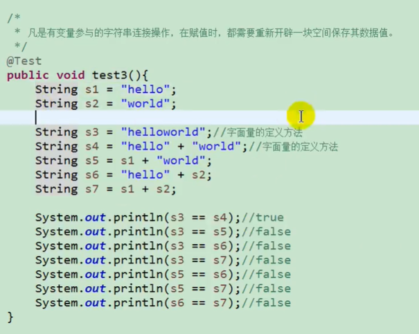
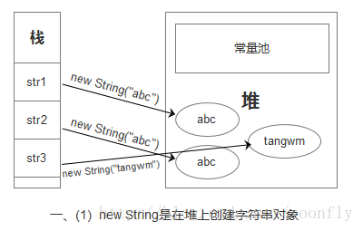
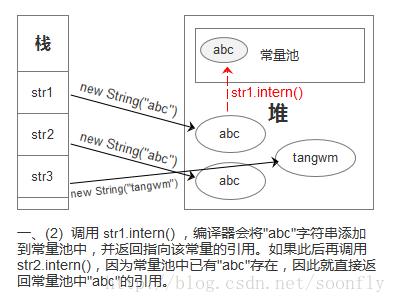
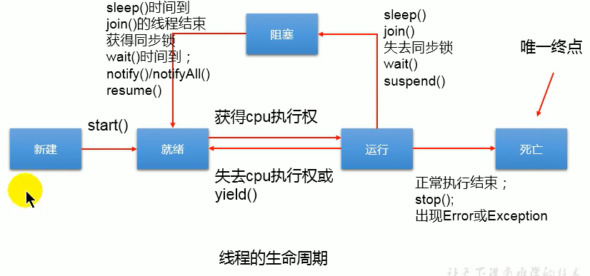
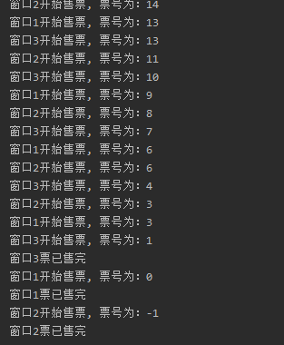
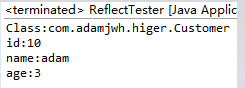
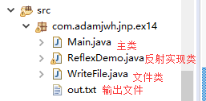
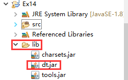
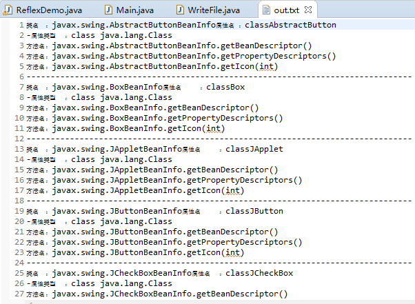

# 1、Http相关

## 1.HTTP请求

HTTP请求的方法

HTTP定义了8种方法来发送请求。

(1) GET:请求响应，这是最常使用的方法。

(2) HEAD:与GET相同的响应，是只要求响应的表头信息。

(3) POST:发送数据给服务器处理，数据包含在HTTP信息正文q

(4) PUT:上传文件。

(5) DELETE:删除文件。

(6) TRACE:追踪所收到的请求。

(7) OPTIONS:返回服务器所支持的HTTP请求的方法。

(8) CONNECT:将HTTP请求的连接转换成透明的TCP/IP通道。

 HTTP响应的格式

    服务器在处理完客户端所提出的HTTP请求后，会发送下列响应。
    
    (1)第一行是状态码。
    
    (2)第二行开始是其他信息。
    
    HTTP响应的第一行是状态码，包含一个标识状态的数字和一个描述状态的单词。例如：

HTTP/1.1 200 0K

200是标识状态的数字，OK则是描述状态的单词，这个状态码表示请求成功。

## 2、Http响应码

所有 HTTP 状态代码及其定义如下。   

代码  指示  

2xx  成功  

200  正常；请求已完成。  

201  正常；紧接 POST 命令。  

202  正常；已接受用于处理，但处理尚未完成。  

203  正常；部分信息 — 返回的信息只是一部分。  

204  正常；无响应 — 已接收请求，但不存在要回送的信息。  

3xx  重定向  

301  已移动 — 请求的数据具有新的位置且更改是永久的。  

302  已找到 — 请求的数据临时具有不同 URI。  

303  请参阅其它 — 可在另一 URI 下找到对请求的响应，且应使用 GET 方法检索此响应。  

304  未修改 — 未按预期修改文档。  

305  使用代理 — 必须通过位置字段中提供的代理来访问请求的资源。  

306  未使用 — 不再使用；保留此代码以便将来使用。  

4xx  客户机中出现的错误  

400  错误请求 — 请求中有语法问题，或不能满足请求。  

401  未授权 — 未授权客户机访问数据。  

402  需要付款 — 表示计费系统已有效。  

403  禁止 — 即使有授权也不需要访问。  

404  找不到 — 服务器找不到给定的资源；文档不存在。  

407  代理认证请求 — 客户机首先必须使用代理认证自身。  

415  介质类型不受支持 — 服务器拒绝服务请求，因为不支持请求实体的格式。  

5xx  服务器中出现的错误  

500  内部错误 — 因为意外情况，服务器不能完成请求。  

501  未执行 — 服务器不支持请求的工具。  

502  错误网关 — 服务器接收到来自上游服务器的无效响应。  

503  无法获得服务 — 由于临时过载或维护，服务器无法处理请求。

HTTP 400 - 请求无效 

HTTP 401.1 - 未授权：登录失败 

HTTP 401.2 - 未授权：服务器配置问题导致登录失败 

HTTP 401.3 - ACL 禁止访问资源 

HTTP 401.4 - 未授权：授权被筛选器拒绝 

HTTP 401.5 - 未授权：ISAPI 或 CGI 授权失败  

HTTP 403 - 禁止访问 

HTTP 403 - 对 Internet 服务管理器 (HTML) 的访问仅限于 Localhost 

HTTP 403.1 禁止访问：禁止可执行访问 

HTTP 403.2 - 禁止访问：禁止读访问 

HTTP 403.3 - 禁止访问：禁止写访问 

HTTP 403.4 - 禁止访问：要求 SSL 

HTTP 403.5 - 禁止访问：要求 SSL 128 

HTTP 403.6 - 禁止访问：IP 地址被拒绝 

HTTP 403.7 - 禁止访问：要求客户证书 

HTTP 403.8 - 禁止访问：禁止站点访问 

HTTP 403.9 - 禁止访问：连接的用户过多 

HTTP 403.10 - 禁止访问：配置无效 

HTTP 403.11 - 禁止访问：密码更改 

HTTP 403.12 - 禁止访问：映射器拒绝访问 

HTTP 403.13 - 禁止访问：客户证书已被吊销 

HTTP 403.15 - 禁止访问：客户访问许可过多 

HTTP 403.16 - 禁止访问：客户证书不可信或者无效 

HTTP 403.17 - 禁止访问：客户证书已经到期或者尚未生效 

HTTP 404.1 - 无法找到 Web 站点 

HTTP 404 - 无法找到文件 

HTTP 405 - 资源被禁止 

HTTP 406 - 无法接受 

HTTP 407 - 要求代理身份验证 

HTTP 410 - 永远不可用 

HTTP 412 - 先决条件失败 

HTTP 414 - 请求 - URI 太长 

HTTP 500 - 内部服务器错误 

HTTP 500.100 - 内部服务器错误 - ASP 错误 

HTTP 500-11 服务器关闭 

HTTP 500-12 应用程序重新启动 

HTTP 500-13 - 服务器太忙 

HTTP 500-14 - 应用程序无效 

HTTP 500-15 - 不允许请求 global.asa 

Error 501 - 未实现 

HTTP 502 - 网关错误  


# 2、Idea

## 1、idea下划线警告误报

例如我的变量起名没有遵守驼峰命名或者有其它错误，idea的下划线警告很烦，那么使用注释可以抑制警告

~~~ java
@SuppressWarnings("all")//抑制警告
public class IdUtils {
    String myid;
}
~~~


# 3、java语法相关

## 1、泛型数组

- 不能(直接)创建泛型数组
- 泛型数组实际的运行时对象数组只能是原始类型( T[]为Object[]，Pair<T>[]为Pair[] )，而实际的运行时数组对象可能是T类型( 虽然运行时会擦除成原始类型 )
- 一般解决方案：(泛型数组包装器):使用ArrayList收集泛型数组对象的对象元素，如ArrayList\<T\>、ArrayList\<Pair\<String\>\>
    - 将获得数组的行为，以及由泛型提供的编译期的类型安全

## 2、Date中已弃用，使用Calendar

Date 的 getHours() 和 getMinutes() 还有 getSeconds() 都是过时的方法，所以要用 Calendar 类


java.util.Date 的 getHours() 和 getMinutes() 还有 getSeconds() 都是过时（deprecated ）的方法，

所以要用 Calendar 类

 

例如：

Calendar cal = Calendar.getInstence();   

int hours = cal.get( Calendar.HOUR_OF_DAY );
int minute = cal.get( Calendar.MINUTE );
int second = cal.get( Calendar.SECOND );

Calendar 类有一个 setTime( Date date ) 方法，可以把 calendar 对象改为别的时间

--------------------------

Calendar calendar = Calendar.getInstance();

String dateStr = calendar.get(Calendar.YEAR)
+ "/" + (calendar.get(Calendar.MONTH) + 1) + "/" + calendar.get(Calendar.DATE);


Calendar使用示例：

```java
public static void main(String[] args) {
    Calendar calendar = Calendar.getInstance();
    System.out.println(calendar.get(Calendar.YEAR));//年
    System.out.println(calendar.get(Calendar.MONTH)+1);//月
    System.out.println(calendar.get(Calendar.DATE));//日
    System.out.println(calendar.get(Calendar.WEDNESDAY));//周几
}
```


## 3、Collection.sort()

使用Collection.sort()对集合进行排序，需要让集合内的元素实现Comparable接口

Collection.sort(集合)


## 4、内部类

内部类分类：

1. 一般内部类：
    1. 可以使用final、private、abstract、public等修饰符修饰
    2. 可以直接使用外部类的实例成员
2. 静态内部类
    1. 其实就相当于一个外部类，只是写在了一起，与外部类是平级关系
    2. 可以使用容易访问修饰符
    3. 只可以访问外部类静态成员
3. 局部内部类
    1. 局部指：方法、构造方法、静态块、实例块
    2. 不能使用访问修饰符，也不能使用static修饰符
    3. 可以使用final与abstract
4. 匿名内部类
    1. 类的实例只使用一次，则定义类的同时就创建了一个实例
    2. 匿名内部类中不能定义静态成员


非静态内部类的妙用：

1. 隐藏类：定义一个私有的非静态内部类，外部不能访问也不能建立它的实例，只有外部类可以使用。

    ```java
    public class testInner {
        int a = 100;
        private class InnerClass {
            public void fun{
                System.out.println("a=" + a);
            }
        }
    }
    ```

2. 实现“组合类”：假设一下，如果我想继承多个类C1，C2，怎么办？Java里只能继承一个，那么就可以定义两个内部类，一个继承C1，一个继承C2，然后在外部类定义这两个内部类的实例，达到组合的目的，实现类似于多继承的功能。

    当然，不只是“多继承”，可以在继承C1时对它重写等操作，达到其它组合目的。

    ```java
    package 案例;
    
    public class testInner {
        int a=20;
        Inner1 inner1;
        Inner2 inner2;
    
        public testInner(){
            inner1 = new Inner1();
            inner2 = new Inner2();
        }
    
        public static void main(String[] args) {
            testInner t = new testInner();
            t.inner1.outA();
        }
    
        //继承C1
        private class Inner1 extends C1{
    
        }
        //继承C2
        private class Inner2 extends C2{
    
        }
    }
    
    class C1{
        int a=100;
    
        public void outA() {
            System.out.println(a);
        }
    }
    class C2{
        int a=200;
    
        public void outA(){
            System.out.println(a);
        }
    }
    ```


## 5、JDK中主要的包

java.lang ------ 包含一些Java语言的核心类，如String、Math、Integer、System、Thread，提供常用功能

java.net ------ 包含执行与网络相关的操作的类和接口

java.io ------ 包含能够提供多种输入/输出功能的类

java.util ------ 包含一些实用工具类，如定义系统特性、接口的集合框架类、使用与日期日历相关的函数

java.text ------ 包含了一些java格式化相关的类

java.sql ------ 包含了java进行JDBC数据库编程的相关类/接口

java.awt ------ 包含了构成抽象窗口工具集（abstract window toolkits)的多个类，这些类被用来构建和管理应用程序的图形用户界面（GUI）

## 6、Object类中toString()与equals()的使用：

1.当我们输出一个对象的引用时，实际上就是调用当前对象的toString()

2.Object类中toString()的定义：

```java
public String toString() {
    return getClass().getName() + "@" + Integer.toHexString(hashCode());
 }
```

3.像String、Date、File、包装类等都重写了Object类中的toString()方法。使得在调用对象的toString()时，返回"实体内容"信息

4.自定义类也可以重写toString()方法，当调用此方法时，返回对象的"实体内容"

**Object类中定义的equals()和==的作用是相同的：比较两个对象的地址值是否相同.即两个引用是否指向同一个对象实体**


## 7、多态性

1.理解多态性：可以理解为一个事物的多种形态。

2.何为多态性：

对象的多态性：**父类的引用指向子类的对象（或子类的对象赋给父类的引用）**

**Parent p = new Child();**

1. 多态的使用：虚拟方法调用

有了对象的多态性以后，我们在编译期，**只能调用父类中声明的方法，但在运行期，我们实际执行的是子类重写父类的方法。**

总结：编译，看左边；运行，看右边。

4.多态性的使用前提： ① 类的继承关系 ② 方法的重写

5.对象的多态性，只适用于方法，不适用于属性（编译和运行都看左边）


**相当于一个披着父类外壳的子类，内部都是子类的的，但是外显的所有方法、属性都是父类的。**


## 8、封装性

类的封装性即不能让外面的类随意修改一个类的成员变量；

在定义一个类的成员，使用private关键字说明这个成员的访问权限，只能被这个类的其他成员方法调用，而不能被其他的类中的方法所调用；

为实现封装性，常将类的成员变量声明为private,再通过public的方法来对这个变量进行访问。对一个变量的操作，一般都有 读取和赋值操作，我们一般定义两个方法来实现这两种操作，即：getxxx()与setxxx();

一个类就是一个模块，我们应该让模块仅仅公开必须要让外界知道的内容，而隐藏其他的一切内容。再进行程序设计时，应尽量避免一个模块直接修改或操作另一个模块的数据。

总结一下就是类按需求使用方法暴漏对类内部变量的set与get方法以及一些其它所需方法，而类内部的结构则对外隐藏。


封装性的体现：① 如上 ② 不对外暴露的私有的方法 ③ 单例模式 ...

三、封装性的体现，需要权限修饰符来配合。

1.Java规定的4种权限（从小到大排列）：private、缺省、protected 、public

2.4种权限可以用来修饰类及类的内部结构：属性、方法、构造器、内部类

3.具体的，4种权限都可以用来修饰类的内部结构：属性、方法、构造器、内部类

> 修饰类的话，只能使用：缺省、public

- 总结封装性：Java提供了4种权限修饰符来修饰类及类的内部结构，体现类及类的内部结构在被调用时的可见性的大小。

## 9、继承性

一、继承性的好处：

**① 减少了代码的冗余，提高了代码的复用性**

② 便于功能的扩展

③ 为之后多态性的使用，提供了前提

二、继承性的格式： `class A extends B{}`

**A:子类、派生类、subclass**

B:父类、超类、基类、superclass

2.1体现：一旦子类A继承父类B以后，子类A中就获取了父类B中声明的所有的属性和方法。**特别的，父类中声明为private的属性或方法，子类继承父类以后，仍然认为获取了父类中私有的结构。只有因为封装性的影响，使得子类不能直接调用父类的结构而已。**

2.2 子类继承父类以后，还可以声明自己特有的属性或方法：实现功能的拓展。子类和父类的关系，不同于子集和集合的关系。

**extends：延展、扩展**

三、Java中关于继承性的规定：

1.一个类可以被多个子类继承。

**2.Java中类的单继承性：一个类只能有一个父类**

3.子父类是相对的概念。

4.子类直接继承的父类，称为：直接父类。间接继承的父类称为：**间接父类**

5.子类继承父类以后，**就获取了直接父类以及所有间接父类中声明的属性和方法**

四、 1.如果我们没有显式的声明一个类的父类的话，则此类继承于java.lang.Object类

2.所有的java类（除java.lang.Object类之外）都直接或间接的继承于java.lang.Object类

3.意味着，**所有的java类具有java.lang.Object类声明的功能。**


## 10、线程

### 多线程的创建，方式一：继承于Thread类

1. 创建一个继承于Thread类的子类
2. 重写Thread类的run() --> 将此线程执行的操作声明在run()中
3. 创建Thread类的子类的对象
4. 通过此对象调用start()

### 创建多线程的方式二：实现Runnable接口

1. 创建一个实现了Runnable接口的类
2. 实现类去实现Runnable中的抽象方法：run()
3. 创建实现类的对象
4. 将此对象作为参数传递到Thread类的构造器中，创建Thread类的对象
5. 通过Thread类的对象调用start()

比较创建线程的两种方式。

开发中：优先选择：实现Runnable接口的方式

原因：

- 1.实现的方式没有类的单继承性的局限性
- 2.实现的方式更适合来处理多个线程有共享数据的情况。

联系：public class Thread implements Runnable

相同点：两种方式都需要重写run(),将线程要执行的逻辑声明在run()中。


## 11、Java中Synchronized的用法

转自：https://blog.csdn.net/luoweifu/article/details/46613015

《编程思想之多线程与多进程(1)——以操作系统的角度述说线程与进程》一文详细讲述了线程、进程的关系及在操作系统中的表现，这是多线程学习必须了解的基础。本文将接着讲一下Java线程同步中的一个重要的概念synchronized.

在Java中，synchronized关键字是用来控制线程同步的，就是在多线程的环境下，控制synchronized代码段不被多个线程同时执行。

**synchronized是Java中的关键字，是一种同步锁。它修饰的对象有以下几种：**

1. 修饰一个代码块，被修饰的代码块称为同步语句块，其作用的范围是大括号{}括起来的代码，作用的对象是调用这个代码块的对象；
2. 修饰一个方法，被修饰的方法称为同步方法，其作用的范围是整个方法，作用的对象是调用这个方法的对象；
3. 修改一个静态的方法，其作用的范围是整个静态方法，作用的对象是这个类的所有对象；
4. 修改一个类，其作用的范围是synchronized后面括号括起来的部分，作用主的对象是这个类的所有对象。

### 修饰一个代码块

**1.一个线程访问一个对象中的synchronized(this)同步代码块时，其他试图访问该对象的线程将被阻塞。**我们看下面一个例子：
【Demo1】：synchronized的用法

```
 1 /**
 2 * 同步线程
 3 */
 4 class SyncThread implements Runnable {
 5         private static int count;
 6 
 7         public SyncThread() {
 8             count = 0;
 9         }
10 
11         public void run() {
12             synchronized(this) {
13                 for (int i = 0; i < 5; i++) {
14                     try {
15                         System.out.println(Thread.currentThread().getName() + ":" + (count++));
16                         Thread.sleep(100);
17                     } catch (InterruptedException e) {
18                         e.printStackTrace();
19                     }
20                 }
21             }
22         }
23 
24         public int getCount() {
25             return count;
26         }
27 }
```

SyncThread的调用：

```
1 SyncThread syncThread = new SyncThread();
2 Thread thread1 = new Thread(syncThread, "SyncThread1");
3 Thread thread2 = new Thread(syncThread, "SyncThread2");
4 thread1.start();
5 thread2.start();
```

结果如下：

```
SyncThread1:0 
SyncThread1:1 
SyncThread1:2 
SyncThread1:3 
SyncThread1:4 
SyncThread2:5 
SyncThread2:6 
SyncThread2:7 
SyncThread2:8 
SyncThread2:9
```

当两个并发线程(thread1和thread2)访问同一个对象(syncThread)中的synchronized代码块时，在同一时刻只能有一个线程得到执行，另一个线程受阻塞，必须等待当前线程执行完这个代码块以后才能执行该代码块。Thread1和thread2是互斥的，因为在执行synchronized代码块时会锁定当前的对象，只有执行完该代码块才能释放该对象锁，下一个线程才能执行并锁定该对象。
我们再把SyncThread的调用稍微改一下：

```
1 Thread thread1 = new Thread(new SyncThread(), "SyncThread1");
2 Thread thread2 = new Thread(new SyncThread(), "SyncThread2");
3 thread1.start();
4 thread2.start();
```

结果如下：

```
SyncThread1:0 
SyncThread2:1 
SyncThread1:2 
SyncThread2:3 
SyncThread1:4 
SyncThread2:5 
SyncThread2:6 
SyncThread1:7 
SyncThread1:8 
SyncThread2:9
```

不是说一个线程执行synchronized代码块时其它的线程受阻塞吗？为什么上面的例子中thread1和thread2同时在执行。这是因为synchronized只锁定对象，每个对象只有一个锁（lock）与之相关联，而上面的代码等同于下面这段代码：

```
1 SyncThread syncThread1 = new SyncThread();
2 SyncThread syncThread2 = new SyncThread();
3 Thread thread1 = new Thread(syncThread1, "SyncThread1");
4 Thread thread2 = new Thread(syncThread2, "SyncThread2");
5 thread1.start();
6 thread2.start();
```

这时创建了两个SyncThread的对象syncThread1和syncThread2，线程thread1执行的是syncThread1对象中的synchronized代码(run)，而线程thread2执行的是syncThread2对象中的synchronized代码(run)；我们知道synchronized锁定的是对象，这时会有两把锁分别锁定syncThread1对象和syncThread2对象，而这两把锁是互不干扰的，不形成互斥，所以两个线程可以同时执行。

**2.当一个线程访问对象的一个synchronized(this)同步代码块时，另一个线程仍然可以访问该对象中的非synchronized(this)同步代码块。**
【Demo2】：多个线程访问synchronized和非synchronized代码块

```java
  class Counter implements Runnable {
         private int count;
 
         public Counter() {
             count = 0;
         }
 
         public void countAdd() {
             synchronized(this) {
                 for (int i = 0; i < 5; i ++) {
                     try {
                         System.out.println(Thread.currentThread().getName() + ":" + (count++));
                         Thread.sleep(100);
                     } catch (InterruptedException e) {
                         e.printStackTrace();
                     }
                 }
             }
         }
 
         //非synchronized代码块，未对count进行读写操作，所以可以不用synchronized
         public void printCount() {
             for (int i = 0; i < 5; i ++) {
                 try {
                     System.out.println(Thread.currentThread().getName() + " count:" + count);
                     Thread.sleep(100);
                 } catch (InterruptedException e) {
                     e.printStackTrace();
                 }
             }
         }
 
         public void run() {
             String threadName = Thread.currentThread().getName();
             if (threadName.equals("A")) {
                 countAdd();
             } else if (threadName.equals("B")) {
                 printCount();
             }
         }
 }
```

调用代码:

```
1 Counter counter = new Counter();
2 Thread thread1 = new Thread(counter, "A");
3 Thread thread2 = new Thread(counter, "B");
4 thread1.start();
5 thread2.start();
```

结果如下：

```
A:0 
B count:1 
A:1 
B count:2 
A:2 
B count:3 
A:3 
B count:4 
A:4 
B count:5
```

上面代码中countAdd是一个synchronized的，printCount是非synchronized的。从上面的结果中可以看出一个线程访问一个对象的synchronized代码块时，别的线程可以访问该对象的非synchronized代码块而不受阻塞。

**指定要给某个对象加锁**
【Demo3】:指定要给某个对象加锁

```java
 /**
 * 银行账户类
 */
 class Account {
         String name;
         float amount;
 
         public Account(String name, float amount) {
             this.name = name;
             this.amount = amount;
         }
 		//存钱
         public void deposit(float amt) {
             amount += amt;
             try {
                 Thread.sleep(100);
             } catch (InterruptedException e) {
                 e.printStackTrace();
             }
         }
 		//取钱
         public void withdraw(float amt) {
             amount -= amt;
             try {
                 Thread.sleep(100);
             } catch (InterruptedException e) {
                 e.printStackTrace();
             }
         }
 
         public float getBalance() {
             return amount;
         }
 }
 
 /**
 * 账户操作类
 */
 class AccountOperator implements Runnable {
         private Account account;
         public AccountOperator(Account account) {
             this.account = account;
         }
 
         public void run() {
             synchronized (account) {
                 account.deposit(500);
                 account.withdraw(500);
                 System.out.println(Thread.currentThread().getName() + ":" + account.getBalance());
             }
         }
 }
```

调用代码:

```java
 Account account = new Account("zhang san", 10000.0f);
 AccountOperator accountOperator = new AccountOperator(account);
 
 final int THREAD_NUM = 5;
 Thread threads[] = new Thread[THREAD_NUM];
 for (int i = 0; i < THREAD_NUM; i ++) {
 threads[i] = new Thread(accountOperator, "Thread" + i);
 threads[i].start();
```

结果如下：

```
Thread3:10000.0 
Thread2:10000.0 
Thread1:10000.0 
Thread4:10000.0 
Thread0:10000.0
```

在AccountOperator 类中的run方法里，我们用synchronized 给account对象加了锁。这时，当一个线程访问account对象时，其他试图访问account对象的线程将会阻塞，直到该线程访问account对象结束。也就是说谁拿到那个锁谁就可以运行它所控制的那段代码。
**当有一个明确的对象作为锁时，就可以用类似下面这样的方式写程序。这个时候，只有一个线程可以对此对象进行操作。**

```java
public void method3(SomeObject obj) {
	//obj 锁定的对象
    synchronized(obj) {
	// todo
    }
}
```

**当没有明确的对象作为锁，只是想让一段代码同步时，可以创建一个特殊的对象来充当锁：这个时候，可能只有一个线程可以执行此代码块**

```java
 class Test implements Runnable {
         private byte[] lock = new byte[0]; // 特殊的instance变量
         public void method() {
             synchronized(lock) {
 			// todo 同步代码块
             }
         }
 
         public void run() {
 
         }
 }
```

说明：零长度的byte数组对象创建起来将比任何对象都经济――查看编译后的字节码：生成零长度的byte[]对象只需3条操作码，而Object lock = new Object()则需要7行操作码。

### 修饰一个方法

Synchronized修饰一个方法很简单，就是在方法的前面加synchronized，public synchronized void method(){//todo}; synchronized修饰方法和修饰一个代码块类似，只是作用范围不一样，修饰代码块是大括号括起来的范围，而修饰方法范围是整个函数。如将【Demo1】中的run方法改成如下的方式，实现的效果一样。

***【Demo4】：synchronized修饰一个方法**

```java
 public synchronized void run() {
     for (int i = 0; i < 5; i ++) {
         try {
             System.out.println(Thread.currentThread().getName() + ":" + (count++));
             Thread.sleep(100);
         } catch (InterruptedException e) {
             e.printStackTrace();
         }
     }
 }
```


Synchronized作用于整个方法的写法。
写法一：

```java
 public synchronized void method() {
 // todo
 }
```

写法二：

```java
 public void method() {
     synchronized(this) {
 // todo
     }
 }
```

写法一修饰的是一个方法，写法二修饰的是一个代码块，但写法一与写法二是等价的，都是锁定了整个方法时的内容。

**在用synchronized修饰方法时要注意以下几点：**
**1. synchronized关键字不能继承。**
虽然可以使用synchronized来定义方法，但synchronized并不属于方法定义的一部分，因此，synchronized关键字不能被继承。如果在父类中的某个方法使用了synchronized关键字，而在子类中覆盖了这个方法，在子类中的这个方法默认情况下并不是同步的，而必须显式地在子类的这个方法中加上synchronized关键字才可以。当然，还可以在子类方法中调用父类中相应的方法，这样虽然子类中的方法不是同步的，但子类调用了父类的同步方法，因此，子类的方法也就相当于同步了。这两种方式的例子代码如下：
在子类方法中加上synchronized关键字

```java
 class Parent {
         public synchronized void method() { }
 }
 class Child extends Parent {
         public synchronized void method() { }
 }
```

在子类方法中调用父类的同步方法

```java
class Parent {
        public synchronized void method() { }
}
class Child extends Parent {
        public void method() {
            super.method();
        }
}
```


**2.在定义接口方法时不能使用synchronized关键字。**
**3.构造方法不能使用synchronized关键字，但可以使用synchronized代码块来进行同步。**
**修饰一个静态的方法**
Synchronized也可修饰一个静态方法，用法如下：

```java
public synchronized static void method() {
// todo
}
```

我们知道静态方法是属于类的而不属于对象的。同样的，synchronized修饰的静态方法锁定的是这个类的所有对象。我们对Demo1进行一些修改如下：

【Demo5】：synchronized修饰静态方法

```java
/**
* 同步线程
*/
class SyncThread implements Runnable {
        private static int count;

        public SyncThread() {
            count = 0;
        }

        public synchronized static void method() {
            for (int i = 0; i < 5; i ++) {
                try {
                    System.out.println(Thread.currentThread().getName() + ":" + (count++));
                    Thread.sleep(100);
                } catch (InterruptedException e) {
                    e.printStackTrace();
                }
            }
        }

        public synchronized void run() {
            method();
        }
}
```


调用代码:

```java
SyncThread syncThread1 = new SyncThread();
SyncThread syncThread2 = new SyncThread();
Thread thread1 = new Thread(syncThread1, "SyncThread1");
Thread thread2 = new Thread(syncThread2, "SyncThread2");
thread1.start();
thread2.start();
```


结果如下：

```java
SyncThread1:0 
SyncThread1:1 
SyncThread1:2 
SyncThread1:3 
SyncThread1:4 
SyncThread2:5 
SyncThread2:6 
SyncThread2:7 
SyncThread2:8 
SyncThread2:9
```


syncThread1和syncThread2是SyncThread的两个对象，但在thread1和thread2并发执行时却保持了线程同步。这是因为run中调用了静态方法method，而静态方法是属于类的，所以syncThread1和syncThread2相当于用了同一把锁。这与Demo1是不同的。

**修饰一个类**
Synchronized还可作用于一个类，用法如下：

```java
class ClassName {
        public void method() {
            synchronized(ClassName.class) {
// todo
            }
        }
}
```


我们把Demo5再作一些修改。
【Demo6】:修饰一个类

```java
/**
* 同步线程
*/
class SyncThread implements Runnable {
        private static int count;

        public SyncThread() {
            count = 0;
        }

        public static void method() {
            synchronized(SyncThread.class) {
                for (int i = 0; i < 5; i ++) {
                    try {
                        System.out.println(Thread.currentThread().getName() + ":" + (count++));
                        Thread.sleep(100);
                    } catch (InterruptedException e) {
                        e.printStackTrace();
                    }
                }
            }
        }

        public synchronized void run() {
            method();
        }
}
```


其效果和【Demo5】是一样的，synchronized作用于一个类T时，是给这个类T加锁，T**的所有对象用的是同一把锁。**

总结：
A. 无论synchronized关键字加在方法上还是对象上，如果它作用的对象是非静态的，则它取得的锁是对象；如果synchronized作用的对象是一个静态方法或一个类，则它取得的锁是对类，该类所有的对象同一把锁。
B. 每个对象只有一个锁（lock）与之相关联，谁拿到这个锁谁就可以运行它所控制的那段代码。
C. 实现同步是要很大的系统开销作为代价的，甚至可能造成死锁，所以尽量避免无谓的同步控制。


## 12、String

1.String声明为final的，不可被继承

2.String实现了Serializable接口：表示字符串是支持序列化的。实现了Comparable接口：表示String可以比较大小

3.String内部定义了final char[] value用于存储字符串数据

4.String:代表不可变的字符序列。**简称：不可变性。**

> 体现：
> 1.当对字符串重新赋值时，需要重写指定内存区域赋值，不能使用原有的value进行赋值。
> 2.当对现有的字符串进行连接操作时，也需要重新指定内存区域赋值，不能使用原有的value进行赋值。
> 3.当调用String的replace()方法修改指定字符或字符串时，也需要重新指定内存区域赋值，不能使用原有的value进行赋值。

5.通过字面量的方式（**区别于new**）给一个字符串赋值**，此时的字符串值声明在字符串常量池中。**

6.**字符串常量池中是不会存储相同内容的字符串的。**


面试题：String s = new String("abc");方式创建对象，在内存中创建了几个对象？

两个:一个是堆空间中new结构，另一个是char[]对应的常量池中的数据："abc"


关于StringBuffer和StringBuilder的使用

**String、StringBuffer、StringBuilder三者的异同？**

String:不可变的字符序列；底层使用char[]存储

StringBuffer:可变的字符序列；线程安全的，效率低；底层使用char[]存储

StringBuilder:可变的字符序列；jdk5.0新增的，线程不安全的，效率高；底层使用char[]存储


**注！！：凡是有变量参与的字符串连接操作，在赋值时都需要重新开辟一块空间保存其数据值。**

**注意，是变量，如果被final修饰，则不是变量。**



**intern():当调用字符串的intern()方法后，我们会在字符串常量池中声明此字符串。如果已经存在，则返回已经**
**存在的字符串常量的地址。**


## 13、通配符上下限

List\<? extends Aclass\>：这里的？只能是Aclass或者它的后代类，也就是说，Aclass是他的上限

List\<? super Bclass\>：这里的？只能是Aclass或者它的前代类（父类、爷爷类等），也就是说，Bclass是他的下限。


## 14、静态变量与代码块的继承问题

A的子类是B

A中有一个静态变量x

则B.x==A.x

也就是说继承并不会新建一个静态变量。


## 15、序列化

序列化机制：
对象序列化机制允许把内存中的Java对象转换成平台无关的二进制流，从而允许把这种二进制流持久地保存在磁盘上，或通过网络将这种二进制流传输到另一个网络节点。当其它程序获取了这种二进制流，就可以恢复成原来的Java对象。


## 16、String.intern()

String.intern()方法，是将字符串添加到常量池中，并返回指向该常量池字符串的引用指针。

如果常量此中已存在此字符串，则直接返回其引用指针。

```java
String s1 = "hello";
String s2 = "world";
String s3 = s1 + s2;
String s4 = "helloworld";
System.out.println(s3 == s4);//false
System.out.println(s3.intern() == s4);//true
```





## 17、字节流与字符流区别

**java中字符流与字节流的区别：**

1、字节流操作的基本单元为字节；字符流操作的基本单元为Unicode码元。

2、字节流默认不使用缓冲区；字符流使用缓冲区。

3、字节流通常用于处理二进制数据，实际上它可以处理任意类型的数据，但它不支持直接写入或读取Unicode码元；字符流通常处理文本数据，它支持写入及读取Unicode码元。

**字节流**

Java中的字节流处理的最基本单位为单个字节，它通常用来处理二进制数据。Java中最基本的两个字节流类是InputStream和OutputStream，它们分别代表了组基本的输入字节流和输出字节流。

InputStream类与OutputStream类均为抽象类，我们在实际使用中通常使用Java类库中提供的它们的一系列子类。下面我们以InputStream类为例，来介绍下Java中的字节流。

InputStream类中定义了一个基本的用于从字节流中读取字节的方法read，这个方法的定义如下：

```
public` `abstract` `int read() throws IOException;
```

这是一个抽象方法，也就是说任何派生自InputStream的输入字节流类都需要实现这一方法，这一方法的功能是从字节流中读取一个字节，若到了末尾则返回-1，否则返回读入的字节。

关于这个方法我们需要注意的是，它会一直阻塞知道返回一个读取到的字节或是-1。另外，字节流在默认情况下是不支持缓存的，这意味着每调用一次read方法都会请求操作系统来读取一个字节，这往往会伴随着一次磁盘IO，因此效率会比较低。

有的小伙伴可能认为InputStream类中read的以字节数组为参数的重载方法，能够一次读入多个字节而不用频繁的进行磁盘IO。那么究竟是不是这样呢？我们来看一下这个方法的源码：

```java
public int read(byte b[]) throws IOException {
    return read(b, 0, b.length);
}
```

它调用了另一个版本的read重载方法，那我们就接着往下追：

```java
public int read(byte b[], int off, int len) throws IOException {
	if(b == null) {
        throw` `new` `NullPointerException();
    } else if (off < 0 || len < 0 || len > b.length - off) {
        throw new IndexOutOfBoundsException();
    } else if(len == 0) {
        return 0;
    }
    int c = read();
    if(c == -1) {return -1;}
    b[off] = (byte)c;
    int i = 1;
    try{
        for(; i < len ; i++) {
            c = read();
            if(c == -1) {
                break;
            }
         	b[off + i] = (byte)c;
        }
    } catch(IOException ee) {}
    return i;
}
```

从以上的代码我们可以看到，实际上read(byte[])方法内部也是通过循环调用read()方法来实现“一次”读入一个字节数组的，因此本质来说这个方法也未使用内存缓冲区。要使用内存缓冲区以提高读取的效率，我们应该使用BufferedInputStream。

**字符流**

Java中的字符流处理的最基本的单元是Unicode码元（大小2字节），它通常用来处理文本数据。所谓Unicode码元，也就是一个Unicode代码单元，范围是0x0000~0xFFFF。在以上范围内的每个数字都与一个字符相对应，Java中的String类型默认就把字符以Unicode规则编码而后存储在内存中。

然而与存储在内存中不同，存储在磁盘上的数据通常有着各种各样的编码方式。使用不同的编码方式，相同的字符会有不同的二进制表示。实际上字符流是这样工作的：

输出字符流：把要写入文件的字符序列（实际上是Unicode码元序列）转为指定编码方式下的字节序列，然后再写入到文件中；

输入字符流：把要读取的字节序列按指定编码方式解码为相应字符序列（实际上是Unicode码元序列从）从而可以存在内存中。

我们通过一个demo来加深对这一过程的理解，示例代码如下：

```java
import java.io.FileWriter;
import java.io.IOException;
public class FileWriterDemo {  
	public static void main(String[] args) {
        FileWriter fileWriter = null;    
        try{      
            try {
                fileWriter = new FileWriter("demo.txt");    
                fileWriter.write("demo");
            } finally {        
                fileWriter.close();     
            }   
        } catch (IOException e) {      
            e.printStackTrace();
        }
    }
}
```


## 18、抽象类与接口

### 一.抽象类

　　在了解抽象类之前，先来了解一下抽象方法。抽象方法是一种特殊的方法：它只有声明，而没有具体的实现。抽象方法的声明格式为：

```java
abstract void fun();
```

　　抽象方法必须用abstract关键字进行修饰。如果一个类含有抽象方法，则称这个类为抽象类，抽象类必须在类前用abstract关键字修饰。因为抽象类中含有无具体实现的方法，所以不能用抽象类创建对象。

　　下面要注意一个问题：在《JAVA编程思想》一书中，将抽象类定义为“包含抽象方法的类”，但是后面发现如果一个类不包含抽象方法，只是用abstract修饰的话也是抽象类。也就是说抽象类不一定必须含有抽象方法。个人觉得这个属于钻牛角尖的问题吧，因为如果一个抽象类不包含任何抽象方法，为何还要设计为抽象类？所以暂且记住这个概念吧，不必去深究为什么。

```java
[public] abstract class ClassName {  abstract void fun();}
```

　　从这里可以看出，抽象类就是为了继承而存在的，如果你定义了一个抽象类，却不去继承它，那么等于白白创建了这个抽象类，因为你不能用它来做任何事情。对于一个父类，如果它的某个方法在父类中实现出来没有任何意义，必须根据子类的实际需求来进行不同的实现，那么就可以将这个方法声明为abstract方法，此时这个类也就成为abstract类了。

　　包含抽象方法的类称为抽象类，但并不意味着抽象类中只能有抽象方法，它和普通类一样，同样可以拥有成员变量和普通的成员方法。注意，抽象类和普通类的主要有三点区别：

　　1）抽象方法必须为public或者protected（因为如果为private，则不能被子类继承，子类便无法实现该方法），缺省情况下默认为public。

　　2）抽象类不能用来创建对象；

　　3）如果一个类继承于一个抽象类，则子类必须实现父类的抽象方法。如果子类没有实现父类的抽象方法，则必须将子类也定义为为abstract类。

　　在其他方面，抽象类和普通的类并没有区别。


接口的设计目的，是对类的行为进行约束（更准确的说是一种“有”约束，因为接口不能规定类不可以有什么行为），也就是提供一种机制，可以强制要求不同的类具有相同的行为。它只约束了行为的有无，但不对如何实现行为进行限制。对“接口为何是约束”的理解，我觉得配合泛型食用效果更佳。

而抽象类的设计目的，是代码复用。当不同的类具有某些相同的行为(记为行为集合A)，且其中一部分行为的实现方式一致时（A的非真子集，记为B），可以让这些类都派生于一个抽象类。在这个抽象类中实现了B，避免让所有的子类来实现B，这就达到了代码复用的目的。而A减B的部分，留给各个子类自己实现。正是因为A-B在这里没有实现，所以抽象类不允许实例化出来（否则当调用到A-B时，无法执行）。

### 二.接口

　　接口，英文称作interface，在软件工程中，接口泛指供别人调用的方法或者函数。从这里，我们可以体会到Java语言设计者的初衷，它是对行为的抽象。在Java中，定一个接口的形式如下：

```
[``public``] ``interface` `InterfaceName {` `}
```

　　接口中可以含有 变量和方法。但是要注意，接口中的变量会被隐式地指定为public static final变量（并且只能是public static final变量，用private修饰会报编译错误），而方法会被隐式地指定为public abstract方法且只能是public abstract方法（用其他关键字，比如private、protected、static、 final等修饰会报编译错误），并且接口中所有的方法不能有具体的实现，也就是说，接口中的方法必须都是抽象方法。从这里可以隐约看出接口和抽象类的区别，接口是一种极度抽象的类型，它比抽象类更加“抽象”，并且一般情况下不在接口中定义变量。

　　要让一个类遵循某组特地的接口需要使用implements关键字，具体格式如下：

```
class` `ClassName ``implements` `Interface1,Interface2,[....]{``}
```

　　可以看出，允许一个类遵循多个特定的接口。如果一个非抽象类遵循了某个接口，就必须实现该接口中的所有方法。对于遵循某个接口的抽象类，可以不实现该接口中的抽象方法。

### 三.抽象类和接口的区别（！！）

1.语法层面上的区别

　　1）抽象类可以提供成员方法的实现细节，而接口中只能存在public abstract 方法；

　　2）抽象类中的成员变量可以是各种类型的，而接口中的成员变量只能是public static final类型的；

　　3）接口中不能含有静态代码块以及静态方法，而抽象类可以有静态代码块和静态方法；

　　4）一个类只能继承一个抽象类，而一个类却可以实现多个接口。

2.设计层面上的区别

　　1）抽象类是对一种事物的抽象，即对类抽象，而接口是对行为的抽象。抽象类是对整个类整体进行抽象，包括属性、行为，但是接口却是对类局部（行为）进行抽象。举个简单的例子，飞机和鸟是不同类的事物，但是它们都有一个共性，就是都会飞。那么在设计的时候，可以将飞机设计为一个类Airplane，将鸟设计为一个类Bird，但是不能将 飞行 这个特性也设计为类，因此它只是一个行为特性，并不是对一类事物的抽象描述。此时可以将 飞行 设计为一个接口Fly，包含方法fly( )，然后Airplane和Bird分别根据自己的需要实现Fly这个接口。然后至于有不同种类的飞机，比如战斗机、民用飞机等直接继承Airplane即可，对于鸟也是类似的，不同种类的鸟直接继承Bird类即可。从这里可以看出，继承是一个 "是不是"的关系，而 接口 实现则是 "有没有"的关系。如果一个类继承了某个抽象类，则子类必定是抽象类的种类，而接口实现则是有没有、具备不具备的关系，比如鸟是否能飞（或者是否具备飞行这个特点），能飞行则可以实现这个接口，不能飞行就不实现这个接口。

　　2）设计层面不同，抽象类作为很多子类的父类，它是一种模板式设计。而接口是一种行为规范，它是一种辐射式设计。什么是模板式设计？最简单例子，大家都用过ppt里面的模板，如果用模板A设计了ppt B和ppt C，ppt B和ppt C公共的部分就是模板A了，如果它们的公共部分需要改动，则只需要改动模板A就可以了，不需要重新对ppt B和ppt C进行改动。而辐射式设计，比如某个电梯都装了某种报警器，一旦要更新报警器，就必须全部更新。也就是说对于抽象类，如果需要添加新的方法，可以直接在抽象类中添加具体的实现，子类可以不进行变更；而对于接口则不行，如果接口进行了变更，则所有实现这个接口的类都必须进行相应的改动。

　　下面看一个网上流传最广泛的例子：门和警报的例子：门都有open( )和close( )两个动作，此时我们可以定义通过抽象类和接口来定义这个抽象概念：

```java
abstract class Door {
    public abstract void open();  
    public abstract void close();
}
```

　　或者：

```java
interface Door {
    public abstract void open();
    public abstract void close();
}
```

　　但是现在如果我们需要门具有报警alarm( )的功能，那么该如何实现？下面提供两种思路：

　　1）将这三个功能都放在抽象类里面，但是这样一来所有继承于这个抽象类的子类都具备了报警功能，但是有的门并不一定具备报警功能；

　　2）将这三个功能都放在接口里面，需要用到报警功能的类就需要实现这个接口中的open( )和close( )，也许这个类根本就不具备open( )和close( )这两个功能，比如火灾报警器。

　　从这里可以看出， Door的open() 、close()和alarm()根本就属于两个不同范畴内的行为，open()和close()属于门本身固有的行为特性，而alarm()属于延伸的附加行为。因此最好的解决办法是单独将报警设计为一个接口，包含alarm()行为,Door设计为单独的一个抽象类，包含open和close两种行为。再设计一个报警门继承Door类和实现Alarm接口。

```java
interface Alram {
    void alarm();
}
abstract class Door {
    void open();
    void close();
}
class AlarmDoor extends Door implements Alarm {
    void oepn() {
        //....
    }
    void close() {
        //....
    }
    void alarm() {
        //....
    }
}
```


## 19、线程

### 1）线程的生命周期

1. 新建：Thread类被创建
2. 就绪：创建后没有得到CPU或者资源
3. 运行：执行run方法
4. 阻塞：认为控制，或者缺少资源而让出CPU
5. 死亡：执行完毕或者出现异常
6. 

### 2）线程安全问题

线程安全是多线程编程时的计算机程序代码中的一个概念。在拥有共享数据的多条线程并行执行的程序中，线程安全的代码会通过同步机制保证各个线程都可以正常且正确的执行，不会出现数据污染等意外情况。

当对一个复杂对象进行某种操作时，从操作开始到操作结束，被操作的对象往往会经历若干非法的中间状态。调用一个函数（假设该函数是正确的）操作某对象常常会使该对象暂时陷入不可用的状态（通常称为不稳定状态），等到操作完全结束，该对象才会重新回到完全可用的状态。

如果其他线程企图访问一个处于不可用状态的对象，该对象将不能正确响应从而产生无法预料的结果，如何避免这种情况发生是线程安全性的核心问题。

例子：

```java
package 案例;

public class TestThread implements Runnable {
    public static void main(String[] args) {
        TestThread t = new TestThread();
        Thread t1 = new Thread(t, "窗口1");
        Thread t2 = new Thread(t, "窗口2");
        Thread t3 = new Thread(t, "窗口3");
        t1.start();
        t2.start();
        t3.start();
    }

    int ticket = 100;
    @Override
    public void run() {
        while (true) {
            if (ticket > 0) {
                try {
                    Thread.sleep(10);
                } catch (InterruptedException e) {
                    e.printStackTrace();
                }
                System.out.println(Thread.currentThread().getName() + "开始售票, " + "票号为：" + ticket);
                ticket--;
            }else {
                System.out.println(Thread.currentThread().getName() + "票已售完");
                break;
            }
        }

    }
}
```

1. 问题：卖票过程中，出现了重票、错票 -->出现了线程的安全问题
2. 问题出现的原因：当某个线程操作车票的过程中，尚未操作完成时，其他线程参与进来，也操作车票。
3. 如何解决：当一个线程a在操作ticket的时候，其他线程不能参与进来。直到线程a操作完ticket时，其他线程才可以开始操作ticket。这种情况即使线程a出现了阻塞，也不能被改变。



### 3）同步代码块

格式：

~~~ java
synchronized(Lock){
    //代码块
}
~~~

例子：

~~~ java
package 案例;

public class TestThread implements Runnable {
    public static void main(String[] args) {
        TestThread t = new TestThread();
        Thread t1 = new Thread(t, "窗口1");
        Thread t2 = new Thread(t, "窗口2");
        Thread t3 = new Thread(t, "窗口3");
        t1.start();
        t2.start();
        t3.start();
    }

    int ticket = 100;
    @Override
    public void run() {
        while (true) {
            synchronized(this){
                if (ticket > 0) {
                    try {
                        Thread.sleep(10);
                    } catch (InterruptedException e) {
                        e.printStackTrace();
                    }
                    System.out.println(Thread.currentThread().getName() + "开始售票, " + "票号为：" + ticket);
                    ticket--;
                }else {
                    System.out.println(Thread.currentThread().getName() + "票已售完");
                    break;
                }
            }
        }
    }
}
~~~


使用synchronized关键字将代码块“锁起来”，synchronized(Lock)，这个Lock就是锁（专业名称是同步监视器），它是一个对象，哪一个线程拿到这个Lock时才可以执行被包裹的代码块。

某一个线程拿到Lock时，其它没有拿到的线程就无法执行。


说明：

- 1.**操作共享数据的代码，即为需要被同步的代码。 -->不能包含代码多了，也不能包含代码少了。**
- 2.共享数据：多个线程共同操作的变量。比如：ticket就是共享数据。
- 3.同步监视器，俗称：锁。任何一个类的对象，都可以充当锁。
- 要求：**多个线程必须要共用同一把锁。**
- 补充：在实现Runnable接口创建多线程的方式中，我们可以考虑使用this充当同步监视器。
- 说明：在继承Thread类创建多线程的方式中，慎用this充当同步监视器，**考虑使用当前类充当同步监视器。**

当前类是什么？XXX.class。举例：

如果我的线程是通过继承Thread类实现的，那么如上，通过this充当同步监视器就不行了，因为this不唯一。

所以使用当前类比较靠谱。

```java
package 案例;

public class TestThread extends Thread {
    public TestThread(String name) {
        this.setName(name);
    }

    public static void main(String[] args) {
        Thread t1 = new TestThread("窗口1");
        Thread t2 = new TestThread("窗口2");
        Thread t3 = new TestThread("窗口3");
        t1.start();
        t2.start();
        t3.start();
    }

    static int ticket = 100;
    @Override
    public void run() {
        while (true) {
            synchronized (TestThread.class){
                if (ticket > 0) {
                    System.out.println(Thread.currentThread().getName() + "开始售票, " + "票号为：" + ticket);
                    ticket--;
                }else {
                    System.out.println(Thread.currentThread().getName() + "票已售完");
                    break;
                }
            }
            try {
                Thread.sleep(10);
            } catch (InterruptedException e) {
                e.printStackTrace();
            }
        }

    }
}
```


其实，类本身就是一个**静态的**对象。

```java
Class c = TestThread.class;
```


### 4）同步方法

将synchronized关键字放在方法上，这时默认的同步监视器就是this。

使用同步方法解决实现Runnable接口的线程并不难但是解决继承Thread方法的线程同步问题就有问题。需要把run方法执行代码中需要同步的代码放在静态方法中，为静态方法加上synchronized关键字才可以。因为静态方法默认的同步监视器是当前类。

```java
package 案例;

public class TestThread extends Thread {
    public TestThread(String name) {
        this.setName(name);
    }

    public static void main(String[] args) {
        Thread t1 = new TestThread("窗口1");
        Thread t2 = new TestThread("窗口2");
        Thread t3 = new TestThread("窗口3");
        t1.start();
        t2.start();
        t3.start();
    }

    static int ticket = 100;
    @Override
    public void run() {
        while (true) {
            show();
        }
    }

    public synchronized static void show(){
        if (ticket > 0) {
            try {
                Thread.sleep(10);
            } catch (InterruptedException e) {
                e.printStackTrace();
            }
            System.out.println(Thread.currentThread().getName() + "开始售票, " + "票号为：" + ticket);
            ticket--;
        }else {
            Thread.currentThread().stop();
        }
    }
}
```


### 5）死锁

不同的线程分别占用对方需要的同步资源不放弃，都在等待对方放弃自己需要的同步资源，就形成了线程的死锁

```java
package 案例;

public class TestThread {

    public static void main(String[] args){
        StringBuilder s1 = new StringBuilder();
        StringBuilder s2 = new StringBuilder();

        new Thread() {
            @Override
            public void run() {
                synchronized (s1) {
                    s1.append("a");
                    s2.append(1);

                    try {
                        Thread.sleep(10);
                    } catch (InterruptedException e) {
                        e.printStackTrace();
                    }

                    synchronized (s2) {
                        s1.append("b");
                        s2.append(2);
                    }
                    System.out.println(s1);
                    System.out.println(s2);
                }
            }
        }.start();

        new Thread() {
            @Override
            public void run() {
                synchronized (s2) {
                    s1.append("c");
                    s2.append(3);

                    synchronized (s1) {
                        s1.append("d");
                        s2.append(4);
                    }

                    try {
                        Thread.sleep(10);
                    } catch (InterruptedException e) {
                        e.printStackTrace();
                    }

                    System.out.println(s1);
                    System.out.println(s2);
                }
            }
        }.start();
    }
}
```


### 6）Lock解决死锁问题

ReentrantLock也能够让代码块原子执行，但是比synchronized更加强大，ReentrantLock具有嗅探锁定、多路分支通知等功能。
嗅探锁定：是指获取锁时如果锁已经被其他线程获取到ReentrantLock可以进行指定等待时间获取锁或者
多路分支通知：是指线程发生await时，线程可以选择注册在不同的监视器Condition对象上，在适当的时候可以选择指定的监视器Condition对象上的线程进行signal通知、执行

```java
package 案例;

import java.util.concurrent.locks.Lock;
import java.util.concurrent.locks.ReentrantLock;

public class TestThread {

    public static void main(String[] args) {
        StringBuilder s1 = new StringBuilder();
        StringBuilder s2 = new StringBuilder();

        ReentrantLock lock = new ReentrantLock();

        new Thread() {
            @Override
            public void run() {
                lock.lock();
                s1.append("a");
                s2.append(1);

                try {
                    Thread.sleep(10);
                } catch (InterruptedException e) {
                    e.printStackTrace();
                }

                s1.append("b");
                s2.append(2);

                System.out.println(s1);
                System.out.println(s2);
                lock.unlock();
            }
        }.start();

        new Thread() {
            @Override
            public void run() {
                lock.lock();
                s1.append("c");
                s2.append(3);
                s1.append("d");
                s2.append(4);


                try {
                    Thread.sleep(10);
                } catch (InterruptedException e) {
                    e.printStackTrace();
                }

                System.out.println(s1);
                System.out.println(s2);
                lock.unlock();
            }
        }.start();
    }
}
```


### 7）Lock与synchronized

1. synchronized 与 Lock的异同？

- 相同：二者都可以解决线程安全问题

- 不同：synchronized机制在执行完相应的同步代码以后，自动的释放同步监视器；

    ​			Lock需要手动的启动同步（lock()），同时结束同步也需要手动的实现（unlock()）

1. 优先使用顺序：

Lock > 同步代码块（已经进入了方法体，分配了相应资源）> 同步方法（在方法体之外）


### 8）线程通信

wait()：线程暂停执行，进入阻塞状态

notify()：唤醒一个wait的线程，按照优先级高低唤醒，优先级高的会被优先唤醒

notifyAll()：唤醒所有wait的线程

注：这三个方法的调用者必须是同步监视器。

这里就有一个有意思的问题，任何同步监视器都可以调用这些方法，说明每一个类都有这些方法。Why？如下，Object的实例对象可以调用这些方法。

```java
package 案例;

import java.util.concurrent.locks.Lock;
import java.util.concurrent.locks.ReentrantLock;

public class TestThread implements Runnable{
    int num=1;
    Object obj = new Object();

    public static void main(String[] args) {
        TestThread t = new TestThread();
        Thread t1 = new Thread(t, "线程1");
        Thread t2 = new Thread(t, "线程2");

        t1.start();
        t2.start();
    }

    @Override
    public void run() {
        while (true) {
            synchronized (obj) {

                obj.notify();//将被wait的线程唤醒，因为当前代码块已经被锁住，所以，即使被唤醒也不会干扰下面代码的运行。

                if (num <= 100) {

                    try {
                        Thread.sleep(10);//sleep不会释放同步监视器
                    } catch (InterruptedException e) {
                        e.printStackTrace();
                    }

                    System.out.println(Thread.currentThread().getName()+"："+num);
                    num++;
                }else break;

                try {
                    obj.wait();//使得当前线程进入阻塞状态，并释放同步监视器
                } catch (InterruptedException e) {
                    e.printStackTrace();
                }
            }
        }
    }
}
```


### 9）sleep()与wait()

1. 不同点:结束阻塞的方式不同。
2. 声明所在的类不同。会不会释放同步监视器
3. wait()∶使用在同步方法或同步代码块中
4. sleep()∶没有使用场景的要求


### 10）创建线程的方式三：实现Callable接口。 --- JDK 5.0新增

**初步看：有泛型，有返回值，会抛异常**

如何理解实现Callable接口的方式创建多线程比实现Runnable接口创建多线程方式强大？

1. call()可以有返回值的。
2. call()可以抛出异常，被外面的操作捕获，获取异常的信息
3. Callable是支持泛型的

```java
package 案例;

import java.util.concurrent.Callable;
import java.util.concurrent.ExecutionException;
import java.util.concurrent.FutureTask;

//1.创建一个实现Callable的实现类
class NumThread implements Callable<Object> {
    //2.实现call方法，将此线程需要执行的操作声明在call()中
    @Override
    public Object call() throws Exception {
        int sum = 0;
        for (int i = 1; i <= 100; i++) {
            if (i % 2 == 0) {
                System.out.println(i);
                sum += i;
            }
        }
        return sum;
    }
}


class ThreadNew {
    public static void main(String[] args) {
        //3.创建Callable接口实现类的对象
        NumThread numThread = new NumThread();
        //4.将此Callable接口实现类的对象作为传递到FutureTask构造器中，创建FutureTask的对象
        FutureTask futureTask = new FutureTask(numThread);
        //5.将FutureTask的对象作为参数传递到Thread类的构造器中，创建Thread对象，并调用start()
        new Thread(futureTask).start();

        try {
            //6.获取Callable中call方法的返回值
            //get()返回值即为FutureTask构造器参数Callable实现类重写的call()的返回值。
            Object sum = futureTask.get();
            System.out.println("总和为：" + sum);
        } catch (InterruptedException e) {
            e.printStackTrace();
        } catch (ExecutionException e) {
            e.printStackTrace();
        }
    }
}
```


### 11）创建线程的方式之四：线程池

好处：

1. 提高响应速度（减少了创建新线程的时间）
2. 降低资源消耗（重复利用线程池中线程，不需要每次都创建）
3. 便于线程管理
    - corePoolSize：核心池的大小
    - maximumPoolSize：最大线程数
    - keepAliveTime：线程没有任务时最多保持多长时间后会终止

~~~java
class NumberThread implements Runnable{

    @Override
    public void run() {
        for(int i = 0;i <= 100;i++){
            if(i % 2 == 0){
                System.out.println(Thread.currentThread().getName() + ": " + i);
            }
        }
    }
}

class NumberThread1 implements Runnable{

    @Override
    public void run() {
        for(int i = 0;i <= 100;i++){
            if(i % 2 != 0){
                System.out.println(Thread.currentThread().getName() + ": " + i);
            }
        }
    }
}

public class ThreadPool {

    public static void main(String[] args) {
        //1. 提供指定线程数量的线程池
        ExecutorService service = Executors.newFixedThreadPool(10);
        ThreadPoolExecutor service1 = (ThreadPoolExecutor) service;
        //设置线程池的属性
//        System.out.println(service.getClass());
//        service1.setCorePoolSize(15);
//        service1.setKeepAliveTime();


        //2.执行指定的线程的操作。需要提供实现Runnable接口或Callable接口实现类的对象
        service.execute(new NumberThread());//适合适用于Runnable
        service.execute(new NumberThread1());//适合适用于Runnable

//        service.submit(Callable callable);//适合使用于Callable
        //3.关闭连接池
        service.shutdown();
    }

}
~~~


## 20、基础数据类型的大小

想知道基础数据类型的大小？使用其包装类的SIZE属性，单位是bit

```java
public static void main(String[] args) {
    System.out.println(Short.SIZE);//16
    System.out.println(Integer.SIZE);//32
    System.out.println(Long.SIZE);//64
    System.out.println(Float.SIZE);//32
    System.out.println(Double.SIZE);//64
    System.out.println(Character.SIZE);//16
    System.out.println(Byte.SIZE);//8
}
```

所以结论是：

1. int：4字节

2. short：2字节

3. long：2字节

4. float：4字节

5. double：8字节

6. byte：1字节

7. char：2字节

    为什么java里的char是两个字节呢？Java语言内部存储采用的是Unicode编码，Unicode编码中的每个字符占两个字节。

8. boolean：Boolean没有SIZE属性。理论上来说只需要1个位即可，但是计算机处理数据的最小单元是1个字节，所以由hotspot（Java虚拟机）决定其大小。

    boolean由两种状态：

    1. 单变量形态：按int计算，4个字节。
    2. 数组形态：按byte计算，1个字节。


1. ASCII码中，一个英文字母（不分大小写）占一个字节的空间，一个中文汉字占两个字节的空间。一个二进制数字序列，在计算机中作为一个数字单元，一般为8位二进制数，换算为十进制。最小值0，最大值255。
2. UTF-8编码中，一个英文字符等于一个字节，一个中文（含繁体）等于三个字节。
3. Unicode编码中，一个英文等于两个字节，一个中文（含繁体）等于两个字节。
4. UTF-16编码中，一个英文字母字符或一个汉字字符存储都需要2个字节（Unicode扩展区的一些汉字存储需要4个字节）。
5. UTF-32编码中，世界上任何字符的存储都需要4个字节。

***解释为什么Java的char类型只占用两个字节，采用utf-8编码时，为什么可以存储汉字？***

Unicode是一种字符集（charset），用两个字节就能囊括世界上多有的文字集合。

UTF-8是一种编码方式（encoding），是Unicode的一种表现方式。

在Java文件中如果声明了char c = ‘中’;，编译后生成的class文件会把中转化成Unicode的一种表现方式。

Java char在内存中只会使用Unicode编码，**所有其他编码只可能是在转换成byte[]之后才能具体体现。**


## 21、transient关键字

   我们都知道一个对象只要实现了Serilizable接口，这个对象就可以被序列化，java的这种序列化模式为开发者提供了很多便利，我们可以不必关系具体序列化的过程，只要这个类实现了Serilizable接口，这个类的所有属性和方法都会自动序列化。

   然而在实际开发过程中，我们常常会遇到这样的问题，这个类的**有些属性需要序列化，而其他属性不需要被序列化**，打个比方，如果一个用户有一些敏感信息（如密码，银行卡号等），为了安全起见，不希望在网络操作（主要涉及到序列化操作，本地序列化缓存也适用）中被传输，**这些信息对应的变量就可以加上transient关键字。换句话说，这个字段的生命周期仅存于调用者的内存中而不会写到磁盘里持久化。**

   总之，java 的transient关键字为我们提供了便利，你只需要实现Serilizable接口，将不需要序列化的属性前添加关键字transient，序列化对象的时候，这个属性就不会序列化到指定的目的地中。


## 22、为什么使用transient修饰elementData？

既然要将ArrayList的字段序列化（即将elementData序列化），那为什么又要用transient修饰elementData呢？

回想ArrayList的自动扩容机制，elementData数组相当于容器，当容器不足时就会再扩充容量，但是容器的容量往往都是大于或者等于ArrayList所存元素的个数。

比如，现在实际有了8个元素，那么elementData数组的容量可能是8x1.5=12，如果直接序列化elementData数组，那么就会浪费4个元素的空间，特别是当元素个数非常多时，这种浪费是非常不合算的。

所以ArrayList的设计者将elementData设计为transient，然后在writeObject方法中手动将其序列化，并且只序列化了实际存储的那些元素，而不是整个数组。


## 23、Java反射机制

### 一、什么是反射

**正常方式：通过完整的类名 > 通过new实例化 > 取得实例化对象**

**反射方式：实例化对象 > getClass()方法 > 通过完整的类名**

​		反射就是把Java类中的各个成分映射成一个个的Java对象。即在运行状态中，对于任意一个类，都能够知道这个类的所有属性和方法；对于任意一个对象，都能调用它的任意一个方法和属性。这种动态获取信息及动态调用对象方法的功能叫Java的反射机制。

#### 1. 反射机制的功能

　　Java反射机制主要提供了以下功能：

- 在运行时判断任意一个对象所属的类。
- 在运行时构造任意一个类的对象。
- 在运行时判断任意一个类所具有的成员变量和方法。
- 在运行时调用任意一个对象的方法。
- 生成动态代理。

#### 2. 实现反射机制的类

 　Java中主要由以下的类来实现Java反射机制（这些类都位于java.lang.reflect包中）：

- Class类：代表一个类。 Field类：代表类的成员变量（成员变量也称为类的属性）。
- Method类：代表类的方法。
- Constructor类：代表类的构造方法。
- Array类：提供了动态创建数组，以及访问数组的元素的静态方法。

### 二、反射的使用

　　下面分步说明以下如何通过反射获取我们需要的内容。

　　我们先随意写一个Customer类（就是一个PO类），然后看看如何通过反射对这个类进行操作。

#### 　　1. Customer类

```java
public class Customer {

    private Long id;
    private String name;
    private int age;

    public Customer() {}

    public Customer(String name,int age) {
        this.name = name;
        this.age = age;
    }

    public Long getId() {
        return id;
    }
    public void setId(Long id) {
        this.id=id;
    }
    public String getName() {
        return name;
    }
    public void setName(String name) {
        this.name=name;
    }
    public int getAge() {
        return age;
    }
    public void setAge(int age) {
        this.age=age;
    }

}
```

###  　2. ReflectTester类

　　这个类用来演示Reflection API的基本使用方法。这里自定义的copy方法是用来创建一个和参数objcet同样类型的对象，然后把object对象中的所有属性拷贝到新建的对象中，并将其返回。

```java
import java.lang.reflect.Field;
import java.lang.reflect.Method;

public class ReflectTester {

    public Object copy(Object object) throws Exception{
        //获得对象的类型
        Class classType=object.getClass();
        System.out.println("Class:"+classType.getName());

        //通过默认构造方法创建一个新的对象
        Object objectCopy=classType.getConstructor(new Class[]{}).newInstance(new Object[]{});

        //获得对象的所有属性
        Field fields[]=classType.getDeclaredFields();

        for(int i=0; i<fields.length;i++){
              Field field=fields[i];

              String fieldName=field.getName();
              String firstLetter=fieldName.substring(0,1).toUpperCase();
              //获得和属性对应的getXXX()方法的名字
              String getMethodName="get"+firstLetter+fieldName.substring(1);
              //获得和属性对应的setXXX()方法的名字
              String setMethodName="set"+firstLetter+fieldName.substring(1);

              //获得和属性对应的getXXX()方法
              Method getMethod=classType.getMethod(getMethodName,new Class[]{});
              //获得和属性对应的setXXX()方法
              Method setMethod=classType.getMethod(setMethodName,new Class[]{field.getType()});

              //调用原对象的getXXX()方法
              Object value=getMethod.invoke(object,new Object[]{});
              System.out.println(fieldName+":"+value);
              //调用拷贝对象的setXXX()方法
             setMethod.invoke(objectCopy,new Object[]{value});
        }
        return objectCopy;
     }

}
```

　　下面分析一下上述代码。

　　首先，通过Object类中的getClass()方法获取对象的类型。

```
Class classType=object.getClass();
```

　　而Class类是Reflection API中的核心类，主要方法如下：

- getName()：获得类的完整名字。 getFields()：获得类的public类型的属性。
- getDeclaredFields()：获得类的所有属性。
- getMethods()：获得类的public类型的方法。
- getDeclaredMethods()：获得类的所有方法。
- getMethod(String name, Class[] parameterTypes)：获得类的特定方法，name参数指定方法的名字，parameterTypes参数指定方法的参数类型。
- getConstrutors()：获得类的public类型的构造方法。
- getConstrutor(Class[] parameterTypes)：获得类的特定构造方法，parameterTypes参数指定构造方法的参数类型。
- newInstance()：通过类的不带参数的构造方法创建这个类的一个对象。

　　第二步，通过默认构造方法创建一个新的对象，即先调用Class类的getConstructor()方法获得一个Constructor对象，它代表默认的构造方法，然后调用Constructor对象的newInstance()方法构造一个实例。

```
Object objectCopy=classType.getConstructor(new Class[]{}).newInstance(new Object[]{});
```

　　第三步，获得对象的所有属性，即通过Class类的getDeclaredFields()方法返回类的所有属性，包括public、protected、default和private访问级别的属性，

```java
Field fields[]=classType.getDeclaredFields();
```

　　第四步，获得每个属性相应的get/set方法，然后执行这些方法，把原来的对象属性拷贝到新的对象中。

　　这里我们可以写一个InvokeTester的类，然后运用反射机制调用一个InvokeTester对象的add()方法（自定义方法），如add()方法的两个参数为int类型，那么获取表示add()方法的Method对象代码如下：

```java
Method addMethod=classType.getMethod("add",new Class[]{int.class,int.class});
```

 　上述代码中也有用到Method的invoke方法，其接收参数必须为对象，如果参数为基本数据类型，必须转换为相应的包装类型的对象，如int要转换为Integer。而invoke方法的返回值总是对象，如果实际被调用的方法的返回类型是基本数据类型，那么invoke方法会将其转换为相应的包装类型的对象，再将其返回。

　　下面简单测试一下，具体的方法调用如上面提到的add方法，可自行编写（具体实例见下篇）：

```java
public static void main(String[] args) throws Exception {
 　　Customer customer = new Customer();
 　　customer.setId(10L);
 　　customer.setName("adam");
 　　customer.setAge(3);
 　　new ReflectTester().copy(customer);
}   
```

 　运行结果如下：

　　


### 三、具体实例

　　下面我们尝试着通过反射机制对一个jar包中的类进行分析，把类中所有的属性和方法提取出来，并写入到一个文件里中。

　　目录结构如下：

　　

#### 1. ReflexDemo类

　　主要代码部分，通过反射获取类、属性及方法。

~~~java
import java.io.File;
import java.lang.reflect.Field;
import java.lang.reflect.Method;
import java.net.URL;
import java.net.URLClassLoader;
import java.util.Enumeration;
import java.util.jar.JarEntry;
import java.util.jar.JarFile;

/**
 * @ClassName: ReflexDemo
 * @Description: 通过反射获取类、属性及方法
 * @author adamjwh
 * @date 2018年5月28日
 *
 */
public class ReflexDemo {

    private static StringBuffer sBuffer;

    public static void getJar(String jar) throws Exception {
        try {
            File file = new File(jar);
            URL url = file.toURI().toURL();
            URLClassLoader classLoader = new URLClassLoader(new URL[] { url },
                    Thread.currentThread().getContextClassLoader());

            JarFile jarFile = new JarFile(jar);
            Enumeration<JarEntry> enumeration = jarFile.entries();
            JarEntry jarEntry;

            sBuffer = new StringBuffer();    //存数据

            while (enumeration.hasMoreElements()) {
                jarEntry = enumeration.nextElement();

                if (jarEntry.getName().indexOf("META-INF") < 0) {
                    String classFullName = jarEntry.getName();
                    if (classFullName.indexOf(".class") < 0) {
                        classFullName = classFullName.substring(0, classFullName.length() - 1);
                    } else {
                        // 去除后缀.class，获得类名
                        String className = classFullName.substring(0, classFullName.length() - 6).replace("/", ".");
                        Class<?> myClass = classLoader.loadClass(className);
                        sBuffer.append("类名\t：" + className);
                        System.out.println("类名\t：" + className);

                        // 获得属性名
                        Class<?> clazz = Class.forName(className);
                        Field[] fields = clazz.getDeclaredFields();
                        for (Field field : fields) {
                            sBuffer.append("属性名\t：" + field.getName() + "\n");
                            System.out.println("属性名\t：" + field.getName());
                            sBuffer.append("-属性类型\t：" + field.getType() + "\n");
                            System.out.println("-属性类型\t：" + field.getType());
                        }

                        // 获得方法名
                        Method[] methods = myClass.getMethods();
                        for (Method method : methods) {
                            if (method.toString().indexOf(className) > 0) {
                                sBuffer.append("方法名\t：" + method.toString().substring(method.toString().indexOf(className)) + "\n");
                                System.out.println("方法名\t：" + method.toString().substring(method.toString().indexOf(className)));
                            }
                        }
                        sBuffer.append("-------------------------" + "\n");
                        System.out.println("----------------------------");
                    }
                }
            }
        } catch (Exception e) {
            e.printStackTrace();
        } finally {
            sBuffer.append("End");
            System.out.println("End");

            WriteFile.write(sBuffer);    //写文件
        }
    }

}
~~~


#### 2. WriteFile类

　　进行写文件操作。

~~~java
import java.io.BufferedWriter;
import java.io.File;
import java.io.FileWriter;

/**
 * @ClassName: WriteFile
 * @Description: 写文件操作
 * @author adamjwh
 * @date 2018年5月28日
 *
 */
public class WriteFile {

    private static String pathname = "src/com/adamjwh/jnp/ex14/out.txt";

    public static void write(StringBuffer sBuffer) throws Exception {
        File file = new File(pathname);
        BufferedWriter bw = new BufferedWriter(new FileWriter(file));

        bw.write(sBuffer.toString());
        bw.close();
    }

}
~~~


#### 3. Main类

　　这里我们需要在项目下新建一个lib文件夹，然后将要解析的jar包放入其中，比如这里我们放入jdk的dt.jar。目录结构如下：

　　

　　执行程序：

~~~java
/**
 * @ClassName: Main
 * @Description:
 * @author adamjwh
 * @date 2018年5月28日
 *
 */
public class Main {

    private static String jar = "lib/dt.jar";

    public static void main(String[] args) throws Exception {
        ReflexDemo.getJar(jar);
    }

}
~~~

运行结果如下：

　　


# 4、Mysql

## 1、自增字段

假如表中包含一列为auto_increment，

**Myisam类型存储引擎的表将最大的ID值是记录到数据文件中，不管是否重启最大的ID值都不会丢失。**

**但是InnoDB表的最大的ID值是存在内存中的，若不重启Mysql服务，新加入数据会使用内存中最大的数据+1.但是重启之后，会使用当前表中最大的值再+1**


