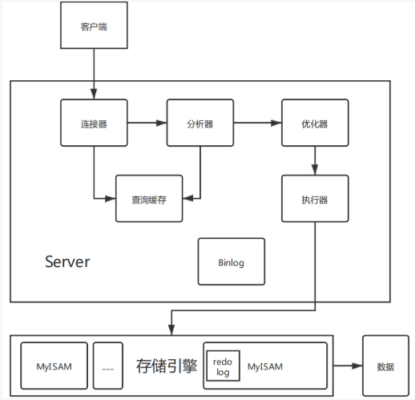
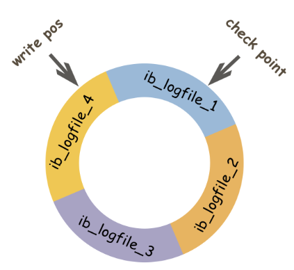

# 事务是什么？

一系列操作，要么全部完成，要么一个都不做

# 事务的ACID特性

- 原子性：一系列操作要么都执行，要么都不执行
- 一致性：事务执行前后数据完整性不变，如转账前后总金额不变
- 隔离性：多个事务并发访问数据库，事务之间互相隔离
- 持久性：事务提交后，在数据库中的改变是持久的，即使发生故障也一样

# 事务的隔离级别

- 未提交读：可出现脏读、不可重复读、幻读
- 不可重复读：不会出现脏读，可能出现不可重复读、幻读
- 可重复读：不会出现脏读、不可重复读，可能出现幻读
- 串行化：不会出现脏读、不可重复读、幻读

# 事务并发问题（脏读、不可重复读、幻读）

- 脏读：A读到了B未提交的数据
- 不可重复读：A重复读某一数据，B修改提交该数据，A读到了和之前不一样的数据
- 幻读：A修改了所有数据，B插入（修改）一条未修改的数据，A发现有一条数据未修改

# MyISAM与InnoDB 的区别

1. InnoDB支持事务，MyISAM不支持，对于InnoDB每一条SQL语言都默认封装成事务，自动提交，这样会影响速度，（所以最好把多条SQL语言放在begin和commit之间，组成一个事务）；
2. InnoDB支持外键，而MyISAM不支持。对一个包含外键的InnoDB表转为MYISAM会失败
3. InnoDB是聚集索引，使用B+Tree作为索引结构，数据文件是和（主键）索引绑在一起的（表数据文件本身就是按B+Tree组织的一个索引结构）。 MyISAM是非聚集索引，也是使用B+Tree作为索引结构，索引和数据文件是分离的。
4. InnoDB不保存表的具体行数，执行select count(*) from table时需要全表扫描。而MyISAM用一个变量保存了整个表的行数，执行上述语句时只需要读出该变量即可，速度很快
    - 那么为什么InnoDB没有了这个变量呢？
    - 因为InnoDB的事务特性，在同一时刻表中的行数对于不同的事务而言是不一样的，因此count统计会计算对于当前事务而言可以统计到的行数，而不是将总行数储存起来方便快速查询。
5. InnoDB支持表、行(默认)级锁，而MyISAM支持表级锁
    - InnoDB的行锁是实现在索引上的，而不是锁在物理行记录上。如果访问没有命中索引，也无法使用行锁，将要退化为表锁。
6. InnoDB表必须有主键（用户没有指定的话会自己找或生产一个主键），而Myisam可以没有
7. Innodb存储文件有frm、ibd，而Myisam是frm、MYD、MYI
    - Innodb：frm是表定义文件，ibd是数据文件
    - Myisam：frm是表定义文件，myd是数据文件，myi是索引文件

# 那么如何选择mysql引擎呢？

Innodb已经成为Mysql的默认引擎，它的优势是显而易见的。 1. 是否要支持事务，如果要请选择innodb，如果不需要可以考虑MyISAM； 2. 如果表中绝大多数都只是读查询，可以考虑MyISAM，如果既有读也有写，请使用InnoDB。 3. 系统奔溃后，MyISAM恢复起来更困难，能否接受；

# left join,right join,inner join,full join之间的区别

- left join会返回左表的所有行，即使在右表中没有匹配的数据
- right join会返回右表所有行，即使在左表中没有匹配的数据
- inner join会返回两个表共有的数据
- full join会返回两个表所有行，即使没有匹配

# 三大范式

- 第一范式（1NF）： 列不可再分（原子性）
    - 例：年级学校 -> 年级 学校
- 第二范式（2NF）： 首先满足第一范式，然后必须有主键，非主键必须完全依赖主键，即非主键既不能不依赖主键，也不能只依赖主键的一部分。
    - 例：学号 姓名 课程号 课程名
- 首先满足第二范式，同时其他非主键必须直接依赖主键，不能间接依赖
    - 间接依赖：学院依赖学号，学院地址依赖学院，间接依赖学号

# 切分数据库（水平切分、垂直切分）

- 为什么要切分数据库
    - 当单表记录数过大，CRUD性能会明显下降
- 水平切分：将一张表切分为多张表
    - 例：商品表 -> 商品表1 + 商品表2
- 垂直切分：按业务切分，同一类业务的表放到同一个库里
    - 例：网站系统（商品表、订单表、用户表）仓库系统（进货表、出货表）
- 水平切分和垂直切分的顺序：应先做水平切分，数据量再增大，考虑垂直切分

# 什么是池化思想？为什么要用数据库连接池？

- 池化思想：
    生活中的例子：每次都打好了几盒饭在那里放着，你可以直接取。和你要打饭才开始打。 初始预设资源，抵消每次获取资源的消耗，如创建线程的开销，获取远程连接的开销等
- 数据库连接池：
    连接池中先创建一定数量的连接，程序要获取连接直接从池中取，不必创建新的连接。如果池中的连接被用完了，新建一个放入池中。

# 什么是索引？优缺点是什么？

- 索引是用于快速查询和检索数据的数据结构，索引的常用数据结构有hash和B+树；
- 优点：可以提高检索速度，如果是唯一索引还能保证数据每一行的唯一性
- 缺点: 创建和维护索引的耗时，索引还占用存储空间

# 索引主要使用的数据结构？

- hash：hash索引底层是hash表，查询单条记录时hash索引更快，其余大部分场景更适合使用B+树索引
- B+树：索引底层使用B+树， B+ 树的特点是能够保持数据稳定有序，其插入与修改拥有较稳定的对数时间复杂度。 B+ 树元素自底向上插入。

# B树和B+树区别？

B树所有节点既存放key，也存放data。B+树只有叶子节点存放key和data，其余节点只存放key

B树的叶子节点独立的，B+树的叶子节点组成一条链表，可以通过它找到相邻的叶子节点。

B树检索时不一定会检索到叶子节点，B+树检索时一定会检索到叶子节点。

# Hash索引和B+树索引优劣分析？

hash索引优点定位快，**但不支持顺序查询和范围查询**，而且极端情况下发生大量Hash冲突（多个key的hash值相同）的话，查询也会变慢。

B+Tree索引支持顺序查询，范围查询，定位数据也不算慢

# MySQL的基本存储结构

MySQL的基本存储结构是页，各个页组成一个双向链表，每个页中的记录又可以组成一个单项链表

# 索引类型

关于索引的介绍：https://www.runoob.com/mysql/mysql-index.html

- 单列索引和组合索引
    - 单列索引：即一个索引只包含单个列，一个表可以有多个单列索引，但这不是组合索引。
    - 组合索引：即一个索包含多个列。
- 主键索引和二级索引(辅助索引)
    - 主键列使用的索引是主键索引，一个表只能有一个主键，不能重复不能为null
    - 二级索引也被称为辅助索引，二级索引的叶子节点中放的数据是主键。即通过二级索引可以定位主键的位置(回表)
    - 二级索引有唯一索引、普通索引、前缀索引和全文索引
- 聚集索引和非聚集索引
    - 聚集索引的数据和索引一起放（会把表中的每行数据存储到索引的叶子节点中）
    - 非聚集索引的数据和索引分开放
    - 主键索引属于聚集索引；二级索引属于非聚集索引
    - 聚集索引优缺点
        - 优点：查询速度快，定位到了key就可以立刻拿到数据，不用回表
        - 缺点：维护成本高，一旦数据发生修改，对应的索引也要进行修改
    - 非聚集索引优缺点
        - 优点：维护成本低
        - 缺点：可能需要回表，查询速度变慢
        - 注：回表：根据行号返回表中查找数据，扫描表是最慢的
- 覆盖索引：查询列和索引列是一致的

# 为表字段添加索引

- 添加主键索引：`alter table user add primary key(id)`
- 添加唯一索引：`alter table user add unqiue(id)`
- 添加普通索引：`alter table user add index index_name(id)`
- 添加前缀索引：`alter table user add index(username(4))`
- 添加全文索引：`alter table user add fulltext(username)`
- 添加多列索引：`alter table user add index index_name(id, age, gender)`

# 最左前缀原则

- 在MySQL建立联合索引时会遵守最左前缀匹配原则，即最左优先，在检索数据时从联合索引的最左边开始匹配。

# 如何选择字段作为索引

- 选择合适的字段
    - 不为NULL的字段
    - 被频繁查询的字段
    - 被作为条件查询的字段（被作为WHERE条件查询的字段，应该被考虑建立索引。）
    - 被经常频繁用于连接的字段
- 不合适创建索引的字段
    - 被频繁更新的字段应该慎重建立索引
    - 不被经常查询的字段没有必要建立索引
    - 尽可能的考虑建立联合索引而不是单列索引
    - 注意避免冗余索引（冗余索引指的是索引的功能相同，能够命中就肯定能命中 ，那么就是冗余索引如（name,city ）和（name ）这两个索引就是冗余索引，能够命中后者的查询肯定是能够命中前者的 在大多数情况下，都应该尽量扩展已有的索引而不是创建新索引。）
    - 考虑在字符串类型的字段上使用前缀索引代替普通索引

# 索引一定能提高查询性能吗？

大部分情况下能提高查询性能，数据量很小的情况下不一定

# MyISAM和InnoDB在CRUD下会默认加哪些锁？

- MyISAM在读时加表读锁，在增删改时加表写锁
- InnoDB在读时不加锁，在增删改时加排它锁（X）

# 表锁和行锁优缺点？MyISAM和InnoDB是否都支持行锁？InnoDB什么时候才会使用行锁？

- 表锁开销小，加锁快；不会出现死锁；锁定粒度大，发生锁冲突概率最高，并发度最低 -行锁开销大，加锁慢；会出现死锁；锁定粒度小，发生锁冲突概率最低，并发度最高。
- MyISAM不支持行锁，InnoDB支持行锁
- InnoDB在增删改的时候加行锁

# 为什么行锁会有死锁而表锁不会？

因为在加表锁前，要先解锁已有的表锁

# 为什么行锁发生锁冲突低而表锁高？

表锁会锁定表中的所有记录，对表中任何记录的请求都有可能被阻塞，所以冲突更多。

# 死锁和锁冲突如何理解？

- 死锁：

事务A:你不出来我就不进去

事务B:你不进来我就不出去

- 锁冲突

事务A:我想进去，但门锁上了进不去，只能等待开门

事务B:得把事情办完在开门出去

# 表锁有什么类型？什么时候会阻塞？它们的优先级？

1. 表读锁和表写锁
2. 读读不阻塞，读写阻塞，写写阻塞
3. 写锁优先级高于读锁。对于同一个表。同一时刻某个进程想获取读锁，另一个线程想获取写锁，则先获取写锁

# MyISAM的表读写锁和InnoDB的有什么区别？

- MyISAM可以支持并发的读和插入操作，当表中没有空洞（即没有被删除的行）时，允许在读表的同时从表尾插入记录
- InnoDB不支持并发的读和插入操作

# MyISAM和InnoDB的行锁与事务

- MyISAM没有行锁，InnoDB有行锁
- MyISAM没有事务，InnoDB有事务

# 行锁类型

- 共享锁（S）
    - 又称读锁，事务获取共享锁，允许读取某一行，同时不允许其他事务获取该行的排他锁，即读读不阻塞，读写阻塞
- 排它锁（X）
    - 又称写锁，一个事务获取了某行记录的排他锁，允许修改该行，同时不允许其他事务获取该行的共享锁和排他锁，即读写阻塞，写写阻塞

# 意向锁

- 为了允许表锁和行锁共存，实行多粒度机制，InnoDB内部使用两种意向锁，他们都是表锁
- 意向共享锁(IS):事务要给某行加共享锁，必须先获取表的意向共享锁
- 意向排他锁(IX):事务要给某行加排他锁，必须先获取表的意向排他锁
- 意向锁的获取数据库会隐式地帮我们去做，不用操心

# 间隙锁

用范围条件检索数据时，会给符合范围条件的已有数据记录的索引项加锁。键值在条件范围内但不存在记录，叫做“间隙”，InnoDB也会给这个间隙加锁，这个就叫做间隙锁

例：


```
select * from emp where id>100 for update;
```

目的：在可重复读的隔离级别下，使用间隙锁可以防止幻读

# 悲观锁

悲观锁是数据库层面的锁

对数据加排他锁（X），当事务A更新完成前事务B无法开始更新

具体操作：


```
select * from user for update
```

# 乐观锁

不是数据库层面的锁，而是使用版本字段

事务开始时获取版本字段，要修改时查看版本字段和之前是否一致，一致就更新，不一致就不更新


```
事务A开始，获取版本号
事务B开始，获取版本号
事务B修改，版本号更新
事务A发现版本号和之前不一样，数据不修改
```


# 死锁

死锁是指两个或多个事务在同一资源上互相占用，并请求加锁时，而导致的恶性循环现象。当多个事务以不同顺序试图加锁同一资源时，就会产生死锁。

生活中的例子：你不出来我不走，你不走我不出去

mysql例子：


```
//事务A
begin;
update user set name = xx where id = 1;
update user set name = xx where id = 2;
commit;
//事务B
begin;
update user set name = xx where id = 2;
update user set name = xx where id = 1;
commit;
```


A获取id=1的排他锁（X）

B获取id=2的排它锁（X）

A想要id=2的排他锁（X），等待B提交

B想要id=1的排他锁（X），等待A提交

# 如何避免死锁

以固定的顺序去操作数据记录，大事务拆成小事务，同一事务一次性锁定所有的资源，降低隔离级别，添加合理的索引

# InnoDB三种行锁的算法

Record Lock：单个行记录上的锁

Gap Lock: 间隙锁，锁定一个范围，但不包括记录本身

Next-Key Lock:锁定一个范围，并且包括记录本身

# Mysql架构及其各个部分概述

[](https://images.cnblogs.com/cnblogs_com/kylinxxx/1675669/o_201016234328mysql架构.png)

- 连接器：负责用户登录数据库，校验身份、校验权限。如果账户名和密码都正确，连接器就会到权限表中查询这个用户的所有权限。之后这个连接里的所有需要判断权限的情况都依赖于此时读到的权限数据。也就是说只要连接不断开，就算此时管理员修改了该用户的权限，也是不受影响的，还是按照之前查询到的权限来判断。
- 查询缓存：连接建立后，执行查询语句时要先查询缓存。如果缓存中存在这个key，就直接返回给客户端。没有这个key，执行后续的操作，最后会把结果缓存起来。真正执行缓存查询的时候会先校验用户的权限。MySQL8.0之后删除了缓存的功能。
- 分析器：如果没有命中缓存，就进入分析器，分析SQL语句究竟想干嘛，具体分为两步
    - 词法分析：提取出关键字，如select、表名、字段名、查询条件等
    - 语法分析：判断sql语句的语法是否正确
- 优化器：确定执行的较优方案，比如多个索引的时候如何选择索引，多表查询的时候如何选择关联顺序
- 执行器：准备执行sql，执行前会先校验用户权限，没有权限返回错误信息。有权限就去调用引擎接口，返回引擎接口的结果。

# redolog和binlog是什么？他们的区别？

[](https://images.cnblogs.com/cnblogs_com/kylinxxx/1675669/o_201016234945mysql日志.png)

# redolog的存储原理

[](https://images.cnblogs.com/cnblogs_com/kylinxxx/1675669/o_201016235559redolog原理.png)

[](https://images.cnblogs.com/cnblogs_com/kylinxxx/1675669/t_201016235608redolog原理2.png?a=1602892615701)

# 你可以用什么来确保表格里的字段只接受特定范围里的值？

Check 限制，它在数据库表格里被定义，用来限制输入该列的值。

触发器也可以被用来限制数据库表格里的字段能够接受的值，但是这种办法要求触发器在表格里被定义，这可能会在某些情况下影响到性能。

# 一条SQL语句执行很慢的原因

## 大多数情况下正常，偶尔会很慢

1.数据库在刷新脏页，如redo log写满了要同步到磁盘

2.执行时遇到锁

> 脏页是指内存数据页和磁盘数据页内容不一致

## 一直都很慢

1.没用上索引：如该字段没有索引或者对该字段使用了运算、函数等操作导致无法用索引

2.数据库选错了索引

# 子查询和联表查询的比较

1.表关联查询的效率要高于子查询，因为子查询走的是笛卡尔积

2.表关联查询可能有多条记录，子查询只有一条记录，如果需要唯一的列，最好走子查询

# 为什么MyISAM读比较快？

MyISAM读不是一定比InnoDB快的，要具体情况具体分析，一般来说InnoDB要维护的东西比较多造成读比MyISAM慢

# 更详细的char和varchar区别

VARCHAR 用于存储可变长宇符串， 它比定长类型更节省空间。
VARCHAR 使用额外1 或2 个字节存储字符串长度。列长度小千255 宇节时，使用1字节表示，否则使用2 字节表示
VARCHAR 存储的内容超出设置的长度时，内容会被截断。

CHAR 是定长的， 根据定义的字符串长妄分配足够的空间。
CHAR 会根据需要使用空格进行填充方便比较。
CHAR 适合存储很短的字符串， 或者所有值都接近同—个长度。
CHAR 存储的内容超出设置的长度时，内容同样会被截断。

- 使用策略：
    - 对于经常变更的数据来说， CHAR 比VARCHAR 更好，因为CHAR 不容易产生碎片。
    - 对于非常短的列， CHAR 比VARCHAR 在存储空间上更有效率。
    - 使用时要注惫只分配需要的空间，更长的列排序时会消耗更多内存。

# MylSAM 索引与lnnoDB 索引的区别？

- InnoDB 索引是聚簇索引， MyISAM 索引是非聚簇索引。
- InnoDB 的主键索引的叶子节点存储看行数据， 因此主键索引非常高效。
- MyISAM 索引的叶子节点存储的是行数据地址， 需要再寻址一次才能得到数据
- InnoDB 非主键索引的叶子节点存储的是主键和其他带索引的列数据， 因此查询时做到覆盖索引会非常高效。

# InnoDB引擎的4 大特性

- 插入缓冲(insert buffer)
- 二次写(double write)
- 自适应哈希索引(ahi)
- 预读(read ahead)

# 存储引擎选择

- 如果没有特别的需求， 使用默认的Innodb 即可。
- MyISAM: 以读写插入为主的应用程序，比如博客系统、新闻门户网站。
- Innodb: 更新（删除）操作频率也高，或者要保证数据的完整性；并发最高， 支持事务和外键。比如OA 自动化办公系统。

# 哈希索引

简要说下，类似于数据结构中简单实现的HASH 表（散列表） 一样，当我们在 mysql 中用哈希索引时，主要就是通过Hash 算法，将数据库字段数据转换 成定长的Hash 值，与这条数据的行指针一并存入Hash 表的对应位置，如果发 生Hash 碰撞（两个不同关键字的Hash 值相同），则在对应Hash 键下以链表 形式存储。

# 索引的基本原理

-索引用来快速地寻找那些具有特定值的记录。如果没有索引， 一般来说执行查询时遍历整张表。 - 索引的原理很简单，就是把无序的数据变成有序的查询 1. 把创建了索引的列的内容进行排序 2. 对排序结果生成倒排表 3. 在倒排表内容上拼上数据地址链 4. 在查询的时候， 先拿到倒排表内容， 再取出数据地址链，从而拿到具体数据

# SQL 的执行顺序

1、FROM : 将数据从硬盘加载到数据缓冲区， 方便对接下来的数据进行操作．
2、WHERE : 从基表或视图中选择满足条件的元组． （不能使用聚合函数）
3、JOIN
4、ON : join on 实现多表连接查询
5 、GROUP BY : 分组
6、HAVING ．在元组的基础上进行筛选， 选出符合条件的元组。（ 一般与GROUP BY 进行连用）
7、SELECT : 查询到得所有元组需要罗列的哪些列．
8、DISTINCT : 去重的功能。
9、UNION : 将多个亘询结果台并（默认去掉重要的记录） ．
10、ORDER BY : 进行相应的排序．
11 、LIMIT 1 ： 显示输出一条数据记录（元组）

# SQL 的生命周期？

1、应用服务器与数据库服务器建立一个连接
2、数据库进程拿到请求sql
3、解析并生成执行计划， 执行
4、读取数据到内存并进行逻辑处理
5、通过步骤一的连接， 发送结果到客户端
6、关掉连接， 释放资源

# UNION 与UNION ALL 的区别？

- 如果使用UNION ALL, 不会合并重复的记录行
- 效率UNION 高于UNION ALL

# drop 、delete 与truncate 的区别

下表分别是delete、truncate和drop

[](https://images.cnblogs.com/cnblogs_com/kylinxxx/1675669/o_201023180311delete、drop、truncate.png)

# mysql 中in 和exists 区别

mysql 中的in语句是把外表和内表作hash 连接，而exists 语句是对外表作loop 循环，每次loop 循环再对内表进行奎询。—亘大家都认为exists 比in 语 句的效率要高，这种说法其实是不准确的。这个是要区分环境的。 1. 如果查询的两个表大小相当，那么用in 和exists 差别不大。 2. 如果两个表中一个较小， 一个是大表，则子查询表大的用exists, 子查询表 小的用in。 3. not in 和not exists: 如果查询语句使用了not in, 那么内外表都进行全表扫描，没有用到索引，而not exists 的子查询依然能用到表上的索引。所以无论那个表大，用not exists 都比not in 要快。

# 大表怎么优化？分库分表了是怎么做的？分表分库了有什么问题？有用到中间件么？他们的原理知道么？

当MySQL 单表记录数过大时， 数据库的CRUD 性能会明显下降， 一些常见的优 化措旋如下： 1. 限定数据的范围： 务必禁止不带任何限制数据范围条件的查语句。比如： 我们当用户在查询订单历史的时候，我们可以控制在一个月的范围内．； 2. 读／写分离： 经典的数据库拆分方案， 主库负要写，从库负要读； 3. 缓存存： 使用MySQL 的缓存， 另外对重量级、更新少的数据可以考虑使用应用级别的缓存； 4. 还有就是通过分库分表的方式进行优化，主要有垂直分区、垂直分表和水平分区、水平分表

# 索引失效的几种情况

1. 有or
2. 不满足最左匹配原则
3. like ‘%xx’，即模糊查询
4. 需要类型转换
5. where中索引列有运算
6. where中索引列使用了函数
7. mysql觉得全表扫描更快的时候（数据量少）

# MySQL 中有哪几种锁？

1. 表级锁：开销小，加锁快，不会出现死锁，锁定粒度大，发生锁冲突的概率最高， 并发度最低。
2. 行级锁：开销大，加锁慢，会出现死锁，锁定粒度最小，发生锁冲突的概率最 低，并发度也最高。
3. 页面锁：开销和加锁时间界于表锁和行锁之间，会出现死锁，锁定粒度界于表锁和行锁之间，并发度一般．

# 主键和候选键有什么区别？

表格的每一行都由主键唯一标识， 一个表只有一个主键。主健也是侯选键。按照惯例，候选键可以被指定为主键， 并且可以用于任何外键引用．

# MySQL 如何优化DISTINCT?

DISTINCT 在所有列上转换为GROUP BY , 并与ORDER BY 子句结合使用．

# 解释MySQL 外连接、内连接与自连接的区别

> 先说什么是交叉连接：交叉连接又叫笛卡尔积，它是指不使用任何条件，直接将一个表的所有记录和另一个表中的所有记录一一匹配。

- 内连接则是只有条件的交叉连接，根据某个条件筛选出符合条件的记录，不符合条件的记录不会出现在结果组中，即内连接只连接匹配的行。
- 外连接其结果组中不仅包含符合连接条件的行，而且还会包括左表、右表或两个表中的所有数据行， 这三种情况依次称之为左外连接，右外连接，和全外连接。
    - 左外连接，也称左连接， 左表为主表， 左表中的所有记录都会出现在结果组中，对于那些在右表中并没有匹配的记录，仍然要显示，右边对应的那些字段值以NULL 来填充。
    - 右外连接，也称右连接，右表为主表，右表中的所有记录都会出现在结果集中。
    - 左连接和右连接可以互换，但MySQL目前还不支待全外连接。

# 可以使用多少列创建索引？

任何标准表最多可以创建16 个索引列。

# 列设詈为AUTO INCREMENT 时， 如果在表中达到最大值，会发生什么情况？

它会停止递增， 任何进一步的插入都将产生错误， 因为密钥已被使用．

# 怎样才能找出最后一次插入时分配了哪个自动增量？

LAST_ INSERT_ ID 将返回由Auto_increment 分配的最后一个值， 并且不需要指定表名称。

# 你怎么看到为表格定义的所有索引？


```
show index from <tablename>;
```

# LIKE 声明中的％和＿是什么意思？

％对应0个或更多字符，＿只是LIKE语句中的一个字符．

# 什么是通用 SQL 函数？

1、CONCAT(A, B) – 连接两个字符串值以创建单个字符串输出。通常用于将两个

或多个字段合并为一个字段。

2、FORMAT(X, D)- 格式化数字 X 到 D 有效数字。

3、CURRDATE(), CURRTIME()- 返回当前日期或时间。

4、NOW（） – 将当前日期和时间作为一个值返回。

5、MONTH（），DAY（），YEAR（），WEEK（），WEEKDAY（） – 从日期

值中提取给定数据。

6、HOUR（），MINUTE（），SECOND（） – 从时间值中提取给定数据。

7、DATEDIFF（A，B） – 确定两个日期之间的差异，通常用于计算年龄

8、SUBTIMES（A，B） – 确定两次之间的差异。

9、FROMDAYS（INT） – 将整数天数转换为日期值。

# MySQL 里记录货币用什么字段类型好

在java的开发中，货币在数据库中MySQL常用Decimal和Numric类型表示，这两种类型被MySQL实现为同样的类型。他们被用于保存值，该值的准确精度是极其重要的值，例如与金钱有关的数据。当声明一个类是这些类型之一时，精度和规模的能被(并且通常是)指定；例如：


```
salary DECIMAL(9,2)
```

# 列的字符串类型可以是什么？

在SQL中，将字符串类型分为了六类：char,varchar,text,blob,enum和set。

[](https://img-blog.csdn.net/20170511144728384?watermark/2/text/aHR0cDovL2Jsb2cuY3Nkbi5uZXQvSjA4MDYyNA==/font/5a6L5L2T/fontsize/400/fill/I0JBQkFCMA==/dissolve/70/gravity/SouthEast)

这里对text、blob、enum、set做些补充

> 文本字符串

如果数据量超过255个字符，通常会使用文本字符串。

文本字符串根据存储的数据格式进行分类：

- Text：存储文字；
- Blob：存储二进制数据，如图片、音频等。

通常二进制数据实际上数据库存储路径，物理文件放在磁盘上面。

> 枚举

enum，事先将所有出现的结果都设计好，实际存储的数据必须是预先规定的数据的一个。其作用如下：

① 规范数据格式，数据只能是规定的数据中的其中一个；

② 节省存储空间，枚举通常有一个别名-单选框；枚举实际存储的是数值而不是字符串本身。


```
create table my_enum(
gender enum('男','女','保密')
)charset utf8;
desc my_enum;
insert into my_enum VALUES('男');--有效数据
insert into my_enum VALUES('人妖');--无效数据
```


> 集合字符串

集合跟枚举很相似，实际存的是数字而不是字符串本身（集合是多选），区别与枚举，别名可以称为复选框。

Set(元素列表)，可以使用元素列表中的多个元素，元素之间可以使用逗号分隔。


```
create table my_set(
hobby SET('篮球','足球','乒乓球','羽毛球','排球','台球','网球','棒球')
)charset utf8;
DESCRIBE my_set
```


# MySQL数据库作发布系统的存储，一天五万条以上的增量，预计运维三年怎么优化？

1. 设计良好的数据库结构， 允许部分数据冗余，尽量避免join查询， 提高效率；
2. 选择合适的表字段数据类型和存储引擎，适当的添加索引；
3. MySQL 库主从读写分离。
4. 找规律分表， 减少单表中的数据量提高查询速度．
5. 添加缓存机制， 比如memcached , apc等．
6. 不经常改动的页面，生成静态页面。
7. 书写高效率的sql语句，比如尽量写全字段名，不要写select * 这种。

# 关于优化sql语句更多细节

## 优化长难查询语句

- 分析是一个复杂查询还是多个简单查询速度快
- 将一个大的查询分为多个小的相同的查询，而且单个查询可以减少锁的竞争
- 一次性删除1000万的数据要比一次删除1 万，暂停一会的方案更加损耗服务器 开销。
- 分解关联查询，让缓存的效率更高。

## 优化特定类型的查询语句

- 使用缓存
- 增加汇总表
- myisam中没有任何where条件的count(*)非常快

## 优化关联查询

- 确定ON 或者USING 子句中是否有索引。
- 确保GROUP BY 和ORDER BY 只有一个表中的列， 这样MySQL 才有可能使用索引。

## 优化子查询

- 用关联查询替代子查询，关联查询中，使用标识列分组的效率更高
- 优化GROUP BY 和DISTINCT，可以使用索引来优化
- 如杲不需要ORDER BY, 进行GROUP BY 时加ORDER BY NULL, MySQL 不 会再进行文件排序。

## 优化limit页

- limit偏移量大的时候查询效率低，可以记录上次查询的最大ID , 下次查询时直接根据该ID 来查询

## 优化UNION查询

- UNION ALL效率更高

## 优化where子句

多数数据库都是从左往右的顺序处理条件的，把能够过滤更多数据的条件放到前 面，把过滤少的条件放在后面。

# 锁的优化

1. 读写分离
2. 分段加锁
3. 减少锁持有的时间
4. 多个线程尽量用相同的顺序去获取资源