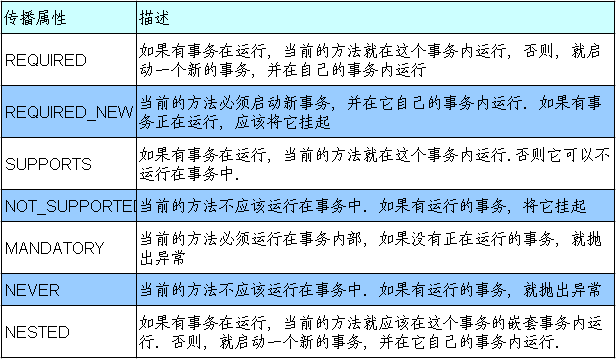
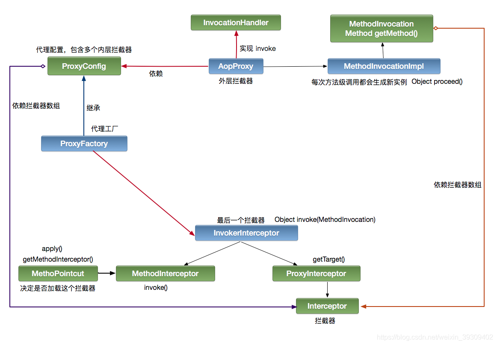
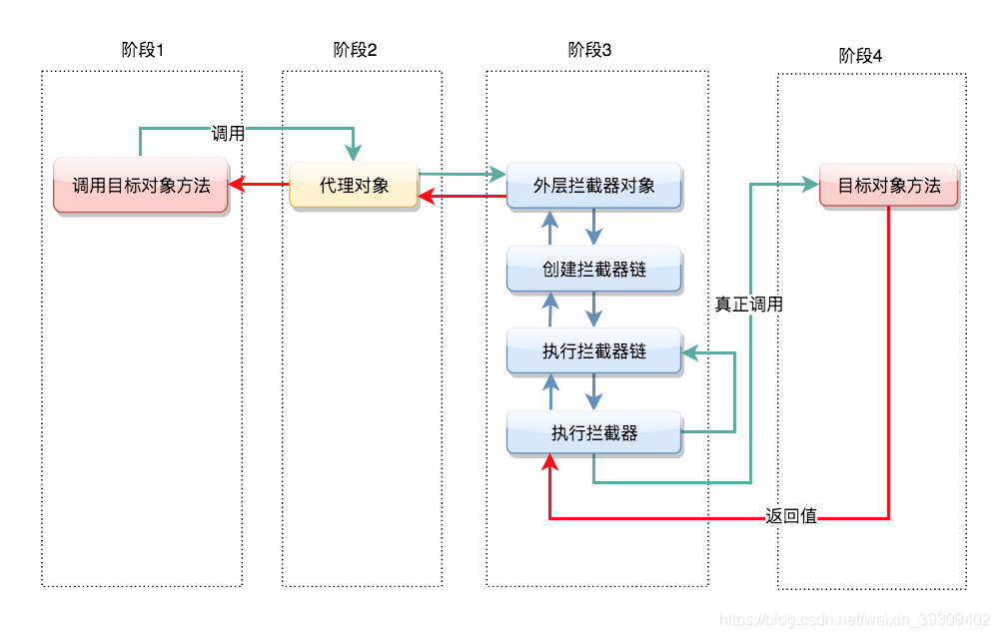

# 什么是Spring IOC 容器？

容器创建对象， 将它们装配在一起， 配置它们并管理它们的完整生命周期。Sp ring 容器使用依赖注入来管理组成应用程序的组件。容器通过读取提供的配置元数据来接收对象进行实例化。该元数据可以通过XML, Java 注解或Java 代码提供．

Spring 中的IoC 的实现原理就是工厂模式加反射机制。

# 什么是依赖注入？

当某个角色(可能是一个Java实例，调用者)需要另一个角色(另一个Java实例，被调用者)的协助时，在 传统的程序设计过程中，通常由调用者来创建被调用者的实例。但在Spring里，创建被调用者的工作不再由调用者来完成，因此称为控制反转;创建被调用者 实例的工作通常由Spring容器来完成，然后注入调用者，因此也称为依赖注入。

# 可以通过多少种方式完成依赖注入？

三种

- 构造函数注入
- setter注入
- 基于注解注入`@Autowired`
- 接口注入（不提倡这种用法）

详见：https://zhuanlan.zhihu.com/p/194237253?utm_source=wechat_session

# spring 中有多少种IOC 容器？

- BeanFactory - BeanFactory 就像一个包含bean组合的工厂类。它会在客户端要求时实例化bean.
- ApplicationContext - ApplicationContext 接口扩展了BeanFacto ry 接口。它在BeanFactory 基础上提供了一些额外的功能。

# Bean Factory 和ApplicationContext区别

- Bean Factory
    - 它使用懒加载
    - 不支持基于依赖的注解
- Application Context
    - 它使用即时加载
    - 支持基于依赖的注解

# 什么是spring bean?

- 它们是构成用户应用程序主干的对象。
- Bean 由Spring IoC 容器管理，实例化、配置和装配
- Bean 是基于用户提供给容器的配置元数据创建。

# spring 提供了哪些配置方式？

> 基于xml配置

bean 所需的依赖项和服务在XML格式的配置文件中指定。


```
<bean id= "studentbean" class= "org.edureka.firstSpring.StudentBean" >
    <property name="name" value="Edureka" > </property>
</bean>
```

> 基于注解配置

可以通过在相关的类，方法或字段声明上使用注解，将bean配置为组件类本身， 默认情况下，Spring容器中未打开注解装配。因此，您需要在使用它之前在Spring配置文件中启用它。


```
<beans>
    < context:annotation-config/ >
</beans>
```

> 基于java配置

Spring 的Java 配置是通过使用＠Bean 和＠Configuration 来实现。

- Spring的@Bean注解用于告诉方法，产生一个Bean对象，然后这个Bean对象交给Spring管理。(和xml配置中的bean标签的作用是一样的)
- 用@Configuration注释类表明其主要目的是作为bean定义的源，允许通过简单地调用同一个类中的其他＠ Bean 方法来定义bean 间依赖关系。

# 什么是spring 的内部bean?

当一个bean仅被用作另一个bean的属性时，它能被声明为一个内部bean，为了定义inner bean，在Spring 的 基于XML的 配置元数据中，可以在 或 <constructor-arg/> 元素内使用 元素，内部bean通常是匿名的，它们的Scope一般是prototype。


<?xml version="1.0" encoding="UTF-8"?>


<beans xmlns="http://www.springframework.org/schema/beans"       xmlns:xsi="http://www.w3.org/2001/XMLSchema-instance"       xsi:schemaLocation="http://www.springframework.org/schema/beans http://www.springframework.org/schema/beans/spring-beans.xsd">


```
&lt;bean id=&quot;person2&quot; class=&quot;com.itdjx.spring.dependency.injection.Person&quot;&gt;
    &lt;property name=&quot;name&quot; value=&quot;李玉&quot;/&gt;
    &lt;property name=&quot;age&quot; value=&quot;23&quot;/&gt;
    &lt;property name=&quot;sex&quot; value=&quot;女&quot;/&gt;
    &lt;property name=&quot;car&quot; &gt;
        &lt;bean class=&quot;com.itdjx.spring.dependency.injection.Car&quot;&gt;
            &lt;constructor-arg value=&quot;Ferrari&quot; index=&quot;0&quot;/&gt;
            &lt;constructor-arg value=&quot;Italy&quot; index=&quot;1&quot;/&gt;
            &lt;constructor-arg value=&quot;22500000&quot; type=&quot;double&quot;/&gt;
        &lt;/bean&gt;
    &lt;/property&gt;
&lt;/bean&gt;
```


</beans>


# 什么是spring 装配

就是让应用程序上下文为你找出依赖项的过程。说的通俗一点，就是Spring会在上下文中自动查找，并自动给bean装配与其关联的属性！

spring中实现自动装配的方式有两种，一种是通过xml文件、另一种是通过注解

https://www.cnblogs.com/bear7/p/12531016.html

# @Component,@Repository,@Service, @Controller

把类标识成可用于 @Autowired 注解自动装配的 bean 的类

- @Component ：通用的注解，可标注任意类为 Spring 组件。如果一个 Bean 不知道属于哪个层，可以使用@Component 注解标注。
- @Repository : 对应持久层即 Dao 层，主要用于数据库相关操作。
- @Service : 对应服务层，主要涉及一些复杂的逻辑，需要用到 Dao 层。
- @Controller : 对应 Spring MVC 控制层，主要用于接受用户请求并调用 Service 层返回数据给前端页面。

# @Required

@Required注释为为了保证所对应的属性必须被设置，@Required 注释应用于 bean 属性的 setter 方法

# @Autowired

@Autowired 注释，它可以对类成员变量、方法及构造函数进行标注，完成自动装配的工作。

# @Autowired和@Resource的区别

@Autowired注解是按类型装配依赖对象，默认情况下它要求依赖对象必须存在，如果允许null值，可以设置它required属性为false。

@Resource注解和@Autowired一样，也可以标注在字段或属性的setter方法上，但它默认按名称装配。名称可以通过@Resource的name属性指定，如果没有指定name属性，当注解标注在字段上，即默认取字段的名称作为bean名称寻找依赖对象，当注解标注在属性的setter方法上，即默认取属性名作为bean名称寻找依赖对象。

# @Qualifier

使用 @Autowired 注解是 Spring 依赖注入的常用方法。但有时候Spring不知道需要注入哪一个bean。通过使用 @Qualifier 注解，我们可以消除需要注入哪个 bean 的问题。通过将 @Qualifier 注解与我们想要使用的特定 Spring bean 的名称一起进行装配，Spring 框架就能从多个相同类型并满足装配要求的 bean 中找到我们想要的

# @ RequestMapping 注解有什么用？

使用 @RequestMapping 来映射请求，也就是通过它来指定控制器可以处理哪些URL请求

# spring 支持的事务管理类型

- 编程式事务管理
    - 编程帮助下实现对事务的管理
- 声明式事务管理
    - 事务管理和业务代码分离，靠注解或者xml配置来管理事务

声明式事务的传播属性

[](https://images.cnblogs.com/cnblogs_com/kylinxxx/1675669/o_201106014745图片23.png)

隔离级别


```
读未提交：READ UNCOMMITTED
读已提交：READ COMMITTED
可重复读：REPEATABLE READ
串行化：SERIALIZABLE
```

# AOP概念

- Spring AOP(Aspect Oriented Programming，面向切面编程)，是OOPs(面向对象编程)的补充，它也提供了模块化。AOP的关键单元是切面，或者说关注点一些切面可能有集中的代码，但是有些可能被分散或者混杂在一起，例如日志或者事务。这些分散的切面被称为横切关注点。一个横切关注点是一个可以影响到整个应用的关注点，而且应该被尽量地集中到代码的一个地方，例如事务管理、权限、日志、安全等。
- AOP让你可以使用简单的配置，通过不同的通知类型，在实际逻辑执行之前、之后或周围动态添加横切关注点。这让代码在当下和将来都变得易于维护。
- Spring AOP是基于代理实现的。

# Spring中有哪些不同的通知类型

通知(advice)是你在你的程序中想要应用在其他模块中的横切关注点的实现。Advice主要有以下5种类型：

- 前置通知(Before Advice): 在连接点之前执行的Advice，不过除非它抛出异常，否则没有能力中断执行流。使用 @Before 注解使用这个Advice。
- 返回之后通知(After Retuning Advice): 在连接点正常结束之后执行的Advice。例如，如果一个方法没有抛出异常正常返回。通过 @AfterReturning 关注使用它。
- 抛出（异常）后执行通知(After Throwing Advice): 如果一个方法通过抛出异常来退出的话，这个Advice就会被执行。通用 @AfterThrowing 注解来使用。
- 后置通知(After Advice): 无论连接点是通过什么方式退出的(正常返回或者抛出异常)都会执行在结束后执行这些Advice。通过 @After 注解使用。
- 围绕通知(Around Advice): 围绕连接点执行的Advice，就你一个方法调用。这是最强大的Advice。通过 @Around 注解使用。

# 简述一下Spring AOP的设计原理

主要的分代理的创建和代理的调用两部分

[](https://img-blog.csdnimg.cn/20190916100616392.png?x-oss-process=image/watermark,type_ZmFuZ3poZW5naGVpdGk,shadow_10,text_aHR0cHM6Ly9ibG9nLmNzZG4ubmV0L3dlaXhpbl8zOTMwOTQwMg==,size_16,color_FFFFFF,t_70)

- 代理的创建

创建代理工厂：拦截器数组，目标对象接口数组，目标对象。
创建代理工厂时，默认会在拦截器数组尾部再增加一个默认拦截器 —— 用于最终的调用目标方法。
当调用 getProxy 方法的时候，会根据接口数量大余 0 条件返回一个代理对象（JDK or Cglib）。
注意：创建代理对象时，同时会创建一个外层拦截器，这个拦截器就是 Spring 内核的拦截器，用于控制整个 AOP 的流程。

- 代理的调用

当对代理对象进行调用时，就会触发外层拦截器。 外层拦截器根据代理配置信息，创建内层拦截器链。创建的过程中，会根据表达式判断当前拦截是否匹配这个拦截器。而这个拦截器链设计模式就是职责链模式。 当整个链条执行到最后时，就会触发创建代理时那个尾部的默认拦截器，从而调用目标方法，最后返回。

[](https://img-blog.csdnimg.cn/20190916103141419.png?x-oss-process=image/watermark,type_ZmFuZ3poZW5naGVpdGk,shadow_10,text_aHR0cHM6Ly9ibG9nLmNzZG4ubmV0L3dlaXhpbl8zOTMwOTQwMg==,size_16,color_FFFFFF,t_70)

# 在Spring AOP中关注点和横切关注点有什么不同？

关注点:我们在应用的模块中实现以解决特定业务问题的方法。比如库存管理、航运管理、用户管理等。

横切关注点:贯穿整个应用程序的关注点。像事务管理、权限、日志、安全等。

# Spring AOP的代理是什么？

Spring AOP是基于代理实现的，默认为标准的 JDK 动态代理。这使得任何接口（或者接口的集合）可以被代理。