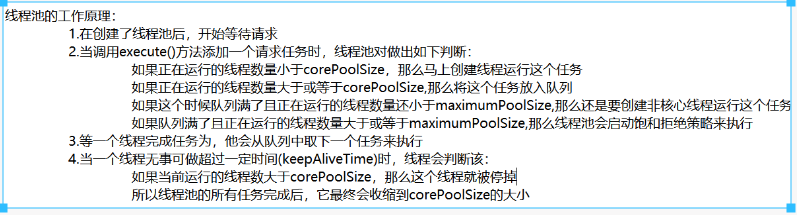

# 基础知识速看

> 为什么要使用并发编程

- 提升多核CPU的利用率： 一般来说一台主机上的会有多个CPU 核心，我们可以创建多个线程，理论上操作系统可以把多个线程分配给不同的CPU去执行，每个CPU 执行一个线程， 这样就提高了CPU的使用效率。
- 比如当我们在网上购物时， 为了提升响应速度， 需要拆分，减库存， 生成订单等等这些操作，就可以进行拆分利用多线程的技术完成。面对复杂业务模型，并行程序会比串行程序更适应业务需求，而并发编程更能吻合这种业务拆分。
- 简单来说就是：
    - 充分利用多核CPU 的计算能力；
    - 方使进行业努拆分，提升应用性能

> 多线程应用场景

例如迅雪多线程下载、数据库连接池、分批发送短信等。

> 并发编程有什么缺点

可能导致内存泄露、上下文切换、线程安全、死锁

> 并发编程三个必要因素是什么？

java内存模型的三大特性：java内存模型有三大特性，原子性、可见性、有序性。

- 原子性：要么执行，要么不执行，主要使用互斥锁Synchronize或者lock来保证操作的原子性；
- 可见性：一个线程对共享变量的修改，另—个线程能够立刻看到。（具体的说：在变量修改后将新值同步回主内存，主要有两种实现方式，一是volatile，被volatile修饰的变量发生修改后会立即刷新到主内存；二是使用Synchronize或者lock，当一个变量unlock之前会将变量的修改刷新到主内存中）；
- 有序性：程序执行的顺序按照代码的先后顺序执行。（具体的说：在Java内存模型中，允许编译器和处理器对指令进行重排序，但是重排序不会影响单线程的执行结果，却会影响多线程并发执行的正确性。主要有两种方式确保有序性：volatile 和 Synchronize 关键字，volatile是通过添加内存屏障的方式来禁止指令重排序，也就是重排序是不能把后面的指令放到内存屏障之前执行；Synchronize是保证同一时刻有且只有一个线程执行同步代码，类似于串联顺序执行代码）。

> 在Java 程序中怎么保证多线程的运行安全？

出现线程安全问题的原因—般都是三个原因： 1. 线程切换带来的原子性问题解决办法：使用多线程之间同步synchronized 或使用锁(lock) 。 2. 缓存导致的可见性问题解决办法： synchronized、volatile、LOCK , 可以解决 3. 可见性问题:编译优化带来的有序性问题解决办法： Happens - Before 规则可以解决有序性问题

> 并和并发有什么区别？

- 并发：多个任务在同一个CPU 核上，按细分的时间片轮流（交替）执行，从逻编上来看那些任务是同时执行。
- 并行： 单位时间内，多个处理器或多核处理器同时处理多个任务， 是真正意义上的“同时进行” 。
- 串行： 有n个任务， 由一个线程按顺序执行。由于任务、方法都在一个线程执行，所以不存在线程不安全情况，也就不存在临界区的问题。

做个比喻

并发=两人共用一台电脑 并行=两人分配了两台电脑 串行=两人排队使用一台电脑

> 多线程的常用方法

- sleep（）:强迫一个线程睡眠N秒
- isAlive():判断一个线程是否存活
- join()：等待线程终止
- activeCount()：程序中活跃的线程数量
- enumerate()：枚举程序中的线程
- currentThread()：得到当前线程
- isDaemon（）：一个线程是否为守护线程
- setDaemon()：设置一个线程为守护线程
- setName()：设置线程的名字
- wait()： 强迫一个线程等待
- notify()： 通知一个线程继续运行
- setPriority()： 设置一个线程的优先级

# 什么是线程和进程?它们的区别？

进程是操作系统分配资源的最小单元，线程是操作系统调度的最小单元。 一个程序至少有一个进程， 一个进程至少有一个线程。

- 线程不能看做独立应用，而进程可以看做独立应用
- 进程有独立的地址空间，相互不影响，线程知识进程的不同执行路径
- 线程没有独立的地址空间，多进程的程序比多线程的程序健壮
- 进程的切换比线程的切换开销大

# 进程的生命周期和状态

生命周期：进程因创建而产生，因调度而运行，因等待资源或事件而阻塞，因完成任务而被撤销

进程的基本状态：

- 就绪状态：进程已分配到除CPU时间片之外的所有必要资源，只要获得CPU，就可以立即执行，进程这时的状态就称为就绪状态。一个系统中处于就绪状态的进程可能有多个，通常将他们排成一个队列，称为就绪队列
- 执行状态：进程已获得CPU时间片，程序正在执行。
- 阻塞状态：正在执行的进程由于等待资源或者事件而暂时无法继续执行时，进入阻塞状态。

# 线程的生命周期和状态

- new(新建)->ready(可运行)->running(运行中)->blocked(阻塞状态)->waiting(等待状态)->time_waiting(超时等待)->terminated(终止状态)
- 线程创建后处于new状态，调用start()方法后开始运行，处于ready状态，处于ready状态的线程获得了cpu时间片timeslice后就处于running状态
- 线程执行wait()方法之后进入waiting状态，进入等待状态后需要依靠其他线程的通知才能返回到运行状态
- time_waiting状态相当于在等待基础上增加了超时限制，当超时时间达到后线程返回到runnning状态
- 线程调用同步方法时，如果没有获取锁，就进入blocked状态
- 线程执行了run()方法之后进入terminated状态

# 线程的程序计数器、java栈和本地方法栈为什么要线程私有？

- 程序计数器私有是为了线程切换后能恢复到正确的执行位置
- java栈和本地方法栈私有是为了保证线程中的局部变量不被别的线程访问到

# 并发和并行的区别？

- 并发是同一时间段多个任务都在执行
- 并行是单位时间内多个任务同时执行

# 为什么要用多线程?使用多线程可能带来什么问题？

- 提高系统的并发能力以及性能
- 单核时代可以提高CPU和IO的综合利用率，当一个线程使用CPU计算时，另一个线程可以进行IO操作
- 多核情况下可以减少线程上下文切换的开销
- 多核情况下还可以提高CPU利用率，使用单线程的话多个核中只有一个被使用，使用多线程则多个核被使用

带来的问题：内存泄漏、死锁、线程不安全等

衍生问题：

# 什么是线程死锁？如何避免死锁？死锁如何检测？

死锁： 是指两个或两个以上的进程（ 或线程） 在执行过程中， 因争夺资源而造成的一种互相等待的现象，若无外力作用，它们都将无法推进下去。

> 产生死锁的四个必要条件

- 互斥条件：每个锁任意时刻只由一个线程占用
- 占有且等待条件：一个线程因为请求锁而阻塞的时候，对于自己持有的锁保持不放
- 不可抢占条件：线程持有的锁在还没有释放之前不能被其他线程强行剥夺
- 循环等待条件：若干个线程形成一种头尾相接循环等待的锁关系

一个死锁代码：


```
new Thread(() -> {
    synchronized (resource1){//线程1持有资源1
        //执行任务1
        synchronized (resouce2){//线程1尝试获取资源2
            //执行任务2
        }
    }
}, "线程1"）.start();
new Thread(() -> {
synchronized (resource2){//线程2持有资源2
//执行任务1
synchronized (resouce1){//线程2尝试获取资源1
//执行任务2
}
}
}, "线程2"）.start();
```


> 如何避免死锁

- 一次性申请所有资源

代码如下：


```
new Thread(() -> {
    synchronized (resource1){//线程1持有资源1
        synchronized (resouce2){//线程1尝试获取资源2
            //执行任务1
            //执行任务2
        }
    }
}), "线程1".start();
```

- 线程尝试获取资源时，如果获取不到，可以主动释放持有的锁

代码如下：


privatestatic Lock resource1 = new ReentrantLock();


privatestatic Lock resource2 = new ReentrantLock();


public static void main(String[] args) {
 new Thread(() -> {
 resource1.lock();//线程1持有资源1
 //执行任务1
 if(resource2.tryLock(time, unit)){//线程1尝试获取资源2
 //线程1持有资源2
 //执行任务2
 }else {
 //线程1获取资源2失败
 resource1.unlock();//主动释放所有资源
 }
 }, "线程1").start();


```
new Thread(() -&gt; {
    resource2.lock();//线程2持有资源2
    //执行任务1
    if(resource1.tryLock(time, unit)){//线程2尝试获取资源1
        //线程2持有资源1
        //执行任务2
    }else {
        //线程2获取资源1失败
        resource1.unlock();//主动释放所有资源
    }
}, &quot;线程2&quot;).start();
```


}


- 规定不同线程必须按照一定的顺序来获取资源

代码如下：


```
new Thread(() -> {
    synchronized (resource1){//线程1持有资源1
        //执行任务1
        synchronized (resource2){//线程1尝试获取资源2
            //执行任务2
        }
    }
}, "线程1").start();
new Thread(() -> {
synchronized (resource1){//线程2持有资源1
//执行任务1
synchronized (resource2){//线程2尝试获取资源2
//执行任务2
}
}
}, "线程2").start();
```


> 死锁如何检测

java中提供了可以检测死锁的工具类ThreadMXBean，可以用它来在项目运行时期检查是否有死锁存在


publicstatic ThreadMXBean mbean = ManagementFactory.getThreadMXBean();


public static void main(String[] args) {
 //一些线程执行的代码


```
//获取所有死锁线程的id
long[] deadlockedThreads = mbean.findDeadlockedThreads();
```


}


# 什么是上下文切换？

任务在执行完cpu时间片切换到另一个任务之前会保存自己的状态，以便下一次在切换回这个任务时，可以加载这个任务的状态。任务从保存到再加载的过程就是一次上下文切换。

# 多线程实现的几种方式

- **继承Thread类**，重写run()方法
- **实现Runnable接口**，重写run()方法，实现Runnable接口的实现类的实例作为Thread构造函数的第一个参数，第二个参数是线程名
- 通过**Callable**和**FutureTask**创建线程
- 使用**线程池**

各个方式的代码：

Thread


publicclass MyThread extends Thread{


@Override


publicvoidrun() {


​        System.out.println(Thread.currentThread().getName() + "执行中");


​    }


```
public static void main(String[] args) {
    MyThread myThread = new MyThread();
    myThread.setName(&quot;线程1&quot;);
    myThread.start();
}
```


}


Runnable


publicclassMyRunnableimplementsRunnable{


​    @Override


public void run() {


​        System.out.println(Thread.currentThread().getName() + "执行中");


​    }


```
public static void main(String[] args) {
    new Thread(new MyRunnable(), &quot;线程1&quot;).start();
    new Thread(() -&gt; {
        System.out.println(Thread.currentThread().getName() + &quot;执行中&quot;);
    }, &quot;线程2&quot;).start();
}
```


}


Callable和FutureTask


publicclassMyCallableimplementsCallable{


​    @Override


public Object call() throws Exception {


​        System.out.println(Thread.currentThread().getName() + "执行中");


return1024;


​    }


```
public static void main(String[] args) {
    FutureTask&lt;Integer&gt; futureTask1 = new FutureTask&lt;&gt;(new MyCallable());
    new Thread(futureTask1, &quot;线程1&quot;).start();
    System.out.println(futureTask1.get());

    FutureTask&lt;Integer&gt; futureTask2 = new FutureTask&lt;&gt;(() -&gt; {
        System.out.println(Thread.currentThread().getName() + &quot;执行中&quot;);
        return 1024;
    });
    new Thread(futureTask2, &quot;线程2&quot;).start();
    System.out.println(futureTask2.get());
}
```


}


# Runnable接口和Callable接口区别？

- Runnable接口不会返回结果或者抛出检查异常，Callable会
- Executors可以实现Runnable转化为Callable

```
Callable callable = Executors.callable(new Runnable(),返回值);
```

# 什么是Callable 和Future?

- Callable 接口类似千Runnable,但callable可以返回值，这个返回值可以被Future拿到，也就是说，Future可以拿到异步执行任务的返回值。
- Future 接口表示异步任务， 是—个可能还没有完成的异步任务的结果。所以说
- Callable 用于产生结果， Future 用于获取结果。

# 实现线程同步的方法

- 同步代码方法sychronized 关键字修饰的方法
- 同步代码块：sychronized 关键字修饰为代码块
- 使用特殊变量域volatile 实现线程同步volatile 关键字为域变量的访问提供了一种免锁机制
- 使用重入锁实现线程同步： reentrantlock 类是可冲入、互斥、实现了lock接口的锁，他与sychronized方法具有相同的基本行为和语义

# 为什么调用start()方法时会执行run()方法，我们却不能直接调用run()方法？

new一个Thread，线程进入新建状态；调用start()方法，线程进入ready状态，当分配到时间片后开始运行。start()方法会执行线程的相应准备工作，然后自动执行run()方法的内容。

直接执行run()方法，会把run()方法当成一个main线程下的普通方法去执行，并不会在某个线程中执行它

# notify(）和notifyAII(）有什么区别？

当一个线程进入wait 之后， 就必须等其他线程notify/notifyall，使用no tifyall， 可以唤醒所有处于wait 状态的线程， 使其重新进入锁的争夺队列中， 而notify 只能唤醒一个。如果没把握， 建议notifyAll, 防止notigy 因为信号丢失而适成程序异常。

# sleep()方法和wait()方法的区别和共同点？

- 两者都可以暂停线程的执行，区别在于sleep()没有释放锁，wait()释放了锁
- sleep用于暂停执行，wait用于线程交互
- sleep执行完成后，线程会自动苏醒；wait()调用后要等待别的线程调用同一个对象的notify或者notifyAll方法才能苏醒。或者也可以使用wait(long timeout)超时后线程也可以自动苏醒。

# 简单说下synchronize

synchronize是java中的关键字，可以用来修饰实例方法、静态方法、还有代码块；从java内存模型的三大特性来看，主要有三种作用：可以确保原子性、可见性、有序性

java内存模型的三大特性：java内存模型有三大特性，原子性、可见性、有序性。

- 原子性：要么执行，要么不执行，主要使用互斥锁Synchronize或者lock来保证操作的原子性；
- 可见性：一个线程对共享变量的修改，另—个线程能够立刻看到。（具体的说：在变量修改后将新值同步回主内存，主要有两种实现方式，一是volatile，被volatile修饰的变量发生修改后会立即刷新到主内存；二是使用Synchronize或者lock，当一个变量unlock之前会将变量的修改刷新到主内存中）；
- 有序性：程序执行的顺序按照代码的先后顺序执行。（具体的说：在Java内存模型中，允许编译器和处理器对指令进行重排序，但是重排序不会影响单线程的执行结果，却会影响多线程并发执行的正确性。主要有两种方式确保有序性：volatile 和 Synchronize 关键字，volatile是通过添加内存屏障的方式来禁止指令重排序，也就是重排序是不能把后面的指令放到内存屏障之前执行；Synchronize是保证同一时刻有且只有一个线程执行同步代码，类似于串联顺序执行代码）。

# synchronize优化

在早期版本中，synchronized属于重量级锁，效率低下，因为monitor是依赖于底层的操作系统的Mutex Lock来实现的，而操作系统实现线程之间的切换是需要从用户态转换到核心态，这个状态之间的转换需要相对较长的时间，时间成本相对较高，这也是早期synchronized锁效率低的原因。Java6之后对synchronized有较大优化，引入了轻量级锁和偏向锁。

## 偏向锁

- 在大多数情况下，锁不仅不存在多线程进程，而且总是由同一线程多次获得，因此为了减少同一线程多次获取锁的代价引入偏向锁。
- 偏向锁的核心思想是，如果一个线程获得了锁，那锁就进入偏向模式，此时Mark Word的结构也会变为偏向锁结构。当这个线程再次请求锁时，无需任何同步操作，即获取锁的过程，这样就省去了大量有关锁申请的操作，从而提高性能。
- 对于没有锁竞争的场合，偏向锁有很好的优化效果，毕竟极有可能连续多次是同一个线程申请相同的锁。
- 对于锁竞争激烈的场合，偏向锁就失效了。偏向锁失效后不会立即膨胀为重量级锁，而是先升级为轻量级锁

## 轻量级锁

- 若偏向锁失败，会先升级为轻量级锁。此时Mark Word的结构会变为轻量级锁的结构。
- 轻量级锁能够提升性能的依据是——绝大部分的锁，在整个同步周期内都不存在竞争
- 轻量级锁适应的场景是线程交替执行同步块的场合，如果存在同一时间访问同一锁的场合，轻量级锁会立即膨胀为重量级锁

## 自旋锁

- 轻量级锁失败后，为了避免线程真实地在操作系统层面挂起，还会进行一项称为自旋锁的操作。
- 自旋锁能够提升性能的依据是——线程持有锁的时间都不会太长
- 让当先想要获取锁的线程做几个空循环（自旋），自旋期间如果得到锁就节省了时间，否则线程还是要在操作系统层面挂起，升级为重量级锁。

## 锁消除

JVM在编译时去除不可能存在共享资源竞争的锁，通过这种方式消除没有必要的锁，可以节省毫无意义的请求锁时间。

## 锁粗化

JVM减少不必要的紧紧连在一起的lock、unlock操作，将多个连续的锁扩展成一个范围更大的锁

# synchronized的可重入性

- 当一个线程试图获取一个由别的线程持有的锁的时候，会处于阻塞状态。
- 但当一个线程再次请求自己持有的对象锁的临界资源时，这种情况属于重入锁，请求将会成功。
- synchronized是可重入的，一个线程在调用synchronized方法的同时可以在其方法体内部调用该对象另一个synchronized方法
- 当子类继承父类时，子类也是可以通过可重入锁调用父类的同步方法
- synchronized是基于monitor实现的，每次重入,monitor中的计数器+1

# 你能说一下Synchronize底层原理吗？

synchronized的底层原理是跟monitor有关，也就是视图器锁，每个对象都有一个关联的monitor，当Synchronize获得monitor对象的所有权后会进行两个指令：加锁指令monitorenter跟减锁指令monitorexit。

monitor里面有个计数器，初始值是从0开始的。如果一个线程想要获取monitor的所有权，就看看它的计数器是不是0，如果是0的话，那么就说明没人获取锁，那么它就可以获取锁了，然后将计数器+1，也就是执行monitorenter加锁指令；monitorexit减锁指令是跟在程序执行结束和异常里的，如果不是0的话，就会陷入一个堵塞等待的过程，直到为0等待结束。

# 线程中断

调用interrupt()通知线程该中断了

- 如果线程处于被阻塞状态，那么线程将立即退出被阻塞状态并抛出一个InterruptedException
- 如果线程处于正常活动状态，那么会将该线程的中断标志设置为true。被设置中断标志的线程将继续正常运行，不受影响

java中还有两个和线程中断相关的方法

- Thread.isInterrupted(): 判断线程是否中断
- Thread.interrupted()：判断是否中断并清除当前中断状态

# 悲观锁是什么

线程想要修改共享数据的时候都会悲观地认为有别的线程会和它抢，所以每次拿数据的时候都会上锁。即共享资源每次只给一个线程使用，其他线程阻塞，用完之后再把资源转让给其他线程。

MySQL里面就很多用到了悲观锁，如表锁，读锁，写锁。

Java中的synchronized和ReentrantLock等独占锁就是悲观锁思想的实现

# 乐观锁是什么

线程想要修改共享数据的时候都会乐观地认为没有别的线程和它抢，所以不会上锁，只是即将更新数据之前会去检查在数据有没有被别的线程抢先更新了，导致和预想的数据值不一样。

可以使用版本号机制以及CAS算法实现。

MySQL中基于版本号机制实现乐观锁，java中的原子变量类使用了CAS实现的乐观锁。

# 乐观锁和悲观锁的使用场景

- 乐观锁适用于写比较少，读比较多的情况
- 一般情况下使用悲观锁比较合适

# 乐观锁的两种实现方式

> 版本号机制

版本号机制：数据表中有一个版本号字段，数据修改时版本号+1。线程读取数据的同时要读取版本号，数据即将更新时查看版本号和开始读取数据时的版本号是否一致，一致就提交更新否则重试直到成功。

> CAS

CAS：三个操作数，内存值v，原值A，更新值B。当且仅当v中的值等于A时，CAS才更新v的值为B，否则不断重试

# 乐观锁的缺点

> ABA问题 - CAS会导致“ABA问题”。

线程1准备用CAS将变量的值由A替换为C，在此之前，线程2将变量的值由A替换为B，又由B替换为A，然后线程1执行CAS时发现变量的值仍然为A，所以CAS成功。但实际上这时的现场已经和最初不同了，尽管CAS成功，但可能存在潜藏的问题。

示例如下：


private static AtomicReference<Integer> atomicReference = new AtomicReference<Integer>(100);


public static void main(String[] args) {
 new Thread(() -> {
 atomicReference.compareAndSet(100, 101);
 atomicReference.compareAndSet(101, 100);
 },"t1").start();


```
new Thread(() -&gt; {
    try {
        TimeUnit.SECONDS.sleep(1);
    } catch (InterruptedException e) {
        e.printStackTrace();
    }
    System.out.println(atomicReference.compareAndSet(100, 2019) + &quot;\t修改后的值:&quot; + atomicReference.get());
},&quot;t2&quot;).start();
```


}


1. 初始值为100，线程t1将100改成101，然后又将101改回100
2. 线程t2先睡眠1秒，等待t1操作完成，然后t2线程将值改成2019
3. 最后修改线程2成功

要解决ABA问题，可以增加一个版本号，当内存位置V的值每次被修改后，版本号都加1

- 使用AtomicStampedReference AtomicStampedReference内部维护了对象值和版本号，在创建AtomicStampedReference对象时，需要传入初始值和初始版本号， 当AtomicStampedReference设置对象值时，对象值以及状态戳都必须满足期望值，写入才会成功

示例代码


private static AtomicStampedReference<Integer> atomicStampedReference = new AtomicStampedReference<Integer>(100,1);


public static void main(String[] args) {
 new Thread(() -> {
 System.out.println("t1拿到的初始版本号:" + atomicStampedReference.getStamp());


```
    //睡眠1秒，是为了让t2线程也拿到同样的初始版本号
    try {
        TimeUnit.SECONDS.sleep(1);
    } catch (InterruptedException e) {
        e.printStackTrace();
    }
    atomicStampedReference.compareAndSet(100, 101,atomicStampedReference.getStamp(),atomicStampedReference.getStamp()+1);
    atomicStampedReference.compareAndSet(101, 100,atomicStampedReference.getStamp(),atomicStampedReference.getStamp()+1);
},&quot;t1&quot;).start();

new Thread(() -&gt; {
    int stamp = atomicStampedReference.getStamp();
    System.out.println(&quot;t2拿到的初始版本号:&quot; + stamp);

    //睡眠3秒，是为了让t1线程完成ABA操作
    try {
        TimeUnit.SECONDS.sleep(3);
    } catch (InterruptedException e) {
        e.printStackTrace();
    }
    System.out.println(&quot;最新版本号:&quot; + atomicStampedReference.getStamp());
    System.out.println(atomicStampedReference.compareAndSet(100, 2019,stamp,atomicStampedReference.getStamp() + 1) + &quot;\t当前 值:&quot; + atomicStampedReference.getReference());
},&quot;t2&quot;).start();
```


}


1、初始值100，初始版本号1
2、线程t1和t2拿到一样的初始版本号
3、线程t1完成ABA操作，版本号递增到3
4、线程t2完成CAS操作，最新版本号已经变成3，跟线程t2之前拿到的版本号1不相等，操作失败

> 循环时间开销大

自旋，也就是更新不成功就一直循环，会给CPU带来很大的开销

> 只能保证一个共享变量的原子操作

CAS只对单个变量有效。当涉及多个共享变量时无效

jdk1.5开始提供了AtomicReference类，可以把多个变量放到一个对象里来进行CAS操作。我们可以一用锁或者AtomicReference类把多个共享变量合并成一个共享变量来操作

# volatile关键字的作用

保证了变量的可见性（visibility）。被volatile关键字修饰的变量，如果值发生了变更，其他线程立马可见，避免出现脏读的现象。**volatile变量禁止指令重排**

## 你能说说你刚刚提到的重排序吗？

指令重排序是JVM为了优化指令、提高程序运行效率，在不影响单线程程序执行结果的前提下，尽可能地提高并行度。指令重排序包括编译器重排序和运行时重排序。

示例说明：


```
double r = 2.1; //(1) 
double pi = 3.14;//(2) 
double area = pi*r*r;//(3)
```

虽然代码语句的定义顺序为1->2->3，但是计算顺序1->2->3与2->1->3对结果并无影响，所以编译时和运行时可以根据需要对1、2语句进行重排序。

## 指令重排带来的问题

如果一个操作不是原子的，就会给JVM留下重排的机会。如果线程A中的指令发生了重排序，那么B中很可能就会拿到一个尚未初始化或尚未初始化完成的变量,从而引发程序错误。

# 从手写单例模式入手探究双重检查锁，为什么使用volatile关键字

单例模式


publicclass Singleton {


```
private volatile static Singleton instance;
private Singleton(){

}

public static Singleton getInstance(){
    if(instance == null){
        synchronized (Singleton.class){
            if(instance == null){
                instance = new Singleton();
            }
        }
    }
    return instance;
}
```


}


## 第一重检查锁的意义

想要线程安全就得加锁，但如果每次执行getInstance()都要加锁则效率不高。实际上一旦第一次初始化完成，之后的每次getInstance()都不用加锁了,直接返回instance就好。所以使用第一重检查判断有没有完成第一次初始化，完成了就直接返回，否则加锁进行第一次初始化

## 第二重检查锁的意义

在通过第一重检查到获取到锁的时间间隙中，如果别的线程完成了单例的初始化并且释放了锁，那就没有必要再进行单例初始化了，直接返回instance就好了。所以要进行第二重检查

## 变量为什么要使用volatile修饰

- 首先是保证单例初始化的可见性，线程初始化单例后，别的线程立马就知道instance不为null
- 其次防止了指令的重排序

## 序列化对单例的破坏

- 就是对Singlton的序列化和反序列化得到的对象是一个新的对象，破坏了Singleton的单例性。
- 在Singleton中定义readReslove方法，并在该方法中指定要返回的对象的生成策略，就可以防止序列化破坏单例

# 什么是线程池

线程池就是创建若干个可执行的线程放入一个池（容器）中，有任务需要处理时，会提交到线程池中的任务队列，处理完之后线程并不会被销毁，而是仍然在线程池中等待下一个任务。

# 如何创建线程池

> 使用ThreadPoolExecutor

详见ThreadPoolExecutor实例：

ThreadPoolExecutor有七个参数，分别是 - corePoolSize:线程池中的常驻核心线程数 - maximumPoolSize：线程池中能够容纳同时执行的最大线程数，此值必须大于等于1 - keepAliveTimes：多余的空闲线程存活时间。当线程池的数量超过corePoolSize时，当时间达到keepAliveTime时，多余的线程会被销毁直到剩下corePoolSize个线程为止 - unit：keepAliveTime的单位 - workQueue：任务队列，被提交但为执行的任务 - threadFactory：表示生成线程池中工作线程的线程工厂，用于创建线程，一般默认即可 - handler：拒绝策略，表示当队列满了，并且工作线程大于等于线程池的最大线程数时，如何拒绝请求执行的runnable的策略

> 四个拒绝策略

- AbortPolicy（默认）：直接抛出RejectExecutionException阻止运行
- CallerRunsPolicy：不会抛出异常，也不会抛弃任务，而是将任务回退给调用者
- discardOldestPolicy：抛弃队列中等待最久的任务，然后把当前任务加入队列中尝试再次提交当前任务
- discardPolicy：默默丢弃掉无法处理的任务，不会抛出异常也不做任何处理

> 注意

maximumPoolSize一般设置为本机线程数，查看本机线程数的方法为`Runtime.getRuntime().availableProcessors`

# 线程池工作原理

[](https://images.cnblogs.com/cnblogs_com/kylinxxx/1675669/o_201025034302线程池工作流程.png)

[.png)](https://images.cnblogs.com/cnblogs_com/kylinxxx/1675669/o_2010250345341603597438(1).png)

# 如果你提交任务时，线程池队列已满， 这时会发生什么

有俩种可能：
(1) 如果使用的是无界队列LinkedBlockingQueue, 也就是无界队列的话，没关系，继续添加任务到阻塞队列中等待执行，因为LinkedBlocki ngQueue可以近乎认为是一个无穷大的队列， 可以无限存放任务 (2) 如果使用的是有界队列比如ArrayBlockingQueue, 任务首先会被添加到ArrayBlockingQueue 中， ArrayBlockingQueue 满了，会根据 maximumPoolSize的值启加线程数量，如果启加了线程数量还是处理不过来，ArrayBlockingQueue 继续满，那么则会使用拒绝策略处理满了的任务，默认是AbortPolicy

# 在java 中守护线程和本地线程区别？

java 中的线程分为两种：守护线程( Daemon) 和用户线程(User) .
任何线程都可以设萤为守护线程和用户线程， 通过方法Thread.setDaemon(boolon) ; true 则把该线程设为守护线程， 反之则为用户线程。Thread.setDaemon ()必须在Thread.start（）之前调用， 否则运行时会抛出异常。

## 两者的区别

唯一的区别是判断虚拟机(JVM)何时离开， Daemon是为其他线程提供服务，如果 全部的User Thread 已经擞离， Daemon 没有可服务的线程， JVM 撤离。

# Java 中用到的线程调度算法是什么？

采用时间片轮转的方式。可以设置线程的优先级， 会映射到下层的系统上面的优 先级上，如非特别需要， 尽量不要用，防止线程饥饿．

## 线程饥饿

一个或者多个线程因为种种原因无法获得所需要的资源， 导致一直无法执行的状态。

## 导致线程饥饿的原因

- 高优先级线程吞噬所有的低优先级线程的 CPU 时间。
- 线程被永久堵塞在一个等待进入同步块的状态，因为其他线程总是能在它之前持续地对该同步块进行访问。
- 线程在等待一个本身(在其上调用 wait())也处于永久等待完成的对象，因为其他线程总是被持续地获得唤醒。

# 在Java 中Executor 和Executors 的区别？

executor是接口，executors是工具类，前者用来执行线程任务，后者用来创建不同的线程池

# 什么是原子操作？在Java Concurrency API中有哪些原子类

原子操作意为”不可被中断的一个或一系列操作” 。处理器使用基于对缓存加锁或总线加锁的方式来实现多处理器之间的原子操作。在Java中可以通过锁和循环CAS的方式来实现原子操作。

java.util.concurrent这个包里面提供了一组原子类。其基本的特性就是在多线程环境下，当有多个线程同时执行这些类的实例包含的方法时，具有排他性，即当某个线程进入方法，执行其中的指令时，不会被其他线程打断，而别的线程就像自旋锁一样，一直等到该方法执行完成，才由JVM从等待队列中选择一个另一个线程进入

- 原子类：AtomicBoolean，AtomicInteger，AtomicLong，AtomicReference
- 原子数组：AtomicIntegerArray，AtomicLongArray，AtomicReferenceArray
- 原子属性更新器：AtomicLongFieldUpdater，AtomicIntegerFieldUpdater，AtomicReferenceFieldUpdater
- 解决ABA问题的原子类：AtomicMarkableReference（通过引入一个boolean来反映中间有没有变过），AtomicStampedReference（通过引入一个int来累加来反映中间有没有变过）

# Java Concurrency API 中的 Lock 接口(Lock interface) 是什么？对比同步它有什么优势？

Lock 接口比同步方法和同步块提供了更具扩展性的锁操作。他们允许更灵活的结 构，可以具有完全不同的性质，并且可以支持多个相关类的条件对象。

它的优势有：

1、可以使锁更公平

2、可以使线程在等待锁的时候响应中断

3、可以让线程尝试获取锁，并在无法获取锁的时候立即返回或者等待一段时间

4、可以在不同的范围，以不同的顺序获取和释放锁

# 什么是阻塞队列？阻塞队列的实现原理是什么？如何使用阻塞队列来实现生产者-消费者模型？

阻塞队列是一个在队列基础上又支持了两个附加操作的队列。

2个附加操作：

支持阻塞的插入方法：队列满时，队列会阻塞插入元素的线程，直到队列不满。

支持阻塞的移除方法：队列空时，获取元素的线程会等待队列变为非空。

阻塞队列的应用场景：阻塞队列常用于生产者和消费者的场景，生产者是向队列里添加元素的线程，消费者是从队列里取元素的线程。简而言之，阻塞队列是生产者用来存放元素、消费者获取元素的容器。

在阻塞队列不可用的时候，上述2个附加操作提供了四种处理方法

| 方法处理方式 | 抛出异常  | 返回特殊值 | 一直阻塞 | 超时退出           |
| :----------- | :-------- | :--------- | :------- | :----------------- |
| 插入方法     | add(e)    | offer(e)   | put(e)   | offer(e,time,unit) |
| 移除方法     | remove()  | poll()     | take()   | poll(time,unit)    |
| 检查方法     | element() | peek()     | 不可用   | 不可用             |

## 如何使用阻塞队列来实现生产者-消费者模型？

通知模式实现：所谓通知模式，就是当生产者往满的队列里添加元素时会阻塞住生产者，当消费者消费了一个队列中的元素后，会通知生产者当前队列可用。

BlockingQueue是一种数据结构，支持一个线程往里存资源，另一个线程从里取资源。这正是解决生产者消费者问题所需要的

代码示例——生产者


package io.ymq.example.thread;


import java.util.concurrent.BlockingQueue;


class Producer implements Runnable {


```
protected BlockingQueue&lt;Object&gt; queue;

Producer(BlockingQueue&lt;Object&gt; theQueue) {
    this.queue = theQueue;
}

public void run() {
    try {
        while (true) {
            Object justProduced = getResource();
            queue.put(justProduced);
            System.out.println(&quot;生产者资源队列大小= &quot; + queue.size());
        }
    } catch (InterruptedException ex) {
        System.out.println(&quot;生产者 中断&quot;);
    }
}

Object getResource() {
    try {
        Thread.sleep(100);
    } catch (InterruptedException ex) {
        System.out.println(&quot;生产者 读 中断&quot;);
    }
    return new Object();
}
```


}


代码示例——消费者


package io.ymq.example.thread;


import java.util.concurrent.BlockingQueue;


class Consumer implements Runnable {
 protected BlockingQueue<Object> queue;


```
Consumer(BlockingQueue&lt;Object&gt; theQueue) {
    this.queue = theQueue;
}

public void run() {
    try {
        while (true) {
            Object obj = queue.take();
            System.out.println(&quot;消费者 资源 队列大小 &quot; + queue.size());
            take(obj);
        }
    } catch (InterruptedException ex) {
        System.out.println(&quot;消费者 中断&quot;);
    }
}

void take(Object obj) {
    try {
        Thread.sleep(100); // simulate time passing
    } catch (InterruptedException ex) {
        System.out.println(&quot;消费者 读 中断&quot;);
    }
    System.out.println(&quot;消费对象 &quot; + obj);
}
```


}


测试


package io.ymq.example.thread;


import java.util.concurrent.BlockingQueue;


import java.util.concurrent.LinkedBlockingQueue;


public class ProducerConsumerExample {


```
public static void main(String[] args) throws InterruptedException {

    int numProducers = 4;
    int numConsumers = 3;

    BlockingQueue&lt;Object&gt; myQueue = new LinkedBlockingQueue&lt;Object&gt;(5);

    for (int i = 0; i &lt; numProducers; i++) {
        new Thread(new Producer(myQueue)).start();
    }

    for (int i = 0; i &lt; numConsumers; i++) {
        new Thread(new Consumer(myQueue)).start();
    }

    Thread.sleep(1000);

    System.exit(0);
}
```


}


运行结果


```
生产者资源队列大小= 1
生产者资源队列大小= 1
消费者 资源 队列大小 1
生产者资源队列大小= 1
消费者 资源 队列大小 1
消费者 资源 队列大小 1
生产者资源队列大小= 1
生产者资源队列大小= 3
消费对象 java.lang.Object@1e1aa52b
生产者资源队列大小= 2
生产者资源队列大小= 5
消费对象 java.lang.Object@6e740a76
消费对象 java.lang.Object@697853f6
......
消费对象 java.lang.Object@41a10cbc
消费对象 java.lang.Object@4963c8d1
消费者 资源 队列大小 5
生产者资源队列大小= 5
生产者资源队列大小= 5
消费者 资源 队列大小 4
消费对象 java.lang.Object@3e49c35d
消费者 资源 队列大小 4
生产者资源队列大小= 5
```


从输出结果中,我们可以发现队列大小永远不会超过5，消费者线程消费了生产者生产的资源。

上述总结来说就是：生产填满队列后不会再生产，等待消费后再生产；而队列为空时不会消费，等到有生产时再消费

# 多线程同步和互斥的几种实现方式

1. 线程同步:指线程之间所具有的一种制约关系，一个线程的执行依赖另外一个线程的消息，当它没有得到另一个线程的消息时应等待，直到消息到达时才被唤醒。
2. 线程互斥:指对于共享的进程系统资源，每个线程访问时的排他性。当有若干个线程都要使用某一个共享资源时，任何时刻最多只允许一个线程去使用，其他线程必须等待，知道占用占用资源者释放该资源。线程互斥可以看成是一种特殊的线程同步。

线程间的同步方法大体可以分为两类：用户模式和内核模式

1、用户模式：原子操作，临界区
2、内核模式：事件、信号量、互斥量

内核模式就是利用系统内核对象的单一性来进行同步，使用时需要切换内核态与用户态，而用户模式就是不需要切换内核态，只在用户态完成操作

# 在Java中CycliBarriar和CountdownLatch有什么区别？

1. CyclicBarrier可以重复使用，而CountdownLatch不能重复使用。

# 什么是不可变对象， 它对写井发应用有什么帮助？

不可变对象 即对象一旦被创建它的状态（对象的数据，也即对象属性值） 就不能改变。不可变对象永远是线程安全的．

# Java 中用到的线程调度算法是什么

线程调度是指按照特定机制为多个线程分配 CPU 的使用权。

有两种调度模型：分时调度模型和抢占式调度模型。

分时调度模型是指让所有的线程轮流获得 cpu 的使用权，并且平均分配每个线程占用的 CPU 的时间片这个也比较好理解。

Java虚拟机采用抢占式调度模型，是指优先让可运行池中优先级高的线程占用CPU，如果可运行池中的线程优先级相同，那么就随机选择一个线程，使其占用CPU。（默认用抢占式）

# java 如何实现多线程之间的通讯和协作？

中断和共享变量

-中断（interrupt），本篇有说到

-共享变量：在这种方式中，之所以引入共享变量，是因为该变量可以被多个执行相同任务的线程用来作为是否中断的信号，通知中断线程的执行。

# 什么是可重入锁

可重入就是说某个线程已经获得某个锁，可以再次获取锁而不会出现死锁。可重入锁有

- synchronized
- ReentrantLock

# SynchronizedMap 和 ConcurrentHashMap 有什么区别？

SynchronizedMap 一次锁住整张表来保证线程安全，所以每次只能有一个线程来访为 map。

ConcurrentHashMap 使用分段锁来保证在多线程下的性能。

ConcurrentHashMap 中则是一次锁住一个桶。ConcurrentHashMap 默认将hash 表分为 16 个桶，诸如 get,put,remove 等常用操作只锁当前需要用到的桶。这样，原来只能一个线程进入，现在却能同时有 16 个写线程执行，并发性能的提升是显而易见的。

# CopyOnWriteArraylist 可以用千什么应用场景？

CopyOnWriteArraylist 中，写入将导致创建整个底层数组的副本，而源数组将保留在原地， 使得复制的数组在被修改时，读取操作可以安全地执行。

用于并发问题，可以直接在CopyOnWriteArrayList上一边遍历，一遍进行add、remove操作.

# 什么叫线程安全？servlet是线程安全吗?

线程安全，就是多线程在运行期间不会产生不符合常规的数据。同样在多线程访问同一代码，不会产生不确定的结果。

Servlet是线程不安全的。servlet是单实例多线程的， 当多个线程同时访问同一个方法， 是不能保证共享变量的线程安全性的．

# 如何在两个线程间共享数据？

在两个线程间共享变量即可实现共享．

# 为什么wait, notify 和notifyAII 这些方法不在thread类里面？

一个很明显的原因是JAVA提供的锁是对象级的而不是线程级的， 每个对象都有锁，通过线程获得。由于wait, notify 和notifyAII 都是锁级别的操作， 所以把他们定义在Object 类中，因为锁属于对象。

# 什么是Threadlocal 变量？

ThreadLocal 是线程本地存储，在每个线程中都创建了一个 ThreadLocalMap 对象，每个线程可以访问自己内部 ThreadLocalMap 对象内的 value。

ThreadLocal是一种以空间换时间的做法，在每一个Thread里面维护了一个ThreadLocal。ThreadLocalMap把数据进行隔离，数据不共享，自然就没有线程安全方面的问题了。

# 怎么检测一个线程是否拥有锁？

在java.lang.Thread 中有一个方法叫holdslock(）， 如果当且仅当当前线程拥有某个具体对象的锁．它返回true

# Thread 类中的yield 方法有什么作用？

使当前线程从执行状态（ 运行状态） 变为可执行态（ 就绪状态） ．

## 当前线程到了就绪状态， 那么接下来哪个线程会从就绪状态变成执行状态呢？

可能是当前线程，也可能是其他线程， 看系统的分配了．

# Java 中的ReadWritelock 是什么？

读写锁是用来提升并发程序性能的锁分离技术的成果．

# 线程优先级的理解

# 你如何确保main()方法所在的线程是Java 程序最后结束的线程？

我们可以使用Thread 类的join( ） 方法来确保所有程序创建的线程在main(）方法退出前结束。

# 线程之间是如何通信的？

wait、notify、notifyAll

# 为什么wait(), notify(）和notifyAII(）必须在同步方法或者同步块中被调用？

当一个线程需要调用对象的wait( ）方法的时候， 这个线程必须拥有该对象的锁，接着它就会释放这个对象锁并进入等待状态直到其他线程调用这个对象上的notify()方法。同样的， 当一个线程需要调用对象的notify()方法时，它会释放这个对象的锁，以便其他在等待的线程就可以得到这个对象锁。由于所有的这些方法都需要线程持有对象的锁， 这样就只能通过同步来实现， 所以他们只能在同步方法或者同步块中被调用．

# 如何确保线程安全？

在Java 中可以有很多方法来保证线程安全一一同步， 使用原子类(atomic concurrent classes) ， 实现并发锁， 使用volatile 关键字， 使用不变类和线程安全类。

# 同步方法和同步块，哪个是更好的选择？

同步块是更好的选择，因为它不会锁住整个对象（当然你也可以让它锁住整个对象）。同步方法会锁住整个对象，哪怕这个类中有多个不相关联的同步块，这通常会导致他们停止执行并需要等待获得这个对象上的锁。

同步块更要符合开放调用的原则，只在需要锁住的代码块锁住相应的对象，这样从侧面来说也可以避免死锁。

# 如何创建守护线程？

使用Thread 类的setDaemon(true)方法可以将线程设置为守护线程， 需要注意的是，需要在调用start( ）方法前调用这个方法，否则会抛出IllegalThreadStateException异常。